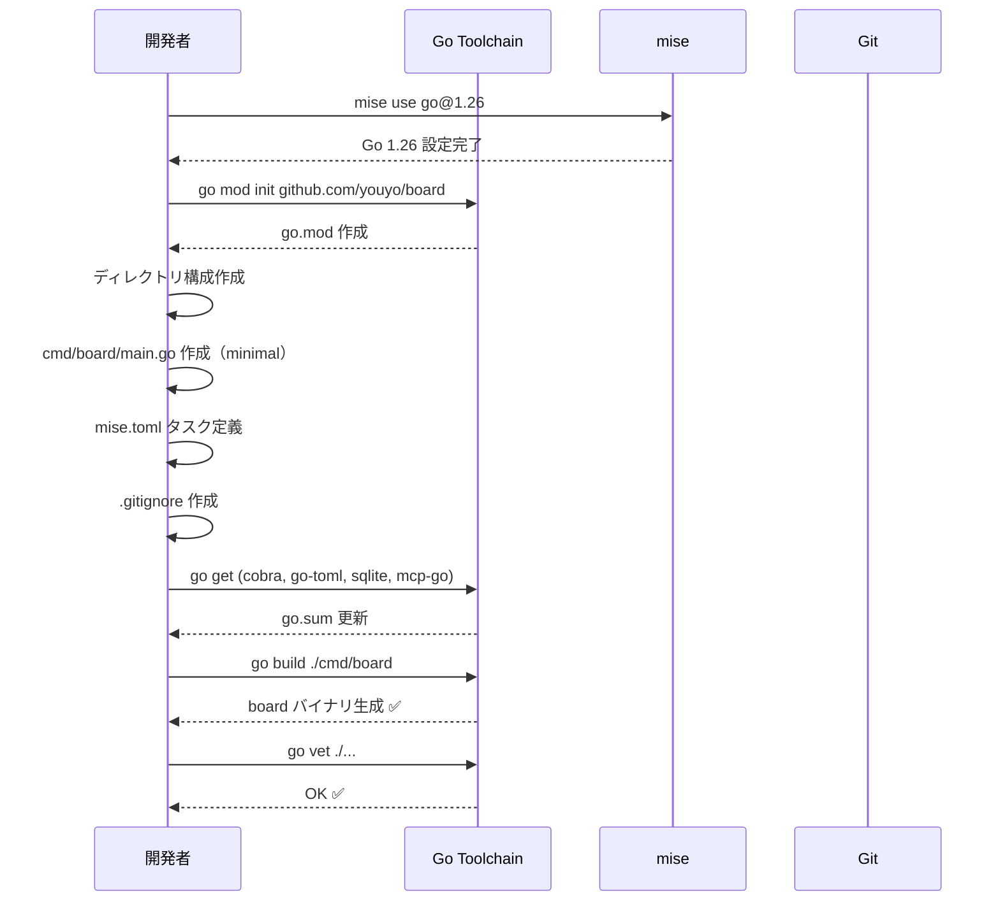

# M01: プロジェクト初期化

## Overview
| 項目 | 値 |
|------|---|
| ステータス | 未着手 |
| 依存 | なし（最初のマイルストーン） |
| 対象ファイル | go.mod, go.sum, mise.toml, .gitignore, cmd/board/main.go, internal/ (空ディレクトリ構成) |

## Goal
Go モジュールの初期化、ディレクトリ構成の作成、主要依存ライブラリの追加、ビルド確認までを完了する。
`go build` で空の `board` バイナリが生成でき、`go test ./...` がパスする状態を目指す。

## Sequence Diagram



## TDD Test Design

| # | テストケース | 入力 | 期待出力 |
|---|-------------|------|---------|
| 1 | バイナリビルド成功 | `go build ./cmd/board` | exit code 0, バイナリ生成 |
| 2 | go vet パス | `go vet ./...` | exit code 0 |
| 3 | go test パス | `go test ./...` | exit code 0（テストなしでもパス） |
| 4 | main.go 実行 | `./board` | バージョンまたはヘルプ出力 |

## Implementation Steps

### Step 1: mise + Go 環境設定
- [ ] `mise.toml` に `go@1.26` を指定（既存ファイルにタスクも追加）
- [ ] `mise install` で Go 1.26 をインストール

### Step 2: Go モジュール初期化
- [ ] `go mod init github.com/youyo/board`

### Step 3: ディレクトリ構成作成
スペック §6 に準拠した全ディレクトリを作成する。空ディレクトリには `.gitkeep` を配置。

```
board/
├── cmd/
│   └── board/
│       └── main.go
├── internal/
│   ├── cli/
│   ├── app/
│   ├── config/
│   ├── boardapi/
│   ├── cache/
│   ├── refresh/
│   ├── repository/
│   ├── service/
│   │   ├── api/
│   │   └── find/
│   ├── mcpserver/
│   ├── output/
│   └── util/
├── migrations/
│   └── sqlite/
├── docs/
│   └── specs/  (既存)
├── plans/      (既存)
├── go.mod
├── mise.toml
└── .gitignore
```

### Step 4: main.go 最小実装
- [ ] Cobra の root command を使った最小 main.go
- [ ] `--version` フラグでバージョン出力

```go
// cmd/board/main.go
package main

import (
    "fmt"
    "os"

    "github.com/spf13/cobra"
)

var version = "dev"

func main() {
    rootCmd := &cobra.Command{
        Use:     "board",
        Short:   "BOARD API CLI / MCP server",
        Version: version,
    }
    if err := rootCmd.Execute(); err != nil {
        fmt.Fprintln(os.Stderr, err)
        os.Exit(1)
    }
}
```

### Step 5: 主要依存ライブラリ追加
- [ ] `go get github.com/spf13/cobra`
- [ ] `go get github.com/pelletier/go-toml/v2`
- [ ] `go get modernc.org/sqlite`
- [ ] `go get github.com/mark3labs/mcp-go`

### Step 6: mise タスク定義
- [ ] mise.toml に build, test, vet, clean, fmt タスクを定義

```toml
# mise.toml
[tools]
go = "1.26"

[env]
BINARY = "board"
VERSION = "dev"

[tasks.build]
description = "Build board binary"
run = 'go build -ldflags "-X main.version=$VERSION" -o $BINARY ./cmd/board'

[tasks.test]
description = "Run all tests"
run = "go test ./..."

[tasks.vet]
description = "Run go vet"
run = "go vet ./..."

[tasks.clean]
description = "Remove built binary"
run = "rm -f $BINARY"

[tasks.fmt]
description = "Format Go source files"
run = "gofmt -s -w ."
```

### Step 7: .gitignore 作成
- [ ] Go バイナリ、IDE ファイル、OS ファイル等を除外

```gitignore
# Binary
board
*.exe

# Go
vendor/

# IDE
.idea/
.vscode/
*.swp
*.swo

# OS
.DS_Store
Thumbs.db

# Cache DB (ローカルテスト用)
*.db
*.db-journal
*.db-wal
*.db-shm
```

### Step 8: ビルド + 検証
- [ ] `mise run build` → バイナリ生成確認
- [ ] `mise run vet` → パス確認
- [ ] `mise run test` → パス確認
- [ ] `./board --version` → バージョン出力確認
- [ ] `./board --help` → ヘルプ出力確認

## Risks
| リスク | 影響度 | 対策 |
|--------|--------|------|
| Go 1.26 が mise で未提供 | 高 | `go@latest` にフォールバック。ユーザーに確認 |
| mcp-go の Go 1.26 互換性 | 中 | go.mod の toolchain directive で調整 |
| modernc.org/sqlite の大量依存 | 低 | go.sum が大きくなるが機能上は問題なし |

## 完了条件
- [x] `mise run build` が成功し `./board` バイナリが生成される
- [x] `./board --version` が `dev` を出力する
- [x] `mise run test` と `mise run vet` がパスする
- [x] 全ディレクトリ構成がスペック §6 に準拠している
- [x] go.mod に4つの主要依存が記録されている
