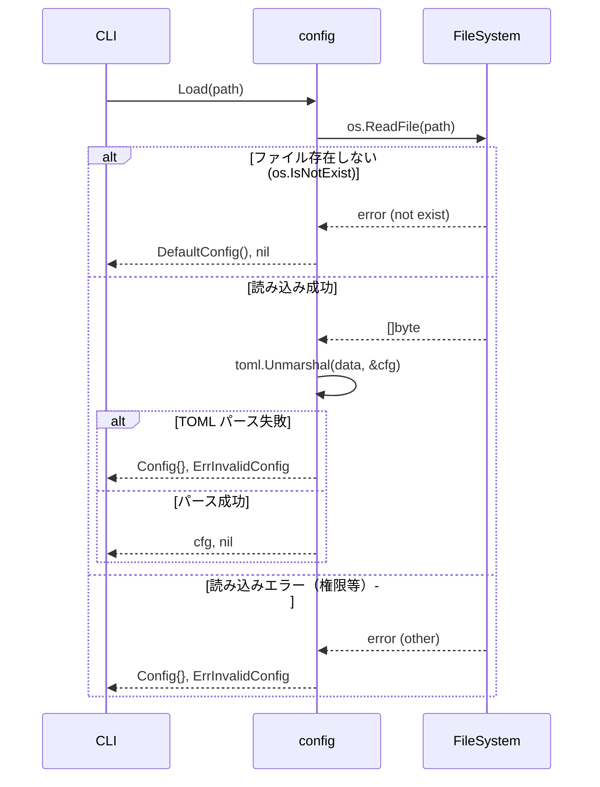
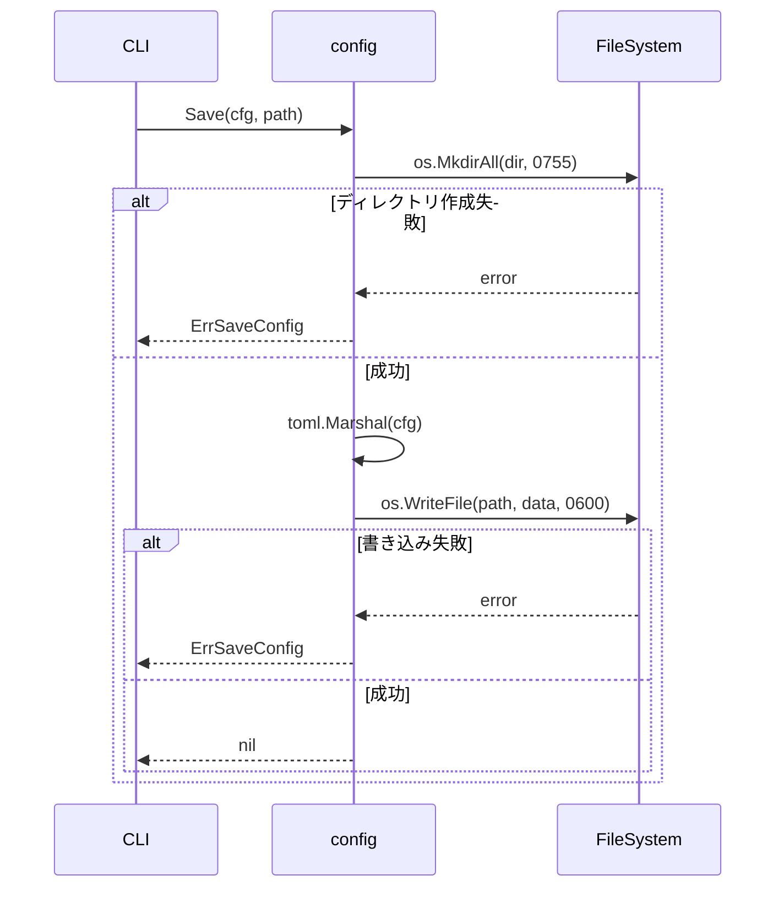
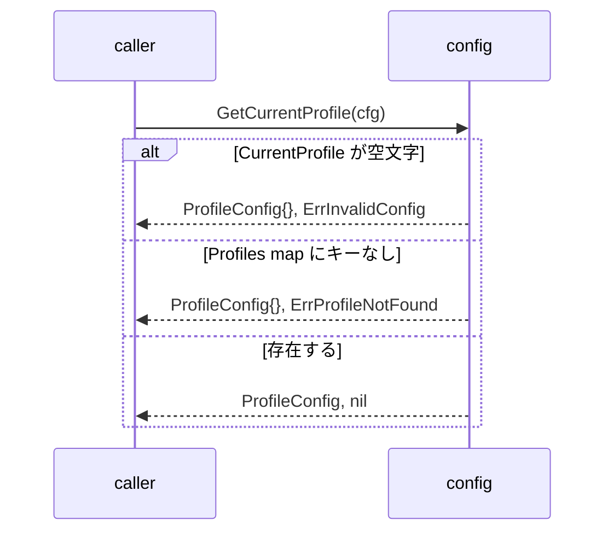

# マイルストーン M02: config パッケージ

## 概要

`internal/config` パッケージを実装する。TOML 形式の設定ファイル（`~/.config/board/config.toml`）の読み書き、XDG準拠のパス解決、プロファイル管理、デフォルト値設定を提供する。

## スコープ

### 実装範囲

- `Config` / `ProfileConfig` 型定義（go-toml/v2 タグ付き）
- XDG準拠の config path 解決（`BOARD_CONFIG_PATH` 環境変数による上書きも対応）
- TOML load / save（ファイル 0600 パーミッションで作成）
- デフォルト値の定義と適用
- プロファイル管理（default + 複数プロファイル）
- `GetCurrentProfile()` / `SetCurrentProfile()` ユーティリティ
- ユニットテスト（TDD: Red→Green→Refactor）

### スコープ外

- `board configure` 対話型コマンド（M03 で実装）
- secrets マスク表示（M03 で実装）
- 環境変数による API Key/Token の上書き（M04 以降）

---

## テスト設計書

### 正常系ケース

| ID | テスト名 | 入力 | 期待出力 |
|----|---------|------|---------|
| T01 | デフォルト Config 生成 | なし | `CurrentProfile="default"`, `Timezone="UTC"` |
| T02 | デフォルト ProfileConfig 生成 | なし | `BaseURL="https://api.the-board.jp"`, `DailyAutoRefresh=true`, `RequestTimeoutSeconds=30`, `RetryMax=5`, `PrettyDefault=false` |
| T03 | TOML ファイルへの保存 | 有効な Config struct + tmp path | ファイル作成、0600 パーミッション |
| T04 | TOML ファイルからの読み込み | 有効な TOML ファイル | Config struct が正しく復元される |
| T05 | 複数プロファイル保存/読み込み | `default` + `readonly` プロファイル | 両プロファイルが正しく保存・復元される |
| T06 | XDG パス解決（`XDG_CONFIG_HOME` 設定あり） | `XDG_CONFIG_HOME=/tmp/xdg` | `/tmp/xdg/board/config.toml` |
| T07 | XDG パス解決（`XDG_CONFIG_HOME` 未設定） | `HOME=/tmp/home` | `/tmp/home/.config/board/config.toml` |
| T08 | `BOARD_CONFIG_PATH` 環境変数 | `BOARD_CONFIG_PATH=/tmp/custom.toml` | `/tmp/custom.toml` |
| T09 | `GetCurrentProfile()` | `CurrentProfile="readonly"`, `Profiles={"readonly": ...}` | `ProfileConfig` が返る |
| T10 | 存在しないファイルのロード → defaults | 存在しないパス | デフォルト Config が返る（エラーなし） |
| T11 | 存在するディレクトリが親にない場合の Save | 新規パス | 親ディレクトリが自動作成される |

### 異常系ケース

| ID | テスト名 | 入力 | 期待エラー |
|----|---------|------|----------|
| E01 | 不正な TOML | 文法エラーのある TOML ファイル | `ErrInvalidConfig` |
| E02 | 書き込み権限なし | 読み取り専用ディレクトリへの Save | `ErrSaveConfig` |
| E03 | 存在しないプロファイルの取得 | `GetCurrentProfile()` でプロファイル名が Profiles map にない | `ErrProfileNotFound` |
| E04 | `current_profile` が空文字 | `CurrentProfile=""` | `ErrInvalidConfig` |

### エッジケース

| ID | テスト名 | 入力 | 期待出力 |
|----|---------|------|---------|
| EC01 | 空の Profiles map の TOML ロード | `profiles = {}` | `Profiles` が空 map |
| EC02 | ProfileConfig の部分的な上書き（一部フィールドのみ指定） | `base_url` のみ指定の TOML | 未指定フィールドはゼロ値（デフォルト適用は Load 後に明示呼び出し） |
| EC03 | HOME 未設定時のフォールバック | `HOME=""`, `XDG_CONFIG_HOME=""` | `/etc/board/config.toml` または実装定義の fallback |

---

## 実装手順

### Step 1: エラー定義（`internal/config/errors.go`）

- ファイル: `internal/config/errors.go`
- 概要: sentinel error 定義
- 依存: なし

```go
var (
    ErrInvalidConfig  = errors.New("invalid config")
    ErrSaveConfig     = errors.New("failed to save config")
    ErrProfileNotFound = errors.New("profile not found")
)
```

### Step 2: 型定義（`internal/config/config.go`）

- ファイル: `internal/config/config.go`
- 概要: `Config` / `ProfileConfig` struct 定義 + デフォルト値関数
- 依存: なし

```go
type Config struct {
    CurrentProfile string                    `toml:"current_profile"`
    Timezone       string                    `toml:"timezone"`
    Profiles       map[string]ProfileConfig  `toml:"profiles"`
}

type ProfileConfig struct {
    BaseURL               string `toml:"base_url"`
    APIKey                string `toml:"api_key"`
    APIToken              string `toml:"api_token"`
    DailyAutoRefresh      bool   `toml:"daily_auto_refresh"`
    RequestTimeoutSeconds int    `toml:"request_timeout_seconds"`
    RetryMax              int    `toml:"retry_max"`
    PrettyDefault         bool   `toml:"pretty_default"`
}

func DefaultConfig() Config {
    return Config{
        CurrentProfile: "default",
        Timezone:       "UTC",
        Profiles: map[string]ProfileConfig{
            "default": DefaultProfileConfig(),
        },
    }
}

func DefaultProfileConfig() ProfileConfig {
    return ProfileConfig{
        BaseURL:               "https://api.the-board.jp",
        DailyAutoRefresh:      true,
        RequestTimeoutSeconds: 30,
        RetryMax:              5,
        PrettyDefault:         false,
    }
}
```

### Step 3: パス解決（`internal/config/path.go`）

- ファイル: `internal/config/path.go`
- 概要: XDG準拠 + `BOARD_CONFIG_PATH` 環境変数対応
- 依存: なし

優先順位:
1. `BOARD_CONFIG_PATH` 環境変数
2. `XDG_CONFIG_HOME/board/config.toml`
3. `HOME/.config/board/config.toml`
4. `/etc/board/config.toml`（フォールバック）

### Step 4: Load / Save（`internal/config/loader.go`）

- ファイル: `internal/config/loader.go`
- 概要: TOML ファイルの読み書き実装
- 依存: `pelletier/go-toml/v2`, Step 2, Step 3

```
Load(path string) (Config, error):
  - ファイル不存在 → DefaultConfig() を返す（エラーなし）
  - 不正 TOML → ErrInvalidConfig
  - 成功 → Config struct

Save(cfg Config, path string) error:
  - 親ディレクトリを os.MkdirAll で作成
  - os.WriteFile（0600 パーミッション）
  - 失敗 → ErrSaveConfig でラップ
```

### Step 5: プロファイルユーティリティ（`internal/config/profile.go`）

- ファイル: `internal/config/profile.go`
- 概要: プロファイル操作ヘルパー
- 依存: Step 2

```
GetCurrentProfile(cfg Config) (ProfileConfig, error):
  - cfg.CurrentProfile が空 → ErrInvalidConfig
  - Profiles map に存在しない → ErrProfileNotFound
  - 成功 → ProfileConfig

SetCurrentProfile(cfg *Config, name string):
  - cfg.CurrentProfile を name に更新

AddOrUpdateProfile(cfg *Config, name string, profile ProfileConfig):
  - cfg.Profiles[name] = profile

ApplyDefaults(p ProfileConfig) ProfileConfig:
  - TOMLパーサーはゼロ値と「未指定」を区別できないため、
    ロード後に呼び出してデフォルト値を補完する
  - BaseURL が空文字 → "https://api.the-board.jp" を設定
  - RequestTimeoutSeconds が 0 → 30 を設定
  - RetryMax が 0 → 5 を設定
  - DailyAutoRefresh は bool のゼロ値(false)がデフォルトと異なるため注意:
    Load 後に明示的に ApplyDefaults を呼び出す設計とする
    （将来的にポインタ型への移行を検討）
```

> **注意**: `DailyAutoRefresh` のデフォルトが `true` なのに TOML ゼロ値が `false` という非対称性がある。
> M02 では `ApplyDefaults` で対処するが、将来的に `*bool` ポインタ型への移行を M03 以降で検討する。

### Step 6: テスト実装（`internal/config/config_test.go`）

- ファイル: `internal/config/config_test.go`
- 概要: T01〜T11, E01〜E04, EC01〜EC03 の全テスト
- 依存: Step 1〜5, `os.TempDir()` でテンポラリパス使用

---

## アーキテクチャ検討

### 既存パターンとの整合性

- `internal/config` は他のパッケージ（`app`, `cli`, `boardapi`）から参照される最下層パッケージ
- 循環依存を防ぐため、config パッケージは他の internal パッケージを import しない
- エラーは sentinel error パターン（errors.New）で統一

### 新規モジュール設計

```
internal/config/
├── config.go    # Config / ProfileConfig 型定義 + デフォルト値
├── path.go      # config path 解決（XDG + env var）
├── loader.go    # TOML load / save
├── profile.go   # プロファイル操作ユーティリティ
├── errors.go    # sentinel errors
└── config_test.go  # 全ユニットテスト
```

### 依存関係

```
internal/config（このパッケージ）
  ← internal/app
  ← internal/cli
  ← internal/boardapi（config 参照のみ）
  ← internal/refresh（config 参照のみ）
```

---

## リスク評価

| リスク | 重大度 | 対策 |
|--------|--------|------|
| XDG パス解決の OS 差異（Linux/macOS） | Medium | `os.UserConfigDir()` を活用し、自前実装を最小化 |
| TOML 部分パース（フィールド追加時の後方互換） | Low | go-toml/v2 は未知フィールドをデフォルトで無視するため問題なし |
| ファイルパーミッション 0600 設定の確認 | Low | `os.Stat` でパーミッション確認するテストを追加 |
| secrets（api_key/api_token）のログ漏洩 | High | config パッケージでは String() / GoString() を未定義にする（デバッグ出力抑止） |
| 将来の config スキーマ変更時の移行 | Medium | ロードバック互換を保証するため、未知フィールドはスキップ（go-toml/v2 デフォルト動作） |
| テスト環境での HOME 変数汚染 | Low | テスト内で `t.Setenv` を使い、環境変数を安全に上書き・復元 |
| HOME/XDG 未設定時フォールバック | Low | `os.UserConfigDir()` が失敗した場合は `$TMPDIR/board/config.toml` または error を返す。`/etc/board/` は書き込み権限なし環境では使用不可 |
| DailyAutoRefresh ゼロ値問題 | Medium | bool型のデフォルトが true だが TOML ゼロ値は false。`ApplyDefaults()` をロード後に明示呼び出しして補完する |
| 並行アクセスリスク | Low | M02スコープは「CLI起動時1回読み込み」のみ。並行書き込みは発生しない。将来の daemon 化時に file lock を検討 |

---

## シーケンス図

### Load フロー



### Save フロー



### GetCurrentProfile フロー



---

## チェックリスト

### 観点1: 実装実現可能性（5項目）

- [x] 手順の抜け漏れがないか（Step 1〜6 で完結）
- [x] 各ステップが十分に具体的か（ファイル名・関数名・ロジック明記）
- [x] 依存関係が明示されているか（各 Step に依存先を記載）
- [x] 変更対象ファイルが網羅されているか（6ファイル列挙）
- [x] 影響範囲が正確に特定されているか（他パッケージへの影響なし、config は被参照のみ）

### 観点2: TDDテスト設計の品質（6項目）

- [x] 正常系テストケースが網羅されているか（T01〜T11: 11ケース）
- [x] 異常系テストケースが定義されているか（E01〜E04: 4ケース）
- [x] エッジケースが考慮されているか（EC01〜EC03: 3ケース）
- [x] 入出力が具体的に記述されているか（各テストに入力・期待出力を明記）
- [x] Red→Green→Refactorの順序が守られているか（Step 6 が最後に実装）
- [x] モック/スタブの設計が適切か（`t.Setenv` + `os.TempDir()` で外部依存を隔離）

### 観点3: アーキテクチャ整合性（5項目）

- [x] 既存の命名規則に従っているか（Go慣習: CamelCase, パッケージ名 config）
- [x] 設計パターンが一貫しているか（sentinel error, デフォルト値関数）
- [x] モジュール分割が適切か（型/パス/ロード/プロファイル/エラー で責務分離）
- [x] 依存方向が正しいか（config は他 internal パッケージを import しない）
- [x] 類似機能との統一性があるか（Go 標準スタイルに準拠）

### 観点4: リスク評価と対策（6項目）

- [x] リスクが適切に特定されているか（6リスク列挙）
- [x] 対策が具体的か（各リスクに具体的な対策を記述）
- [x] フェイルセーフが考慮されているか（ファイル不存在時はデフォルト返却）
- [x] パフォーマンスへの影響が評価されているか（config は起動時1回読み込み、影響軽微）
- [x] セキュリティ観点が含まれているか（0600 パーミッション、String() 未定義）
- [x] ロールバック計画があるか（config は単一ファイル、手動削除で初期化可能）

### 観点5: シーケンス図の完全性（5項目）

- [x] 正常フローが記述されているか（Load/Save/GetCurrentProfile 各正常系）
- [x] エラーフローが記述されているか（各フローのエラー分岐を網羅）
- [x] ユーザー・システム・外部API間の相互作用が明確か（CLI→config→FileSystem）
- [x] タイミング・同期的な処理の制御が明記されているか（同期 I/O、ゴルーチン不使用）
- [x] リトライ・タイムアウト等の例外ハンドリングが図に含まれているか（config は簡素な I/O のみ、リトライ不要）

---

## ドキュメント更新

- `README.md`: 設定ファイルのパス・スキーマ・プロファイル概念を追記（M03 完了時に統合記述）
- `docs/specs/board_cli_mcp_ultra_detailed_design_ja.md`: 変更なし（スペック準拠実装のため）
- CHANGELOG: `feat: internal/config パッケージ実装` を追記

---

## Next Action

> **このプランが承認されました。以下を順番に実行してください:**
>
> 1. `Skill(devflow:implement)` — このプランに基づいて実装を開始
>
> ユーザーの追加指示は不要です。即座に実行してください。
