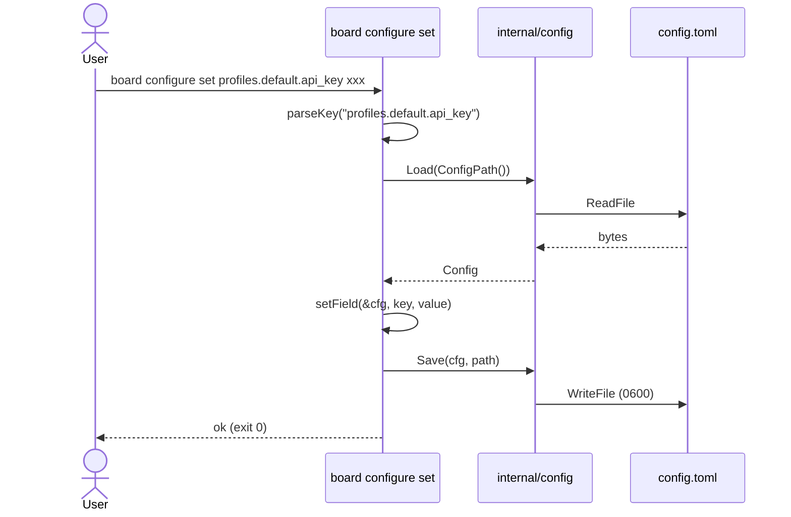
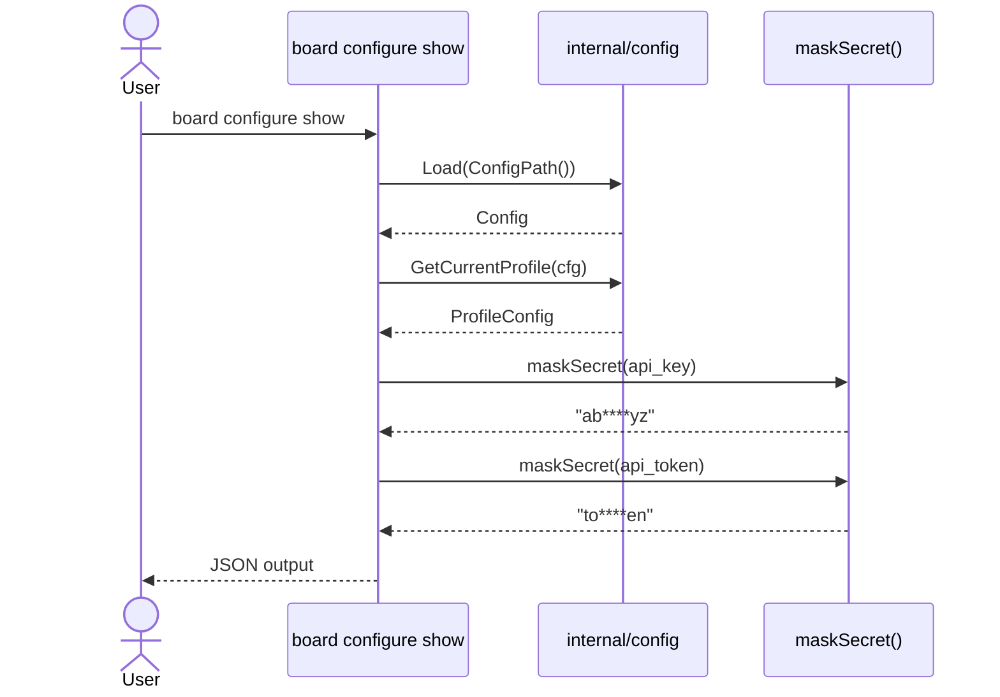
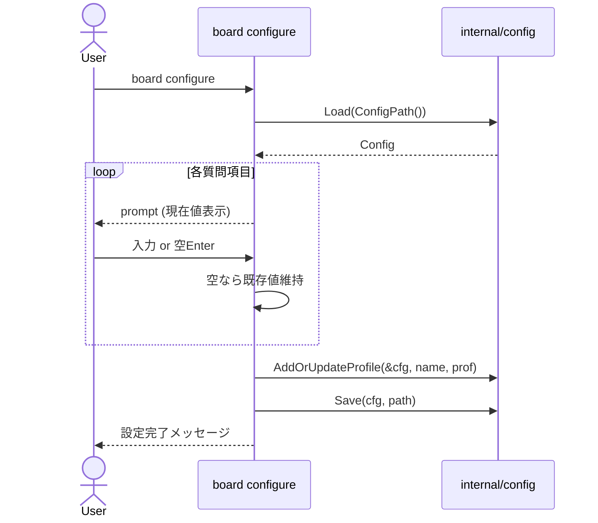

# M03: configure CLI コマンド 実装詳細計画

## 1. 概要

`board configure` 系サブコマンドを実装する。
`internal/config` パッケージ（M02 完了済み）をラップし、Cobra CLI コマンドとして公開する。
TDD（Red → Green → Refactor）で進め、secrets マスクを徹底する。

---

## 2. ゴール

| サブコマンド | 説明 |
|---|---|
| `board configure` | 対話式：profile名, base_url, api_key, api_token, daily_auto_refresh, timezone, current profile設定 |
| `board configure set KEY VALUE` | 単一フィールド更新 |
| `board configure get KEY` | 単一フィールド取得（secrets はマスク） |
| `board configure show` | 現在プロファイル全体表示（secrets マスク） |
| `board configure list-profiles` | プロファイル名一覧 |
| `board configure use PROFILE` | current_profile 切り替え |
| `board configure current-profile` | 現在のプロファイル名表示 |
| `board configure path` | config.toml の実パス表示 |

---

## 3. ディレクトリ・ファイル構成

```
internal/cli/
  configure.go                  # NewConfigureCmd() + 対話ロジック
  configure_set.go              # NewConfigureSetCmd()
  configure_get.go              # NewConfigureGetCmd()
  configure_show.go             # NewConfigureShowCmd()
  configure_list_profiles.go    # NewConfigureListProfilesCmd()
  configure_use.go              # NewConfigureUseCmd()
  configure_current_profile.go  # NewConfigureCurrentProfileCmd()
  configure_path.go             # NewConfigurePathCmd()

internal/cli/configure_test.go              # 統合テスト（全サブコマンド）
internal/cli/configure_set_test.go
internal/cli/configure_get_test.go
internal/cli/configure_show_test.go
internal/cli/configure_list_profiles_test.go
internal/cli/configure_use_test.go
internal/cli/configure_current_profile_test.go
internal/cli/configure_path_test.go

internal/cli/testhelper_test.go             # テスト共通ヘルパー

cmd/board/main.go               # サブコマンド登録
```

---

## 4. secrets マスク仕様

`configure show` / `configure get` でシークレットフィールドを表示する際は以下の形式に変換する。

| 条件 | 出力 |
|---|---|
| 長さ 0 | `""` (空文字) |
| 長さ 1〜3 | `"****"` (固定4文字マスク) |
| 長さ 4〜7 | 先頭1文字 + `"****"` + 末尾1文字 |
| 長さ 8〜 | 先頭2文字 + `"****"` + 末尾2文字 |

例: `"ab****yz"` （8文字以上）

シークレットフィールド: `api_key`, `api_token`

`configure set` でのシークレットフィールド書き込みは許可する（値をそのまま保存）。
`configure get` でシークレットフィールドを取得した場合はマスクして返す。

---

## 5. KEY パス仕様（configure set / get）

ドット区切りで Config 構造を指定する。

```
timezone
current_profile
profiles.<profile_name>.base_url
profiles.<profile_name>.api_key
profiles.<profile_name>.api_token
profiles.<profile_name>.daily_auto_refresh
profiles.<profile_name>.request_timeout_seconds
profiles.<profile_name>.retry_max
profiles.<profile_name>.pretty_default
```

**パース規則:**
- `timezone`, `current_profile` → トップレベルフィールド
- `profiles.<name>.<field>` → ProfileConfig フィールド
- 上記以外 → `ErrInvalidKey` エラー

---

## 6. TDD 設計

### 6.1 テスト戦略

各コマンドは `cobra.Command` の `Args` / `RunE` をテストする。
テスト用の config ファイルは `os.TempDir()` 下に作成し、`BOARD_CONFIG_PATH` 環境変数で差し替える。

```go
// testhelper_test.go
func newTempConfig(t *testing.T) (cfgPath string, cleanup func()) {
    t.Helper()
    dir := t.TempDir()
    path := filepath.Join(dir, "config.toml")
    t.Setenv("BOARD_CONFIG_PATH", path)
    return path, func() {}
}
```

### 6.2 テストケース一覧

#### configure path
- [ ] ConfigPath() の値がそのまま stdout に出力される
- [ ] BOARD_CONFIG_PATH が設定されている場合その値が返る

#### configure current-profile
- [ ] デフォルト config では "default" が返る
- [ ] SetCurrentProfile 後は新しい名前が返る

#### configure list-profiles
- [ ] プロファイルが1つの場合、その名前が返る
- [ ] プロファイルが複数の場合、改行区切りで全名前が返る（ソート済み）

#### configure use PROFILE
- [ ] 存在するプロファイルを指定 → current_profile が更新され config.toml に保存される
- [ ] 存在しないプロファイルを指定 → エラー（ErrProfileNotFound）
- [ ] 引数なし → cobra の args エラー

#### configure get KEY
- [ ] `timezone` を get → UTC が返る
- [ ] `profiles.default.base_url` → "https://api.the-board.jp" が返る
- [ ] `profiles.default.api_key` → マスクされた値が返る
- [ ] 不正なキー → エラー
- [ ] 引数なし → cobra の args エラー

#### configure set KEY VALUE
- [ ] `timezone` を set → config.toml に反映される
- [ ] `profiles.default.api_key` を set → 平文で保存される
- [ ] `profiles.default.daily_auto_refresh` を set "true"/"false" → bool として保存
- [ ] 不正なキー → エラー
- [ ] 引数1個 → cobra の args エラー

#### configure show
- [ ] デフォルト config → JSON 出力にシークレットがマスクされている
- [ ] `--profile` 指定 → そのプロファイルの情報が表示される
- [ ] 存在しないプロファイルを指定 → エラー

#### configure (対話式)
- [ ] 全質問に回答 → config.toml に保存される
- [ ] 空入力でスキップ → 既存値が維持される
- [ ] 新規プロファイル名を入力 → 新規作成される

---

## 7. 実装詳細

### 7.1 configure (対話式)

```go
// internal/cli/configure.go

func NewConfigureCmd() *cobra.Command {
    var profileFlag string
    cmd := &cobra.Command{
        Use:   "configure",
        Short: "対話式で設定を編集する",
        RunE: func(cmd *cobra.Command, args []string) error {
            return runConfigure(cmd, profileFlag)
        },
    }
    cmd.Flags().StringVarP(&profileFlag, "profile", "p", "", "対象プロファイル名")
    // サブコマンド登録
    cmd.AddCommand(
        NewConfigureSetCmd(),
        NewConfigureGetCmd(),
        NewConfigureShowCmd(),
        NewConfigureListProfilesCmd(),
        NewConfigureUseCmd(),
        NewConfigureCurrentProfileCmd(),
        NewConfigurePathCmd(),
    )
    return cmd
}

func runConfigure(cmd *cobra.Command, profileName string) error {
    path := config.ConfigPath()
    cfg, err := config.Load(path)
    if err != nil { return err }

    if profileName == "" {
        profileName = cfg.CurrentProfile
    }

    // 既存プロファイルを取得（なければデフォルト値）
    prof, _ := cfg.Profiles[profileName] // map からの読み出し（なければゼロ値）
    prof = config.ApplyDefaults(prof)

    // 質問 1: profile 名
    // 質問 2: base_url
    // 質問 3: api_key（現在値はマスク表示）
    // 質問 4: api_token（現在値はマスク表示）
    // 質問 5: daily_auto_refresh
    // 質問 6: timezone（グローバル）
    // 質問 7: current profile にするか
    // ... 各質問を実装
    return nil
}
```

**対話式入力実装:**
- `bufio.NewReader(os.Stdin)` で 1 行読み取り
- 空入力なら既存値を維持
- secrets フィールドは現在値をマスク表示してプロンプト

### 7.2 configure set

KEY パスのパースロジックを共通関数に切り出す。

```go
// parseKey は "profiles.default.api_key" を分解する
func parseKey(key string) (scope string, profileName string, field string, err error)
```

bool 型フィールド（daily_auto_refresh, pretty_default）は `strconv.ParseBool` で変換。
int 型フィールド（request_timeout_seconds, retry_max）は `strconv.Atoi` で変換。

### 7.3 configure get

`parseKey` を使用して値を取得し、secrets フィールドはマスクして出力。

### 7.4 configure show

```json
{
  "profile": "default",
  "config": {
    "base_url": "https://api.the-board.jp",
    "api_key": "ab****yz",
    "api_token": "to****en",
    "daily_auto_refresh": true,
    "request_timeout_seconds": 30,
    "retry_max": 5,
    "pretty_default": false
  },
  "global": {
    "current_profile": "default",
    "timezone": "UTC"
  }
}
```

### 7.5 configure list-profiles

```
default
readonly
production
```
（ソート済み、改行区切り）

### 7.6 configure use

```go
// プロファイルが存在しない場合はエラー
if _, ok := cfg.Profiles[profileName]; !ok {
    return fmt.Errorf("%w: %q", config.ErrProfileNotFound, profileName)
}
config.SetCurrentProfile(&cfg, profileName)
return config.Save(cfg, path)
```

---

## 8. Mermaid シーケンス図

### 8.1 configure set



### 8.2 configure show



### 8.3 configure (対話式)



---

## 9. エラーハンドリング

| エラー種別 | 対応 |
|---|---|
| config.ErrInvalidConfig | 標準エラーに出力して exit 1 |
| config.ErrProfileNotFound | わかりやすいメッセージで exit 1 |
| config.ErrSaveConfig | 保存失敗メッセージで exit 1 |
| 不正なキーパス | "invalid key: %q" メッセージで exit 1 |
| 型変換エラー | "invalid value for %q: %v" で exit 1 |

エラーは `cmd.PrintErrln()` または `return err`（cobra が stderr に出力）を使用。
secrets をエラーメッセージに含めない。

---

## 10. リスク評価

| リスク | 影響度 | 発生確率 | 対策 |
|---|---|---|---|
| 対話式入力のテスト困難 | 中 | 高 | stdin を io.Reader で差し替え可能にする。テストでは `strings.NewReader` を使用 |
| DailyAutoRefresh の bool デフォルト問題 | 中 | 中 | `configure set` では string → bool 変換のみ。ApplyDefaults は対話式のみ呼ぶ |
| config.toml の concurrent write | 低 | 低 | CLI は基本的に1プロセス。ファイルロックは M04 以降で検討 |
| secrets がログ出力に漏れる | 高 | 低 | ProfileConfig.String()/GoString() 実装済み。エラーメッセージで value を直接 format しない |
| configure use で存在しないプロファイル指定 | 低 | 中 | 保存前にプロファイル存在チェックを実施 |
| キーパスの拡張性 | 低 | 低 | parseKey を switch 文で実装。将来フィールド追加時はケース追加のみ |

---

## 11. 実装順序（TDD サイクル）

### Step 1: テストヘルパーと skeleton
1. `internal/cli/testhelper_test.go` に `newTempConfig()` 実装
2. 各コマンドファイルに空の `NewXxxCmd()` を作成（コンパイルが通る状態）

### Step 2: configure path（最もシンプル）
1. テスト Red: `configure path` が ConfigPath() を返すことを確認
2. 実装 Green
3. Refactor

### Step 3: configure current-profile / list-profiles / use
1. テスト Red
2. 実装 Green
3. Refactor

### Step 4: configure get / set（parseKey ロジック）
1. テスト Red（parseKey のユニットテストを含む）
2. 実装 Green
3. Refactor

### Step 5: configure show（マスクロジック）
1. テスト Red（maskSecret のユニットテストを含む）
2. 実装 Green
3. Refactor

### Step 6: configure (対話式)
1. テスト Red（stdin モック）
2. 実装 Green
3. Refactor

### Step 7: cmd/board/main.go へのサブコマンド登録
1. rootCmd に `NewConfigureCmd()` を `AddCommand`
2. `go build ./...` 確認

### Step 8: 最終検証
1. `go test ./...`
2. `go vet ./...`
3. git commit

---

## 12. 前提・制約

- 対話式では `bufio.Scanner` または `bufio.Reader` を使用する
- テスト時に stdin を差し替えるため、`runConfigure` は `io.Reader` を引数に取る内部関数にする
- `internal/cli` パッケージは `internal/config` のみに依存する（app, boardapi 等には依存しない）
- 出力は stdout に直接 `fmt.Fprintln(cmd.OutOrStdout(), ...)` で書く
- エラーは `return fmt.Errorf(...)` で cobra に委ねる（cobra が stderr に出力する）
