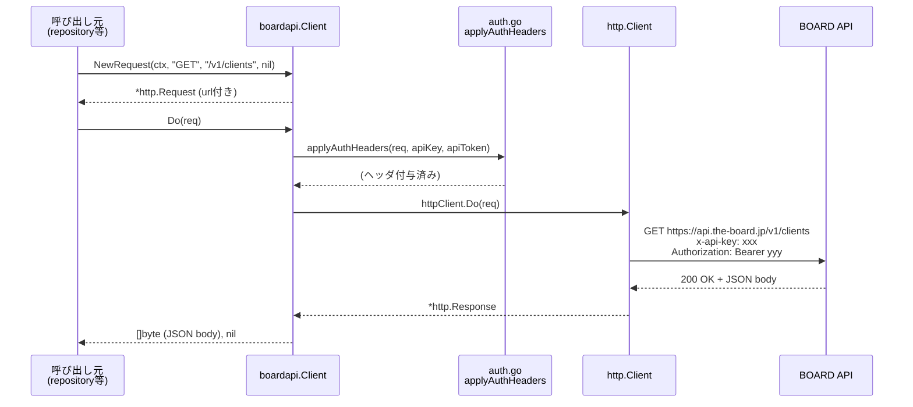
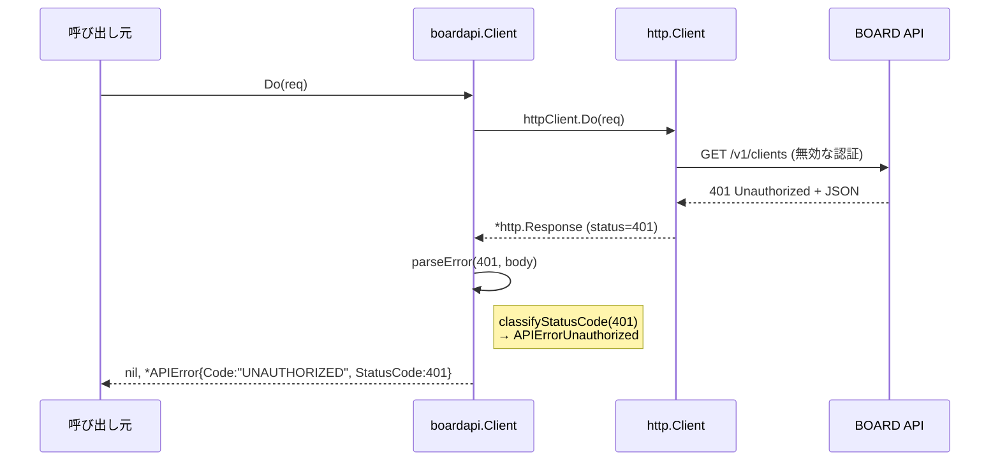
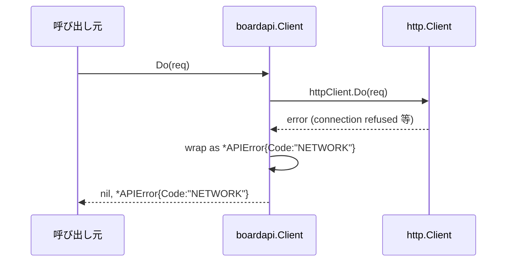

# M04: boardapi 共通クライアント基盤

## 概要

`internal/boardapi` パッケージに BOARD API 向け HTTP クライアントの基盤を実装する。
retry・pagination は M05 スコープ。本マイルストーンでは単純なリクエスト/レスポンスを完成させる。

## 目標

- [x] Client 構造体 + HTTP transport
- [x] 認証ヘッダ付与 (x-api-key + Authorization: Bearer)
- [x] APIError 型 + エラー正規化
- [x] httptest によるテスト (TDD: Red→Green→Refactor)

---

## フェーズ1: 要件と制約

### 入力

| 項目 | 型 | 出所 |
|------|----|------|
| baseURL | string | `ProfileConfig.BaseURL`（デフォルト: `https://api.the-board.jp`） |
| apiKey | string | `ProfileConfig.APIKey` |
| apiToken | string | `ProfileConfig.APIToken` |
| httpClient | *http.Client | 呼び出し元から注入（nil なら内部生成） |
| timeout | time.Duration | `ProfileConfig.RequestTimeoutSeconds` から変換 |

### M04 スコープ外

- retry（M05）
- pagination（M05）
- resource ごとのエンドポイントメソッド（M06〜）

---

## フェーズ2: ファイル構成

```
internal/boardapi/
├── client.go        # Client 構造体 + New() + Do() + doRequest()
├── auth.go          # 認証ヘッダ付与ロジック（applyAuthHeaders）
├── error.go         # APIError 型 + エラー正規化 (parseError)
└── client_test.go   # httptest を使った全テスト
```

### 設計方針

- `auth.go` に認証詳細を閉じ込め、`client.go` から参照のみとする
- `error.go` に HTTP ステータス → `APIErrorCode` マッピングを集約
- `client.go` の公開 API は最小限: `New()` + `Do()`
- `Do()` は `*http.Request` を受け取り `[]byte, error` を返す（entity 型変換は呼び出し元責務）

---

## フェーズ3: 設計詳細

### 3.1 Client 構造体（client.go）

```go
package boardapi

import (
    "net/http"
    "time"
)

// Client は BOARD API への HTTP クライアント。
// retry / pagination は含まない（M05 スコープ）。
type Client struct {
    baseURL    string
    apiKey     string
    apiToken   string
    httpClient *http.Client
}

// ClientOption は Client の設定オプション。
type ClientOption func(*Client)

// WithHTTPClient はカスタム *http.Client を注入する（テスト用途）。
func WithHTTPClient(hc *http.Client) ClientOption {
    return func(c *Client) { c.httpClient = hc }
}

// New は Client を生成する。
// baseURL は末尾スラッシュを正規化する。
// httpClient が nil の場合は timeout 付きのデフォルトを使う。
func New(baseURL, apiKey, apiToken string, timeout time.Duration, opts ...ClientOption) *Client {
    c := &Client{
        baseURL:  strings.TrimRight(baseURL, "/"),
        apiKey:   apiKey,
        apiToken: apiToken,
        httpClient: &http.Client{
            Timeout: timeout,
        },
    }
    for _, o := range opts {
        o(c)
    }
    return c
}
```

### 3.2 Do メソッド（client.go）

```go
// Do はリクエストを実行し、成功レスポンスのボディを返す。
// 2xx 以外は *APIError として返す。
func (c *Client) Do(req *http.Request) ([]byte, error) {
    applyAuthHeaders(req, c.apiKey, c.apiToken)

    resp, err := c.httpClient.Do(req)
    if err \!= nil {
        return nil, &APIError{
            Code:    APIErrorNetwork,
            Message: err.Error(),
        }
    }
    defer resp.Body.Close()

    body, err := io.ReadAll(resp.Body)
    if err \!= nil {
        return nil, &APIError{
            Code:    APIErrorNetwork,
            Message: "failed to read response body: " + err.Error(),
        }
    }

    if resp.StatusCode >= 200 && resp.StatusCode < 300 {
        return body, nil
    }

    return nil, parseError(resp.StatusCode, body)
}

// NewRequest は baseURL を付与した *http.Request を生成するヘルパー。
// path は "/v1/clients" のように先頭スラッシュ付き。
func (c *Client) NewRequest(ctx context.Context, method, path string, body io.Reader) (*http.Request, error) {
    url := c.baseURL + path
    return http.NewRequestWithContext(ctx, method, url, body)
}
```

### 3.3 認証ヘッダ付与（auth.go）

```go
package boardapi

import "net/http"

// applyAuthHeaders は BOARD API の認証ヘッダを付与する。
// x-api-key: <APIKey>
// Authorization: Bearer <APIToken>
func applyAuthHeaders(req *http.Request, apiKey, apiToken string) {
    req.Header.Set("x-api-key", apiKey)
    req.Header.Set("Authorization", "Bearer "+apiToken)
}
```

### 3.4 APIError 型（error.go）

```go
package boardapi

import (
    "encoding/json"
    "fmt"
)

// APIErrorCode はエラー種別を表す文字列定数。
type APIErrorCode string

const (
    APIErrorUnauthorized APIErrorCode = "UNAUTHORIZED"  // 401
    APIErrorForbidden    APIErrorCode = "FORBIDDEN"      // 403
    APIErrorNotFound     APIErrorCode = "NOT_FOUND"      // 404
    APIErrorRateLimit    APIErrorCode = "RATE_LIMIT"     // 429
    APIErrorValidation   APIErrorCode = "VALIDATION"     // 400, 422
    APIErrorTemporary    APIErrorCode = "TEMPORARY"      // 5xx
    APIErrorNetwork      APIErrorCode = "NETWORK"        // transport エラー
    APIErrorUnknown      APIErrorCode = "UNKNOWN"        // その他
)

// APIError は BOARD API エラーを表す。
// error インターフェースを実装する。
type APIError struct {
    Code       APIErrorCode
    StatusCode int
    Message    string
    Body       string // 生レスポンスボディ（デバッグ用）
}

func (e *APIError) Error() string {
    return fmt.Sprintf("boardapi error [%s] status=%d: %s", e.Code, e.StatusCode, e.Message)
}

// boardAPIErrorBody は BOARD API のエラーレスポンス JSON 構造。
// 実際のフォーマットは API 仕様に合わせて調整する。
type boardAPIErrorBody struct {
    Message string `json:"message"`
    Error   string `json:"error"`
}

// parseError は HTTP ステータスとボディから *APIError を生成する。
func parseError(statusCode int, body []byte) *APIError {
    code := classifyStatusCode(statusCode)

    msg := extractMessage(body)
    return &APIError{
        Code:       code,
        StatusCode: statusCode,
        Message:    msg,
        Body:       string(body),
    }
}

// classifyStatusCode は HTTP ステータスを APIErrorCode にマッピングする。
func classifyStatusCode(statusCode int) APIErrorCode {
    switch {
    case statusCode == 400:
        return APIErrorValidation
    case statusCode == 401:
        return APIErrorUnauthorized
    case statusCode == 403:
        return APIErrorForbidden
    case statusCode == 404:
        return APIErrorNotFound
    case statusCode == 422:
        return APIErrorValidation
    case statusCode == 429:
        return APIErrorRateLimit
    case statusCode >= 500:
        return APIErrorTemporary
    default:
        return APIErrorUnknown
    }
}

// extractMessage は JSON ボディからエラーメッセージを抽出する。
// パース失敗時は空文字を返す。
func extractMessage(body []byte) string {
    var eb boardAPIErrorBody
    if err := json.Unmarshal(body, &eb); err \!= nil {
        return ""
    }
    if eb.Message \!= "" {
        return eb.Message
    }
    return eb.Error
}
```

---

## フェーズ4: シーケンス図

### 正常系フロー



### エラー系フロー（認証失敗）



### エラー系フロー（ネットワークエラー）



---

## フェーズ5: TDD テスト設計

### テストファイル: `internal/boardapi/client_test.go`

#### TDD サイクル

**Red フェーズ**: まずテストを書き、コンパイルエラーまたは失敗を確認する。
**Green フェーズ**: テストが通る最小限の実装を書く。
**Refactor フェーズ**: テストを緑に保ちながらコードを整理する。

#### テストケース一覧

| # | テスト名 | 分類 | 検証内容 |
|---|---------|------|---------|
| T01 | `TestNew_DefaultHTTPClient` | 正常系 | nil httpClient 指定時に内部で生成される |
| T02 | `TestNew_WithHTTPClient` | 正常系 | WithHTTPClient オプションで注入したクライアントが使われる |
| T03 | `TestNew_BaseURLNormalization` | 正常系 | `baseURL` 末尾スラッシュが除去される |
| T04 | `TestNewRequest_URLComposition` | 正常系 | baseURL + path が正しく結合される |
| T05 | `TestDo_AuthHeaders` | 正常系 | x-api-key と Authorization ヘッダが付与される |
| T06 | `TestDo_200_OK` | 正常系 | 200 レスポンスでボディが返る |
| T07 | `TestDo_201_Created` | 正常系 | 2xx は全て成功扱い |
| T08 | `TestDo_401_Unauthorized` | 異常系 | *APIError{Code:UNAUTHORIZED, StatusCode:401} |
| T09 | `TestDo_403_Forbidden` | 異常系 | *APIError{Code:FORBIDDEN, StatusCode:403} |
| T10 | `TestDo_404_NotFound` | 異常系 | *APIError{Code:NOT_FOUND, StatusCode:404} |
| T11 | `TestDo_422_Validation` | 異常系 | *APIError{Code:VALIDATION, StatusCode:422} |
| T12 | `TestDo_429_RateLimit` | 異常系 | *APIError{Code:RATE_LIMIT, StatusCode:429} |
| T13 | `TestDo_500_Temporary` | 異常系 | *APIError{Code:TEMPORARY, StatusCode:500} |
| T14 | `TestDo_503_Temporary` | 異常系 | *APIError{Code:TEMPORARY, StatusCode:503} |
| T15 | `TestDo_NetworkError` | 異常系 | transport エラーが *APIError{Code:NETWORK} に変換される |
| T16 | `TestDo_ErrorMessage_JSON` | 異常系 | JSON ボディの message フィールドが APIError.Message に入る |
| T17 | `TestDo_ErrorMessage_Fallback` | 異常系 | JSON パース失敗時は Message="" でも panic しない |
| T18 | `TestAPIError_Error()` | 単体 | Error() メソッドの文字列フォーマット確認 |
| T19 | `TestClassifyStatusCode_Boundary` | 単体 | 境界値: 399, 400, 499, 500, 599, 600 |
| T20 | `TestDo_ContextCancellation` | エッジケース | ctx キャンセル時に適切なエラーが返る |

#### テストコード骨格

```go
package boardapi_test

import (
    "context"
    "net/http"
    "net/http/httptest"
    "testing"

    "github.com/youyo/board/internal/boardapi"
)

// T05: 認証ヘッダが正しく付与されることを検証
func TestDo_AuthHeaders(t *testing.T) {
    var gotKey, gotToken string
    ts := httptest.NewServer(http.HandlerFunc(func(w http.ResponseWriter, r *http.Request) {
        gotKey = r.Header.Get("x-api-key")
        gotToken = r.Header.Get("Authorization")
        w.WriteHeader(http.StatusOK)
        w.Write([]byte(`{}`))
    }))
    defer ts.Close()

    client := boardapi.New(ts.URL, "mykey", "mytoken", 5*time.Second)
    req, _ := client.NewRequest(context.Background(), "GET", "/test", nil)
    _, err := client.Do(req)

    if err \!= nil {
        t.Fatalf("unexpected error: %v", err)
    }
    if gotKey \!= "mykey" {
        t.Errorf("x-api-key: want %q, got %q", "mykey", gotKey)
    }
    if gotToken \!= "Bearer mytoken" {
        t.Errorf("Authorization: want %q, got %q", "Bearer mytoken", gotToken)
    }
}

// T08: 401 が *APIError{Code:UNAUTHORIZED} に変換されること
func TestDo_401_Unauthorized(t *testing.T) {
    ts := httptest.NewServer(http.HandlerFunc(func(w http.ResponseWriter, r *http.Request) {
        w.WriteHeader(http.StatusUnauthorized)
        w.Write([]byte(`{"message":"invalid api key"}`))
    }))
    defer ts.Close()

    client := boardapi.New(ts.URL, "bad", "bad", 5*time.Second)
    req, _ := client.NewRequest(context.Background(), "GET", "/test", nil)
    _, err := client.Do(req)

    var apiErr *boardapi.APIError
    if \!errors.As(err, &apiErr) {
        t.Fatalf("expected *APIError, got %T: %v", err, err)
    }
    if apiErr.Code \!= boardapi.APIErrorUnauthorized {
        t.Errorf("Code: want %q, got %q", boardapi.APIErrorUnauthorized, apiErr.Code)
    }
    if apiErr.StatusCode \!= 401 {
        t.Errorf("StatusCode: want 401, got %d", apiErr.StatusCode)
    }
    if apiErr.Message \!= "invalid api key" {
        t.Errorf("Message: want %q, got %q", "invalid api key", apiErr.Message)
    }
}
```

---

## フェーズ6: アプローチ比較

### Do() の戻り値設計

| 評価軸 | A: `([]byte, error)` | B: `(*http.Response, error)` | C: `(io.ReadCloser, error)` |
|--------|---------------------|-----------------------------|-----------------------------|
| 呼び出し側の簡潔さ | ⭐⭐⭐⭐⭐ | ⭐⭐⭐ | ⭐⭐⭐ |
| メモリ効率 | ⭐⭐⭐ | ⭐⭐⭐⭐⭐ | ⭐⭐⭐⭐⭐ |
| エラー判定のカプセル化 | ⭐⭐⭐⭐⭐ | ⭐⭐ | ⭐⭐ |
| テスタビリティ | ⭐⭐⭐⭐⭐ | ⭐⭐⭐⭐ | ⭐⭐⭐⭐ |
| M05 拡張性 | ⭐⭐⭐⭐ | ⭐⭐⭐⭐⭐ | ⭐⭐⭐⭐ |

**推奨: A (`[]byte, error`)**

- BOARD API の全レスポンスは JSON で数百KB以内（rate limit 3000/日からも明らか）
- エラー判定ロジックをクライアント内に閉じ込められる
- 呼び出し側が `resp.Body.Close()` を忘れるリスクがない
- M05 で retry を実装する際も `Do()` 内でループすればよく、シグネチャ変更不要

### 認証の抽象化方針

| 評価軸 | A: auth.go に関数として閉じ込める | B: interface Authenticator | C: Do() に直接書く |
|--------|----------------------------------|---------------------------|-------------------|
| 現時点の単純さ | ⭐⭐⭐⭐⭐ | ⭐⭐⭐ | ⭐⭐ |
| 将来の認証方式拡張 | ⭐⭐⭐ | ⭐⭐⭐⭐⭐ | ⭐ |
| テスタビリティ | ⭐⭐⭐⭐ | ⭐⭐⭐⭐⭐ | ⭐⭐ |
| コード量 | ⭐⭐⭐⭐⭐ | ⭐⭐⭐ | ⭐⭐⭐⭐⭐ |

**推奨: A (auth.go に関数として閉じ込める)**

- BOARD API は static auth のみ。OAuth 等は「非ゴール」とスペックに明記
- interface の抽象化は YAGNI（M05以降で必要になったら追加）
- `auth.go` ファイルへの分離だけで十分な関心事分離が実現できる

---

## フェーズ7: 実装順序（TDD）

### ステップ1: Red - エラー型テストから開始

```
1. client_test.go に T18 (TestAPIError_Error) を書く → コンパイルエラー
2. error.go の APIError 型と Error() を実装 → T18 Green
3. T19 (TestClassifyStatusCode_Boundary) を書く → コンパイルエラー
4. classifyStatusCode() を実装 → T19 Green
```

### ステップ2: Red - Client 生成テスト

```
5. T01 (TestNew_DefaultHTTPClient) を書く → コンパイルエラー
6. client.go の Client 構造体 + New() を実装 → T01 Green
7. T02 (TestNew_WithHTTPClient) + T03 (TestNew_BaseURLNormalization) → Green
```

### ステップ3: Red - NewRequest テスト

```
8. T04 (TestNewRequest_URLComposition) を書く → 失敗
9. NewRequest() を実装 → T04 Green
```

### ステップ4: Red - Do() テスト（httptest 使用）

```
10. T05 (TestDo_AuthHeaders) を書く → 失敗（Do がない）
11. auth.go + Do() の骨格を実装 → T05 Green
12. T06, T07 (2xx 正常系) → Green
13. T08〜T14 (エラーステータス) → Red → parseError を実装 → Green
14. T15 (ネットワークエラー) → Green
15. T16, T17 (エラーメッセージパース) → Green
16. T20 (コンテキストキャンセル) → Green
```

### ステップ5: Refactor

```
17. extractMessage の可読性向上
18. 定数のグルーピング整理
19. go vet / gofmt 実行
20. go test ./internal/boardapi/... -v でフルパス確認
```

---

## フェーズ8: リスク評価

| リスク | 影響度 | 発生確率 | 対策 |
|--------|--------|---------|------|
| BOARD API のエラーレスポンス JSON 構造が不明 | 中 | 中 | `Body string` フィールドで生ボディを保持。M06 で実 API テスト時に修正 |
| baseURL の path prefix が `/v1` か否か | 低 | 低 | `ProfileConfig.BaseURL` のデフォルト `https://api.the-board.jp` + path `/v1/clients` で構成。スペック準拠 |
| http.Client の Timeout 設定漏れ | 低 | 低 | `New()` 内で必ず設定。0 は無制限になるため `timeout <= 0` の場合はデフォルト 30s を使う |
| context キャンセルのエラー型 | 低 | 中 | `httpClient.Do()` の err が non-nil なら `APIErrorNetwork` にラップ。呼び出し元は `errors.Is(ctx.Err(), context.Canceled)` で判別可能 |
| 大量レスポンスの `io.ReadAll` メモリ | 低 | 低 | M04 では許容。M05 の pagination で 1ページ = `per_page` 件に制限されるため実用上問題なし |

---

## フェーズ9: 完了条件

- [x] `go test ./internal/boardapi/... -v` が全テスト Green
- [x] `go vet ./internal/boardapi/...` が警告なし
- [x] `gofmt -d ./internal/boardapi/` が差分なし
- [x] T01〜T20 全テストケースが実装・パス済み
- [x] `APIError.Error()` の文字列にシークレット（apiKey/apiToken）が含まれない
- [x] `client.go` に business logic がない（ヘッダ付与は auth.go、エラー変換は error.go）

---

## 参照

- スペック: `docs/specs/board_cli_mcp_ultra_detailed_design_ja.md` §11
- 前提パッケージ: `internal/config` (`ProfileConfig.BaseURL`, `APIKey`, `APIToken`, `RequestTimeoutSeconds`)
- 次マイルストーン: M05（retry + pagination）で `Do()` 内にバックオフループを追加
