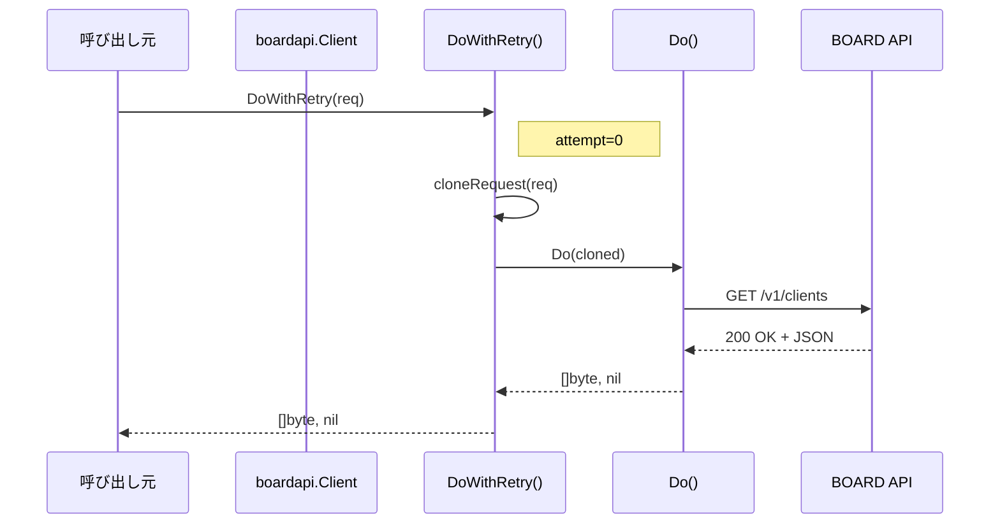
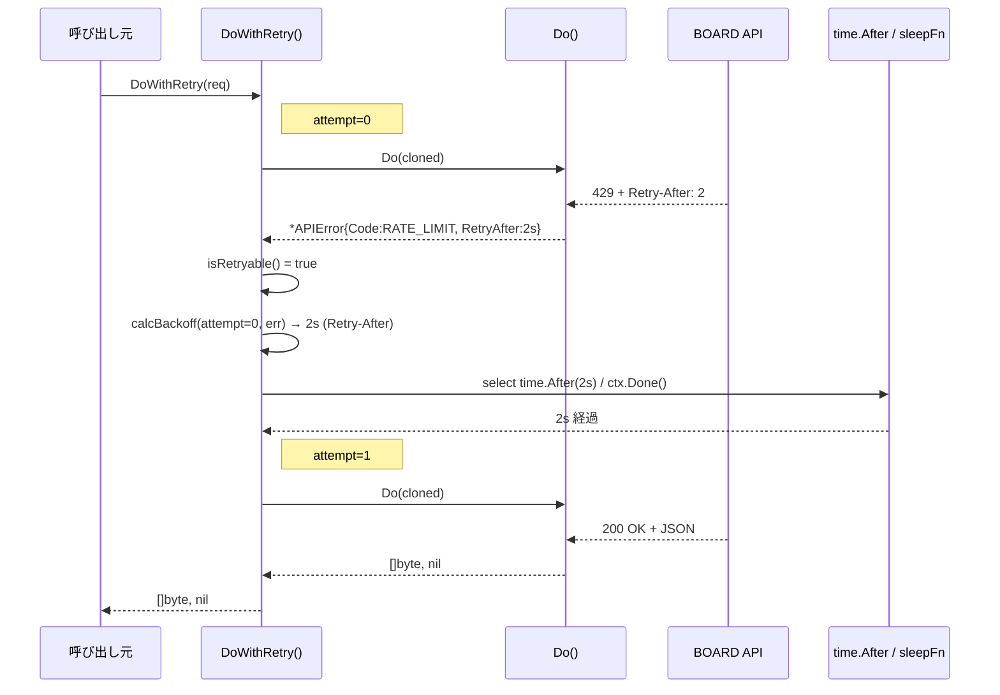
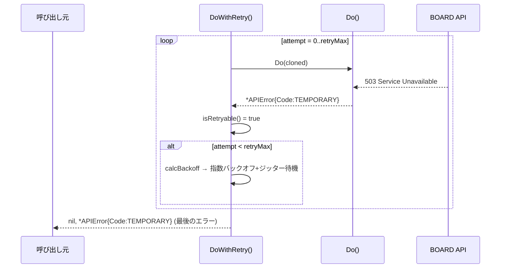
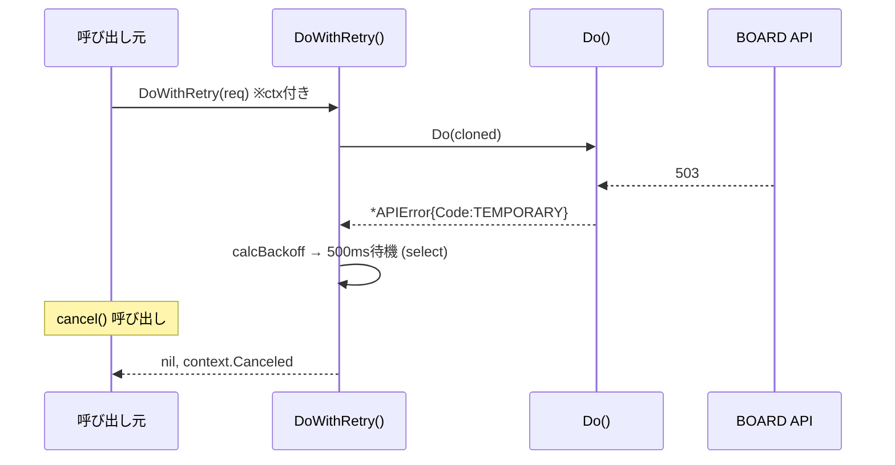
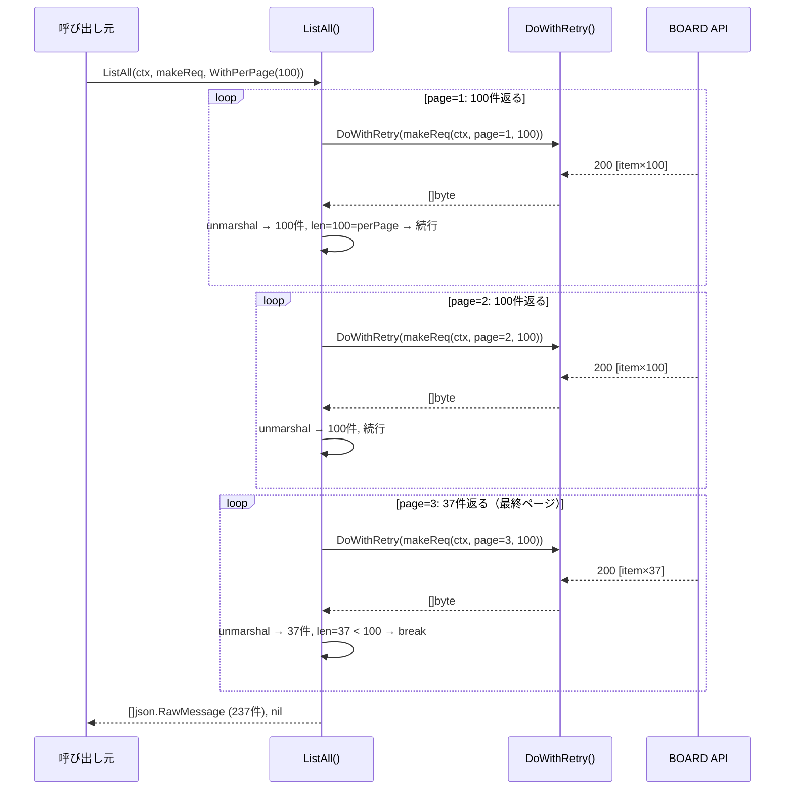

# M05: boardapi retry + pagination

## 概要

`internal/boardapi` パッケージに指数バックオフ + ジッターによるリトライ機能と、
ページネーション吸収ヘルパーを追加する。  
M04 で確立した `Client.Do()` をラップし、シグネチャを変えずに後方互換を保つ方針。

## 目標

- [ ] 429 / 5xx / 一時的ネットワークエラーのリトライ（4xx は非リトライ）
- [ ] 指数バックオフ + ジッター
- [ ] `Retry-After` ヘッダ対応
- [ ] 最大リトライ回数の設定可能性（`WithRetryMax` オプション）
- [ ] ページネーション吸収ヘルパー `ListAll()`（per_page / page クエリパラメータ）
- [ ] TDD（httptest）でテスト一式

---

## フェーズ1: 要件と制約

### 1.1 リトライ要件

| 項目 | 仕様 |
|------|------|
| リトライ対象 | 429、5xx（500〜599）、`APIErrorNetwork` |
| 非リトライ | 4xx（400/401/403/404/422）- 恒久エラーのため |
| 最大リトライ | デフォルト 5（`ProfileConfig.RetryMax` から注入） |
| バックオフ | 指数バックオフ + ジッター（full jitter）|
| 初期待機時間 | 500ms |
| 最大待機時間 | 30s（上限キャップ） |
| Retry-After | ヘッダが存在する場合は指定秒数を待機（上限 60s）|
| context キャンセル | バックオフ待機中も ctx.Done() を監視してすぐ返る |
| BOARD API rate limit | 3000/日・3/秒 → 429 は必ず Retry-After を含むと想定 |

### 1.2 ページネーション要件

| 項目 | 仕様 |
|------|------|
| クエリパラメータ | `per_page`（デフォルト 100）、`page`（1始まり） |
| 終了条件 | レスポンスのアイテム数 < per_page |
| 戻り値 | `[]json.RawMessage`（entity 変換は呼び出し元責務） |
| リトライ統合 | 各ページのリクエストはリトライ機能を経由 |
| context 対応 | ページループ中も ctx キャンセルで即中断 |

### 1.3 M05 スコープ外

- entity 型（Go struct）へのデシリアライズ（M06〜）
- resource 単位のエンドポイントメソッド（M06〜）
- キャッシュ・daily refresh（M07〜）

---

## フェーズ2: ファイル構成

```
internal/boardapi/
├── client.go           # M04 から変更: WithRetryMax オプション追加、retryMax フィールド追加
├── auth.go             # 変更なし
├── error.go            # 変更なし（isRetryable() を追加）
├── retry.go            # 新規: DoWithRetry() + backoff ロジック
├── pagination.go       # 新規: ListAll() + PagedRequest
└── client_test.go      # 拡張: T21〜T45 追加
```

### 設計方針

- `retry.go` は `Client` のメソッドとして実装（`DoWithRetry`）
- `Do()` のシグネチャは変えない。`DoWithRetry()` を新規追加
- `pagination.go` の `ListAll()` は `DoWithRetry()` を使用
- `isRetryable()` は `error.go` に関数として追加（`APIErrorCode` に依存するため）
- バックオフのスリープは `time.Sleep` を関数型フィールドに抽象化（テスト用）

---

## フェーズ3: 設計詳細

### 3.1 Client 構造体の拡張（client.go）

```go
// Client は BOARD API への HTTP クライアント。
type Client struct {
    baseURL    string
    apiKey     string
    apiToken   string
    httpClient *http.Client
    retryMax   int           // M05 追加: デフォルト 5
    sleepFn    func(d time.Duration) // M05 追加: テスト差し替え用
}

// WithRetryMax はリトライ最大回数を設定する。0 でリトライ無効。
func WithRetryMax(n int) ClientOption {
    return func(c *Client) { c.retryMax = n }
}

// withSleepFn はテスト用にスリープ関数を差し替える（非公開）。
func withSleepFn(fn func(time.Duration)) ClientOption {
    return func(c *Client) { c.sleepFn = fn }
}
```

`New()` のデフォルト値変更:
```go
c := &Client{
    // ...既存フィールド...
    retryMax: 5,
    sleepFn:  time.Sleep,
}
```

### 3.2 retry.go: DoWithRetry

```go
// DoWithRetry はリトライ付きでリクエストを実行する。
// context キャンセル時はバックオフ待機中でも即座に返す。
// リトライ非対象エラー（4xx等）は即座に返す。
func (c *Client) DoWithRetry(req *http.Request) ([]byte, error) {
    var lastErr error
    for attempt := 0; attempt <= c.retryMax; attempt++ {
        // リクエストを再利用可能な形でクローンして実行
        cloned, err := cloneRequest(req)
        if err \!= nil {
            return nil, err
        }
        body, err := c.Do(cloned)
        if err == nil {
            return body, nil
        }
        lastErr = err
        if \!isRetryable(err) {
            return nil, err
        }
        if attempt == c.retryMax {
            break
        }
        wait := calcBackoff(attempt, err)
        select {
        case <-req.Context().Done():
            return nil, req.Context().Err()
        case <-time.After(wait):
        }
    }
    return nil, lastErr
}
```

**補助関数:**

```go
// calcBackoff はリトライ待機時間を計算する。
// Retry-After ヘッダがある場合はその値を優先する。
// ない場合は指数バックオフ + full jitter。
func calcBackoff(attempt int, err error) time.Duration {
    const (
        baseDelay = 500 * time.Millisecond
        maxDelay  = 30 * time.Second
        maxRetryAfter = 60 * time.Second
    )

    // Retry-After から取得（*APIError に埋め込む設計）
    if ae, ok := err.(*APIError); ok && ae.RetryAfter > 0 {
        d := ae.RetryAfter
        if d > maxRetryAfter {
            d = maxRetryAfter
        }
        return d
    }

    // 指数バックオフ: base * 2^attempt
    exp := baseDelay * time.Duration(1<<uint(attempt))
    if exp > maxDelay {
        exp = maxDelay
    }
    // Full jitter: [0, exp)
    jitter := time.Duration(rand.Int63n(int64(exp)))
    return jitter
}
```

### 3.3 error.go への追加

```go
// APIError に RetryAfter フィールドを追加
type APIError struct {
    Code       APIErrorCode
    StatusCode int
    Message    string
    Body       string
    RetryAfter time.Duration // Retry-After ヘッダ値（0 は未指定）
}

// isRetryable はエラーがリトライ対象かどうかを返す。
func isRetryable(err error) bool {
    var ae *APIError
    if \!errors.As(err, &ae) {
        // *APIError でない場合はリトライしない
        return false
    }
    switch ae.Code {
    case APIErrorRateLimit, APIErrorTemporary, APIErrorNetwork:
        return true
    default:
        return false
    }
}
```

`parseError` を拡張して `Retry-After` ヘッダを読む:
```go
// parseErrorWithHeader は HTTP レスポンスから *APIError を生成する（Retry-After対応）。
func parseErrorWithHeader(resp *http.Response, body []byte) *APIError {
    ae := parseError(resp.StatusCode, body)
    if ra := resp.Header.Get("Retry-After"); ra \!= "" {
        if secs, err := strconv.Atoi(ra); err == nil {
            ae.RetryAfter = time.Duration(secs) * time.Second
        }
    }
    return ae
}
```

`Do()` も `parseError` から `parseErrorWithHeader` に変更する:
```go
// Do 内の変更点
return nil, parseErrorWithHeader(resp, body)
```

### 3.4 リクエストクローン（retry.go）

`*http.Request` はボディを1回しか読めないため、ボディを保持しクローンする:

```go
// cloneRequest は *http.Request をリトライ可能な形で複製する。
// Body が nil の場合は Body なしでクローン。
// Body がある場合は bytes.Buffer に読み込んでから複製する。
// 注意: context は元の req から引き継ぐ。
func cloneRequest(req *http.Request) (*http.Request, error) {
    cloned := req.Clone(req.Context())
    if req.Body == nil || req.Body == http.NoBody {
        return cloned, nil
    }
    // Body を読み、元の req と cloned の両方に同じ内容を設定
    buf, err := io.ReadAll(req.Body)
    if err \!= nil {
        return nil, &APIError{Code: APIErrorNetwork, Message: "cloneRequest: " + err.Error()}
    }
    req.Body = io.NopCloser(bytes.NewReader(buf))
    cloned.Body = io.NopCloser(bytes.NewReader(buf))
    cloned.ContentLength = req.ContentLength
    return cloned, nil
}
```

**設計判断:** `GetBody` フィールドを設定するアプローチもあるが、BOARD API の GET リクエストはほぼ Body なしのため、シンプルさを優先してバッファ方式を採用。

### 3.5 pagination.go: ListAll

```go
// PagedRequest は ListAll が各ページに使うリクエスト生成関数の型。
// page と per_page クエリパラメータを付与して *http.Request を返す。
type PagedRequest func(ctx context.Context, page, perPage int) (*http.Request, error)

// ListAllOption は ListAll の設定オプション。
type ListAllOption func(*listAllConfig)

type listAllConfig struct {
    perPage int
}

// WithPerPage は1ページあたりの件数を指定する。デフォルト 100。
func WithPerPage(n int) ListAllOption {
    return func(c *listAllConfig) { c.perPage = n }
}

// ListAll は全ページを取得して []json.RawMessage を返す。
// 各要素は API レスポンスのトップレベル JSON 配列の1要素に対応する。
// ページの終了条件: レスポンスの件数 < perPage。
func (c *Client) ListAll(ctx context.Context, makeReq PagedRequest, opts ...ListAllOption) ([]json.RawMessage, error) {
    cfg := &listAllConfig{perPage: 100}
    for _, o := range opts {
        o(cfg)
    }

    var all []json.RawMessage
    for page := 1; ; page++ {
        select {
        case <-ctx.Done():
            return nil, ctx.Err()
        default:
        }

        req, err := makeReq(ctx, page, cfg.perPage)
        if err \!= nil {
            return nil, err
        }

        body, err := c.DoWithRetry(req)
        if err \!= nil {
            return nil, err
        }

        var items []json.RawMessage
        if err := json.Unmarshal(body, &items); err \!= nil {
            return nil, &APIError{
                Code:    APIErrorUnknown,
                Message: "ListAll: failed to unmarshal page response: " + err.Error(),
            }
        }

        all = append(all, items...)

        if len(items) < cfg.perPage {
            break // 最終ページ
        }
    }
    return all, nil
}
```

---

## フェーズ4: シーケンス図

### 正常系: リトライなし（1回目成功）



### エラー系: 429 → Retry-After → 成功



### エラー系: 5xx × retryMax 回後にあきらめる



### エラー系: コンテキストキャンセル（バックオフ中）



### 正常系: ListAll（3ページ）



---

## フェーズ5: アプローチ比較

### retry の実装位置

| 評価軸 | A: DoWithRetry() を新規追加 | B: Do() 自体に組み込む | C: http.RoundTripper で実装 |
|--------|---------------------------|----------------------|-----------------------------|
| M04 後方互換 | ⭐⭐⭐⭐⭐ | ⭐⭐⭐（シグネチャ変わらないが挙動変更） | ⭐⭐⭐⭐ |
| テスタビリティ | ⭐⭐⭐⭐⭐ | ⭐⭐⭐⭐ | ⭐⭐⭐（型アサーション必要） |
| 呼び出し側の選択肢 | ⭐⭐⭐⭐ | ⭐⭐ | ⭐⭐⭐ |
| context 対応 | ⭐⭐⭐⭐⭐ | ⭐⭐⭐⭐ | ⭐⭐⭐（RoundTripper は ctx限定） |
| 実装複雑度 | ⭐⭐⭐⭐ | ⭐⭐⭐⭐ | ⭐⭐ |

**推奨: A（DoWithRetry() を新規追加）**

- `Do()` は M04 のテストが全て通っており変更リスクがない
- リトライを使いたくない場合（テスト、単一呼び出し）に `Do()` を使い続けられる
- `pagination.go` の `ListAll()` が `DoWithRetry()` を使うことで自然に統合

### バックオフの jitter 戦略

| 戦略 | 説明 | BOARD API 向き |
|------|------|---------------|
| Full jitter | `[0, exp)` の一様乱数 | ◎ 多クライアント同時リトライの分散に最適 |
| Equal jitter | `exp/2 + [0, exp/2)` | ○ ある程度の待機を保証 |
| Decorrelated jitter | 前回待機時間を使う | △ 実装複雑 |
| 固定待機 | 毎回同じ時間 | ✗ thundering herd 問題 |

**推奨: Full jitter**（AWS の Exponential Backoff And Jitter ブログ推奨パターン）

### ページネーション終了条件

| 方式 | 説明 | 採用 |
|------|------|------|
| len(items) < perPage | 取得件数が per_page 未満で最終ページ判定 | ◎ シンプル、BOARD API 準拠 |
| レスポンスの total フィールド | total を読んで計算 | △ BOARD API が total を返すか不明 |
| 空配列 | `[]` が返ったら終了 | △ 最終ページが per_page 件ちょうどの場合に1回余分なリクエスト |

**推奨: len(items) < perPage**

---

## フェーズ6: TDD テスト設計

### テストファイル: `internal/boardapi/client_test.go`（T21〜T45 追加）

#### 6.1 retry テスト（retry.go）

| # | テスト名 | 分類 | 検証内容 |
|---|---------|------|---------|
| T21 | `TestDoWithRetry_SuccessOnFirstAttempt` | 正常系 | 1回目成功でリトライなし |
| T22 | `TestDoWithRetry_429_RetryAndSucceed` | 正常系 | 429 → リトライ → 成功 |
| T23 | `TestDoWithRetry_500_RetryAndSucceed` | 正常系 | 500 → リトライ → 成功 |
| T24 | `TestDoWithRetry_NetworkError_RetryAndSucceed` | 正常系 | ネットワークエラー → リトライ → 成功 |
| T25 | `TestDoWithRetry_429_ExceedsRetryMax` | 異常系 | retryMax 回超えたら最後のエラーを返す |
| T26 | `TestDoWithRetry_4xx_NoRetry` | 異常系 | 401/403/404/422 は即返す（リトライしない） |
| T27 | `TestDoWithRetry_RetryAfterHeader` | 正常系 | Retry-After ヘッダの秒数を待機する |
| T28 | `TestDoWithRetry_ContextCancelDuringBackoff` | エッジケース | バックオフ待機中に ctx キャンセルで即返る |
| T29 | `TestDoWithRetry_RetryCount` | 正常系 | 実際にリトライが retryMax 回行われること |
| T30 | `TestDoWithRetry_ZeroRetryMax` | 正常系 | retryMax=0 はリトライなし（Do() と同等） |
| T31 | `TestDoWithRetry_RequestBodyReusable` | 正常系 | POST ボディがリトライ時に再送される |
| T32 | `TestCalcBackoff_ExponentialGrowth` | 単体 | attempt が増えるたびに期待範囲内の待機時間 |
| T33 | `TestCalcBackoff_RetryAfterPriority` | 単体 | Retry-After がある場合は指数バックオフより優先 |
| T34 | `TestCalcBackoff_MaxDelayCap` | 単体 | 待機時間が maxDelay(30s) を超えない |
| T35 | `TestIsRetryable_Codes` | 単体 | 各 APIErrorCode の retryable 判定 |

#### 6.2 pagination テスト（pagination.go）

| # | テスト名 | 分類 | 検証内容 |
|---|---------|------|---------|
| T36 | `TestListAll_SinglePage` | 正常系 | 1ページ（per_page 未満）で終了 |
| T37 | `TestListAll_MultiPage` | 正常系 | 複数ページを全件取得して結合 |
| T38 | `TestListAll_ExactMultiple` | 正常系 | ちょうど per_page 件の最終ページ後に空リスト取得で終了 |
| T39 | `TestListAll_EmptyResponse` | 正常系 | 空配列 `[]` で0件を返す |
| T40 | `TestListAll_PerPageQueryParam` | 正常系 | per_page クエリパラメータが正しく付与される |
| T41 | `TestListAll_PageQueryParam` | 正常系 | page=1,2,3... が正しく増分される |
| T42 | `TestListAll_ErrorPropagation` | 異常系 | 途中ページでエラーが発生したら即返す |
| T43 | `TestListAll_ContextCancellation` | エッジケース | ページループ中に ctx キャンセルで即中断 |
| T44 | `TestListAll_WithPerPageOption` | 正常系 | WithPerPage(50) でクエリパラメータが変わる |
| T45 | `TestParseErrorWithHeader_RetryAfter` | 単体 | Retry-After ヘッダが *APIError.RetryAfter に入る |

#### 6.3 テストコード骨格（抜粋）

```go
// T22: 429 → リトライ → 成功
func TestDoWithRetry_429_RetryAndSucceed(t *testing.T) {
    callCount := 0
    ts := httptest.NewServer(http.HandlerFunc(func(w http.ResponseWriter, r *http.Request) {
        callCount++
        if callCount == 1 {
            w.Header().Set("Retry-After", "0")
            w.WriteHeader(http.StatusTooManyRequests)
            w.Write([]byte(`{"message":"rate limit"}`))
            return
        }
        w.WriteHeader(http.StatusOK)
        w.Write([]byte(`{"id":1}`))
    }))
    defer ts.Close()

    noSleep := func(time.Duration) {}
    c := boardapi.New(ts.URL, "key", "token", 5*time.Second,
        boardapi.WithRetryMax(3),
        boardapi.WithSleepFn(noSleep), // テスト用: スリープをスキップ
    )
    req, _ := c.NewRequest(context.Background(), "GET", "/test", nil)
    body, err := c.DoWithRetry(req)
    if err \!= nil {
        t.Fatalf("unexpected error: %v", err)
    }
    if callCount \!= 2 {
        t.Errorf("callCount: want 2, got %d", callCount)
    }
    _ = body
}

// T28: バックオフ中に ctx キャンセル
func TestDoWithRetry_ContextCancelDuringBackoff(t *testing.T) {
    ts := httptest.NewServer(http.HandlerFunc(func(w http.ResponseWriter, r *http.Request) {
        w.WriteHeader(http.StatusInternalServerError)
        w.Write([]byte(`{}`))
    }))
    defer ts.Close()

    ctx, cancel := context.WithCancel(context.Background())
    sleepCalled := make(chan struct{})
    sleepFn := func(d time.Duration) {
        close(sleepCalled)
        // sleepFn が呼ばれたら cancel → select で ctx.Done() が勝つはず
    }
    c := boardapi.New(ts.URL, "key", "token", 5*time.Second,
        boardapi.WithRetryMax(3),
        boardapi.WithSleepFn(sleepFn),
    )
    req, _ := c.NewRequest(ctx, "GET", "/test", nil)

    go func() {
        <-sleepCalled
        cancel()
    }()

    _, err := c.DoWithRetry(req)
    if \!errors.Is(err, context.Canceled) {
        t.Errorf("want context.Canceled, got %v", err)
    }
}

// T37: 複数ページ全件取得
func TestListAll_MultiPage(t *testing.T) {
    pageItems := map[int]int{1: 100, 2: 100, 3: 37}
    ts := httptest.NewServer(http.HandlerFunc(func(w http.ResponseWriter, r *http.Request) {
        pageStr := r.URL.Query().Get("page")
        page, _ := strconv.Atoi(pageStr)
        n := pageItems[page]
        items := make([]map[string]int, n)
        for i := range items {
            items[i] = map[string]int{"id": (page-1)*100 + i + 1}
        }
        b, _ := json.Marshal(items)
        w.WriteHeader(http.StatusOK)
        w.Write(b)
    }))
    defer ts.Close()

    noSleep := func(time.Duration) {}
    c := boardapi.New(ts.URL, "key", "token", 5*time.Second, boardapi.WithSleepFn(noSleep))

    makeReq := func(ctx context.Context, page, perPage int) (*http.Request, error) {
        path := fmt.Sprintf("/test?page=%d&per_page=%d", page, perPage)
        return c.NewRequest(ctx, "GET", path, nil)
    }

    items, err := c.ListAll(context.Background(), makeReq, boardapi.WithPerPage(100))
    if err \!= nil {
        t.Fatalf("unexpected error: %v", err)
    }
    if len(items) \!= 237 {
        t.Errorf("want 237 items, got %d", len(items))
    }
}
```

#### 6.4 TDD 実装順序

**ステップ1 - Red: isRetryable テスト**
```
1. T35 (TestIsRetryable_Codes) を書く → コンパイルエラー
2. error.go に isRetryable() を実装 → T35 Green
```

**ステップ2 - Red: parseErrorWithHeader テスト**
```
3. T45 (TestParseErrorWithHeader_RetryAfter) を書く → 失敗
4. APIError に RetryAfter フィールドを追加
5. parseErrorWithHeader() を実装 → T45 Green
6. Do() を parseErrorWithHeader に更新（既存テスト T05〜T20 引き続き Green）
```

**ステップ3 - Red: calcBackoff 単体テスト**
```
7. T32, T33, T34 (TestCalcBackoff_*) を書く → コンパイルエラー
8. retry.go に calcBackoff() を実装 → T32〜T34 Green
```

**ステップ4 - Red: DoWithRetry テスト**
```
9. T30 (TestDoWithRetry_ZeroRetryMax) → Do() と同等、実装後 Green
10. T21 (TestDoWithRetry_SuccessOnFirstAttempt) → Green
11. T22 (TestDoWithRetry_429_RetryAndSucceed) → Red → DoWithRetry() 実装 → Green
12. T23, T24 (5xx / ネットワーク) → Green
13. T25 (retryMax 超過) → Green
14. T26 (4xx 非リトライ) → Green
15. T27 (Retry-After ヘッダ) → Green
16. T28 (ctx キャンセル) → Green
17. T29 (リトライ回数確認) → Green
18. T31 (POST ボディ再送) → Red → cloneRequest() 実装 → Green
```

**ステップ5 - Red: client.go 拡張**
```
19. T22 で WithRetryMax / WithSleepFn が必要 → client.go に追加
```

**ステップ6 - Red: ListAll テスト**
```
20. T36 (単一ページ) → Red → pagination.go に ListAll() 骨格 → Green
21. T37 (複数ページ) → Green
22. T38, T39, T40, T41 → Green
23. T42 (エラー伝播) → Green
24. T43 (ctx キャンセル) → Green
25. T44 (WithPerPage) → Green
```

**ステップ7 - Refactor**
```
26. calcBackoff の定数を整理
27. ListAll のループ構造を整理
28. go vet / gofmt 実行
29. go test ./internal/boardapi/... -v でフルパス確認
```

---

## フェーズ7: リスク評価

| リスク | 影響度 | 発生確率 | 対策 |
|--------|--------|---------|------|
| BOARD API の Retry-After ヘッダが整数秒以外の形式（RFC 7231 の日時形式）| 中 | 低 | `parseErrorWithHeader` で整数パース失敗時は無視して指数バックオフ fallback |
| 5xx リトライで rate limit（3000/日）を無駄消費 | 中 | 低 | 実稼働では5xx は稀。retryMax のデフォルト 5 は過剰にならない範囲 |
| POST リクエストの Body クローンが不完全 | 高 | 低 | `cloneRequest` で bytes.Buffer に完全コピー。テスト T31 で検証 |
| rand.Int63n(0) パニック（exp=0 のとき）| 高 | 低 | `calcBackoff` で `exp > 0` の場合のみ jitter 計算。0 なら即 0ms を返す |
| `time.After` の goroutine リーク | 低 | 中 | Go 1.23+ では `time.NewTimer` + `timer.Stop()` を使う。または `time.After` で許容（short-lived） |
| `ListAll` での無限ループ（常に per_page 件返す API）| 中 | 低 | `maxPages` 上限（デフォルト 1000）を設けて安全策とする |
| `sleepFn` の公開可否 | 低 | - | `WithSleepFn` は `withSleepFn`（小文字）で非公開。テストからは `boardapi_test` パッケージ外から使えないが、`client_test.go` は `package boardapi_test` なので `boardapi.WithSleepFn` として公開が必要 → 公開関数として定義し godoc に "for testing only" を記載 |

---

## フェーズ8: 完了条件

- [ ] `go test ./internal/boardapi/... -v` が T21〜T45 全テスト Green（T01〜T20 も引き続き Green）
- [ ] `go vet ./internal/boardapi/...` が警告なし
- [ ] `gofmt -d ./internal/boardapi/` が差分なし
- [ ] `DoWithRetry()` が 429 / 5xx / ネットワークエラーのみリトライし、4xx は即返す
- [ ] `Retry-After` ヘッダが存在する場合は指定秒数を待機する
- [ ] `ListAll()` が全ページを取得して `[]json.RawMessage` を返す
- [ ] POST ボディがリトライ時に正しく再送される（T31）
- [ ] context キャンセルがバックオフ待機中でも即座に伝播する（T28, T43）
- [ ] `APIError.Error()` にシークレット（apiKey/apiToken）が含まれない

---

## 参照

- スペック: `docs/specs/board_cli_mcp_ultra_detailed_design_ja.md` §11.4, §11.5
- ロードマップ: `plans/board-roadmap.md` M05
- 前提: `internal/boardapi/client.go`, `error.go`（M04 完了済み）
- 次マイルストーン: M06（boardapi コアエンティティ: resource ごとの HTTP メソッド）
