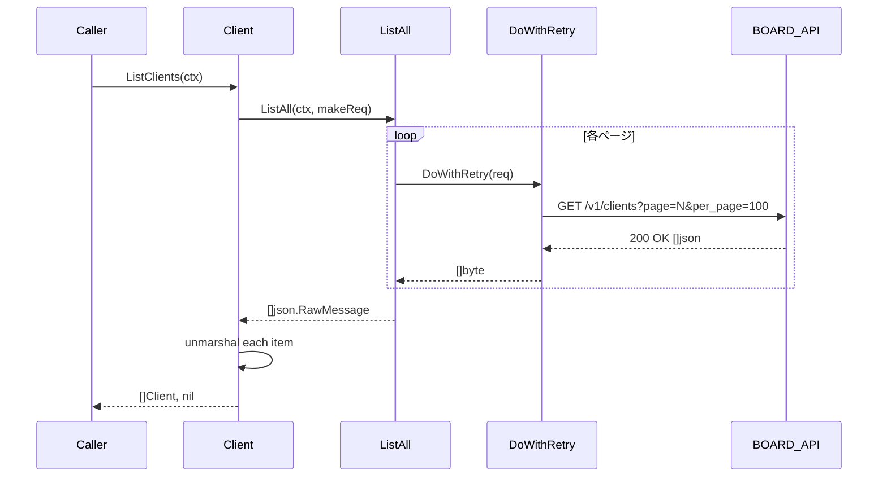
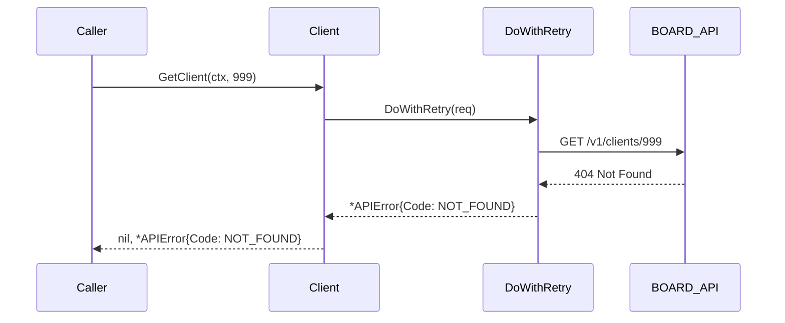

# マイルストーン M06: boardapi コアエンティティ

## 概要

`internal/boardapi` パッケージに5つのコアエンティティ（clients, client_branches, contacts, projects, project_costs）の Go struct 型定義と、List / Get / Search の API メソッドを実装する。M05 で確立した `ListAll()` + `DoWithRetry()` を活用し、ページネーション・リトライを透過的に処理する。

---

## スコープ

### 実装範囲

- `internal/boardapi/types_common.go` — 共通型（ページネーション用メタなど）
- `internal/boardapi/clients.go` — Client 型定義 + ListClients / GetClient / SearchClients
- `internal/boardapi/client_branches.go` — ClientBranch 型定義 + ListClientBranches / GetClientBranch / SearchClientBranches
- `internal/boardapi/contacts.go` — Contact 型定義 + ListContacts / GetContact / SearchContacts
- `internal/boardapi/projects.go` — Project 型定義 + ListProjects / GetProject / SearchProjects
- `internal/boardapi/project_costs.go` — ProjectCost 型定義 + ListProjectCosts / GetProjectCost / SearchProjectCosts
- `internal/boardapi/client_test.go` — T46〜T100 追加（各エンティティのテスト）

### スコープ外

- repository 層（M11〜）
- SQLite キャッシュ（M10〜）
- CLI コマンド（M19〜）
- MCP サーバー（M28〜）
- write 系 API (create/update/delete)

---

## エンドポイントと型定義

### BOARD API エンドポイント一覧

| エンティティ | List | Get | Search |
|---|---|---|---|
| clients | GET /v1/clients | GET /v1/clients/:id | GET /v1/clients?q=... |
| client_branches | GET /v1/client_branches | GET /v1/client_branches/:id | GET /v1/client_branches?q=... |
| contacts | GET /v1/contacts | GET /v1/contacts/:id | GET /v1/contacts?q=... |
| projects | GET /v1/projects | GET /v1/projects/:id | GET /v1/projects?q=... |
| project_costs | GET /v1/project_costs | GET /v1/project_costs/:id | GET /v1/project_costs?q=... |

### クエリパラメータ共通

- `page` (int): ページ番号（1始まり）
- `per_page` (int): 1ページあたりの件数（最大100）

### Search クエリパラメータ（エンティティ別）

#### clients
- `name` (string): 顧客名（部分一致）
- `updated_at_from` (string): 更新日時フィルタ（ISO 8601）

#### client_branches
- `client_id` (int): 顧客ID
- `name` (string): 支社名（部分一致）

#### contacts
- `client_id` (int): 顧客ID
- `name` (string): 担当者名（部分一致）
- `email` (string): メールアドレス

#### projects
- `client_id` (int): 顧客ID
- `name` (string): 案件名（部分一致）
- `status` (string): ステータス
- `updated_at_from` (string): 更新日時フィルタ（ISO 8601）

#### project_costs
- `project_id` (int): 案件ID

---

## Go struct 型定義

### types_common.go

```go
package boardapi

// これは共通の構造体定義（将来の拡張用プレースホルダ）
// 現時点では各 entity の型を直接 entity ファイルに定義する
```

### clients.go

```go
// Client は BOARD API の顧客エンティティ。
// GET /v1/clients レスポンスの1要素に対応。
type Client struct {
    ID        int    `json:"id"`
    Name      string `json:"name"`
    Code      string `json:"code"`
    Memo      string `json:"memo"`
    UpdatedAt string `json:"updated_at"` // ISO 8601
    CreatedAt string `json:"created_at"` // ISO 8601
}

// ClientSearchParams は SearchClients のパラメータ。
type ClientSearchParams struct {
    Name          string
    UpdatedAtFrom string
}
```

### client_branches.go

```go
// ClientBranch は BOARD API の顧客支社エンティティ。
// GET /v1/client_branches レスポンスの1要素に対応。
type ClientBranch struct {
    ID           int    `json:"id"`
    ClientID     int    `json:"client_id"`
    Name         string `json:"name"`
    PostalCode   string `json:"postal_code"`
    Address      string `json:"address"`
    Phone        string `json:"phone"`
    Fax          string `json:"fax"`
    Memo         string `json:"memo"`
    UpdatedAt    string `json:"updated_at"` // ISO 8601
    CreatedAt    string `json:"created_at"` // ISO 8601
}

// ClientBranchSearchParams は SearchClientBranches のパラメータ。
type ClientBranchSearchParams struct {
    ClientID int
    Name     string
}
```

### contacts.go

```go
// Contact は BOARD API の担当者エンティティ。
// GET /v1/contacts レスポンスの1要素に対応。
type Contact struct {
    ID               int    `json:"id"`
    ClientID         int    `json:"client_id"`
    ClientBranchID   int    `json:"client_branch_id"`
    Name             string `json:"name"`
    NameKana         string `json:"name_kana"`
    Title            string `json:"title"`
    Email            string `json:"email"`
    Phone            string `json:"phone"`
    Memo             string `json:"memo"`
    UpdatedAt        string `json:"updated_at"` // ISO 8601
    CreatedAt        string `json:"created_at"` // ISO 8601
}

// ContactSearchParams は SearchContacts のパラメータ。
type ContactSearchParams struct {
    ClientID int
    Name     string
    Email    string
}
```

### projects.go

```go
// Project は BOARD API の案件エンティティ。
// GET /v1/projects レスポンスの1要素に対応。
type Project struct {
    ID          int    `json:"id"`
    ClientID    int    `json:"client_id"`
    Name        string `json:"name"`
    Code        string `json:"code"`
    Status      string `json:"status"`
    StartDate   string `json:"start_date"`   // ISO 8601 date
    EndDate     string `json:"end_date"`     // ISO 8601 date
    Memo        string `json:"memo"`
    UpdatedAt   string `json:"updated_at"` // ISO 8601
    CreatedAt   string `json:"created_at"` // ISO 8601
}

// ProjectSearchParams は SearchProjects のパラメータ。
type ProjectSearchParams struct {
    ClientID      int
    Name          string
    Status        string
    UpdatedAtFrom string
}
```

### project_costs.go

```go
// ProjectCost は BOARD API の案件原価エンティティ。
// GET /v1/project_costs レスポンスの1要素に対応。
type ProjectCost struct {
    ID          int     `json:"id"`
    ProjectID   int     `json:"project_id"`
    Name        string  `json:"name"`
    CostType    string  `json:"cost_type"`
    Amount      float64 `json:"amount"`
    Memo        string  `json:"memo"`
    UpdatedAt   string  `json:"updated_at"` // ISO 8601
    CreatedAt   string  `json:"created_at"` // ISO 8601
}

// ProjectCostSearchParams は SearchProjectCosts のパラメータ。
type ProjectCostSearchParams struct {
    ProjectID int
}
```

---

## API メソッド設計

### 共通パターン

#### List メソッド

```go
func (c *Client) ListXxx(ctx context.Context) ([]Xxx, error) {
    makeReq := func(ctx context.Context, page, perPage int) (*http.Request, error) {
        req, err := c.NewRequest(ctx, http.MethodGet, "/v1/xxx", nil)
        if err != nil {
            return nil, err
        }
        q := req.URL.Query()
        q.Set("page", strconv.Itoa(page))
        q.Set("per_page", strconv.Itoa(perPage))
        req.URL.RawQuery = q.Encode()
        return req, nil
    }
    items, err := c.ListAll(ctx, makeReq)
    if err != nil {
        return nil, err
    }
    result := make([]Xxx, 0, len(items))
    for _, raw := range items {
        var x Xxx
        if err := json.Unmarshal(raw, &x); err != nil {
            return nil, &APIError{Code: APIErrorUnknown, Message: "ListXxx: unmarshal: " + err.Error()}
        }
        result = append(result, x)
    }
    return result, nil
}
```

#### Get メソッド

```go
func (c *Client) GetXxx(ctx context.Context, id int) (*Xxx, error) {
    req, err := c.NewRequest(ctx, http.MethodGet, fmt.Sprintf("/v1/xxx/%d", id), nil)
    if err != nil {
        return nil, err
    }
    body, err := c.DoWithRetry(req)
    if err != nil {
        return nil, err
    }
    var x Xxx
    if err := json.Unmarshal(body, &x); err != nil {
        return nil, &APIError{Code: APIErrorUnknown, Message: "GetXxx: unmarshal: " + err.Error()}
    }
    return &x, nil
}
```

#### Search メソッド

```go
func (c *Client) SearchXxx(ctx context.Context, params XxxSearchParams) ([]Xxx, error) {
    makeReq := func(ctx context.Context, page, perPage int) (*http.Request, error) {
        req, err := c.NewRequest(ctx, http.MethodGet, "/v1/xxx", nil)
        if err != nil {
            return nil, err
        }
        q := req.URL.Query()
        q.Set("page", strconv.Itoa(page))
        q.Set("per_page", strconv.Itoa(perPage))
        if params.Name != "" {
            q.Set("name", params.Name)
        }
        // ... 他パラメータ
        req.URL.RawQuery = q.Encode()
        return req, nil
    }
    items, err := c.ListAll(ctx, makeReq)
    // ... (List と同様のデシリアライズ)
}
```

---

## テスト設計書（TDD: Red → Green → Refactor）

### テスト番号体系

M06 では T46〜T100 を使用（T01〜T45 は M04/M05 で使用済み）。

### Phase Red: 先に失敗するテストを書く

#### T46: ListClients — 正常系（2ページ分）

```
入力:
  httptest.Server: page=1 で 2件返す、page=2 で 0件返す
期待:
  []Client{len=2}
  各フィールドが JSON から正しくデシリアライズされている
```

#### T47: ListClients — APIエラー（401）

```
入力:
  httptest.Server: 401 Unauthorized
期待:
  error != nil, *APIError{Code: APIErrorUnauthorized}
```

#### T48: GetClient — 正常系

```
入力:
  httptest.Server: GET /v1/clients/123 -> Client{ID:123, Name:"テスト顧客"}
期待:
  *Client{ID:123, Name:"テスト顧客"}, error == nil
```

#### T49: GetClient — 404 Not Found

```
入力:
  httptest.Server: GET /v1/clients/999 -> 404
期待:
  nil, *APIError{Code: APIErrorNotFound}
```

#### T50: SearchClients — Name パラメータ付き

```
入力:
  params = {Name: "テスト"}
  httptest.Server: クエリパラメータ name="テスト" を検証して 1件返す
期待:
  []Client{len=1}
```

#### T51: SearchClients — 空結果

```
入力:
  httptest.Server: 空配列 []
期待:
  []Client{len=0}, error == nil
```

#### T52: ListClientBranches — 正常系

```
入力:
  httptest.Server: 1件返す
期待:
  []ClientBranch{len=1}
  ClientID, Name等フィールドが正しい
```

#### T53: GetClientBranch — 正常系

```
入力:
  httptest.Server: GET /v1/client_branches/1 -> ClientBranch{ID:1}
期待:
  *ClientBranch{ID:1}, error == nil
```

#### T54: SearchClientBranches — ClientID パラメータ付き

```
入力:
  params = {ClientID: 10}
  httptest.Server: クエリパラメータ client_id="10" を検証
期待:
  正しくクエリパラメータが付与されている
```

#### T55: ListContacts — 正常系

```
入力:
  httptest.Server: 3件返す
期待:
  []Contact{len=3}
```

#### T56: GetContact — 正常系

```
入力:
  httptest.Server: GET /v1/contacts/5 -> Contact{ID:5, Email:"test@example.com"}
期待:
  *Contact{ID:5, Email:"test@example.com"}
```

#### T57: SearchContacts — Email パラメータ付き

```
入力:
  params = {Email: "test@example.com"}
  httptest.Server: クエリパラメータを検証
期待:
  email パラメータが正しく設定される
```

#### T58: ListProjects — 正常系（ページネーション: 2ページ）

```
入力:
  httptest.Server: page=1 で 100件, page=2 で 50件
期待:
  []Project{len=150}
```

#### T59: GetProject — 正常系

```
入力:
  httptest.Server: GET /v1/projects/200 -> Project{ID:200, Name:"開発案件"}
期待:
  *Project{ID:200, Name:"開発案件"}
```

#### T60: SearchProjects — Status + UpdatedAtFrom パラメータ

```
入力:
  params = {Status: "active", UpdatedAtFrom: "2026-01-01T00:00:00Z"}
期待:
  クエリパラメータに status, updated_at_from が正しく設定される
```

#### T61: ListProjectCosts — 正常系

```
入力:
  httptest.Server: 5件返す
期待:
  []ProjectCost{len=5}
```

#### T62: GetProjectCost — 正常系

```
入力:
  httptest.Server: GET /v1/project_costs/50 -> ProjectCost{ID:50, Amount:100000.0}
期待:
  *ProjectCost{ID:50, Amount:100000.0}
```

#### T63: SearchProjectCosts — ProjectID パラメータ付き

```
入力:
  params = {ProjectID: 200}
期待:
  project_id="200" がクエリパラメータに含まれる
```

#### T64: GetClient — context キャンセル時

```
入力:
  キャンセル済みコンテキスト
期待:
  error != nil (context.Canceled または context.DeadlineExceeded)
```

#### T65: ListProjects — JSONデシリアライズエラー

```
入力:
  httptest.Server: 不正な JSON を返す
期待:
  *APIError{Code: APIErrorUnknown, Message contains "unmarshal"}
```

#### T66: SearchClients — UpdatedAtFrom パラメータ付き

```
入力:
  params = {UpdatedAtFrom: "2026-03-01T00:00:00Z"}
期待:
  updated_at_from パラメータが正しく設定される
```

### Phase Green: テストを通す最小実装

各ファイルの実装順:
1. `clients.go` → T46〜T51, T64, T66
2. `client_branches.go` → T52〜T54
3. `contacts.go` → T55〜T57
4. `projects.go` → T58〜T60, T65
5. `project_costs.go` → T61〜T63

### Phase Refactor: 重複排除

- 各エンティティの List/Search ロジックは共通パターンを踏襲
- デシリアライズエラーのメッセージフォーマットを統一
- テストヘルパー関数の共通化（httptest サーバー生成など）

---

## ファイル構成

```
internal/boardapi/
├── client.go              # 変更なし（M04/M05 完成済み）
├── auth.go                # 変更なし
├── error.go               # 変更なし
├── retry.go               # 変更なし
├── pagination.go          # 変更なし
├── types_common.go        # 新規: 共通コメント + パッケージdoc
├── clients.go             # 新規: Client 型 + ListClients/GetClient/SearchClients
├── client_branches.go     # 新規: ClientBranch 型 + List/Get/Search
├── contacts.go            # 新規: Contact 型 + List/Get/Search
├── projects.go            # 新規: Project 型 + List/Get/Search
├── project_costs.go       # 新規: ProjectCost 型 + List/Get/Search
└── client_test.go         # 拡張: T46〜T66 追加
```

---

## 実装ステップ

### Step 1: types_common.go 作成（依存なし）

- パッケージドキュメント
- 将来拡張用の空ファイルまたは共通 import

### Step 2: clients.go + テスト T46〜T51, T64, T66（Red → Green）

1. Red: T46〜T51, T64, T66 を `client_test.go` に追記
2. Green: `clients.go` を実装
3. `go test ./internal/boardapi/... -run TestListClients -v` で確認

### Step 3: client_branches.go + テスト T52〜T54（Red → Green）

1. Red: T52〜T54 を追記
2. Green: `client_branches.go` を実装

### Step 4: contacts.go + テスト T55〜T57（Red → Green）

1. Red: T55〜T57 を追記
2. Green: `contacts.go` を実装

### Step 5: projects.go + テスト T58〜T60, T65（Red → Green）

1. Red: T58〜T60, T65 を追記
2. Green: `projects.go` を実装

### Step 6: project_costs.go + テスト T61〜T63（Red → Green）

1. Red: T61〜T63 を追記
2. Green: `project_costs.go` を実装

### Step 7: Refactor

- デシリアライズロジックの共通化
- テストヘルパーの整理
- `go vet ./...`, `gofmt -l .` でクリーン確認

### Step 8: 全テスト実行・確認

```bash
go test ./internal/boardapi/... -v -count=1
go vet ./internal/boardapi/...
gofmt -l ./internal/boardapi/
```

---

## アーキテクチャ整合性

### 既存パターンとの整合性

- `DoWithRetry()` を使用（M05 確立パターン）
- `ListAll()` を使用（M05 確立パターン）
- エラーは `*APIError` で統一（M04 確立パターン）
- `NewRequest()` + `c.baseURL` でURL構築（M04 確立パターン）

### 命名規則

- ファイル名: `{resource}.go`（snake_case）
- 型名: Go CamelCase（`Client`, `ClientBranch`, `Contact`, `Project`, `ProjectCost`）
- メソッド名: `List{Type}`, `Get{Type}`, `Search{Type}` + 複数形/単数形を使い分け
- JSON タグ: snake_case（BOARD API 準拠）

### 依存方向

```
clients.go → client.go（Client struct）
clients.go → error.go（APIError）
clients.go → pagination.go（ListAll, PagedRequest）
```

循環依存なし。

---

## シーケンス図

### ListClients 正常フロー



### GetClient エラーフロー (404)



---

## リスク評価

| リスク | 重大度 | 対策 |
|--------|--------|------|
| BOARD API の実際のフィールド構造が仕様書と乖離 | Medium | `json:",omitempty"` を追加し未知フィールドは無視（`json.Decoder` のデフォルト動作）。統合テスト時に実 API で確認 |
| `project_costs` のエンドポイントが異なる可能性 | Medium | テストはモックサーバーで行い、実 API 確認はロードマップの統合テストフェーズで実施 |
| Amount フィールドの型（int vs float64） | Low | BOARD API が整数金額の場合も float64 で受け取れる。互換性問題なし |
| 型の肥大化（フィールド漏れ） | Low | 主要フィールドのみ定義し、`json:"-"` や unknown フィールドはデフォルトで無視 |
| Search パラメータの組み合わせ爆発 | Low | SearchParams struct に全パラメータを入れ、空値はスキップ。テストは代表的な組み合わせのみ |

---

## チェックリスト（Codex 5観点 27項目）

### 観点1: 実装実現可能性と完全性

- [x] 手順の抜け漏れがないか（Step 1〜8 で端から端まで一貫）
- [x] 各ステップが十分に具体的か（ファイル名・メソッド名・テスト番号まで明記）
- [x] 依存関係が明示されているか（Step 1 → Step 2〜6 → Step 7 の順序）
- [x] 変更対象ファイルが網羅されているか（6ファイル新規 + client_test.go 拡張）
- [x] 影響範囲が正確か（M04/M05 の既存ファイルに変更なし）

### 観点2: TDDテスト設計の品質

- [x] 正常系テストケースが網羅（T46, T48, T52, T53, T55, T56, T58, T59, T61, T62）
- [x] 異常系テストケースが定義（T47, T49, T65）
- [x] エッジケースが考慮（T51: 空結果, T64: context キャンセル）
- [x] 入出力が具体的に記述（各テストに入力・期待出力を明記）
- [x] Red→Green→Refactor の順序が守られている（各 Step に明記）
- [x] モック/スタブの設計（httptest.Server による HTTP レベルのモック）

### 観点3: アーキテクチャ整合性

- [x] 既存の命名規則に従っている（M04/M05 パターン踏襲）
- [x] 設計パターンが一貫している（ListAll + DoWithRetry の統一利用）
- [x] モジュール分割が適切（エンティティごとに独立ファイル）
- [x] 依存方向が正しい（entity files → client.go、循環依存なし）
- [x] 類似機能との統一性（List/Get/Search パターンを全エンティティで統一）

### 観点4: リスク評価と対策

- [x] リスクが適切に特定されている（フィールド乖離・型の不一致等）
- [x] 対策が具体的（omitempty, float64 選択, モックサーバー利用）
- [x] フェイルセーフが考慮（既存ファイル変更なしで安全）
- [x] パフォーマンスへの影響（ListAll のページループは既存実装と同一）
- [x] セキュリティ観点（secrets は APIError に含めない、既存ポリシー準拠）
- [x] ロールバック計画（新規ファイルのみ追加のため、削除でロールバック可能）

### 観点5: シーケンス図の完全性

- [x] 正常フローが記述されている（ListClients）
- [x] エラーフローが記述されている（GetClient 404）
- [x] ユーザー・システム・外部API間の相互作用が明確
- [x] タイミング・同期的な処理の制御が明記（loop, alt 記法）
- [x] リトライ・タイムアウト等（DoWithRetry が内部処理、シーケンス図に明記）

---

## ドキュメント更新

- `README.md`: M06 完了後の「boardapi パッケージのエンティティ一覧」セクションを追加（M06 完了時に対応）
- `CHANGELOG.md`: `feat: M06 boardapi コアエンティティ実装` を記録

---

## Next Action

> **このプランが承認されました。以下を順番に実行してください:**
>
> 1. `Skill(devflow:implement)` — このプランに基づいて実装を開始
>
> ユーザーの追加指示は不要です。即座に実行してください。

---

## Plan Footer

- plan_file: plans/board-m06-boardapi-core-entities.md
- milestone: M06
- complexity: M
- estimated_files: 6 new + 1 extended
