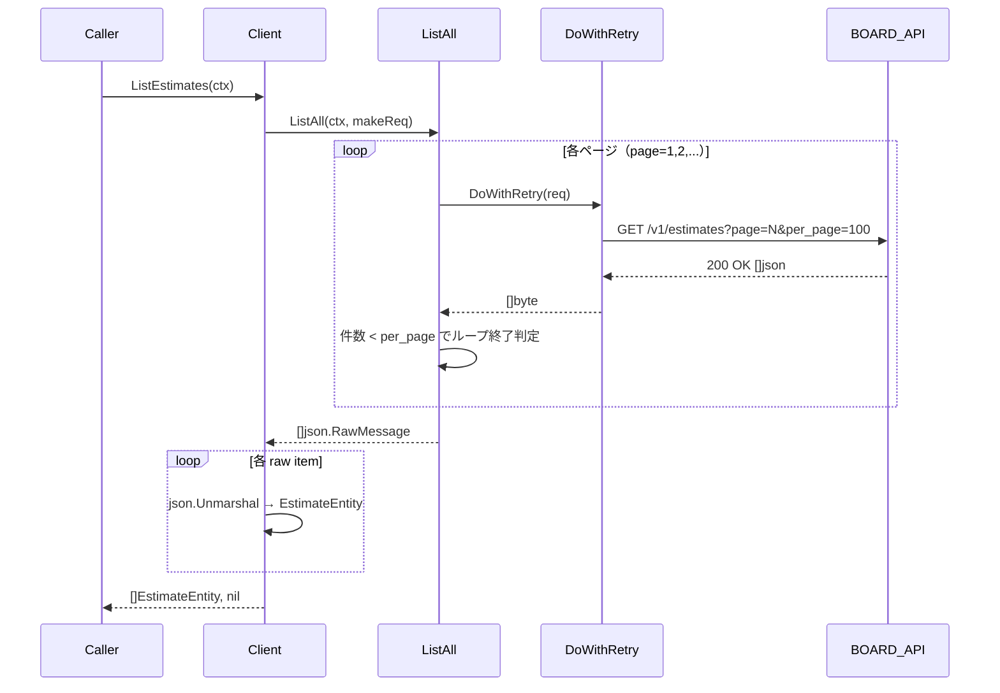
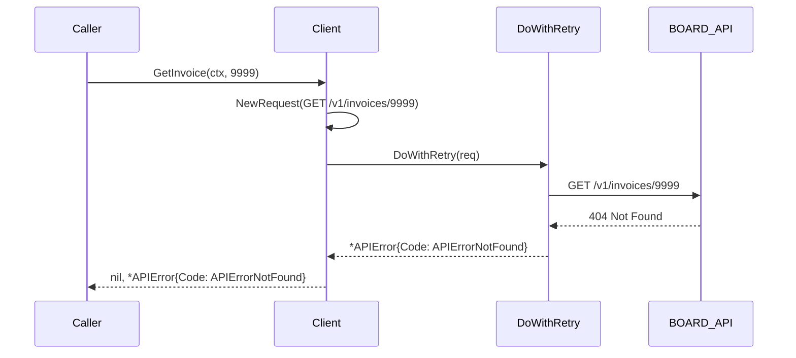
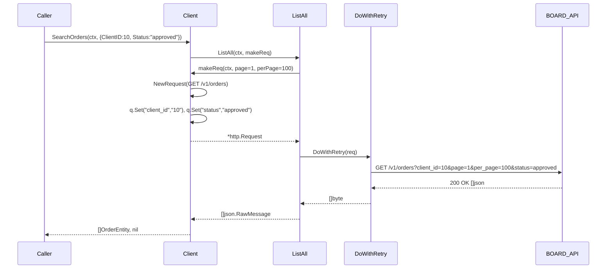

# マイルストーン M07: boardapi ドキュメント系エンティティ

## 概要

`internal/boardapi` パッケージに5つのドキュメント系エンティティ（estimates, invoices, orders, deliveries, receipts）の Go struct 型定義と、List / Get / Search の API メソッドを実装する。M06 で確立した `ListAll()` + `DoWithRetry()` パターンを踏襲し、ページネーション・リトライを透過的に処理する。

---

## スコープ

### 実装範囲

- `internal/boardapi/estimates.go` — Estimate 型定義 + ListEstimates / GetEstimate / SearchEstimates
- `internal/boardapi/invoices.go` — Invoice 型定義 + ListInvoices / GetInvoice / SearchInvoices
- `internal/boardapi/orders.go` — Order 型定義 + ListOrders / GetOrder / SearchOrders
- `internal/boardapi/deliveries.go` — Delivery 型定義 + ListDeliveries / GetDelivery / SearchDeliveries
- `internal/boardapi/receipts.go` — Receipt 型定義 + ListReceipts / GetReceipt / SearchReceipts
- `internal/boardapi/client_test.go` — T67〜T111 追加（各エンティティのテスト）

### スコープ外

- repository 層（M11〜）
- SQLite キャッシュ（M10〜）
- CLI コマンド（M19〜）
- MCP サーバー（M28〜）
- write 系 API (create/update/delete)

---

## エンドポイントと型定義

### BOARD API エンドポイント一覧

| エンティティ | List | Get | Search |
|---|---|---|---|
| estimates | GET /v1/estimates | GET /v1/estimates/:id | GET /v1/estimates?q=... |
| invoices | GET /v1/invoices | GET /v1/invoices/:id | GET /v1/invoices?q=... |
| orders | GET /v1/orders | GET /v1/orders/:id | GET /v1/orders?q=... |
| deliveries | GET /v1/deliveries | GET /v1/deliveries/:id | GET /v1/deliveries?q=... |
| receipts | GET /v1/receipts | GET /v1/receipts/:id | GET /v1/receipts?q=... |

### クエリパラメータ共通

- `page` (int): ページ番号（1始まり）
- `per_page` (int): 1ページあたりの件数（最大100）

### Search クエリパラメータ（エンティティ別）

#### estimates（見積）

- `client_id` (int): 顧客ID
- `project_id` (int): 案件ID
- `status` (string): ステータス（例: "draft", "sent", "approved"）
- `updated_at_from` (string): 更新日時フィルタ（ISO 8601）

#### invoices（請求書）

- `client_id` (int): 顧客ID
- `project_id` (int): 案件ID
- `status` (string): ステータス（例: "draft", "sent", "paid"）
- `updated_at_from` (string): 更新日時フィルタ（ISO 8601）

#### orders（発注書）

- `client_id` (int): 顧客ID
- `project_id` (int): 案件ID
- `status` (string): ステータス
- `updated_at_from` (string): 更新日時フィルタ（ISO 8601）

#### deliveries（納品書）

- `client_id` (int): 顧客ID
- `project_id` (int): 案件ID
- `status` (string): ステータス
- `updated_at_from` (string): 更新日時フィルタ（ISO 8601）

#### receipts（領収書）

- `client_id` (int): 顧客ID
- `project_id` (int): 案件ID
- `status` (string): ステータス
- `updated_at_from` (string): 更新日時フィルタ（ISO 8601）

---

## Go struct 型定義

### estimates.go

```go
// EstimateEntity は BOARD API の見積エンティティ。
// GET /v1/estimates レスポンスの1要素に対応。
type EstimateEntity struct {
    ID             int     `json:"id"`
    ClientID       int     `json:"client_id"`
    ProjectID      int     `json:"project_id"`
    Title          string  `json:"title"`
    TotalAmount    float64 `json:"total_amount"`
    Status         string  `json:"status"`
    EstimateDate   string  `json:"estimate_date"`   // ISO 8601 date
    ExpirationDate string  `json:"expiration_date"` // ISO 8601 date
    Memo           string  `json:"memo"`
    UpdatedAt      string  `json:"updated_at"` // ISO 8601
    CreatedAt      string  `json:"created_at"` // ISO 8601
}

// EstimateSearchParams は SearchEstimates のパラメータ。
type EstimateSearchParams struct {
    ClientID      int
    ProjectID     int
    Status        string
    UpdatedAtFrom string
}
```

### invoices.go

```go
// InvoiceEntity は BOARD API の請求書エンティティ。
// GET /v1/invoices レスポンスの1要素に対応。
type InvoiceEntity struct {
    ID          int     `json:"id"`
    ClientID    int     `json:"client_id"`
    ProjectID   int     `json:"project_id"`
    Title       string  `json:"title"`
    TotalAmount float64 `json:"total_amount"`
    Status      string  `json:"status"`
    InvoiceDate string  `json:"invoice_date"` // ISO 8601 date
    DueDate     string  `json:"due_date"`     // ISO 8601 date
    Memo        string  `json:"memo"`
    UpdatedAt   string  `json:"updated_at"` // ISO 8601
    CreatedAt   string  `json:"created_at"` // ISO 8601
}

// InvoiceSearchParams は SearchInvoices のパラメータ。
type InvoiceSearchParams struct {
    ClientID      int
    ProjectID     int
    Status        string
    UpdatedAtFrom string
}
```

### orders.go

```go
// OrderEntity は BOARD API の発注書エンティティ。
// GET /v1/orders レスポンスの1要素に対応。
type OrderEntity struct {
    ID          int     `json:"id"`
    ClientID    int     `json:"client_id"`
    ProjectID   int     `json:"project_id"`
    Title       string  `json:"title"`
    TotalAmount float64 `json:"total_amount"`
    Status      string  `json:"status"`
    OrderDate   string  `json:"order_date"` // ISO 8601 date
    Memo        string  `json:"memo"`
    UpdatedAt   string  `json:"updated_at"` // ISO 8601
    CreatedAt   string  `json:"created_at"` // ISO 8601
}

// OrderSearchParams は SearchOrders のパラメータ。
type OrderSearchParams struct {
    ClientID      int
    ProjectID     int
    Status        string
    UpdatedAtFrom string
}
```

### deliveries.go

```go
// DeliveryEntity は BOARD API の納品書エンティティ。
// GET /v1/deliveries レスポンスの1要素に対応。
type DeliveryEntity struct {
    ID           int     `json:"id"`
    ClientID     int     `json:"client_id"`
    ProjectID    int     `json:"project_id"`
    Title        string  `json:"title"`
    TotalAmount  float64 `json:"total_amount"`
    Status       string  `json:"status"`
    DeliveryDate string  `json:"delivery_date"` // ISO 8601 date
    Memo         string  `json:"memo"`
    UpdatedAt    string  `json:"updated_at"` // ISO 8601
    CreatedAt    string  `json:"created_at"` // ISO 8601
}

// DeliverySearchParams は SearchDeliveries のパラメータ。
type DeliverySearchParams struct {
    ClientID      int
    ProjectID     int
    Status        string
    UpdatedAtFrom string
}
```

### receipts.go

```go
// ReceiptEntity は BOARD API の領収書エンティティ。
// GET /v1/receipts レスポンスの1要素に対応。
type ReceiptEntity struct {
    ID          int     `json:"id"`
    ClientID    int     `json:"client_id"`
    ProjectID   int     `json:"project_id"`
    Title       string  `json:"title"`
    TotalAmount float64 `json:"total_amount"`
    Status      string  `json:"status"`
    ReceiptDate string  `json:"receipt_date"` // ISO 8601 date
    Memo        string  `json:"memo"`
    UpdatedAt   string  `json:"updated_at"` // ISO 8601
    CreatedAt   string  `json:"created_at"` // ISO 8601
}

// ReceiptSearchParams は SearchReceipts のパラメータ。
type ReceiptSearchParams struct {
    ClientID      int
    ProjectID     int
    Status        string
    UpdatedAtFrom string
}
```

---

## API メソッド設計（M06 パターン踏襲）

全エンティティで以下の共通パターンを適用する。

### List メソッド

```go
func (c *Client) ListEstimates(ctx context.Context) ([]EstimateEntity, error) {
    makeReq := func(ctx context.Context, page, perPage int) (*http.Request, error) {
        req, err := c.NewRequest(ctx, http.MethodGet, "/v1/estimates", nil)
        if err \!= nil {
            return nil, err
        }
        q := req.URL.Query()
        q.Set("page", strconv.Itoa(page))
        q.Set("per_page", strconv.Itoa(perPage))
        req.URL.RawQuery = q.Encode()
        return req, nil
    }
    items, err := c.ListAll(ctx, makeReq)
    if err \!= nil {
        return nil, err
    }
    result := make([]EstimateEntity, 0, len(items))
    for _, raw := range items {
        var x EstimateEntity
        if err := json.Unmarshal(raw, &x); err \!= nil {
            return nil, &APIError{Code: APIErrorUnknown, Message: "ListEstimates: unmarshal: " + err.Error()}
        }
        result = append(result, x)
    }
    return result, nil
}
```

### Get メソッド

```go
func (c *Client) GetEstimate(ctx context.Context, id int) (*EstimateEntity, error) {
    req, err := c.NewRequest(ctx, http.MethodGet, fmt.Sprintf("/v1/estimates/%d", id), nil)
    if err \!= nil {
        return nil, err
    }
    body, err := c.DoWithRetry(req)
    if err \!= nil {
        return nil, err
    }
    var x EstimateEntity
    if err := json.Unmarshal(body, &x); err \!= nil {
        return nil, &APIError{Code: APIErrorUnknown, Message: "GetEstimate: unmarshal: " + err.Error()}
    }
    return &x, nil
}
```

### Search メソッド

```go
func (c *Client) SearchEstimates(ctx context.Context, params EstimateSearchParams) ([]EstimateEntity, error) {
    makeReq := func(ctx context.Context, page, perPage int) (*http.Request, error) {
        req, err := c.NewRequest(ctx, http.MethodGet, "/v1/estimates", nil)
        if err \!= nil {
            return nil, err
        }
        q := req.URL.Query()
        q.Set("page", strconv.Itoa(page))
        q.Set("per_page", strconv.Itoa(perPage))
        if params.ClientID \!= 0 {
            q.Set("client_id", strconv.Itoa(params.ClientID))
        }
        if params.ProjectID \!= 0 {
            q.Set("project_id", strconv.Itoa(params.ProjectID))
        }
        if params.Status \!= "" {
            q.Set("status", params.Status)
        }
        if params.UpdatedAtFrom \!= "" {
            q.Set("updated_at_from", params.UpdatedAtFrom)
        }
        req.URL.RawQuery = q.Encode()
        return req, nil
    }
    items, err := c.ListAll(ctx, makeReq)
    if err \!= nil {
        return nil, err
    }
    result := make([]EstimateEntity, 0, len(items))
    for _, raw := range items {
        var x EstimateEntity
        if err := json.Unmarshal(raw, &x); err \!= nil {
            return nil, &APIError{Code: APIErrorUnknown, Message: "SearchEstimates: unmarshal: " + err.Error()}
        }
        result = append(result, x)
    }
    return result, nil
}
```

他の4エンティティ（invoices, orders, deliveries, receipts）も同一パターン。エンドポイントパス・型名・メソッド名のみ差し替え。

---

## TDD 設計書（Red → Green → Refactor）

### テスト番号体系

M07 では T67〜T111 を使用（T01〜T66 は M04/M05/M06 で使用済み）。

### Phase Red: 先に失敗するテストを書く

#### estimates エンティティ（T67〜T72）

**T67: ListEstimates — 正常系（2件）**
```
入力:
  httptest.Server: page=1 で 2件返す, page=2 で 0件
期待:
  []EstimateEntity{len=2}
  ID, ClientID, ProjectID, Title, TotalAmount, Status, EstimateDate,
  ExpirationDate が JSON から正しくデシリアライズされている
```

**T68: ListEstimates — APIエラー（401）**
```
入力:
  httptest.Server: 401 Unauthorized
期待:
  error \!= nil, *APIError{Code: APIErrorUnauthorized}
```

**T69: GetEstimate — 正常系**
```
入力:
  httptest.Server: GET /v1/estimates/100 -> EstimateEntity{ID:100, Title:"見積書2026-001"}
期待:
  *EstimateEntity{ID:100, Title:"見積書2026-001"}, error == nil
```

**T70: GetEstimate — 404 Not Found**
```
入力:
  httptest.Server: GET /v1/estimates/9999 -> 404
期待:
  nil, *APIError{Code: APIErrorNotFound}
```

**T71: SearchEstimates — ClientID + Status パラメータ付き**
```
入力:
  params = {ClientID: 10, Status: "sent"}
  httptest.Server: クエリパラメータ client_id="10", status="sent" を検証して 1件返す
期待:
  []EstimateEntity{len=1}
  クエリパラメータが正しく設定されていること
```

**T72: SearchEstimates — UpdatedAtFrom パラメータ付き**
```
入力:
  params = {UpdatedAtFrom: "2026-01-01T00:00:00Z"}
  httptest.Server: updated_at_from パラメータを検証
期待:
  updated_at_from="2026-01-01T00:00:00Z" がクエリに含まれる
```

#### invoices エンティティ（T73〜T78）

**T73: ListInvoices — 正常系（2件）**
```
入力:
  httptest.Server: page=1 で 2件返す, page=2 で 0件
期待:
  []InvoiceEntity{len=2}
  ID, ClientID, ProjectID, Title, TotalAmount, Status, InvoiceDate, DueDate が正しい
```

**T74: ListInvoices — APIエラー（401）**
```
入力:
  httptest.Server: 401 Unauthorized
期待:
  error \!= nil, *APIError{Code: APIErrorUnauthorized}
```

**T75: GetInvoice — 正常系**
```
入力:
  httptest.Server: GET /v1/invoices/200 -> InvoiceEntity{ID:200, Title:"請求書2026-001"}
期待:
  *InvoiceEntity{ID:200, Title:"請求書2026-001"}, error == nil
```

**T76: GetInvoice — 404 Not Found**
```
入力:
  httptest.Server: GET /v1/invoices/9999 -> 404
期待:
  nil, *APIError{Code: APIErrorNotFound}
```

**T77: SearchInvoices — ProjectID + Status パラメータ付き**
```
入力:
  params = {ProjectID: 300, Status: "paid"}
  httptest.Server: クエリパラメータ project_id="300", status="paid" を検証して 1件返す
期待:
  []InvoiceEntity{len=1}
```

**T78: SearchInvoices — 空結果**
```
入力:
  httptest.Server: 空配列 []
期待:
  []InvoiceEntity{len=0}, error == nil
```

#### orders エンティティ（T79〜T84）

**T79: ListOrders — 正常系（3件）**
```
入力:
  httptest.Server: page=1 で 3件返す, page=2 で 0件
期待:
  []OrderEntity{len=3}
  ID, ClientID, ProjectID, Title, TotalAmount, Status, OrderDate が正しい
```

**T80: ListOrders — APIエラー（401）**
```
入力:
  httptest.Server: 401 Unauthorized
期待:
  error \!= nil, *APIError{Code: APIErrorUnauthorized}
```

**T81: GetOrder — 正常系**
```
入力:
  httptest.Server: GET /v1/orders/300 -> OrderEntity{ID:300, Title:"発注書2026-001"}
期待:
  *OrderEntity{ID:300, Title:"発注書2026-001"}, error == nil
```

**T82: GetOrder — 404 Not Found**
```
入力:
  httptest.Server: GET /v1/orders/9999 -> 404
期待:
  nil, *APIError{Code: APIErrorNotFound}
```

**T83: SearchOrders — ClientID パラメータ付き**
```
入力:
  params = {ClientID: 10}
  httptest.Server: client_id="10" を検証して 2件返す
期待:
  []OrderEntity{len=2}
```

**T84: SearchOrders — Status パラメータ付き**
```
入力:
  params = {Status: "approved"}
  httptest.Server: status="approved" を検証
期待:
  status パラメータが正しく設定されていること
```

#### deliveries エンティティ（T85〜T90）

**T85: ListDeliveries — 正常系（2件）**
```
入力:
  httptest.Server: page=1 で 2件返す, page=2 で 0件
期待:
  []DeliveryEntity{len=2}
  ID, ClientID, ProjectID, Title, TotalAmount, Status, DeliveryDate が正しい
```

**T86: ListDeliveries — APIエラー（401）**
```
入力:
  httptest.Server: 401 Unauthorized
期待:
  error \!= nil, *APIError{Code: APIErrorUnauthorized}
```

**T87: GetDelivery — 正常系**
```
入力:
  httptest.Server: GET /v1/deliveries/400 -> DeliveryEntity{ID:400, Title:"納品書2026-001"}
期待:
  *DeliveryEntity{ID:400, Title:"納品書2026-001"}, error == nil
```

**T88: GetDelivery — 404 Not Found**
```
入力:
  httptest.Server: GET /v1/deliveries/9999 -> 404
期待:
  nil, *APIError{Code: APIErrorNotFound}
```

**T89: SearchDeliveries — ProjectID パラメータ付き**
```
入力:
  params = {ProjectID: 300}
  httptest.Server: project_id="300" を検証して 1件返す
期待:
  []DeliveryEntity{len=1}
```

**T90: SearchDeliveries — UpdatedAtFrom パラメータ付き**
```
入力:
  params = {UpdatedAtFrom: "2026-03-01T00:00:00Z"}
期待:
  updated_at_from="2026-03-01T00:00:00Z" がクエリに含まれる
```

#### receipts エンティティ（T91〜T96）

**T91: ListReceipts — 正常系（2件）**
```
入力:
  httptest.Server: page=1 で 2件返す, page=2 で 0件
期待:
  []ReceiptEntity{len=2}
  ID, ClientID, ProjectID, Title, TotalAmount, Status, ReceiptDate が正しい
```

**T92: ListReceipts — APIエラー（401）**
```
入力:
  httptest.Server: 401 Unauthorized
期待:
  error \!= nil, *APIError{Code: APIErrorUnauthorized}
```

**T93: GetReceipt — 正常系**
```
入力:
  httptest.Server: GET /v1/receipts/500 -> ReceiptEntity{ID:500, Title:"領収書2026-001"}
期待:
  *ReceiptEntity{ID:500, Title:"領収書2026-001"}, error == nil
```

**T94: GetReceipt — 404 Not Found**
```
入力:
  httptest.Server: GET /v1/receipts/9999 -> 404
期待:
  nil, *APIError{Code: APIErrorNotFound}
```

**T95: SearchReceipts — ClientID + Status パラメータ付き**
```
入力:
  params = {ClientID: 10, Status: "issued"}
  httptest.Server: client_id="10", status="issued" を検証して 1件返す
期待:
  []ReceiptEntity{len=1}
```

**T96: SearchReceipts — 空結果**
```
入力:
  httptest.Server: 空配列 []
期待:
  []ReceiptEntity{len=0}, error == nil
```

#### クロスカット（T97〜T111）

**T97: ListEstimates — JSONデシリアライズエラー**
```
入力:
  httptest.Server: 不正な JSON を返す（例: `[{invalid}]`）
期待:
  *APIError{Code: APIErrorUnknown, Message contains "ListEstimates: unmarshal"}
```

**T98: GetEstimate — context キャンセル時**
```
入力:
  キャンセル済みコンテキスト
期待:
  error \!= nil (context.Canceled)
```

**T99: ListInvoices — JSONデシリアライズエラー**
```
入力:
  httptest.Server: 不正な JSON を返す
期待:
  *APIError{Code: APIErrorUnknown, Message contains "ListInvoices: unmarshal"}
```

**T100: ListOrders — JSONデシリアライズエラー**
```
入力:
  httptest.Server: 不正な JSON を返す
期待:
  *APIError{Code: APIErrorUnknown, Message contains "ListOrders: unmarshal"}
```

**T101: ListDeliveries — JSONデシリアライズエラー**
```
入力:
  httptest.Server: 不正な JSON を返す
期待:
  *APIError{Code: APIErrorUnknown, Message contains "ListDeliveries: unmarshal"}
```

**T102: ListReceipts — JSONデシリアライズエラー**
```
入力:
  httptest.Server: 不正な JSON を返す
期待:
  *APIError{Code: APIErrorUnknown, Message contains "ListReceipts: unmarshal"}
```

**T103: SearchEstimates — ProjectID パラメータ付き**
```
入力:
  params = {ProjectID: 200}
期待:
  project_id="200" がクエリパラメータに含まれる
```

**T104: SearchInvoices — UpdatedAtFrom パラメータ付き**
```
入力:
  params = {UpdatedAtFrom: "2026-02-01T00:00:00Z"}
期待:
  updated_at_from="2026-02-01T00:00:00Z" がクエリに含まれる
```

**T105: SearchOrders — ProjectID + UpdatedAtFrom パラメータ付き**
```
入力:
  params = {ProjectID: 100, UpdatedAtFrom: "2026-01-01T00:00:00Z"}
期待:
  project_id と updated_at_from の両方がクエリに含まれる
```

**T106: SearchDeliveries — ClientID + Status パラメータ付き**
```
入力:
  params = {ClientID: 5, Status: "delivered"}
期待:
  client_id="5", status="delivered" がクエリに含まれる
```

**T107: SearchReceipts — ProjectID パラメータ付き**
```
入力:
  params = {ProjectID: 400}
期待:
  project_id="400" がクエリに含まれる
```

**T108: ListEstimates — ページネーション 2ページ（100件 + 50件）**
```
入力:
  httptest.Server: page=1 で 100件, page=2 で 50件, page=3 で 0件
期待:
  []EstimateEntity{len=150}
```

**T109: GetInvoice — context キャンセル時**
```
入力:
  キャンセル済みコンテキスト
期待:
  error \!= nil (context.Canceled)
```

**T110: GetOrder — context キャンセル時**
```
入力:
  キャンセル済みコンテキスト
期待:
  error \!= nil (context.Canceled)
```

**T111: SearchReceipts — 全パラメータ組み合わせ**
```
入力:
  params = {ClientID: 1, ProjectID: 2, Status: "issued", UpdatedAtFrom: "2026-01-01T00:00:00Z"}
期待:
  client_id, project_id, status, updated_at_from の全パラメータがクエリに含まれる
```

### Phase Green: テストを通す最小実装

各ファイルの実装順:
1. `estimates.go` → T67〜T72, T97〜T98, T103, T108
2. `invoices.go` → T73〜T78, T99, T104, T109
3. `orders.go` → T79〜T84, T100, T105, T110
4. `deliveries.go` → T85〜T90, T101, T106
5. `receipts.go` → T91〜T96, T102, T107, T111

### Phase Refactor: 重複排除・整理

- 各エンティティの List/Search ロジックは共通パターンを踏襲（M06 と同様）
- デシリアライズエラーのメッセージフォーマット統一確認
- Search パラメータ付与ロジックの整合性確認（ゼロ値スキップ）
- `go vet ./...` + `gofmt -l .` でクリーン確認

---

## シーケンス図

### ListEstimates 正常フロー（ページネーション含む）



### GetInvoice エラーフロー（404）



### SearchOrders フロー（パラメータ付き）



---

## ファイル構成

```
internal/boardapi/
├── client.go              # 変更なし（M04/M05 完成済み）
├── auth.go                # 変更なし
├── error.go               # 変更なし
├── retry.go               # 変更なし
├── pagination.go          # 変更なし
├── clients.go             # 変更なし（M06 完成済み）
├── client_branches.go     # 変更なし（M06 完成済み）
├── contacts.go            # 変更なし（M06 完成済み）
├── projects.go            # 変更なし（M06 完成済み）
├── project_costs.go       # 変更なし（M06 完成済み）
├── estimates.go           # 新規: EstimateEntity 型 + List/Get/Search
├── invoices.go            # 新規: InvoiceEntity 型 + List/Get/Search
├── orders.go              # 新規: OrderEntity 型 + List/Get/Search
├── deliveries.go          # 新規: DeliveryEntity 型 + List/Get/Search
├── receipts.go            # 新規: ReceiptEntity 型 + List/Get/Search
└── client_test.go         # 拡張: T67〜T111 追加
```

---

## 実装ステップ

### Step 1: estimates.go + テスト T67〜T72, T97〜T98, T103, T108（Red → Green）

1. Red: T67〜T72, T97〜T98, T103, T108 を `client_test.go` に追記
2. Green: `estimates.go` を実装（EstimateEntity + ListEstimates/GetEstimate/SearchEstimates）
3. `go test ./internal/boardapi/... -run TestListEstimates -v` で確認
4. `go test ./internal/boardapi/... -run TestGetEstimate -v` で確認
5. `go test ./internal/boardapi/... -run TestSearchEstimates -v` で確認

### Step 2: invoices.go + テスト T73〜T78, T99, T104, T109（Red → Green）

1. Red: T73〜T78, T99, T104, T109 を `client_test.go` に追記
2. Green: `invoices.go` を実装（InvoiceEntity + ListInvoices/GetInvoice/SearchInvoices）
3. `go test ./internal/boardapi/... -run TestListInvoices -v` で確認

### Step 3: orders.go + テスト T79〜T84, T100, T105, T110（Red → Green）

1. Red: T79〜T84, T100, T105, T110 を `client_test.go` に追記
2. Green: `orders.go` を実装（OrderEntity + ListOrders/GetOrder/SearchOrders）
3. `go test ./internal/boardapi/... -run TestListOrders -v` で確認

### Step 4: deliveries.go + テスト T85〜T90, T101, T106（Red → Green）

1. Red: T85〜T90, T101, T106 を `client_test.go` に追記
2. Green: `deliveries.go` を実装（DeliveryEntity + ListDeliveries/GetDelivery/SearchDeliveries）
3. `go test ./internal/boardapi/... -run TestListDeliveries -v` で確認

### Step 5: receipts.go + テスト T91〜T96, T102, T107, T111（Red → Green）

1. Red: T91〜T96, T102, T107, T111 を `client_test.go` に追記
2. Green: `receipts.go` を実装（ReceiptEntity + ListReceipts/GetReceipt/SearchReceipts）
3. `go test ./internal/boardapi/... -run TestListReceipts -v` で確認

### Step 6: Refactor

- 全エンティティのエラーメッセージフォーマット統一確認
- Search パラメータのゼロ値スキップロジック確認
- テストヘルパー関数の整理（M06 の共通パターンとの整合性）
- `go vet ./...`, `gofmt -l .` でクリーン確認

### Step 7: 全テスト実行・確認

```bash
go test ./internal/boardapi/... -v -count=1
go vet ./internal/boardapi/...
gofmt -l ./internal/boardapi/
```

---

## アーキテクチャ整合性

### 既存パターンとの整合性

- `DoWithRetry()` を使用（M05 確立パターン）
- `ListAll()` を使用（M05 確立パターン）
- エラーは `*APIError` で統一（M04 確立パターン）
- `NewRequest()` + `c.baseURL` でURL構築（M04 確立パターン）
- unmarshal エラー: `&APIError{Code: APIErrorUnknown, Message: "FuncName: unmarshal: " + err.Error()}`

### 型命名規則（M06 との差異）

M06 では一部の型（`ClientEntity`）に `Entity` サフィックスを付けた（HTTP クライアント型 `Client` との衝突回避）。M07 の5エンティティは全て `Entity` サフィックスを付ける（`EstimateEntity`, `InvoiceEntity`, `OrderEntity`, `DeliveryEntity`, `ReceiptEntity`）。

理由: ドキュメント系エンティティ名（Estimate, Invoice, Order, Delivery, Receipt）は Go の標準ライブラリや当パッケージ内の他の型と衝突しないが、将来的な拡張や一貫性のために `Entity` サフィックスを統一適用する。

### Search パラメータのゼロ値スキップ規則

- `int` フィールド: `\!= 0` の場合のみクエリパラメータに追加
- `string` フィールド: `\!= ""` の場合のみクエリパラメータに追加

### 依存方向

```
estimates.go → client.go（*Client receiver）
estimates.go → error.go（APIError）
estimates.go → pagination.go（ListAll）
```

循環依存なし。他の4エンティティも同様。

---

## リスク評価

| リスク | 重大度 | 対策 |
|--------|--------|------|
| BOARD API の実際のフィールド構造がスペック推定と乖離 | Medium | `json:",omitempty"` は使わず、未知フィールドは Go のデフォルト動作（無視）に委ねる。統合テスト時に実 API で確認 |
| TotalAmount の型（int vs float64） | Medium | BOARD API が整数金額を返す可能性があるが float64 で受け取れる。一方 BOARD API が文字列型で返す場合は unmarshal エラーになる。その場合は string 型に変更（統合テストで確認） |
| 日付フィールドの書式（date vs datetime） | Low | EstimateDate, DueDate 等は日付文字列として string 型で受け取る。フォーマット変換は上位層の責務 |
| ドキュメント系エンティティのエンドポイントが異なる可能性 | Low | テストはモックサーバーで行う。実 API 確認はロードマップの統合テストフェーズで実施 |
| Search パラメータの実際の仕様と乖離 | Low | SearchParams struct に保守的なパラメータセットを定義。不要なパラメータはゼロ値のためリクエストに含まれない |
| 5エンティティの実装量（コード重複） | Low | M06 で確立した共通パターンをそのまま踏襲。実装の定型化により品質リスクは低い |

---

## チェックリスト

### 実装実現可能性と完全性

- [x] 手順の抜け漏れがないか（Step 1〜7 で端から端まで一貫）
- [x] 各ステップが十分に具体的か（ファイル名・メソッド名・テスト番号まで明記）
- [x] 依存関係が明示されているか（Step 1 → Step 5 の順序、全て独立）
- [x] 変更対象ファイルが網羅されているか（5ファイル新規 + client_test.go 拡張）
- [x] 影響範囲が正確か（M04/M05/M06 の既存ファイルに変更なし）

### TDD テスト設計の品質

- [x] 正常系テストケースが網羅（T67, T69, T73, T75, T79, T81, T85, T87, T91, T93）
- [x] 異常系テストケースが定義（T68, T70, T74, T76, T80, T82, T86, T88, T92, T94）
- [x] エッジケースが考慮（T78, T96: 空結果, T98, T109, T110: context キャンセル）
- [x] JSONデシリアライズエラーケース（T97, T99, T100, T101, T102）
- [x] ページネーションテスト（T108: 150件）
- [x] 全パラメータ組み合わせテスト（T111）
- [x] 入出力が具体的に記述（各テストに入力・期待出力を明記）
- [x] Red→Green→Refactor の順序が守られている（各 Step に明記）

### アーキテクチャ整合性

- [x] M06 の命名規則に従っている（`Entity` サフィックス統一、メソッド命名）
- [x] 設計パターンが一貫している（ListAll + DoWithRetry の統一利用）
- [x] モジュール分割が適切（エンティティごとに独立ファイル）
- [x] 依存方向が正しい（循環依存なし）
- [x] Search パラメータのゼロ値スキップ規則が統一されている

### リスク評価と対策

- [x] フィールド型の不一致リスクが考慮されている（TotalAmount: float64, 日付: string）
- [x] 統合テストでの実 API 検証計画が明記されている
- [x] 既存ファイル無変更でロールバックが容易

---

## Next Action

> **このプランが承認されたら、以下を順番に実行してください:**
>
> 1. `Skill(devflow:implement)` — このプランに基づいて Step 1〜7 を順番に実行
>
> ユーザーの追加指示は不要です。

---

## Plan Footer

- plan_file: plans/board-m07-boardapi-documents.md
- milestone: M07
- complexity: M
- estimated_files: 5 new + 1 extended
- test_range: T67〜T111 (45 tests)
