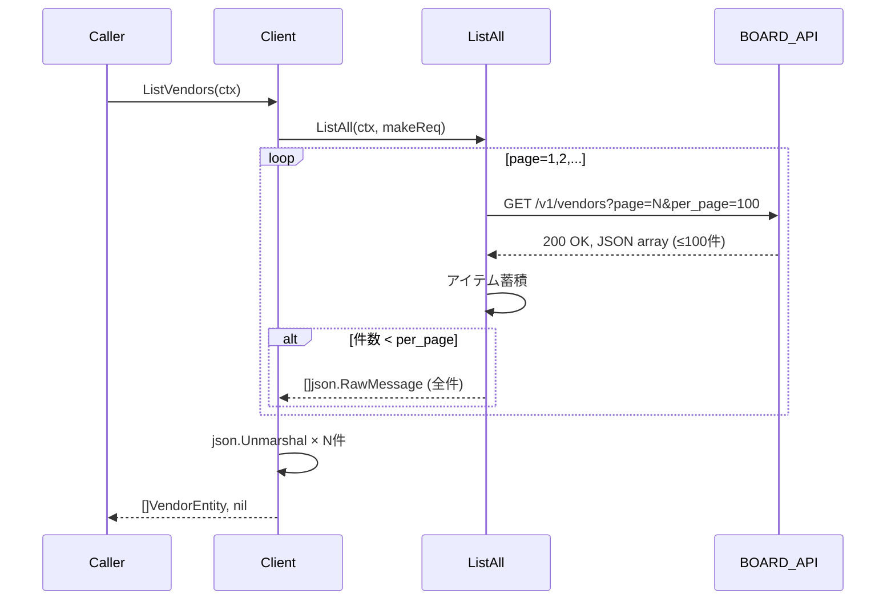
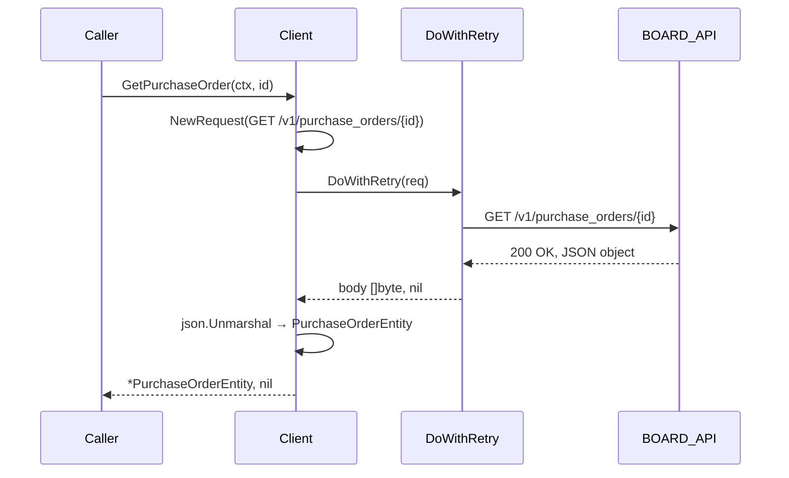
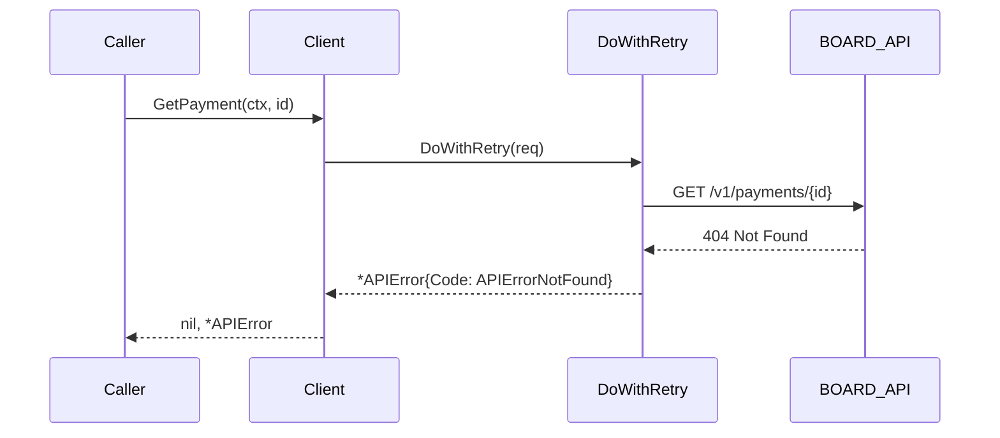
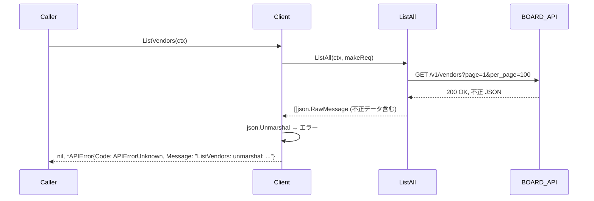

# M08: boardapi ベンダー + 支払系エンティティ実装

## 概要

BOARD API のベンダー（発注先）関連 5 リソースを `internal/boardapi/` に追加する。

- `vendors.go` — 発注先
- `vendor_branches.go` — 発注先支社
- `vendor_contacts.go` — 発注先担当者
- `purchase_orders.go` — 発注書
- `payments.go` — 支払

M06/M07 で確立したパターン（Entity 構造体・SearchParams・ListAll/DoWithRetry・unmarshal error wrap）を踏襲する。

---

## 1. エンティティ設計

### 1.1 VendorEntity（/v1/vendors）

clients.go の `ClientEntity` を対称モデルとする。

```go
type VendorEntity struct {
    ID        int    `json:"id"`
    Name      string `json:"name"`
    Code      string `json:"code"`
    Memo      string `json:"memo"`
    UpdatedAt string `json:"updated_at"` // ISO 8601
    CreatedAt string `json:"created_at"` // ISO 8601
}

type VendorSearchParams struct {
    Name          string
    UpdatedAtFrom string
}
```

### 1.2 VendorBranchEntity（/v1/vendor_branches）

client_branches.go の `ClientBranchEntity` を対称モデルとする。

```go
type VendorBranchEntity struct {
    ID         int    `json:"id"`
    VendorID   int    `json:"vendor_id"`
    Name       string `json:"name"`
    PostalCode string `json:"postal_code"`
    Address    string `json:"address"`
    Phone      string `json:"phone"`
    Fax        string `json:"fax"`
    Memo       string `json:"memo"`
    UpdatedAt  string `json:"updated_at"` // ISO 8601
    CreatedAt  string `json:"created_at"` // ISO 8601
}

type VendorBranchSearchParams struct {
    VendorID int
    Name     string
}
```

### 1.3 VendorContactEntity（/v1/vendor_contacts）

contacts.go の `ContactEntity` を対称モデルとする。

```go
type VendorContactEntity struct {
    ID               int    `json:"id"`
    VendorID         int    `json:"vendor_id"`
    VendorBranchID   int    `json:"vendor_branch_id"`
    Name             string `json:"name"`
    NameKana         string `json:"name_kana"`
    Title            string `json:"title"`
    Email            string `json:"email"`
    Phone            string `json:"phone"`
    Memo             string `json:"memo"`
    UpdatedAt        string `json:"updated_at"` // ISO 8601
    CreatedAt        string `json:"created_at"` // ISO 8601
}

type VendorContactSearchParams struct {
    VendorID int
    Name     string
    Email    string
}
```

### 1.4 PurchaseOrderEntity（/v1/purchase_orders）

estimates.go の `EstimateEntity` を対称モデルとする（ClientID → VendorID）。

```go
type PurchaseOrderEntity struct {
    ID            int     `json:"id"`
    VendorID      int     `json:"vendor_id"`
    ProjectID     int     `json:"project_id"`
    Title         string  `json:"title"`
    TotalAmount   float64 `json:"total_amount"`
    Status        string  `json:"status"`
    OrderDate     string  `json:"order_date"`     // ISO 8601 date
    DeliveryDate  string  `json:"delivery_date"`  // ISO 8601 date
    Memo          string  `json:"memo"`
    UpdatedAt     string  `json:"updated_at"` // ISO 8601
    CreatedAt     string  `json:"created_at"` // ISO 8601
}

type PurchaseOrderSearchParams struct {
    VendorID      int
    ProjectID     int
    Status        string
    UpdatedAtFrom string
}
```

### 1.5 PaymentEntity（/v1/payments）

```go
type PaymentEntity struct {
    ID              int     `json:"id"`
    VendorID        int     `json:"vendor_id"`
    PurchaseOrderID int     `json:"purchase_order_id"`
    Amount          float64 `json:"amount"`
    Status          string  `json:"status"`
    PaymentDate     string  `json:"payment_date"` // ISO 8601 date
    Memo            string  `json:"memo"`
    UpdatedAt       string  `json:"updated_at"` // ISO 8601
    CreatedAt       string  `json:"created_at"` // ISO 8601
}

type PaymentSearchParams struct {
    VendorID        int
    PurchaseOrderID int
    Status          string
    UpdatedAtFrom   string
}
```

---

## 2. TDD テストケース一覧（T112〜T156）

M07 と同じ構成: リソースごとに基本6テスト × 5 + クロスカット15テスト = 45テスト。

### vendors エンティティ（T112〜T117）

**T112: ListVendors — 正常系（2件）**
- 入力: 200 OK, JSON array 2件
- 期待: `[]VendorEntity` len=2, ID/Name/Code が正しく unmarshal される

**T113: ListVendors — APIエラー（401）**
- 入力: 401 Unauthorized
- 期待: `*APIError` が返る（nil ではない）

**T114: GetVendor — 正常系**
- 入力: `/v1/vendors/1` に 200 OK
- 期待: `*VendorEntity` ID=1, Name が一致

**T115: GetVendor — 404 Not Found**
- 入力: 404 Not Found
- 期待: `*APIError` Code=APIErrorNotFound

**T116: SearchVendors — Name パラメータ付き**
- 入力: `name=株式会社A` クエリパラメータ付きリクエスト
- 期待: クエリストリングに `name=` が含まれる、結果 1件

**T117: SearchVendors — UpdatedAtFrom パラメータ付き**
- 入力: `updated_at_from=2024-01-01T00:00:00Z`
- 期待: クエリストリングに `updated_at_from=` が含まれる

### vendor_branches エンティティ（T118〜T123）

**T118: ListVendorBranches — 正常系（2件）**
- 入力: 200 OK, array 2件
- 期待: `[]VendorBranchEntity` len=2, VendorID が正しく unmarshal される

**T119: ListVendorBranches — APIエラー（401）**
- 期待: `*APIError` が返る

**T120: GetVendorBranch — 正常系**
- 入力: `/v1/vendor_branches/10`
- 期待: `*VendorBranchEntity` ID=10, PostalCode が一致

**T121: GetVendorBranch — 404 Not Found**
- 期待: `*APIError` Code=APIErrorNotFound

**T122: SearchVendorBranches — VendorID パラメータ付き**
- 入力: `vendor_id=5`
- 期待: クエリに `vendor_id=5` が含まれる

**T123: SearchVendorBranches — Name パラメータ付き**
- 入力: `name=東京支社`
- 期待: クエリに `name=` が含まれる

### vendor_contacts エンティティ（T124〜T129）

**T124: ListVendorContacts — 正常系（2件）**
- 期待: `[]VendorContactEntity` len=2, Email が正しく unmarshal される

**T125: ListVendorContacts — APIエラー（401）**
- 期待: `*APIError` が返る

**T126: GetVendorContact — 正常系**
- 期待: `*VendorContactEntity` ID が一致

**T127: GetVendorContact — 404 Not Found**
- 期待: `*APIError` Code=APIErrorNotFound

**T128: SearchVendorContacts — VendorID + Email パラメータ付き**
- 入力: `vendor_id=3`, `email=test@example.com`
- 期待: 両クエリパラメータが含まれる

**T129: SearchVendorContacts — Name パラメータ付き**
- 入力: `name=山田`
- 期待: クエリに `name=` が含まれる

### purchase_orders エンティティ（T130〜T135）

**T130: ListPurchaseOrders — 正常系（3件）**
- 期待: `[]PurchaseOrderEntity` len=3, TotalAmount が float64 で unmarshal される

**T131: ListPurchaseOrders — APIエラー（401）**
- 期待: `*APIError` が返る

**T132: GetPurchaseOrder — 正常系**
- 期待: `*PurchaseOrderEntity` OrderDate が一致

**T133: GetPurchaseOrder — 404 Not Found**
- 期待: `*APIError` Code=APIErrorNotFound

**T134: SearchPurchaseOrders — VendorID + Status パラメータ付き**
- 入力: `vendor_id=1`, `status=approved`
- 期待: 両クエリパラメータが含まれる

**T135: SearchPurchaseOrders — ProjectID + UpdatedAtFrom パラメータ付き**
- 入力: `project_id=10`, `updated_at_from=2024-06-01T00:00:00Z`
- 期待: 両クエリパラメータが含まれる

### payments エンティティ（T136〜T141）

**T136: ListPayments — 正常系（2件）**
- 期待: `[]PaymentEntity` len=2, Amount が float64 で unmarshal される

**T137: ListPayments — APIエラー（401）**
- 期待: `*APIError` が返る

**T138: GetPayment — 正常系**
- 期待: `*PaymentEntity` PaymentDate が一致

**T139: GetPayment — 404 Not Found**
- 期待: `*APIError` Code=APIErrorNotFound

**T140: SearchPayments — VendorID + Status パラメータ付き**
- 入力: `vendor_id=2`, `status=paid`
- 期待: 両クエリパラメータが含まれる

**T141: SearchPayments — PurchaseOrderID パラメータ付き**
- 入力: `purchase_order_id=7`
- 期待: クエリに `purchase_order_id=7` が含まれる

### クロスカット（T142〜T156）

#### ページネーション検証

**T142: ListVendors — ページネーション 2ページ（100件 + 50件）**
- 入力: 1ページ目 100件 → 2ページ目 50件
- 期待: 合計 150件、ListAll が自動処理

**T143: ListPurchaseOrders — ページネーション 2ページ（100件 + 30件）**
- 期待: 合計 130件

#### context キャンセル検証

**T144: GetVendor — context キャンセル時**
- 入力: キャンセル済み context
- 期待: context のエラーが返る（nil でない）

**T145: GetVendorBranch — context キャンセル時**
- 期待: context のエラーが返る

**T146: GetVendorContact — context キャンセル時**
- 期待: context のエラーが返る

**T147: GetPurchaseOrder — context キャンセル時**
- 期待: context のエラーが返る

**T148: GetPayment — context キャンセル時**
- 期待: context のエラーが返る

#### unmarshal エラー検証

**T149: ListVendors — 不正 JSON（unmarshal エラー）**
- 入力: 200 OK, body = `[{"id": "not_an_int"}]`
- 期待: `*APIError` Message に "ListVendors: unmarshal:" が含まれる

**T150: ListPurchaseOrders — 不正 JSON（unmarshal エラー）**
- 期待: `*APIError` Message に "ListPurchaseOrders: unmarshal:" が含まれる

**T151: ListPayments — 不正 JSON（unmarshal エラー）**
- 期待: `*APIError` Message に "ListPayments: unmarshal:" が含まれる

#### Search パラメータゼロ値安全性

**T152: SearchVendors — 全パラメータゼロ値**
- 入力: `VendorSearchParams{}` （ゼロ値）
- 期待: クエリパラメータなしでリクエスト、エラーなし

**T153: SearchVendorBranches — 全パラメータゼロ値**
- 期待: クエリパラメータなしでリクエスト、エラーなし

**T154: SearchPurchaseOrders — 全パラメータゼロ値**
- 期待: クエリパラメータなしでリクエスト、エラーなし

**T155: SearchPayments — 全パラメータゼロ値**
- 期待: クエリパラメータなしでリクエスト、エラーなし

**T156: SearchVendorContacts — 全パラメータゼロ値**
- 期待: クエリパラメータなしでリクエスト、エラーなし

---

## 3. 実装ステップ（TDD Red → Green → Refactor）

M07 と同じ順序: ファイル単位で Red → Green を繰り返し、最後に Refactor。

### Step 1: vendors.go（T112〜T117, T142, T144, T149, T152）

1. Red: T112〜T117, T142, T144, T149, T152 を `client_test.go` に追記
2. `go test ./internal/boardapi/...` → コンパイルエラー（未定義）
3. Green: `vendors.go` を新規作成
4. `go test ./internal/boardapi/...` → 全テスト PASS
5. `go vet ./...` PASS

### Step 2: vendor_branches.go（T118〜T123, T145, T153）

1. Red: T118〜T123, T145, T153 を `client_test.go` に追記
2. Green: `vendor_branches.go` を新規作成
3. `go test ./internal/boardapi/...` → 全テスト PASS

### Step 3: vendor_contacts.go（T124〜T129, T146, T156）

1. Red: T124〜T129, T146, T156 を `client_test.go` に追記
2. Green: `vendor_contacts.go` を新規作成
3. `go test ./internal/boardapi/...` → 全テスト PASS

### Step 4: purchase_orders.go（T130〜T135, T143, T147, T150, T154）

1. Red: T130〜T135, T143, T147, T150, T154 を `client_test.go` に追記
2. Green: `purchase_orders.go` を新規作成
3. `go test ./internal/boardapi/...` → 全テスト PASS

### Step 5: payments.go（T136〜T141, T148, T151, T155）

1. Red: T136〜T141, T148, T151, T155 を `client_test.go` に追記
2. Green: `payments.go` を新規作成
3. `go test ./internal/boardapi/...` → 全テスト PASS

### Step 6: Refactor

- 全 5 ファイルを横断してコメント・命名の統一確認
- `go vet ./...` → PASS
- `gofmt -s -l .` → 差分なし
- `go test ./internal/boardapi/...` → 全 T112〜T156 PASS

---

## 4. ファイル単位の作成順序

```
internal/boardapi/
├── vendors.go            # Step 1（新規）
├── vendor_branches.go    # Step 2（新規）
├── vendor_contacts.go    # Step 3（新規）
├── purchase_orders.go    # Step 4（新規）
├── payments.go           # Step 5（新規）
└── client_test.go        # 拡張: T112〜T156 追記（各 Step で都度追加）
```

既存ファイルへの変更はなし（`client_test.go` への追記のみ）。

---

## 5. シーケンス図

### 5.1 正常系: ListVendors



### 5.2 正常系: GetPurchaseOrder



### 5.3 エラー系: 404 Not Found



### 5.4 エラー系: unmarshal 失敗



---

## 6. リスク評価

| リスク | 確率 | 影響 | 対策 |
|--------|------|------|------|
| BOARD API の実際のフィールドがスペックと異なる | 中 | 低 | JSON の unmarshal は未知フィールドを無視するため実動作に影響なし。フィールド追加は後続 PR で対応可能 |
| `purchase_order_id` のクエリパラメータ名が異なる | 低 | 低 | テスト時に httptest でリクエスト検証。実 API 疎通時に確認 |
| payments の VendorID が実 API に存在しない可能性 | 低 | 低 | ゼロ値安全設計のため SearchParams から除外しても影響なし |
| テスト番号の衝突（M07 T111 との境界） | 低 | 中 | M07 最終が T111 確定済み。M08 は T112 から開始で衝突なし |
| ファイル名の命名揺れ（purchase_order vs purchase_orders） | 低 | 低 | Go ファイル名はリソース名に合わせて複数形（purchase_orders.go）で統一 |

---

## 7. 成功基準

- `go test ./internal/boardapi/...` で T112〜T156 全 45 テスト PASS
- `go vet ./...` エラーなし
- `gofmt -s -l .` 差分なし
- 5 ファイル新規作成（既存ファイル変更は `client_test.go` 追記のみ）
- unmarshal エラーメッセージが `"{FuncName}: unmarshal: "` プレフィックスを持つ

---

## 8. テスト番号マッピング（ファイル別）

| ファイル | 基本テスト | クロスカット |
|---------|----------|------------|
| `vendors.go` | T112〜T117 | T142, T144, T149, T152 |
| `vendor_branches.go` | T118〜T123 | T145, T153 |
| `vendor_contacts.go` | T124〜T129 | T146, T156 |
| `purchase_orders.go` | T130〜T135 | T143, T147, T150, T154 |
| `payments.go` | T136〜T141 | T148, T151, T155 |

M07 で使用済み: T01〜T111
M08 で使用: T112〜T156（計 45 テスト）
