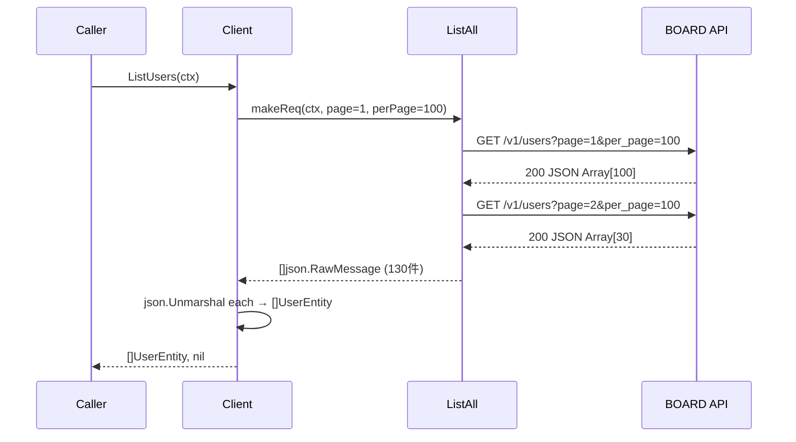
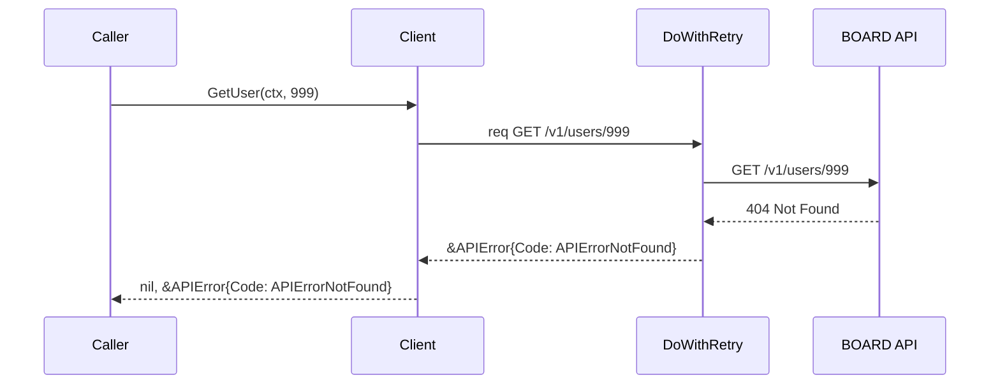
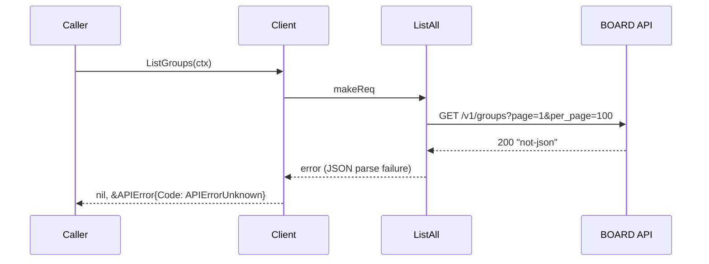

# M09: boardapi マスタ系エンティティ実装計画

## 概要

BOARD API のマスタ系リソース 7 種（users, groups, payment_terms, project_types, purchase_types, accounting_types, document_send_channels）を `internal/boardapi/` に追加実装する。

M06〜M08 で確立したパターンを踏襲し、各リソースに List/Get/Search の 3 メソッドを実装する。

---

## 対象リソース一覧

| # | リソース名 | エンドポイント | ファイル名 |
|---|-----------|--------------|----------|
| 1 | users | /v1/users | users.go |
| 2 | groups | /v1/groups | groups.go |
| 3 | payment_terms | /v1/payment_terms | payment_terms.go |
| 4 | project_types | /v1/project_types | project_types.go |
| 5 | purchase_types | /v1/purchase_types | purchase_types.go |
| 6 | accounting_types | /v1/accounting_types | accounting_types.go |
| 7 | document_send_channels | /v1/document_send_channels | document_send_channels.go |

---

## エンティティフィールド定義

### UserEntity（users のみ Email フィールドを追加）

```go
type UserEntity struct {
    ID        int    `json:"id"`
    Name      string `json:"name"`
    Email     string `json:"email"`
    UpdatedAt string `json:"updated_at"` // ISO 8601
    CreatedAt string `json:"created_at"` // ISO 8601
}
```

### GroupEntity / PaymentTermEntity / ProjectTypeEntity / PurchaseTypeEntity / AccountingTypeEntity / DocumentSendChannelEntity（共通パターン）

```go
type GroupEntity struct {
    ID        int    `json:"id"`
    Name      string `json:"name"`
    Memo      string `json:"memo"`
    UpdatedAt string `json:"updated_at"` // ISO 8601
    CreatedAt string `json:"created_at"` // ISO 8601
}
```

### SearchParams

```go
// users のみ Email を追加
type UserSearchParams struct {
    Name          string
    Email         string
    UpdatedAtFrom string
}

// groups〜document_send_channels 共通
type GroupSearchParams struct {
    Name          string
    UpdatedAtFrom string
}
// 以下同様: PaymentTermSearchParams, ProjectTypeSearchParams,
//           PurchaseTypeSearchParams, AccountingTypeSearchParams,
//           DocumentSendChannelSearchParams
```

---

## メソッドシグネチャ一覧

各リソース `{Res}` について以下の 3 メソッドを実装する（`{Res}` = User, Group, PaymentTerm, ProjectType, PurchaseType, AccountingType, DocumentSendChannel）:

```go
func (c *Client) List{Res}s(ctx context.Context) ([]{Res}Entity, error)
func (c *Client) Get{Res}(ctx context.Context, id int) (*{Res}Entity, error)
func (c *Client) Search{Res}s(ctx context.Context, params {Res}SearchParams) ([]{Res}Entity, error)
```

注意: `DocumentSendChannel` は複数形が `DocumentSendChannels` となる（単純に `s` を付加）。

---

## シーケンス図（Mermaid）

### 正常系: ListUsers



### エラー系: GetUser 404



### エラー系: unmarshal 失敗



---

## TDD 設計

### テスト番号割り当て（T157〜T199）

M08 最終テスト T156 の続きから開始。

#### users（T157〜T163）

| ID | テスト名 | 観点 |
|----|---------|------|
| T157 | TestListUsers_TwoPages | ページネーション 2 ページ（100+50 件） |
| T158 | TestGetUser_Success | 正常取得・フィールド検証 |
| T159 | TestGetUser_NotFound | 404 → APIErrorNotFound |
| T160 | TestSearchUsers_AllParams | Name + Email + UpdatedAtFrom がクエリに反映される |
| T161 | TestSearchUsers_ZeroValue | 全パラメータゼロ値でクエリパラメータなし |
| T162 | TestListUsers_UnmarshalError | 不正 JSON → APIErrorUnknown |
| T163 | TestGetUser_UnmarshalError | 不正 JSON → APIErrorUnknown |

#### groups（T164〜T169）

| ID | テスト名 | 観点 |
|----|---------|------|
| T164 | TestListGroups_TwoPages | ページネーション 2 ページ |
| T165 | TestGetGroup_Success | 正常取得・フィールド検証 |
| T166 | TestGetGroup_NotFound | 404 → APIErrorNotFound |
| T167 | TestSearchGroups_AllParams | Name + UpdatedAtFrom がクエリに反映される |
| T168 | TestListGroups_UnmarshalError | 不正 JSON → APIErrorUnknown |
| T169 | TestSearchGroups_ZeroValue | 全パラメータゼロ値 |

#### payment_terms（T170〜T175）

| ID | テスト名 | 観点 |
|----|---------|------|
| T170 | TestListPaymentTerms_TwoPages | ページネーション 2 ページ |
| T171 | TestGetPaymentTerm_Success | 正常取得・フィールド検証 |
| T172 | TestGetPaymentTerm_NotFound | 404 → APIErrorNotFound |
| T173 | TestSearchPaymentTerms_AllParams | Name + UpdatedAtFrom がクエリに反映される |
| T174 | TestListPaymentTerms_UnmarshalError | 不正 JSON → APIErrorUnknown |
| T175 | TestSearchPaymentTerms_ZeroValue | 全パラメータゼロ値 |

#### project_types（T176〜T181）

| ID | テスト名 | 観点 |
|----|---------|------|
| T176 | TestListProjectTypes_TwoPages | ページネーション 2 ページ |
| T177 | TestGetProjectType_Success | 正常取得・フィールド検証 |
| T178 | TestGetProjectType_NotFound | 404 → APIErrorNotFound |
| T179 | TestSearchProjectTypes_AllParams | Name + UpdatedAtFrom がクエリに反映される |
| T180 | TestListProjectTypes_UnmarshalError | 不正 JSON → APIErrorUnknown |
| T181 | TestSearchProjectTypes_ZeroValue | 全パラメータゼロ値 |

#### purchase_types（T182〜T187）

| ID | テスト名 | 観点 |
|----|---------|------|
| T182 | TestListPurchaseTypes_TwoPages | ページネーション 2 ページ |
| T183 | TestGetPurchaseType_Success | 正常取得・フィールド検証 |
| T184 | TestGetPurchaseType_NotFound | 404 → APIErrorNotFound |
| T185 | TestSearchPurchaseTypes_AllParams | Name + UpdatedAtFrom がクエリに反映される |
| T186 | TestListPurchaseTypes_UnmarshalError | 不正 JSON → APIErrorUnknown |
| T187 | TestSearchPurchaseTypes_ZeroValue | 全パラメータゼロ値 |

#### accounting_types（T188〜T193）

| ID | テスト名 | 観点 |
|----|---------|------|
| T188 | TestListAccountingTypes_TwoPages | ページネーション 2 ページ |
| T189 | TestGetAccountingType_Success | 正常取得・フィールド検証 |
| T190 | TestGetAccountingType_NotFound | 404 → APIErrorNotFound |
| T191 | TestSearchAccountingTypes_AllParams | Name + UpdatedAtFrom がクエリに反映される |
| T192 | TestListAccountingTypes_UnmarshalError | 不正 JSON → APIErrorUnknown |
| T193 | TestSearchAccountingTypes_ZeroValue | 全パラメータゼロ値 |

#### document_send_channels（T194〜T199）

| ID | テスト名 | 観点 |
|----|---------|------|
| T194 | TestListDocumentSendChannels_TwoPages | ページネーション 2 ページ |
| T195 | TestGetDocumentSendChannel_Success | 正常取得・フィールド検証 |
| T196 | TestGetDocumentSendChannel_NotFound | 404 → APIErrorNotFound |
| T197 | TestSearchDocumentSendChannels_AllParams | Name + UpdatedAtFrom がクエリに反映される |
| T198 | TestListDocumentSendChannels_UnmarshalError | 不正 JSON → APIErrorUnknown |
| T199 | TestSearchDocumentSendChannels_ZeroValue | 全パラメータゼロ値 |

---

## テストコード設計（代表例）

### T157: TestListUsers_TwoPages

```go
// M09: T157 — ListUsers ページネーション 2ページ（100件 + 50件）
func TestListUsers_TwoPages(t *testing.T) {
    page1 := make([]map[string]interface{}, 100)
    for i := range page1 {
        page1[i] = map[string]interface{}{
            "id": i + 1, "name": "ユーザー", "email": "u@example.com",
            "updated_at": "2026-01-01T00:00:00Z", "created_at": "2026-01-01T00:00:00Z",
        }
    }
    page2 := make([]map[string]interface{}, 50)
    for i := range page2 {
        page2[i] = map[string]interface{}{
            "id": i + 101, "name": "ユーザー", "email": "u2@example.com",
            "updated_at": "2026-01-01T00:00:00Z", "created_at": "2026-01-01T00:00:00Z",
        }
    }
    call := 0
    ts := httptest.NewServer(http.HandlerFunc(func(w http.ResponseWriter, r *http.Request) {
        call++
        if call == 1 {
            b, _ := json.Marshal(page1)
            w.WriteHeader(http.StatusOK)
            w.Write(b)
        } else {
            b, _ := json.Marshal(page2)
            w.WriteHeader(http.StatusOK)
            w.Write(b)
        }
    }))
    defer ts.Close()

    noSleep := func(time.Duration) {}
    c := boardapi.New(ts.URL, "key", "token", 5*time.Second, boardapi.WithSleepFn(noSleep))
    result, err := c.ListUsers(context.Background())
    if err \!= nil {
        t.Fatalf("unexpected error: %v", err)
    }
    if len(result) \!= 150 {
        t.Errorf("len = %d, want 150", len(result))
    }
}
```

### T158: TestGetUser_Success

```go
// T158: GetUser — 正常取得・フィールド検証
func TestGetUser_Success(t *testing.T) {
    ts := httptest.NewServer(http.HandlerFunc(func(w http.ResponseWriter, r *http.Request) {
        if r.URL.Path \!= "/v1/users/1" {
            t.Errorf("unexpected path: %s", r.URL.Path)
        }
        w.WriteHeader(http.StatusOK)
        w.Write([]byte(`{"id":1,"name":"田中太郎","email":"tanaka@example.com","updated_at":"2026-01-01T00:00:00Z","created_at":"2026-01-01T00:00:00Z"}`))
    }))
    defer ts.Close()

    noSleep := func(time.Duration) {}
    c := boardapi.New(ts.URL, "key", "token", 5*time.Second, boardapi.WithSleepFn(noSleep))
    u, err := c.GetUser(context.Background(), 1)
    if err \!= nil {
        t.Fatalf("unexpected error: %v", err)
    }
    if u.ID \!= 1 || u.Name \!= "田中太郎" || u.Email \!= "tanaka@example.com" {
        t.Errorf("unexpected entity: %+v", u)
    }
}
```

### T160: TestSearchUsers_AllParams

```go
// T160: SearchUsers — Name + Email + UpdatedAtFrom がクエリに反映される
func TestSearchUsers_AllParams(t *testing.T) {
    ts := httptest.NewServer(http.HandlerFunc(func(w http.ResponseWriter, r *http.Request) {
        q := r.URL.Query()
        if q.Get("name") \!= "田中" {
            t.Errorf("name = %q, want 田中", q.Get("name"))
        }
        if q.Get("email") \!= "tanaka@example.com" {
            t.Errorf("email = %q, want tanaka@example.com", q.Get("email"))
        }
        if q.Get("updated_at_from") \!= "2026-01-01" {
            t.Errorf("updated_at_from = %q, want 2026-01-01", q.Get("updated_at_from"))
        }
        w.WriteHeader(http.StatusOK)
        w.Write([]byte(`[]`))
    }))
    defer ts.Close()

    noSleep := func(time.Duration) {}
    c := boardapi.New(ts.URL, "key", "token", 5*time.Second, boardapi.WithSleepFn(noSleep))
    _, err := c.SearchUsers(context.Background(), boardapi.UserSearchParams{
        Name: "田中", Email: "tanaka@example.com", UpdatedAtFrom: "2026-01-01",
    })
    if err \!= nil {
        t.Fatalf("unexpected error: %v", err)
    }
}
```

---

## 実装ステップ（TDD サイクル）

### フェーズ 1: Red（失敗するテストを先に書く）

`internal/boardapi/client_test.go` に T157〜T199 を追記する。
この時点では対応する実装ファイルが存在しないためコンパイルエラーとなる。

```
go test ./internal/boardapi/... → コンパイルエラー（期待通り）
```

### フェーズ 2: Green（最小実装）

以下の順で実装ファイルを新規作成する。コンパイルエラーが消え、全テストが PASS することを確認。

1. `internal/boardapi/users.go`
2. `internal/boardapi/groups.go`
3. `internal/boardapi/payment_terms.go`
4. `internal/boardapi/project_types.go`
5. `internal/boardapi/purchase_types.go`
6. `internal/boardapi/accounting_types.go`
7. `internal/boardapi/document_send_channels.go`

各ファイルは M06〜M08 と同じ構造（下記テンプレート参照）。

#### 実装テンプレート（groups.go を例に）

```go
package boardapi

import (
    "context"
    "encoding/json"
    "fmt"
    "net/http"
    "strconv"
)

// GroupEntity は BOARD API のグループエンティティ。
// GET /v1/groups レスポンスの1要素に対応。
type GroupEntity struct {
    ID        int    `json:"id"`
    Name      string `json:"name"`
    Memo      string `json:"memo"`
    UpdatedAt string `json:"updated_at"` // ISO 8601
    CreatedAt string `json:"created_at"` // ISO 8601
}

// GroupSearchParams は SearchGroups のパラメータ。
type GroupSearchParams struct {
    Name          string
    UpdatedAtFrom string
}

// ListGroups は全グループを取得する。
func (c *Client) ListGroups(ctx context.Context) ([]GroupEntity, error) {
    makeReq := func(ctx context.Context, page, perPage int) (*http.Request, error) {
        req, err := c.NewRequest(ctx, http.MethodGet, "/v1/groups", nil)
        if err \!= nil {
            return nil, err
        }
        q := req.URL.Query()
        q.Set("page", strconv.Itoa(page))
        q.Set("per_page", strconv.Itoa(perPage))
        req.URL.RawQuery = q.Encode()
        return req, nil
    }
    items, err := c.ListAll(ctx, makeReq)
    if err \!= nil {
        return nil, err
    }
    result := make([]GroupEntity, 0, len(items))
    for _, raw := range items {
        var x GroupEntity
        if err := json.Unmarshal(raw, &x); err \!= nil {
            return nil, &APIError{Code: APIErrorUnknown, Message: "ListGroups: unmarshal: " + err.Error()}
        }
        result = append(result, x)
    }
    return result, nil
}

// GetGroup は指定 ID のグループを取得する。
func (c *Client) GetGroup(ctx context.Context, id int) (*GroupEntity, error) {
    req, err := c.NewRequest(ctx, http.MethodGet, fmt.Sprintf("/v1/groups/%d", id), nil)
    if err \!= nil {
        return nil, err
    }
    body, err := c.DoWithRetry(req)
    if err \!= nil {
        return nil, err
    }
    var x GroupEntity
    if err := json.Unmarshal(body, &x); err \!= nil {
        return nil, &APIError{Code: APIErrorUnknown, Message: "GetGroup: unmarshal: " + err.Error()}
    }
    return &x, nil
}

// SearchGroups は条件付きでグループを検索する。
func (c *Client) SearchGroups(ctx context.Context, params GroupSearchParams) ([]GroupEntity, error) {
    makeReq := func(ctx context.Context, page, perPage int) (*http.Request, error) {
        req, err := c.NewRequest(ctx, http.MethodGet, "/v1/groups", nil)
        if err \!= nil {
            return nil, err
        }
        q := req.URL.Query()
        q.Set("page", strconv.Itoa(page))
        q.Set("per_page", strconv.Itoa(perPage))
        if params.Name \!= "" {
            q.Set("name", params.Name)
        }
        if params.UpdatedAtFrom \!= "" {
            q.Set("updated_at_from", params.UpdatedAtFrom)
        }
        req.URL.RawQuery = q.Encode()
        return req, nil
    }
    items, err := c.ListAll(ctx, makeReq)
    if err \!= nil {
        return nil, err
    }
    result := make([]GroupEntity, 0, len(items))
    for _, raw := range items {
        var x GroupEntity
        if err := json.Unmarshal(raw, &x); err \!= nil {
            return nil, &APIError{Code: APIErrorUnknown, Message: "SearchGroups: unmarshal: " + err.Error()}
        }
        result = append(result, x)
    }
    return result, nil
}
```

`users.go` のみ Email フィールドと SearchParams に Email パラメータを追加する差分がある。

### フェーズ 3: Refactor

各ファイルが同一パターンであることを確認し、不要な重複がないことをレビューする。
現状パターンでは generics 化は意図的に行わない（M06〜M08 の設計方針を維持）。

---

## アプローチ比較

| 評価軸 | 現パターン踏襲 | Generics 化 | コード生成 |
|--------|-------------|------------|---------|
| 開発速度 | ⭐⭐⭐⭐ | ⭐⭐ | ⭐⭐⭐ |
| 保守性 | ⭐⭐⭐ | ⭐⭐⭐⭐ | ⭐⭐ |
| 既存一貫性 | ⭐⭐⭐⭐⭐ | ⭐⭐ | ⭐⭐⭐ |
| テスタビリティ | ⭐⭐⭐⭐ | ⭐⭐⭐⭐ | ⭐⭐⭐ |
| Go バージョン制約 | 問題なし | Go 1.18+ 必要 | ツール依存 |

**推奨: 現パターン踏襲**

理由: M06〜M08 の 16 ファイルがすべて同一パターンで実装済み。ここで generics 化すると既存ファイルとの不整合が発生し保守コストが増大する。マスタ系はフィールド数が少なくコード量も限定的であり、現パターンで十分許容範囲内。

---

## リスク評価

| リスク | 発生確率 | 影響 | 対策 |
|--------|---------|------|------|
| 実際の API フィールドが仕様と異なる | 中 | 低（追加フィールドは無視される） | 統合テスト時に実 API レスポンスで確認 |
| users に Email 以外のフィールドが存在 | 中 | 低 | 追加フィールドは後続マイルストーンで補完 |
| document_send_channels のエンドポイント名が違う | 低 | 高 | スペック文書・API ドキュメントで事前確認 |
| ゼロ値セーフでないパラメータの混入 | 低 | 中 | ZeroValue テスト（T161 等）で検証 |

---

## 完了条件（DoD）

- [ ] T157〜T199 のテスト 43 件が全て PASS
- [ ] `go vet ./internal/boardapi/...` がエラーなし
- [ ] `gofmt -s -l ./internal/boardapi/` で差分なし
- [ ] 新規ファイル 7 件が `internal/boardapi/` に存在
- [ ] 各ファイルのパッケージコメントが正確
- [ ] `users.go` に Email フィールドと Email 検索パラメータが含まれる

---

## ファイル一覧（実装後）

```
internal/boardapi/
├── ... （既存 21 ファイル）
├── users.go                    # NEW
├── groups.go                   # NEW
├── payment_terms.go            # NEW
├── project_types.go            # NEW
├── purchase_types.go           # NEW
├── accounting_types.go         # NEW
└── document_send_channels.go   # NEW
```

---

## 次ステップ（M10 以降）

M09 完了後、次の候補:
- M10: cache パッケージ（SQLite resource_cache / sync_state / cache_meta）
- M11: repository パッケージ（cache→refresh→API の統一参照窓口）

