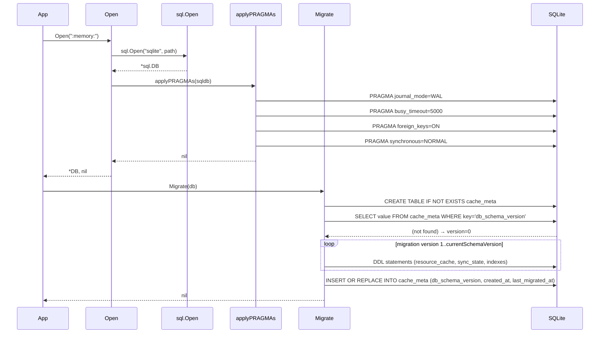
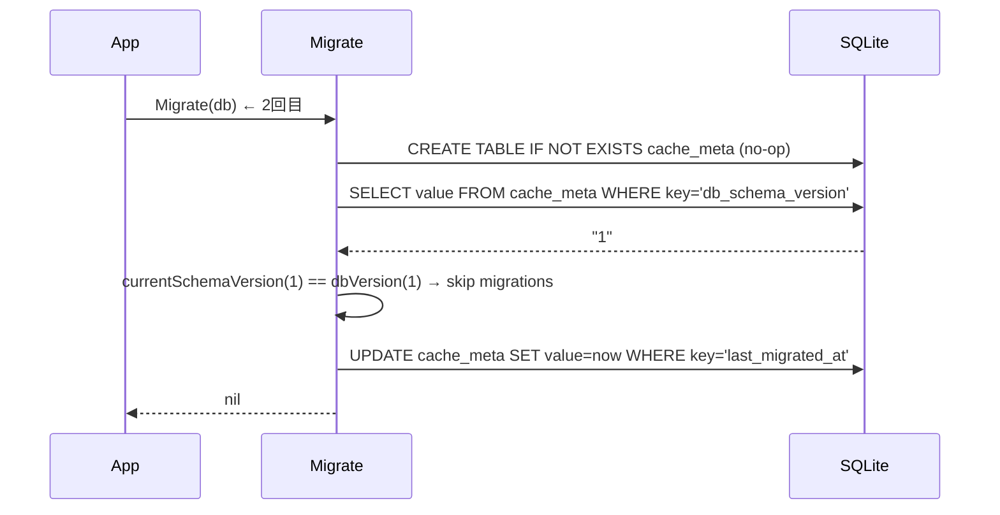
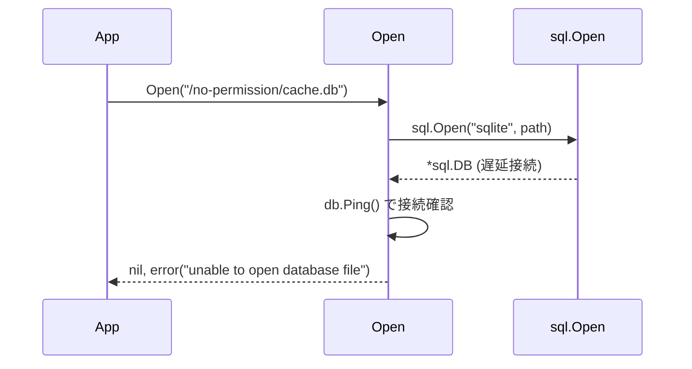

# マイルストーン M10: SQLite 初期化 + マイグレーション

## 概要

`internal/cache` パッケージに SQLite の接続管理・マイグレーション・スキーマ定義を実装する。M11 以降のキャッシュ実装が依存する基盤となるため、WAL モード・busy_timeout・in-memory テストの仕組みを確立する。

---

## スコープ

### 実装範囲

- `internal/cache/db.go` — DB 接続管理（Open/Close、WAL・timeout PRAGMA 設定）
- `internal/cache/schema.go` — DDL 定義（CREATE TABLE 文の文字列定数）
- `internal/cache/migrate.go` — マイグレーション実行（バージョン管理 + DDL 適用）
- `internal/cache/db_test.go` — T_DB01〜T_DB15 （in-memory DB を使用）

### スコープ外

- resource_cache の読み書きロジック（M11）
- sync_state の読み書きロジック（M12）
- repository 層（M15〜）
- refresh ロジック（M13〜M14）
- CLI の `cache` コマンド（M24〜）

---

## ファイル設計

### `internal/cache/db.go`

#### DB 型

```go
// DB は SQLite 接続を保持するラッパー。
type DB struct {
    sqldb *sql.DB
    path  string
}
```

#### 公開 API

```go
// Open は指定パスの SQLite DB を開き、PRAGMA を設定して返す。
// path に ":memory:" を渡すと in-memory DB として動作する。
func Open(path string) (*DB, error)

// Close は DB 接続を閉じる。
func (db *DB) Close() error

// SQLDB は内部 *sql.DB を返す（migrate.go / キャッシュ操作から利用）。
func (db *DB) SQLDB() *sql.DB
```

#### PRAGMA 設定（Open 内部）

| PRAGMA | 値 | 理由 |
|--------|-----|------|
| `journal_mode` | `WAL` | 読み取りと書き込みの並行性向上 |
| `busy_timeout` | `5000`（ms） | CLI・MCP 同時アクセス時のロック待機 |
| `foreign_keys` | `ON` | 参照整合性（将来の追加テーブル向け） |
| `synchronous` | `NORMAL` | WAL 時は NORMAL で十分な耐障害性 |

in-memory DB（`":memory:"`）では WAL は無効（SQLite 仕様）のため、`journal_mode` PRAGMA は設定するが返り値が `memory` になる点を許容する。

---

### `internal/cache/schema.go`

DDL を文字列定数として定義する。`migrate.go` から参照する。

#### DDL 一覧

**resource_cache テーブル**

```sql
CREATE TABLE IF NOT EXISTS resource_cache (
  profile_name  TEXT NOT NULL,
  resource_name TEXT NOT NULL,
  entity_id     TEXT NOT NULL,
  payload_json  TEXT NOT NULL,
  updated_at    TEXT,
  fetched_at    TEXT NOT NULL,
  PRIMARY KEY (profile_name, resource_name, entity_id)
);

CREATE INDEX IF NOT EXISTS idx_resource_cache_resource
  ON resource_cache(profile_name, resource_name);

CREATE INDEX IF NOT EXISTS idx_resource_cache_updated
  ON resource_cache(profile_name, resource_name, updated_at);
```

**sync_state テーブル**

```sql
CREATE TABLE IF NOT EXISTS sync_state (
  profile_name           TEXT NOT NULL,
  resource_name          TEXT NOT NULL,
  last_synced_at         TEXT,
  cursor_updated_at      TEXT,
  last_full_synced_at    TEXT,
  last_sync_mode         TEXT,
  last_sync_status       TEXT,
  last_daily_refresh_date TEXT,
  must_full_resync       INTEGER NOT NULL DEFAULT 0,
  expired_at             TEXT,
  invalidate_reason      TEXT,
  last_error_at          TEXT,
  last_error_code        TEXT,
  last_error_message     TEXT,
  consecutive_failures   INTEGER NOT NULL DEFAULT 0,
  refresh_started_at     TEXT,
  refresh_owner          TEXT,
  cache_version          INTEGER NOT NULL DEFAULT 1,
  schema_version         INTEGER NOT NULL DEFAULT 1,
  PRIMARY KEY (profile_name, resource_name)
);
```

**cache_meta テーブル**

```sql
CREATE TABLE IF NOT EXISTS cache_meta (
  key        TEXT PRIMARY KEY,
  value      TEXT NOT NULL,
  updated_at TEXT NOT NULL
);
```

---

### `internal/cache/migrate.go`

#### 設計方針

- スキーマバージョンを `cache_meta` の `db_schema_version` キーで管理する
- 現バージョン（MVP）は version = 1
- `Migrate(db *DB) error` を呼ぶと、現在のバージョンを確認し必要な DDL を順次適用する
- マイグレーションは冪等（`CREATE TABLE IF NOT EXISTS` + バージョン確認）

#### バージョン管理フロー

```text
1. cache_meta テーブルが存在しなければ CREATE
2. db_schema_version を読む（存在しなければ 0 とみなす）
3. 現在 version > DB version なら DDL を順次実行
4. db_schema_version, created_at（初回のみ）, last_migrated_at を upsert
```

#### 公開 API

```go
// Migrate は DB スキーマを最新バージョンに適用する。
// 初回呼び出し時はすべてのテーブルを作成する。
// 冪等であり、複数回呼び出し可能。
func Migrate(db *DB) error

// currentSchemaVersion はコード上の最新スキーマバージョン（定数）。
const currentSchemaVersion = 1
```

#### migrations スライス

```go
var migrations = []migration{
    {version: 1, stmts: schemaV1Statements},
}

type migration struct {
    version int
    stmts   []string
}
```

`schemaV1Statements` は `schema.go` で定義した DDL 文字列のスライス。

---

## テスト設計（TDD）

### テストファイル: `internal/cache/db_test.go`

すべてのテストで in-memory DB（`":memory:"`）を使用する。

#### 正常系テスト

| テスト ID | 名前 | 検証内容 |
|-----------|------|----------|
| T_DB01 | TestOpen_InMemory | `Open(":memory:")` が error なく DB を返す |
| T_DB02 | TestOpen_WALMode | ファイル DB で `PRAGMA journal_mode` が `wal` または `memory` を返す |
| T_DB03 | TestOpen_ForeignKeys | `PRAGMA foreign_keys` が ON (1) になっている |
| T_DB04 | TestDB_Close | `Close()` 後に `db.SQLDB().Ping()` が error を返す |
| T_DB05 | TestMigrate_FirstRun | `Migrate` 後に 3 テーブルすべてが存在する |
| T_DB06 | TestMigrate_Idempotent | `Migrate` を 2 回呼んでも error にならない |
| T_DB07 | TestMigrate_SchemaVersion | `Migrate` 後に `cache_meta.db_schema_version = "1"` が存在する |
| T_DB08 | TestMigrate_CreatedAt | `Migrate` 後に `cache_meta.created_at` が存在する |
| T_DB09 | TestMigrate_LastMigratedAt | `Migrate` 後に `cache_meta.last_migrated_at` が存在する |
| T_DB10 | TestMigrate_ResourceCacheColumns | `resource_cache` の全カラムが存在する（PRAGMA table_info） |
| T_DB11 | TestMigrate_SyncStateColumns | `sync_state` の全カラムが存在する |
| T_DB12 | TestMigrate_CacheMetaColumns | `cache_meta` の全カラムが存在する |
| T_DB13 | TestMigrate_IndexExists | `idx_resource_cache_resource` と `idx_resource_cache_updated` が存在する |

#### 異常系テスト

| テスト ID | 名前 | 検証内容 |
|-----------|------|----------|
| T_DB14 | TestOpen_InvalidPath | 書き込み不可パスで `Open` が error を返す |
| T_DB15 | TestMigrate_AfterClose | `Close()` 後に `Migrate` を呼ぶと error を返す |

---

### TDD 実装順序

#### Step 1: db.go のスケルトンと T_DB01（Red → Green）

1. Red: `TestOpen_InMemory` を書く（`Open` が未実装なのでコンパイルエラー）
2. Green: `Open(":memory:")` の最小実装を書く
3. `go test ./internal/cache/... -run TestOpen_InMemory -v` で確認

#### Step 2: PRAGMA テストと実装（Red → Green）

1. Red: T_DB02, T_DB03 を追記
2. Green: `Open` 内に `PRAGMA journal_mode=WAL`, `PRAGMA foreign_keys=ON` を追加
3. T_DB04 の Close テスト追記 → `Close()` 実装

#### Step 3: schema.go 作成

- DDL 文字列定数を定義するのみ（テスト不要、migrate.go のテストで間接検証）

#### Step 4: migrate.go と T_DB05〜T_DB13（Red → Green）

1. Red: T_DB05〜T_DB13 を追記（`Migrate` 未実装でコンパイルエラー）
2. Green: `Migrate` の実装
   - `cache_meta` CREATE
   - バージョン読み取り
   - migrations ループ
   - cache_meta upsert
3. テスト実行で確認

#### Step 5: 異常系テスト（Red → Green）

1. Red: T_DB14, T_DB15 を追記
2. Green: エラーパスの実装・確認

#### Step 6: Refactor

- `Open` 内の PRAGMA 設定を `applyPRAGMAs(db *sql.DB) error` に分離
- `Migrate` 内のバージョン取得を `getSchemaVersion(db *sql.DB) (int, error)` に分離
- `go vet ./...`, `gofmt -l .` でクリーン確認

#### Step 7: 全テスト実行・確認

```bash
go test ./internal/cache/... -v -count=1
go vet ./internal/cache/...
gofmt -l ./internal/cache/
```

---

## シーケンス図

### Open + Migrate 正常フロー



### Migrate 冪等フロー（2 回目）



### Open エラーフロー



---

## アーキテクチャ整合性

### 依存方向

```
db.go       → modernc.org/sqlite（driver 登録）
schema.go   → (依存なし)
migrate.go  → db.go, schema.go
db_test.go  → db.go, migrate.go, schema.go
```

循環依存なし。`internal/cache` は他の internal パッケージに依存しない。

### M11 以降との接続

M11 以降の `resource_cache.go`、`sync_state.go` は `DB.SQLDB()` を受け取り、テーブル操作を行う。`Migrate` は `app.go`（DI コンテナ）から呼ばれ、起動時に一度だけ実行される。

### 既存パターンとの整合性

- エラーは標準 `error` インターフェースで返す（`*APIError` は boardapi 層専用、cache 層では使用しない）
- `modernc.org/sqlite` の driver 名は `"sqlite"` ではなく `"sqlite3"` を確認して使用する
  - `import _ "modernc.org/sqlite"` によりドライバー名は `"sqlite"` として登録される（go.mod で確認済み）

---

## リスク評価

| リスク | 重大度 | 対策 |
|--------|--------|------|
| in-memory DB で WAL PRAGMA が `memory` を返す | Low | テストでは `wal` または `memory` を許容する（`journal_mode` の返り値は設定値と異なる場合がある） |
| modernc.org/sqlite のドライバー名誤り | Low | `go.mod` 確認済み。`sql.Open("sqlite", ...)` が正しい |
| ファイル DB の PRAGMA 設定がロールバックされる | Low | PRAGMA は DDL 非依存。Migrate に含めず Open で毎回設定する |
| 同時アクセス時のロック競合 | Medium | `busy_timeout=5000ms` で対処。テストは in-memory のため発生しない |
| マイグレーション中の DB 破損 | Low | DDL は `IF NOT EXISTS` + トランザクション内で適用し原子性を保つ |
| schema_version の読み書き競合 | Low | MVP では CLI は単発実行。MCP は refresh ロックで保護（M14 で対応） |

---

## チェックリスト（5 観点）

### 観点1: 実装実現可能性と完全性

- [x] 手順の抜け漏れがないか（Step 1〜7 で端から端まで一貫）
- [x] 各ステップが十分に具体的か（ファイル名・関数名・テスト ID まで明記）
- [x] 依存関係が明示されているか（db.go → schema.go → migrate.go の順）
- [x] 変更対象ファイルが網羅されているか（4ファイル新規）
- [x] 影響範囲が正確か（既存ファイルへの変更なし）

### 観点2: TDD テスト設計の品質

- [x] 正常系テストケースが網羅（T_DB01〜T_DB13）
- [x] 異常系テストケースが定義（T_DB14, T_DB15）
- [x] エッジケースが考慮（冪等性テスト T_DB06、Close 後の操作 T_DB15）
- [x] 入出力が具体的に記述（各テストに検証内容を明記）
- [x] Red→Green→Refactor の順序が守られている（Step 1〜6 に明記）
- [x] モック不要（in-memory DB で実 SQLite を使用）

### 観点3: アーキテクチャ整合性

- [x] 既存の命名規則に従っている（snake_case ファイル名、Go CamelCase 型名）
- [x] 設計パターンが一貫している（DB ラッパーで PRAGMA を隠蔽）
- [x] モジュール分割が適切（Open/schema/migrate を分離）
- [x] 依存方向が正しい（cache パッケージは他 internal パッケージに依存しない）
- [x] M11 以降の依存点が明確（`DB.SQLDB()` を公開）

### 観点4: リスク評価と対策

- [x] リスクが適切に特定されている（WAL/ドライバー名/PRAGMA 設定）
- [x] 対策が具体的（in-memory DB の WAL 返り値許容、Ping 確認）
- [x] フェイルセーフが考慮（DDL をトランザクション内で適用）
- [x] パフォーマンスへの影響（PRAGMA は起動時 1 回のみ）
- [x] セキュリティ観点（DB パスは config 管理。secrets は含まない）
- [x] ロールバック計画（新規ファイルのみ追加のため削除でロールバック可能）

### 観点5: シーケンス図の完全性

- [x] 正常フローが記述されている（Open + Migrate 正常フロー）
- [x] 冪等フローが記述されている（Migrate 2 回目）
- [x] エラーフローが記述されている（Open エラーフロー）
- [x] 外部依存（SQLite）との相互作用が明確
- [x] PRAGMA 設定のタイミングが明記

---

## ドキュメント更新

- `plans/board-roadmap.md`: M10 チェックボックスを完了マークに更新（M10 完了時）
- `CHANGELOG.md`: `feat: M10 SQLite 初期化 + マイグレーション実装` を記録

---

## Plan Footer

- plan_file: plans/board-m10-sqlite-init.md
- milestone: M10
- complexity: M
- estimated_files: 4 new
