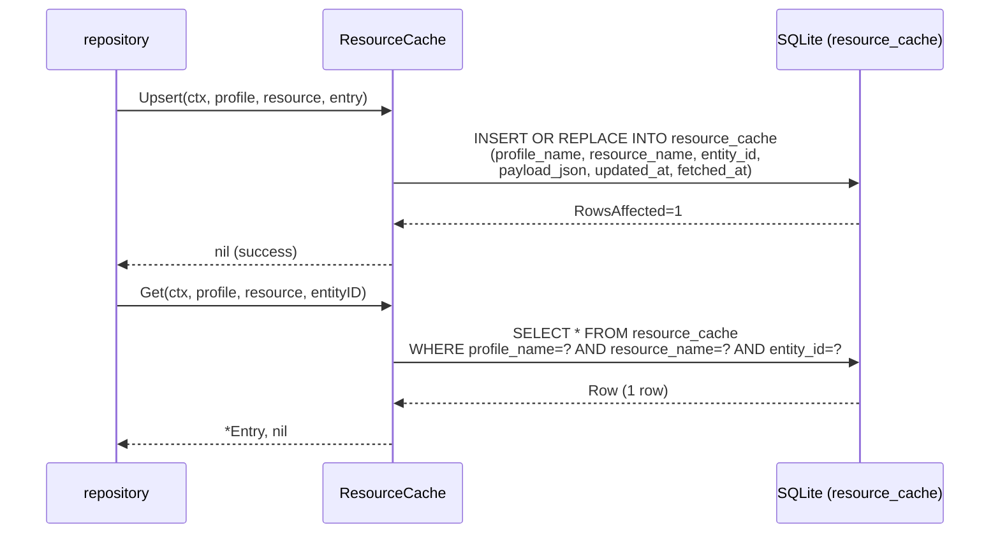
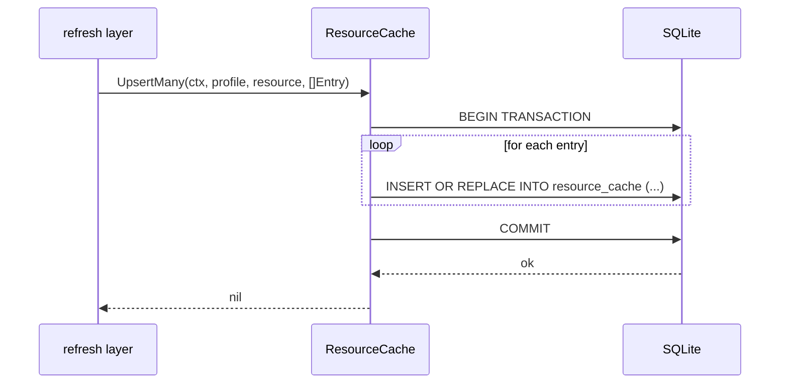
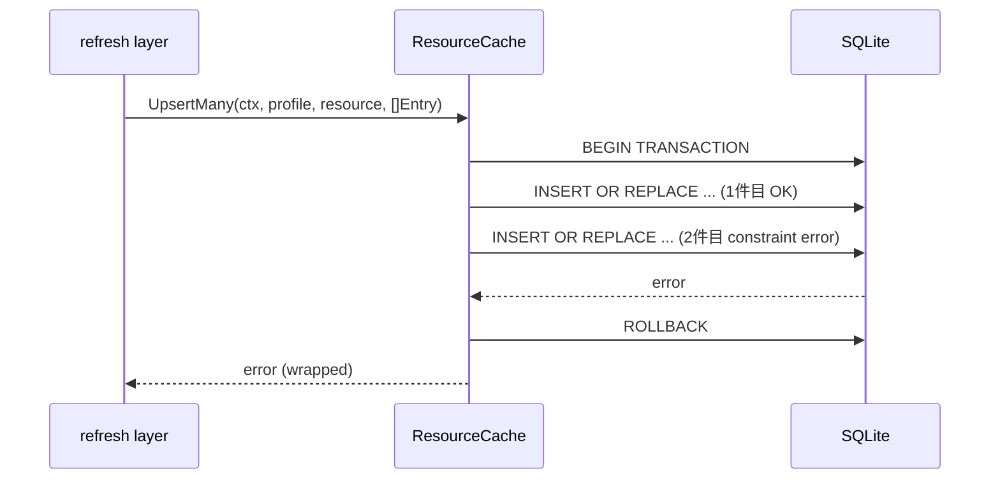
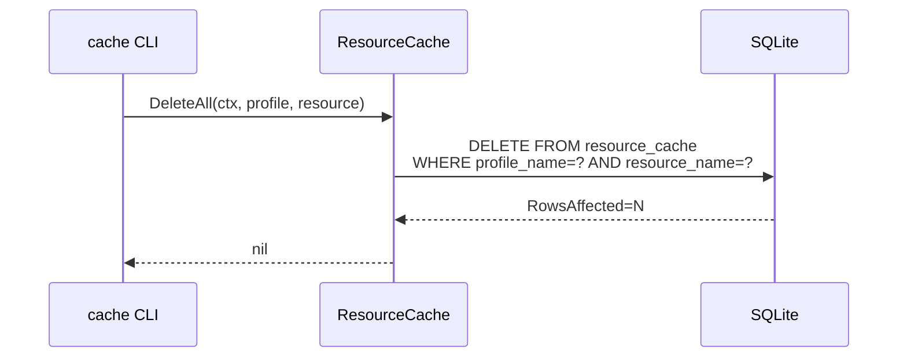

# M11: cache - resource_cache 実装

## 概要

`internal/cache` パッケージに `resource_cache` テーブルへの CRUD 操作を実装する。
M10 で作成済みの `DB` 型・`Migrate` 関数・DDL を基盤として、`ResourceCache` 構造体と
関連ファイル（`keys.go`）を追加する。

---

## スコープ

| ファイル | 内容 |
|---------|------|
| `internal/cache/resource_cache.go` | ResourceCache 構造体、Upsert/UpsertMany/Get/List/Delete |
| `internal/cache/keys.go` | キー生成ヘルパー（EntityKey 等） |
| `internal/cache/resource_cache_test.go` | 全メソッドの TDD テスト |
| `internal/cache/keys_test.go` | キー生成テスト |

> スペック§14 では `jsonblob.go` も想定されているが、M11 スコープでは
> `json.RawMessage` を直接扱うことで分離は不要と判断。`jsonblob.go` は将来の
> リファクタリング候補として残す。

---

## データモデル

```go
// Entry は resource_cache の 1 行を表す。
type Entry struct {
    ProfileName  string
    ResourceName string
    EntityID     string
    PayloadJSON  json.RawMessage
    UpdatedAt    *string // NULL 許容
    FetchedAt    string  // RFC3339 UTC
}
```

---

## API 設計

### ResourceCache 構造体

```go
type ResourceCache struct {
    db *sql.DB
}

func NewResourceCache(db *DB) *ResourceCache
```

### メソッド一覧

| メソッド | シグネチャ | 説明 |
|---------|-----------|------|
| Upsert | `(ctx, profile, resource, entry Entry) error` | 1 件 INSERT OR REPLACE |
| UpsertMany | `(ctx, profile, resource, entries []Entry) error` | トランザクション一括 upsert |
| Get | `(ctx, profile, resource, entityID string) (*Entry, error)` | 1 件取得。なければ `nil, nil` |
| List | `(ctx, profile, resource string) ([]Entry, error)` | 全件取得（updated_at ASC） |
| Delete | `(ctx, profile, resource, entityID string) error` | 1 件削除 |
| DeleteAll | `(ctx, profile, resource string) error` | resource 単位全削除（cache clear 用） |

> `Search` はロードマップ記載だが、SQLite の `payload_json` テキスト検索は
> repository 層で `json.Unmarshal` 後にフィルタする方式を想定。
> M11 では `List` を提供し、`Search` は repository 層の責務とする。
> 理由: SQLite の `LIKE '%...%'` はインデックス非効率。JSON フィールド検索は
> アプリ側フィルタが保守性・テスタビリティとも優れる。

### keys.go

```go
// EntityKey は resource_cache の論理キーをまとめた型。
type EntityKey struct {
    ProfileName  string
    ResourceName string
    EntityID     string
}

// NewEntityKey は EntityKey を生成する。
func NewEntityKey(profile, resource, entityID string) EntityKey
```

---

## TDD 設計（Red → Green → Refactor）

### テストファイル構成

```
internal/cache/
├── resource_cache_test.go   // T_RC01 〜 T_RC16
└── keys_test.go             // T_KY01 〜 T_KY03
```

### keys_test.go

| ID | テスト名 | 観点 |
|----|---------|------|
| T_KY01 | `TestNewEntityKey_Fields` | 各フィールドが正しく設定される |
| T_KY02 | `TestNewEntityKey_EmptyStrings` | 空文字でも構造体が作られる |
| T_KY03 | `TestEntityKey_ZeroValue` | ゼロ値は全フィールド空文字 |

### resource_cache_test.go

| ID | テスト名 | メソッド | 観点 |
|----|---------|---------|------|
| T_RC01 | `TestNewResourceCache_NonNil` | NewResourceCache | nil でない |
| T_RC02 | `TestUpsert_Insert` | Upsert | 新規 INSERT、取得で確認 |
| T_RC03 | `TestUpsert_Replace` | Upsert | 同一 PK で payload 更新 |
| T_RC04 | `TestUpsert_UpdatedAtNil` | Upsert | updated_at=nil を許容 |
| T_RC05 | `TestUpsert_FetchedAtAutoSet` | Upsert | fetched_at が RFC3339 形式 |
| T_RC06 | `TestGet_Existing` | Get | 存在する行を取得 |
| T_RC07 | `TestGet_NotFound` | Get | 存在しない場合 nil, nil |
| T_RC08 | `TestGet_DifferentProfile` | Get | profile が違えばヒットしない |
| T_RC09 | `TestList_Empty` | List | 空テーブルで空スライスを返す |
| T_RC10 | `TestList_MultipleEntries` | List | 複数件、updated_at ASC 順 |
| T_RC11 | `TestList_IsolatedByProfile` | List | 別 profile の行が混入しない |
| T_RC12 | `TestUpsertMany_InsertBatch` | UpsertMany | バッチ INSERT |
| T_RC13 | `TestUpsertMany_Empty` | UpsertMany | 空スライスでエラーなし |
| T_RC14 | `TestUpsertMany_RollbackOnError` | UpsertMany | 途中エラーでロールバック |
| T_RC15 | `TestDelete_Existing` | Delete | 存在する行を削除、Get で確認 |
| T_RC16 | `TestDelete_NotFound` | Delete | 存在しない行でもエラーなし |
| T_RC17 | `TestDeleteAll_ByResource` | DeleteAll | resource 単位全削除 |
| T_RC18 | `TestDeleteAll_IsolatedByProfile` | DeleteAll | 別 profile は削除されない |

---

## Mermaid シーケンス図

### 正常系: Upsert → Get



### 正常系: UpsertMany（バッチ）



### エラー系: UpsertMany ロールバック



### 正常系: DeleteAll（cache clear 相当）



---

## 実装ステップ

### Step 1: Red（失敗するテストを書く）

1. `internal/cache/keys_test.go` 作成（T_KY01〜T_KY03）
2. `internal/cache/resource_cache_test.go` 作成（T_RC01〜T_RC18）
3. `go test ./internal/cache/...` を実行 → コンパイルエラー/FAIL を確認

### Step 2: Green（最小限の実装）

#### 2-1. `keys.go` 実装

```go
package cache

// EntityKey は resource_cache の論理キーを表す。
type EntityKey struct {
    ProfileName  string
    ResourceName string
    EntityID     string
}

// NewEntityKey は EntityKey を生成する。
func NewEntityKey(profile, resource, entityID string) EntityKey {
    return EntityKey{
        ProfileName:  profile,
        ResourceName: resource,
        EntityID:     entityID,
    }
}
```

#### 2-2. `resource_cache.go` 実装

```go
package cache

import (
    "context"
    "database/sql"
    "encoding/json"
    "fmt"
    "time"
)

// Entry は resource_cache の 1 行を表す。
type Entry struct {
    ProfileName  string
    ResourceName string
    EntityID     string
    PayloadJSON  json.RawMessage
    UpdatedAt    *string // NULL 許容
    FetchedAt    string  // RFC3339 UTC、Upsert 時に自動設定
}

// ResourceCache は resource_cache テーブルへのアクセスを提供する。
type ResourceCache struct {
    db *sql.DB
}

// NewResourceCache は ResourceCache を生成する。
func NewResourceCache(db *DB) *ResourceCache {
    return &ResourceCache{db: db.db}
}

// Upsert は 1 件を INSERT OR REPLACE する。
// FetchedAt は呼び出し時刻（UTC RFC3339）で自動設定する。
func (rc *ResourceCache) Upsert(ctx context.Context, entry Entry) error {
    entry.FetchedAt = time.Now().UTC().Format(time.RFC3339)
    _, err := rc.db.ExecContext(ctx,
        `INSERT OR REPLACE INTO resource_cache
           (profile_name, resource_name, entity_id, payload_json, updated_at, fetched_at)
         VALUES (?, ?, ?, ?, ?, ?)`,
        entry.ProfileName, entry.ResourceName, entry.EntityID,
        string(entry.PayloadJSON), entry.UpdatedAt, entry.FetchedAt,
    )
    if err \!= nil {
        return fmt.Errorf("cache: upsert: %w", err)
    }
    return nil
}

// UpsertMany は複数件をトランザクションで一括 INSERT OR REPLACE する。
func (rc *ResourceCache) UpsertMany(ctx context.Context, entries []Entry) error {
    if len(entries) == 0 {
        return nil
    }
    tx, err := rc.db.BeginTx(ctx, nil)
    if err \!= nil {
        return fmt.Errorf("cache: upsert_many: begin: %w", err)
    }
    defer tx.Rollback() //nolint:errcheck

    now := time.Now().UTC().Format(time.RFC3339)
    stmt, err := tx.PrepareContext(ctx,
        `INSERT OR REPLACE INTO resource_cache
           (profile_name, resource_name, entity_id, payload_json, updated_at, fetched_at)
         VALUES (?, ?, ?, ?, ?, ?)`,
    )
    if err \!= nil {
        return fmt.Errorf("cache: upsert_many: prepare: %w", err)
    }
    defer stmt.Close()

    for _, e := range entries {
        e.FetchedAt = now
        if _, err := stmt.ExecContext(ctx,
            e.ProfileName, e.ResourceName, e.EntityID,
            string(e.PayloadJSON), e.UpdatedAt, e.FetchedAt,
        ); err \!= nil {
            return fmt.Errorf("cache: upsert_many: exec: %w", err)
        }
    }
    if err := tx.Commit(); err \!= nil {
        return fmt.Errorf("cache: upsert_many: commit: %w", err)
    }
    return nil
}

// Get は 1 件を取得する。存在しない場合は nil, nil を返す。
func (rc *ResourceCache) Get(ctx context.Context, profile, resource, entityID string) (*Entry, error) {
    row := rc.db.QueryRowContext(ctx,
        `SELECT profile_name, resource_name, entity_id, payload_json, updated_at, fetched_at
         FROM resource_cache
         WHERE profile_name = ? AND resource_name = ? AND entity_id = ?`,
        profile, resource, entityID,
    )
    e, err := scanEntry(row)
    if err == sql.ErrNoRows {
        return nil, nil
    }
    if err \!= nil {
        return nil, fmt.Errorf("cache: get: %w", err)
    }
    return e, nil
}

// List は resource 単位で全件を取得する（updated_at ASC）。
func (rc *ResourceCache) List(ctx context.Context, profile, resource string) ([]Entry, error) {
    rows, err := rc.db.QueryContext(ctx,
        `SELECT profile_name, resource_name, entity_id, payload_json, updated_at, fetched_at
         FROM resource_cache
         WHERE profile_name = ? AND resource_name = ?
         ORDER BY updated_at ASC`,
        profile, resource,
    )
    if err \!= nil {
        return nil, fmt.Errorf("cache: list: %w", err)
    }
    defer rows.Close()

    var entries []Entry
    for rows.Next() {
        e, err := scanEntryRow(rows)
        if err \!= nil {
            return nil, fmt.Errorf("cache: list: scan: %w", err)
        }
        entries = append(entries, *e)
    }
    if err := rows.Err(); err \!= nil {
        return nil, fmt.Errorf("cache: list: rows: %w", err)
    }
    if entries == nil {
        entries = []Entry{}
    }
    return entries, nil
}

// Delete は 1 件を削除する。存在しない場合もエラーなし。
func (rc *ResourceCache) Delete(ctx context.Context, profile, resource, entityID string) error {
    _, err := rc.db.ExecContext(ctx,
        `DELETE FROM resource_cache
         WHERE profile_name = ? AND resource_name = ? AND entity_id = ?`,
        profile, resource, entityID,
    )
    if err \!= nil {
        return fmt.Errorf("cache: delete: %w", err)
    }
    return nil
}

// DeleteAll は profile + resource 単位で全件削除する（cache clear 用）。
func (rc *ResourceCache) DeleteAll(ctx context.Context, profile, resource string) error {
    _, err := rc.db.ExecContext(ctx,
        `DELETE FROM resource_cache WHERE profile_name = ? AND resource_name = ?`,
        profile, resource,
    )
    if err \!= nil {
        return fmt.Errorf("cache: delete_all: %w", err)
    }
    return nil
}

// --- scan helpers ---

type rowScanner interface {
    Scan(dest ...any) error
}

func scanEntry(row rowScanner) (*Entry, error) {
    var e Entry
    var updatedAt sql.NullString
    var payload string
    if err := row.Scan(
        &e.ProfileName, &e.ResourceName, &e.EntityID,
        &payload, &updatedAt, &e.FetchedAt,
    ); err \!= nil {
        return nil, err
    }
    e.PayloadJSON = json.RawMessage(payload)
    if updatedAt.Valid {
        s := updatedAt.String
        e.UpdatedAt = &s
    }
    return &e, nil
}

func scanEntryRow(rows *sql.Rows) (*Entry, error) {
    return scanEntry(rows)
}
```

### Step 3: Refactor

- `scanEntry` / `scanEntryRow` の重複解消（既に共通化済み）
- `UpsertMany` の `stmt.Close()` タイミング確認
- `//nolint:errcheck` の必要性を再評価
- テスト用ヘルパー関数（`openTestDB`）を `testhelper_test.go` に切り出し

---

## テストヘルパー設計

`resource_cache_test.go` の先頭で共通化するヘルパー:

```go
// openTestDB はテスト用インメモリ DB を開き Migrate まで実行する。
func openTestDB(t *testing.T) *cache.DB {
    t.Helper()
    db, err := cache.Open(":memory:")
    if err \!= nil {
        t.Fatalf("Open: %v", err)
    }
    t.Cleanup(func() { db.Close() })
    if err := cache.Migrate(db); err \!= nil {
        t.Fatalf("Migrate: %v", err)
    }
    return db
}
```

---

## アプローチ比較

### Search 実装方針

| アプローチ | 説明 | 採用 |
|-----------|------|------|
| A: SQLite LIKE | `payload_json LIKE '%query%'` | 非採用（インデックス非効率、型安全でない） |
| B: JSON 関数 (`json_extract`) | SQLite の json_extract で特定フィールド検索 | 将来候補（フィールド依存で汎用性低） |
| C: アプリ側フィルタ | List 後に `json.Unmarshal` + Go でフィルタ | **採用**（保守性・テスタビリティ優） |

### FetchedAt 設定タイミング

| アプローチ | 説明 | 採用 |
|-----------|------|------|
| A: 呼び出し元が設定 | Entry.FetchedAt を caller が埋める | 非採用（設定漏れリスク） |
| B: Upsert 内で自動設定 | `time.Now().UTC()` を Upsert/UpsertMany で設定 | **採用**（APIが明確） |

### UpsertMany のトランザクション

| アプローチ | 説明 | 採用 |
|-----------|------|------|
| A: 個別 Upsert ループ | トランザクションなし | 非採用（部分失敗リスク、パフォーマンス劣） |
| B: BEGIN/COMMIT + Prepared Stmt | 一括トランザクション | **採用**（原子性保証、パフォーマンス良） |

---

## リスク評価

| リスク | 影響度 | 発生確率 | 対策 |
|--------|-------|---------|------|
| `updated_at` NULL 扱いのSQL/Goの境界 | 中 | 中 | `sql.NullString` で明示的に NULL をハンドル |
| UpsertMany 途中でコンテキストキャンセル | 中 | 低 | `BeginTx` + `defer Rollback` で安全に処理 |
| `json.RawMessage` に不正 JSON が入る | 低 | 低 | M11 では検証しない（呼び出し元 responsibility）|
| テスト並行実行での in-memory DB 共有 | 低 | 低 | `t.Parallel()` は使わず各テストで独立 DB を生成 |
| `stmt.Close()` タイミング（UpsertMany） | 低 | 低 | Commit 前に `defer stmt.Close()` で安全 |

---

## 実装順序（TDD サイクル）

```
1. keys_test.go 作成 (T_KY01〜T_KY03)
2. keys.go 作成 → go test PASS
3. resource_cache_test.go 作成 (T_RC01〜T_RC18)
   - まず T_RC01〜T_RC07 (基本 Upsert/Get)
4. resource_cache.go: Entry 型 + NewResourceCache + Upsert + Get 実装
   → T_RC01〜T_RC08 PASS
5. resource_cache.go: List 実装 → T_RC09〜T_RC11 PASS
6. resource_cache.go: UpsertMany 実装 → T_RC12〜T_RC14 PASS
7. resource_cache.go: Delete + DeleteAll 実装 → T_RC15〜T_RC18 PASS
8. Refactor: scanEntry 共通化確認、ヘルパー整理
9. go test ./internal/cache/... → 全 PASS
10. go vet ./internal/cache/... → クリーン
```

---

## 完了条件

- [ ] `internal/cache/keys.go` 実装済み
- [ ] `internal/cache/resource_cache.go` 実装済み（Upsert/UpsertMany/Get/List/Delete/DeleteAll）
- [ ] `internal/cache/keys_test.go` 全テスト PASS（T_KY01〜T_KY03）
- [ ] `internal/cache/resource_cache_test.go` 全テスト PASS（T_RC01〜T_RC18）
- [ ] `go vet ./internal/cache/...` クリーン
- [ ] `go test ./internal/cache/...` 全 PASS
- [ ] secrets（APIキー等）がコードに含まれない
