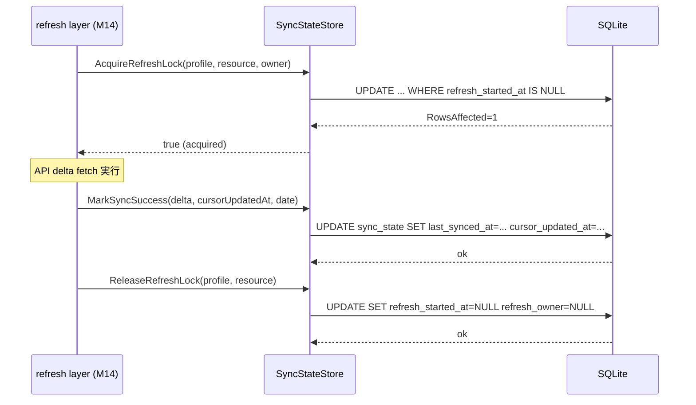
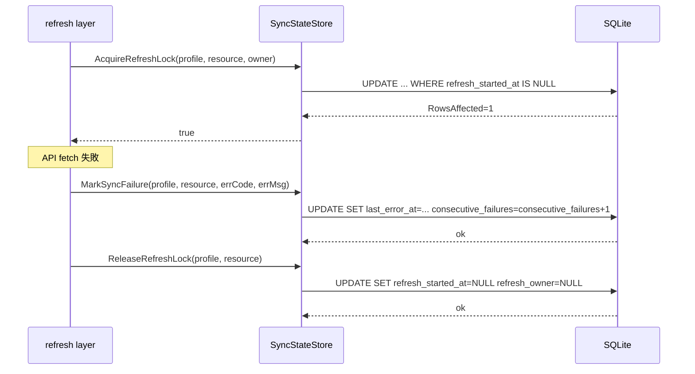
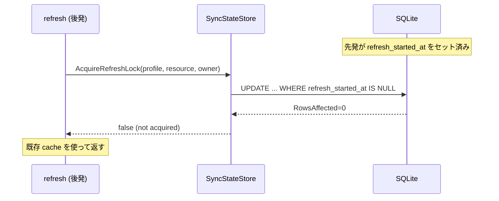

# M12: cache - sync_state + cache_meta 実装計画

## 概要

`internal/cache` パッケージに `sync_state` テーブルと `cache_meta` テーブルの CRUD 操作を実装する。
M11 で実装した `ResourceCache` と同じ設計パターン（Store 構造体 + SQL 定数 + context 引用）を踏襲する。

## スコープ

- `SyncStateStore`: sync_state CRUD + 特定フィールド更新メソッド
- `CacheMetaStore`: cache_meta CRUD
- テスト: in-memory DB で GREEN

## 対象ファイル

```
internal/cache/
  sync_state.go          # 新規
  sync_state_test.go     # 新規
  cache_meta.go          # 新規
  cache_meta_test.go     # 新規
```

既存ファイルへの変更: なし（schema.go の DDL は M11 で実装済み）

---

## 1. 型定義設計

### 1.1 SyncState 構造体

```go
// SyncMode は同期モードの列挙型。
type SyncMode string

const (
    SyncModeFull  SyncMode = "full"
    SyncModeDelta SyncMode = "delta"
)

// SyncStatus は同期ステータスの列挙型。
type SyncStatus string

const (
    SyncStatusSuccess SyncStatus = "success"
    SyncStatusFailure SyncStatus = "failure"
    SyncStatusRunning SyncStatus = "running"
)

// SyncState は sync_state テーブルの 1 行を表す。
// NOT NULL DEFAULT 列は Go の値型で保持する。
// NULL 許容列は sql.NullString / sql.NullInt64 で保持する。
type SyncState struct {
    ProfileName           string
    ResourceName          string
    LastSyncedAt          sql.NullString
    CursorUpdatedAt       sql.NullString
    LastFullSyncedAt      sql.NullString
    LastSyncMode          sql.NullString // SyncMode 相当
    LastSyncStatus        sql.NullString // SyncStatus 相当
    LastDailyRefreshDate  sql.NullString
    MustFullResync        bool           // INTEGER DEFAULT 0 → bool
    ExpiredAt             sql.NullString
    InvalidateReason      sql.NullString
    LastErrorAt           sql.NullString
    LastErrorCode         sql.NullString
    LastErrorMessage      sql.NullString
    ConsecutiveFailures   int64          // INTEGER DEFAULT 0 → int64
    RefreshStartedAt      sql.NullString
    RefreshOwner          sql.NullString
    CacheVersion          int64          // INTEGER DEFAULT 1 → int64
    SchemaVersion         int64          // INTEGER DEFAULT 1 → int64
}
```

設計判断:
- `MustFullResync` は `INTEGER DEFAULT 0` → `bool` に変換（0=false, 1=true）
- `ConsecutiveFailures`, `CacheVersion`, `SchemaVersion` は `int64`（sql.Scan の自然な型）
- `LastSyncMode`, `LastSyncStatus` は文字列として保存し、Store 外で SyncMode/SyncStatus 型にキャストする

### 1.2 SyncStateStore 構造体

```go
type SyncStateStore struct {
    db *DB
}

func NewSyncStateStore(db *DB) *SyncStateStore
```

### 1.3 CacheMeta テーブルのスペック確認

スペック §16.2 には `updated_at TEXT NOT NULL` カラムが定義されているが、
既存 DDL (`ddlCacheMeta`) には含まれていない。

**決定**: DDL との整合性を最優先とし、`updated_at` カラムは追加しない。
スペックの `updated_at` は将来の拡張余地として記録するにとどめる。
（DDL変更はスキーマバージョンアップを伴うため M12 スコープ外）

### 1.4 CacheMetaStore 構造体

```go
type CacheMetaStore struct {
    db *DB
}

func NewCacheMetaStore(db *DB) *CacheMetaStore
```

---

## 2. SyncStateStore メソッド設計

### 2.1 基本 CRUD

```go
// Get は指定 profile+resource の SyncState を返す。存在しない場合は nil, nil。
func (s *SyncStateStore) Get(ctx context.Context, profile, resource string) (*SyncState, error)

// Upsert は SyncState を挿入または完全上書きする（INSERT OR REPLACE）。
func (s *SyncStateStore) Upsert(ctx context.Context, state SyncState) error

// Delete は指定 profile+resource の行を削除する。存在しない場合もエラーなし。
func (s *SyncStateStore) Delete(ctx context.Context, profile, resource string) error
```

### 2.2 特定フィールド更新メソッド

refresh フロー（M13/M14）が頻繁に呼び出す操作を専用メソッドとして提供する。
Upsert の全フィールド更新よりも競合リスクが低く、意図が明確になる。

```go
// MarkSyncSuccess は差分/全件 refresh 成功時に呼び出す。
// last_synced_at, last_sync_mode, last_sync_status, last_daily_refresh_date を更新。
// cursor_updated_at は delta 時のみ更新（mode == SyncModeFull の場合は非更新）。
func (s *SyncStateStore) MarkSyncSuccess(
    ctx context.Context,
    profile, resource string,
    mode SyncMode,
    cursorUpdatedAt sql.NullString,   // delta 時: 新しい cursor / full 時: 空
    lastDailyRefreshDate string,      // "YYYY-MM-DD"
) error

// MarkSyncFailure は refresh 失敗時に呼び出す。
// last_error_at, last_error_code, last_error_message, consecutive_failures+1 を更新。
func (s *SyncStateStore) MarkSyncFailure(
    ctx context.Context,
    profile, resource string,
    errCode, errMessage string,
) error

// MarkFullSyncDone は full refresh 完了時に追加で呼び出す。
// last_full_synced_at, must_full_resync=false を更新。
func (s *SyncStateStore) MarkFullSyncDone(ctx context.Context, profile, resource string) error

// SetMustFullResync は cache expire 時に呼び出す。
// must_full_resync=true, expired_at, invalidate_reason を設定。
func (s *SyncStateStore) SetMustFullResync(
    ctx context.Context,
    profile, resource string,
    reason string,
) error

// AcquireRefreshLock は refresh 開始時のロック取得を試みる。
// refresh_started_at, refresh_owner を設定し、取得成功なら true を返す。
// すでにロック済みの場合は false, nil を返す（エラーではない）。
func (s *SyncStateStore) AcquireRefreshLock(
    ctx context.Context,
    profile, resource string,
    owner string,
) (bool, error)

// ReleaseRefreshLock は refresh 完了/失敗時にロックを解放する。
// refresh_started_at, refresh_owner を NULL に戻す。
func (s *SyncStateStore) ReleaseRefreshLock(ctx context.Context, profile, resource string) error
```

設計判断:
- `MarkSyncSuccess` に `cursorUpdatedAt` を渡す: delta 時のみ有効、full 時は NULL のまま
- ロック取得は SQLite の WHERE 句による楽観的制御（`refresh_started_at IS NULL`）

---

## 3. CacheMetaStore メソッド設計

```go
// Get は指定キーの値を返す。存在しない場合は "", nil。
func (s *CacheMetaStore) Get(ctx context.Context, key string) (string, error)

// Set は指定キーと値を挿入または上書きする（INSERT OR REPLACE）。
func (s *CacheMetaStore) Set(ctx context.Context, key, value string) error

// Delete は指定キーの行を削除する。存在しない場合もエラーなし。
func (s *CacheMetaStore) Delete(ctx context.Context, key string) error
```

シンプルな KV ストアとして設計する。`db_schema_version` 等の既存ユースケースに対応済み。

---

## 4. SQL 定数設計

### 4.1 sync_state

```go
const sqlSSGet = `
SELECT profile_name, resource_name,
  last_synced_at, cursor_updated_at, last_full_synced_at,
  last_sync_mode, last_sync_status, last_daily_refresh_date,
  must_full_resync, expired_at, invalidate_reason,
  last_error_at, last_error_code, last_error_message, consecutive_failures,
  refresh_started_at, refresh_owner,
  cache_version, schema_version
FROM sync_state
WHERE profile_name = ? AND resource_name = ?`

const sqlSSUpsert = `
INSERT OR REPLACE INTO sync_state (
  profile_name, resource_name,
  last_synced_at, cursor_updated_at, last_full_synced_at,
  last_sync_mode, last_sync_status, last_daily_refresh_date,
  must_full_resync, expired_at, invalidate_reason,
  last_error_at, last_error_code, last_error_message, consecutive_failures,
  refresh_started_at, refresh_owner,
  cache_version, schema_version
) VALUES (?, ?, ?, ?, ?, ?, ?, ?, ?, ?, ?, ?, ?, ?, ?, ?, ?, ?, ?)`

const sqlSSDelete = `
DELETE FROM sync_state WHERE profile_name = ? AND resource_name = ?`

// MarkSyncSuccess (delta): cursor_updated_at 含む
const sqlSSMarkDeltaSuccess = `
UPDATE sync_state SET
  last_synced_at = ?,
  cursor_updated_at = ?,
  last_sync_mode = 'delta',
  last_sync_status = 'success',
  last_daily_refresh_date = ?,
  consecutive_failures = 0
WHERE profile_name = ? AND resource_name = ?`

// MarkSyncSuccess (full): cursor_updated_at は変更しない
const sqlSSMarkFullSuccess = `
UPDATE sync_state SET
  last_synced_at = ?,
  last_sync_mode = 'full',
  last_sync_status = 'success',
  last_daily_refresh_date = ?,
  consecutive_failures = 0
WHERE profile_name = ? AND resource_name = ?`

const sqlSSMarkFailure = `
UPDATE sync_state SET
  last_error_at = ?,
  last_error_code = ?,
  last_error_message = ?,
  last_sync_status = 'failure',
  consecutive_failures = consecutive_failures + 1
WHERE profile_name = ? AND resource_name = ?`

const sqlSSMarkFullSyncDone = `
UPDATE sync_state SET
  last_full_synced_at = ?,
  must_full_resync = 0
WHERE profile_name = ? AND resource_name = ?`

const sqlSSSetMustFullResync = `
UPDATE sync_state SET
  must_full_resync = 1,
  expired_at = ?,
  invalidate_reason = ?
WHERE profile_name = ? AND resource_name = ?`

const sqlSSAcquireLock = `
UPDATE sync_state SET
  refresh_started_at = ?,
  refresh_owner = ?
WHERE profile_name = ? AND resource_name = ?
  AND refresh_started_at IS NULL`

const sqlSSReleaseLock = `
UPDATE sync_state SET
  refresh_started_at = NULL,
  refresh_owner = NULL
WHERE profile_name = ? AND resource_name = ?`
```

### 4.2 cache_meta

```go
const sqlCMGet    = `SELECT value FROM cache_meta WHERE key = ?`
const sqlCMSet    = `INSERT OR REPLACE INTO cache_meta (key, value) VALUES (?, ?)`
const sqlCMDelete = `DELETE FROM cache_meta WHERE key = ?`
```

---

## 5. TDD 設計

### 5.1 SyncStateStore テスト一覧

| ID | テスト名 | 観点 |
|----|----------|------|
| T_SS01 | TestNewSyncStateStore | non-nil 返却 |
| T_SS02 | TestSyncStateGet_NotFound | 存在しない場合 nil, nil |
| T_SS03 | TestSyncStateUpsert_Insert | 新規挿入して Get で確認 |
| T_SS04 | TestSyncStateUpsert_Replace | 上書きで全フィールド更新 |
| T_SS05 | TestSyncStateDelete_Exists | 既存行の削除 |
| T_SS06 | TestSyncStateDelete_NotFound | 存在しない場合もエラーなし |
| T_SS07 | TestMarkSyncSuccess_Delta | cursorUpdatedAt が更新される |
| T_SS08 | TestMarkSyncSuccess_Full | cursor_updated_at が変化しない |
| T_SS09 | TestMarkSyncSuccess_RowNotExist | UPDATE 対象なし（エラーなし） |
| T_SS10 | TestMarkSyncFailure | last_error_* + consecutive_failures+1 |
| T_SS11 | TestMarkSyncFailure_IncrementsConsecutive | 2回失敗で consecutive=2 |
| T_SS12 | TestMarkFullSyncDone | last_full_synced_at + must_full_resync=0 |
| T_SS13 | TestSetMustFullResync | must_full_resync=1 + expired_at + invalidate_reason |
| T_SS14 | TestAcquireRefreshLock_Success | ロック未取得時に true |
| T_SS15 | TestAcquireRefreshLock_AlreadyLocked | ロック取得済みで false |
| T_SS16 | TestReleaseRefreshLock | refresh_started_at/owner が NULL になる |
| T_SS17 | TestSyncState_NullFields | NULL 許容フィールドが正しく Scan される |
| T_SS18 | TestSyncState_BoolConversion | must_full_resync 0/1 ↔ bool |

### 5.2 CacheMetaStore テスト一覧

| ID | テスト名 | 観点 |
|----|----------|------|
| T_CM01 | TestNewCacheMetaStore | non-nil 返却 |
| T_CM02 | TestCacheMetaGet_NotFound | 存在しない場合 "" nil |
| T_CM03 | TestCacheMetaSet_Insert | 新規セット |
| T_CM04 | TestCacheMetaSet_Replace | 上書き |
| T_CM05 | TestCacheMetaDelete_Exists | 削除 |
| T_CM06 | TestCacheMetaDelete_NotFound | 存在しない場合もエラーなし |
| T_CM07 | TestCacheMeta_DBSchemaVersion | migrate 後に db_schema_version が取得できる |

合計: 25 テスト（目標）

---

## 6. シーケンス図

### 6.1 refresh 成功フロー（delta）



### 6.2 refresh 失敗フロー



### 6.3 ロック競合フロー



---

## 7. 実装ステップ（TDD サイクル）

### Step 1: sync_state.go の型定義

- `SyncMode`, `SyncStatus` 定数
- `SyncState` 構造体（19 フィールド）
- `SyncStateStore` 構造体 + `NewSyncStateStore`

### Step 2: sync_state_test.go の基本テスト（Red）

- T_SS01〜T_SS06（Get/Upsert/Delete）

### Step 3: Get/Upsert/Delete 実装（Green）

- SQL 定数 + scan ヘルパー + bool 変換

### Step 4: 特定フィールド更新テスト（Red）

- T_SS07〜T_SS18

### Step 5: 特定フィールド更新実装（Green）

- `MarkSyncSuccess`, `MarkSyncFailure`, `MarkFullSyncDone`
- `SetMustFullResync`, `AcquireRefreshLock`, `ReleaseRefreshLock`

### Step 6: cache_meta.go

- `CacheMetaStore` 構造体 + `NewCacheMetaStore`
- `Get/Set/Delete` 実装

### Step 7: cache_meta_test.go（Red → Green）

- T_CM01〜T_CM07

### Step 8: Refactor

- SQL 定数の整理
- scan ヘルパー共通化
- エラーメッセージの統一（`cache: sync_state: <op>: %w`）

---

## 8. エラーメッセージ規約

M11 の `ResourceCache` に揃える:

```
cache: sync_state: get: %w
cache: sync_state: upsert: %w
cache: sync_state: delete: %w
cache: sync_state: mark_success: %w
cache: sync_state: mark_failure: %w
cache: sync_state: mark_full_sync_done: %w
cache: sync_state: set_must_full_resync: %w
cache: sync_state: acquire_lock: %w
cache: sync_state: release_lock: %w

cache: cache_meta: get: %w
cache: cache_meta: set: %w
cache: cache_meta: delete: %w
```

---

## 9. リスクと対策

| リスク | 影響 | 対策 |
|--------|------|------|
| bool ↔ INTEGER 変換ミス | must_full_resync が常に false になる | T_SS18 で 0/1/true/false の境界値テスト |
| AcquireRefreshLock の競合判定 | RowsAffected=0 を lock 取得済みと誤認 | ExecContext の RowsAffected で判定、テスト T_SS15 で確認 |
| MarkSyncSuccess delta/full の分岐 | cursor_updated_at が誤更新 | T_SS07/T_SS08 で独立テスト |
| cache_meta の DDL と updated_at の乖離 | スペック記述との差異混乱 | 本計画に決定理由を明記（DDL 優先） |
| scan フィールド順序ミス | サイレントなデータ不整合 | SQL SELECT と Scan の列順を常に一致させる規約 |

---

## 10. 完了条件

- `go test ./internal/cache/...` が全テスト GREEN（目標 25 テスト以上）
- `go vet ./internal/cache/...` がエラーなし
- `go build ./...` が通る
- `SyncStateStore.Get` → `nil, nil`（存在しない場合）の動作確認
- `AcquireRefreshLock` の lock 競合が false を返す動作確認

---

## 参照

- スペック §15 sync_state テーブル
- スペック §16 cache_meta テーブル
- スペック §18 refresh 種別・フロー
- スペック §31.2 refresh 失敗時の挙動
- `internal/cache/schema.go`: DDL 定義（ddlSyncState, ddlCacheMeta）
- `internal/cache/resource_cache.go`: 実装パターンの参照
