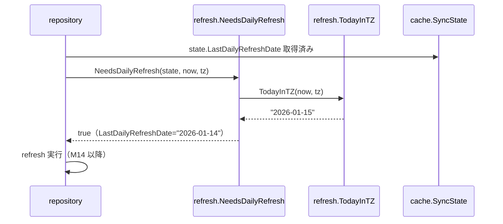
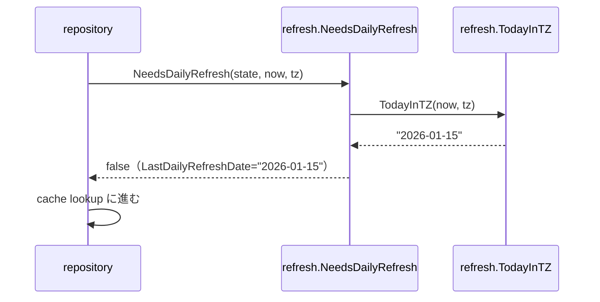
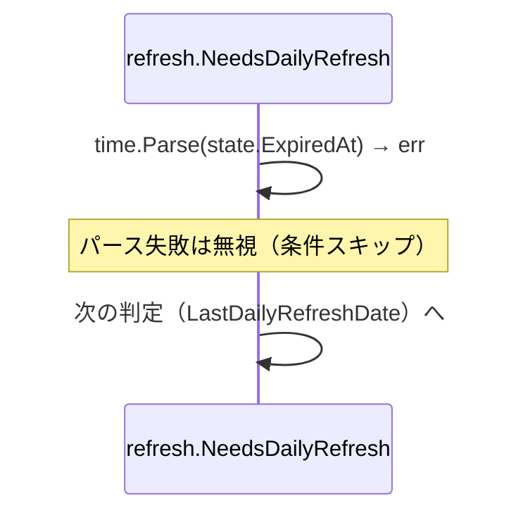

# M13: refresh policy + daily 判定 実装詳細計画

## 概要

`internal/refresh/` パッケージを新規作成し、daily auto refresh の判定ロジックを実装する。
SyncState の `LastDailyRefreshDate` と現在日付（timezone 考慮）を比較し、リフレッシュが必要か否かを返す純粋関数群を提供する。

---

## スコープ

| ファイル | 責務 |
|---|---|
| `internal/refresh/policy.go` | `NeedsDailyRefresh` 関数（メイン判定） |
| `internal/refresh/daily.go` | timezone 考慮の今日の日付文字列取得 |
| `internal/refresh/policy_test.go` | policy.go のテスト |
| `internal/refresh/daily_test.go` | daily.go のテスト |

---

## アーキテクチャ上の位置づけ

```
repository
  └─ refresh.NeedsDailyRefresh(state, now, tz)
       ├─ state == nil            → true（初回）
       ├─ state.MustFullResync    → true（強制リセット）
       ├─ state.ExpiredAt < now   → true（TTL 切れ）
       └─ TodayInTZ(now, tz) \!= state.LastDailyRefreshDate → true/false
```

M14（差分 refresh エンジン）から呼び出す予定。M13 は純粋な判定ロジックのみで、DB/API アクセスは行わない。

---

## 設計詳細

### daily.go

```go
package refresh

import "time"

// TodayInTZ は now を tz の timezone で解釈した日付を "YYYY-MM-DD" 形式で返す。
func TodayInTZ(now time.Time, tz *time.Location) string {
    return now.In(tz).Format("2006-01-02")
}
```

シンプルな純粋関数。外部依存なし。

### policy.go

```go
package refresh

import (
    "time"
    "github.com/youyo/board/internal/cache"
)

// NeedsDailyRefresh は、指定された SyncState と現在時刻・timezone を元に
// daily refresh が必要かどうかを返す。
//
// 判定順:
//  1. state == nil（初回、レコードなし）→ true
//  2. state.MustFullResync == true → true
//  3. state.ExpiredAt が有効かつ now より過去 → true
//  4. TodayInTZ(now, tz) \!= state.LastDailyRefreshDate → true/false
//  5. それ以外 → false
func NeedsDailyRefresh(state *cache.SyncState, now time.Time, tz *time.Location) bool {
    if state == nil {
        return true
    }
    if state.MustFullResync {
        return true
    }
    if state.ExpiredAt.Valid {
        expiredAt, err := time.Parse(time.RFC3339, state.ExpiredAt.String)
        if err == nil && now.After(expiredAt) {
            return true
        }
    }
    today := TodayInTZ(now, tz)
    if \!state.LastDailyRefreshDate.Valid {
        return true
    }
    return today \!= state.LastDailyRefreshDate.String
}
```

#### 判定ルール詳細

| 条件 | 結果 | 理由 |
|---|---|---|
| `state == nil` | `true` | 初回アクセス、DB にレコードなし |
| `MustFullResync == true` | `true` | 手動 invalidate や schema 変更後 |
| `ExpiredAt` が有効かつ `now` より過去 | `true` | TTL 切れ |
| `LastDailyRefreshDate` が NULL | `true` | 日付が記録されていない |
| `TodayInTZ(now, tz) \!= LastDailyRefreshDate` | `true` | 今日未実行 |
| 上記いずれも非該当 | `false` | 今日実行済み |

#### DailyAutoRefresh フラグについて

`config.ProfileConfig.DailyAutoRefresh` の OFF 判定は **呼び出し側（repository/service）の責務**とする。
`NeedsDailyRefresh` は config を受け取らない。理由：

- 純粋関数として保つ（テストしやすい）
- OFF の場合は `NeedsDailyRefresh` を呼ばなければ良い

---

## TDD 設計

### daily_test.go

| テストID | ケース | 入力 | 期待値 |
|---|---|---|---|
| T_DR01 | UTC の日付文字列 | `2026-01-15 12:00 UTC`, `time.UTC` | `"2026-01-15"` |
| T_DR02 | JST（+09:00）日付が UTC と異なる | `2026-01-15 01:00 UTC`, `Asia/Tokyo` | `"2026-01-15"` |
| T_DR03 | JST 深夜 0 時を跨ぐ | `2026-01-15 15:00 UTC`, `Asia/Tokyo` | `"2026-01-16"` |
| T_DR04 | 任意のカスタム timezone | `2026-06-01 23:00 UTC`, `America/New_York` | `"2026-06-01"` |

### policy_test.go

| テストID | ケース | 入力 | 期待値 |
|---|---|---|---|
| T_NR01 | state が nil | `nil`, now, UTC | `true` |
| T_NR02 | MustFullResync が true | `MustFullResync=true`, now, UTC | `true` |
| T_NR03 | ExpiredAt が過去 | `ExpiredAt="2020-01-01T00:00:00Z"`, now=2026, UTC | `true` |
| T_NR04 | ExpiredAt が未来 | `ExpiredAt="2030-01-01T00:00:00Z"`, now=2026, UTC | `false`（他条件次第） |
| T_NR05 | LastDailyRefreshDate が NULL | `LastDailyRefreshDate.Valid=false`, now, UTC | `true` |
| T_NR06 | 今日未実行 | `LastDailyRefreshDate="2026-01-14"`, now=2026-01-15, UTC | `true` |
| T_NR07 | 今日実行済み | `LastDailyRefreshDate="2026-01-15"`, now=2026-01-15 12:00 UTC, UTC | `false` |
| T_NR08 | JST 跨ぎ：UTC 未実行でも JST 当日 | `LastDailyRefreshDate="2026-01-15"`, now=2026-01-15 01:00 UTC, Asia/Tokyo | `false` |
| T_NR09 | JST 跨ぎ：UTC 同日でも JST 翌日 | `LastDailyRefreshDate="2026-01-15"`, now=2026-01-15 15:00 UTC, Asia/Tokyo | `true` |
| T_NR10 | ExpiredAt パース失敗は無視 | `ExpiredAt="invalid"`, 今日実行済み | `false` |
| T_NR11 | MustFullResync が false かつ今日実行済み | 正常状態 | `false` |

---

## シーケンス図

### 正常系: daily refresh 必要



### 正常系: daily refresh 不要



### エラー系: ExpiredAt が不正文字列



---

## 実装ステップ（TDD）

### Step 1: Red - daily.go テスト

```
internal/refresh/daily_test.go を作成
- T_DR01〜T_DR04 を実装
- go test → コンパイルエラー（daily.go 未存在）
```

### Step 2: Green - daily.go 実装

```
internal/refresh/daily.go を作成
- TodayInTZ を実装（3行程度）
- go test → T_DR01〜T_DR04 GREEN
```

### Step 3: Red - policy.go テスト

```
internal/refresh/policy_test.go を作成
- T_NR01〜T_NR11 を実装
- ヘルパー makeState() を定義
- go test → コンパイルエラー（policy.go 未存在）
```

### Step 4: Green - policy.go 実装

```
internal/refresh/policy.go を作成
- NeedsDailyRefresh を実装
- go test → T_NR01〜T_NR11 GREEN
```

### Step 5: Refactor

```
- コメント整備
- エッジケース追加（必要時）
- go vet, gofmt
- go test ./... → 全テスト GREEN（44 + 新規 15 テスト）
```

---

## ファイル構成

```
internal/refresh/
  daily.go          # TodayInTZ(now time.Time, tz *time.Location) string
  daily_test.go     # T_DR01〜T_DR04
  policy.go         # NeedsDailyRefresh(state, now, tz) bool
  policy_test.go    # T_NR01〜T_NR11
```

---

## インターフェース定義（確定）

```go
// TodayInTZ は now を tz で解釈した日付を "YYYY-MM-DD" 形式で返す。
func TodayInTZ(now time.Time, tz *time.Location) string

// NeedsDailyRefresh は daily refresh が必要かどうかを返す。
// state が nil の場合は初回とみなして true を返す。
// tz は config.Timezone をロードした *time.Location を渡す。
func NeedsDailyRefresh(state *cache.SyncState, now time.Time, tz *time.Location) bool
```

---

## 評価マトリクス（設計アプローチ比較）

| 評価軸 | 採用案（純粋関数） | 代替案A（メソッド） | 代替案B（Policy struct） |
|---|---|---|---|
| テスタビリティ | ⭐⭐⭐⭐⭐ | ⭐⭐⭐ | ⭐⭐⭐⭐ |
| シンプルさ | ⭐⭐⭐⭐⭐ | ⭐⭐⭐ | ⭐⭐ |
| 拡張性 | ⭐⭐⭐ | ⭐⭐⭐⭐ | ⭐⭐⭐⭐⭐ |
| M14 との結合度 | ⭐⭐⭐⭐⭐ | ⭐⭐⭐ | ⭐⭐⭐ |

採用理由: M13 スコープでは設定フラグ（DailyAutoRefresh）の処理は repository 側に任せる。判定ロジックを純粋関数にすることで決定的なテストが書けるため採用。将来的に Policy struct への移行も容易。

---

## リスク評価

| リスク | 影響 | 対策 |
|---|---|---|
| timezone 名が不正（config に typo） | panic または誤判定 | repository 側で `time.LoadLocation` のエラーをハンドリング（M13 スコープ外） |
| ExpiredAt の時刻フォーマット揺れ | パース失敗で条件スキップ | RFC3339 で統一。パース失敗は無視（スキップ）して次の判定に進む |
| SyncState 構造体の変更 | コンパイルエラー | M13 は読み取りのみ。フィールド追加は影響なし |
| テスト時刻固定の漏れ | フレーキーテスト | now を引数注入。`time.Now()` をテストコードに書かない |

---

## 完了条件

- [ ] `internal/refresh/daily.go` 実装済み
- [ ] `internal/refresh/daily_test.go` T_DR01〜T_DR04 GREEN
- [ ] `internal/refresh/policy.go` 実装済み
- [ ] `internal/refresh/policy_test.go` T_NR01〜T_NR11 GREEN
- [ ] `go test ./...` 全テスト GREEN（既存 44 + 新規 15）
- [ ] `go vet ./...` エラーなし
- [ ] `gofmt` 差分なし
