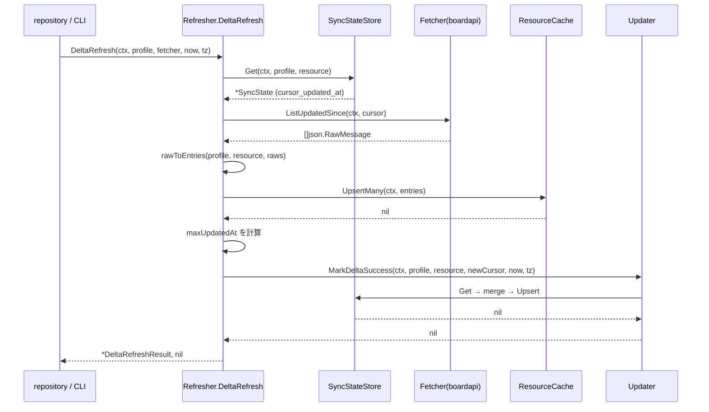
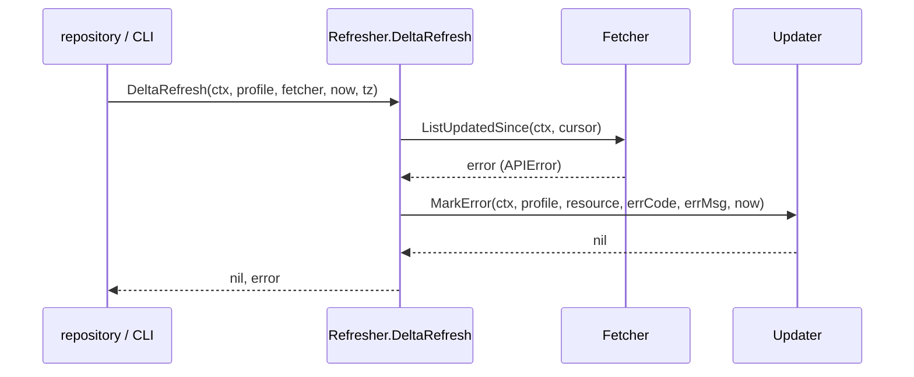
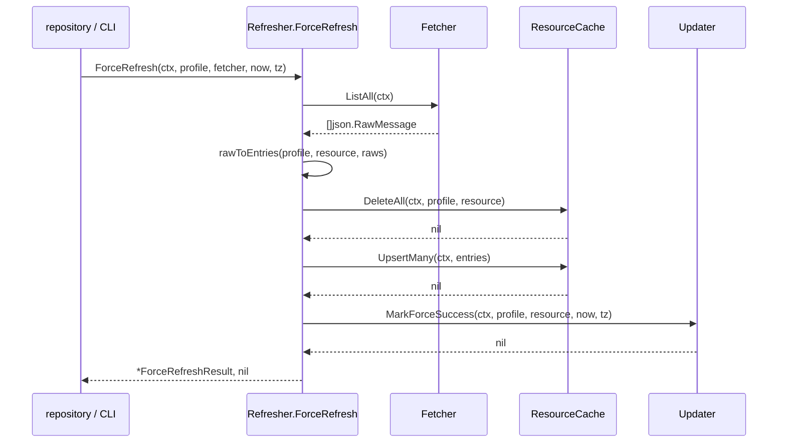

# M14: refresh エンジン実装計画

## スコープ

`internal/refresh/` パッケージに以下3ファイルを追加し、テストを含めて完成させる。

| ファイル | 役割 |
|---|---|
| `resource_refresh.go` | 差分取得（DeltaRefresh）+ 実行ディスパッチ |
| `force_refresh.go` | 全件再取得（ForceRefresh） |
| `updater.go` | sync_state フィールド更新ヘルパー |
| `resource_refresh_test.go` | DeltaRefresh の単体テスト |
| `force_refresh_test.go` | ForceRefresh の単体テスト |
| `updater_test.go` | Updater の単体テスト |

---

## 前提（ハンドオフ確認）

### 既存インターフェース

**cache.ResourceCache**
- `Upsert(ctx, Entry) error`
- `UpsertMany(ctx, []Entry) error`
- `Get(ctx, EntityKey) (*Entry, error)`
- `List(ctx, profile, resource string) ([]Entry, error)`
- `Delete(ctx, EntityKey) error`
- `DeleteAll(ctx, profile, resource string) error`

**cache.SyncStateStore**
- `Get(ctx, profile, resource string) (*SyncState, error)`
- `Upsert(ctx, SyncState) error`
- `Delete(ctx, profile, resource string) error`

**cache.EntityKey**
- `Profile`, `Resource`, `EntityID string`

**cache.SyncState** の主要フィールド
- `ProfileName`, `ResourceName string`
- `CursorUpdatedAt sql.NullString` — 差分カーソル
- `LastSyncedAt sql.NullString` — 最終同期日時
- `LastFullSyncedAt sql.NullString` — 最終全件同期日時
- `LastSyncMode sql.NullString` — "delta" / "full"
- `LastSyncStatus sql.NullString` — "success" / "error"
- `LastDailyRefreshDate sql.NullString` — daily 判定用
- `MustFullResync bool`
- `LastErrorAt`, `LastErrorCode`, `LastErrorMessage sql.NullString`
- `ConsecutiveFailures int64`

**boardapi.Client（既存メソッドパターン）**
- `ListClients(ctx) ([]ClientEntity, error)` → 全件
- `SearchClients(ctx, params) ([]ClientEntity, error)` → `updated_at_from` フィルタで差分

**refresh.NeedsDailyRefresh**（policy.go 既存）
```go
func NeedsDailyRefresh(state *cache.SyncState, now time.Time, tz *time.Location) bool
```

---

## 設計方針

### Fetcher インターフェース

boardapi.Client への依存を逆転させ、テスト可能にする。

```go
// Fetcher は refresh エンジンが API から entity を取得するための抽象。
// resource ごとに実装を提供する（clients, projects, ...）。
type Fetcher interface {
    // ResourceName はリソース識別子（例: "clients"）を返す。
    ResourceName() string
    // ListAll は全件取得する。
    // 戻り値は json.RawMessage のスライス（各要素が1 entity）。
    ListAll(ctx context.Context) ([]json.RawMessage, error)
    // ListUpdatedSince は updated_at >= since の entity を取得する。
    // since が空文字の場合は全件取得と同等とする。
    ListUpdatedSince(ctx context.Context, since string) ([]json.RawMessage, error)
}
```

Fetcher は `internal/refresh/` パッケージ内に定義する。  
各 boardapi リソースのアダプタは repository 層（M15以降）で実装する。

### Refresher 構造体

```go
// Refresher は差分・全件リフレッシュの実行エンジン。
type Refresher struct {
    resourceCache *cache.ResourceCache
    syncStore     *cache.SyncStateStore
}

func NewRefresher(rc *cache.ResourceCache, ss *cache.SyncStateStore) *Refresher
```

### エンティティ ID の抽出

json.RawMessage から `"id"` フィールドを抽出して EntityID（string）に変換する。  
boardapi の全リソースは `int` 型 ID を持つ（`json:"id"`）。  
`strconv.Itoa` で文字列化した値をキャッシュキーとして使う。

```go
// extractID は json.RawMessage から "id" フィールドを文字列で返す。
func extractID(raw json.RawMessage) (string, error) {
    var v struct{ ID int `json:"id"` }
    if err := json.Unmarshal(raw, &v); err \!= nil {
        return "", err
    }
    if v.ID == 0 {
        return "", errors.New("entity has no id or id=0")
    }
    return strconv.Itoa(v.ID), nil
}
```

### extractUpdatedAt

差分カーソル更新のため、最大 `updated_at` を抽出する。

```go
// extractUpdatedAt は json.RawMessage から "updated_at" フィールドを返す。
func extractUpdatedAt(raw json.RawMessage) string {
    var v struct{ UpdatedAt string `json:"updated_at"` }
    _ = json.Unmarshal(raw, &v)
    return v.UpdatedAt // 存在しない場合は空文字
}
```

### rawToEntries ヘルパー

```go
// rawToEntries は []json.RawMessage を []cache.Entry に変換する。
// FetchedAt は呼び出し側で設定するため Entry には含めない（ResourceCache が自動設定）。
func rawToEntries(profile, resource string, raws []json.RawMessage) ([]cache.Entry, error)
```

---

## API 設計（公開インターフェース）

### resource_refresh.go

```go
package refresh

// DeltaRefreshResult は差分取得の結果サマリ。
type DeltaRefreshResult struct {
    Profile      string
    Resource     string
    FetchedCount int
    NewCursor    string // 更新後のカーソル値（空 = 変化なし）
}

// DeltaRefresh は cursor_updated_at 以降の差分を取得し、キャッシュへ upsert する。
//
// アルゴリズム:
//  1. SyncState.cursor_updated_at を読む（nil なら "" = 全件）
//  2. fetcher.ListUpdatedSince(ctx, cursor) で差分取得
//  3. rawToEntries で Entry スライスに変換
//  4. ResourceCache.UpsertMany でキャッシュ更新
//  5. 取得結果中の最大 updated_at を新カーソルとして算出
//  6. Updater.MarkDeltaSuccess で sync_state 更新
func (r *Refresher) DeltaRefresh(
    ctx context.Context,
    profile string,
    fetcher Fetcher,
    now time.Time,
    tz *time.Location,
) (*DeltaRefreshResult, error)
```

### force_refresh.go

```go
// ForceRefreshResult は全件取得の結果サマリ。
type ForceRefreshResult struct {
    Profile      string
    Resource     string
    FetchedCount int
}

// ForceRefresh は全件を取得し、既存キャッシュを DeleteAll 後に UpsertMany する。
//
// アルゴリズム:
//  1. fetcher.ListAll(ctx) で全件取得
//  2. rawToEntries で Entry スライスに変換
//  3. ResourceCache.DeleteAll で既存キャッシュを全消去
//  4. ResourceCache.UpsertMany で全件挿入
//  5. Updater.MarkForceSuccess で sync_state 更新
func (r *Refresher) ForceRefresh(
    ctx context.Context,
    profile string,
    fetcher Fetcher,
    now time.Time,
    tz *time.Location,
) (*ForceRefreshResult, error)
```

### updater.go

```go
// Updater は sync_state の各フィールドを更新するヘルパー。
// Refresher に埋め込まず、独立した型として定義する。
type Updater struct {
    syncStore *cache.SyncStateStore
}

func NewUpdater(ss *cache.SyncStateStore) *Updater

// MarkDeltaSuccess は差分取得成功後に sync_state を更新する。
// 更新フィールド:
//   - last_synced_at = now (RFC3339)
//   - last_sync_mode = "delta"
//   - last_sync_status = "success"
//   - last_daily_refresh_date = TodayInTZ(now, tz)
//   - cursor_updated_at = newCursor（空の場合は既存値を保持）
//   - consecutive_failures = 0
//   - last_error_at, last_error_code, last_error_message は変更しない
func (u *Updater) MarkDeltaSuccess(
    ctx context.Context,
    profile, resource string,
    newCursor string,
    now time.Time,
    tz *time.Location,
) error

// MarkForceSuccess は全件取得成功後に sync_state を更新する。
// 更新フィールド:
//   - last_synced_at = now (RFC3339)
//   - last_full_synced_at = now (RFC3339)
//   - last_sync_mode = "full"
//   - last_sync_status = "success"
//   - last_daily_refresh_date = TodayInTZ(now, tz)
//   - cursor_updated_at = NULL（full 後はカーソルリセット）
//   - must_full_resync = false
//   - consecutive_failures = 0
func (u *Updater) MarkForceSuccess(
    ctx context.Context,
    profile, resource string,
    now time.Time,
    tz *time.Location,
) error

// MarkError は refresh 失敗時に sync_state を更新する。
// 更新フィールド:
//   - last_sync_status = "error"
//   - last_error_at = now (RFC3339)
//   - last_error_code = errCode
//   - last_error_message = errMsg
//   - consecutive_failures++
func (u *Updater) MarkError(
    ctx context.Context,
    profile, resource string,
    errCode, errMsg string,
    now time.Time,
) error
```

---

## シーケンス図

### 差分 refresh（正常系）



### 差分 refresh（エラー系）



### 全件 refresh（正常系）



---

## TDD 設計

### テストの構成方針

- **実 SQLite（tempfile）** を使う。M10〜M13 のテストで確立された `cache.NewDB(path)` パターンを踏襲。
- **Fetcher はインメモリスタブ** で実装する（`boardapi.Client` への依存なし）。
- `now` は固定値（`time.Date(2025, 1, 15, 10, 0, 0, 0, time.UTC)`）を使う。
- `tz` は `time.UTC` を使う。

### スタブ Fetcher

```go
// stubFetcher はテスト用の Fetcher 実装。
type stubFetcher struct {
    resource         string
    listAllItems     []json.RawMessage
    listSinceItems   []json.RawMessage
    listAllErr       error
    listSinceErr     error
    capturedSince    string // ListUpdatedSince の引数記録
}

func (f *stubFetcher) ResourceName() string { return f.resource }
func (f *stubFetcher) ListAll(ctx context.Context) ([]json.RawMessage, error) { ... }
func (f *stubFetcher) ListUpdatedSince(ctx context.Context, since string) ([]json.RawMessage, error) {
    f.capturedSince = since
    ...
}
```

### テストケース一覧

#### updater_test.go

| テスト名 | 概要 |
|---|---|
| `TestUpdater_MarkDeltaSuccess_NewRecord` | sync_state が存在しない初回、全フィールドが正しく設定される |
| `TestUpdater_MarkDeltaSuccess_UpdatesCursor` | 既存 sync_state の cursor_updated_at が更新される |
| `TestUpdater_MarkDeltaSuccess_EmptyCursorPreservesExisting` | newCursor が空の場合、既存 cursor_updated_at を保持する |
| `TestUpdater_MarkDeltaSuccess_SetsConsecutiveFailuresToZero` | consecutive_failures がリセットされる |
| `TestUpdater_MarkForceSuccess_ResetsCursor` | cursor_updated_at が NULL にリセットされる |
| `TestUpdater_MarkForceSuccess_SetsLastFullSyncedAt` | last_full_synced_at が更新される |
| `TestUpdater_MarkForceSuccess_ClearsMustFullResync` | must_full_resync が false にクリアされる |
| `TestUpdater_MarkError_IncrementsConsecutiveFailures` | consecutive_failures がインクリメントされる |
| `TestUpdater_MarkError_SetsErrorFields` | last_error_at/code/message が更新される |

#### resource_refresh_test.go

| テスト名 | 概要 |
|---|---|
| `TestDeltaRefresh_NoExistingState_FetchesAll` | sync_state なし → cursor="" でフェッチ、全件 UpsertMany |
| `TestDeltaRefresh_WithCursor_PassesCursorToFetcher` | cursor_updated_at あり → fetcher に since を渡す |
| `TestDeltaRefresh_UpdatesMaxUpdatedAtAsCursor` | 取得 entity の最大 updated_at が新カーソルになる |
| `TestDeltaRefresh_EmptyResult_PreservesCursor` | 差分 0 件 → カーソル変化なし |
| `TestDeltaRefresh_UpdatesSyncState` | last_synced_at, last_sync_mode, last_daily_refresh_date が正しく設定される |
| `TestDeltaRefresh_FetcherError_MarksError` | fetcher エラー → MarkError が呼ばれ、エラー返却 |
| `TestDeltaRefresh_UpsertError_ReturnsError` | UpsertMany 失敗 → エラー返却（sync_state は更新しない） |
| `TestDeltaRefresh_EntityWithNoUpdatedAt_Handled` | updated_at なし entity → カーソル計算でスキップ（エラーなし） |

#### force_refresh_test.go

| テスト名 | 概要 |
|---|---|
| `TestForceRefresh_DeletesAllThenUpserts` | DeleteAll 後に UpsertMany が呼ばれる順序保証 |
| `TestForceRefresh_UpdatesSyncState` | last_full_synced_at, last_sync_mode="full", must_full_resync=false |
| `TestForceRefresh_EmptyResult_ClearsCache` | 全件0件 → DeleteAll のみ実行、cache は空 |
| `TestForceRefresh_FetcherError_MarksError` | fetcher エラー → MarkError が呼ばれ、DeleteAll は実行しない |
| `TestForceRefresh_ResetsCursor` | 完了後 cursor_updated_at が NULL |

---

## 実装ステップ（TDD Red → Green → Refactor）

### Step 1: updater.go から開始（依存が最小）

**1-1. Red: updater_test.go を書く**

MarkDeltaSuccess / MarkForceSuccess / MarkError のテスト全件を先に書く。  
テストは `go test ./internal/refresh/` でコンパイルエラーになる（型未定義）。

**1-2. Green: updater.go を実装**

- `Updater` 構造体と `NewUpdater` を定義
- `MarkDeltaSuccess`: SyncStateStore.Get → フィールド更新 → Upsert
  - 既存 sync_state が nil の場合は新規 SyncState を初期化
- `MarkForceSuccess`: cursor を `sql.NullString{Valid: false}` にリセット
- `MarkError`: consecutive_failures++ して Upsert

**1-3. Refactor**

- `nullString(s string) sql.NullString` ヘルパー関数を追加
- `nullStringOrKeep(newVal, existing sql.NullString) sql.NullString` ヘルパーで cursor の keep ロジックを整理

### Step 2: 共通ヘルパー（extractID, extractUpdatedAt, rawToEntries）

**2-1. Red: resource_refresh_test.go に rawToEntries 相当のテストを組み込む**

**2-2. Green: resource_refresh.go に private 関数として実装**

- `extractID(raw json.RawMessage) (string, error)`
- `extractUpdatedAt(raw json.RawMessage) string`
- `rawToEntries(profile, resource string, raws []json.RawMessage) ([]cache.Entry, error)`
- `maxUpdatedAt(raws []json.RawMessage) string`

### Step 3: DeltaRefresh

**3-1. Red: resource_refresh_test.go のテストを完成させる**

**3-2. Green: Refresher 構造体 + DeltaRefresh を実装**

```
func (r *Refresher) DeltaRefresh(...) (*DeltaRefreshResult, error):
  1. r.syncStore.Get(ctx, profile, resource)
  2. cursor := "" if state == nil else state.CursorUpdatedAt.String
  3. raws, err := fetcher.ListUpdatedSince(ctx, cursor)
  4. if err: r.updater.MarkError(...); return nil, err
  5. entries, err := rawToEntries(...)
  6. if err: return nil, err
  7. r.resourceCache.UpsertMany(ctx, entries)
  8. newCursor := maxUpdatedAt(raws)
  9. r.updater.MarkDeltaSuccess(ctx, profile, resource, newCursor, now, tz)
  10. return &DeltaRefreshResult{...}, nil
```

**3-3. Refactor**

- Updater を Refresher のフィールドとして組み込む（`updater *Updater`）
- cursor 抽出ロジックを `cursorFromState(state *cache.SyncState) string` に抽出

### Step 4: ForceRefresh

**4-1. Red: force_refresh_test.go を書く**

**4-2. Green: ForceRefresh を実装**

```
func (r *Refresher) ForceRefresh(...) (*ForceRefreshResult, error):
  1. raws, err := fetcher.ListAll(ctx)
  2. if err: r.updater.MarkError(...); return nil, err
  3. entries, err := rawToEntries(...)
  4. r.resourceCache.DeleteAll(ctx, profile, resource)
  5. r.resourceCache.UpsertMany(ctx, entries)
  6. r.updater.MarkForceSuccess(ctx, profile, resource, now, tz)
  7. return &ForceRefreshResult{...}, nil
```

**4-3. Refactor**

- 全体を通してパッケージの公開 API を整理
- `go vet ./internal/refresh/` を実行してクリーンアップ

### Step 5: テスト全件パスの確認

```bash
go test ./internal/refresh/... -v -count=1
go vet ./internal/refresh/...
```

---

## アーキテクチャ評価

### アプローチ比較

| 評価軸 | A: Fetcher インターフェース（採用案） | B: boardapi.Client を直接受け取る | C: 関数型（func引数） |
|---|---|---|---|
| テスタビリティ | ★★★★★ スタブ実装が容易 | ★★ httptest が必要 | ★★★★ |
| 型安全性 | ★★★★ インターフェース明示 | ★★★★ 具象型 | ★★★ |
| 拡張性 | ★★★★ resource ごとに実装 | ★★ 全リソース1クライアントに集約 | ★★★ |
| 実装コスト | ★★★ Fetcher アダプタ別途必要 | ★★★★ 既存型を直接使用 | ★★★ |
| 依存方向 | ★★★★★ refresh→boardapi 依存なし | ★★ 双方向依存リスク | ★★★★ |

**採用理由**: Fetcher インターフェースにより `internal/refresh` パッケージが `internal/boardapi` に依存しない。repository 層でアダプタを実装することで、テスト時は完全にモック可能。スペック §37「refresh ロジックを複数箇所に重複実装しない」を自然に満たす。

### リスクと対策

| リスク | 影響度 | 対策 |
|---|---|---|
| `updated_at_from` パラメータが全リソースで統一されていない | 中 | M14 は Fetcher インターフェース定義のみ。各リソースのアダプタ実装は repository 層（M15）で担当 |
| DeleteAll + UpsertMany の間にクラッシュすると cache が空になる | 中 | MVP では許容（スペック §31.2: refresh 失敗時は既存 cache を返す方針あり）。将来的にトランザクション化 |
| cursor 境界重複による同一 entity の二重取得 | 低 | upsert で吸収（スペック §18.5 明記） |
| entity に `id=0` または `id` フィールドなし | 低 | extractID でエラーとして扱い、rawToEntries 全体をエラーとして返す |
| consecutive_failures の非原子更新（Get → increment → Upsert） | 低 | CLI は単発実行が基本（スペック §19.2）。MCP は in-process mutex で保護（M19以降） |

### M14 に含めないもの（スコープ外）

- ロック制御（`refresh_started_at` / `refresh_owner`）— M19
- 各リソースの Fetcher アダプタ実装 — M15（repository 層）
- `NeedsDailyRefresh` を使った自動トリガー — M15（repository 層）
- prune（削除済み entity の検知） — 将来拡張

---

## ファイル配置

```
internal/refresh/
  policy.go             ← 既存（NeedsDailyRefresh）
  daily.go              ← 既存（TodayInTZ）
  updater.go            ← NEW
  updater_test.go       ← NEW
  resource_refresh.go   ← NEW（Fetcher interface, Refresher, DeltaRefresh, helpers）
  resource_refresh_test.go ← NEW
  force_refresh.go      ← NEW（ForceRefresh）
  force_refresh_test.go ← NEW
```

---

## 完了条件

- `go test ./internal/refresh/... -count=1` が全件 PASS
- `go vet ./internal/refresh/` がエラーなし
- Fetcher インターフェースが `internal/refresh` パッケージに定義されており、boardapi への import がない
- DeltaRefresh・ForceRefresh・Updater の全 public メソッドに godoc コメントがある
- `consecutive_failures=0` リセット、`cursor_updated_at` の NULL リセット、`must_full_resync=false` のクリアが各テストで検証済み
