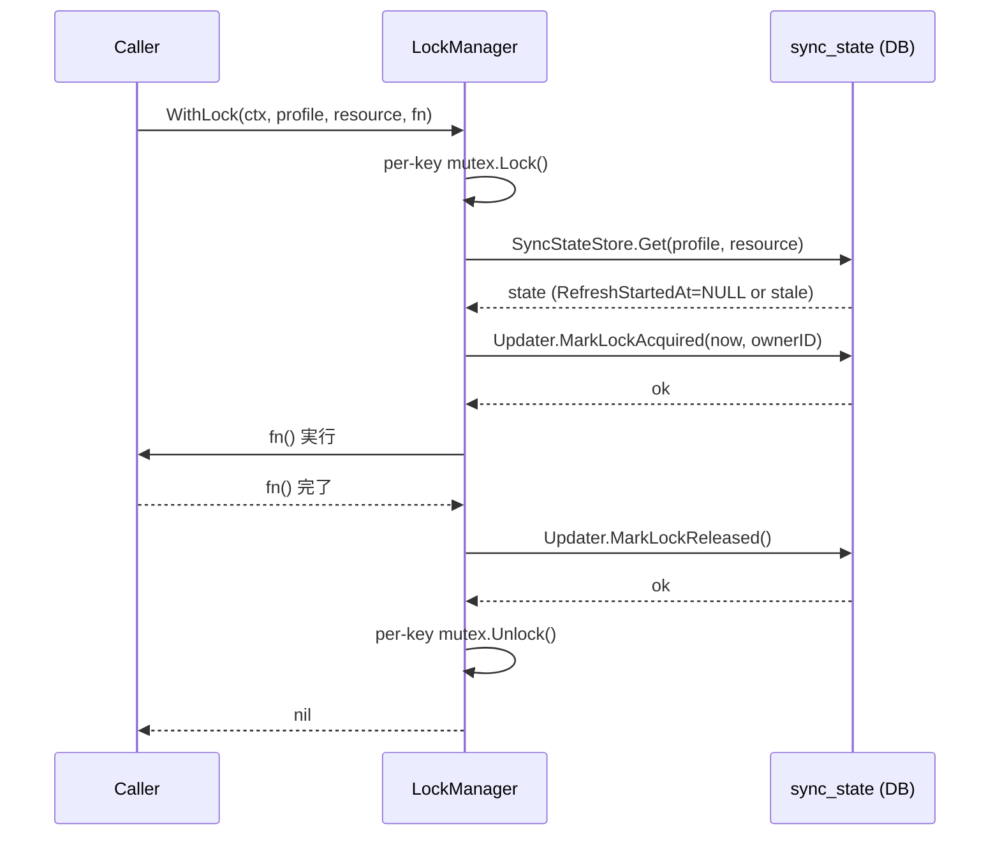
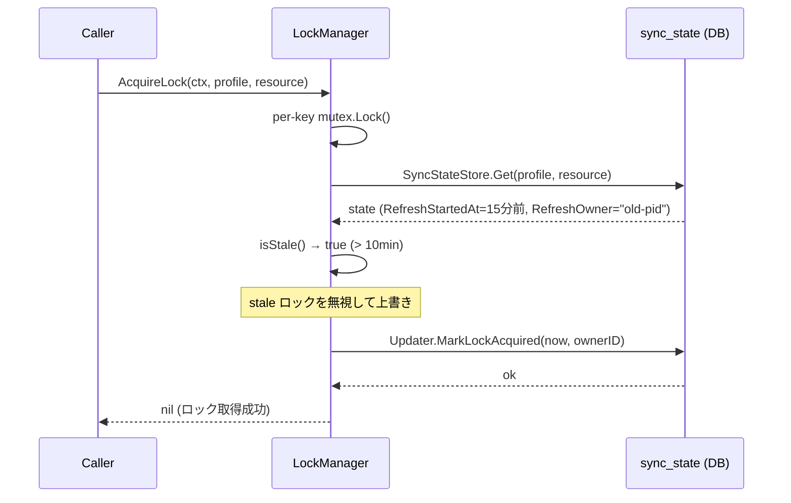
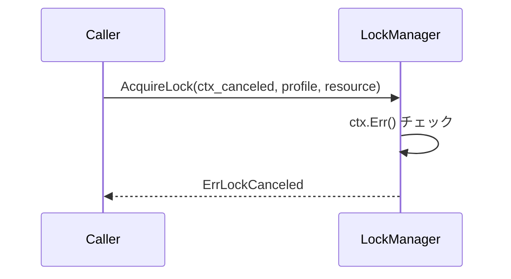

# M15: ロック + 多重実行制御

## 概要

`internal/refresh/` パッケージに `LockManager` を追加し、profile×resource 単位の多重実行を防ぐ。
in-process mutex（Go 標準 `sync.Mutex`）と DB ロック（`sync_state` の `refresh_started_at` / `refresh_owner`）の2層構造で実現する。

---

## スコープ

| 対象 | 内容 |
|------|------|
| `internal/refresh/lock.go` | `LockManager` 型、`AcquireLock`、`ReleaseLock`、`WithLock`、stale 判定 |
| `internal/refresh/lock_test.go` | TDD テスト（正常系・異常系・stale・並行処理） |
| `internal/refresh/updater.go` | `MarkLockAcquired`、`MarkLockReleased` メソッドを追加 |

スコープ外:
- 複数ノード間の分散ロック（スペック §19.1 で明示除外）
- `Refresher` / `DeltaRefresh` / `ForceRefresh` の変更（呼び出し側の責務）

---

## 設計

### LockManager 構造体

```go
// internal/refresh/lock.go

package refresh

import (
    "context"
    "fmt"
    "sync"
    "time"

    "github.com/youyo/board/internal/cache"
)

const staleLockTimeout = 10 * time.Minute

// lockKey は profile+resource の組み合わせを表すマップキー。
type lockKey struct {
    Profile  string
    Resource string
}

// LockManager は profile×resource 単位の in-process mutex と
// DB ロック（sync_state）を管理する。
type LockManager struct {
    mu        sync.Mutex                  // マップ自体の保護
    locks     map[lockKey]*sync.Mutex     // per-(profile,resource) mutex
    syncStore *cache.SyncStateStore
    ownerID   string                      // このプロセスの識別子（hostname+PID）
    now       func() time.Time            // テスト差し込み可能な時計
}

// NewLockManager は LockManager を生成する。
// ownerID は空文字の場合、hostname+PID から自動生成する。
func NewLockManager(ss *cache.SyncStateStore, ownerID string) *LockManager

// AcquireLock はロックを取得する。
// 1. in-process mutex を Lock（同一プロセス内の直列化）
// 2. DB の refresh_started_at を読み stale 判定
// 3. DB に refresh_started_at=now, refresh_owner=ownerID を書く
// ctx がキャンセルされた場合は ErrLockCanceled を返す。
func (m *LockManager) AcquireLock(ctx context.Context, profile, resource string) error

// ReleaseLock はロックを解放する。
// 1. DB の refresh_started_at, refresh_owner を NULL に戻す
// 2. in-process mutex を Unlock
func (m *LockManager) ReleaseLock(ctx context.Context, profile, resource string) error

// WithLock はロック取得 → fn 実行 → ロック解放 を保証するヘルパー。
// fn が panic した場合でも defer で ReleaseLock を呼ぶ。
func (m *LockManager) WithLock(ctx context.Context, profile, resource string, fn func() error) error
```

### stale 判定ロジック

```
isStale(state) = state.RefreshStartedAt.Valid &&
                 now - parse(state.RefreshStartedAt) > staleLockTimeout
```

stale 判定が true の場合、AcquireLock は既存のロック状態を無視して上書きする。

### DB 更新メソッド（Updater 拡張）

```go
// MarkLockAcquired は refresh_started_at と refresh_owner を設定する。
func (u *Updater) MarkLockAcquired(ctx context.Context, profile, resource, ownerID string, now time.Time) error

// MarkLockReleased は refresh_started_at と refresh_owner を NULL に戻す。
func (u *Updater) MarkLockReleased(ctx context.Context, profile, resource string) error
```

### エラー型

```go
var (
    // ErrLockBusy は in-process mutex が取得できない場合に返す（将来の非ブロッキング対応用）
    ErrLockBusy    = errors.New("refresh lock is busy")
    // ErrLockCanceled は ctx がキャンセルされた場合に返す
    ErrLockCanceled = errors.New("lock acquisition canceled")
)
```

---

## シーケンス図

### 正常系: ロック取得 → refresh → ロック解放



### stale ロック検出: 10分以上前の refresh_started_at を上書き



### エラー系: ctx キャンセル



---

## TDD設計

### テストファイル: `internal/refresh/lock_test.go`

#### 正常系テスト

| テスト名 | 前提条件 | 検証内容 |
|---------|---------|---------|
| `TestLockManager_AcquireLock_Success` | DB に sync_state なし | AcquireLock が nil を返す / DB に refresh_started_at が設定される |
| `TestLockManager_ReleaseLock_ClearsDB` | AcquireLock 後 | ReleaseLock 後 DB の refresh_started_at / refresh_owner が NULL になる |
| `TestLockManager_WithLock_FnCalled` | 正常状態 | fn が呼ばれ、戻り値が fn の戻り値と等しい |
| `TestLockManager_WithLock_ReleasedOnFnError` | fn がエラー返却 | fn のエラーが WithLock から返る / DB ロックが解放される |
| `TestLockManager_WithLock_ReleasedOnFnSuccess` | fn が nil 返却 | DB の refresh_started_at が NULL になっている |

#### stale ロックテスト

| テスト名 | 前提条件 | 検証内容 |
|---------|---------|---------|
| `TestLockManager_AcquireLock_StaleDetection_Overrides` | DB に 11分前の refresh_started_at | AcquireLock が成功し、refresh_started_at が新しい時刻に上書きされる |
| `TestLockManager_AcquireLock_FreshLockBlocks` | 別 goroutine が mutex を保持中（同一プロセス） | 呼び出しはブロックされる（シリアル実行される） |
| `TestLockManager_isStale_BelowThreshold` | refresh_started_at = 9分前 | isStale() = false |
| `TestLockManager_isStale_AboveThreshold` | refresh_started_at = 11分前 | isStale() = true |
| `TestLockManager_isStale_NoStartedAt` | RefreshStartedAt = NULL | isStale() = false |

#### 並行処理テスト

| テスト名 | 前提条件 | 検証内容 |
|---------|---------|---------|
| `TestLockManager_WithLock_Sequential_SameKey` | 2 goroutine が同一 profile+resource で WithLock | fn が逐次実行される（同時実行なし） |
| `TestLockManager_WithLock_Parallel_DifferentKeys` | 2 goroutine が別 profile+resource で WithLock | fn が並行実行される（互いにブロックしない） |

#### Updater 拡張テスト

| テスト名 | 検証内容 |
|---------|---------|
| `TestUpdater_MarkLockAcquired_SetsFields` | refresh_started_at = now(RFC3339), refresh_owner = ownerID |
| `TestUpdater_MarkLockAcquired_NewRecord` | sync_state が存在しなくても upsert が成功する |
| `TestUpdater_MarkLockReleased_ClearsFields` | refresh_started_at, refresh_owner が NULL になる |
| `TestUpdater_MarkLockReleased_NoRecord` | sync_state が存在しなくてもエラーなし |

---

## TDD実装ステップ

### Step 1: Red - Updater 拡張テストを書く

`internal/refresh/lock_test.go` に `TestUpdater_MarkLockAcquired_*` / `TestUpdater_MarkLockReleased_*` を追加。
この時点でコンパイルエラーになる（メソッド未定義）。

### Step 2: Green - Updater にメソッドを追加

`internal/refresh/updater.go` に `MarkLockAcquired` / `MarkLockReleased` を実装。
テストが通ることを確認。

### Step 3: Red - LockManager テストを書く

`TestLockManager_AcquireLock_*` / `TestLockManager_ReleaseLock_*` / `TestLockManager_WithLock_*` を追加。
コンパイルエラー（`LockManager` 未定義）。

### Step 4: Green - LockManager 基本実装

`internal/refresh/lock.go` を新規作成し、`LockManager`、`AcquireLock`、`ReleaseLock`、`WithLock` を実装。
正常系テストが通ることを確認。

### Step 5: Red - stale テストを書く

`TestLockManager_isStale_*` と `TestLockManager_AcquireLock_StaleDetection_Overrides` を追加。

### Step 6: Green - stale 判定の実装

`isStale()` を `AcquireLock` に組み込む。stale テストが通ることを確認。

### Step 7: Red - 並行処理テストを書く

`TestLockManager_WithLock_Sequential_SameKey` / `TestLockManager_WithLock_Parallel_DifferentKeys` を追加。

### Step 8: Green + Refactor - 並行テストが通ることを確認、整理

per-key mutex マップのロック管理（double-checked locking パターン）を整理。

### Step 9: 全テスト実行

```bash
mise run test
```

全テストが green であることを確認。

---

## 実装詳細

### per-key mutex の管理

```
AcquireLock(profile, resource):
    key := lockKey{profile, resource}

    m.mu.Lock()
    if _, ok := m.locks[key]; \!ok {
        m.locks[key] = &sync.Mutex{}
    }
    keyMu := m.locks[key]
    m.mu.Unlock()

    keyMu.Lock()  // ここで同一 key の並行実行をブロック

    // ctx キャンセルチェック
    if ctx.Err() \!= nil {
        keyMu.Unlock()
        return ErrLockCanceled
    }

    // DB stale チェック + 書き込み
    state, _ := m.syncStore.Get(ctx, profile, resource)
    if state \!= nil && state.RefreshStartedAt.Valid && \!m.isStale(state) {
        // 非stale のロックが DB にある（別プロセスからの記録）
        // MVP では in-process mutex が主制御なので処理を続行する
    }
    m.updater.MarkLockAcquired(ctx, profile, resource, m.ownerID, m.now())
    return nil
```

**注意**: in-process mutex が主制御であるため、同一プロセス内では keyMu.Lock() が実質的な排他制御となる。DB の `refresh_started_at` は観測・復旧用途（スペック §19.1）。

### ownerID の自動生成

```go
import (
    "fmt"
    "os"
)

func defaultOwnerID() string {
    hostname, _ := os.Hostname()
    return fmt.Sprintf("%s:%d", hostname, os.Getpid())
}
```

### WithLock の実装

```go
func (m *LockManager) WithLock(ctx context.Context, profile, resource string, fn func() error) error {
    if err := m.AcquireLock(ctx, profile, resource); err \!= nil {
        return err
    }
    defer func() {
        _ = m.ReleaseLock(context.Background(), profile, resource)
        // ReleaseLock は ctx キャンセル後も確実に実行するため Background() を使用
    }()
    return fn()
}
```

---

## ファイル一覧

| ファイル | 変更種別 | 内容 |
|---------|---------|------|
| `internal/refresh/lock.go` | 新規作成 | `LockManager`、`AcquireLock`、`ReleaseLock`、`WithLock`、`isStale`、エラー定義 |
| `internal/refresh/lock_test.go` | 新規作成 | LockManager テスト（正常系・stale・並行） |
| `internal/refresh/updater.go` | 追記 | `MarkLockAcquired`、`MarkLockReleased` |

---

## リスク評価

| リスク | 影響度 | 発生確率 | 対策 |
|--------|--------|---------|------|
| stale タイムアウト値の過短 | 中（誤 stale 判定）| 低 | 10分は refresh の最大所要時間（API レート制限 3000/日を考慮）に対して十分な余裕があることをテストで確認 |
| ReleaseLock が ctx キャンセル後に失敗 | 高（mutex リーク）| 低 | WithLock の defer で `context.Background()` を使用して確実に解放 |
| per-key mutex マップの unbounded growth | 低（CLI は短命）| 低 | CLI は短命プロセスのためメモリ問題は実用上ない。MCP サーバーは22 resource × profile 数のみ |
| panic 時のロック解放漏れ | 高（goroutine hang）| 低 | `defer ReleaseLock` で対応。panic は Go ランタイムが defer を実行するため安全 |
| DB 書き込み失敗時の in-process mutex 漏れ | 高（次回実行不能）| 低 | AcquireLock での DB 失敗時は keyMu.Unlock() を呼び、エラーを返す |

---

## 成功基準

- `mise run test` が全 green
- `TestLockManager_WithLock_Sequential_SameKey`: 2 goroutine が fn を重複実行しないことをカウンタで検証
- `TestLockManager_WithLock_Parallel_DifferentKeys`: 2 goroutine が並行実行できることを time 計測で検証
- `TestLockManager_AcquireLock_StaleDetection_Overrides`: 11分前の refresh_started_at が上書きされる
- `mise run vet` が警告なし

---

## 前提・依存

- `internal/cache/sync_state.go`: `SyncState.RefreshStartedAt`、`SyncState.RefreshOwner` フィールドが存在する（M12 実装済み）
- `internal/refresh/updater.go`: `getOrInit`、`nullString` ヘルパーが利用可能（M14 実装済み）
- `internal/cache/db.go`: `:memory:` インメモリ DB でテスト実行可能（既存）
