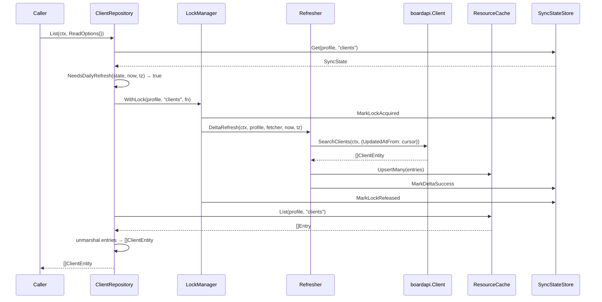
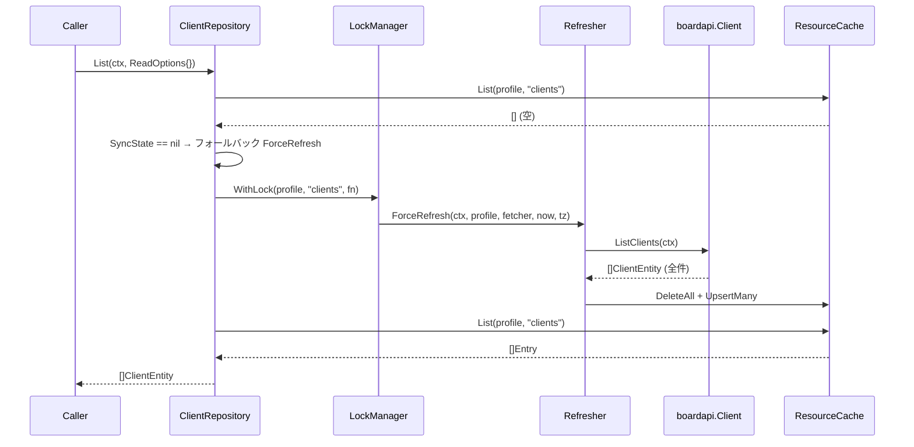
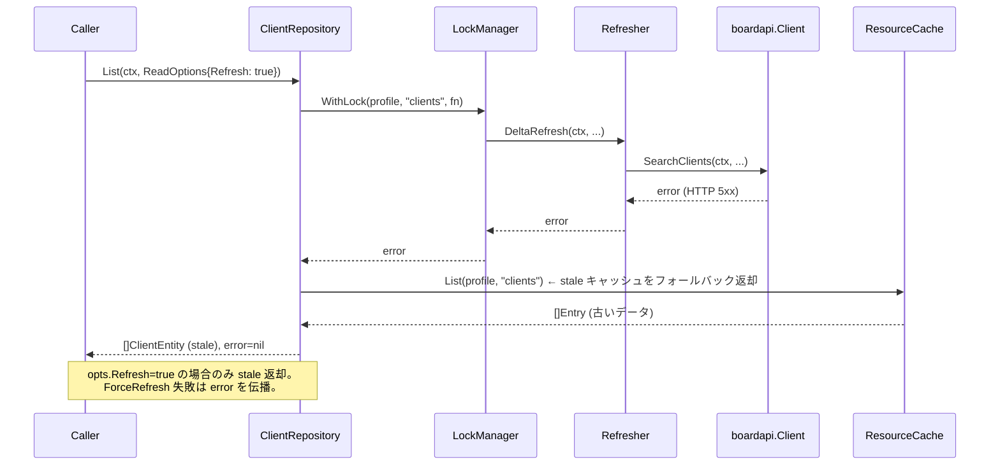

# マイルストーン M16: repository - コアエンティティ

## 概要

`internal/repository` パッケージにコアエンティティ5種（clients, client_branches, contacts, projects, project_costs）のリポジトリ実装を行う。  
アーキテクチャ上の「cache → refresh → API fallback」フローを ReadOptions で制御し、TDD（Red → Green → Refactor）で開発する。

---

## スコープ

### 実装ファイル

| ファイル | 内容 |
|----------|------|
| `internal/repository/options.go` | ReadOptions 定義（共通型） |
| `internal/repository/fetcher.go` | Fetcher アダプタ共通ヘルパー |
| `internal/repository/clients.go` | ClientRepository（List / GetByID / Search） |
| `internal/repository/client_branches.go` | ClientBranchRepository |
| `internal/repository/contacts.go` | ContactRepository |
| `internal/repository/projects.go` | ProjectRepository |
| `internal/repository/project_costs.go` | ProjectCostRepository |
| `internal/repository/clients_test.go` | T_R01〜T_R15（SQLite temp DB） |
| `internal/repository/client_branches_test.go` | T_R16〜T_R28 |
| `internal/repository/contacts_test.go` | T_R29〜T_R41 |
| `internal/repository/projects_test.go` | T_R42〜T_R54 |
| `internal/repository/project_costs_test.go` | T_R55〜T_R67 |

### スコープ外

- M17 対象: estimates, invoices, orders, deliveries, receipts, vendors, vendor_branches, vendor_contacts, purchase_orders, payments
- M18 対象: users, groups, payment_terms, project_types 等マスタ系
- service 層（M19〜）

---

## 前提・ハンドオフ

| パッケージ | 提供するもの |
|-----------|-------------|
| `internal/boardapi` | ClientEntity / ListClients / GetClient / SearchClients 等（全22リソース） |
| `internal/cache` | ResourceCache（List/Get/Upsert/Delete）, SyncStateStore, Entry, EntityKey |
| `internal/refresh` | Refresher（DeltaRefresh/ForceRefresh）, NeedsDailyRefresh, LockManager, Fetcher interface |
| `internal/config` | ProfileConfig.DailyAutoRefresh, Timezone 情報（JST 想定） |

---

## 型設計

### ReadOptions（`options.go`）

```go
// ReadOptions はリポジトリ読み取り時の動作を制御するオプション。
type ReadOptions struct {
    // Refresh が true の場合、差分リフレッシュ（DeltaRefresh）を実行する。
    Refresh bool
    // ForceRefresh が true の場合、全件リフレッシュ（ForceRefresh）を実行する。
    // Refresh より優先される。
    ForceRefresh bool
    // Limit は返却するエントリの最大件数。0 は無制限。
    Limit int
}
```

### Fetcher アダプタ（`fetcher.go`）

`refresh.Fetcher` インターフェースは `ResourceName() string`, `ListAll(ctx) ([]json.RawMessage, error)`, `ListUpdatedSince(ctx, since string) ([]json.RawMessage, error)` を要求する。  
boardapi の各メソッドを変換するジェネリクス不使用の具体型でアダプタを実装する。

```go
// clientsFetcher は boardapi.Client を refresh.Fetcher に適合させるアダプタ。
type clientsFetcher struct {
    api *boardapi.Client
}

func (f *clientsFetcher) ResourceName() string { return "clients" }

func (f *clientsFetcher) ListAll(ctx context.Context) ([]json.RawMessage, error) {
    entities, err := f.api.ListClients(ctx)
    if err \!= nil {
        return nil, err
    }
    return entitiesToRaw(entities)
}

func (f *clientsFetcher) ListUpdatedSince(ctx context.Context, since string) ([]json.RawMessage, error) {
    params := boardapi.ClientSearchParams{UpdatedAtFrom: since}
    entities, err := f.api.SearchClients(ctx, params)
    if err \!= nil {
        return nil, err
    }
    return entitiesToRaw(entities)
}
```

共通ヘルパー `entitiesToRaw[T any](entities []T) ([]json.RawMessage, error)` は `fetcher.go` に定義するが、Go 1.18+ ジェネリクスを使用する（Go 1.26 対応済み）。

### ClientRepository（`clients.go`）

```go
type ClientRepository struct {
    profile     string
    api         *boardapi.Client
    cache       *cache.ResourceCache
    syncStore   *cache.SyncStateStore
    refresher   *refresh.Refresher
    lockManager *refresh.LockManager
    tz          *time.Location
    autoRefresh bool  // ProfileConfig.DailyAutoRefresh
}

func NewClientRepository(
    profile string,
    api *boardapi.Client,
    rc *cache.ResourceCache,
    ss *cache.SyncStateStore,
    refresher *refresh.Refresher,
    lm *refresh.LockManager,
    tz *time.Location,
    autoRefresh bool,
) *ClientRepository

func (r *ClientRepository) List(ctx context.Context, opts ReadOptions) ([]boardapi.ClientEntity, error)
func (r *ClientRepository) GetByID(ctx context.Context, id int, opts ReadOptions) (*boardapi.ClientEntity, error)
func (r *ClientRepository) Search(ctx context.Context, params boardapi.ClientSearchParams, opts ReadOptions) ([]boardapi.ClientEntity, error)
```

他4リポジトリも同パターン（構造体名・エンティティ型・SearchParams 型のみ異なる）。

---

## リクエストフロー

### List / Search フロー

```
List(ctx, opts)
  │
  ├─ opts.ForceRefresh=true → WithLock → ForceRefresh(fetcher) → cache.List
  ├─ opts.Refresh=true      → WithLock → DeltaRefresh(fetcher) → cache.List
  ├─ autoRefresh=true かつ NeedsDailyRefresh → WithLock → DeltaRefresh(fetcher) → cache.List
  └─ そのまま → cache.List
       └─ キャッシュ空かつ未リフレッシュ → WithLock → ForceRefresh → cache.List（フォールバック）
```

キャッシュが空でかつ一度もリフレッシュされていない場合（SyncState が nil）は、暗黙的に ForceRefresh を実行する（初回起動時の透明フォールバック）。

### GetByID フロー

```
GetByID(ctx, id, opts)
  │
  ├─ (Refresh/ForceRefresh/autoRefresh は List と同じロジックで先行リフレッシュ)
  └─ cache.Get(EntityKey{profile, resource, strconv.Itoa(id)})
       └─ キャッシュミス → API 直接取得（api.GetClient）→ cache.Upsert → 返却
```

GetByID のキャッシュミス時は ForceRefresh ではなく API.Get の単体呼び出しとする（リスト全体の再取得は重すぎる）。

---

## シーケンス図（Mermaid）

### 正常系: List（autoRefresh + キャッシュあり）



### 正常系: List（初回、キャッシュなし）



### エラー系: API 障害時



**注**: opts.Refresh（DeltaRefresh）エラー時はキャッシュの stale データを返す（degraded mode）。  
opts.ForceRefresh エラー時はエラーを呼び出し元へ伝播する（全件削除後に失敗するリスクが高い）。

---

## TDD 設計

### テスト方針

- SQLite のメモリ DB（`file::memory:?cache=shared`）を使用
- `boardapi.Client` は `httptest.Server` でモック（実際の HTTP サーバーを立てる）
- `Refresher` および `LockManager` は実物を使用（内部パッケージ密結合を避ける）
- テスト毎に独立した DB インスタンスを使う（`t.TempDir()` + ファイル DB またはメモリ DB）

### ClientRepository テストケース（T_R01〜T_R15）

| ID | メソッド | シナリオ | 期待結果 |
|----|----------|----------|----------|
| T_R01 | List | キャッシュあり、autoRefresh=false | キャッシュのデータを返す |
| T_R02 | List | キャッシュなし（初回）、autoRefresh=false | ForceRefresh 後データを返す |
| T_R03 | List | autoRefresh=true、NeedsDailyRefresh=true | DeltaRefresh 後データを返す |
| T_R04 | List | opts.ForceRefresh=true | ForceRefresh 後データを返す |
| T_R05 | List | opts.Refresh=true | DeltaRefresh 後データを返す |
| T_R06 | List | opts.Limit=2、キャッシュに3件 | 2件のみ返す |
| T_R07 | List | opts.Refresh=true、API エラー | stale キャッシュを返す（エラーなし） |
| T_R08 | GetByID | キャッシュヒット | キャッシュから返す |
| T_R09 | GetByID | キャッシュミス、API 成功 | API 取得後 upsert して返す |
| T_R10 | GetByID | キャッシュミス、API エラー | error を返す |
| T_R11 | Search | キャッシュあり、パラメータなし | 全件返す |
| T_R12 | Search | Name フィルタ | 一致するものを返す |
| T_R13 | Search | opts.ForceRefresh=true | ForceRefresh 後にフィルタ |
| T_R14 | List | Limit=0（無制限） | 全件返す |
| T_R15 | List | コンテキストキャンセル | context.Canceled を返す |

各エンティティ（ClientBranch / Contact / Project / ProjectCost）も同パターンで T_R16〜T_R67 を設計（エンティティ固有の SearchParams を使用）。

### ClientBranchRepository（T_R16〜T_R28）

ClientBranchSearchParams: `ClientID int, Name string`  
追加ケース:
- T_R23: Search で ClientID フィルタ
- T_R24: Search で Name フィルタ

### ContactRepository（T_R29〜T_R41）

ContactSearchParams: `ClientID int, Name string, Email string`  
追加ケース:
- T_R36: Search で Email フィルタ

### ProjectRepository（T_R42〜T_R54）

ProjectSearchParams: `ClientID int, Name string, Status string, UpdatedAtFrom string`  
追加ケース:
- T_R49: Search で Status フィルタ（"active"）
- T_R50: Search で UpdatedAtFrom フィルタ

### ProjectCostRepository（T_R55〜T_R67）

ProjectCostSearchParams: `ProjectID int`  
追加ケース:
- T_R62: Search で ProjectID フィルタ

---

## Search の実装方針

`Search` はリフレッシュ後にキャッシュから全件取得し、Go 側でインメモリフィルタリングを行う。BOARD API の Search エンドポイントは差分取得（ListUpdatedSince）にのみ使用し、Search 結果のキャッシュフィルタは repository 層が担当する。

```go
func (r *ClientRepository) Search(ctx context.Context, params boardapi.ClientSearchParams, opts ReadOptions) ([]boardapi.ClientEntity, error) {
    all, err := r.List(ctx, opts)
    if err \!= nil {
        return nil, err
    }
    return filterClients(all, params), nil
}

func filterClients(entities []boardapi.ClientEntity, params boardapi.ClientSearchParams) []boardapi.ClientEntity {
    var result []boardapi.ClientEntity
    for _, e := range entities {
        if params.Name \!= "" && \!strings.Contains(e.Name, params.Name) {
            continue
        }
        result = append(result, e)
    }
    return result
}
```

`UpdatedAtFrom` は差分取得カーソルとして Fetcher.ListUpdatedSince に渡すため、Search フィルタには含めない（API 側で絞り込み済み）。

---

## アプローチ比較と評価

### キャッシュミス時の GetByID 戦略

| 評価軸 | A: ForceRefresh（全件再取得） | B: API.Get 単体呼び出し | C: エラー返却 |
|--------|---------------------------|----------------------|-------------|
| API コール数 | 多い（全件） | 少ない（1件） | 0 |
| レイテンシ | 高 | 低 | 最低 |
| キャッシュ更新 | 全件更新 | 1件のみ更新 | 更新なし |
| UX | 透明だが遅い | 速く透明 | ユーザーが手動 refresh 必要 |

**推奨: B（API.Get 単体呼び出し）** — GetByID はピンポイントアクセスが多いため、全件再取得は過剰。1件取得後にキャッシュ upsert することで以後の参照はキャッシュから返せる。

### DeltaRefresh エラー時の Fallback 戦略

| 評価軸 | A: stale キャッシュ返却 | B: エラー伝播 | C: ForceRefresh 再試行 |
|--------|----------------------|------------|---------------------|
| 可用性 | 高（古いデータだが応答） | 低（エラー） | 中（再試行コスト大） |
| 整合性 | 低（stale） | 高（エラーで明示） | 高 |
| 実装複雑度 | 低 | 低 | 中 |

**推奨: opts.Refresh のみ A、opts.ForceRefresh は B** — Refresh（差分）は可用性優先、ForceRefresh（全件）は整合性重視とする。

---

## 実装ステップ（TDD 順序）

### Step 1: ReadOptions と共通インフラ（Red → Green）

1. `internal/repository/options.go` — ReadOptions 定義
2. `internal/repository/fetcher.go` — `entitiesToRaw[T any]` ジェネリクスヘルパー + 各 Fetcher 型

### Step 2: ClientRepository（Red → Green → Refactor）

1. `internal/repository/clients_test.go` — T_R01〜T_R15 を書く（全 Red）
2. `internal/repository/clients.go` — List / GetByID / Search を実装（Green）
3. リファクタ: フロー制御を `maybeRefresh` ヘルパーに抽出

### Step 3: ClientBranchRepository（同パターン）

1. `client_branches_test.go` — T_R16〜T_R28
2. `client_branches.go` — 実装

### Step 4: ContactRepository

1. `contacts_test.go` — T_R29〜T_R41
2. `contacts.go` — 実装

### Step 5: ProjectRepository

1. `projects_test.go` — T_R42〜T_R54
2. `projects.go` — 実装

### Step 6: ProjectCostRepository

1. `project_costs_test.go` — T_R55〜T_R67
2. `project_costs.go` — 実装

### Step 7: 全体リファクタリング

- 共通フロー（maybeRefresh, decodeEntries）を `internal.go` または `fetcher.go` に集約
- `mise run test` で全 Green を確認
- `mise run vet` / `mise run fmt` を通す

---

## 共通内部ヘルパー設計

### maybeRefresh（共有ロジック）

```go
// maybeRefresh はリフレッシュ要否を判定し、必要なら実行する。
// ForceRefresh が true なら ForceRefresh を優先。
// Refresh が true または autoRefresh かつ NeedsDailyRefresh なら DeltaRefresh。
func maybeRefresh(
    ctx context.Context,
    profile, resource string,
    opts ReadOptions,
    state *cache.SyncState,
    autoRefresh bool,
    tz *time.Location,
    lm *refresh.LockManager,
    refresher *refresh.Refresher,
    fetcher refresh.Fetcher,
    now time.Time,
) error {
    switch {
    case opts.ForceRefresh:
        return lm.WithLock(ctx, profile, resource, func() error {
            _, err := refresher.ForceRefresh(ctx, profile, fetcher, now, tz)
            return err
        })
    case opts.Refresh || (autoRefresh && refresh.NeedsDailyRefresh(state, now, tz)):
        err := lm.WithLock(ctx, profile, resource, func() error {
            _, err := refresher.DeltaRefresh(ctx, profile, fetcher, now, tz)
            return err
        })
        if opts.Refresh && err \!= nil {
            // DeltaRefresh 失敗は stale 返却（ログのみ）
            // ForceRefresh 失敗はエラー伝播（上の case で処理済み）
            return nil // stale fallback
        }
        return err
    }
    return nil
}
```

### decodeEntries（型変換ヘルパー）

```go
// decodeEntries は []cache.Entry を []T に変換する。
func decodeEntries[T any](entries []cache.Entry) ([]T, error) {
    result := make([]T, 0, len(entries))
    for _, e := range entries {
        var entity T
        if err := json.Unmarshal(e.PayloadJSON, &entity); err \!= nil {
            return nil, err
        }
        result = append(result, entity)
    }
    return result, nil
}
```

---

## ファイル構成（完成形）

```
internal/repository/
├── options.go           # ReadOptions
├── fetcher.go           # Fetcher アダプタ共通 + entitiesToRaw + decodeEntries + maybeRefresh
├── clients.go           # ClientRepository
├── client_branches.go   # ClientBranchRepository
├── contacts.go          # ContactRepository
├── projects.go          # ProjectRepository
├── project_costs.go     # ProjectCostRepository
├── clients_test.go      # T_R01〜T_R15
├── client_branches_test.go  # T_R16〜T_R28
├── contacts_test.go     # T_R29〜T_R41
├── projects_test.go     # T_R42〜T_R54
└── project_costs_test.go    # T_R55〜T_R67
```

---

## リスク評価

| リスク | 影響度 | 発生確率 | 対策 |
|--------|--------|----------|------|
| ジェネリクスの型制約（Go 1.18+）が期待どおり動作しない | 中 | 低 | Go 1.26 対応済み、PoC で事前確認 |
| LockManager の in-process mutex がテスト並列実行で競合 | 高 | 中 | `t.Parallel()` を使わず逐次実行、または独立 ownerID を使用 |
| SQLite メモリ DB の `cache=shared` で複数テスト間干渉 | 高 | 中 | `t.TempDir()` + ファイル DB でテスト間分離を保証 |
| DeltaRefresh の stale fallback がサイレントにバグを隠す | 中 | 低 | ログ出力（`log/slog`）でエラーを記録する |
| ProjectCost の updated_at が空（API 仕様上 NULL 可） | 低 | 中 | `extractUpdatedAt` は空文字を許容済み（refresh 層で対処済み） |
| maybeRefresh の SyncState 取得タイミング（TOCTOU） | 低 | 低 | LockManager が in-process で直列化するため実害なし |

---

## 依存パッケージ（追加不要）

M16 では外部 Go モジュールの追加は不要。使用するのは既存の:
- `github.com/youyo/board/internal/boardapi`
- `github.com/youyo/board/internal/cache`
- `github.com/youyo/board/internal/refresh`
- `encoding/json`, `context`, `strconv`, `strings`, `time`（標準ライブラリ）

---

## 完了条件

- [ ] `internal/repository/` 配下の全ファイルが存在する
- [ ] `mise run test ./internal/repository/...` で T_R01〜T_R67 全 Green
- [ ] `mise run vet` / `mise run fmt` がクリーン
- [ ] `mise run build` でバイナリがビルドできる
- [ ] 各 Repository の List / GetByID / Search が正しい型を返す
- [ ] ForceRefresh / DeltaRefresh / autoRefresh / Limit の各動作がテストで検証済み

