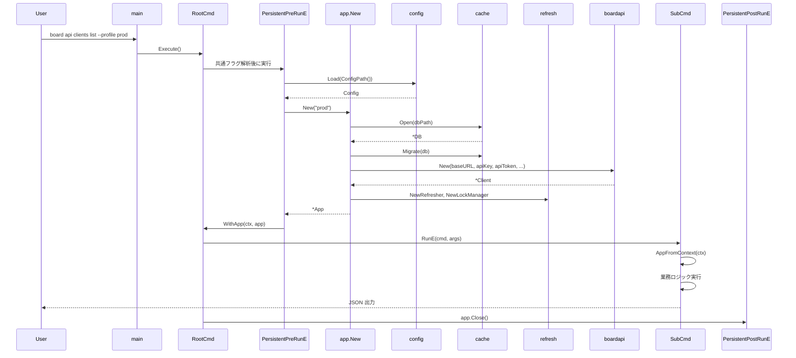
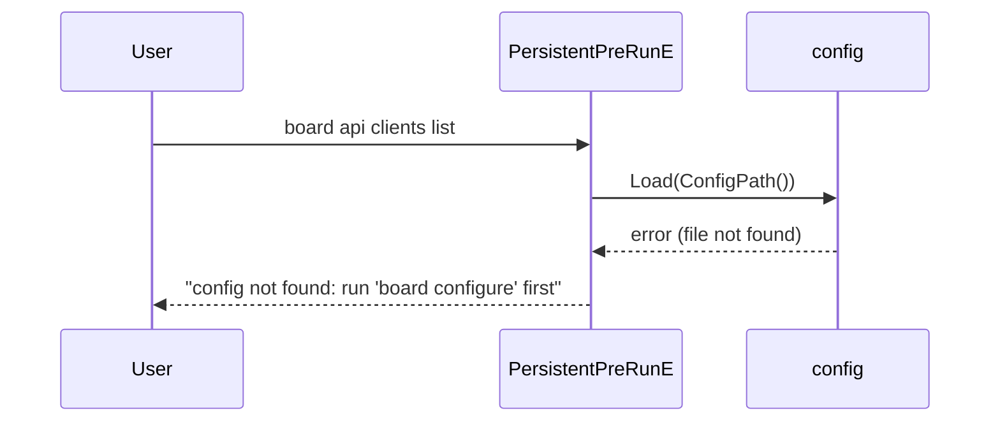
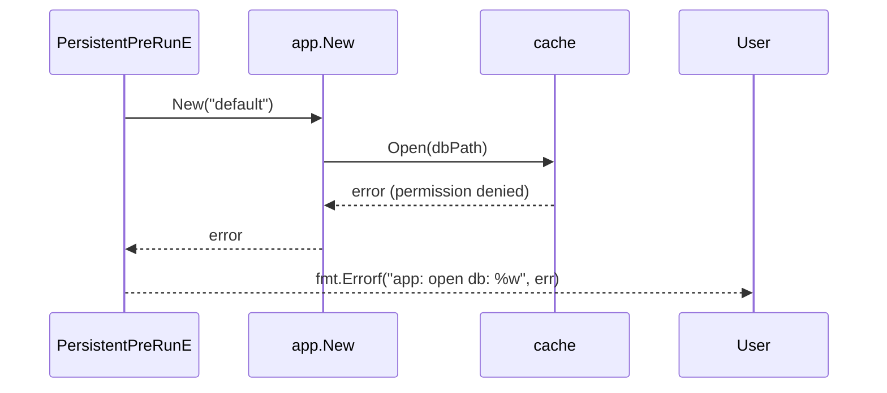

# M19: app パッケージ + CLI 基盤

## 概要

`internal/app` パッケージ（DI コンテナ）を新規作成し、`internal/cli/root.go` を拡張して
共通フラグ（`--profile`, `--refresh`, `--force-refresh`, `--pretty`, `--limit`）を追加する。
全22リソースのリポジトリを app 経由で組み立て、Cobra Command の Context に格納する。

## 前提（ハンドオフ状態）

| パッケージ | 提供する型・関数 |
|-----------|----------------|
| `internal/config` | `Config`, `ProfileConfig`, `Load()`, `Save()`, `ConfigPath()`, `GetCurrentProfile()`, `ApplyDefaults()` |
| `internal/boardapi` | `Client`, `New(baseURL, apiKey, apiToken string, timeout, opts...)` |
| `internal/cache` | `DB`, `Open()`, `Migrate()`, `ResourceCache`, `SyncStateStore`, `CacheMetaStore` |
| `internal/refresh` | `Refresher`, `NewRefresher()`, `LockManager`, `NewLockManager()` |
| `internal/repository` | 全22リソースの `*XxxRepository`（`List/GetByID/Search`） |

## スコープ

### 新規作成ファイル

```
internal/app/
  app.go          — App 構造体定義、New()、Close()
  container.go    — 全22リソースの Repository フィールドと初期化ロジック
  runtime.go      — Cobra Context キー定義、AppFromContext()
internal/cli/
  root.go         — (新規) Cobra root command + 共通フラグ + PersistentPreRunE
```

### 変更ファイル

```
cmd/board/main.go  — root.go の NewRootCmd() を使うように変更
```

### スコープ外

- service パッケージ（M21 以降）
- output パッケージ（M20）
- api/find/mcp/cache サブコマンド（M21 以降）

---

## アーキテクチャ設計

### App 構造体

```go
// internal/app/app.go
package app

type App struct {
    Config  config.Config
    Profile config.ProfileConfig
    DB      *cache.DB

    // cache ストア
    ResourceCache *cache.ResourceCache
    SyncStore     *cache.SyncStateStore

    // refresh エンジン
    Refresher   *refresh.Refresher
    LockManager *refresh.LockManager

    // boardapi クライアント
    APIClient *boardapi.Client

    // 全22リソース Repository（container.go で保持）
    Repos *Repositories
}
```

### Repositories コンテナ

```go
// internal/app/container.go
package app

type Repositories struct {
    Clients              *repository.ClientRepository
    ClientBranches       *repository.ClientBranchRepository
    Contacts             *repository.ContactRepository
    Projects             *repository.ProjectRepository
    ProjectCosts         *repository.ProjectCostRepository
    Estimates            *repository.EstimateRepository
    Invoices             *repository.InvoiceRepository
    Orders               *repository.OrderRepository
    Deliveries           *repository.DeliveryRepository
    Receipts             *repository.ReceiptRepository
    Vendors              *repository.VendorRepository
    VendorBranches       *repository.VendorBranchRepository
    VendorContacts       *repository.VendorContactRepository
    PurchaseOrders       *repository.PurchaseOrderRepository
    Payments             *repository.PaymentRepository
    Users                *repository.UserRepository
    Groups               *repository.GroupRepository
    PaymentTerms         *repository.PaymentTermRepository
    ProjectTypes         *repository.ProjectTypeRepository
    PurchaseTypes        *repository.PurchaseTypeRepository
    AccountingTypes      *repository.AccountingTypeRepository
    DocumentSendChannels *repository.DocumentSendChannelRepository
}
```

### New() 初期化フロー

```
New(profileName string) (*App, error)
  1. config.Load(config.ConfigPath())
  2. profileName が "" なら cfg.CurrentProfile を使用
  3. config.GetCurrentProfile(cfg) または cfg.Profiles[profileName]
  4. config.ApplyDefaults(prof)
  5. dbPath() でDBパスを決定（XDG準拠）
  6. cache.Open(dbPath)
  7. cache.Migrate(db)
  8. cache.NewResourceCache(db), cache.NewSyncStateStore(db)
  9. refresh.NewRefresher(rc, ss), refresh.NewLockManager(ss, "")
  10. tz, _ = time.LoadLocation(cfg.Timezone)（失敗時 time.UTC）
  11. boardapi.New(prof.BaseURL, prof.APIKey, prof.APIToken, timeout, WithRetryMax(prof.RetryMax))
  12. newRepositories(...) で全22リポジトリを初期化
  13. *App を返す
```

### DBパス解決（dbPath関数）

```go
// 優先順位:
// 1. BOARD_CACHE_PATH 環境変数
// 2. XDG_DATA_HOME/board/cache.db
// 3. HOME/.local/share/board/cache.db
// 4. os.UserCacheDir()/board/cache.db
// 5. $TMPDIR/board/cache.db（フォールバック）
func dbPath() string { ... }
```

### Context キー設計

```go
// internal/app/runtime.go
package app

type contextKey string

const appKey contextKey = "board_app"

// AppFromContext は Context から *App を取り出す。
// PersistentPreRunE で格納された値を各コマンドが参照する。
func AppFromContext(ctx context.Context) (*App, bool) { ... }

// WithApp は *App を Context に格納する（テストでも使用）。
func WithApp(ctx context.Context, a *App) context.Context { ... }
```

### root.go の設計

```go
// internal/cli/root.go
package cli

// globalFlags はルートコマンドで受け取る共通フラグ。
type globalFlags struct {
    profile      string
    refresh      bool
    forceRefresh bool
    pretty       bool
    limit        int
}

// NewRootCmd は board の root Cobra command を返す。
func NewRootCmd(version string) *cobra.Command { ... }
```

**PersistentPreRunE の責務:**
1. `--profile` フラグ（空なら config の current_profile）を解決
2. `app.New(profileName)` で App を初期化
3. `app.WithApp(cmd.Context(), a)` で Context に格納
4. configure コマンドでは App 初期化不要なため、`configure` コマンドは PersistentPreRunE をスキップする仕組みが必要

**PersistentPostRunE の責務:**
1. `app.Close()` で DB 接続を閉じる

**スキップ判定の実装方針:**
- configure コマンドは独自の `PersistentPreRunE` をオーバーライドして nil を返す
- または root の PersistentPreRunE 内でコマンド名チェックを行う（シンプル）

---

## シーケンス図

### 正常系フロー（board api clients list 想定）



### エラーケース: 設定ファイル不在



### エラーケース: DB open 失敗



---

## TDD 設計書

### テストファイル構成

```
internal/app/app_test.go        — New/Close の正常・異常系
internal/app/container_test.go  — Repositories フィールドの検証
internal/app/runtime_test.go    — WithApp / AppFromContext ラウンドトリップ
internal/cli/root_test.go       — root command フラグ解析、PersistentPreRunE
```

### app_test.go テスト設計

#### 正常系

| テスト名 | 入力 | 期待結果 |
|---------|------|---------|
| `TestNew_DefaultProfile` | profileName="" + 有効な config | App 非 nil、Repos 全フィールド非 nil |
| `TestNew_ExplicitProfile` | profileName="prod" + config に prod あり | App.Profile が prod の設定値 |
| `TestClose_CloseDB` | 正常初期化後 | Close() が nil エラー |

#### 異常系

| テスト名 | 入力 | 期待結果 |
|---------|------|---------|
| `TestNew_ConfigNotFound` | BOARD_CONFIG_PATH に存在しないパス | error ラップ |
| `TestNew_ProfileNotFound` | profileName="unknown" | error: "profile not found: unknown" |
| `TestNew_DBOpenFail` | BOARD_CACHE_PATH に書き込み不可パス | error ラップ |
| `TestNew_InvalidTimezone` | cfg.Timezone = "Invalid/Zone" | フォールバックで time.UTC 使用、error なし |

#### ヘルパー設計

```go
// app_test.go 内ヘルパー
func newTestApp(t *testing.T) *App {
    t.Helper()
    // 1. os.MkdirTemp で一時ディレクトリ作成
    // 2. BOARD_CONFIG_PATH に最小限の config.toml を書き込み
    // 3. BOARD_CACHE_PATH に :memory: を使えるよう dbPath() をテスト差し込み
    //    または BOARD_CACHE_PATH env var に tmpfile パスを設定
    // 4. app.New("") で初期化
    // 5. t.Cleanup(func() { app.Close() })
}
```

**注意**: DB は `:memory:` ではなく一時ファイルを使う（同一 DSN での複数接続が必要な場合のみ `:memory:` は file::memory:?cache=shared）。

### container_test.go テスト設計

| テスト名 | 検証内容 |
|---------|---------|
| `TestRepositories_AllNonNil` | Repos の全22フィールドが nil でない |
| `TestRepositories_ClientsType` | `Repos.Clients` が `*repository.ClientRepository` 型 |

### runtime_test.go テスト設計

| テスト名 | 検証内容 |
|---------|---------|
| `TestWithApp_RoundTrip` | WithApp → AppFromContext で同じポインタが返る |
| `TestAppFromContext_Missing` | App を格納していない Context → ok=false |

### root_test.go テスト設計

| テスト名 | 検証内容 |
|---------|---------|
| `TestNewRootCmd_HasVersionFlag` | --version フラグが存在する |
| `TestNewRootCmd_GlobalFlags` | --profile, --refresh, --force-refresh, --pretty, --limit が存在 |
| `TestNewRootCmd_Configure_SkipAppInit` | configure サブコマンド実行時に PersistentPreRunE が App 初期化しない |
| `TestNewRootCmd_LimitDefault` | --limit のデフォルト値が 50 |

---

## 実装ステップ（TDD サイクル）

### Step 1: runtime.go（依存なし・最初に実装）

1. **Red**: `TestWithApp_RoundTrip`, `TestAppFromContext_Missing` を書く
2. **Green**: contextKey 型、WithApp、AppFromContext を実装
3. **Refactor**: コメント追加

### Step 2: dbPath 関数（app.go の一部、環境変数テスト）

1. **Red**: `TestDBPath_EnvVar`, `TestDBPath_XDG`, `TestDBPath_Fallback` を書く
2. **Green**: dbPath() を実装（config.ConfigPath() と同パターン）
3. **Refactor**: 環境変数名を定数化

### Step 3: App 構造体と New/Close（インメモリ DB 使用）

1. **Red**: `TestNew_DefaultProfile`, `TestNew_ConfigNotFound`, `TestNew_ProfileNotFound`
2. **Green**: app.go + container.go を実装。newRepositories() ですべての New*Repository を呼ぶ
3. **Refactor**: エラーメッセージのラッピングを統一（`fmt.Errorf("app: %w", err)` パターン）

### Step 4: Repositories 検証

1. **Red**: `TestRepositories_AllNonNil`
2. **Green**: container.go の newRepositories() で全22フィールドを埋める
3. **Refactor**: 必要に応じてヘルパー関数に分割

### Step 5: root.go

1. **Red**: `TestNewRootCmd_GlobalFlags`, `TestNewRootCmd_Configure_SkipAppInit`
2. **Green**: root.go を実装、PersistentPreRunE で App 初期化、configure はスキップ
3. **Refactor**: PersistentPostRunE の cleanup 処理を整理

### Step 6: main.go 変更

1. `NewRootCmd(version)` を使うように変更
2. `cli.NewConfigureCmd()` を `root.AddCommand` で追加する箇所は root.go 内に移動

---

## ファイルレイアウト

```
internal/app/
  app.go           — App 構造体, New(), Close(), dbPath()
  app_test.go      — New/Close テスト
  container.go     — Repositories 構造体, newRepositories()
  container_test.go — Repositories 全フィールド検証
  runtime.go       — contextKey, WithApp(), AppFromContext()
  runtime_test.go  — ラウンドトリップテスト

internal/cli/
  root.go          — NewRootCmd(), globalFlags, PersistentPreRunE/PostRunE
  root_test.go     — フラグ・スキップ検証
  configure.go     — (既存・変更なし)
  ...              — (既存ファイル群・変更なし)

cmd/board/main.go  — cli.NewRootCmd(version) を使用するよう変更
```

---

## 共通フラグ仕様

| フラグ | 型 | デフォルト | 説明 |
|-------|-----|----------|------|
| `--profile` / `-p` | string | "" (current_profile) | 使用プロファイル |
| `--refresh` | bool | false | 差分リフレッシュ強制実行 |
| `--force-refresh` | bool | false | 全件リフレッシュ強制実行 |
| `--pretty` | bool | false | 整形表示（MCP では無効） |
| `--limit` | int | 50 | 返却件数上限（0 = 無制限） |

**格納先**: PersistentPreRunE で解析後、`globalFlags` 構造体に格納。
各サブコマンドは `AppFromContext` で App を取り出し、フラグ値は Cobra の `cmd.Flags().GetBool(...)` で参照する。

**ReadOptions への変換**: 各サブコマンドの RunE 内で `repository.ReadOptions{Refresh: refresh, ForceRefresh: forceRefresh, Limit: limit}` を構築して Repository に渡す。

---

## エラーメッセージ設計

| 状況 | エラーメッセージ |
|------|--------------|
| 設定ファイル不在 | `"app: load config: %w"` → ユーザー向け hint: `"run 'board configure' first"` |
| プロファイル不在 | `"app: profile %q not found in config"` |
| DB open 失敗 | `"app: open db: %w"` |
| Migrate 失敗 | `"app: migrate: %w"` |
| Timezone 不正 | ログ警告のみ、UTC にフォールバック（エラーにしない） |

---

## アプローチ比較

### configure コマンドの App 初期化スキップ方法

| アプローチ | 実装方法 | 評価 |
|----------|---------|------|
| A: コマンド名チェック | PersistentPreRunE で `cmd.Name() == "configure"` を判定 | シンプル、ただし孫コマンドで漏れる可能性 |
| B: configure に空 PreRunE | `configure.PersistentPreRunE = func(...) error { return nil }` | Cobra の仕様上 PersistentPreRunE は最も近い祖先のものが使われる。configure に設定すると root のが上書きされる |
| C: configure に SkipAppInit フラグ | configure コマンドに内部フラグを設定 | 隠蔽性が低い |
| D: コマンドフルパスチェック | `cmd.CommandPath()` で "board configure" を判定 | 孫コマンド含め確実 |

**推奨: アプローチ D（CommandPath チェック）**

```go
PersistentPreRunE: func(cmd *cobra.Command, args []string) error {
    // configure コマンド群は App 初期化不要
    if strings.HasPrefix(cmd.CommandPath(), "board configure") {
        return nil
    }
    // App 初期化...
}
```

---

## リスクと対策

| リスク | 影響 | 対策 |
|--------|------|------|
| 全22リポジトリの初期化漏れ | nil ポインタパニック | `TestRepositories_AllNonNil` でリフレクションを使って全フィールドを検証 |
| DB パスのディレクトリ自動作成忘れ | Open 失敗 | dbPath() 呼び出し後に `os.MkdirAll(dir, 0o700)` を実行 |
| PersistentPostRunE が呼ばれない（RunE がエラー時） | DB 接続リーク | Cobra はエラー時も PersistentPostRunE を呼ぶ。ただし `cobra.EnableCommandSorting` 等の設定に注意 |
| configure コマンドで App を誤って初期化 | 設定前に config を要求される UX 問題 | CommandPath チェックを unit test で検証 |
| Timezone ロード失敗でパニック | クラッシュ | `time.LoadLocation` の error を捕捉して UTC フォールバック |

---

## 技術的検証項目

1. **Cobra PersistentPostRunE の挙動確認**: RunE がエラーを返した場合でも PersistentPostRunE が呼ばれることを確認する（Cobra v1.10.2 のドキュメント参照）
2. **SQLite WAL mode + 一時ファイル**: テスト環境で TMPDIR に WAL ファイルが残らないことを確認
3. **リフレクションによる全フィールド検証**: `reflect.ValueOf(*repos).NumField()` が22であることをアサートする

---

## 完了条件

- [ ] `internal/app/app.go`: `App`, `New()`, `Close()`, `dbPath()` 実装
- [ ] `internal/app/container.go`: `Repositories`, `newRepositories()` 実装（全22リソース）
- [ ] `internal/app/runtime.go`: `WithApp()`, `AppFromContext()` 実装
- [ ] `internal/cli/root.go`: `NewRootCmd()`, 共通フラグ5種, PersistentPreRunE/PostRunE 実装
- [ ] `cmd/board/main.go`: `cli.NewRootCmd(version)` を使用するよう変更
- [ ] `go test ./internal/app/...` が全テスト PASS
- [ ] `go test ./internal/cli/...` が全テスト PASS（既存 configure テスト含む）
- [ ] `go vet ./...` がクリーン
- [ ] `gofmt -s -w .` 適用後に差分なし
