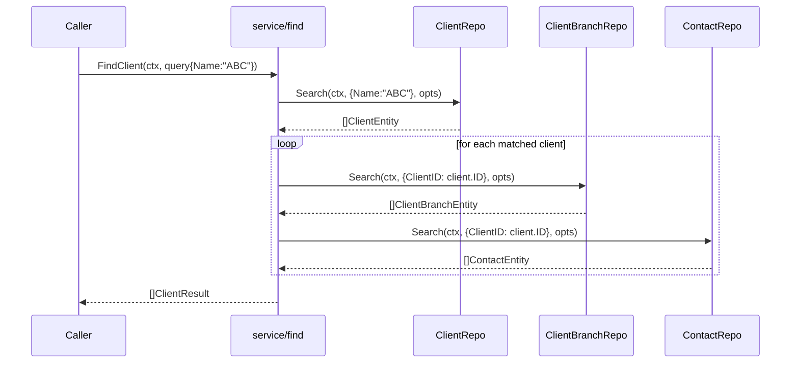
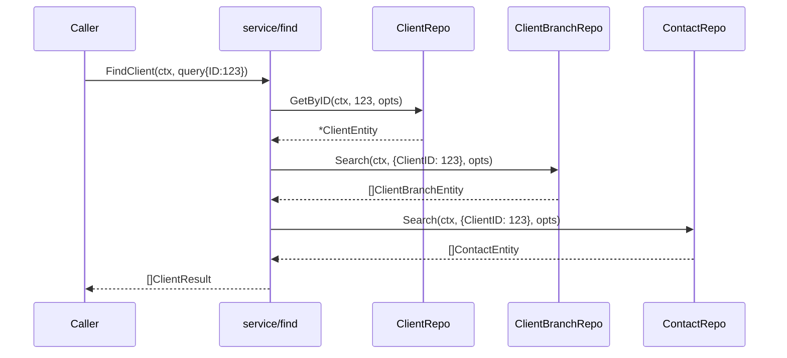
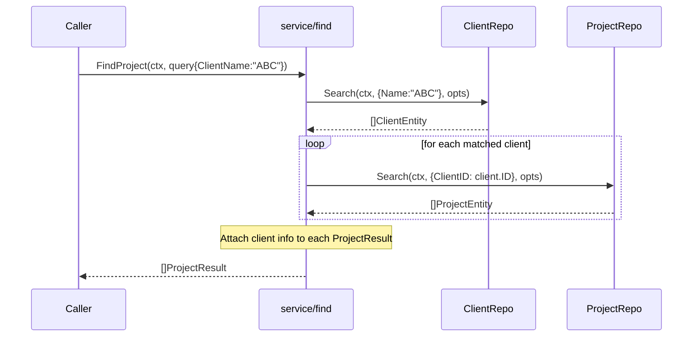
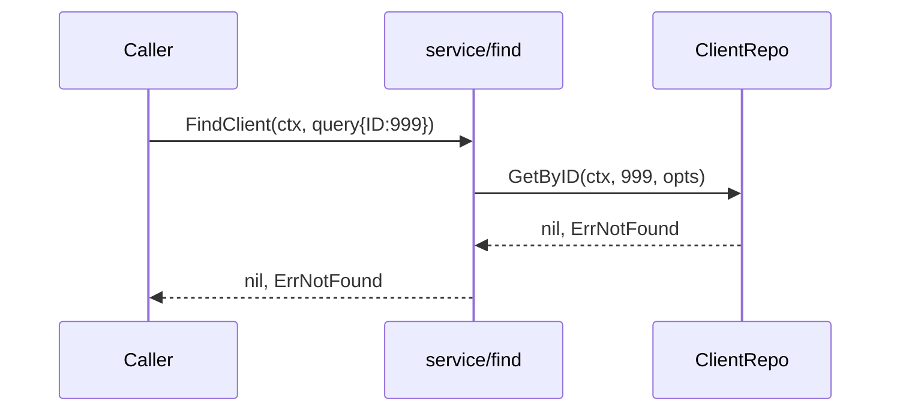

# Milestone M29: service/find - Client & Project Cross-Resource Search

## Overview

Implement the `service/find` high-level layer providing cross-resource search for clients and projects. `FindClient` resolves a name to clients + branches + contacts. `FindProject` resolves a client name to client IDs, then searches projects.

## Scope

### In Scope
- `FindClient`: name-based search returning clients, their branches, and contacts
- `FindProject`: client name resolution -> project search with optional filters
- Service struct with DI via repository interfaces (same pattern as service/api)
- Result types: `ClientResult`, `ProjectResult` (aggregated response structs)
- Query option types: `FindClientQuery`, `FindProjectQuery`
- Comprehensive tests with stubs (TDD)

### Out of Scope
- Document search (M30: find_estimate, find_invoice, etc.)
- Vendor/master search (M31: find_vendor, find_user, etc.)
- CLI commands (M32: `board find client`, `board find project`)
- MCP tool definitions (M36+)

## Architecture

### Layer Position
```
CLI (board find client/project)  -- M32, not this milestone
  -> service/find                -- THIS MILESTONE (M29)
    -> repository (clients, client_branches, contacts, projects)
      -> cache/refresh/boardapi
```

### Design Decisions
1. **Interface segregation (Go idiom)**: service/find defines its own narrow repo interfaces (ClientRepo, etc.) independently from service/api. Both packages are satisfied by the same repository implementations via Go's implicit interface satisfaction. This avoids layer coupling (find does NOT import service/api).
2. **No own cache**: All caching delegated to repository layer per spec s3.2
3. **Aggregated results**: Return composite structs that combine multiple entities
4. **Text search strategy**: Name-based Search delegated to repo first, then List + in-memory filter for code/memo fields. Results deduplicated by ID.
5. **Limit at find layer**: Limit is applied on final aggregated results only. Repos receive ReadOptions with Limit=0 to avoid premature truncation.
6. **Field priority**: Query fields have explicit priority order (ID > Name > Text) to eliminate ambiguity.

## Data Model

### Query Types

```go
// FindClientQuery holds parameters for FindClient.
// Field priority: ID > Name > Text. If ID is set, Name and Text are ignored.
// If Name is set, Text is ignored. At least one field must be set.
type FindClientQuery struct {
    ID    int    // Direct lookup by ID (highest priority, ignores Name/Text)
    Name  string // Substring match on client name (ignores Text)
    Text  string // Free-text search across name, code, memo (lowest priority)
    Limit int    // Max results to return (0 = unlimited). Applied at find layer.
    Opts  repository.ReadOptions // Refresh/ForceRefresh only; Limit NOT passed to repos
}

// FindProjectQuery holds parameters for FindProject.
// Field priority: ID > ClientName > Name > Text. Higher priority fields
// override lower ones. Status is an additional filter applied on top.
type FindProjectQuery struct {
    ID         int    // Direct lookup by ID (highest priority)
    ClientName string // Resolve client name -> client IDs -> filter projects
    Name       string // Project name substring search
    Text       string // Free-text search across name, code, memo (lowest priority)
    Status     string // Additional filter (applied on top of any search mode)
    Limit      int    // Max results to return (0 = unlimited). Applied at find layer.
    Opts       repository.ReadOptions // Refresh/ForceRefresh only; Limit NOT passed to repos
}
```

### Limit Handling Strategy

Limit is handled at the **find layer only**, not passed through to repository ReadOptions:
- `FindClientQuery.Limit` / `FindProjectQuery.Limit` caps the final aggregated result count
- `ReadOptions` passed to repositories contains only `Refresh`/`ForceRefresh` (Limit=0)
- This prevents premature truncation when aggregating across multiple resources

### Field Priority Rules

**FindClient:**
1. `ID` set -> GetByID (single client), ignore Name/Text
2. `Name` set -> Search(ClientSearchParams{Name}), ignore Text
3. `Text` set -> List all + in-memory filter on name/code/memo

**FindProject:**
1. `ID` set -> GetByID (single project), ignore other fields
2. `ClientName` set -> resolve clients by name -> search projects by each client ID
3. `Name` set -> Search(ProjectSearchParams{Name}), ignore Text
4. `Text` set -> List all + in-memory filter on name/code/memo
5. `Status` is always applied as a post-filter regardless of search mode
```

### Result Types

```go
// ClientResult is the aggregated result for a client search.
type ClientResult struct {
    Client   boardapi.ClientEntity         `json:"client"`
    Branches []boardapi.ClientBranchEntity `json:"branches"`
    Contacts []boardapi.ContactEntity      `json:"contacts"`
}

// ProjectResult is the aggregated result for a project search.
type ProjectResult struct {
    Project boardapi.ProjectEntity `json:"project"`
    Client  *boardapi.ClientEntity `json:"client,omitempty"`
}
```

## Sequence Diagrams

### FindClient (by name)



### FindClient (by ID)



### FindProject (by client name)



### Error Flow: Client Not Found



## Test Design (TDD)

### Normal Cases

| ID | Function | Input | Expected Output | Notes |
|----|----------|-------|-----------------|-------|
| C1 | FindClient | query{ID:1} | 1 ClientResult with client, 2 branches, 1 contact | ID direct lookup |
| C2 | FindClient | query{Name:"ABC"} | 2 ClientResults | Name substring match |
| C3 | FindClient | query{Text:"memo"} | ClientResults matching memo | Free-text search |
| C4 | FindClient | query{Name:"ABC"}, client has no branches/contacts | 1 ClientResult with empty branches/contacts | Empty sub-resources |
| P1 | FindProject | query{ID:1} | 1 ProjectResult with project + client | ID direct lookup |
| P2 | FindProject | query{ClientName:"ABC"} | ProjectResults for all matching clients | Client name resolution |
| P3 | FindProject | query{Name:"dev"} | ProjectResults matching name | Direct project name search |
| P4 | FindProject | query{ClientName:"ABC", Status:"active"} | Filtered ProjectResults | Combined filters |
| P5 | FindProject | query{Text:"search"} | ProjectResults matching text | Free-text search |

### Error/Edge Cases

| ID | Function | Input | Expected | Notes |
|----|----------|-------|----------|-------|
| E1 | FindClient | query{ID:999} | nil, error | Not found by ID |
| E2 | FindClient | query{Name:"nonexistent"} | empty slice, nil | No match by name (not an error) |
| E3 | FindClient | query{} (empty) | error | No search criteria |
| E4 | FindProject | query{ID:999} | nil, error | Not found by ID |
| E5 | FindProject | query{ClientName:"nonexistent"} | empty slice, nil | No matching clients |
| E6 | FindProject | query{} (empty) | error | No search criteria |
| E7 | FindClient | repo returns error | nil, error | Propagate repo errors |
| E8 | FindProject | client search OK but project search fails | nil, error | Propagate repo errors |

### Priority & Limit Cases

| ID | Function | Input | Expected | Notes |
|----|----------|-------|----------|-------|
| PL1 | FindClient | query{ID:1, Name:"ABC"} | Uses ID only, ignores Name | ID has highest priority |
| PL2 | FindClient | query{Name:"ABC", Text:"xyz"} | Uses Name only, ignores Text | Name > Text priority |
| PL3 | FindProject | query{ID:1, ClientName:"ABC"} | Uses ID only | ID > ClientName priority |
| PL4 | FindProject | query{ClientName:"ABC", Status:"active"} | Client resolve + status filter | Status is always applied |
| L1 | FindClient | query{Name:"A", Limit:2}, 5 matches | 2 results | Limit at find layer |
| L2 | FindProject | query{ClientName:"A", Limit:1}, 3 clients * 5 projects | 1 result | Limit caps aggregated results |

### Constructor Test

| ID | Function | Input | Expected | Notes |
|----|----------|-------|----------|-------|
| N1 | New | valid Repos | non-nil *Service | Constructor works |

## Implementation Steps

### Step 1: Types and Service Struct (Red -> Green)

**Files:**
- `internal/service/find/types.go` — Query and Result types
- `internal/service/find/service.go` — Service struct, interfaces, constructor

**Details:**
1. Define `FindClientQuery`, `FindProjectQuery` structs
2. Define `ClientResult`, `ProjectResult` structs
3. Define repo interfaces in service/find package (idiomatic Go interface segregation; NOT imported from service/api to avoid layer coupling. Both packages independently define narrow interfaces satisfied by the same repository implementations)
4. Define `Repos` struct and `Service` struct
5. Implement `New(repos Repos) *Service` constructor

**Test (Red first):**
- Test N1: `TestNew` — verify constructor returns non-nil service

### Step 2: FindClient Implementation (Red -> Green)

**Files:**
- `internal/service/find/find_client.go` — FindClient method
- `internal/service/find/find_client_test.go` — Tests

**Details:**
1. Write failing tests C1-C4, E1-E3, E7 first
2. Implement `FindClient(ctx, query) ([]ClientResult, error)`:
   - Validate query (at least one of ID/Name/Text must be set)
   - If ID set: GetByID -> single client -> resolve branches/contacts
   - If Name set: Search by name -> for each client -> resolve branches/contacts
   - If Text set: Search by Name=text first (delegate to repo), then List + in-memory filter on code/memo, deduplicate by ID -> resolve branches/contacts
   - Apply query.Limit on final aggregated results (NOT passed to repo ReadOptions)
3. Refactor: extract `resolveClientDetails` helper

### Step 3: FindProject Implementation (Red -> Green)

**Files:**
- `internal/service/find/find_project.go` — FindProject method
- `internal/service/find/find_project_test.go` — Tests

**Details:**
1. Write failing tests P1-P5, E4-E6, E8 first
2. Implement `FindProject(ctx, query) ([]ProjectResult, error)`:
   - Validate query (at least one of ID/ClientName/Name/Text/Status must be set)
   - If ID set: GetByID -> single project -> resolve client
   - If ClientName set: Search clients by name -> collect client IDs -> Search projects by each client ID -> optionally filter by Status
   - If Name set: Search projects by name -> resolve client for each
   - If Text set: Search by Name=text first (delegate to repo), then List + in-memory filter on code/memo, deduplicate by ID -> resolve client
   - Status is always applied as post-filter regardless of search mode
   - Apply query.Limit on final aggregated results (NOT passed to repo ReadOptions)
3. Refactor: extract `resolveProjectClient` helper

### Step 4: Test Helpers (Red -> Green)

**Files:**
- `internal/service/find/helpers_test.go` — Stubs and test helpers

**Details:**
1. Stub implementations for all 4 repo interfaces (same pattern as service/api/helpers_test.go)
2. `zeroRepos()` helper returning empty Repos
3. `newServiceWith*` helpers for each stub combination
4. Common test assertions reused from existing patterns

### Step 5: Text Search Helper

**Files:**
- `internal/service/find/text_match.go` — containsText helper

**Details:**
1. Implement `containsText(text string, fields ...string) bool` for case-insensitive substring matching
2. Used by both FindClient and FindProject for `--text` flag handling
3. Unit tests for the helper in `text_match_test.go`

### Step 6: Documentation Update

**Files:**
- `plans/board-roadmap.md` — Mark M29 checkboxes as done

**Details:**
1. Update roadmap to mark M29 items as complete

## Dependency Order

```
Step 4 (helpers_test.go) -- no deps, can be first
Step 1 (types + service) -- no deps
Step 5 (text_match)      -- no deps
Step 2 (FindClient)      -- depends on Step 1, 4, 5
Step 3 (FindProject)     -- depends on Step 1, 4, 5
Step 6 (docs)            -- depends on Step 2, 3
```

Recommended execution: Steps 4 + 1 + 5 in parallel, then Step 2, then Step 3, then Step 6.

## Risk Assessment

| Risk | Severity | Mitigation |
|------|----------|------------|
| N+1 query problem: FindClient loops over clients calling branch/contact search | Medium | Accept for now; client count is typically small (<100). Document for future optimization if needed |
| Text search performance on large datasets | Low | Repository layer handles caching; in-memory filtering is acceptable for cached data. Limit flag caps results |
| Interface drift between service/api and service/find | Low | Both use the same repo interface shape. If service/api interfaces change, find must update too |
| Empty query validation edge cases | Low | Validate early, return clear error message |
| Rollback | Low | New package only; no existing code modified. Delete package to rollback |

## Architecture Consistency Check

- [x] Follows interface-based DI pattern from service/api
- [x] Uses same repository.ReadOptions type
- [x] Uses same boardapi entity types
- [x] No circular dependencies (find -> repository, boardapi; no dependency on service/api)
- [x] English-only code messages per ADR-005
- [x] No own caching per spec s3.2

## Checklist (5 Perspectives, 27 Items)

### Perspective 1: Implementation Feasibility (5 items)
- [x] No missing steps (types -> service -> find_client -> find_project -> tests -> docs)
- [x] Each step is specific enough (file names, function signatures, logic described)
- [x] Dependencies explicit (Step dependency order documented)
- [x] All target files listed (8 new files + 1 roadmap update)
- [x] Impact scope accurate (new package only, no existing code changes except roadmap)

### Perspective 2: TDD Test Design (6 items)
- [x] Normal cases covered (C1-C4, P1-P5)
- [x] Error cases defined (E1-E8)
- [x] Edge cases considered (empty query, no match, empty sub-resources)
- [x] Inputs/outputs specific (concrete IDs, names, expected counts)
- [x] Red->Green->Refactor order specified per step
- [x] Mock/stub design follows existing pattern (stubClientRepo etc.)

### Perspective 3: Architecture Consistency (5 items)
- [x] Naming follows conventions (find_client.go, FindClient, ClientResult)
- [x] Design pattern consistent (Service struct + New constructor + interface DI)
- [x] Module separation clear (find = high-level; api = low-level)
- [x] Dependency direction correct (find -> repository, boardapi; no reverse)
- [x] Consistent with similar features (mirrors service/api structure)

### Perspective 4: Risk Assessment (6 items)
- [x] Risks identified (N+1, text search perf, interface drift)
- [x] Mitigations specific (accept + document, limit caps, same interface shape)
- [x] Fail-safe considered (validation returns errors, repo errors propagated)
- [x] Performance impact evaluated (N+1 acceptable for small datasets)
- [x] Security considered (no secrets exposure, read-only operations)
- [x] Rollback plan exists (delete new package)

### Perspective 5: Sequence Diagrams (5 items)
- [x] Normal flow documented (FindClient by name, by ID; FindProject by client name)
- [x] Error flow documented (not found case)
- [x] Actor interactions clear (Caller -> FindSvc -> Repos)
- [x] Timing/sync clear (sequential calls within loops)
- [x] Retry/timeout: N/A (delegated to repository/boardapi layer)

---
## Next Action

> **Once this plan is approved, execute the following:**
>
> 1. `Skill(devflow:implement)` -- implement based on this plan
>
> No additional user instructions needed. Execute immediately.
