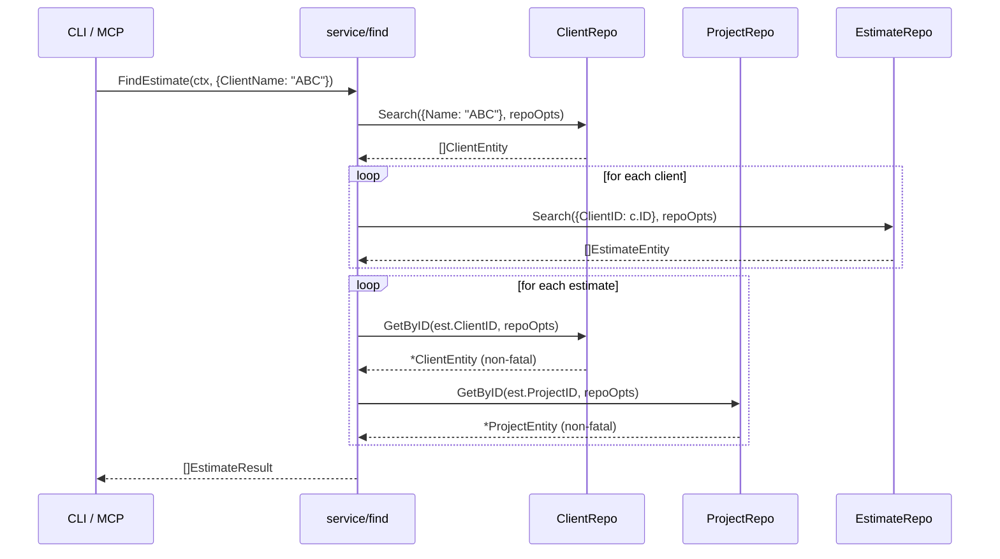

# M30: service/find - Document Cross-Resource Search

## Overview

Add FindEstimate, FindInvoice, FindOrder, FindDelivery, and FindReceipt to the existing `service/find` package. Each follows the same pattern established in M29 (Query struct + Result struct + resolve helper).

All 5 document types share a nearly identical structure:
- Common fields: ID, ClientID, ProjectID, Title, TotalAmount, Status, Memo
- Entity-specific date field (EstimateDate, InvoiceDate, OrderDate, DeliveryDate, ReceiptDate)
- SearchParams: ClientID, ProjectID, Status, UpdatedAtFrom

## Architecture

### Pattern (same as M29)

```
FindXxx(ctx, FindXxxQuery) -> ([]XxxResult, error)
  1. Validate query (at least one criterion)
  2. switch on priority: ID > ClientName > ProjectName > Status > Text
  3. Resolve entities via repo interface
  4. resolveXxxDetails: attach Client + Project to each document
  5. Apply Limit at find layer
```

### Field Priority for Documents

```
ID > ClientName > ProjectName > Text > Status(standalone)
```

- **ID**: Direct lookup by document ID
- **ClientName**: Resolve client name -> client IDs -> search documents by ClientID
- **ProjectName**: Resolve project name -> project IDs -> search documents by ProjectID
- **Text**: Free-text search across Title, Memo
- **Status** (standalone): List all, filter by status

**Status dual-mode**: When combined with ClientName/ProjectName/Text, Status acts as a post-filter on results. When used alone, it acts as a standalone search mode (list all + filter). Same pattern as M29 FindProject.

### Result Struct

Each XxxResult contains:
- The document entity itself
- Resolved `*ClientEntity` (non-fatal if resolution fails)
- Resolved `*ProjectEntity` (non-fatal if resolution fails)

## New Files

| File | Purpose |
|------|---------|
| `internal/service/find/find_estimate.go` | FindEstimate + resolveEstimateDetails |
| `internal/service/find/find_invoice.go` | FindInvoice + resolveInvoiceDetails |
| `internal/service/find/find_order.go` | FindOrder + resolveOrderDetails |
| `internal/service/find/find_delivery.go` | FindDelivery + resolveDeliveryDetails |
| `internal/service/find/find_receipt.go` | FindReceipt + resolveReceiptDetails |
| `internal/service/find/find_estimate_test.go` | Tests for FindEstimate |
| `internal/service/find/find_invoice_test.go` | Tests for FindInvoice |
| `internal/service/find/find_order_test.go` | Tests for FindOrder |
| `internal/service/find/find_delivery_test.go` | Tests for FindDelivery |
| `internal/service/find/find_receipt_test.go` | Tests for FindReceipt |

## Modified Files

| File | Changes |
|------|---------|
| `internal/service/find/types.go` | Add 5 Query structs + 5 Result structs |
| `internal/service/find/service.go` | Add 5 repo interfaces + extend Repos/Service structs + update New() |
| `internal/service/find/helpers_test.go` | Add 5 stub repos + assertion helpers + update zeroRepos/newServiceWith |

## Detailed Design

### types.go additions

```go
// FindEstimateQuery holds parameters for FindEstimate.
// Field priority: ID > ClientName > ProjectName > Status > Text.
type FindEstimateQuery struct {
    ID          int
    ClientName  string
    ProjectName string
    Status      string
    Text        string
    Limit       int
    Opts        repository.ReadOptions
}

// EstimateResult is the aggregated result for an estimate search.
type EstimateResult struct {
    Estimate boardapi.EstimateEntity `json:"estimate"`
    Client   *boardapi.ClientEntity  `json:"client,omitempty"`
    Project  *boardapi.ProjectEntity `json:"project,omitempty"`
}
```

Same pattern for Invoice, Order, Delivery, Receipt (only struct/field names change).

### service.go additions

```go
// EstimateRepo is the repository interface for estimates.
type EstimateRepo interface {
    List(ctx context.Context, opts repository.ReadOptions) ([]boardapi.EstimateEntity, error)
    GetByID(ctx context.Context, id int, opts repository.ReadOptions) (*boardapi.EstimateEntity, error)
    Search(ctx context.Context, params boardapi.EstimateSearchParams, opts repository.ReadOptions) ([]boardapi.EstimateEntity, error)
}
```

Same for InvoiceRepo, OrderRepo, DeliveryRepo, ReceiptRepo.

Repos struct gains: Estimates, Invoices, Orders, Deliveries, Receipts.
Service struct gains: estimates, invoices, orders, deliveries, receipts.
New() wires them up.

### find_estimate.go (representative)

```go
func (s *Service) FindEstimate(ctx, q FindEstimateQuery) ([]EstimateResult, error) {
    // validate: at least one of ID/ClientName/ProjectName/Status/Text
    // switch priority: ID > ClientName > ProjectName > Status > Text
    // resolve: resolveDocumentContext (client + project)
    // apply limit
}

func (s *Service) resolveEstimateDetails(ctx, est EstimateEntity, opts) (EstimateResult, error) {
    // resolve client (non-fatal)
    // resolve project (non-fatal)
    // return EstimateResult{Estimate: est, Client: client, Project: project}
}
```

### Common resolve helper

Since all 5 document types need to resolve Client and Project by their IDs, we extract a shared helper:

```go
// resolveClientAndProject resolves the client and project for a document.
// Both resolutions are non-fatal: nil is returned on error.
func (s *Service) resolveClientAndProject(ctx context.Context, clientID, projectID int, opts repository.ReadOptions) (*boardapi.ClientEntity, *boardapi.ProjectEntity) {
    var client *boardapi.ClientEntity
    var project *boardapi.ProjectEntity
    if clientID != 0 {
        c, err := s.clients.GetByID(ctx, clientID, opts)
        if err == nil { client = c }
    }
    if projectID != 0 {
        p, err := s.projects.GetByID(ctx, projectID, opts)
        if err == nil { project = p }
    }
    return client, project
}
```

This avoids duplicating the client/project resolution across 5 files.

## Sequence Diagram



## TDD Plan (Red -> Green -> Refactor)

### Step 1: Red - Write failing tests for types + interfaces

1. Add Query/Result types to types.go (compile errors until done)
2. Add repo interfaces to service.go
3. Add stub repos to helpers_test.go
4. Write test stubs in find_estimate_test.go (won't compile yet)

### Step 2: Green - Implement FindEstimate

1. Implement FindEstimate + resolveEstimateDetails in find_estimate.go
2. Implement resolveClientAndProject helper
3. Run `go test ./internal/service/find/...` -> all green

### Step 3: Refactor - Extract common resolve helper

1. Refactor resolveProjectClient (M29) to use resolveClientAndProject
2. Verify tests still pass

### Step 4: Red -> Green for remaining 4 document types

Repeat for Invoice, Order, Delivery, Receipt:
1. Write tests (Red)
2. Implement (Green)
3. Each is near-identical to Estimate

### Step 5: Final Refactor

1. Review all 5 implementations for DRY
2. Run full test suite
3. Run go vet + gofmt

## Test Cases per Document Type

| Test | Description |
|------|-------------|
| ByID | Direct lookup by ID, resolves client + project |
| ByClientName | Client name -> client IDs -> document search |
| ByProjectName | Project name -> project IDs -> document search |
| ByStatus | Filter by status field |
| ByText | Free-text search on Title + Memo |
| EmptyQuery | Returns error |
| NotFoundByID | Repo error propagated |
| NoMatchByClientName | Empty result, no error |
| Limit | Results capped at query.Limit |
| IDPriorityOverClientName | ID takes precedence |
| ClientResolutionFailure | Non-fatal: document returned with nil client |
| ProjectResolutionFailure | Non-fatal: document returned with nil project |

12 tests x 5 document types = 60 tests total.

## Risk Assessment

| Risk | Impact | Mitigation |
|------|--------|------------|
| Code duplication across 5 doc types | Medium | Extract resolveClientAndProject helper; consider generic helper if Go generics appropriate |
| Repos/Service struct grows large | Low | Acceptable for MVP; can refactor to sub-services later |
| Breaking existing M29 tests | High | Run full test suite after each change |
| Performance: N+1 queries for client/project resolution | Medium | Acceptable for cached data; optimize later if needed |

## Success Criteria

- [ ] All 5 Find methods implemented (FindEstimate, FindInvoice, FindOrder, FindDelivery, FindReceipt)
- [ ] 60 tests written and passing
- [ ] `go test ./internal/service/find/...` all green
- [ ] `go vet ./...` clean
- [ ] `gofmt -l .` clean
- [ ] No breaking changes to existing FindClient/FindProject
