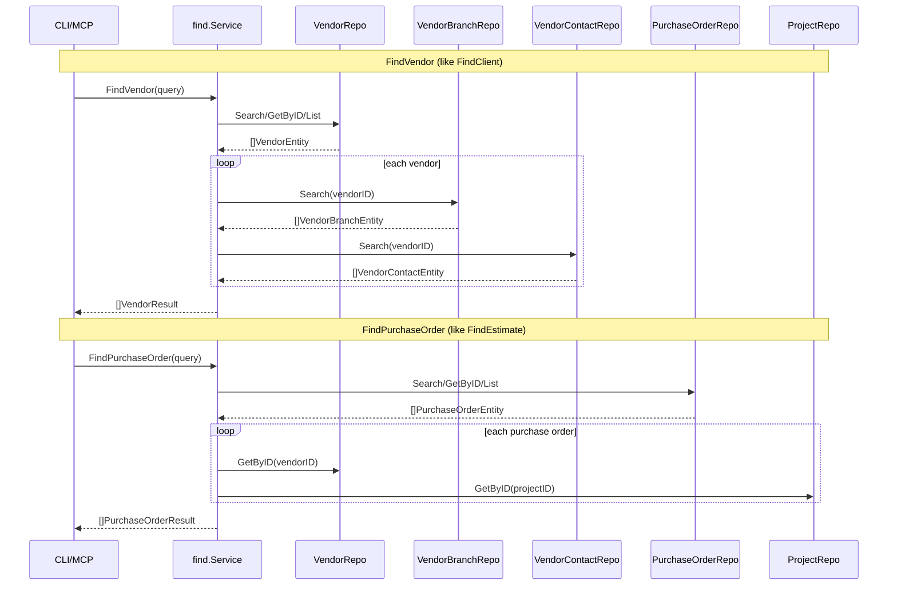

# M31: service/find - Vendor & Master Search

## Overview

Extend `internal/service/find` with vendor-side and master resource search capabilities, following the exact patterns established in M29 (Client/Project) and M30 (Document searches).

### Resources to implement

| Resource | Pattern | Query Fields | Result Aggregation |
|---|---|---|---|
| Vendor | Like Client (with branches/contacts) | ID, Name, Text | Vendor + VendorBranches + VendorContacts |
| PurchaseOrder | Like Estimate (document-style) | ID, VendorName, ProjectName, Text, Status | PurchaseOrder + Vendor + Project |
| Payment | Like Estimate (document-style) | ID, VendorName, PurchaseOrderID, Text, Status | Payment + Vendor |
| User | Simple (master) | ID, Name, Text | User only |
| Group | Simple (master) | ID, Name, Text | Group only |

## Architecture Decisions

- **ADR-005**: All code messages and help in English
- **FindVendor mirrors FindClient**: Vendor has sub-resources (VendorBranches, VendorContacts) just like Client has (ClientBranches, Contacts)
- **PurchaseOrder mirrors Document pattern**: Has VendorID + ProjectID, uses resolveVendorAndProject helper
- **Payment mirrors Document pattern**: Has VendorID + PurchaseOrderID, resolves Vendor
- **User/Group are simple lookups**: No sub-resources, no cross-resolution needed
- **resolveVendorAndProject**: New helper analogous to resolveClientAndProject
- **N+1 queries acceptable**: Cache-backed, consistent with M29/M30 pattern

## Sequence Diagram

## Implementation Steps (TDD: Red -> Green -> Refactor)

### Step 1: Add repo interfaces + types (service.go, types.go)

**types.go additions:**
- `FindVendorQuery` (ID, Name, Text, Limit, Opts)
- `VendorResult` (Vendor + Branches + Contacts)
- `FindPurchaseOrderQuery` (ID, VendorName, ProjectName, Text, Status, Limit, Opts)
- `PurchaseOrderResult` (PurchaseOrder + Vendor + Project)
- `FindPaymentQuery` (ID, VendorName, PurchaseOrderID, Text, Status, Limit, Opts)
- `PaymentResult` (Payment + Vendor)
- `FindUserQuery` (ID, Name, Text, Limit, Opts)
- `UserResult` (User only)
- `FindGroupQuery` (ID, Name, Text, Limit, Opts)
- `GroupResult` (Group only)

**service.go additions:**
- `VendorRepo` interface (List, GetByID, Search)
- `VendorBranchRepo` interface (List, GetByID, Search)
- `VendorContactRepo` interface (List, GetByID, Search)
- `PurchaseOrderRepo` interface (List, GetByID, Search)
- `PaymentRepo` interface (List, GetByID, Search)
- `UserRepo` interface (List, GetByID, Search)
- `GroupRepo` interface (List, GetByID, Search)
- Extend `Repos` struct and `Service` struct with new fields
- Update `New()` constructor
- Add `resolveVendorAndProject` helper

### Step 2: FindVendor (find_vendor.go + find_vendor_test.go)

**Red tests first:**
1. `TestFindVendor_ByID` - direct ID lookup with branches/contacts
2. `TestFindVendor_ByName` - name search
3. `TestFindVendor_ByText` - free-text across name/code/memo
4. `TestFindVendor_EmptySubResources` - vendor with no branches/contacts
5. `TestFindVendor_NotFoundByID` - error on missing ID
6. `TestFindVendor_NoMatchByName` - empty result
7. `TestFindVendor_EmptyQuery` - validation error
8. `TestFindVendor_RepoError` - branch repo error propagation
9. `TestFindVendor_IDPriorityOverName` - priority check
10. `TestFindVendor_NamePriorityOverText` - priority check
11. `TestFindVendor_Limit` - limit enforcement

**Green implementation:** `FindVendor` + `resolveVendorDetails` methods.

### Step 3: FindPurchaseOrder (find_purchase_order.go + find_purchase_order_test.go)

**Red tests first:**
1. `TestFindPurchaseOrder_ByID` - with vendor/project resolution
2. `TestFindPurchaseOrder_ByVendorName` - resolve vendor -> search POs
3. `TestFindPurchaseOrder_ByProjectName` - resolve project -> search POs
4. `TestFindPurchaseOrder_ByText` - free-text on title/memo
5. `TestFindPurchaseOrder_ByStatus` - standalone status filter
6. `TestFindPurchaseOrder_ByVendorNameWithStatus` - combined filter
7. `TestFindPurchaseOrder_EmptyQuery` - validation error
8. `TestFindPurchaseOrder_NotFoundByID` - error
9. `TestFindPurchaseOrder_NoMatchByVendorName` - empty result
10. `TestFindPurchaseOrder_VendorResolutionFailure` - non-fatal
11. `TestFindPurchaseOrder_ProjectResolutionFailure` - non-fatal
12. `TestFindPurchaseOrder_IDPriorityOverVendorName` - priority
13. `TestFindPurchaseOrder_Limit` - limit enforcement

**Green implementation:** `FindPurchaseOrder` + `filterPurchaseOrdersByStatus`.

### Step 4: FindPayment (find_payment.go + find_payment_test.go)

**Red tests first:**
1. `TestFindPayment_ByID` - with vendor resolution
2. `TestFindPayment_ByVendorName` - resolve vendor -> search payments
3. `TestFindPayment_ByPurchaseOrderID` - search by purchase order ID
4. `TestFindPayment_ByText` - free-text on memo
5. `TestFindPayment_ByStatus` - standalone status filter
6. `TestFindPayment_ByVendorNameWithStatus` - combined
7. `TestFindPayment_EmptyQuery` - validation error
8. `TestFindPayment_NotFoundByID` - error
9. `TestFindPayment_NoMatchByVendorName` - empty
10. `TestFindPayment_VendorResolutionFailure` - non-fatal
11. `TestFindPayment_IDPriorityOverVendorName` - priority
12. `TestFindPayment_Limit` - limit

**Green implementation:** `FindPayment` + `filterPaymentsByStatus`.

### Step 5: FindUser (find_user.go + find_user_test.go)

**Red tests first:**
1. `TestFindUser_ByID` - direct lookup
2. `TestFindUser_ByName` - name search
3. `TestFindUser_ByText` - free-text on name/email
4. `TestFindUser_EmptyQuery` - validation
5. `TestFindUser_NotFoundByID` - error
6. `TestFindUser_NoMatchByName` - empty
7. `TestFindUser_IDPriorityOverName` - priority
8. `TestFindUser_NamePriorityOverText` - priority
9. `TestFindUser_Limit` - limit

**Green implementation:** `FindUser` method.

### Step 6: FindGroup (find_group.go + find_group_test.go)

**Red tests first:**
1. `TestFindGroup_ByID` - direct lookup
2. `TestFindGroup_ByName` - name search
3. `TestFindGroup_ByText` - free-text on name/memo
4. `TestFindGroup_EmptyQuery` - validation
5. `TestFindGroup_NotFoundByID` - error
6. `TestFindGroup_NoMatchByName` - empty
7. `TestFindGroup_IDPriorityOverName` - priority
8. `TestFindGroup_NamePriorityOverText` - priority
9. `TestFindGroup_Limit` - limit

**Green implementation:** `FindGroup` method.

### Step 7: Update helpers_test.go

- Add stubs: `stubVendorRepo`, `stubVendorBranchRepo`, `stubVendorContactRepo`, `stubPurchaseOrderRepo`, `stubPaymentRepo`, `stubUserRepo`, `stubGroupRepo`
- Add assert helpers: `assertVendorResultLen`, `assertPurchaseOrderResultLen`, `assertPaymentResultLen`, `assertUserResultLen`, `assertGroupResultLen`
- Update `zeroRepos()` and `newServiceWith()` to include new repos

### Step 8: Refactor pass

- Check for code duplication across find methods
- Ensure consistent error messages (English)
- Run `gofmt -s -w .` and `go vet ./...`

## Files Modified/Created

| File | Action |
|---|---|
| `internal/service/find/service.go` | Modified - add 7 repo interfaces, extend Repos/Service/New, add resolveVendorAndProject |
| `internal/service/find/types.go` | Modified - add 10 new types (5 Query + 5 Result) |
| `internal/service/find/find_vendor.go` | New |
| `internal/service/find/find_vendor_test.go` | New |
| `internal/service/find/find_purchase_order.go` | New |
| `internal/service/find/find_purchase_order_test.go` | New |
| `internal/service/find/find_payment.go` | New |
| `internal/service/find/find_payment_test.go` | New |
| `internal/service/find/find_user.go` | New |
| `internal/service/find/find_user_test.go` | New |
| `internal/service/find/find_group.go` | New |
| `internal/service/find/find_group_test.go` | New |
| `internal/service/find/helpers_test.go` | Modified - add stubs and helpers |

## Risk Assessment

| Risk | Likelihood | Impact | Mitigation |
|---|---|---|---|
| Pattern drift from M29/M30 | Low | Medium | Strict adherence to established patterns |
| PurchaseOrder uses VendorID instead of ClientID | Low | Low | Use resolveVendorAndProject instead of resolveClientAndProject |
| Payment has no ProjectID | Low | Low | Only resolve Vendor, not Project |
| Test helper explosion | Medium | Low | Extend existing newServiceWith with variadic opts |
| Breaking existing tests | Low | High | Run full test suite after each step |

## Success Criteria

- [ ] `go test ./internal/service/find/...` passes (all ~120 tests: existing ~65 + new ~55)
- [ ] `go vet ./...` clean
- [ ] `gofmt -s -w .` no changes
- [ ] All messages in English (ADR-005)
- [ ] No business logic leaking outside service layer
