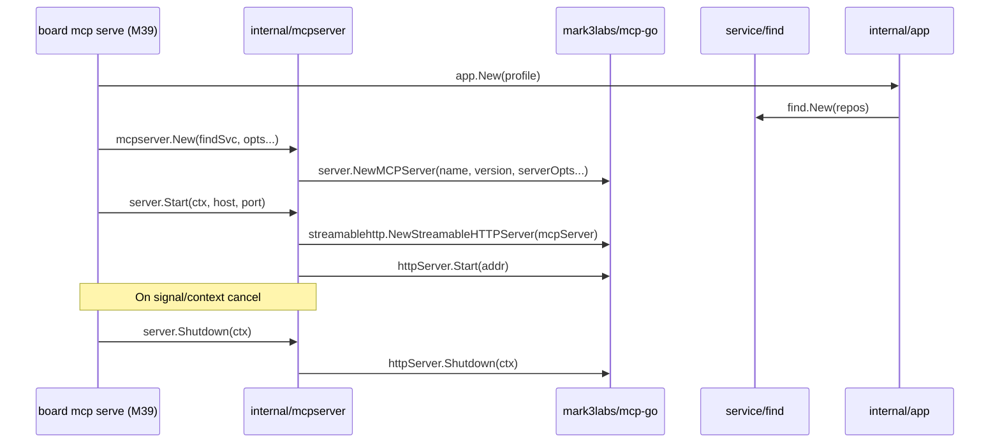

# M35: MCP Server Base - Implementation Plan

## Overview

Implement the `internal/mcpserver` package: the foundational MCP server using `mark3labs/mcp-go`.
This milestone covers server initialization, StreamableHTTP transport, and integration with `find.Service`.
No tool definitions yet (M36-M38 scope) -- this is the skeleton that tools will plug into.

## Scope

### In Scope
- `internal/mcpserver/server.go` -- MCP server factory (`New`) that creates `*server.MCPServer`
- `internal/mcpserver/server_test.go` -- Unit tests for server creation and configuration
- Server name/version from build info
- StreamableHTTP transport wrapper with host/port configuration
- Integration point: accept `*find.Service` for later tool registration
- Graceful shutdown support

### Out of Scope
- Tool definitions (M36)
- Tool handlers (M37-M38)
- CLI `board mcp serve` command (M39)
- Authentication / OAuth
- SSE transport (MVP is StreamableHTTP only)

## Architecture

```
internal/mcpserver/
  server.go          -- New(), Server struct, Start(), Shutdown()
  server_test.go     -- Unit tests
```

### Dependency Graph



## Design Decisions

1. **Server struct wraps mcp-go**: `mcpserver.Server` holds `*server.MCPServer` and `*server.StreamableHTTPServer`, exposing `Start(ctx, host, port)` and `Shutdown(ctx)`.
2. **Functional options pattern**: `mcpserver.New(findSvc, opts...)` with options like `WithServerName`, `WithVersion`.
3. **find.Service stored for tool registration**: The Server stores `*find.Service` so M36+ can call `server.MCPServer.AddTools(...)` through a public method `AddTool`.
4. **StreamableHTTP transport**: Per spec, local HTTP only. Using `server.NewStreamableHTTPServer`.
5. **Server info**: Name = "board", Version = build version or "dev".

## Data Structures

```go
package mcpserver

// Option configures the MCP server.
type Option func(*config)

type config struct {
    name    string // server name, default "board"
    version string // server version, default "dev"
}

// Server is the MCP server wrapper.
type Server struct {
    mcpServer  *server.MCPServer
    httpServer *server.StreamableHTTPServer
    findSvc    *find.Service
}
```

## Implementation Steps (TDD)

### Step 1: Red -- Test server creation with defaults

Write test that calls `mcpserver.New(nil)` (nil find.Service for now) and asserts:
- Returns non-nil `*Server`
- Internal `mcpServer` is initialized
- Default name is "board", version is "dev"

```go
func TestNew_Defaults(t *testing.T) {
    s := mcpserver.New(nil)
    assert(s != nil)
    // Server should be created without error
}
```

### Step 2: Green -- Implement New()

```go
func New(findSvc *find.Service, opts ...Option) *Server {
    cfg := config{name: "board", version: "dev"}
    for _, o := range opts {
        o(&cfg)
    }
    mcpSrv := server.NewMCPServer(cfg.name, cfg.version)
    return &Server{
        mcpServer: mcpSrv,
        findSvc:   findSvc,
    }
}
```

### Step 3: Red -- Test option overrides

```go
func TestNew_WithOptions(t *testing.T) {
    s := mcpserver.New(nil, WithName("test-board"), WithVersion("1.2.3"))
    // Verify name and version are applied
}
```

### Step 4: Green -- Implement WithName, WithVersion options

### Step 5: Red -- Test MCPServer() accessor

```go
func TestServer_MCPServer(t *testing.T) {
    s := mcpserver.New(nil)
    assert(s.MCPServer() != nil)
}
```

### Step 6: Green -- Implement MCPServer() accessor

Expose the inner `*server.MCPServer` so that M36+ can register tools.

### Step 7: Red -- Test FindService() accessor

```go
func TestServer_FindService(t *testing.T) {
    svc := &find.Service{} // zero-value for testing
    s := mcpserver.New(svc)
    assert(s.FindService() == svc)
}
```

### Step 8: Green -- Implement FindService() accessor

### Step 9: Red -- Test Start creates HTTP server

```go
func TestServer_Start(t *testing.T) {
    s := mcpserver.New(nil)
    ctx, cancel := context.WithCancel(context.Background())
    defer cancel()
    
    // Start on random port
    errCh := make(chan error, 1)
    go func() { errCh <- s.Start(ctx, "127.0.0.1", 0) }()
    
    // Give it time to start, then shutdown
    time.Sleep(100 * time.Millisecond)
    cancel()
    // Should not return error on clean shutdown
}
```

### Step 10: Green -- Implement Start()

```go
func (s *Server) Start(ctx context.Context, host string, port int) error {
    addr := net.JoinHostPort(host, strconv.Itoa(port))
    s.httpServer = server.NewStreamableHTTPServer(s.mcpServer)
    
    errCh := make(chan error, 1)
    go func() {
        errCh <- s.httpServer.Start(addr)
    }()
    
    select {
    case <-ctx.Done():
        return s.httpServer.Shutdown(context.Background())
    case err := <-errCh:
        return err
    }
}
```

### Step 11: Red -- Test Shutdown

```go
func TestServer_Shutdown(t *testing.T) {
    s := mcpserver.New(nil)
    // Shutdown without Start should not panic
    err := s.Shutdown(context.Background())
    assert(err == nil)
}
```

### Step 12: Green -- Implement Shutdown()

```go
func (s *Server) Shutdown(ctx context.Context) error {
    if s.httpServer == nil {
        return nil
    }
    return s.httpServer.Shutdown(ctx)
}
```

### Step 13: Refactor

- Extract address formatting
- Ensure all exported types/functions have godoc
- Run `go vet`, `gofmt`

## Test Strategy

| Test | Type | Description |
|------|------|-------------|
| TestNew_Defaults | Unit | Default server creation |
| TestNew_WithOptions | Unit | Option overrides |
| TestServer_MCPServer | Unit | Accessor returns inner server |
| TestServer_FindService | Unit | Accessor returns find service |
| TestServer_Start | Integration | HTTP server starts and responds to context cancel |
| TestServer_Shutdown | Unit | Shutdown is safe when not started |

## Risk Assessment

| Risk | Severity | Mitigation |
|------|----------|------------|
| mcp-go API changes between v0.47.0 and future | Medium | Pin version in go.mod (already done) |
| Port conflicts in CI | Low | Use port 0 for random port in tests |
| StreamableHTTP vs SSE confusion | Low | Spec explicitly says StreamableHTTP; SSE is not in scope |
| find.Service nil in tests | Low | Allow nil; tools will check at registration time |
| Goroutine leak in Start | Medium | Context-based shutdown with errCh pattern |

## Amendments from Review

1. Add `Addr() string` method to return the listener address (needed for port-0 tests)
2. Use 5-second deadline in shutdown within Start's context-cancel path
3. Replace `time.Sleep` in tests with polling Addr() for readiness

## Definition of Done

- [ ] `internal/mcpserver/server.go` exists with `New`, `Start`, `Shutdown`, `MCPServer`, `FindService`
- [ ] `internal/mcpserver/server_test.go` passes with `go test ./internal/mcpserver/...`
- [ ] `go vet ./...` passes
- [ ] `gofmt -s -w .` produces no changes
- [ ] All tests pass: `go test ./...`
- [ ] Code committed with conventional commit message
