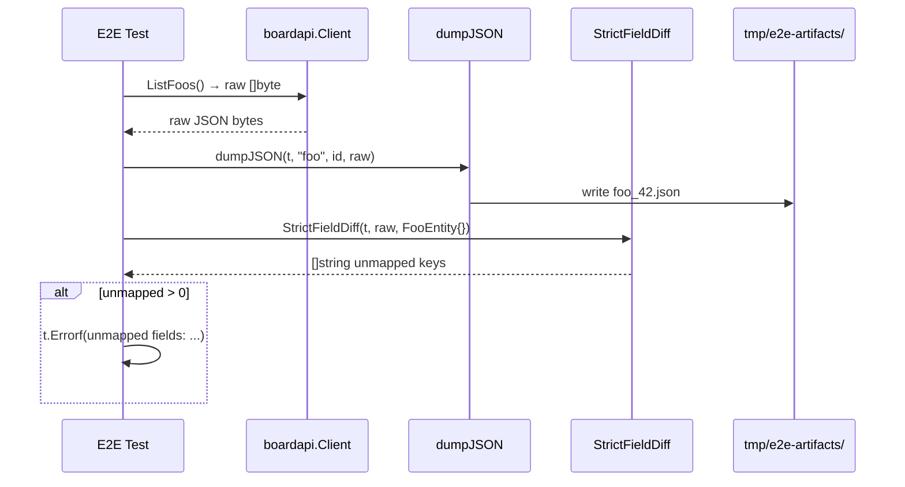

# M01: 厳格突合ヘルパー & tmp/ 整備

## Overview
| 項目 | 値 |
|------|---|
| ステータス | 未着手 |
| 依存 | なし（後続全 M の前提） |
| 見積 API 呼び出し | **0 req**（全て unit + fixture） |
| 対象ファイル | `.gitignore`, `internal/testhelper/strict_field_diff.go`（新規）, `internal/testhelper/strict_field_diff_test.go`（新規）, `internal/boardapi/e2e_helpers_test.go`（追記）, `internal/service/find/e2e_helpers_test.go`（追記）, `mise.toml`（タスク追加） |

## Goal
後続 33 マイルストーンで共通利用する **厳格フィールド突合ヘルパー** と **生 JSON ダンプ機構** を整備する。API 呼び出しを 0 に保ちつつ、以降の E2E が「JSON の未マップフィールドを検知したら Fail」「生 JSON は tmp/ に残してレビュー可能」を実現できる状態にする。

## 非ゴール
- 実 BOARD API を叩く E2E 追加（M02 以降）
- 既存 E2E のリファクタ（必要時は該当 M で実施）
- MCP 層の変更

## Sequence Diagram



## 設計

### 1. `StrictFieldDiff` 関数（internal/testhelper/strict_field_diff.go）

```go
package testhelper

// StrictFieldDiff は raw JSON のキー集合と target struct の
// json タグ集合を突合し、raw にあって struct にない未マップキーを返す。
// 配列/map/ネスト struct を再帰的に処理する。
//
// 使用例:
//   diff := testhelper.StrictFieldDiff(t, rawJSON, &boardapi.ClientEntity{})
//   if len(diff) > 0 { t.Errorf("unmapped: %v", diff) }
func StrictFieldDiff(t *testing.T, raw []byte, target any) []string
```

実装方針:
- `json.Unmarshal(raw, &map[string]any{})` で生キー集合を取得
- `reflect` で target の json タグ集合を取得（`json:"-"` は除外、`omitempty` 等のオプションは削除）
- raw が配列なら各要素を再帰
- raw の value が object/配列なら、target の該当フィールド型を辿って再帰
- 未マップキーは `"parent.child.key"` のドット記法で返す

### 2. `dumpJSON` ヘルパー

**配置**: `internal/boardapi/e2e_helpers_test.go` と `internal/service/find/e2e_helpers_test.go` の両方に追加（テストパッケージ跨ぎなので DRY を諦める）。

```go
// dumpJSON は raw JSON を tmp/e2e-artifacts/{resource}_{id}.json に書き出す。
// t.Cleanup で消さない（レビュー可能にするため）。
// ディレクトリが無ければ作成。失敗しても t.Fatal しない（ダンプは副産物）。
func dumpJSON(t *testing.T, resource string, id int, raw []byte)
```

パス決定:
- CWD から repo root を辿り、`tmp/e2e-artifacts/` を確保
- もしくは `os.UserCacheDir()` ではなく**明示的に repo root**（find-up で `go.mod` を探す）

### 3. `.gitignore` 追加

```gitignore
# E2E artifacts (raw API responses, may contain customer data)
/tmp/
```

既に `.gitignore` に `tmp/` が無いか確認してから追加。

### 4. `mise test:e2e:single` タスク

```toml
[tasks."test:e2e:single"]
description = "Run a single E2E test (rate-limit safe)"
usage = "mise run test:e2e:single -- -run TestE2E_Foo"
run = "go test -tags e2e -v -count=1 ./... "
```

引数で `-run` パターンを受け、1 テストのみ実行するためのショートカット。

## TDD Test Design

| # | テストケース | 入力 | 期待出力 |
|---|-------------|------|---------|
| 1 | 未マップキーを列挙 | raw `{"a":1,"b":2,"c":3}` vs struct `{A,B}` | `["c"]` |
| 2 | 完全一致は空 | raw `{"a":1}` vs `{A}` | `[]` |
| 3 | ネスト struct 再帰 | raw `{"a":{"x":1,"y":2}}` vs `{A{X}}` | `["a.y"]` |
| 4 | `json:"-"` は無視 | struct に `Ignored string \`json:"-"\`` | raw に ignored あっても検知 |
| 5 | omitempty 修飾は剥がす | json タグ `"foo,omitempty"` | `foo` として突合 |
| 6 | 配列要素の各 elem 再帰 | raw `[{"a":1,"b":2}]` vs struct `[]{A}` | `["[0].b"]`（または `[].b` 集約） |
| 7 | nil ポインタ OK | raw に key 無し、struct にポインタ | `[]`（追加要件なし） |
| 8 | map 型ネスト | raw `{"m":{"k":1}}` vs `{M map[string]int}` | `[]`（map は子要素を突合しない） |
| 9 | 複数 未マップ | 3 つ未マップ | 3 要素、順序はソート |
| 10 | 空 raw | raw `{}` vs 任意 struct | `[]` |

## Implementation Steps

1. [ ] **Red**: `strict_field_diff_test.go` に表上段 5 ケースを先に書く（`go test` で Fail）
2. [ ] **Green**: `strict_field_diff.go` の初期実装で 5 ケース通過
3. [ ] **Red→Green**: 残 5 ケース（6-10）を追加 → 実装拡張
4. [ ] **Refactor**: `reflect` 経由のフィールドタグ列挙を `structJSONTags(reflect.Type) map[string]reflect.Type` に抽出
5. [ ] `.gitignore` に `/tmp/` 追加（既存行確認後）
6. [ ] `dumpJSON` を `internal/boardapi/e2e_helpers_test.go` に追加（unit test 不要、統合時に機能確認）
7. [ ] 同関数を `internal/service/find/e2e_helpers_test.go` にコピペ追加
8. [ ] `mise.toml` に `test:e2e:single` タスクを追加
9. [ ] `mise run test` / `mise run vet` で既存テストが Green
10. [ ] M02 への導入コメントを `internal/boardapi/e2e_test.go` 冒頭に追記（「以降の新規 E2E は StrictFieldDiff + dumpJSON を必ず呼ぶこと」）
11. [ ] commit: `feat(testhelper): E2E 厳格フィールド突合ヘルパーと生JSONダンプ機構を追加`

## Verification

- `go test ./internal/testhelper/... -count=1` が全 10 ケース Green
- `go test -tags e2e ./internal/boardapi/... -count=1 -run NoSuchTest` でビルドエラーが無い（新ヘルパーが e2e タグ下で参照可能）
- `git status` で `tmp/` が untracked に出ない（`.gitignore` 反映確認）
- `mise run test:e2e:single -- -run TestE2E_Clients_List` の挙動を smoke 確認（実行して結果は問わない、ショートカットが生きていれば OK）

## Risks
| リスク | 影響度 | 対策 |
|--------|--------|------|
| `reflect` ベースの json タグ列挙で struct tag option（`omitempty`, `string` 修飾）を取りこぼす | 中 | ケース #5 で明示的にテスト |
| 配列ネストでパス表記が冗長（`[0].[1].foo`）になる | 低 | インデックス省略で `[].foo` 形式にし、重複排除 |
| `tmp/` に顧客名・金額などの機微情報が残り、誤って共有される | 高 | `.gitignore` 追加 + README に「tmp/ は共有禁止」と明記（M34 でドキュメント化） |
| map 型の値を再帰して誤検知（任意キーなのに未マップ扱い） | 中 | map 型は子要素を突合対象から除外（ケース #8 でテスト） |
| embedded struct のタグ列挙漏れ | 低 | `reflect.StructField.Anonymous` を辿る |

## Out of Scope（次 M 以降で扱う）
- 実 API 呼び出しを伴う E2E 追加（M02〜）
- 既存 E2E の StrictFieldDiff 適用（各 M 内で個別に）
- CI での `-tags e2e` 自動実行（当面は手動のみ）
