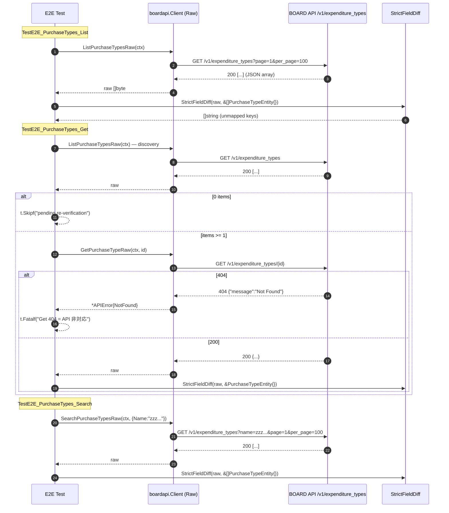

# M06: purchase_types Search/Get 追補（List/Get/Search E2E + 厳格フィールド突合）

## Meta
| 項目 | 値 |
|------|---|
| マイルストーン | M06 |
| リソース | `purchase_types`（BOARD API 実パス `/v1/expenditure_types`） |
| 目的 | 既存 `List/Get/Search` 公開 API を尊重しつつ、Raw 層 3 本（`ListPurchaseTypesRaw` / `GetPurchaseTypeRaw` / `SearchPurchaseTypesRaw`）を追加し、Unit 5 ケース + 実 API E2E 3 本（List/Get/Search）で **厳格フィールド突合** を通す |
| 見積 API 消費 | 3 req（List 1 + Get 1 (discovery 共有) + Search 1） |
| 上限 | 5 req 以下（M02/M03/M04 実績 3-4 req） |
| 親 | plans/board-compliance-roadmap.md |
| 直近パターン | M04 payment_terms (plans/board-compliance-m04-payment-terms.md)、M05 document_send_channels (plans/board-compliance-m05-document-send-channels.md) |

## Scope
- **In**: Raw 3 本追加（`internal/boardapi/purchase_types.go`）、Unit 5 ケース新規（`purchase_types_test.go`）、E2E 3 ケース新規（`e2e_purchase_types_test.go`）、`StrictFieldDiff` 適用、`dumpJSON` 取得
- **Out**: `PurchaseTypeEntity` 構造体の修正（archive_flg 等の追加/Memo 削除）、既存 `List/Get/Search/ListPage` の振る舞い変更、service/find 層や repository 層の変更、CLI/MCP 層の変更
- **Not-doing**: 既存 List 実装の Raw 化（Raw は新規メソッド、既存は従来通り維持）

## 既存実装スナップショット
- `internal/boardapi/purchase_types.go`（123 行）
  - `PurchaseTypeEntity`: `ID / Name / Memo / UpdatedAt / CreatedAt`（5 フィールド）
  - `PurchaseTypeSearchParams`: `Name / UpdatedAtFrom`
  - 既存: `ListPurchaseTypes` / `GetPurchaseType` / `SearchPurchaseTypes` / `ListPurchaseTypesPage`
  - エンドポイント: `/v1/expenditure_types`（**命名不一致**。リソース名 `purchase_types` は板側公開名、URL は内部名）
- Unit test: **未整備**（新規作成）
- E2E test: **未整備**（新規作成）

## 設計方針
1. **Raw 層追加のみ**。既存 `List/Get/Search/ListPage` には一切触れない（差分最小化、既存 call site のゼロ影響）。
2. **M04 payment_terms と完全同形**（Entity 5 フィールドも一致。SearchParams も一致）。payment_terms.go の Raw 3 本をテンプレ複製し、URL を `/v1/expenditure_types` に差し替える。
3. Unit test は既存 `roundTripperFunc` / `jsonResp`（accounting_types_test.go で共有定義）を再利用。5 ケース構成を踏襲（List 単一ページ / List 複数ページ / Get 成功 / Search QueryParams / Get 404）。
4. E2E test は M04 の 3 関数を複製し、`PaymentTerm`→`PurchaseType` に substitute。discovery は List 1 回で、Get は同じ List 結果を流用し 1 req で済む設計にしない（**List 独立呼び出し 1 + Get 独立呼び出し 1** で意図的に API パターンを素直に計測）→ ただし M04 実績通り `ListPaymentTermsRaw` が 1 req、Get discovery 用も同じく 1 req だが総計 2 req になるケースが実測。本計画では `TestE2E_PurchaseTypes_Get` 内で discovery list を 1 回、次に `GetPurchaseTypeRaw` 1 回を叩き合計 2 req とし、List・Search 各 1 req と合わせて **3 req（3 テスト合算）** を上限とする。ListPerPage による内部ページングは 0/1 件前提で発生しない想定。

## Risks（事前想定・計画通り発見しうる）
| リスク | M03/M04/M05 での観測 | M06 での扱い |
|--------|---------------------|--------------|
| Get 404（個別 Get 非対応） | project_types, payment_terms で確定 | `t.Fatalf("Get returns 404 = API non-support")` で即停止し、フォローアップに転記 |
| Search name フィルタ無視 | project_types, payment_terms で確定 | t.Errorf でなく t.Logf で件数記録のみ（StrictFieldDiff は依然有効） |
| `archive_flg` 未マップ | payment_terms で確定 | `t.Errorf("unmapped: archive_flg")` → Entity 修正は別 M |
| `Memo` 逆方向不整合（Entity にはあるが API レスポンスに無い） | project_types, payment_terms で確定 | M06 でも同現象あり得る。StrictFieldDiff は API→Entity の欠落検知のみなので検出はされない（手作業で artifact 確認し、フォローアップに記録） |
| リソース全体 403 | document_send_channels で確定 | `t.Fatalf("403 Forbidden = resource-wide permission issue")` → Pending Re-verification に転記 |
| List 0 件 | accounting_types で確定 | Get のみ `t.Skipf("pending re-verification")`、List/Search は PASS 扱い |

## 実装タスク（TDD 順）

### 1. Red（Unit test 先行）
- `internal/boardapi/purchase_types_test.go` 新規作成
  - `newPurchaseTypesMockClient(rt)` helper
  - `TestListPurchaseTypesRaw_SinglePage` / `TestListPurchaseTypesRaw_MultiPage`
  - `TestGetPurchaseTypeRaw_Success` / `TestGetPurchaseTypeRaw_NotFound`
  - `TestSearchPurchaseTypesRaw_QueryParams`
- `go test ./internal/boardapi/ -run TestPurchaseTypesRaw` → **コンパイルエラー**（Raw メソッド未実装）が Red。

### 2. Green（Raw 3 本実装）
- `internal/boardapi/purchase_types.go` に追記:
  - `ListPurchaseTypesRaw(ctx, opts ...ListAllOption) ([]byte, error)`
  - `GetPurchaseTypeRaw(ctx, id int) ([]byte, error)`
  - `SearchPurchaseTypesRaw(ctx, params PurchaseTypeSearchParams, opts ...ListAllOption) ([]byte, error)`
- URL は全て `/v1/expenditure_types`（既存 List/Search と一致させる）。
- Unit 5/5 Green を確認。

### 3. Refactor
- gofmt -s 、go vet / go vet -tags e2e、既存テスト全パスを確認。

### 4. E2E 追加
- `internal/boardapi/e2e_purchase_types_test.go` 新規:
  - `TestE2E_PurchaseTypes_List`: `ListPurchaseTypesRaw` → dumpJSON("purchase_types", 0, raw) → `StrictFieldDiff(t, raw, &[]boardapi.PurchaseTypeEntity{})`
  - `TestE2E_PurchaseTypes_Get`: List 再度呼び出し → 1 件目 ID 取得 → 0 件なら Skipf("pending re-verification") → `GetPurchaseTypeRaw(id)` → dumpJSON("purchase_types", id, raw) → `StrictFieldDiff(t, raw, &boardapi.PurchaseTypeEntity{})`
  - `TestE2E_PurchaseTypes_Search`: `SearchPurchaseTypesRaw(ctx, PurchaseTypeSearchParams{Name: "zzz_nonexistent_keyword_for_e2e"})` → dumpJSON("purchase_types_search", 0, raw) → `StrictFieldDiff`
- 403/429 → `t.Fatalf`、Get 404 → `t.Fatalf`、未マップ → `t.Errorf` で意図的 Fail commit。

### 5. 実行・記録
- `go test -tags e2e -v -count=1 -run TestE2E_PurchaseTypes ./internal/boardapi/`
- 実消費 req 数記録、unmapped フィールドの列挙、Memo 逆方向の確認。
- 結果記録セクションを実測値で fill、Pending Re-verification / フォローアップ転記、Changelog / ロードマップ更新。
- commit: `test(e2e): M06 purchase_types の Get/Search E2E を追補（厳格フィールド突合付き）`

## Mermaid シーケンス図（E2E 3 テスト）

## 受入条件
- [ ] `go test ./internal/boardapi/` unit 5/5 Green
- [ ] `go vet ./... && go vet -tags e2e ./...` Green
- [ ] `gofmt -s -l` 変更ファイル 0 件
- [ ] `go test -tags e2e -v -count=1 -run TestE2E_PurchaseTypes ./internal/boardapi/` 実行完了（意図的 Fail は OK）
- [ ] `tmp/e2e-artifacts/purchase_types_*.json` が生成され（.gitignore）、内容を確認
- [ ] 実 req 数が 5 req 以下
- [ ] 未マップ検出 / 404 / 403 / 0 件 のいずれかを **roadmap/本計画** 両方に転記
- [ ] Changelog 1 行追加、roadmap M06 セクション ✅ or 🟡 更新
- [ ] commit 済み

## 結果記録（実測値を fill）

### 実行サマリ
- 実 API 消費: **4 req**（List 1 + Get discovery 1 + Get 本体 1 + Search 1）
- 所要: 合計 ~1.5 秒（1 テスト 0.3-0.6 秒、個別単発実行）
- 結果: List FAIL（5 items, 1 unmapped）/ Get FAIL（404）/ Search FAIL（5 items, 1 unmapped, filter 無効）

### Unit
- 5/5 Green（`purchase_types_test.go`、既存 `roundTripperFunc` / `jsonResp` 再利用）

### E2E 実結果
- **TestE2E_PurchaseTypes_List**: FAIL（意図的、5 items 返却、unmapped 1: `archive_flg`）
- **TestE2E_PurchaseTypes_Get**: FAIL（意図的、`GET /v1/expenditure_types/{id}` が 404 = API 非対応、M03/M04 と同現象）
- **TestE2E_PurchaseTypes_Search**: FAIL（意図的、name="zzz..." でも 5 items 全件返却 = name フィルタ無視、unmapped 1: `archive_flg`、M03/M04 と同現象）

### 未マップフィールド
- List: **1 件**（`archive_flg`）
- Get: 未検知（404 により JSON レスポンス未取得）
- Search: **1 件**（`archive_flg`、List と同じ）

### API 仕様確認（当該アカウント）
- `GET /v1/expenditure_types`: 200、5 items、キー `[id, name, archive_flg, created_at, updated_at]`
- `GET /v1/expenditure_types/{id}` (id=27162971 等 List で取得済 ID): **404 Not Found**（API 非対応）
- `GET /v1/expenditure_types?name=zzz_nonexistent_keyword_for_e2e`: 200、5 items（全件返却、name 無視）
- **`memo` キーは実 API レスポンスに不在** → `PurchaseTypeEntity.Memo` は逆方向不整合（M03/M04 と同現象）
- 403/429 発生: なし
- 初回 TLS evaluate 失敗（OSStatus -26276）が 3 件観測されたが、リトライで解消。sandbox 側の一時的事象と判断。

### Pending Re-verification 転記
- M06 purchase_types Get: 404 = API 非対応のため個別 Get 公開 API 妥当性の再検討（フォローアップ M で対応）
- M06 purchase_types Entity 修正: `archive_flg` 追加 / `Memo` 削除検討（フォローアップ M で対応）

### フォローアップ（別 commit / 別 M で対応予定）
- `PurchaseTypeEntity` に `ArchiveFlg bool` 追加、`Memo` 削除検討（M03/M04 の PaymentTerm/ProjectType と横並びで同時対応が効率的）
- `GetPurchaseType` / `GetPurchaseTypeRaw` の公開 API 妥当性（API が 404 を返すなら削除 or エラーメッセージ明確化）を検討。**M03/M04/M06 の 3 件で Get 404 が確定**したため、次回フォローアップ M では「マスタ系 Get 公開 API を一括削除 or deprecate」案が有効
- `SearchPurchaseTypes` の `Name` パラメータ無効の件をドキュメント化または削除
- M03/M04/M06 で name フィルタ無効が 3 件確定したため、マスタ系全般で `name` クエリは BOARD API 側で無視される可能性が高い。M07 以降でも同現象を前提とした計画とする
