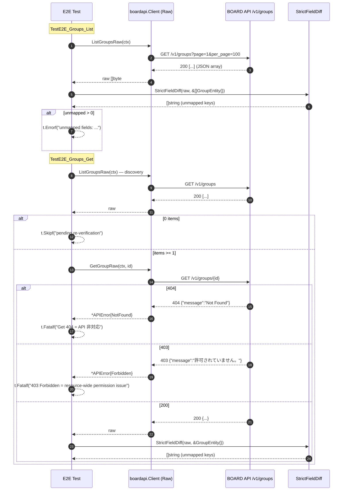

# M07: groups Get + 厳格突合（List/Get E2E + 厳格フィールド突合）

## Meta
| 項目 | 値 |
|------|---|
| マイルストーン | M07 |
| リソース | `groups`（BOARD API パス `/v1/groups`） |
| 目的 | 既存 `List/Get/Search` 公開 API を尊重しつつ、Raw 層 2 本（`ListGroupsRaw` / `GetGroupRaw`）を追加し、Unit 5 ケース + 実 API E2E 2 本（List/Get）で **厳格フィールド突合** を通す |
| 見積 API 消費 | 3 req（List 1 + Get discovery 1（実体は List 共有 1 req）+ Get 本体 1） |
| 上限 | 5 req 以下（M02-M06 実績 3-4 req） |
| 親 | plans/board-compliance-roadmap.md |
| 直近パターン | M06 purchase_types (plans/board-compliance-m06-purchase-types.md) |

## Scope
- **In**: Raw 2 本追加（`internal/boardapi/groups.go`、List/Get のみ）、Unit 5 ケース新規（`groups_test.go`）、E2E 2 ケース新規（`e2e_groups_test.go`：List + Get）、`StrictFieldDiff` 適用、`dumpJSON` 取得
- **Out**: `GroupEntity` 構造体の修正（archive_flg 等の追加 / Memo 削除）、既存 `List/Get/Search/ListPage` の振る舞い変更、service/find 層や repository 層の変更、CLI/MCP 層の変更
- **Not-doing**:
  - 既存 List/Get/Search 実装の Raw 化（Raw は新規メソッド、既存は従来通り維持）
  - **Search の E2E 検証**（ロードマップ M07 定義どおり「Get（既存 List 前提）+ 厳格フィールド突合（GroupEntity）」のみ。`SearchGroupsRaw` も M07 では追加しない。仮に Search を将来検証する場合は別 M で扱う）

## 既存実装スナップショット
- `internal/boardapi/groups.go`（122 行）
  - `GroupEntity`: `ID / Name / Memo / UpdatedAt / CreatedAt`（5 フィールド、purchase_types/payment_terms/project_types と完全同形）
  - `GroupSearchParams`: `Name / UpdatedAtFrom`
  - 既存: `ListGroups` / `GetGroup` / `SearchGroups` / `ListGroupsPage`
  - エンドポイント: `/v1/groups`（命名一致）
- Unit test: **未整備**（新規作成）
- E2E test: **未整備**（新規作成）

## 設計方針
1. **Raw 層を List/Get の 2 本のみ追加**。Search は M07 スコープ外。既存 `List/Get/Search/ListPage` には一切触れない（差分最小化、既存 call site のゼロ影響）。
2. **M06 purchase_types と同形（ただし Search Raw 抜き）**。purchase_types.go の `ListXxxRaw` / `GetXxxRaw` をテンプレ複製し、URL を `/v1/groups` に差し替える。
3. Unit test は既存 `roundTripperFunc` / `jsonResp`（`accounting_types_test.go` で package-scope 共有）を再利用。M07 では Search Raw を提供しないため Search 関連の Unit ケースを 1 本減らし、その代わり `ListGroupsRaw` のページング系を 2 本（単一 / 複数）+ `GetGroupRaw` の成功 / 404 + `ListGroupsRaw` のクエリ既定値（`page=1` / `per_page=100`）の **5 ケース** を維持する。
4. E2E test は M06 の List/Get の 2 関数を複製し、`PurchaseType`→`Group` に substitute、URL 期待値を `/v1/groups` に差し替える。Search ケースは複製しない。
5. discovery は `TestE2E_Groups_Get` 内で `ListGroupsRaw` 1 回を叩き、その先頭 ID を `GetGroupRaw` に渡す。`TestE2E_Groups_List` も独立して `ListGroupsRaw` を 1 回叩く（**List/Get のテストを単発実行した場合、合計 3 req**：List 1 + Get 内 List 1 + Get 1）。

## Risks（事前想定・計画通り発見しうる）
| リスク | M03/M04/M05/M06 での観測 | M07 での扱い |
|--------|---------------------|--------------|
| Get 404（個別 Get 非対応） | project_types, payment_terms, purchase_types の 3 件で確定 | `t.Fatalf("Get returns 404 = API non-support")` で即停止し、フォローアップに転記 |
| `archive_flg` 未マップ | payment_terms, purchase_types の 2 件で確定 | `t.Errorf("unmapped: archive_flg")` → Entity 修正は別 M |
| `Memo` 逆方向不整合（Entity にあるが API レスポンスに無い） | project_types, payment_terms, purchase_types の 3 件で確定 | M07 でも同現象あり得る。StrictFieldDiff は API→Entity の欠落検知のみのため検出されない（手作業で artifact 確認しフォローアップに記録） |
| リソース全体 403 | document_send_channels の 1 件で確定 | `t.Fatalf("403 Forbidden = resource-wide permission issue")` → Pending Re-verification に転記 |
| List 0 件 | accounting_types の 1 件で確定 | Get のみ `t.Skipf("pending re-verification")`、List は PASS 扱い |
| その他未マップ（company_bank_id 等） | project_types で確定（合計 3 件） | List/Get 双方で発生し得る。`t.Errorf` で意図的 Fail commit |
| **groups 固有：階層情報** | （想定）部署/組織グループに `parent_id` / `path` 等の階層フィールドが含まれる可能性 | 検出された場合は未マップとして `t.Errorf` で記録 → Entity 拡張は別 M |
| **groups 固有：メンバーシップ** | （想定）`user_ids` / `users_count` 等の関連カウントが含まれる可能性 | 同上 |

## 実装タスク（TDD 順）

### 1. Red（Unit test 先行）
- `internal/boardapi/groups_test.go` 新規作成
  - `newGroupsMockClient(rt)` helper（既存 `newPurchaseTypesMockClient` と同じ作り）
  - `TestListGroupsRaw_SinglePage`：path = `/v1/groups`、page=1、per_page 既定 100、JSON 5 キー保持を確認
  - `TestListGroupsRaw_MultiPage`：`WithPerPage(2)` で 2 ページ → 3 件結合を確認
  - `TestGetGroupRaw_Success`：path = `/v1/groups/42`、レスポンス byte-for-byte 一致を確認
  - `TestGetGroupRaw_NotFound`：404 → `*APIError{Code: APIErrorNotFound}`
  - `TestListGroupsRaw_DefaultQueryParams`：`per_page` 未指定で既定値（100）が送信されることを確認（M06 までの 5 ケース構成と同じ「Search 1 ケース」の代替として、List 既定値ケースを追加して 5 本を維持）
- `go test ./internal/boardapi/ -run TestListGroupsRaw -run TestGetGroupRaw` → **コンパイルエラー**（Raw メソッド未実装）が Red

### 2. Green（Raw 2 本実装）
- `internal/boardapi/groups.go` に追記:
  - `ListGroupsRaw(ctx, opts ...ListAllOption) ([]byte, error)`
  - `GetGroupRaw(ctx, id int) ([]byte, error)`
- URL は全て `/v1/groups`（既存 List/Search と一致させる）
- Unit 5/5 Green を確認

### 3. Refactor
- gofmt -s、go vet、go vet -tags e2e、既存テスト全パスを確認

### 4. E2E 追加
- `internal/boardapi/e2e_groups_test.go` 新規:
  - `TestE2E_Groups_List`: `ListGroupsRaw` → `dumpJSON("groups", 0, raw)` → `StrictFieldDiff(t, raw, &[]boardapi.GroupEntity{})`
  - `TestE2E_Groups_Get`: `ListGroupsRaw` で discovery → 0 件なら `t.Skipf("...pending re-verification...")` → `GetGroupRaw(id)` → `dumpJSON("groups", id, raw)` → `StrictFieldDiff(t, raw, &boardapi.GroupEntity{})`
- 403/429 → `t.Fatalf`、Get 404 → `t.Fatalf`、未マップ → `t.Errorf` で意図的 Fail commit
- `Search` テストは作成しない（M07 スコープ外）

### 5. 実行・記録
- `go test -tags e2e -v -count=1 -run TestE2E_Groups ./internal/boardapi/`
- 実消費 req 数記録、unmapped フィールドの列挙、Memo 逆方向の確認
- 結果記録セクションを実測値で fill、Pending Re-verification / フォローアップ転記、Changelog / ロードマップ更新
- commit: `test(e2e): M07 groups の Get E2E を追加（厳格フィールド突合付き）`

## Mermaid シーケンス図（E2E 2 テスト）

## 受入条件
- [ ] `go test ./internal/boardapi/` unit 5/5 Green
- [ ] `go vet ./... && go vet -tags e2e ./...` Green
- [ ] `gofmt -s -l` 変更ファイル 0 件
- [ ] `go test -tags e2e -v -count=1 -run TestE2E_Groups ./internal/boardapi/` 実行完了（意図的 Fail は OK）
- [ ] `tmp/e2e-artifacts/groups_*.json` が生成され（.gitignore）、内容を確認
- [ ] 実 req 数が 5 req 以下
- [ ] 未マップ検出 / 404 / 403 / 0 件 のいずれかを **roadmap/本計画** 両方に転記
- [ ] Changelog 1 行追加、roadmap M07 セクション ✅ or 🟡 更新
- [ ] commit 済み

## 結果記録（実測値を fill）

### 実行サマリ
- 実 API 消費: **2 req**（List 1 + Get の discovery List 1。Get 本体は List 0 件 Skip のため未到達）
- 所要: 合計 ~0.9 秒（List 0.52 秒、Get 0.36 秒）
- 結果: List **PASS**（0 items）/ Get **SKIP**（List 0 件、pending re-verification）

### Unit
- 5/5 Green（`groups_test.go`、既存 `roundTripperFunc` / `jsonResp` 再利用）
  - TestListGroupsRaw_SinglePage / TestListGroupsRaw_MultiPage / TestGetGroupRaw_Success / TestGetGroupRaw_NotFound / TestListGroupsRaw_DefaultQueryParams

### E2E 実結果
- **TestE2E_Groups_List**: **PASS**（`GET /v1/groups` 200、レスポンス本体 `null`、items=0、StrictFieldDiff も 0 件のため未マップ検出無し）
- **TestE2E_Groups_Get**: **SKIP**（List 0 件のため Get 対象 ID が取得できず、`t.Skipf("...pending re-verification...")` で停止。ロードマップ M02 accounting_types と同パターン）

### 未マップフィールド
- List: **0 件**（実データ 0 件のため検出不能。データ投入後に再実行で意味を持つ）
- Get: **未検証**（0 件 Skip のため未実行）

### API 仕様確認（当該アカウント）
- `GET /v1/groups`: 200、0 items、レスポンスは `null`（M02 accounting_types と同じく、空集合を `null` で返却する仕様）
- `GET /v1/groups/{id}`: **未検証**（discovery 失敗）
- `memo` キー実 API 存在: **未検証** → `GroupEntity.Memo` の正方向/逆方向は要再検証（M03/M04/M06 では逆方向不整合が確定しているため、データ投入後に同パターンの可能性大）
- 403/429 発生: なし
- M05 document_send_channels のような **リソース全体 403** には**該当せず**（`/v1/groups` 自体は 200 で応答）

### Pending Re-verification 転記
- M07 groups Get: List 0 件 Skip。BOARD アカウントに groups を 1 件以上投入後に再実行
  - 再実行コマンド: `go test -tags e2e -v -count=1 -run TestE2E_Groups_Get ./internal/boardapi/`
- M07 groups List 厳格突合: 同じく 0 件のため未マップ検出機会なし。データ投入後の List 再実行で初めて意味を持つ
  - 再実行コマンド: `go test -tags e2e -v -count=1 -run TestE2E_Groups_List ./internal/boardapi/`

### フォローアップ（別 commit / 別 M で対応予定）
- データ投入後に `GroupEntity` の以下フィールド有無を検証（マスタ系の傾向から推定）:
  - `archive_flg`（payment_terms / purchase_types で確定 → groups でも追加されている可能性大）
  - `Memo` の逆方向不整合（project_types / payment_terms / purchase_types で確定）
  - groups 固有候補: `parent_id` / `path` / `users_count` / `display_order` 等の階層・付随情報
- `GetGroup` / `GetGroupRaw` の公開 API 妥当性: マスタ系 3 件（project_types / payment_terms / purchase_types）で Get 404 = API 非対応が確定。groups は accounts によっては Get 自体に対応している可能性があり、データ投入後の再実行で API 仕様を確定する必要あり
- M07 では Search Raw を意図的に提供していないため、将来 Search 検証が必要になった場合は別 M を立てる
