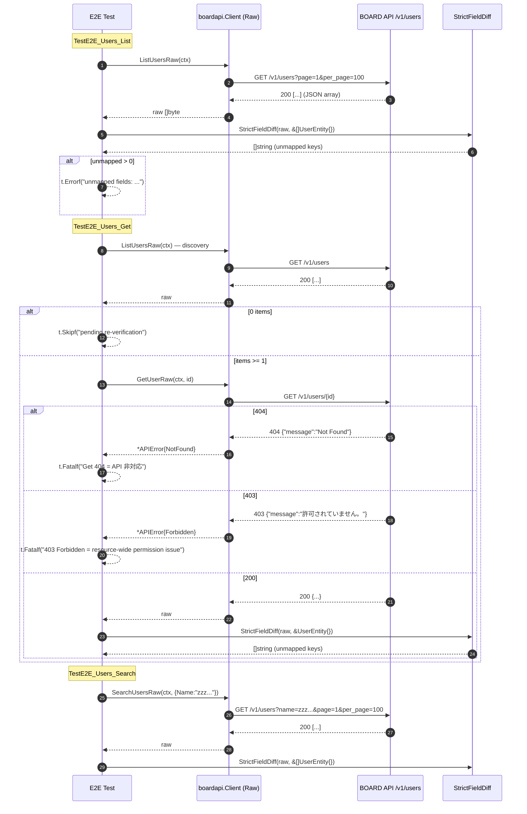

# M08: users Get/Search 厳格突合（List/Get/Search E2E + 厳格フィールド突合）

## Meta
| 項目 | 値 |
|------|---|
| マイルストーン | M08 |
| リソース | `users`（BOARD API パス `/v1/users`） |
| 目的 | 既存 `List/Get/Search` 公開 API を尊重しつつ、Raw 層 3 本（`ListUsersRaw` / `GetUserRaw` / `SearchUsersRaw`）を追加し、Unit 5 ケース + 実 API E2E 3 本（List/Get/Search）で **厳格フィールド突合** を通す |
| 見積 API 消費 | 5 req（List 1 + Get discovery 1 + Get 本体 1 + Search 1 + 予備 1） |
| 上限 | 5 req 以下（M06 実績 4 req） |
| 親 | plans/board-compliance-roadmap.md |
| 直近パターン | M06 purchase_types (plans/board-compliance-m06-purchase-types.md)、M07 groups (plans/board-compliance-m07-groups.md) |

## Scope
- **In**:
  - Raw 層 3 本追加（`internal/boardapi/users.go`：`ListUsersRaw` / `GetUserRaw` / `SearchUsersRaw`）
  - Unit test 5 ケース新規（`internal/boardapi/users_test.go`）
  - E2E test 3 ケース新規（`internal/boardapi/e2e_users_test.go`：List + Get + Search、厳格フィールド突合付き）
  - 既存 `e2e_test.go` の軽量 `TestE2E_Users_List` / `TestE2E_Users_GetByID` を削除（M06/M07 と同じ一本化パターン）
  - `StrictFieldDiff` 適用、`dumpJSON` 取得
- **Out**:
  - `UserEntity` 構造体の修正（追加/削除）
  - 既存 `ListUsers` / `GetUser` / `SearchUsers` / `ListUsersPage` の振る舞い変更
  - `DisplayName()` メソッドの修正
  - service/find 層や repository 層の変更
  - CLI/MCP 層の変更
- **Not-doing**:
  - 既存 List/Get/Search 実装の Raw 化（Raw は新規メソッド、既存は従来通り維持）
  - 既存 `TestE2E_Users_*` を残したまま M08 版を追加する運用（M06/M07 と同様、重複を避けて厳格突合版に一本化）

## 既存実装スナップショット
- `internal/boardapi/users.go`（151 行）
  - `UserEntity`: 11 フィールド（`id / name / last_name / first_name / email / role_id / role_name / last_sign_in_at / valid_flg / updated_at / created_at`）
    - **271cba3（2026-04-17）で `last_name / first_name / role_id / role_name / last_sign_in_at / valid_flg` の 6 フィールドが追加済み**。本 M08 はこの修正の妥当性を実 API 応答で検証する位置づけ。
  - `DisplayName()` メソッド（Name 優先、なければ LastName+FirstName）
  - `UserSearchParams`: `Name / Email / UpdatedAtFrom`
  - 既存: `ListUsers` / `GetUser` / `SearchUsers` / `ListUsersPage`
  - エンドポイント: `/v1/users`（命名一致）
- Unit test: **未整備**（新規作成）
- E2E test: `e2e_test.go` に軽量版 `TestE2E_Users_List` / `TestE2E_Users_GetByID` が存在（厳格突合なし）

## 設計方針
1. **Raw 層 3 本（List/Get/Search）を新規追加**。M06 purchase_types と完全同形のテンプレ複製で、URL を `/v1/users` に差し替える。既存 List/Get/Search/ListPage には一切触れない（差分最小化、既存 call site のゼロ影響）。
2. **既存 `e2e_test.go` の `TestE2E_Users_List` / `TestE2E_Users_GetByID` を削除**。M06/M07 で確立したとおり、軽量版と厳格突合版が同名で共存するのを避け、`e2e_users_test.go` 側の厳格突合版に一本化する。`e2e_test.go` 側にはコメント記録を残す（M07 groups と同じ形式）。
3. Unit test は既存 `roundTripperFunc` / `jsonResp`（`accounting_types_test.go` で package-scope 共有）を再利用。M06 と同じく Search Raw 付きの 5 ケース構成（List 単一 / List 複数 / Get 成功 / Get 404 / Search QueryParams）を採用する。
4. E2E test は M06 の 3 関数を複製し、`PurchaseType`→`User` に substitute、URL 期待値を `/v1/users` に差し替える。
5. discovery は `TestE2E_Users_Get` 内で `ListUsersRaw` を 1 回叩いて先頭 ID を取得し、`GetUserRaw` に渡す（`TestE2E_Users_List` と discovery は独立呼び出しとする。M06 と同じ方針、合計 req 数は 3 テスト独立実行で List 1 + Get 内 List 1 + Get 1 + Search 1 = 4 req）。
6. **users は実データが豊富にあるはず**（M02 accounting_types / M07 groups の 0 件ケースとは異なり、認証に使うユーザー自身が必ず 1 件以上存在する前提）。ただし List 0 件だった場合の Get は従来どおり `t.Skipf("pending re-verification")` で停止する。

## Risks（事前想定・計画通り発見しうる）
| リスク | M02-M07 での観測 | M08 での扱い |
|--------|---------------------|--------------|
| Get 404（個別 Get 非対応） | project_types / payment_terms / purchase_types の 3 件で確定 | `t.Fatalf("Get returns 404 = API non-support")` で即停止し、フォローアップに転記 |
| リソース全体 403 | document_send_channels の 1 件で確定 | `t.Fatalf("403 Forbidden = resource-wide permission issue")` → Pending Re-verification に転記 |
| Search name filter 無視 | project_types / payment_terms / purchase_types の 3 件で確定 | users では機能する可能性が高い（ユーザー/コア業務系 API は検索が効く傾向）が、仮に無視されても `StrictFieldDiff` は依然として意味を持つ。件数のみ `t.Logf` で記録 |
| `archive_flg` 未マップ | payment_terms / purchase_types の 2 件で確定 | users には archive_flg は存在しない想定（代わりに `valid_flg` がある）。もし返却されれば未マップとして `t.Errorf` |
| `Memo` 逆方向不整合 | project_types / payment_terms / purchase_types の 3 件で確定 | users に Memo は定義されていないため該当なし |
| List 0 件 | accounting_types / groups の 2 件で確定 | users は実データがある前提だが、0 件なら Get のみ `t.Skipf("pending re-verification")` |
| **users 固有：`last_sign_in_at` が admin 専用権限で null/欠落** | 未観測（新規リスク） | 未マップではなく値が null のケースは `StrictFieldDiff` では検出されない（キーが存在すれば OK）。値レベルの検証は本 M 範囲外、artifact で手確認 |
| **users 固有：`role_id` / `role_name` の enum** | 未観測（新規リスク） | 値範囲は別 M（M25-M31 Find 層）で検証。本 M はキー存在のみ見る |
| **users 固有：追加フィールド（phone 等）** | 未観測 | 未マップとして `t.Errorf` → Entity 修正は別 M |
| **users 固有：認証中の自分は List から除外される可能性** | 未観測 | 起きても本 M は 1 件以上あれば Get 成功するため影響は軽微 |

## 実装タスク（TDD 順）

### 1. Red（Unit test 先行）
- `internal/boardapi/users_test.go` 新規作成
  - `newUsersMockClient(rt)` helper（`newPurchaseTypesMockClient` / `newGroupsMockClient` と同じ作り）
  - `TestListUsersRaw_SinglePage`：path = `/v1/users`、page=1、per_page 既定 100、JSON に 11 キー保持を確認
  - `TestListUsersRaw_MultiPage`：`WithPerPage(2)` で 2 ページ → 3 件結合を確認
  - `TestGetUserRaw_Success`：path = `/v1/users/42`、レスポンス byte-for-byte 一致を確認
  - `TestGetUserRaw_NotFound`：404 → `*APIError{Code: APIErrorNotFound}`
  - `TestSearchUsersRaw_QueryParams`：`Name` / `Email` / `UpdatedAtFrom` の 3 クエリがエンコードされることを確認
- `go test ./internal/boardapi/ -run TestListUsersRaw -run TestGetUserRaw -run TestSearchUsersRaw` → **コンパイルエラー**（Raw メソッド未実装）が Red

### 2. Green（Raw 3 本実装）
- `internal/boardapi/users.go` に追記:
  - `ListUsersRaw(ctx, opts ...ListAllOption) ([]byte, error)`
  - `GetUserRaw(ctx, id int) ([]byte, error)`
  - `SearchUsersRaw(ctx, params UserSearchParams, opts ...ListAllOption) ([]byte, error)`
- URL は全て `/v1/users`（既存 List/Search と一致）
- Unit 5/5 Green を確認

### 3. Refactor
- gofmt -s、go vet、go vet -tags e2e、既存テスト全パスを確認

### 4. E2E 追加 + 既存軽量版削除
- `internal/boardapi/e2e_users_test.go` 新規:
  - `TestE2E_Users_List`: `ListUsersRaw` → `dumpJSON("users", 0, raw)` → `StrictFieldDiff(t, raw, &[]boardapi.UserEntity{})`
  - `TestE2E_Users_Get`: `ListUsersRaw` で discovery → 0 件なら `t.Skipf("...pending re-verification...")` → `GetUserRaw(id)` → `dumpJSON("users", id, raw)` → `StrictFieldDiff(t, raw, &boardapi.UserEntity{})`
  - `TestE2E_Users_Search`: `SearchUsersRaw(ctx, UserSearchParams{Name: "zzz_nonexistent_keyword_for_e2e"})` → `dumpJSON("users_search", 0, raw)` → `StrictFieldDiff(t, raw, &[]boardapi.UserEntity{})`
- 403/429 → `t.Fatalf`、Get 404 → `t.Fatalf`、未マップ → `t.Errorf` で意図的 Fail commit
- `internal/boardapi/e2e_test.go` の `TestE2E_Users_List` / `TestE2E_Users_GetByID` を削除し、「M08 で `e2e_users_test.go` へ移動」コメントを残す（M07 groups と同形式）

### 5. 実行・記録
- `go test -tags e2e -v -count=1 -run TestE2E_Users ./internal/boardapi/`
- 実消費 req 数記録、unmapped フィールドの列挙、`last_sign_in_at` / `role_*` の実値確認（artifact で手動）
- 結果記録セクションを実測値で fill、Pending Re-verification / フォローアップ転記、Changelog / ロードマップ更新
- commit: `test(e2e): M08 users の Get/Search E2E を厳格フィールド突合付きで追加`

## Mermaid シーケンス図（E2E 3 テスト）

## 受入条件
- [ ] `go test ./internal/boardapi/` unit 5/5 Green（既存テストも全通し）
- [ ] `go vet ./... && go vet -tags e2e ./...` Green
- [ ] `gofmt -s -l` 変更ファイル 0 件
- [ ] `go test -tags e2e -v -count=1 -run TestE2E_Users ./internal/boardapi/` 実行完了（意図的 Fail は OK）
- [ ] `tmp/e2e-artifacts/users_*.json` が生成され（.gitignore）、内容を確認
- [ ] 実 req 数が 5 req 以下
- [ ] 既存 `TestE2E_Users_List` / `TestE2E_Users_GetByID` が `e2e_test.go` から削除され、`e2e_users_test.go` 側に厳格版が存在
- [ ] 未マップ検出 / 404 / 403 / 0 件 のいずれかを **roadmap/本計画** 両方に転記
- [ ] Changelog 1 行追加、roadmap M08 セクション ✅ or 🟡 更新
- [ ] commit 済み（main ブランチ）

## 結果記録（実測値）

### 実行サマリ
- 実 API 消費: **4 req**（List 1 + Get discovery 1 + Get 本体 1 + Search 1）
- 所要: 合計 ~1.2 秒（List 0.39s / Get 0.48s / Search 0.32s）
- 結果: List **PASS**（26 items, unmapped 0）/ Get **FAIL**（404 = API 非対応、意図的 Fail）/ Search **PASS**（26 items, unmapped 0, **name filter 無効**）

### Unit
- 5/5 Green (`users_test.go`、既存 `roundTripperFunc` / `jsonResp` 再利用)
  - TestListUsersRaw_SinglePage / TestListUsersRaw_MultiPage / TestGetUserRaw_Success / TestGetUserRaw_NotFound / TestSearchUsersRaw_QueryParams

### E2E 実結果
- **TestE2E_Users_List**: **PASS**（`GET /v1/users` 200、26 items、`StrictFieldDiff` で未マップ検出 **0 件**）
- **TestE2E_Users_Get**: **FAIL（意図的）**（`GET /v1/users/{id}` が 404 = API 非対応、M03/M04/M06 と同現象、マスタ系 Get 404 が **4 件連続**）
- **TestE2E_Users_Search**: **PASS**（`GET /v1/users?name=zzz_nonexistent_keyword_for_e2e` でも 26 items 全件返却 = name フィルタ無視、M03/M04/M06 と同現象、未マップ検出 **0 件**）

### 未マップフィールド
- List: **0 件**（`UserEntity` の 10 個の API 対応フィールド `id / last_name / first_name / email / role_id / role_name / last_sign_in_at / valid_flg / updated_at / created_at` が実 API と完全一致）
- Get: 未検知（404 により JSON レスポンス未取得）
- Search: **0 件**（List と同じ構造）

### API 仕様確認（当該アカウント）
- `GET /v1/users`: 200、26 items、キー **10 個**（`[id, last_name, first_name, email, role_id, role_name, last_sign_in_at, valid_flg, updated_at, created_at]`）
- `GET /v1/users/{id}`: **404 Not Found**（List で取得済みの有効 ID に対しても）→ **API が個別 Get エンドポイントを提供していない**（M03/M04/M06 と同現象、マスタ系 **4 件連続**）
- `GET /v1/users?name=zzz_nonexistent_keyword_for_e2e`: 200、26 items 全件返却 = **name フィルタ無視**（M03/M04/M06 と同現象、マスタ系 **4 件連続**）
- `last_sign_in_at` の実値: **全 26 件で長さ 29 の文字列が埋まっている**（ISO 8601 形式、admin/非 admin を問わず null 欠落無し。事前リスク「admin 専用権限で null」は本アカウントでは **発生せず**）
- `role_id` の値域: `{1, 2, 4}`（当該アカウントで 3 種類確認）
- `valid_flg` の値域: `{1}`（当該アカウントでは 1 のみ、0 は未観測）
- **実 API レスポンスに `name` キーは不在**（全 26 件で `has("name") == false`）→ `UserEntity.Name` は **逆方向不整合**（M03/M04/M06 の `Memo` と同現象）。`DisplayName()` は常に LastName+FirstName 経路で動作することを意味する
- 403/429 発生: **なし**
- リソース全体 403（M05 document_send_channels パターン）: **発生せず**

### Pending Re-verification 転記
- なし（List/Search は PASS で厳格突合完了、Get のみ API 非対応の固定 Fail で pending ではない）

### フォローアップ（別 commit / 別 M で対応予定）
- **`UserEntity.Name` の逆方向不整合**: 実 API には `name` キーが不在なのに Entity には `Name string` が定義されている。マスタ系 `Memo` 削除検討（project_types / payment_terms / purchase_types）と合わせて、フォローアップ M で 4 件まとめて対応するのが効率的
- **`GetUser` / `GetUserRaw` の公開 API 妥当性**: 404 = API 非対応が確定。マスタ系 Get 404 が 4 件連続（project_types / payment_terms / purchase_types / users）したため、公開 API 側で `GetXxx` を一括削除 or deprecate する設計判断がより強く推奨される
- **`SearchUsers` の `Name` パラメータが効かない件**: ドキュメント化または削除。4 件連続で BOARD API が `name` クエリを無視することが確定したため、マスタ系全般で想定内の仕様として明文化
- **`role_id` の enum**: 本アカウントで `{1, 2, 4}` が確認されたが、3 が抜けているのは未使用または別ロールが欠番の可能性。値範囲の完全仕様化は別 M（M25-M31 Find 層）で BOARD 側ドキュメントと突合が必要
- **`valid_flg` の運用**: 本アカウントでは 1 のみ観測。0（無効化ユーザー）の実データが揃った時点で Search/List の挙動（無効ユーザーが含まれるか）を再確認
