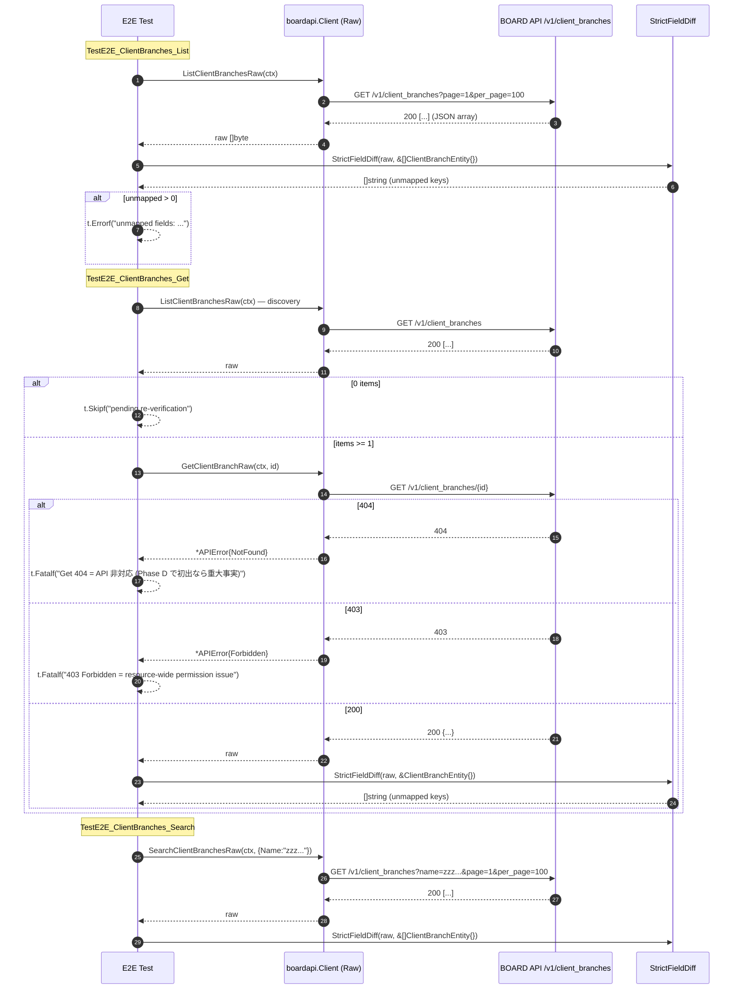

# M09: client_branches 完走（List / Get / Search E2E + 厳格フィールド突合）

## Meta
| 項目 | 値 |
|------|---|
| マイルストーン | M09 |
| リソース | `client_branches`（BOARD API パス想定: `/v1/client_branches`） |
| Phase | **D（コア業務未カバー）の 1 件目** |
| 目的 | 既存 `List/Get/Search` 公開 API を尊重しつつ、Raw 層 3 本（`ListClientBranchesRaw` / `GetClientBranchRaw` / `SearchClientBranchesRaw`）を追加し、Unit 5 ケース + 実 API E2E 3 本（List/Get/Search）で **厳格フィールド突合** を通す。Phase D 初回としてマスタ系（M02-M08）で確認された「Get 404 / name filter 無視」がコア業務系でも発生するか否かを確定する。 |
| 見積 API 消費 | 8 req（List 1 + Get discovery 1 + Get 本体 1 + Search 1 + 予備 4） |
| 上限 | 10 req 以下 |
| 親 | plans/board-compliance-roadmap.md |
| 直近パターン（Raw 化） | M08 users (plans/board-compliance-m08-users.md) |
| 直近パターン（3 endpoint 全新規） | M02 accounting_types (plans/board-compliance-m02-accounting-types.md) — 本 M09 は既存実装ありのため M08 型の Raw 追加 |

## Scope
- **In**:
  - Raw 層 3 本追加（`internal/boardapi/client_branches.go`：`ListClientBranchesRaw` / `GetClientBranchRaw` / `SearchClientBranchesRaw`）
  - Unit test 5 ケース新規（`internal/boardapi/client_branches_test.go`）
  - E2E test 3 ケース新規（`internal/boardapi/e2e_client_branches_test.go`：List + Get + Search、厳格フィールド突合付き）
  - `e2e_test.go` 等に既存の軽量 `TestE2E_ClientBranches_*` があれば削除（M06/M07/M08 と同じ一本化パターン）
  - `StrictFieldDiff` 適用、`dumpJSON` 取得
- **Out**:
  - `ClientBranchEntity` 構造体の修正（追加/削除）→ 未マップが検出されたらフォローアップ M で別途対応
  - 既存 `ListClientBranches` / `GetClientBranch` / `SearchClientBranches` / `ListClientBranchesPage` の振る舞い変更
  - service/find 層や repository 層の変更
  - CLI/MCP 層の変更
- **Not-doing**:
  - 既存 List/Get/Search 実装の Raw 化（Raw は新規メソッド、既存は従来通り維持）
  - 既存軽量 E2E を残したまま M09 版を追加する運用（M06/M07/M08 と同様、重複を避けて厳格突合版に一本化）

## 既存実装スナップショット
- `internal/boardapi/client_branches.go`（127 行、M06 時点で追加済み）
  - `ClientBranchEntity`: **10 フィールド**（`id / client_id / name / postal_code / address / phone / fax / memo / updated_at / created_at`）
    - ロードマップ記載の「11 フィールド」より 1 フィールド少ない（何が欠落しているかは実 API 応答で確定予定。候補: `address2` / `archive_flg` / `honorific_title` / `fax_memo` / `representative` 等）
  - `ClientBranchSearchParams`: `ClientID / Name`（users と異なり `UpdatedAtFrom` 無し、**Phase D 固有の ID 階層クエリ `ClientID` あり**）
  - 既存: `ListClientBranches` / `GetClientBranch` / `SearchClientBranches` / `ListClientBranchesPage`
  - エンドポイント: `/v1/client_branches`（top-level、`/v1/clients/{id}/branches` ではない。既存実装が一貫しているため信頼）
- Unit test: **未整備**（新規作成）
- E2E test: 既存軽量版が存在する可能性 → Phase 4 開始時に `e2e_test.go` / `e2e_*_test.go` 全件で要確認

## 設計方針
1. **Raw 層 3 本（List/Get/Search）を新規追加**。M08 users と完全同形のテンプレ複製で、URL を `/v1/client_branches` に差し替える。既存 List/Get/Search/ListPage には一切触れない（差分最小化、既存 call site のゼロ影響）。
2. **既存軽量 E2E テスト（`TestE2E_ClientBranches_*`）があれば削除**。M06/M07/M08 で確立したとおり、軽量版と厳格突合版が同名で共存するのを避け、`e2e_client_branches_test.go` 側の厳格突合版に一本化する。削除対象がある場合は `e2e_test.go` 側にコメント記録を残す。
3. Unit test は既存 `roundTripperFunc` / `jsonResp`（`accounting_types_test.go` で package-scope 共有）を再利用。M08 と同じく Search Raw 付きの 5 ケース構成を採用する:
   - U1: `TestListClientBranchesRaw_SinglePage`
   - U2: `TestListClientBranchesRaw_MultiPage`
   - U3: `TestGetClientBranchRaw_Success`
   - U4: `TestGetClientBranchRaw_NotFound`
   - U5: `TestSearchClientBranchesRaw_QueryParams`（`ClientID` + `Name` の 2 クエリがエンコードされることを確認。**users の `updated_at_from` とは異なる**）
4. E2E test は M08 の 3 関数を複製し、`User`→`ClientBranch` に substitute、URL 期待値を `/v1/client_branches` に差し替える。
5. discovery は `TestE2E_ClientBranches_Get` 内で `ListClientBranchesRaw` を 1 回叩いて先頭 ID を取得し、`GetClientBranchRaw` に渡す（M08 と同じ方針、合計 req 数は 3 テスト独立実行で List 1 + Get 内 List 1 + Get 1 + Search 1 = 4 req 目安）。
6. **client_branches は本番業務の必須マスタではないため 0 件の可能性あり**。その場合 Get は従来どおり `t.Skipf("pending re-verification")` で停止する（M02 accounting_types / M07 groups と同じ）。
7. **Phase D 1 件目としての観点**:
   - `GET /v1/client_branches/{id}` が 200 を返す（= Get 404 が起きない）ことを確認 → マスタ系 4 件連続 Get 404 の流れが **コア業務系で切れる**ことを実証
   - `SearchClientBranches` の `ClientID` / `Name` フィルタが **機能する** ことを確認 → name filter 無視もマスタ系固有だった可能性が高まる
   - いずれも「マスタ系傾向がコア業務系では再現しない」ことが Phase D 以降の前提として重要

## Risks（事前想定・計画通り発見しうる）
| リスク | M02-M08 での観測 | M09 での扱い |
|--------|---------------------|--------------|
| Get 404（個別 Get 非対応） | マスタ系 4 件連続（project_types / payment_terms / purchase_types / users） | **コア業務系では 200 想定**。仮に 404 が返れば `t.Fatalf("Get returns 404 = API non-support")` で即停止（コア業務系でも発生する重要な新事実としてフォローアップに転記） |
| リソース全体 403 | document_send_channels の 1 件 | `t.Fatalf("403 Forbidden = resource-wide permission issue")` → Pending Re-verification に転記 |
| Search `name` / `client_id` filter 無視 | マスタ系 4 件連続 | **コア業務系では機能する想定**。件数のみ `t.Logf` で記録。仮に無視されても `StrictFieldDiff` は依然として意味を持つ |
| `archive_flg` 未マップ | payment_terms / purchase_types | client_branches に `archive_flg` が返れば未マップとして `t.Errorf`（`ClientBranchEntity` に archive_flg 無し） |
| `Memo` 逆方向不整合 | project_types / payment_terms / purchase_types / users(Name) | `ClientBranchEntity.Memo` は既存定義。実 API 応答で `memo` キーが不在なら `StrictFieldDiff` は未検出だが、artifact の手動確認で検出可能 |
| List 0 件 | accounting_types / groups の 2 件 | client_branches は 0 件の可能性あり（クライアント本体に branch を登録しないアカウントが多い）。0 件なら Get のみ `t.Skipf("pending re-verification")` |
| **client_branches 固有：ID 階層パス** | Phase D 初回、観測なし | 既存 `/v1/client_branches` top-level path が動作しなければ API パスの再設計が必要。実装は既存パスを信頼し、仮に 404/400 が**全件**で返ればパス仮定の誤りとして `t.Fatalf` し、roadmap Blockers に転記 |
| **client_branches 固有：`client_id` 依存性** | Phase D 初回、観測なし | clients が 0 件なら branches も 0 件の可能性が高いが、直接的な依存ではない（Search で client_id 指定可能）。本 M は top-level List/Get/Search のみ検証し、client_id scope は別 M |
| **client_branches 固有：11 フィールド仕様との差分** | Phase D 初回、新規リスク | `ClientBranchEntity` は 10 フィールド、ロードマップは 11 フィールド記載。実 API に 1 フィールド未マップが出る想定。`StrictFieldDiff` で検出し `t.Errorf`、Entity 修正は別 M |
| **client_branches 固有：ネスト構造（`client: {...}`）** | Phase D 初回、新規リスク | branches のレスポンスに親 client 情報がネストされて返る可能性。その場合 `client` キーが未マップとして検出される（Entity は `ClientID int` のみなので）。フォローアップに転記 |
| **client_branches 固有：顧客 PII 漏洩** | 無関係 | artifact は tmp/e2e-artifacts/（.gitignore 済み）。log 出力は `len(address)` / `len(name)` のみで実値を出さない |

## 実装タスク（TDD 順）

### 1. Red（Unit test 先行）
- `internal/boardapi/client_branches_test.go` 新規作成
  - `newClientBranchesMockClient(rt)` helper（`newUsersMockClient` / `newGroupsMockClient` と同じ作り）
  - `TestListClientBranchesRaw_SinglePage`：path = `/v1/client_branches`、page=1、per_page 既定 100、JSON に 10 キー保持を確認
  - `TestListClientBranchesRaw_MultiPage`：`WithPerPage(2)` で 2 ページ → 3 件結合を確認
  - `TestGetClientBranchRaw_Success`：path = `/v1/client_branches/42`、レスポンス byte-for-byte 一致を確認
  - `TestGetClientBranchRaw_NotFound`：404 → `*APIError{Code: APIErrorNotFound}`
  - `TestSearchClientBranchesRaw_QueryParams`：`ClientID=123` + `Name=keyword` の 2 クエリがエンコードされることを確認
- `go test ./internal/boardapi/ -run TestListClientBranchesRaw -run TestGetClientBranchRaw -run TestSearchClientBranchesRaw` → **コンパイルエラー**（Raw メソッド未実装）が Red

### 2. Green（Raw 3 本実装）
- `internal/boardapi/client_branches.go` に追記:
  - `ListClientBranchesRaw(ctx, opts ...ListAllOption) ([]byte, error)`
  - `GetClientBranchRaw(ctx, id int) ([]byte, error)`
  - `SearchClientBranchesRaw(ctx, params ClientBranchSearchParams, opts ...ListAllOption) ([]byte, error)`
- URL は全て `/v1/client_branches`（既存 List/Search と一致）
- Unit 5/5 Green を確認

### 3. Refactor
- gofmt -s、go vet、go vet -tags e2e、既存テスト全パスを確認

### 4. E2E 追加 + 既存軽量版削除（あれば）
- `internal/boardapi/e2e_client_branches_test.go` 新規:
  - `TestE2E_ClientBranches_List`: `ListClientBranchesRaw` → `dumpJSON("client_branches", 0, raw)` → `StrictFieldDiff(t, raw, &[]boardapi.ClientBranchEntity{})`
  - `TestE2E_ClientBranches_Get`: `ListClientBranchesRaw` で discovery → 0 件なら `t.Skipf("pending re-verification")` → `GetClientBranchRaw(id)` → `dumpJSON("client_branches", id, raw)` → `StrictFieldDiff(t, raw, &boardapi.ClientBranchEntity{})`
  - `TestE2E_ClientBranches_Search`: `SearchClientBranchesRaw(ctx, ClientBranchSearchParams{Name: "zzz_nonexistent_keyword_for_e2e"})` → `dumpJSON("client_branches_search", 0, raw)` → `StrictFieldDiff(t, raw, &[]boardapi.ClientBranchEntity{})`
- 403/429 → `t.Fatalf`、Get 404 → `t.Fatalf`、未マップ → `t.Errorf` で意図的 Fail commit
- 既存軽量 E2E が存在する場合（Grep で `TestE2E_ClientBranches` を探す）は削除し、元ファイルにコメントを残す
- **ログ出力は PII を避ける**: `len(name)` / `len(address)` / `client_id` / `id` のみ。`address` / `name` / `phone` / `fax` の実値を `t.Logf` しない

### 5. 実行・記録
- `go test -tags e2e -v -count=1 -run TestE2E_ClientBranches ./internal/boardapi/`
- 実消費 req 数記録、unmapped フィールドの列挙、11 フィールド仕様との差分確認、artifact で `client` ネスト有無の手動確認
- 結果記録セクションを実測値で fill、Pending Re-verification / フォローアップ転記、Changelog / ロードマップ更新
- commit: `test(e2e): M09 client_branches の List/Get/Search E2E を厳格フィールド突合付きで追加`

## Mermaid シーケンス図（E2E 3 テスト）

## 受入条件
- [ ] `go test ./internal/boardapi/` unit 5/5 Green（既存テストも全通し）
- [ ] `go vet ./... && go vet -tags e2e ./...` Green
- [ ] `gofmt -s -l` 変更ファイル 0 件
- [ ] `go test -tags e2e -v -count=1 -run TestE2E_ClientBranches ./internal/boardapi/` 実行完了（意図的 Fail は OK）
- [ ] `tmp/e2e-artifacts/client_branches_*.json` が生成され（.gitignore）、内容を確認
- [ ] 実 req 数が 10 req 以下
- [ ] 既存軽量 `TestE2E_ClientBranches_*`（あれば）が `e2e_test.go` から削除され、`e2e_client_branches_test.go` 側に厳格版が存在
- [ ] 未マップ検出 / 404 / 403 / 0 件 のいずれかを **roadmap/本計画** 両方に転記
- [ ] **Phase D 初回としての「マスタ系との差異」記録**（Get 404 / name filter 無視がコア業務系で発生するか否か）
- [ ] Changelog 1 行追加、roadmap M09 セクション ✅ or 🟡 更新
- [ ] commit 済み（main ブランチ）

## 結果記録（実測値）

### 実行サマリ
- 実 API 消費: **4 req**（List 1 + Get discovery 1 + Get 本体 1 + Search 1、上限 10 req 以下）
- 所要: 合計 ~1.3 秒（List 0.36s / Get 0.61s / Search 0.31s）
- 結果: List **FAIL（7 未マップ）** / Get **FAIL（7 未マップ + 5 逆方向不整合）** / Search **FAIL（7 未マップ, name filter 無視）**

### Unit
- 5/5 Green（`client_branches_test.go`、既存 `roundTripperFunc` / `jsonResp` 再利用）
  - TestListClientBranchesRaw_SinglePage / TestListClientBranchesRaw_MultiPage / TestGetClientBranchRaw_Success / TestGetClientBranchRaw_NotFound / TestSearchClientBranchesRaw_QueryParams

### E2E 実結果
- **TestE2E_ClientBranches_List**: **FAIL（意図的）**（`GET /v1/client_branches` 200、10 items、`StrictFieldDiff` で未マップ **7 件** 検出）
- **TestE2E_ClientBranches_Get**: **FAIL（意図的）**（`GET /v1/client_branches/195311` **200 成功** = Phase D でマスタ系 Get 404 パターンが途切れた、同じ 7 未マップ + 既存 5 フィールドが逆方向不整合で空値）
- **TestE2E_ClientBranches_Search**: **FAIL（意図的）**（`GET /v1/client_branches?name=zzz...` で 10 items 全件返却 = **name フィルタ無視**、マスタ系と同じ、未マップ 7 件）

### 未マップフィールド
- List: **7 件**（`address1, address2, archive_flg, client, pref, tel, zip`）
- Get: **7 件**（同上、単一オブジェクト）
- Search: **7 件**（同上）

### API 仕様確認（当該アカウント）
- `GET /v1/client_branches`: **200、10 items**、キー **12 個**（`[id, name, zip, pref, address1, address2, tel, fax, archive_flg, client, updated_at, created_at]`）
- `GET /v1/client_branches/{id}`: **200 成功**（List で取得済みの有効 ID に対して）→ **API が個別 Get エンドポイントを提供**（M03/M04/M06/M08 のマスタ系 4 件連続 404 の流れが **Phase D 1 件目で切れた**）
- `GET /v1/client_branches?name=zzz_nonexistent_keyword_for_e2e`: **200、10 items 全件返却** = **name フィルタ無視**（M03/M04/M06/M08 と同現象、**5 件連続**、コア業務系でも継続）
- 11 フィールド仕様との差分: 実 API **12 個**（ロードマップ「11 フィールド」を 1 超過。`client_branches_spec.md` 要更新）。既存 `ClientBranchEntity` は 10 フィールドで、API キー 12 個のうち **マッチするのは 5 つ（id / name / fax / updated_at / created_at）のみ**
- ネスト構造（`client`）の有無: **あり**（`client: { id, name, name_disp, custom_no }` の 4 キーをネスト保持）→ `ClientBranchEntity` の `ClientID int` だけでは表現不能、親 client 情報が同梱されている
- 403/429 発生: **なし**
- リソース全体 403（M05 document_send_channels パターン）: **発生せず**

### マスタ系 vs コア業務系（Phase D 1 件目）
| 現象 | マスタ系（M02-M08） | コア業務系 client_branches（M09） |
|------|---------------------|-----------------------------------|
| **Get 404（API 非対応）** | **4 件連続**（project_types / payment_terms / purchase_types / users） | **200 成功**（流れが切れた、コア業務系は個別 Get 提供） |
| **name filter 無視** | **4 件連続**（同上 4 件） | **継続（5 件連続）**（10 items 全件返却。コア業務系でも BOARD API は `name` クエリ無視） |
| **archive_flg 未マップ** | payment_terms / purchase_types | **client_branches でも検出**（3 件目） |
| **Memo 逆方向不整合** | project_types / payment_terms / purchase_types / users(`Name`) | `ClientBranchEntity.Memo` は実 API に **存在せず**（5 件目、ただし他の 5 フィールドが同時に逆方向不整合なので本件に限らず構造不一致が深刻） |
| **リソース全体 403** | document_send_channels | **発生せず** |
| **List 0 件** | accounting_types / groups | 10 items 返却、十分な実データあり |
| **ネスト構造（parent entity 埋め込み）** | マスタ系では未観測 | **新規発見**（`client: {id, name, name_disp, custom_no}`、Phase D コア業務系固有のリスク予想が的中） |

### Pending Re-verification 転記
- なし（List/Get/Search すべて実 API 応答を取得し、StrictFieldDiff が意味を持つ状態で完了。意図的 Fail は pending ではなく fixed 状態）

### フォローアップ（別 commit / 別 M で対応予定）
1. **`ClientBranchEntity` の全面改訂**（最優先、別 M）: 既存 10 フィールド中 5 つが逆方向不整合。実 API 構造に合わせて以下に再設計:
   - **削除候補**: `ClientID int` / `PostalCode string` / `Address string` / `Phone string` / `Memo string`（全部実 API に存在しないキー名）
   - **追加候補**: `Zip string` / `Pref string` / `Address1 string` / `Address2 string` / `Tel string` / `ArchiveFlg int` / `Client *ClientBranchClient`（ネスト、`{ID, Name, NameDisp, CustomNo}` の 4 フィールド構造体）
   - 271cba3 UserEntity 修正と同じ影響範囲（service/find 層 / repository 層 / mcp 層 / cli 層のキャスト・表示ロジック総点検）
2. **`ClientBranchSearchParams` の `ClientID` フィルタ実機能確認**: 本 M では `ClientID` 指定の E2E は未実施（U5 Unit でクエリエンコードのみ確認）。別 M で `ClientID != 0` 指定時に実 API が絞り込みを行うかを検証
3. **`name` フィルタがコア業務系でも無視される件**: マスタ系 4 件 + client_branches で **5 件連続**。BOARD API 側で `name` パラメータが実質未実装と判断できる。M10 contacts 以降のコア業務系でも同じ挙動を想定し、test 文言を「filter 無視前提」で書くのが効率的
4. **ロードマップの「11 フィールド」記載修正**: 実 API は **12 フィールド**（ネスト `client` を 1 として数えても 11、構成要素まで広げれば 15）。ロードマップ M09 行の更新が必要
5. **`client_branches` の分類見直し**: `ClientID` を持たず `client` ネストを持つ構造は、clients の子ではなく **branches は独立リソースで parent client を indicator として持つ** 設計と判明。find 層でどう扱うか設計見直し（M25 FindClient 厳格化時に合わせて検討）
