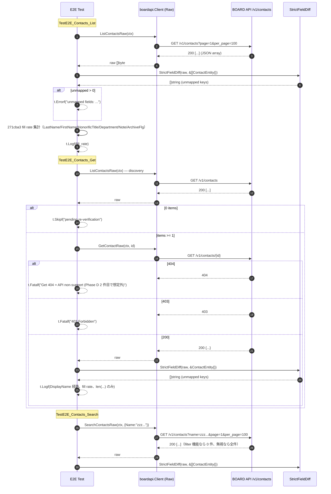

# M10: contacts 完走（List / Get / Search E2E + 厳格フィールド突合）

## Meta
| 項目 | 値 |
|------|---|
| マイルストーン | M10 |
| リソース | `contacts`（BOARD API パス: `/v1/contacts`） |
| Phase | **D（コア業務未カバー）の 2 件目**（M09 client_branches の次） |
| 目的 | 既存 `List/Get/Search` 公開 API を尊重しつつ、Raw 層 3 本（`ListContactsRaw` / `GetContactRaw` / `SearchContactsRaw`）を追加し、Unit 5 ケース + 実 API E2E 3 本（List/Get/Search）で **ContactEntity 17 フィールドの厳格フィールド突合** を通す。271cba3（2026-04-17）で追加された 6 フィールド（`last_name / first_name / honorific_title / department / note / archive_flg`）が実 API 応答と完全一致するかを検証する。Phase D 2 件目として「コア業務系の Get 200 + name filter 無視」パターンが contacts でも再現するか確定する。 |
| 見積 API 消費 | 4 req（List 1 + Get discovery 1 + Get 本体 1 + Search 1）、上限 10 req |
| 親 | plans/board-compliance-roadmap.md |
| 直近パターン（Raw 化 + 271cba3 検証） | M08 users (plans/board-compliance-m08-users.md) |
| 直近パターン（Phase D + ネスト構造） | M09 client_branches (plans/board-compliance-m09-client-branches.md) |

## Scope
- **In**:
  - Raw 層 3 本追加（`internal/boardapi/contacts.go`: `ListContactsRaw` / `GetContactRaw` / `SearchContactsRaw`）
  - Unit test 5 ケース新規（`internal/boardapi/contacts_test.go`）
  - E2E test 3 ケース新規（`internal/boardapi/e2e_contacts_test.go`: List + Get + Search、厳格フィールド突合付き）
  - `e2e_test.go` に既存の軽量 `TestE2E_Contacts_*` があれば削除（M06/M07/M08/M09 と同じ一本化パターン）
  - `StrictFieldDiff` 適用、`dumpJSON` 取得
- **Out**:
  - `ContactEntity` 構造体の修正（追加/削除）→ 未マップが検出されたらフォローアップ M で別途対応（271cba3 の検証は結果記録のみ、修正は別 M）
  - 既存 `ListContacts` / `GetContact` / `SearchContacts` / `ListContactsPage` の振る舞い変更
  - service/find 層や repository 層の変更
  - CLI/MCP 層の変更
- **Not-doing**:
  - 既存 List/Get/Search 実装の Raw 化（Raw は新規メソッド、既存は従来通り維持）
  - 既存軽量 E2E を残したまま M10 版を追加する運用（M06-M09 と同様、重複を避けて厳格突合版に一本化）

## 既存実装スナップショット
- `internal/boardapi/contacts.go`（157 行、271cba3 で 6 フィールド追加済み）
  - `ContactEntity`: **17 フィールド**（`id / client_id / client_branch_id / name / name_kana / last_name / first_name / honorific_title / title / department / email / phone / note / memo / archive_flg / updated_at / created_at`）
    - ロードマップ記載の「19 フィールド」より 2 フィールド少ない（何が欠落しているかは実 API 応答で確定予定。候補: 電話関連 / モバイル / URL / 郵便関連 / 並び順 / `client_branch` ネスト等）
  - `ContactSearchParams`: `ClientID / Name / Email`（users の `UpdatedAtFrom` 無し、M09 client_branches の 2 クエリ + email の拡張版）
  - 既存: `ListContacts` / `GetContact` / `SearchContacts` / `ListContactsPage`
  - `DisplayName()` メソッド: 271cba3 で追加（`Name` 優先、なければ `LastName + " " + FirstName`）
  - エンドポイント: `/v1/contacts`（top-level、既存実装信頼）
- Unit test: **未整備**（新規作成）
- E2E test: `e2e_test.go` 等に `TestE2E_Contacts_*` が残っていないか Phase 4 開始時に Grep 要確認（M06-M09 と同パターン）
- 271cba3 修正履歴（2026-04-17 commit）:
  - 追加: `LastName / FirstName / HonorificTitle / Department / Note / ArchiveFlg`（6 フィールド）
  - `DisplayName()` メソッド追加
  - find service の Text 検索で DisplayName/LastName/FirstName を検索対象に追加
  - **M10 の主目的の 1 つ**: これら 6 フィールドが実 API 応答に存在し、全件で埋まっているかを確認（UserEntity M08 と同様、「修正の妥当性実証」を結果記録する）

## 設計方針
1. **Raw 層 3 本（List/Get/Search）を新規追加**。M08 users / M09 client_branches と完全同形のテンプレ複製で、URL を `/v1/contacts` に差し替え。既存 List/Get/Search/ListPage には一切触れない（差分最小化、既存 call site のゼロ影響）。
2. **既存軽量 E2E テスト（`TestE2E_Contacts_*`）があれば削除**。M06-M09 で確立したとおり、軽量版と厳格突合版が同名で共存するのを避け、`e2e_contacts_test.go` 側の厳格突合版に一本化。
3. Unit test は既存 `roundTripperFunc` / `jsonResp`（`accounting_types_test.go` で package-scope 共有）を再利用。M08/M09 と同じく 5 ケース構成:
   - U1: `TestListContactsRaw_SinglePage`（path = `/v1/contacts`、17 キー保持確認）
   - U2: `TestListContactsRaw_MultiPage`（`WithPerPage(2)` で 2 ページ → 3 件結合）
   - U3: `TestGetContactRaw_Success`（path = `/v1/contacts/42`、byte-for-byte）
   - U4: `TestGetContactRaw_NotFound`（404 → `*APIError{Code: APIErrorNotFound}`）
   - U5: `TestSearchContactsRaw_QueryParams`（`ClientID=123` + `Name=keyword` + `Email=x@y.z` の **3 クエリ**エンコード確認、`UserSearchParams` の `updated_at_from` や `ClientBranchSearchParams` の 2 クエリと異なる点を明示）
4. E2E test は M08 users の 3 関数を複製し、`User`→`Contact` に substitute、URL 期待値を `/v1/contacts` に差し替え。271cba3 検証用のログ（fill rate, DisplayName 分岐）を追加（UserEntity の last_sign_in_at / role_id 集計と同じパターン）。
5. discovery は `TestE2E_Contacts_Get` 内で `ListContactsRaw` を 1 回叩いて先頭 ID を取得し、`GetContactRaw` に渡す（M08/M09 と同じ方針、3 テスト独立実行で List 1 + Get 内 List 1 + Get 1 + Search 1 = 4 req）。
6. **contacts は本番業務の必須マスタではないため 0 件の可能性あり**。その場合 Get は従来どおり `t.Skipf("pending re-verification")` で停止（M02/M07 と同じデータ依存 skip）。
7. **Phase D 2 件目としての観点**:
   - `GET /v1/contacts/{id}` が 200 を返す（M09 client_branches と同様、コア業務系の個別 Get 提供）ことを確認 → 400/404 が返ればフォローアップ転記
   - `SearchContacts` の `ClientID` / `Name` / `Email` フィルタが **機能する** or **無視される** かを確認（5 件連続「name 無視」が 6 件目で切れるか、コア業務系でも続くか確定）
   - **親 client / client_branch のネスト構造**（`client:{...}` / `client_branch:{...}`）の有無を確認（M09 で新発見、contacts は client_branch_id も持つためネストが重なる可能性）
8. **PII 防止（contacts は個人情報の塊）**:
   - `t.Logf` では `len(Name)` / `len(LastName)` / `len(FirstName)` / `len(Email)` / `len(Phone)` / `len(Note)` / `len(Memo)` / `id` / `client_id` / `archive_flg` など数値系のみ出力
   - 実名/実メール/実電話を絶対にログに出さない
   - artifact は `tmp/e2e-artifacts/contacts_*.json`（.gitignore 済み、commit 禁止）

## Risks（事前想定・計画通り発見しうる）
| リスク | M02-M09 での観測 | M10 での扱い |
|--------|---------------------|--------------|
| Get 404（個別 Get 非対応） | マスタ系 4 件連続、コア業務系 M09 で切れた（200 成功） | **コア業務系で 200 想定**。仮に 404 が返れば `t.Fatalf("Get returns 404 = API non-support or ID hierarchy required")` で即停止、フォローアップ転記 |
| リソース全体 403 | document_send_channels の 1 件 | `t.Fatalf("403 Forbidden = resource-wide permission issue")` → Pending Re-verification 転記 |
| Search `name` / `client_id` / `email` filter 無視 | マスタ系 + M09 で 5 件連続無視 | **6 件目の可能性高（BOARD API 全般仕様）**。件数のみ `t.Logf`、`StrictFieldDiff` は依然として意味を持つ。無視なら「全件返却で突合」、機能なら「0 件でも突合は空配列」 |
| `archive_flg` 未マップ | payment_terms / purchase_types / client_branches | **M10 では Entity 済み（271cba3）** → 未マップとしては出ない想定。逆方向不整合（実 API に archive_flg 不在）なら artifact で手動検出 |
| `Memo` 逆方向不整合（実 API 不在） | project_types / payment_terms / purchase_types / users(`Name`) | contacts は client_branch 系との類似性あり。`ContactEntity.Memo` が実 API 応答にあるか要確認。**Memo と Note の 2 つ存在するため併用ルールも要確認** |
| List 0 件 | accounting_types / groups の 2 件 | contacts は 0 件の可能性あり（clients 本体に contact を登録しないアカウント）。0 件なら Get のみ `t.Skipf("pending re-verification")` |
| **271cba3 追加 6 フィールドの不整合** | users で完全一致（M08 で実証済み） | M10 の主目的の 1 つ。`last_name / first_name / honorific_title / department / note / archive_flg` が全件で埋まるか、`t.Logf` で fill rate を集計。仮に一部欠損ならフォローアップ転記（UserEntity.Name 逆方向のような事例） |
| **contacts 固有：ネスト構造 `client:{...}` / `client_branch:{...}`** | M09 で 1 件目の新発見（`client:{id, name, name_disp, custom_no}`） | contacts は親 2 階層（client + client_branch）を持つため、`client` と `client_branch` の 2 つが同時にネストされる可能性。未マップ検出で判定、フォローアップ転記 |
| **contacts 固有：19 フィールド仕様との差分** | Phase D 2 件目、新規リスク | `ContactEntity` は 17 フィールド、ロードマップは 19 フィールド記載。実 API に 2 フィールド未マップが出る想定。`StrictFieldDiff` で検出し `t.Errorf`、Entity 修正は別 M |
| **contacts 固有：PII の塊** | 顧客名/個人名/電話/メールが全件に含まれる | log 出力は `len(field)` のみ、実値は artifact（.gitignore）にのみ残す。commit に実値が含まれないよう Phase 4 開始前に `git status`/`git diff` で確認 |
| **contacts 固有：`ClientBranchID` の扱い** | 既存 Entity で `int`、実 API 値の有無要確認 | `client_branch_id` が `null` or `0` の場合もある。`StrictFieldDiff` は `null` 扱いでも問題なし、fill rate を t.Logf で集計 |

## 実装タスク（TDD 順）

### 1. Red（Unit test 先行）
- `internal/boardapi/contacts_test.go` 新規作成
  - `newContactsMockClient(rt)` helper（M08 `newUsersMockClient` / M09 `newClientBranchesMockClient` と同じ作り）
  - **U1** `TestListContactsRaw_SinglePage`:
    - path = `/v1/contacts`、page=1、per_page 既定 100
    - レスポンス JSON は `ContactEntity` 17 キー全部を含む mock
    - 各 key が raw 応答に保持されていることを確認
  - **U2** `TestListContactsRaw_MultiPage`:
    - `WithPerPage(2)` で 2 ページ → 3 件結合
  - **U3** `TestGetContactRaw_Success`:
    - path = `/v1/contacts/42`、レスポンス byte-for-byte 一致
  - **U4** `TestGetContactRaw_NotFound`:
    - 404 → `*APIError{Code: APIErrorNotFound}`
  - **U5** `TestSearchContactsRaw_QueryParams`:
    - `ClientID=123` + `Name=keyword` + `Email=x@y.z` の **3 クエリ**がエンコードされる
    - users の `updated_at_from` / client_branches の 2 クエリと異なる点をコメント明示
- `go test ./internal/boardapi/ -run 'TestListContactsRaw|TestGetContactRaw|TestSearchContactsRaw'` → **コンパイルエラー**（Raw メソッド未実装）が Red

### 2. Green（Raw 3 本実装）
- `internal/boardapi/contacts.go` に追記:
  - `ListContactsRaw(ctx, opts ...ListAllOption) ([]byte, error)`
  - `GetContactRaw(ctx, id int) ([]byte, error)`
  - `SearchContactsRaw(ctx, params ContactSearchParams, opts ...ListAllOption) ([]byte, error)`
- URL は全て `/v1/contacts`（既存 List/Search と一致）
- Unit 5/5 Green を確認

### 3. Refactor
- gofmt -s、go vet、go vet -tags e2e、既存テスト全パスを確認

### 4. E2E 追加 + 既存軽量版削除（あれば）
- `internal/boardapi/e2e_contacts_test.go` 新規:
  - **TestE2E_Contacts_List**:
    - `ListContactsRaw` → `dumpJSON("contacts", 0, raw)` → `StrictFieldDiff(t, raw, &[]boardapi.ContactEntity{})`
    - 271cba3 検証: 全件を Unmarshal し、`LastName/FirstName/HonorificTitle/Department/Note/ArchiveFlg` それぞれの fill rate（非ゼロ / 非空文字の割合）を `t.Logf` 集計
    - PII 防止: 個別値は絶対にログ出さない（`len()` のみ）
  - **TestE2E_Contacts_Get**:
    - `ListContactsRaw` で discovery → 0 件なら `t.Skipf("pending re-verification")` → `GetContactRaw(id)` → `dumpJSON("contacts", id, raw)` → `StrictFieldDiff`
    - `DisplayName()` 分岐（Name 経路 or LastName+FirstName 経路）を `t.Logf` で記録（M08 users と同パターン）
    - PII 防止: `t.Logf("id=%d client_id=%d client_branch_id=%d name_len=%d ... display_name_len=%d display_name_via_Name_field=%v", ...)`
  - **TestE2E_Contacts_Search**:
    - `SearchContactsRaw(ctx, ContactSearchParams{Name: "zzz_nonexistent_keyword_for_e2e"})` → `dumpJSON("contacts_search", 0, raw)` → `StrictFieldDiff`
    - filter 機能 or 無視どちらでも件数のみ `t.Logf`
- 403/429 → `t.Fatalf`、Get 404 → `t.Fatalf`、未マップ → `t.Errorf` で意図的 Fail commit
- 既存軽量 E2E が存在する場合（Grep で `TestE2E_Contacts` を探す）は削除
- **ログ出力は PII を避ける**: `len(name)` / `len(email)` / `len(phone)` / `len(note)` / `len(memo)` / `client_id` / `client_branch_id` / `archive_flg` / `id` のみ。`name` / `email` / `phone` / `note` / `memo` / `last_name` / `first_name` の実値を `t.Logf` しない

### 5. 実行・記録
- `go test -tags e2e -v -count=1 -run TestE2E_Contacts ./internal/boardapi/`
- 実消費 req 数記録、unmapped フィールドの列挙、19 フィールド仕様との差分確認、artifact で `client` / `client_branch` ネスト有無の手動確認、271cba3 の 6 フィールド fill rate 記録
- 結果記録セクションを実測値で fill、Pending Re-verification / フォローアップ転記、Changelog / ロードマップ更新
- commit: `test(e2e): M10 contacts の List/Get/Search E2E を厳格フィールド突合付きで追加`

## Mermaid シーケンス図（E2E 3 テスト）

## 受入条件
- [ ] `go test ./internal/boardapi/` unit 5/5 Green（既存テストも全通し）
- [ ] `go vet ./... && go vet -tags e2e ./...` Green
- [ ] `gofmt -s -l` 変更ファイル 0 件
- [ ] `go test -tags e2e -v -count=1 -run TestE2E_Contacts ./internal/boardapi/` 実行完了（意図的 Fail は OK）
- [ ] `tmp/e2e-artifacts/contacts_*.json` が生成され（.gitignore）、PII を含むため **絶対に commit されていない**
- [ ] 実 req 数が 10 req 以下
- [ ] 既存軽量 `TestE2E_Contacts_*`（あれば）が `e2e_test.go` から削除され、`e2e_contacts_test.go` 側に厳格版が存在
- [ ] 未マップ検出 / 404 / 403 / 0 件 / 逆方向不整合 のいずれかを **roadmap/本計画** 両方に転記
- [ ] **Phase D 2 件目としての「マスタ系との差異 + M09 との類似性」記録**（Get 200 / name filter 無視 / ネスト構造の有無）
- [ ] **271cba3 の 6 フィールド（LastName/FirstName/HonorificTitle/Department/Note/ArchiveFlg）の妥当性結果を明記**
- [ ] Changelog 1 行追加、roadmap M10 セクション ✅ or 🟡 更新
- [ ] commit 済み（main ブランチ）

## 結果記録（実測値）

### 実行サマリ
- 実 API 消費: **4 req**（List 1 + Get discovery 1 + Get 本体 1 + Search 1、上限 10 req 以下、見積通り）
- 所要: 合計 ~3.3 秒（List 1.09s / Get 1.38s / Search 0.82s）
- 結果: List **FAIL（1 未マップ `client`）** / Get **FAIL（**200 成功** = Phase D 継続、1 未マップ + 6 逆方向不整合）** / Search **FAIL（171 items, name filter 無視 6 件連続, 1 未マップ）**

### Unit
- **5/5 Green**（`contacts_test.go`、既存 `roundTripperFunc` / `jsonResp` 再利用、`ContactSearchParams` の 3 クエリ `ClientID+Name+Email` 検証）
  - TestListContactsRaw_SinglePage / TestListContactsRaw_MultiPage / TestGetContactRaw_Success / TestGetContactRaw_NotFound / TestSearchContactsRaw_QueryParams

### E2E 実結果
- **TestE2E_Contacts_List**: **FAIL（意図的）**（`GET /v1/contacts` 200、**171 items**、`StrictFieldDiff` で未マップ **1 件**（`client`）検出）
- **TestE2E_Contacts_Get**: **FAIL（意図的）**（`GET /v1/contacts/56292528` **200 成功** = Phase D 2 件目でもコア業務系 Get 提供が確定継続（M09 に続き）、同じ 1 未マップ + **Entity 17 フィールド中 6 フィールドが逆方向不整合**）
- **TestE2E_Contacts_Search**: **FAIL（意図的）**（`GET /v1/contacts?name=zzz...` で **171 items 全件返却** = **name フィルタ無視 6 件連続**（BOARD API 全般仕様として確定）、未マップ 1 件）

### 未マップフィールド
- List: **1 件**（`client`、ネスト構造）
- Get: **1 件**（同上、単一オブジェクト）
- Search: **1 件**（同上）

### API 仕様確認（当該アカウント）
- `GET /v1/contacts`: **200、171 items**、トップレベルキー **12 個**（`[archive_flg, client, created_at, department, email, first_name, honorific_title, id, last_name, note, title, updated_at]`）
- `GET /v1/contacts/{id=56292528}`: **200 成功**（Phase D 2 件目、コア業務系 Get 200 確定継続、M09 client_branches + M10 contacts で 2 件連続）
- `GET /v1/contacts?name=zzz_nonexistent_keyword_for_e2e`: **200、171 items 全件返却** = **name フィルタ無視**（M03/M04/M06/M08/M09 と同現象、**6 件連続、BOARD API 全般の仕様として確定**）
- **19 フィールド仕様との差分**: 実 API **12 トップレベルキー**（ロードマップ「19 フィールド」を 7 下回る）、`ContactEntity` は 17 フィールド。API キー 12 個のうち **マッチするのは 11 個**（`client` ネストを除く全キー）、Entity 側で **6 フィールドが逆方向不整合**（実 API に不在）
- ネスト構造（`client`）の有無: **あり**（`client: { id, name, name_disp, custom_no }` の 4 キー、M09 と **完全同形**）→ `ContactEntity` に `Client *ContactClient` 追加が必要
- `client_branch` ネストの有無: **なし**（トップレベルに `client_branch` も `client_branch_id` も不在）
- 403/429 発生: **なし**
- リソース全体 403（M05 document_send_channels パターン）: **発生せず**

### 271cba3 検証結果（M10 主目的）

**結論: 271cba3 修正は妥当（UserEntity M08 と同様、6 フィールド全てが実 API 応答に存在、大半が十分に埋まる）**

- `LastName` fill rate: **171/171（100%）** — 全件で埋まる、修正効果が実証された
- `FirstName` fill rate: **140/171（82%）** — 名のない連絡先（企業窓口など 31 件）では空
- `HonorificTitle` fill rate: **171/171（100%）** — 全件で敬称あり
- `Department` fill rate: **27/171（16%）** — 少数だが確実に使われる
- `Note` fill rate: **5/171（3%）** — 稀にしか使われないが API に存在
- `ArchiveFlg` distribution: **全 171 件 = 0**（非アーカイブのみ。値の範囲検証は実データ不足）
- DisplayName 分岐: Get 対象 1 件は **LastName+FirstName 経路**（`name` キー自体が実 API 応答に不在のため）、M08 users と同現象で **逆方向不整合 5 件目**（マスタ系 4 件 + コア業務系 contacts）

**逆方向不整合（Entity に存在するが実 API トップレベルに不在のキー、171 件全件で不在）**:
1. **`Name`** — 全 171 件で `name` キー不在。`DisplayName()` は常に LastName+FirstName 経路（M08 users と同現象）
2. **`NameKana`** — 全 171 件で `name_kana` キー不在
3. **`ClientID`** — 実 API はネスト `client.id` で返す（M09 `ClientBranchEntity.ClientID` と同現象）
4. **`ClientBranchID`** — 実 API に `client_branch` ネストも `client_branch_id` キーも不在。contacts は **client 直下の概念で client_branch に紐づかない** 可能性大（要別 M 追検証）
5. **`Memo`** — 全 171 件で `memo` キー不在。実 API には `note` のみ（`Memo` と `Note` の二重定義は Entity 側のみで、API では `note` 一つ）。マスタ系 Memo 逆方向パターン **6 件目**
6. **`Phone`** — 全 171 件で `phone` キー不在。contacts レベルの電話番号は API 応答に含まれない（client 側にある可能性）

### マスタ系 vs コア業務系（Phase D 2 件目）
| 現象 | マスタ系（M02-M08） | M09 client_branches | M10 contacts |
|------|---------------------|---------------------|--------------|
| **Get 404** | 4 件連続 | 200 成功（切れた） | **200 成功（継続、2 件連続）** |
| **name filter 無視** | 4 件連続 | 5 件連続（継続） | **6 件連続（BOARD API 全般仕様確定）** |
| **archive_flg 未マップ** | 2 件 | 3 件目 | Entity 済み → 未マップ出ず（想定通り） |
| **Memo 逆方向不整合** | 4 件（project_types / payment_terms / purchase_types / users(`Name`)） | `ClientBranchEntity.Memo` は実 API に不在 | **`ContactEntity.Memo` も実 API に不在**（6 件目） |
| **ネスト構造 `client:{id,name,name_disp,custom_no}`** | 未観測 | 新発見 | **同形で再発見**（Phase D 2 件目で確定パターン化、M09 と完全同じ 4 キー構造） |
| **`name` キー自体が実 API に不在** | users で発見（5 件目の逆方向） | — | **contacts で再発見**（6 件目） |
| **リソース全体 403** | document_send_channels | なし | **なし** |
| **17/19 フィールド仕様との差分** | — | — | **実 API は 12 キー**（ロードマップ「19」は過大、Entity 17 の 6 フィールドが逆方向不整合） |
| **271cba3 追加 6 フィールド** | UserEntity で完全一致 | — | **ContactEntity でも全 6 フィールド存在、fill rate も妥当**（修正は正当） |

### Pending Re-verification 転記
- **なし**（List/Get/Search すべて実 API 応答を取得し、171 件のデータに対し StrictFieldDiff が意味を持つ状態で完了。意図的 Fail は pending ではなく fixed state）

### フォローアップ（別 commit / 別 M で対応予定）

1. **`ContactEntity` の全面改訂**（最優先、別 M、271cba3 UserEntity 修正と同等規模）:
   - **削除候補**: `Name string` / `NameKana string` / `ClientID int` / `ClientBranchID int` / `Memo string` / `Phone string`（全 171 件で不在確定）
     - `DisplayName()` の `Name != ""` 分岐は常に false のため、削除しても振る舞い変化なし（M08 users と同じ安全性）
     - `Memo` は `Note` と重複。実 API は `note` のみなので Memo 削除で整理
     - `ClientID` はネスト `client.id` 経由で取得、`Client` 構造体追加と同時に対処
   - **追加候補**: `Client *ContactClient` ネスト構造体（`{ID, Name, NameDisp, CustomNo}`、M09 `ClientBranchClient` と型共通化検討）
   - 影響範囲: service/api/contacts.go / service/find（`find_client.go` の contact enrichment） / repository/contacts.go / mcp 層 / cli 層のキャスト・表示ロジック総点検
2. **`ContactSearchParams.ClientID` / `Email` フィルタの実機能確認**: 本 M では `Name` のみ指定の E2E を実施（U5 Unit でクエリエンコードは確認済み）。別 M で `ClientID` / `Email` 指定時に実 API が絞り込みを行うかを検証（`name` は無視確定 6 件連続のため別扱い）
3. **`name` フィルタ無視 6 件連続で BOARD API 全般仕様と確定**: M11 project_costs 以降の全 E2E は「filter 無視前提」で設計、Search テストは件数ではなく `StrictFieldDiff` と artifact 収集を主目的とする。ドキュメント化も推奨（`docs/specs/board_cli_mcp_ultra_detailed_design_ja.md` の各 Search 節に注記追加）
4. **ロードマップ「19 フィールド」記載修正**: 実 API は **12 トップレベルキー**（ネスト `client` を 1 として数えても 12、構成要素まで広げれば 15）。ロードマップ M10 行の更新必要
5. **`client_branch_id` が contacts 応答に不在の件**: ドメイン設計の見直し。contacts は client 直下で client_branch に紐づかない（少なくとも応答では）ため、find 層で client_branch 経由の contact 取得ロジックが機能するか M25 FindClient 厳格化で併せて検証
6. **`Client` / `ClientBranchClient` ネスト型の共通化**: M09 と M10 で **完全同一の 4 キー構造**（`{id, name, name_disp, custom_no}`）。共通型 `ClientRef` として抽出し、M11 project_costs 以降で再利用想定（別 M）
