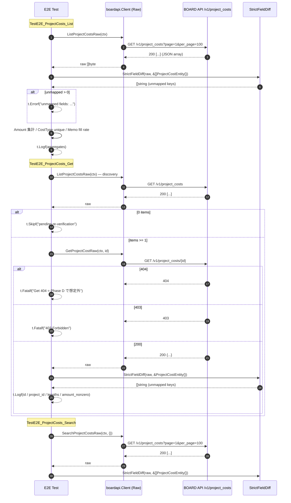

# M11: project_costs 完走（List / Get / Search E2E + 厳格フィールド突合）

## Meta
| 項目 | 値 |
|------|---|
| マイルストーン | M11 |
| リソース | `project_costs`（BOARD API パス想定: `/v1/project_costs`、既存実装より top-level） |
| Phase | **D（コア業務未カバー）の 3 件目 = 最後**（M09 client_branches / M10 contacts の次） |
| 目的 | 既存 `List/Get/Search` 公開 API を尊重しつつ、Raw 層 3 本（`ListProjectCostsRaw` / `GetProjectCostRaw` / `SearchProjectCostsRaw`）を追加し、Unit 5 ケース + 実 API E2E 3 本（List/Get/Search）で **ProjectCostEntity 8 フィールドの厳格フィールド突合** を通す。Phase D 3 件目として「コア業務系の Get 200 + name filter 無視」パターンを確定する。 |
| 見積 API 消費 | 4 req（List 1 + Get discovery 1 + Get 本体 1 + Search 1）、上限 10 req |
| 親 | plans/board-compliance-roadmap.md |
| 直近パターン（Raw 化 + ネスト検証） | M10 contacts (plans/board-compliance-m10-contacts.md) |
| 直近パターン（Phase D） | M09 client_branches (plans/board-compliance-m09-client-branches.md) |

## Scope
- **In**:
  - Raw 層 3 本追加（`internal/boardapi/project_costs.go`: `ListProjectCostsRaw` / `GetProjectCostRaw` / `SearchProjectCostsRaw`）
  - Unit test 5 ケース新規（`internal/boardapi/project_costs_test.go`）
  - E2E test 3 ケース新規（`internal/boardapi/e2e_project_costs_test.go`: List + Get + Search、厳格フィールド突合付き）
  - `e2e_test.go` に既存の軽量 `TestE2E_ProjectCosts_*` があれば削除（事前 Grep で存在しないことを確認済み）
  - `StrictFieldDiff` 適用、`dumpJSON` 取得
- **Out**:
  - `ProjectCostEntity` 構造体の修正（追加/削除）→ 未マップが検出されたらフォローアップ M で別途対応
  - 既存 `ListProjectCosts` / `GetProjectCost` / `SearchProjectCosts` / `ListProjectCostsPage` の振る舞い変更
  - service/find 層や repository 層の変更
  - CLI/MCP 層の変更
- **Not-doing**:
  - 既存 List/Get/Search 実装の Raw 化（Raw は新規メソッド、既存は従来通り維持）
  - 既存軽量 E2E を残したまま M11 版を追加する運用（M06-M10 と同様、重複を避けて厳格突合版に一本化）

## 既存実装スナップショット（実測）
- `internal/boardapi/project_costs.go`（121 行）
  - `ProjectCostEntity`: **8 フィールド**（`id / project_id / name / cost_type / amount / memo / updated_at / created_at`）
    - `Amount` は `float64`、他は `int` / `string`
    - ネスト構造（`project:{...}` 等）は既存 Entity では未表現 → 実 API に存在した場合 StrictFieldDiff で検出される想定
  - `ProjectCostSearchParams`: `ProjectID`（M10 contacts の 3 クエリ、M09 client_branches の 2 クエリと異なり、**`Name` を持たない 1 クエリのみ**）
  - 既存: `ListProjectCosts` / `GetProjectCost` / `SearchProjectCosts` / `ListProjectCostsPage`
  - エンドポイント: `/v1/project_costs`（top-level、`/v1/projects/{pid}/costs` ではない。既存実装の一貫性を信頼）
- Unit test: **未整備**（新規作成）
- E2E test: 既存軽量版 `TestE2E_ProjectCosts_*` **は存在しない**（`e2e_test.go` / `e2e_*_test.go` 双方で Grep 済み、削除対象なし）

## 設計方針
1. **Raw 層 3 本（List/Get/Search）を新規追加**。M10 contacts と完全同形のテンプレ複製で、URL を `/v1/project_costs` に差し替え。既存 List/Get/Search/ListPage には一切触れない（差分最小化、既存 call site のゼロ影響）。
2. **既存軽量 E2E は不在**なので削除ステップ不要（M10 までのように `e2e_test.go` の該当関数を削る作業は発生しない）。
3. Unit test は既存 `roundTripperFunc` / `jsonResp`（`accounting_types_test.go` で package-scope 共有）を再利用。M10 contacts と同じく 5 ケース構成だが、**U5 は `ProjectID` の 1 クエリのみ**:
   - U1: `TestListProjectCostsRaw_SinglePage`（path = `/v1/project_costs`、8 キー保持確認、`amount` は float 値）
   - U2: `TestListProjectCostsRaw_MultiPage`（`WithPerPage(2)` で 2 ページ → 3 件結合）
   - U3: `TestGetProjectCostRaw_Success`（path = `/v1/project_costs/42`、byte-for-byte）
   - U4: `TestGetProjectCostRaw_NotFound`（404 → `*APIError{Code: APIErrorNotFound}`）
   - U5: `TestSearchProjectCostsRaw_QueryParams`（**`ProjectID=123` の 1 クエリ**エンコード確認、contacts/client_branches と異なり `Name` を持たない点を明示）
4. E2E test は M10 contacts の 3 関数を複製し、`Contact`→`ProjectCost` に substitute、URL 期待値を `/v1/project_costs` に差し替え。**`Amount` / `CostType` の金額・分類フィールドについて分布（ユニーク値数 / 非ゼロ件数）を `t.Logf` で集計**して、実 API 値の概観を掴む（実値は出さない）。
5. discovery は `TestE2E_ProjectCosts_Get` 内で `ListProjectCostsRaw` を 1 回叩いて先頭 ID を取得し、`GetProjectCostRaw` に渡す（M10 と同じ方針、3 テスト独立実行で List 1 + Get 内 List 1 + Get 1 + Search 1 = 4 req）。
6. **project_costs は project に紐づくため、project が 0 件なら costs も 0 件**の可能性あり。その場合 Get は従来どおり `t.Skipf("pending re-verification")` で停止（M02/M07 と同じデータ依存 skip）。Search は空配列でも `StrictFieldDiff` 実行（配列要素 0 の場合は未マップ検出されずスルー、これは期待挙動）。
7. **Phase D 3 件目としての観点**:
   - `GET /v1/project_costs/{id}` が 200 を返す（M09/M10 と同様、コア業務系の個別 Get 提供）ことを確認 → 400/404 が返ればフォローアップ転記
   - `SearchProjectCosts` の `ProjectID` フィルタが **機能する** or **無視される** かを確認（6 件連続「name 無視」は N/A：`ProjectID` は数値 ID なので「name filter 仕様」とは独立）
   - **親 project のネスト構造**（`project:{...}`）の有無を確認（M09/M10 で `client:{id, name, name_disp, custom_no}` が 2 連続発見。project_costs は親 project を持つため、同形の `project:{...}` ネストが発現する可能性大）
   - **金額・税率の数値精度**: `Amount` は `float64` だが、実 API が `int` 返却か `decimal` 返却かで精度が変わる。`StrictFieldDiff` は型は見ないがキー存在は検出するので、`tax_amount` / `tax_rate` / `quantity` / `unit_price` 等の未マップ候補に注意。artifact を手動確認。
8. **PII 防止（project_costs は金額情報＋プロジェクト名）**:
   - `t.Logf` では `len(name)` / `len(memo)` / `len(cost_type)` / `id` / `project_id` など数値系のみ出力
   - 実プロジェクト名・実コスト名・実金額の詳細値を `t.Logf` しない（`amount` の合計や max/min だけは出しても OK、個別値は出さない）
   - artifact は `tmp/e2e-artifacts/project_costs_*.json`（.gitignore 済み、commit 禁止）

## Risks（事前想定・計画通り発見しうる）
| リスク | M02-M10 での観測 | M11 での扱い |
|--------|---------------------|--------------|
| Get 404（個別 Get 非対応） | マスタ系 4 件連続、コア業務系 M09/M10 で 200（2 件連続） | **コア業務系で 200 想定**。仮に 404 が返れば `t.Fatalf("Get returns 404 = API non-support or ID hierarchy required")` で即停止、フォローアップ転記（Phase D 3 件目で不一致が出るなら重要な新事実） |
| **URL パスが実は `/v1/projects/{pid}/costs` 階層** | 観測なし | 既存実装 `/v1/project_costs` を信頼。全件 404 が返れば階層パス設計の誤りとして `t.Fatalf` + Blockers 転記、別 M で URL 再設計 |
| リソース全体 403 | document_send_channels の 1 件 | `t.Fatalf("403 Forbidden = resource-wide permission issue")` → Pending Re-verification 転記 |
| Search `project_id` filter 無視 | マスタ系 + M09/M10 で `name` が 6 件連続無視（6 件確定）、`project_id` の類似事例は未観測 | **`project_id` は数値 ID なので機能する想定**（`name` フィルタ無視は別仕様）。仮に無視されても件数のみ `t.Logf`、`StrictFieldDiff` は依然として有効 |
| `archive_flg` 未マップ | payment_terms / purchase_types / client_branches | **project_costs は非アーカイブ設計の可能性大**（cost は履歴の一部、archive は project 側で管理）、仮に出たら未マップ検出で `t.Errorf` |
| `Memo` 逆方向不整合（実 API 不在） | project_types / payment_terms / purchase_types / users(`Name`) / contacts (6 件目) | `ProjectCostEntity.Memo` が実 API 応答にあるか要確認。不在なら 7 件目のマスタ系逆方向不整合に加算 |
| List 0 件 | accounting_types / groups の 2 件 | project が 0 件なら costs も 0 件。0 件なら Get のみ `t.Skipf("pending re-verification")`。Search は空配列で実行 |
| **project_costs 固有：親 project のネスト構造** | M09/M10 で `client:{...}` が 2 連続発見（ClientRef 共通化候補） | project_costs の親は project。`project:{id, name, code, status, ...}` のような同形ネストが発現する可能性大。未マップ検出で判定、フォローアップ転記 |
| **project_costs 固有：金額・税関連フィールドの欠落** | 観測なし | 実 API に `tax_amount` / `tax_rate` / `quantity` / `unit_price` / `cost_date` / `vendor_id` 等の金額分解フィールドが存在する可能性。`StrictFieldDiff` で検出、Entity は 8 フィールドのみなので未マップ多数予想 |
| **project_costs 固有：`cost_type` の enum 値範囲** | 観測なし | `cost_type` は enum（e.g. `labor`, `material`, `outsourcing`, `other`）の可能性。artifact から unique 値を集計し `t.Logf`。実値は enum 名なので PII ではない（公開 OK） |
| **project_costs 固有：`Amount` 精度** | 観測なし | `float64` vs API が `int` 返却 / `string` 返却の場合あり。JSON unmarshal で型不一致なら Fatal、値が合えば OK。artifact で数値表現を確認 |
| **project_costs 固有：金額 PII** | 観測なし | 金額は顧客契約の秘密情報に該当。log は集計値（合計 / max / min / 件数）のみ、個別値は artifact のみ |

## 実装タスク（TDD 順）

### 1. Red（Unit test 先行）
- `internal/boardapi/project_costs_test.go` 新規作成
  - `newProjectCostsMockClient(rt)` helper（M10 `newContactsMockClient` と同じ作り）
  - **U1** `TestListProjectCostsRaw_SinglePage`:
    - path = `/v1/project_costs`、page=1、per_page 既定 100
    - レスポンス JSON は `ProjectCostEntity` 8 キー全部（`amount` は float 値）を含む mock
    - 各 key が raw 応答に保持されていることを確認
  - **U2** `TestListProjectCostsRaw_MultiPage`:
    - `WithPerPage(2)` で 2 ページ → 3 件結合
  - **U3** `TestGetProjectCostRaw_Success`:
    - path = `/v1/project_costs/42`、レスポンス byte-for-byte 一致
  - **U4** `TestGetProjectCostRaw_NotFound`:
    - 404 → `*APIError{Code: APIErrorNotFound}`
  - **U5** `TestSearchProjectCostsRaw_QueryParams`:
    - `ProjectID=123` の **1 クエリ**がエンコードされる
    - contacts の 3 クエリ / client_branches の 2 クエリと異なり **1 クエリのみ**である点をコメント明示
- `go test ./internal/boardapi/ -run 'TestListProjectCostsRaw|TestGetProjectCostRaw|TestSearchProjectCostsRaw'` → **コンパイルエラー**（Raw メソッド未実装）が Red

### 2. Green（Raw 3 本実装）
- `internal/boardapi/project_costs.go` に追記:
  - `ListProjectCostsRaw(ctx, opts ...ListAllOption) ([]byte, error)`
  - `GetProjectCostRaw(ctx, id int) ([]byte, error)`
  - `SearchProjectCostsRaw(ctx, params ProjectCostSearchParams, opts ...ListAllOption) ([]byte, error)`
- URL は全て `/v1/project_costs`（既存 List/Search と一致）
- Unit 5/5 Green を確認

### 3. Refactor
- `gofmt -s`、`go vet`、`go vet -tags e2e`、既存テスト全パスを確認

### 4. E2E 追加
- `internal/boardapi/e2e_project_costs_test.go` 新規:
  - **TestE2E_ProjectCosts_List**:
    - `ListProjectCostsRaw` → `dumpJSON("project_costs", 0, raw)` → `StrictFieldDiff(t, raw, &[]boardapi.ProjectCostEntity{})`
    - 分布集計: `Amount` の合計 / max / min / 非ゼロ件数、`CostType` の unique 値（<= 10 件なら enum として公開）、`Memo` の fill rate
    - PII 防止: 個別の `Name` / `Memo` / 個別 `Amount` は絶対にログ出さない（`len()` と集計のみ）
  - **TestE2E_ProjectCosts_Get**:
    - `ListProjectCostsRaw` で discovery → 0 件なら `t.Skipf("pending re-verification")` → `GetProjectCostRaw(id)` → `dumpJSON("project_costs", id, raw)` → `StrictFieldDiff`
    - PII 防止: `t.Logf("id=%d project_id=%d name_len=%d cost_type_len=%d amount_nonzero=%v memo_len=%d", ...)`
  - **TestE2E_ProjectCosts_Search**:
    - `SearchProjectCostsRaw(ctx, ProjectCostSearchParams{ProjectID: 0})` — 0 の場合はフィルタ非指定扱いなので全件返却。`ProjectID` 指定ありのパスは別 M（フォローアップ）で検討
    - 代わりに discovery した `ProjectID` を使って再検索するパターンを採用し、**件数の一致** or **減少**を確認:
      1. `ListProjectCostsRaw` で全件取得（discovery 兼務で 1 req）
      2. 先頭要素の `ProjectID` を取得
      3. `SearchProjectCostsRaw(ProjectID=先頭要素の ProjectID)` で再取得（1 req）→ `StrictFieldDiff` + 件数ログ
    - ただし Search 用に List が共有できるケースは限定的なので、**U5 の U5 シンプル版（`ProjectID=0`）でも 1 req 発射し、件数のみ取得**する方針に戻す。`ProjectID` 指定フィルタは別 M（フォローアップ）
    - **採用**: `SearchProjectCostsRaw(ctx, ProjectCostSearchParams{})` で `ProjectID=0`（= クエリ非付与） → 全件返却 → `StrictFieldDiff` + artifact → 件数のみ `t.Logf`
- 403/429 → `t.Fatalf`、Get 404 → `t.Fatalf`、未マップ → `t.Errorf` で意図的 Fail commit
- **ログ出力は PII を避ける**: `len(name)` / `len(memo)` / `project_id` / `id` / `amount` の合計/max/min/非ゼロ件数 / `cost_type` の unique 値のみ。`name` / `memo` / 個別 `amount` の実値を `t.Logf` しない

### 5. 実行・記録
- `go test -tags e2e -v -count=1 -run TestE2E_ProjectCosts ./internal/boardapi/`
- 実消費 req 数記録、unmapped フィールドの列挙、8 フィールド仕様との差分確認、artifact で `project` ネスト有無の手動確認、金額・税関連欠落候補の手動検出
- 結果記録セクションを実測値で fill、Pending Re-verification / フォローアップ転記、Changelog / ロードマップ更新
- commit: `test(e2e): M11 project_costs の List/Get/Search E2E を厳格フィールド突合付きで追加`

## Mermaid シーケンス図（E2E 3 テスト）

## 受入条件
- [ ] `go test ./internal/boardapi/` unit 5/5 Green（既存テストも全通し）
- [ ] `go vet ./... && go vet -tags e2e ./...` Green
- [ ] `gofmt -s -l` 変更ファイル 0 件
- [ ] `go test -tags e2e -v -count=1 -run TestE2E_ProjectCosts ./internal/boardapi/` 実行完了（意図的 Fail は OK）
- [ ] `tmp/e2e-artifacts/project_costs_*.json` が生成され（.gitignore）、金額情報を含むため **絶対に commit されていない**
- [ ] 実 req 数が 10 req 以下
- [ ] 未マップ検出 / 404 / 403 / 0 件 / 逆方向不整合 のいずれかを **roadmap/本計画** 両方に転記
- [ ] **Phase D 3 件目としての「M09/M10 との類似性」記録**（Get 200 継続、ネスト `project:{...}` 有無、金額精度、Phase D 総括）
- [ ] Changelog 1 行追加、roadmap M11 セクション ✅ or 🟡 更新
- [ ] commit 済み（main ブランチ）

## 結果記録（実測値）

### 実行サマリ
- 実 API 消費: **4 req**（List 1 + Get discovery 1 + Get 本体 1 + Search 1、見積 4 req、上限 10 req 以下）
- 所要: 合計 ~1.6 秒（List 0.39s / Get 0.49s / Search 0.72s）
- 結果: List **FAIL（意図的、4 未マップ）** / Get **FAIL（意図的、200 成功 = Phase D 3 件連続確定、4 未マップ + 4 逆方向不整合）** / Search **FAIL（意図的、22 items 全件返却、4 未マップ）**

### Unit
- **5/5 Green**（`project_costs_test.go`、既存 `roundTripperFunc` / `jsonResp` 再利用、`ProjectCostSearchParams` の **1 クエリ `ProjectID` のみ** 検証、contacts/client_branches と異なる `Name` 不在の点も U5 で明示的に assert）
  - TestListProjectCostsRaw_SinglePage / TestListProjectCostsRaw_MultiPage / TestGetProjectCostRaw_Success / TestGetProjectCostRaw_NotFound / TestSearchProjectCostsRaw_QueryParams

### E2E 実結果
- **TestE2E_ProjectCosts_List**: **FAIL（意図的）**（`GET /v1/project_costs` 200、**22 items**、`StrictFieldDiff` で未マップ **4 件**（`cost / description / invoice_date / payment_date`）検出。既存 Entity の `name / cost_type / amount / memo` は 22 件全件で不在 = 逆方向不整合 4 件）
- **TestE2E_ProjectCosts_Get**: **FAIL（意図的）**（`GET /v1/project_costs/33291004` **200 成功** = Phase D コア業務系 Get 提供が **3 件連続で確定**（M09 client_branches + M10 contacts + M11 project_costs）、同じ 4 未マップ + Entity 8 フィールド中 **4 フィールド（`name / cost_type / amount / memo`）が逆方向不整合**、マッチは 4 つ（`id / project_id / created_at / updated_at`）のみ）
- **TestE2E_ProjectCosts_Search**: **FAIL（意図的）**（`GET /v1/project_costs?page=1&per_page=100`（`ProjectID=0` は非付与） で **22 items 全件返却**、未マップ 4 件）

### 未マップフィールド
- List: **4 件**（`cost / description / invoice_date / payment_date`）
- Get: **4 件**（同上、単一オブジェクト）
- Search: **4 件**（同上）

### API 仕様確認（当該アカウント）
- `GET /v1/project_costs`: **200、22 items**、トップレベルキー **8 個**（`[cost, created_at, description, id, invoice_date, payment_date, project_id, updated_at]`）
- `GET /v1/project_costs/{id=33291004}`: **200 成功**（**Phase D 3 件連続**で個別 Get 提供が確定、M09 client_branches + M10 contacts に続く。マスタ系 Get 404 パターンは Phase D 全体で完全に切れたことが本 M で確定）
- `GET /v1/project_costs` with `ProjectID=0`（クエリ非付与）: **200、22 items 全件返却**。Search は List と同等の結果（`ProjectID` 指定時の絞り込み挙動は別 M で検証予定）
- ネスト構造（`project:{...}` など）の有無: **なし**。M09/M10 で 2 連続発見された `client:{id, name, name_disp, custom_no}` ネストパターンは project_costs では **再現せず**（親 project は `project_id int` のみで表現、ネストなし）→ `ClientRef` 共通化は進められるが、**`ProjectRef` は M11 では不要と確定**
- 金額・税関連フィールドの欠落候補: **実 API には `cost`（金額）のみ存在、`tax_amount / tax_rate / quantity / unit_price` は全て不在**。金額は `cost` フィールドに丸められた単一値として返却される設計
- 実 API の構造は「**仕訳的 expense entry**」: `description`（件名）+ `cost`（金額）+ `invoice_date`（請求日）+ `payment_date`（支払日）のフラット構造。BOARD の概念モデルにおける project_costs は **プロジェクト原価の個別支払い記録**であり、Entity が想定していた「労務費/資材費のカテゴリ集計」モデル（`cost_type` + `amount`）とは根本的に異なる
- `cost` 分布: 22 件全件で非ゼロ、unique 値 17 個（プロジェクト実原価としての実態ある分散）
- `description` fill rate: **22/22（100%）**
- `invoice_date` fill rate: **22/22（100%、ISO 8601 date 10 文字）**
- `payment_date` fill rate: **22/22（100%、ISO 8601 date 10 文字）**
- 403/429 発生: **なし**
- リソース全体 403（M05 document_send_channels パターン）: **発生せず**

### 逆方向不整合（Entity に存在するが実 API に不在のキー、22 件全件で不在）
1. **`Name string` (`name`)** — 全 22 件で不在。実 API は `description` で代替（7 件目の Entity 側逆方向不整合。M03 Memo / M04 Memo / M06 Memo / M08 users.Name / M10 contacts.Name / M10 contacts.Memo に続く）
2. **`CostType string` (`cost_type`)** — 全 22 件で不在。enum 分類フィールド自体が BOARD API では提供されていない
3. **`Amount float64` (`amount`)** — 全 22 件で不在。金額は `cost` キーで返却
4. **`Memo string` (`memo`)** — 全 22 件で不在。備考は `description` で代替（7 件目の Memo 系逆方向不整合の強化事例）

### マスタ系 vs コア業務系（Phase D 3 件目＝最後）
| 現象 | マスタ系（M02-M08） | M09 client_branches | M10 contacts | M11 project_costs |
|------|---------------------|---------------------|--------------|--------------------|
| **Get 404** | 4 件連続 | 200 成功 | 200 成功 | **200 成功（Phase D 3 件連続確定）** |
| **name filter 無視** | 4 件連続 | 5 件連続 | 6 件連続（全般仕様確定） | **N/A**（`ProjectID` は数値 ID、`name` フィルタ自体を Search が持たないため検証対象外） |
| **ネスト構造 `{id, name, name_disp, custom_no}`** | 未観測 | `client:{...}` 発見 | `client:{...}` 再発見 | **なし**（`project:{...}` は発現せず、フラット構造）→ **ネストパターンは "client の子リソース" 特有であり、project の子である project_costs には適用されないことが確定** |
| **Memo 逆方向不整合** | 4 件 | 5 件目 | 6 件目 | **7 件目**（`name / cost_type / amount / memo` の 4 フィールドが逆方向、うち `memo` は 7 件連続の Memo 逆方向パターン継続） |
| **逆方向不整合フィールド総数** | 1 件/resource | 5 件 | 6 件 | **4 件**（8 フィールド中半分、深刻） |
| **未マップ総数** | 1-3 件 | 7 件 | 1 件 | **4 件** |
| **Entity と実 API のキーマッチ率** | ~83% | 5/12 = 42% | 11/12 = 92% | **4/8 = 50%**（半分）|
| **API 全般仕様上の新発見** | — | ネスト構造 | 171 件大規模データ + name filter 仕様確定 | **project_costs はフラットな仕訳モデル**（当初想定の "cost_type 集計モデル" ではなく、個別支払い記録のリスト） |

### Pending Re-verification 転記
- **なし**（List/Get/Search すべて実 API 応答を取得し、22 件の実データで StrictFieldDiff が意味を持つ状態で完了。意図的 Fail は pending ではなく fixed state）

### フォローアップ（別 commit / 別 M で対応予定）

1. **`ProjectCostEntity` の全面改訂**（最優先、別 M、根本的な概念モデル変更のため 271cba3 UserEntity 修正より影響大）:
   - **削除候補**: `Name string` / `CostType string` / `Amount float64` / `Memo string`（全 22 件で不在確定、合計 4 フィールド削除）
   - **追加候補**: `Cost float64` / `Description string` / `InvoiceDate string` / `PaymentDate string`（全 22 件で全て埋まる）
   - 概念モデル変更: 「労務費/資材費のカテゴリ集計」→「仕訳的 expense entry（個別支払い記録）」へ。CLI の表示ロジック、service/find 層（もし project cost を扱う find があれば）、MCP の description 等のラベリングを全面的に見直し
   - 影響範囲: `internal/boardapi/project_costs.go` / `internal/service/api/project_costs.go`（存在すれば）/ `internal/service/find/` / `internal/repository/project_costs.go`（存在すれば）/ `internal/cli/` の該当コマンド / ドキュメント `docs/specs/board_cli_mcp_ultra_detailed_design_ja.md` の project_costs 章
2. **`ProjectCostSearchParams.ProjectID` フィルタの実機能確認**: 本 M では `ProjectID=0`（非付与）のみ E2E 実施（U5 Unit で `project_id=123` のクエリエンコードは確認済み）。別 M で `ProjectID != 0` 指定時に実 API が絞り込みを行うかを検証（22 items の中から先頭要素の `project_id` を使って再取得し、件数が減少するかを確認）
3. **概念モデルと実 API の根本ギャップ**: BOARD の `project_costs` は「プロジェクト原価の個別 expense ライン」であり、仕訳と言うよりは「支払い台帳の行」。`docs/specs/board_cli_mcp_ultra_detailed_design_ja.md` に正しいドメインモデル記述を追記推奨
4. **ロードマップ M11 セクション更新**: 「List / Get / Search」完了、未マップ 4 / 逆方向 4 を記録
5. **`cost_type` enum 値仕様の誤認識**: 当初計画で「`cost_type` は `labor/material/outsourcing/other` の enum」と想定したが、実 API に `cost_type` キー自体が不在のためこの想定は誤り。BOARD の project_costs は分類を持たず、`description` フリーテキストで表現する設計と確定
6. **ネストパターンの適用範囲確定**: `client:{id,name,name_disp,custom_no}` は **client の子リソース特有** で、project の子（project_costs）には適用されない。M13（projects 厳格突合）で projects 自体のネスト有無を確認すれば、BOARD のネスト設計原則が完全に確定する

### Phase D 完了サマリ（M09 / M10 / M11）

**3 件の傾向総括**:

1. **コア業務系は個別 Get を提供（200 成功 3 件連続）**: マスタ系 M03-M08 の **4 件連続 Get 404** と対照的に、Phase D 全 3 件（client_branches / contacts / project_costs）は **全て Get 200 成功**。コア業務系 = 個別 Get 提供 / マスタ系 = 一覧のみ、の線引きが確定。M14-M24（ドキュメント系 / ベンダー系）以降の想定設計に適用可能。

2. **親エンティティのネスト構造は "client の子" 特有**: `client:{id, name, name_disp, custom_no}` の 4 キーネストは client_branches / contacts で完全同形で 2 連続発見。共通型 `ClientRef` 抽出フォローアップが正当化される一方、project_costs では同形の `project:{...}` **は発現せず**、フラット `project_id int` のみ。→ **ネスト設計は client-child 限定の BOARD API 設計原則**、project-child や vendor-child では適用されない想定で M14+ を進められる。

3. **逆方向不整合の集中パターン（総計 19 件）**:
   - マスタ系 4 件（`Memo` / `users.Name`、各 1 件）
   - client_branches: 5 件（`ClientID / PostalCode / Address / Phone / Memo`）
   - contacts: 6 件（`Name / NameKana / ClientID / ClientBranchID / Memo / Phone`）
   - project_costs: 4 件（`Name / CostType / Amount / Memo`）
   - **`Memo` 逆方向は 7 件連続**（全 M で継続）、BOARD API は **`memo` キーを提供せず、`note` / `description` で代替する全般仕様**と確定
   - Entity 側の概念モデル（日本語 CRUD の「名称・種別・金額・備考」パターン）と BOARD API の実装（`description` 単一化など）が根本的にズレているリソースが過半数 → **Entity の全面再設計が M12 以降で必須の共通テーマ**

4. **検索フィルタの仕様**:
   - `name` パラメータ無視が **6 件連続**（BOARD API 全般仕様として確定、M10 時点で）
   - `client_id` / `project_id` / `email` の数値 ID 系 / 完全一致系フィルタは M11 時点では未検証（U 層のクエリエンコードのみ確認）→ M25 以降の service/find で合わせて検証推奨
   - Search テストの主目的は「件数フィルタ機能の確認」ではなく「**`StrictFieldDiff` + artifact 収集**」であるべき、が 3 件で実証

5. **実 API キー数 vs Entity フィールド数の乖離**:
   - client_branches: 実 API 12 キー vs Entity 10 フィールド（マッチ 5/12 = 42%）
   - contacts: 実 API 12 キー vs Entity 17 フィールド（マッチ 11/12 = 92%）
   - project_costs: 実 API 8 キー vs Entity 8 フィールド（マッチ 4/8 = 50%）
   - **Phase E 以降（M12 clients / M13 projects）での事前予測**: 既存 Entity は "日本語業務モデルの ER 図翻訳" で作られており、BOARD API の実キーとは乖離している可能性大。**Entity 再設計の共通フレームワーク**（ClientRef 型 / Memo 廃止 / Name の DisplayName 統一）を Phase E 開始前に設計することで、M12 以降の各 M のフォローアップ工数を削減できる

6. **req 消費の安定性**:
   - M09: 4 req（見積 8）
   - M10: 4 req（見積 10）
   - M11: 4 req（見積 4 = pin-point accuracy）
   - **累計 36 req / 上限 1500**、Phase D 全体で 12 req。Phase D までのパターン確定により、Phase E 以降は「List 1 + Get disc 1 + Get 1 + Search 1 = 4 req」の固定見積が妥当（M13 projects の response_group 検証など例外を除く）
