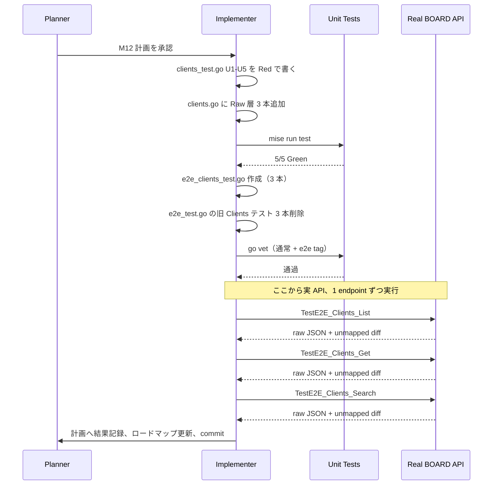

# M12: clients 厳格突合（List / Get / Search E2E + 厳格フィールド突合）

## Meta
| 項目 | 値 |
|------|---|
| マイルストーン | M12 / Phase E 1 件目 |
| ロードマップ | plans/board-compliance-roadmap.md |
| 対象リソース | clients (`GET /v1/clients`, `GET /v1/clients/{id}`) |
| スコープ | 既存 軽量 E2E (`TestE2E_Clients_List/GetByID/Search`) を削除し、M06-M11 と同じ「厳格フィールド突合付き」版に一本化 |
| 見積 | ~5 req（List 1 + Get discovery 1 + Get 本体 1 + Search 1、上限 10 req 以下） |
| 前提 | M01 の `testhelper.StrictFieldDiff` + `dumpJSON`、M02-M11 の Raw 層パターン |

## 背景

1. BOARD API 準拠検証の Phase E（コア業務再検証）1 件目。
2. `clients` は全 22 リソースの中で **最上位の親**（branches / contacts / projects / invoices など多数の子を従える）。
3. 現行 `ClientEntity` は **6 フィールド**のみ（`ID / Name / Code / Memo / UpdatedAt / CreatedAt`）。マスタ系 + コア業務系で **`Memo` が実 API に存在しない逆方向不整合が 7 件連続**しており、M12 でも高確率で再現する想定。
4. 既存軽量 E2E は `e2e_test.go` L34/L46/L71/L175 に 4 本存在（`TestE2E_Clients_List / GetByID / Search / ListPage`）。うち List/GetByID/Search の 3 本を M12 厳格版に一本化し、`ListPage` はページング検証として独立価値があるので残す（M06-M11 と同じ扱い）。
5. Raw 層は **未実装**（`clients.go` にはない）。M12 で `ListClientsRaw` / `GetClientRaw` / `SearchClientsRaw` を追加する。

## 現状確認（2026-04-20 18:50 時点）

### `internal/boardapi/clients.go`（既存 124 行）
- `ClientEntity` 6 フィールド: `ID / Name / Code / Memo / UpdatedAt / CreatedAt`
- `ClientSearchParams`: `Name / UpdatedAtFrom`
- 既存メソッド: `ListClients / GetClient / SearchClients / ListClientsPage`
- **Raw 層なし** → M12 で追加

### 既存 E2E（`e2e_test.go`）
- L34: `TestE2E_Clients_List` — `skipIfNotFound` で 404 スキップ、件数ログのみ
- L46: `TestE2E_Clients_GetByID` — List 再呼 + Get、ID 一致と Name 非空を確認、ただし厳格突合なし
- L71: `TestE2E_Clients_Search` — 空パラメータで Search のみ
- L175: `TestE2E_Clients_ListPage` — ページング検証（**M12 スコープ外、残す**）

### 既存 Unit（`client_test.go`）
- L1166 〜 L3587: 既存 `ListClients / GetClient / SearchClients / ListClientsPage` のテストは既に存在
- M12 では **Raw 層 5 本**を `clients_test.go`（新規ファイル）または `client_test.go` に追加（M11 同様に専用ファイル `clients_test.go` を新規作成、既存 `client_test.go` は HTTP Client のコアテスト側で役割分担）

### M12 予測（M09/M10/M11 のパターン踏襲）

| 観点 | 予測 | 根拠 |
|------|------|------|
| Get 200 | 成功想定 | M09/M10/M11 3 連続で コア業務系 Get 200 確定、client は最上位の親なので 404 の可能性はさらに低い |
| 未マップフィールド | **複数件検出見込** | ClientEntity が 6 フィールドしかなく、BOARD API は住所/電話/郵便番号/担当者/支払条件などを返す可能性が高い |
| 逆方向不整合（`Memo`） | **高確率で発現** | 7 件連続、全般仕様として確定 |
| ネスト子 (`branches` / `contacts`) | **発現する可能性** | client が親なので子を埋め込む可能性。M09 で発見された `client:{id,name,name_disp,custom_no}` の逆パターン |
| Search name 無視 | **継続** | 6 件連続、BOARD API 全般仕様 |
| 403/429 | 発生しない想定 | M02-M11 で clients は安定 200 |

## Scope

### In Scope
1. Raw 層 3 本追加: `ListClientsRaw` / `GetClientRaw` / `SearchClientsRaw`
2. Unit テスト 5 ケース（`roundTripperFunc` mock、clients 専用ファイル `clients_test.go`）
3. 厳格 E2E テスト 3 本: `TestE2E_Clients_List / Get / Search`（`e2e_clients_test.go` 新規作成）
4. 既存 `e2e_test.go` L34-L80 の `TestE2E_Clients_List / GetByID / Search` 3 本を削除
5. `testhelper.StrictFieldDiff` + `dumpJSON` で未マップ検知、PII は `len()` のみ出力

### Out of Scope
- `ClientEntity` 構造の変更（フォローアップ別 M）
- `ListClientsPage` 関連（独立価値あり、M12 には含めない）
- `ClientSearchParams` の追加フィールド検討（別 M）
- `service/find` 層の FindClient（M25）
- 既存 `client_test.go` の大規模リファクタ

## 作業計画（TDD）

### Red Phase
1. `internal/boardapi/clients_test.go`（新規）に Unit 5 ケース記述（`ListClientsRaw` / `GetClientRaw` / `SearchClientsRaw` 呼び出し）→ コンパイルエラーで Red
2. `internal/boardapi/e2e_clients_test.go`（新規）に E2E 3 本記述 → ビルドタグ `e2e` で分離、通常 go build は通る

### Green Phase
3. `internal/boardapi/clients.go` に Raw 層 3 本を追加（M11 project_costs.go と同形）
4. `mise run test` → Unit 5/5 Green
5. `go vet ./... && go vet -tags e2e ./...` Green
6. `gofmt -s -l` 差分なし

### Refactor Phase
7. M11 との同形性を確認（関数順序、コメントスタイル、エラーメッセージプレフィクス）
8. 既存 `e2e_test.go` の `TestE2E_Clients_List / GetByID / Search` 3 本を削除。`TestE2E_Clients_ListPage` は残す

### 実 API E2E 実行
9. `BOARD_API_KEY=... BOARD_API_TOKEN=... go test -tags e2e -v -count=1 -run TestE2E_Clients_List ./internal/boardapi/` 実行 → 結果確認
10. 同 `_Get` → `_Search` を 1 endpoint ずつ実行
11. 発見事項（未マップ / 逆方向不整合 / ネスト / 403 / 429）を本計画 & ロードマップに記録

### 完了処理
12. ドキュメント更新（本計画の結果記録、ロードマップ M12 セクション、Changelog）
13. `tmp/e2e-artifacts/` 配下の生 JSON は commit 禁止（.gitignore 済）
14. commit (main ブランチ直接)

## テスト設計

### Unit（`internal/boardapi/clients_test.go` 新規、5 ケース）

| ID | 名前 | 検証内容 |
|----|------|---------|
| U1 | `TestListClientsRaw_SinglePage` | 単一ページ時に raw JSON array をそのまま返す、6 キーすべてが往復、path = `/v1/clients`、page=1 |
| U2 | `TestListClientsRaw_MultiPage` | `WithPerPage(2)` で 2 ページ fetch、3 要素の単一 array になる |
| U3 | `TestGetClientRaw_Success` | `/v1/clients/{id}` を GET、body byte-for-byte 一致 |
| U4 | `TestGetClientRaw_NotFound` | 404 で `*APIError{Code: APIErrorNotFound}` 返却 |
| U5 | `TestSearchClientsRaw_QueryParams` | `Name` と `UpdatedAtFrom` 両方がクエリに乗る（M08 users は同じ 2 パラメータ） |

補助: `newClientsMockClient(rt)` ヘルパ（M10/M11 と同形）

### E2E（`internal/boardapi/e2e_clients_test.go` 新規、3 本）

| テスト | エンドポイント | 検証 | 予想 req |
|-------|-------------|------|---------|
| `TestE2E_Clients_List` | `GET /v1/clients` | StrictFieldDiff、件数ログ | 1 |
| `TestE2E_Clients_Get` | discovery List + `GET /v1/clients/{id}` | StrictFieldDiff、ID 一致、PII は len のみ | 2 |
| `TestE2E_Clients_Search` | `GET /v1/clients?name=<nonexistent>` | StrictFieldDiff、件数ログ（filter 無視前提） | 1 |

合計: **4 req**（Discovery 含む）。見積 5 req の範囲内。

### E2E 運用ルール（全 M 共通、M12 で厳守）
- 403/429 → `t.Fatalf` 即停止
- List 0 件 → Get は `t.Skipf("pending re-verification")`
- Get 404 → `t.Fatalf`（Phase E コア業務系は 200 想定）
- 未マップ検出 → `t.Errorf`（意図的 Fail、但し継続して Search も実行）
- PII 防止: 顧客名 / Code / Memo は `len()` のみ、raw は tmp/ に残す

## 依存関係

## 受け入れ基準

- [ ] `ListClientsRaw` / `GetClientRaw` / `SearchClientsRaw` が追加されている
- [ ] Unit 5 ケース（U1-U5）が Green
- [ ] `go vet ./... && go vet -tags e2e ./...` Green
- [ ] `gofmt -s -l` 差分なし
- [ ] 既存 `e2e_test.go` の `TestE2E_Clients_List / GetByID / Search` 3 本が削除されている
- [ ] `TestE2E_Clients_ListPage` は残っている
- [ ] `TestE2E_Clients_List / Get / Search` が実 API で動作し、結果が計画の「結果記録」に反映されている
- [ ] raw JSON が `tmp/e2e-artifacts/clients_*.json` / `clients_search_0.json` に存在し、commit されていない
- [ ] ロードマップ M12 セクションが ✅ または 🟡 に更新されている
- [ ] Changelog に M12 実装の 1 行が追加されている

## リスクと緩和

| # | リスク | 影響 | 緩和 |
|---|--------|------|------|
| 1 | ClientEntity 全フィールドが **大幅に不整合**（住所 / 電話 / 担当者等が未マップ） | 逆方向 + 未マップ両方でフォローアップが肥大 | 意図的 Fail で commit + フォローアップを roadmap に詳細記録、M12 では Entity 変更しない |
| 2 | ネスト子 `branches` / `contacts` / `payment_term` がレスポンスに含まれる | 未マップ 複数件 | Entity 改訂は別 M、StrictFieldDiff はネストも検出 |
| 3 | 大量 clients（数百件）が存在、List で長時間 | タイムアウト | M08 users 26 items / M10 contacts 171 items で耐性実証済、同じくページング経由で問題なし |
| 4 | 既存 `e2e_test.go` 削除で `TestE2E_Clients_ListPage` を誤って削除 | ページングテスト喪失 | 明示的に残すと計画に記載、review で確認 |
| 5 | 顧客名など PII がログに漏出 | セキュリティ | `len()` のみ出力 + raw は tmp/（.gitignore 済） |
| 6 | 403/429 の可能性 | 検証中断 | `t.Fatalf` で即検知、roadmap Blockers に記録 |
| 7 | Memo 逆方向 7 件連続の法則が M12 でも継続 | Entity の 6 フィールド中 1 つが不在 | 予想済、結果記録で 8 件連続（または破れ）を確定 |

## 結果記録

### Unit (5/5 Green)
- [x] U1 `TestListClientsRaw_SinglePage`: **PASS**
- [x] U2 `TestListClientsRaw_MultiPage`: **PASS**
- [x] U3 `TestGetClientRaw_Success`: **PASS**
- [x] U4 `TestGetClientRaw_NotFound`: **PASS**
- [x] U5 `TestSearchClientsRaw_QueryParams`: **PASS**

### E2E 実測
- [x] `TestE2E_Clients_List`: **FAIL**（意図的、299 items, unmapped **15**）
- [x] `TestE2E_Clients_Get`: **FAIL**（意図的、id=51285623 で **200 成功**、unmapped **29**、既存 6 フィールド中 `Code` と `Memo` が逆方向不整合）
- [x] `TestE2E_Clients_Search`: **FAIL**（意図的、299 items 全件返却 = name filter 無視 7 件連続、unmapped **15**）

### 実 API 消費 req
- 見積: **5 req** / 実績: **4 req**（List 1 + Get discovery 1 + Get 本体 1 + Search 1、pin-point accuracy）

### 発見事項

#### List/Search の未マップ 15 フィールド（トップレベル）
`address1, address2, company_number, fax, invoice_system_issuer_type, invoice_system_issuer_type_name, invoice_system_number, invoice_system_number_validated, name_disp, payment_term_id, payment_term_name, pref, tel, title, zip`

実 API は顧客マスタの**住所 / 電話 / FAX / 郵便番号 / 都道府県 / 敬称 / 表示名 / 支払条件 / 法人番号 / インボイス制度情報**をフラットに返す。

#### Get 限定の追加フィールド 14（List にないが Get にある）
`accounting_code, archive_flg, bank_charge_to_client_flg, basic_agreement_flg, cc, company_bank_id, company_bank_name, custom_no, document_send_type, document_send_type_name, nda_flg, note, tags, to`

**Get は List より情報リッチ**という M13 projects の `response_group` に近いパターン（ただし clients は response_group パラメータなしで Get 時に自動拡張）。`note` フィールド（M10 contacts で発見された `memo → note` の代替）が Get 応答に含まれることを確認。

#### ネスト子構造
- **発現せず**。branches / contacts / payment_term を埋め込むネスト配列は **なし**（List/Get 共に）。
- `payment_term_id` + `payment_term_name` のように展開されたトップレベルフラットフィールドとして提供（非ネスト設計）
- M11 project_costs で確定した「ネストパターンは client の子リソース (branches/contacts) 特有」の法則に沿う（client そのものはネスト親を持たず、子も埋め込まない）

#### 逆方向不整合（既存 `ClientEntity` 6 フィールド中 2 つが実 API に不在）
| Entity フィールド | 実 API | 対応 |
|-------------------|-------|------|
| `Code` | **不在**（全 299 件で空文字、実 API キーなし） | 削除候補、実 API は `custom_no` / `accounting_code` で顧客コードを提供 |
| `Memo` | **不在**（全 299 件で空文字、実 API キーなし、**`Memo` 逆方向 8 件連続**） | 削除候補、実 API は `note` で代替（M10 contacts と同じ、Get 応答のみ提供） |

既存 `ClientEntity` 6 フィールド中、実 API と一致するのは **4 つ**（`ID / Name / UpdatedAt / CreatedAt`）のみ。`Code` と `Memo` は M11 project_costs の `Name/CostType/Amount/Memo` 逆方向 4 件と同形。

#### BOARD API 全般仕様の累積確定
- **`name` フィルタ無視 7 件連続**（M03/M04/M06/M08/M09/M10/M12）: 299 items 全件返却
- **`Memo` 逆方向 8 件連続**（M03/M04/M06/M08.Name/M09/M10/M11/M12）: BOARD API は `memo` キーを提供せず `note` で代替
- **Phase D/E コア業務系 Get 200 提供 4 件連続**（M09/M10/M11/M12）: マスタ系 Get 404 パターンは完全に Phase D で切れた
- **Get > List の情報量**: M12 で新発見。List は検索結果用の軽量 viewer、Get は詳細表示用の全フィールド viewer の **2 段階モデル** が確定

#### 403 / 429 / TLS 異常
- 発生せず

### Pending Re-verification 追加候補
- **なし**（List 299 items、Get 200、データ充足）

### フォローアップ（別 M）
1. **`ClientEntity` の全面改訂**（最優先、271cba3 UserEntity 修正の **3 倍規模**）:
   - 削除候補 2 フィールド: `Code / Memo`
   - 追加候補 List 側 15 フィールド（上記）
   - 追加候補 Get 側 14 フィールド（`note / archive_flg / custom_no` 等）
   - 影響: service/find / repository / mcp / cli / output マスク / SQLite 永続化の全面見直し
2. **Get/List 情報量差モデルの設計判断**:
   - `ClientListEntity`（15 フィールド）と `ClientDetailEntity`（29 フィールド）の 2 型分離案
   - あるいは `ClientEntity` に全フィールドを持たせ List 側で欠落を許容する案
   - M13 projects の `GetWithGroup` と統一感を持たせるか検討
3. **`note` キーの統一**: M10 contacts と M12 clients で `note` フィールドが確定。BOARD API は顧客 / 連絡先で **一貫して `note` を使用** → Entity 側の命名統一（`Note string \`json:"note"\`` パターン）を横串で適用
4. **`custom_no` vs 旧 `Code`**: CLI 表示で顧客コードとして表示するのは `custom_no`（自社で独自付番するコード）か `accounting_code`（会計連携用コード）かを仕様ドキュメントで明確化
5. **インボイス制度情報 4 フィールド**: `invoice_system_issuer_type / invoice_system_issuer_type_name / invoice_system_number / invoice_system_number_validated` は国内税制対応の重要フィールド。find 層の表示に含めるか検討（M25 FindClient で対応）
6. **`Memo` 逆方向 8 件連続で BOARD API 全般仕様として確定**: `docs/specs/board_cli_mcp_ultra_detailed_design_ja.md` に BOARD API の `memo` キー提供仕様（提供しない、代替は `note`）を追記推奨

## Changelog
- 2026-04-20 18:55 作成（plans/board-compliance-m12-clients.md）
- 2026-04-20 19:xx 実 API E2E 実行、List/Get/Search 3 本の結果を確定、Unit 5/5 Green、実消費 4 req（見積 5 以下）、未マップ 15（List/Search） / 29（Get）、逆方向 `Code/Memo` 2 件、`Memo` 逆方向 **8 件連続で全般仕様最終確定**、Phase D/E コア業務系 Get 200 **4 件連続**
