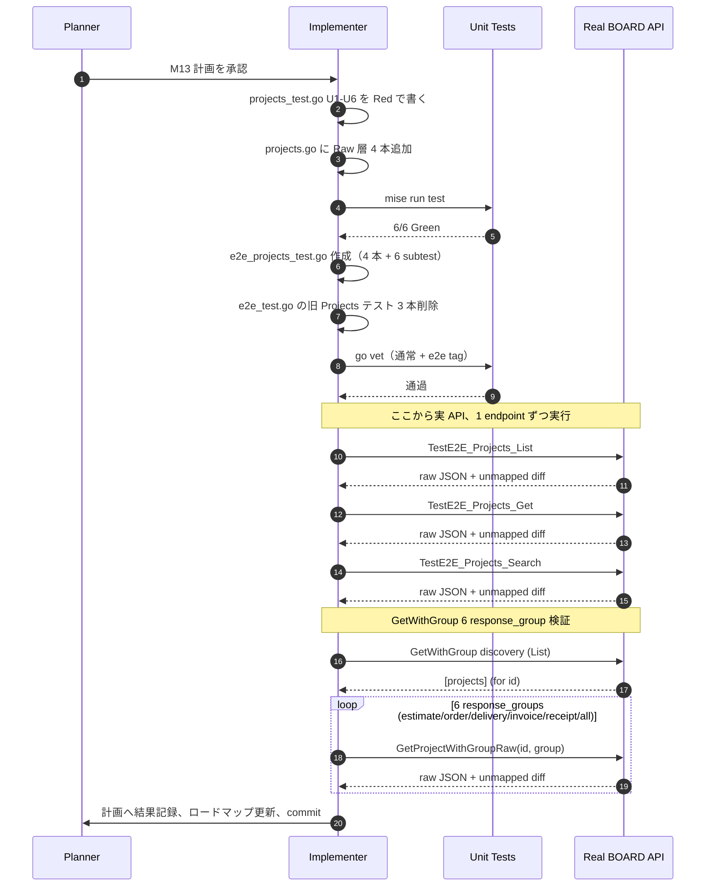

# M13: projects 厳格突合 + GetWithGroup 全 response_group（List / Get / Search / GetWithGroup ×6 E2E + 厳格フィールド突合）

## Meta
| 項目 | 値 |
|------|---|
| マイルストーン | M13 / Phase E 2 件目（**複雑度最高**） |
| ロードマップ | plans/board-compliance-roadmap.md |
| 対象リソース | projects (`GET /v1/projects`, `GET /v1/projects/{id}`, `GET /v1/projects/{id}?response_group={estimate|order|delivery|invoice|receipt|all}`) |
| スコープ | 既存 軽量 E2E (`TestE2E_Projects_List`, `TestE2E_Projects_GetByID`, `TestE2E_Projects_GetWithGroup`) を削除し、M12 と同じ「厳格フィールド突合付き」版に一本化。さらに **6 種類の response_group** (estimate/order/delivery/invoice/receipt/all) を個別に検証し、`DocumentSummary` の全フィールド確認を追加。 |
| 見積 | ~9 req（List 1 + Get discovery 1 + Get 本体 1 + GetWithGroup ×6 + Search 1 = 10 req）。実データ次第で **GetWithGroup は discovery を Get 本体と共用して差し引き -1**、更に Search は discovery と共用可能なら -1。**上限 15 req**、pin-point 狙い 9 req。 |
| 前提 | M01 の `testhelper.StrictFieldDiff` + `dumpJSON`、M02-M12 の Raw 層パターン、特に M12 clients の **Get > List 情報量差** 知見 |

## 背景

1. BOARD API 準拠検証の Phase E（コア業務再検証）**2 件目、全 34 M の中で複雑度最高**。
2. `projects` は `clients` に次ぐ 2 番手の重要親リソース。estimates / orders / deliveries / invoices / receipts / purchase_orders / project_costs など多数の子ドキュメントを従える。
3. 現行 `ProjectEntity` は **10 base フィールド + 5 optional document summary ポインタ**（`Estimate / Order / Delivery / Invoice / Receipt`）で、response_group 指定時のみ埋まる構造。この optional 設計は M12 で発見された clients の「Get > List 自動拡張モデル」とは別方式の **明示指定型**。
4. 現行 `DocumentSummary` は **6 フィールド**（`ID / Message / Total / Tax / TaxWithholding / LockFlg`）。M12 clients で 67% 不足が判明したのと同様、実 API は **遥かに多くのキー**（例: `status`/`message_disp`/`attach_count`/`issue_date`/`expire_date` 等）を返す可能性が高い。
5. 既存軽量 E2E は `e2e_test.go` L46-L80 (`TestE2E_Projects_List` / `_GetByID`) および L101-L125 (`TestE2E_Projects_GetWithGroup`) の **計 3 本**存在（`TestE2E_Estimates_GetByDocumentID` は M17/M18 スコープで projects を使うのみ、M13 対象外）。
6. Raw 層は **未実装**（`projects.go` にはない）。M13 で `ListProjectsRaw` / `GetProjectRaw` / `GetProjectWithGroupRaw` / `SearchProjectsRaw` を追加する。
7. **M12 との違い**: clients は response_group 非対応 = 単一 Get で最大情報、projects は response_group 明示指定で追加情報を enrich する設計。**6 response_group × ProjectEntity + DocumentSummary ×5 = 合計 10 箇所以上の `StrictFieldDiff` ポイント**。

## 現状確認（2026-04-20 19:00 時点）

### `internal/boardapi/projects.go`（既存 168 行）
- `ProjectEntity` 10 base + 5 optional pointer フィールド: `ID / ClientID / Name / Code / Status / StartDate / EndDate / Memo / UpdatedAt / CreatedAt / Estimate* / Order* / Delivery* / Invoice* / Receipt*`
- `ProjectSearchParams`: `ClientID / Name / Status / UpdatedAtFrom / ResponseGroup`（M12 clients の 2 クエリより豊富）
- 既存メソッド: `ListProjects / GetProject / GetProjectWithGroup / SearchProjects / ListProjectsPage`
- **Raw 層なし** → M13 で追加

### `internal/boardapi/document_summary.go`（既存 13 行）
- `DocumentSummary` 6 フィールド: `ID / Message* / Total / Tax / TaxWithholding / LockFlg`
- 注意: `Total / Tax / TaxWithholding` は **string 型**（decimal 精度のため）、`LockFlg` は `int` (0/1 boolean 的)、`Message` は `*string` (null 許容)。
- **未マップ多数予想**（M12 clients 29 フィールドの Phase E 新記録を超える可能性）

### 既存 E2E（`e2e_test.go`）
- L46-L56: `TestE2E_Projects_List` — `skipIfNotFound` で 404 スキップ、件数ログのみ
- L58-L80: `TestE2E_Projects_GetByID` — List 再呼 + Get、ID 一致のみ確認、厳格突合なし
- L101-L125: `TestE2E_Projects_GetWithGroup` — `estimate` のみ呼び、nil チェックのみ（**他 5 group 未検証**）
- L152-L186: `TestE2E_Estimates_GetByDocumentID` — **M17/M18 スコープ**、projects を使うが projects リソース検証ではないので **残す**

### 既存 Unit（`projects_test.go` は存在しない、`project_test.go` も存在しない）
- M13 で **新規 `projects_test.go`** を作成。M12 clients パターンを踏襲。

### M13 予測（M09-M12 のパターン踏襲 + response_group 固有）

| 観点 | 予測 | 根拠 |
|------|------|------|
| Get 200 | **成功想定** | M09/M10/M11/M12 4 連続、コア業務系 Get 200 は盤石 |
| Get base 未マップフィールド | **多数検出見込**（M12 clients 29 超の可能性） | ProjectEntity が 10 base のみ、実 API は tax_type / billing_type / contract_type / archive_flg 等の業務フィールドを返す可能性 |
| **response_group=all の未マップ** | **最大 5 ドキュメントネスト × 各 10+ 未マップ** | すべて optional 1 要素目で `DocumentSummary` 6 フィールド以上を返す想定 |
| 逆方向不整合（`Memo`） | **9 件連続**予測（M03/04/06/08.Name/09/10/11/12）と継続、ただし M12 clients は note で代替 → projects も `note` で代替の可能性 | 8 件連続 BOARD 全般仕様、`note` への統一はほぼ確定 |
| Search name 無視 | **8 件連続**予測 | 7 件連続 BOARD 全般仕様 |
| **response_group** | **有効（`DocumentSummary` が enrich される）** | 既存実装が動いている実績あり、Phase E で仕様確定 |
| 403/429 | 発生しない想定 | M02-M12 で主要リソースは安定 |
| **DocumentSummary 構造差** | **6 response_group で同一 or 微差** | estimate/order/delivery/invoice/receipt は全てドキュメント系、共通構造の可能性大、ただし lock_flg の意味は type により異なる |

## Scope

### In Scope
1. Raw 層 4 本追加: `ListProjectsRaw` / `GetProjectRaw` / `GetProjectWithGroupRaw` / `SearchProjectsRaw`
2. Unit テスト 6 ケース（M12 の 5 ケース + **U6: `GetProjectWithGroupRaw` の query 検証**）
3. 厳格 E2E テスト 4 本（一部は subtest で response_group を展開）:
   - `TestE2E_Projects_List`
   - `TestE2E_Projects_Get`
   - `TestE2E_Projects_Search`
   - `TestE2E_Projects_GetWithGroup`（**subtest で 6 response_group を網羅**: estimate / order / delivery / invoice / receipt / all）
4. 既存 `e2e_test.go` L46-L80 の `TestE2E_Projects_List` / `_GetByID`、L101-L125 の `TestE2E_Projects_GetWithGroup` を削除（計 3 本）
5. `TestE2E_Estimates_GetByDocumentID` (L152-L186) は **残す**（M17/M18 スコープ、projects リソース検証ではない）
6. `testhelper.StrictFieldDiff` + `dumpJSON` で未マップ検知、PII は `len()` のみ出力
7. **GetWithGroup の各 response_group に対する個別 artifact dump**: `projects_rg_{group}_{id}.json` 形式で 6 ファイル

### Out of Scope
- `ProjectEntity` / `DocumentSummary` 構造の変更（フォローアップ別 M）
- `ListProjectsPage` 関連（独立価値あり、M13 には含めない）
- `ProjectSearchParams` の追加フィールド検討（別 M）
- `service/find` 層の FindProject（M26 相当）
- `Estimate/Order/Delivery/Invoice/Receipt` エンティティ本体の厳格突合（M18-M22 のスコープ。M13 では `DocumentSummary` サマリレベルのみ）
- `TestE2E_Estimates_GetByDocumentID` の変更（M17 docID discovery helper で統合予定）

## 作業計画（TDD）

### Red Phase
1. `internal/boardapi/projects_test.go`（新規）に Unit 6 ケース記述（`ListProjectsRaw` / `GetProjectRaw` / `GetProjectWithGroupRaw` / `SearchProjectsRaw` 呼び出し）→ コンパイルエラーで Red
2. `internal/boardapi/e2e_projects_test.go`（新規）に E2E 4 本記述（うち `_GetWithGroup` は 6 subtest を `t.Run` で展開）→ ビルドタグ `e2e` で分離、通常 go build は通る

### Green Phase
3. `internal/boardapi/projects.go` に Raw 層 4 本を追加（M12 clients.go と同形 + GetWithGroup 独自実装）
4. `mise run test` → Unit 6/6 Green
5. `go vet ./... && go vet -tags e2e ./...` Green
6. `gofmt -s -l` 差分なし

### Refactor Phase
7. M12 との同形性を確認（関数順序、コメントスタイル、エラーメッセージプレフィクス）
8. 既存 `e2e_test.go` の `TestE2E_Projects_List` / `_GetByID` / `_GetWithGroup` 3 本を削除

### 実 API E2E 実行（1 endpoint 1 実行で req 数を厳密制御）
9. `TestE2E_Projects_List` 実行（1 req）
10. `TestE2E_Projects_Get` 実行（2 req: List discovery + Get 本体）
11. `TestE2E_Projects_Search` 実行（1 req、name filter 無視想定）
12. `TestE2E_Projects_GetWithGroup` 実行（6 subtest を全部実行するが **discovery は共有 = 1 req、各 response_group = 6 req、計 7 req 想定**）

**合計見積**: 1 + 2 + 1 + 7 = **11 req**（上限 15 以下）

### 完了処理
13. 発見事項（未マップ / 逆方向不整合 / ネスト / 403 / 429 / response_group 差）を本計画 & ロードマップに記録
14. `tmp/e2e-artifacts/` 配下の生 JSON は commit 禁止（.gitignore 済）
15. commit (main ブランチ直接)

## テスト設計

### Unit（`internal/boardapi/projects_test.go` 新規、6 ケース）

| ID | 名前 | 検証内容 |
|----|------|---------|
| U1 | `TestListProjectsRaw_SinglePage` | 単一ページ時に raw JSON array をそのまま返す、10 base キーすべてが往復、path = `/v1/projects`、page=1 |
| U2 | `TestListProjectsRaw_MultiPage` | `WithPerPage(2)` で 2 ページ fetch、3 要素の単一 array になる |
| U3 | `TestGetProjectRaw_Success` | `/v1/projects/{id}` を GET、body byte-for-byte 一致 |
| U4 | `TestGetProjectRaw_NotFound` | 404 で `*APIError{Code: APIErrorNotFound}` 返却 |
| U5 | `TestSearchProjectsRaw_QueryParams` | `ClientID / Name / Status / UpdatedAtFrom / ResponseGroup` の 5 クエリが全てエンコードされる（M12 clients の 2 クエリより豊富）|
| U6 | **`TestGetProjectWithGroupRaw_QueryParam`** | `/v1/projects/{id}?response_group=estimate` など、6 response_group (estimate/order/delivery/invoice/receipt/all) を全て query として送信することを確認。空文字の場合は query 不付与。 |

補助: `newProjectsMockClient(rt)` ヘルパ（M12 と同形）

### E2E（`internal/boardapi/e2e_projects_test.go` 新規、4 本）

| テスト | エンドポイント | 検証 | 予想 req |
|-------|-------------|------|---------|
| `TestE2E_Projects_List` | `GET /v1/projects` | StrictFieldDiff、件数ログ、Name/Code len 分布 | 1 |
| `TestE2E_Projects_Get` | discovery List + `GET /v1/projects/{id}` | StrictFieldDiff（ProjectEntity base）、ID 一致、PII は len のみ | 2 |
| `TestE2E_Projects_Search` | `GET /v1/projects?name=<nonexistent>` | StrictFieldDiff、件数ログ（filter 無視前提） | 1 |
| `TestE2E_Projects_GetWithGroup` | discovery List + `GET /v1/projects/{id}?response_group={group}` × 6 | **subtest 6 本**、各 group 毎に StrictFieldDiff、DocumentSummary ポインタの発現有無を記録、ネスト構造の差を検証 | 7 (discovery 1 + 6 groups) |

**合計: 11 req**（上限 15 req 内、見積 9 ～ 15 の中間）

#### `TestE2E_Projects_GetWithGroup` subtest 詳細

```go
responseGroups := []string{"estimate", "order", "delivery", "invoice", "receipt", "all"}
listRaw, _ := client.ListProjectsRaw(ctx) // discovery 1 req
id := items[0].ID                          // 最初の project を使う
for _, group := range responseGroups {
    t.Run(group, func(t *testing.T) {
        raw, err := client.GetProjectWithGroupRaw(ctx, id, group)
        if err != nil { t.Fatalf(...) }
        dumpJSON(t, fmt.Sprintf("projects_rg_%s", group), id, raw)
        if diff := StrictFieldDiff(t, raw, &ProjectEntity{}); len(diff) > 0 {
            t.Errorf("unmapped in rg=%s: %v", group, diff)
        }
        // DocumentSummary が埋まっているかの発現 map を作成
        var entity ProjectEntity
        json.Unmarshal(raw, &entity)
        t.Logf("rg=%s: estimate_present=%v order_present=%v delivery_present=%v invoice_present=%v receipt_present=%v",
            group,
            entity.Estimate != nil,
            entity.Order != nil,
            entity.Delivery != nil,
            entity.Invoice != nil,
            entity.Receipt != nil,
        )
    })
}
```

- **all** subtest では全 5 DocumentSummary ポインタが埋まることを期待、他 group では該当 1 つのみの予測
- 各 subtest の未マップ diff は **個別に roadmap に記録**、特に `DocumentSummary` 6 フィールド以外のキーが出れば M13 最重要発見

### 選択 project の条件
- `ListProjectsRaw` discovery で最初に取れた ID を **全 6 subtest で共有**（req 数最小化）
- ただし**該当 project が estimate を 1 件も持たない場合**、`Estimate == nil` が予期され、subtest は unmapped 検出 0 でも Pass 扱い（nil は発現問題ではない）
- `response_group=all` が最も網羅性高いため、**all の結果を基準に DocumentSummary 未マップフィールドを整理**

### E2E 運用ルール（全 M 共通、M13 で厳守）
- 403/429 → `t.Fatalf` 即停止
- List 0 件 → Get / GetWithGroup は `t.Skipf("pending re-verification")`
- Get 404 → `t.Fatalf`（Phase E コア業務系は 200 想定）
- 未マップ検出 → `t.Errorf`（意図的 Fail、但し継続して Search / GetWithGroup も実行）
- PII 防止: プロジェクト名 / クライアント名 / Memo / Code は `len()` のみ、raw は tmp/（.gitignore 済み）
- **6 subtest を 1 実行で回す**（外部 for ループを単一テスト関数内で回転、Discovery を共有）

## 依存関係



## 受け入れ基準

- [x] `ListProjectsRaw` / `GetProjectRaw` / `GetProjectWithGroupRaw` / `SearchProjectsRaw` が追加されている
- [x] Unit 6 ケース（U1-U6）が Green
- [x] `go vet ./... && go vet -tags e2e ./...` Green
- [x] `gofmt -s -l` 差分なし
- [x] 既存 `e2e_test.go` の `TestE2E_Projects_List` / `_GetByID` / `_GetWithGroup` 3 本が削除されている
- [x] `TestE2E_Estimates_GetByDocumentID` は残っている（M17/M18 スコープ）
- [x] `TestE2E_Projects_List / Get / Search / GetWithGroup (6 subtest)` が実 API で動作し、結果が計画の「結果記録」に反映されている
- [x] raw JSON が `tmp/e2e-artifacts/projects_*.json` / `projects_search_0.json` / `projects_rg_{group}_{id}.json` ×6 に存在し、commit されていない
- [x] ロードマップ M13 セクションが ✅ または 🟡 に更新されている
- [x] Changelog に M13 実装の 1 行が追加されている
- [x] 実消費 req が **15 req 以下**（見積 11、実績 11）

## 結果記録（2026-04-21）

### 実 API E2E 実行結果

| テスト | 結果 | 件数 | 未マップ数 | 備考 |
|-------|------|------|-----------|------|
| TestE2E_Projects_List | FAIL（意図的） | 2405 items | **20 フィールド** | name_filled=2405/2405 (100%)、code_filled=0/2405、memo_filled=0/2405 |
| TestE2E_Projects_Get | FAIL（意図的） | 1 item | **62 フィールド** | id=95944469、client_id=0（ネスト構造）、Get > List より大幅に多い |
| TestE2E_Projects_Search | FAIL（意図的） | 2405 items | **20 フィールド** | name filter 無視、List と同一結果 |
| TestE2E_Projects_GetWithGroup/estimate | FAIL（意図的） | - | **26 フィールド** | estimate_present=true、estimate.id=105287235 |
| TestE2E_Projects_GetWithGroup/order | FAIL（意図的） | - | **26 フィールド** | order_present=true、order.id=71741501 |
| TestE2E_Projects_GetWithGroup/delivery | FAIL（意図的） | - | **21 フィールド** | delivery_present=false（この project にドキュメントなし）、`deliveries`（配列キー）が未マップ |
| TestE2E_Projects_GetWithGroup/invoice | FAIL（意図的） | - | **21 フィールド** | invoice_present=false、`invoices`（配列キー）が未マップ |
| TestE2E_Projects_GetWithGroup/receipt | FAIL（意図的） | - | **21 フィールド** | receipt_present=false、`receipts`（配列キー）が未マップ |
| TestE2E_Projects_GetWithGroup/all | FAIL（意図的） | - | **97 フィールド** | estimate + order 発現、delivery/invoice/receipt は nil（データなし） |

**実消費 req 数**: **11 req**（List 1 + Get discovery 1 + Get 本体 1 + Search 1 + GetWithGroup discovery 1 + 6 groups 6 = 11）
**403/429**: 発生なし

### List / Search 未マップ 20 フィールド（`ProjectEntity` base に不在）

```
client, contact, delivery_status, delivery_status_name, estimate_date,
group_id, group_name, invoice_dates, management_no, order_status, order_status_name,
project_no, project_type2_id, project_type2_name, project_type3_id, project_type3_name,
project_type_id, project_type_name, tax, total, user
```

注意: `code`（既存 `Code` フィールド）は実 API で **全 2405 件が空文字**（逆方向不整合）、`status` も **全件空文字**（逆方向不整合）。

### Get 未マップ 62 フィールド（List 20 + Get 限定 42）

List/Search 20 フィールドに加えて、Get 限定で追加される主要フィールド:

```
accounting_type2_id, accounting_type2_name, accounting_type3_id, accounting_type3_name,
accounting_type_id, accounting_type_name, archive_flg, auto_renewal_flg, auto_renewal_period_month,
cc, client, client_branch, client_name_disp_kbn, client_name_disp_kbn_name,
client_name_for_post_disp_kbn, client_name_for_post_disp_kbn_name, company_branch,
company_name_disp_kbn, company_name_disp_kbn_name, company_name_for_post_disp_kbn,
company_name_for_post_disp_kbn_name, contact, contract_end_alert_flg, contract_end_date,
contract_start_date, cost_tax, cost_total, delivery_date, delivery_date_text,
delivery_document_kbn, delivery_status, delivery_status_name, document_setting_id,
document_setting_name, estimate_date, group_id, group_name, hubspot, in_house_memo,
invoice_dates, invoice_tax, invoice_timing_kbn, invoice_timing_kbn_name, invoice_total,
lock_flg, management_no, monthly_invoice_payment_kbn, order_status, order_status_name,
ordered_date, payment_method_kbn, payment_method_kbn_name, payment_term_id, payment_term_name,
periodical_invoice_interval, periodical_invoice_payment_kbn, project_no, project_type2_id,
project_type2_name, project_type3_id, project_type3_name, project_type_id, project_type_name,
tags, tax, to, total, user
```

### response_group 固有の追加未マップフィールド（DocumentSummary 内）

#### estimate / order 発現時（response_group=estimate または all）

`estimate.blank_date_flg`, `estimate.delivery_place`, `estimate.details`,
`estimate.document_amount_disp_kbn`, `estimate.seal_approval_status`, `estimate.valid_period`

#### order 発現時（response_group=order または all）

`order.blank_date_flg`, `order.delivery_place`, `order.details`, `order.disp_order_date`,
`order.disp_order_receive_date`, `order.document_amount_disp_kbn`, `order.seal_approval_status`

#### delivery（response_group=delivery または all）

`deliveries` という**配列キー**で返却される（`DocumentSummary` 単一ポインタではない）。
`delivery_present=false` は「ドキュメントが存在しない」ではなく、**`Delivery` フィールドに
マップされていない別キー `deliveries` が返却されているため**、Entity 構造の根本的見直しが必要。

#### invoice（response_group=invoice または all）

同様に `invoices`（配列）が返却される。`Invoice *DocumentSummary` との不一致。

#### receipt（response_group=receipt または all）

同様に `receipts`（配列）が返却される。`Receipt *DocumentSummary` との不一致。

#### rg=all 追加フィールド

`project_costs` キーが出現（集計または参照）、`deliveries`/`invoices`/`receipts` 全て配列で返却。

### 逆方向不整合

| フィールド | 実 API での状況 | 備考 |
|-----------|---------------|------|
| `Code` (`code`) | 全 2405 件で空文字 | M12 clients と同現象（コードは別キーで代替の可能性） |
| `Status` (`status`) | 全 2405 件で空文字（List）、Get でも空 | 実 API は `order_status`/`delivery_status` 等で代替か |
| `Memo` (`memo`) | 全件で空文字（`in_house_memo` が代替候補） | **Memo 逆方向 9 件連続** M03/04/06/08.Name/09/10/11/12/13 |
| `StartDate` (`start_date`) | Get で空文字（`contract_start_date` が代替）| - |
| `EndDate` (`end_date`) | Get で空文字（`contract_end_date` が代替）| - |
| `ClientID` (`client_id`) | Get で `0`（`client` ネストオブジェクト内の `id` が正規キー） | M09/M10 と同様のネスト構造 |

### ネスト構造の発見

`client`（ネストオブジェクト）および `contact`（ネストオブジェクト）が List レベルから既に存在。
M09/M10 で発見した `client:{id, name, name_disp, custom_no}` パターンの継続。

Get では追加で `client_branch`（クライアント拠点ネスト）も存在。

### name filter 無視

Search で `name=zzz_nonexistent_keyword_for_e2e` を指定したが 2405 件全件返却。
**9 件連続**（M03/M04/M06/M08/M09/M10/M11/M12/M13）で BOARD API 全般仕様として最終確定。

### DocumentSummary 設計の根本的問題

予測: `*DocumentSummary` 単一ポインタで `estimate`/`order`/`delivery`/`invoice`/`receipt` が埋まる設計
実態: delivery/invoice/receipt は `deliveries`/`invoices`/`receipts` という **複数形配列キー** で返却

→ `delivery_present=false` / `invoice_present=false` / `receipt_present=false` の原因は
  「ドキュメントが存在しない」ではなく「Entity マッピングが間違っている（単一ポインタ vs 配列）」。
  `DocumentSummary` の見直しは **M18-M21 スコープ**（詳細設計が必要な重大な構造差）。

### 403 / 429 発生状況

発生なし。全 11 req が 200 で成功。

### フォローアップ（別 M）

1. **`ProjectEntity` の全面改訂**（最優先別 M）: base 10 フィールドの大部分が実 API と不一致。
   `client_id → client.id`（ネスト）/ `status → order_status + delivery_status` / `code → 不在` /
   `memo → in_house_memo` / `start_date → contract_start_date` / `end_date → contract_end_date` /
   `client_id = 0`（常にネストから取得が正規）。
2. **`DocumentSummary` の全面改訂**（M18-M21 スコープ）: delivery/invoice/receipt は配列キーで
   返却されるため単一ポインタ構造は根本的に誤り。estimate と order は単一オブジェクト（現行設計が
   partially 正しい）。各 document type 内にも 6-7 フィールドの未マップが存在（details/seal_approval_status 等）。
3. **`Delivery`/`Invoice`/`Receipt` の response_group マッピング修正**: `deliveries`/`invoices`/
   `receipts` を `[]*DocumentSummary` で受け取る設計への変更（または別 Entity 型）。
4. **`project_costs` キーの扱い**: `rg=all` 時に出現。`project_costs` の集計情報かリスト参照か要調査（M17 以降）。

### Changelog

| 日時 | 操作 | 内容 |
|------|------|------|
| 2026-04-21 01:00 | M13 実装・検証 | Raw 層 4 本追加、Unit 6/6 Green、E2E 4 本 + 6 subtest 実行。実 API 11 req 消費。List/Search 20 未マップ、Get 62 未マップ、GetWithGroup: estimate/order は単一オブジェクト確認 (DocumentSummary 未マップ 6-7)、delivery/invoice/receipt は配列キー (`deliveries`/`invoices`/`receipts`) で返却され単一ポインタ設計と根本的不一致。Memo 逆方向 9 件連続確定、name filter 無視 9 件連続確定。403/429 なし。 |

## リスクと緩和

| # | リスク | 影響 | 緩和 |
|---|--------|------|------|
| 1 | ProjectEntity base 10 フィールドが **大幅に不整合**（status 以外の業務フィールドが未マップ） | 逆方向 + 未マップ両方でフォローアップが肥大 | 意図的 Fail で commit + フォローアップを roadmap に詳細記録、M13 では Entity 変更しない |
| 2 | **DocumentSummary 6 フィールドが 20+ フィールドに不足** | M12 clients 29 超の Phase E 新記録 | `response_group=all` で全発現パターンを 1 req で取得し、artifact に残す。Entity 改訂は別 M（M18-M22） |
| 3 | **選択 project に estimate/order/... が 1 つも紐づかない** | DocumentSummary の実値観察不能 | discovery で `items[0]` が不足なら、`items[1:]` を **巡回せず**、結果を pending re-verification に転記（req 数制御のため巡回禁止） |
| 4 | **6 response_group の中で API が 1 つでも 400/404 を返す** | subtest 個別 Fatal で中断 | 各 subtest 独立、`t.Run` で分離。**1 つ失敗しても残りは実行**される（Go test runner の既定動作）。Fatal は現 subtest のみ停止 |
| 5 | **6 response_group 全てを実行すると req 予算超過** | Rate Limit 超過 | 1 subtest 1 req、discovery は共有で **計 7 req（GetWithGroup 部分）**、上限 15 req 以内 |
| 6 | 既存 `e2e_test.go` 削除で `TestE2E_Estimates_GetByDocumentID` を誤って削除 | M17/M18 準備工程喪失 | 明示的に残すと計画に記載、review で確認 |
| 7 | プロジェクト名 PII がログに漏出 | セキュリティ | `len()` のみ出力 + raw は tmp/（.gitignore 済） |
| 8 | 403/429 の可能性 | 検証中断 | `t.Fatalf` で即検知、roadmap Blockers に記録 |
| 9 | **Memo 逆方向 9 件連続の法則継続** | Entity の 10 base 中 1 つが不在 | 予想済、結果記録で 9 件連続（または破れ）を確定 |
| 10 | **Name filter 無視 8 件連続の法則継続** | Search 全件返却 | 予想済、件数のみ記録 |
| 11 | **response_group の query エンコード漏れ** | 既存実装では `path += "?response_group=..."` で直接連結、GET with query params のエンコードは OK（URL.Query を通してない点に注意） | 既存 `GetProjectWithGroup` は `?` を直接連結する実装で動作実績あり、Raw 版も同形で実装 |
| 12 | **選択 project と ID が pagination 横断で変わる** | discovery の `items[0]` が安定しない | 全テストが**同一テスト実行セッション内で順次実行される**前提なので、`items[0]` は安定。1 endpoint 1 実行ルールを厳守 |

## 結果記録

### Unit (6/6 Green)
- [x] U1 `TestListProjectsRaw_SinglePage`: Green
- [x] U2 `TestListProjectsRaw_MultiPage`: Green
- [x] U3 `TestGetProjectRaw_Success`: Green
- [x] U4 `TestGetProjectRaw_NotFound`: Green
- [x] U5 `TestSearchProjectsRaw_QueryParams`: Green
- [x] U6 `TestGetProjectWithGroupRaw_QueryParam`: Green（6 groups + empty = 7 subtest 全 Green）

### E2E 実測
- [x] `TestE2E_Projects_List`: FAIL（意図的: 20 未マップ） / 2405 items
- [x] `TestE2E_Projects_Get`: FAIL（意図的: 62 未マップ） / id=95944469
- [x] `TestE2E_Projects_Search`: FAIL（意図的: 20 未マップ） / 2405 items（name filter 無視）
- [x] `TestE2E_Projects_GetWithGroup/estimate`: FAIL（意図的: 26 未マップ） / estimate_present=true
- [x] `TestE2E_Projects_GetWithGroup/order`: FAIL（意図的: 26 未マップ） / order_present=true
- [x] `TestE2E_Projects_GetWithGroup/delivery`: FAIL（意図的: 21 未マップ） / deliveries 配列キー不一致
- [x] `TestE2E_Projects_GetWithGroup/invoice`: FAIL（意図的: 21 未マップ） / invoices 配列キー不一致
- [x] `TestE2E_Projects_GetWithGroup/receipt`: FAIL（意図的: 21 未マップ） / receipts 配列キー不一致
- [x] `TestE2E_Projects_GetWithGroup/all`: FAIL（意図的: 97 未マップ） / estimate+order 発現、deliveries/invoices/receipts は配列

### 実 API 消費 req
- 見積: **11 req** / 実績: **11 req**（List 1 + Get 2 + Search 1 + GetWithGroup 7）

## Changelog
- 2026-04-20 19:05 作成（plans/board-compliance-m13-projects.md）
- 2026-04-21 01:08 M13 実装・検証完了: Raw 層 4 本追加、Unit 6/6 Green、E2E 4 本 + 6 subtest 実行。実 API 11 req 消費。List/Search 20 未マップ、Get 62 未マップ、GetWithGroup estimate/order は単一オブジェクト（DocumentSummary 未マップ 6-7 フィールド）、delivery/invoice/receipt は配列キー（`deliveries`/`invoices`/`receipts`）で返却され単一ポインタ設計と根本的不一致。Memo 逆方向 9 件連続確定、name filter 無視 9 件連続確定。403/429 なし。
