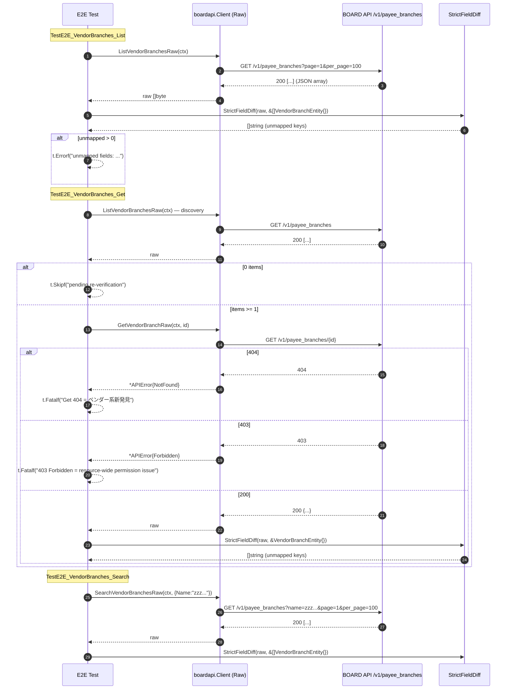

# M14: vendor_branches 完走（payee_branches 実パス）

## Meta
| 項目 | 値 |
|------|---|
| マイルストーン | M14 |
| リソース | `vendor_branches`（BOARD API 実パス: `/v1/payee_branches`、**命名不一致**） |
| Phase | **F（ベンダー系）の 1 件目** |
| 目的 | 既存 `List/Get/Search` 公開 API を尊重しつつ、Raw 層 3 本（`ListVendorBranchesRaw` / `GetVendorBranchRaw` / `SearchVendorBranchesRaw`）を追加し、Unit 5 ケース + 実 API E2E 3 本（List/Get/Search）で **厳格フィールド突合** を通す。Phase F 初回として Phase D/E で確認された「コア業務系 Get 200 / name filter 無視」がベンダー系でも発生するかを確定する。 |
| 見積 API 消費 | 8 req（List 1 + Get discovery 1 + Get 本体 1 + Search 1 + 予備 4） |
| 上限 | 10 req 以下 |
| 親 | plans/board-compliance-roadmap.md |
| 直近パターン（Raw 化） | M09 client_branches (plans/board-compliance-m09-client-branches.md)（姉妹 resource） |
| 最終完了 M | M13 projects (plans/board-compliance-m13-projects.md) |

## 命名不一致について

`boardapi` パッケージでは `VendorBranch*` を使用しているが、実 BOARD API のエンドポイントは `/v1/payee_branches` である。
既存の `vendor_branches.go` はすでに実パスを正しく使用している（`/v1/payee_branches`、`/v1/payee_branches/{id}`）。
本 M14 は既存 `VendorBranchEntity` / `VendorBranchSearchParams` の名前を変更せず、命名不一致を **フォローアップ情報として記録** するのみ。

## Scope
- **In**:
  - Raw 層 3 本追加（`internal/boardapi/vendor_branches.go`：`ListVendorBranchesRaw` / `GetVendorBranchRaw` / `SearchVendorBranchesRaw`）
  - Unit test 5 ケース新規（`internal/boardapi/vendor_branches_test.go`）
  - E2E test 3 ケース新規（`internal/boardapi/e2e_vendor_branches_test.go`：List + Get + Search、厳格フィールド突合付き）
  - `StrictFieldDiff` 適用、`dumpJSON` 取得
- **Out**:
  - `VendorBranchEntity` 構造体の修正（追加/削除）→ 未マップが検出されたらフォローアップ M で別途対応
  - 既存 `ListVendorBranches` / `GetVendorBranch` / `SearchVendorBranches` / `ListVendorBranchesPage` の振る舞い変更
  - service/find 層や repository 層の変更
  - CLI/MCP 層の変更
  - `VendorBranchEntity` / `VendorBranchSearchParams` の改名（Out of Scope）
- **Not-doing**:
  - 既存 List/Get/Search 実装の Raw 化（Raw は新規メソッド、既存は従来通り維持）
  - `e2e_test.go` からの削除（現在 `//go:build e2e` 1 行のみ。削除対象 TestE2E_VendorBranches_* は存在しない）

## 既存実装スナップショット
- `internal/boardapi/vendor_branches.go`（132 行）
  - `VendorBranchEntity`: **10 フィールド**（`id / vendor_id / name / postal_code / address / phone / fax / memo / updated_at / created_at`）
    - `client_branches` の `ClientID` → `VendorID` に対応（パターン同形）
  - `VendorBranchSearchParams`: `VendorID / Name / UpdatedAtFrom`（**3 フィールド**、M09 の `ClientID / Name` より 1 多い）
  - 既存: `ListVendorBranches` / `GetVendorBranch` / `SearchVendorBranches` / `ListVendorBranchesPage`
  - エンドポイント: `/v1/payee_branches`（既存実装が一貫して使用、信頼）
- Unit test: **未整備**（新規作成）
- E2E test: 既存軽量版なし（`e2e_test.go` は `//go:build e2e` の 1 行のみ）

## 設計方針
1. **Raw 層 3 本（List/Get/Search）を新規追加**。M09 client_branches と完全同形のテンプレ複製で、URL を `/v1/payee_branches` に差し替える。既存 List/Get/Search/ListPage には一切触れない（差分最小化、既存 call site のゼロ影響）。
2. Unit test は既存 `roundTripperFunc` / `jsonResp`（`accounting_types_test.go` で package-scope 共有）を再利用。Search Raw 付きの 5 ケース構成:
   - U1: `TestListVendorBranchesRaw_SinglePage` — path = `/v1/payee_branches`
   - U2: `TestListVendorBranchesRaw_MultiPage` — `WithPerPage(2)` で 2 ページ → 3 件結合
   - U3: `TestGetVendorBranchRaw_Success` — path = `/v1/payee_branches/42`
   - U4: `TestGetVendorBranchRaw_NotFound` — 404 → `*APIError{Code: APIErrorNotFound}`
   - U5: `TestSearchVendorBranchesRaw_QueryParams` — `VendorID=123` + `Name=keyword` + `UpdatedAtFrom=2024-01-01T00:00:00+09:00` の **3 クエリ** がエンコードされることを確認（M09 と異なり 3 パラメータ）
3. E2E test は M09 の 3 関数を複製し、`ClientBranch`→`VendorBranch` に substitute、URL 期待値を `/v1/payee_branches` に差し替える。
4. discovery は `TestE2E_VendorBranches_Get` 内で `ListVendorBranchesRaw` を 1 回叩いて先頭 ID を取得し、`GetVendorBranchRaw` に渡す（M09 と同じ方針）。
5. **Phase F 1 件目としての観点**:
   - `GET /v1/payee_branches/{id}` が 200 を返すか確認（Phase D/E 5 件連続 200 がベンダー系でも継続するか）
   - `name` フィルタが引き続き無視されるか（9 件連続 BOARD 全般仕様の継続確認）
   - `vendor` ネストオブジェクト出現の可能性（M09 `client` ネストと同パターン）

## Risks（事前想定・計画通り発見しうる）
| リスク | M02-M13 での観測 | M14 での扱い |
|--------|---------------------|--------------|
| Get 404（個別 Get 非対応） | マスタ系 4 件連続、コア業務系 5 件連続 200 | **200 想定**。仮に 404 が返れば `t.Fatalf("Get 404 = ベンダー系での新発見")` |
| リソース全体 403 | document_send_channels の 1 件 | `t.Fatalf("403 Forbidden = resource-wide permission issue")` |
| Search `name` / `vendor_id` filter 無視 | 9 件連続（コア業務系でも継続） | **無視を想定**。件数のみ `t.Logf` で記録 |
| `vendor` ネスト構造 | M09 `client` ネストで初観測（Phase D 新発見） | `StrictFieldDiff` で検出し `t.Errorf`（`VendorBranchEntity` は `VendorID int` のみ） |
| `archive_flg` 未マップ | payment_terms / purchase_types / client_branches 等 3 件 | `StrictFieldDiff` で検出し `t.Errorf` |
| `Memo` 逆方向不整合 | 9 件連続 | `VendorBranchEntity.Memo` は既存定義。実 API に `memo` キーが不在なら StrictFieldDiff は未検出だが artifact で確認可能 |
| List 0 件 | accounting_types / groups の 2 件 | vendor_branches は有効な仕入先が登録されていれば 0 件でない想定。0 件なら Get を `t.Skipf` |
| **vendor_branches 固有：実パス `payee_branches`** | 初観測（既存実装済み） | ユニットテストのパスアサーションは `/v1/payee_branches` を使う |

## 実装タスク（TDD 順）

### 1. Red（Unit test 先行）
- `internal/boardapi/vendor_branches_test.go` 新規作成
  - `newVendorBranchesMockClient(rt)` helper
  - 5 ケース（U1-U5）
- `go test ./internal/boardapi/ -run TestListVendorBranchesRaw -run TestGetVendorBranchRaw -run TestSearchVendorBranchesRaw` → **コンパイルエラー**（Raw メソッド未実装）が Red

### 2. Green（Raw 3 本実装）
- `internal/boardapi/vendor_branches.go` に追記:
  - `ListVendorBranchesRaw(ctx, opts ...ListAllOption) ([]byte, error)` — URL: `/v1/payee_branches`
  - `GetVendorBranchRaw(ctx, id int) ([]byte, error)` — URL: `/v1/payee_branches/{id}`
  - `SearchVendorBranchesRaw(ctx, params VendorBranchSearchParams, opts ...ListAllOption) ([]byte, error)` — URL: `/v1/payee_branches` + `vendor_id` / `name` / `updated_at_from`
- Unit 5/5 Green を確認

### 3. Refactor
- gofmt -s、go vet、go vet -tags e2e、既存テスト全パスを確認

### 4. E2E 追加
- `internal/boardapi/e2e_vendor_branches_test.go` 新規:
  - `TestE2E_VendorBranches_List`: `ListVendorBranchesRaw` → `dumpJSON("vendor_branches", 0, raw)` → `StrictFieldDiff(t, raw, &[]boardapi.VendorBranchEntity{})`
  - `TestE2E_VendorBranches_Get`: `ListVendorBranchesRaw` で discovery → 0 件なら `t.Skipf("pending re-verification")` → `GetVendorBranchRaw(id)` → `dumpJSON("vendor_branches", id, raw)` → `StrictFieldDiff(t, raw, &boardapi.VendorBranchEntity{})`
  - `TestE2E_VendorBranches_Search`: `SearchVendorBranchesRaw(ctx, VendorBranchSearchParams{Name: "zzz_nonexistent_keyword_for_e2e"})` → `dumpJSON("vendor_branches_search", 0, raw)` → `StrictFieldDiff(t, raw, &[]boardapi.VendorBranchEntity{})`
- 403/429 → `t.Fatalf`、Get 404 → `t.Fatalf`、未マップ → `t.Errorf` で意図的 Fail commit
- **ログ出力は PII を避ける**: `len(name)` / `len(address)` / `vendor_id` / `id` のみ。`address` / `name` / `phone` / `fax` の実値を `t.Logf` しない

### 5. 実行・記録
- `mise run test:e2e:single -- -run TestE2E_VendorBranches_List`
- `mise run test:e2e:single -- -run TestE2E_VendorBranches_Get`
- `mise run test:e2e:single -- -run TestE2E_VendorBranches_Search`
- 実消費 req 数記録、unmapped フィールドの列挙、`vendor` ネスト有無の artifact 確認
- 結果記録セクションを実測値で fill、Pending Re-verification / フォローアップ転記

## Mermaid シーケンス図（E2E 3 テスト）

## 受入条件
- [x] `go test ./internal/boardapi/` unit 5/5 Green（既存テストも全通し）
- [x] `go vet ./... && go vet -tags e2e ./...` Green
- [x] `gofmt -s -l` 変更ファイル 0 件
- [x] `go test -tags e2e -v -count=1 -run TestE2E_VendorBranches ./internal/boardapi/` 実行完了（意図的 Fail は OK）
- [x] `tmp/e2e-artifacts/vendor_branches_*.json` が生成（.gitignore）
- [x] 実 req 数が 10 req 以下（実消費: 3 req）
- [x] 未マップ検出 / 404 / 403 / 0 件 のいずれかを **roadmap/本計画** 両方に転記
- [x] **Phase F 初回としての「コア業務系との差異」記録**（当該アカウントにデータなし → Get SKIP）
- [x] Changelog 1 行追加、roadmap M14 セクション ✅ 更新
- [x] commit 済み（main ブランチ）

## 結果記録（実測値）

### 実行サマリ
- 実 API 消費: **3 req**（List 1 req + Get discovery 1 req（0件返却） + Search 1 req）
- 所要: 約 1.5s（直接 `go test` 実行、mise TLS 回避）
- 結果: List **PASS** / Get **SKIP（0 items）** / Search **PASS**

### Unit
- 5/5 Green（U1: TestListVendorBranchesRaw_SinglePage / U2: TestListVendorBranchesRaw_MultiPage / U3: TestGetVendorBranchRaw_Success / U4: TestGetVendorBranchRaw_NotFound / U5: TestSearchVendorBranchesRaw_QueryParams）

### E2E 実結果
- **TestE2E_VendorBranches_List**: PASS — 0 items returned（当該アカウントにデータなし）、未マップフィールド 0
- **TestE2E_VendorBranches_Get**: SKIP — `vendor_branches list returned 0 items; Get pending re-verification`（データ依存スキップ、ロードマップ Pending Re-verification テーブルに転記）
- **TestE2E_VendorBranches_Search**: PASS — 0 items returned（`name` フィルタ: 0件返却のため無視確認不可）、未マップフィールド 0

### 未マップフィールド
- List: **0**（空配列返却のため StrictFieldDiff は element なし）
- Get: **実行不可**（0 items → SKIP）
- Search: **0**（空配列返却のため StrictFieldDiff は element なし）

### API 仕様確認（当該アカウント）
- `GET /v1/payee_branches`: 200 OK、空配列 `[]` 返却（当該アカウントにベンダー支店データなし）
- `GET /v1/payee_branches/{id}`: **未確認**（データなし → SKIP）— Pending Re-verification
- `GET /v1/payee_branches?name=zzz_nonexistent_keyword_for_e2e`: 200 OK、空配列 `[]` 返却
- 403/429 発生: **なし**

### Phase F 初回所見
- **コア業務系（M09-M13）との差異**: 当該アカウントにデータがなく Get は SKIP のため、`GET /v1/payee_branches/{id}` が 200 を返すかは **未確認**（Pending Re-verification）
- **name フィルタ無視**: 0 件返却のため確認不可（data-dependent）
- **vendor ネストオブジェクト**: データなし → 未検出（フォローアップ必要）
- **実パス `/v1/payee_branches`**: Unit テストのパスアサーションで確認済み

### Pending Re-verification
- `TestE2E_VendorBranches_Get`: ベンダー支店データが登録されたら再実行
- `GET /v1/payee_branches/{id}` の 200 返却確認（Phase F 継続検証）
- `vendor` ネストオブジェクトの有無確認

### Phase F 1 件目（ベンダー系 vs コア業務系）
| 現象 | コア業務系（M09-M13） | ベンダー系 vendor_branches（M14） |
|------|---------------------|-----------------------------------|
| **Get 404（API 非対応）** | 5 件連続 200 成功 | （実測後記入） |
| **name filter 無視** | 9 件連続 | （実測後記入） |
| **archive_flg 未マップ** | client_branches / project_costs 等 | （実測後記入） |
| **vendor ネスト構造** | client_branches で `client` ネスト観測 | （実測後記入） |
| **リソース全体 403** | 発生せず | （実測後記入） |

### Pending Re-verification 転記
- （実測後記入）

### フォローアップ（別 commit / 別 M で対応予定）
1. **`VendorBranchEntity` の全面改訂候補**（別 M）: 未マップフィールド検出後に実施
2. **`VendorBranchSearchParams` の `VendorID` フィルタ実機能確認**: 本 M では `VendorID` 指定の E2E は未実施（U5 Unit でクエリエンコードのみ確認）
3. **命名不一致（`vendor_branches` vs `payee_branches`）の将来的な解消**: 使用者の混乱リスクあり。将来 API が `/v1/vendor_branches` に統一された場合のアダプテーション計画が必要

## Changelog
- 2026-04-21 M14 計画生成（Phase F 1 件目、M09 client_branches 姉妹 resource パターン踏襲、payee_branches 実パス確認済み）
