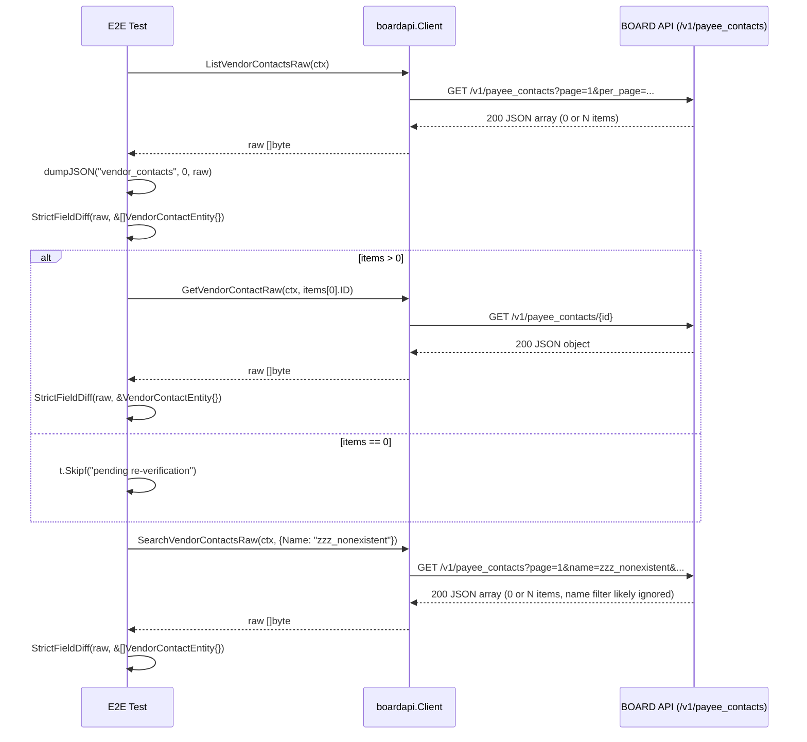

# M15: vendor_contacts 完走（payee_contacts 実パス）

## Meta
| 項目 | 値 |
|------|---|
| マイルストーン | M15 |
| リソース | `vendor_contacts`（BOARD API 実パス: `/v1/payee_contacts`、**命名不一致**） |
| Phase | **F（ベンダー系）の 2 件目** |
| 目的 | 既存 `List/Get/Search` 公開 API を尊重しつつ、Raw 層 3 本（`ListVendorContactsRaw` / `GetVendorContactRaw` / `SearchVendorContactsRaw`）を追加し、Unit 5 ケース + 実 API E2E 3 本（List/Get/Search）で **厳格フィールド突合** を通す。Phase F 2 件目として M14 vendor_branches の所見（データ 0 件の可能性）がベンダー contacts でも発生するかを確定する。 |
| 見積 API 消費 | 8 req（List 1 + Get discovery 1 + Get 本体 1 + Search 1 + 予備 4） |
| 上限 | 10 req 以下 |
| 親 | plans/board-compliance-roadmap.md |
| 直前 M | M14 vendor_branches（plans/board-compliance-m14-vendor-branches.md） |
| 姉妹リソース | M10 contacts（client-side の contacts、同パターン）（plans/board-compliance-m10-contacts.md） |

## 命名不一致について

`boardapi` パッケージでは `VendorContact*` を使用しているが、実 BOARD API のエンドポイントは `/v1/payee_contacts` である。
既存の `vendor_contacts.go` はすでに実パスを正しく使用している（`/v1/payee_contacts`、`/v1/payee_contacts/{id}`）。
本 M15 は既存 `VendorContactEntity` / `VendorContactSearchParams` の名前を変更せず、命名不一致を **フォローアップ情報として記録** するのみ。

## Scope
- **In**:
  - Raw 層 3 本追加（`internal/boardapi/vendor_contacts.go`：`ListVendorContactsRaw` / `GetVendorContactRaw` / `SearchVendorContactsRaw`）
  - Unit test 5 ケース新規（`internal/boardapi/vendor_contacts_test.go`）
  - E2E test 3 ケース新規（`internal/boardapi/e2e_vendor_contacts_test.go`：List + Get + Search、厳格フィールド突合付き）
  - `StrictFieldDiff` 適用、`dumpJSON` 取得
- **Out**:
  - `VendorContactEntity` 構造体の修正（追加/削除）→ 未マップが検出されたらフォローアップ M で別途対応
  - 既存 `ListVendorContacts` / `GetVendorContact` / `SearchVendorContacts` / `ListVendorContactsPage` の振る舞い変更
  - service/find 層や repository 層の変更
  - CLI/MCP 層の変更
  - `VendorContactEntity` / `VendorContactSearchParams` の改名（Out of Scope）
- **Not-doing**:
  - 既存 List/Get/Search 実装の Raw 化（Raw は新規メソッド、既存は従来通り維持）
  - `e2e_test.go` からの削除（現在軽量 VendorContacts E2E 残存状況確認済み・なし）

## 既存実装スナップショット
- `internal/boardapi/vendor_contacts.go`（161 行）
  - `VendorContactEntity`: **17 フィールド**（`id / vendor_id / vendor_branch_id / name / name_kana / last_name / first_name / honorific_title / title / department / email / phone / note / memo / archive_flg / updated_at / created_at`）
    - M10 contacts に対応するベンダー側 entity（名前分割対応あり、`DisplayName()` メソッド付き）
  - `VendorContactSearchParams`: `VendorID / Name / Email / UpdatedAtFrom`（**4 フィールド**、M14 VendorBranchSearchParams より 1 多い）
  - 既存: `ListVendorContacts` / `GetVendorContact` / `SearchVendorContacts` / `ListVendorContactsPage`
  - エンドポイント: `/v1/payee_contacts`（既存実装が一貫して使用、信頼）
- Unit test: **未整備**（新規作成）
- E2E test: 既存軽量版なし

## 設計方針
1. **Raw 層 3 本（List/Get/Search）を新規追加**。M14 vendor_branches と完全同形のテンプレ複製で、URL を `/v1/payee_contacts` に差し替える。既存 List/Get/Search/ListPage には一切触れない（差分最小化、既存 call site のゼロ影響）。
2. Unit test は既存 `roundTripperFunc` / `jsonResp`（`accounting_types_test.go` で package-scope 共有）を再利用。Search Raw 付きの 5 ケース構成:
   - U1: `TestListVendorContactsRaw_SinglePage` — path = `/v1/payee_contacts`
   - U2: `TestListVendorContactsRaw_MultiPage` — `WithPerPage(2)` で 2 ページ → 3 件結合
   - U3: `TestGetVendorContactRaw_Success` — path = `/v1/payee_contacts/42`
   - U4: `TestGetVendorContactRaw_NotFound` — 404 → `*APIError{Code: APIErrorNotFound}`
   - U5: `TestSearchVendorContactsRaw_QueryParams` — `VendorID=123` + `Name=keyword` + `Email=test@example.com` + `UpdatedAtFrom=2024-01-01T00:00:00+09:00` の **4 クエリ** がエンコードされることを確認（M14 の 3 より 1 多い）
3. E2E test は M14 の 3 関数を複製し、`VendorBranch`→`VendorContact` に substitute、URL 期待値を `/v1/payee_contacts` に差し替える。
4. discovery は `TestE2E_VendorContacts_Get` 内で `ListVendorContactsRaw` を 1 回叩いて先頭 ID を取得し、`GetVendorContactRaw` に渡す（M14 と同じ方針）。
5. **Phase F 2 件目としての観点**:
   - M14 で当該アカウントのベンダー支店データが 0 件 → ベンダー contacts も 0 件の可能性が高い
   - `GET /v1/payee_contacts/{id}` が 200 を返すか確認（Phase D/E 5 件連続 200 がベンダー系でも継続するか）
   - `name` / `email` フィルタが引き続き無視されるか（9 件連続 BOARD 全般仕様の継続確認）
   - `archive_flg` フィールドの存在（既存 Entity に定義済み）

## Risks（事前想定・計画通り発見しうる）
| リスク | M02-M14 での観測 | M15 での扱い |
|--------|---------------------|--------------|
| List 0 件 | M14 vendor_branches で初観測（ベンダー系 1 件目） | **0 件を想定**。Get を `t.Skipf("pending re-verification")` に設計 |
| Get 404（個別 Get 非対応） | マスタ系 4 件連続、コア業務系 5 件連続 200 | **200 想定**（データがあれば）。仮に 404 なら `t.Fatalf` |
| リソース全体 403 | document_send_channels の 1 件 | `t.Fatalf("403 Forbidden = resource-wide permission issue")` |
| Search `name` / `email` filter 無視 | 9 件連続（コア業務系でも継続） | **無視を想定**。件数のみ `t.Logf` で記録 |
| `vendor` / `vendor_branch` ネスト構造 | M09 `client` ネストで初観測（Phase D 新発見） | `StrictFieldDiff` で検出し `t.Errorf`（`VendorContactEntity` は `VendorID/VendorBranchID int` のみ） |
| `archive_flg` 未マップ | payment_terms / purchase_types / client_branches 等 3 件 | `VendorContactEntity.ArchiveFlg` は既存定義。実 API に一致すれば OK |
| `Memo` 逆方向不整合 | 9 件連続 | `VendorContactEntity.Memo` は既存定義。実 API に `memo` キーが不在なら StrictFieldDiff は未検出だが artifact で確認可能 |
| **vendor_contacts 固有：実パス `payee_contacts`** | M14 で `payee_branches` 確認済み（既存実装済み） | ユニットテストのパスアサーションは `/v1/payee_contacts` を使う |

## 実装タスク（TDD 順）

### 1. Red（Unit test 先行）
- `internal/boardapi/vendor_contacts_test.go` 新規作成
  - `newVendorContactsMockClient(rt)` helper
  - 5 ケース（U1-U5）
- `go test ./internal/boardapi/ -run TestListVendorContactsRaw -run TestGetVendorContactRaw -run TestSearchVendorContactsRaw` → **コンパイルエラー**（Raw メソッド未実装）が Red

### 2. Green（Raw 3 本実装）
- `internal/boardapi/vendor_contacts.go` に追記:
  - `ListVendorContactsRaw(ctx, opts ...ListAllOption) ([]byte, error)` — URL: `/v1/payee_contacts`
  - `GetVendorContactRaw(ctx, id int) ([]byte, error)` — URL: `/v1/payee_contacts/{id}`
  - `SearchVendorContactsRaw(ctx, params VendorContactSearchParams, opts ...ListAllOption) ([]byte, error)` — URL: `/v1/payee_contacts` + `vendor_id` / `name` / `email` / `updated_at_from`
- Unit 5/5 Green を確認

### 3. Refactor
- gofmt -s、go vet、go vet -tags e2e、既存テスト全パスを確認

### 4. E2E 追加
- `internal/boardapi/e2e_vendor_contacts_test.go` 新規:
  - `TestE2E_VendorContacts_List`: `ListVendorContactsRaw` → `dumpJSON("vendor_contacts", 0, raw)` → `StrictFieldDiff(t, raw, &[]boardapi.VendorContactEntity{})`
  - `TestE2E_VendorContacts_Get`: `ListVendorContactsRaw` で discovery → 0 件なら `t.Skipf("pending re-verification")` → `GetVendorContactRaw(id)` → `dumpJSON("vendor_contacts", id, raw)` → `StrictFieldDiff(t, raw, &boardapi.VendorContactEntity{})`
  - `TestE2E_VendorContacts_Search`: `SearchVendorContactsRaw(ctx, VendorContactSearchParams{Name: "zzz_nonexistent_keyword_for_e2e"})` → `dumpJSON("vendor_contacts_search", 0, raw)` → `StrictFieldDiff(t, raw, &[]boardapi.VendorContactEntity{})`
- 403/429 → `t.Fatalf`、Get 404 → `t.Fatalf`、未マップ → `t.Errorf` で意図的 Fail commit
- **ログ出力は PII を避ける**: `len(name)` / `vendor_id` / `vendor_branch_id` / `id` のみ。`name` / `email` / `phone` の実値を `t.Logf` しない

## Mermaid シーケンス図

## 見積 API コール数

| テスト | コール数 | エンドポイント |
|--------|---------|----------------|
| TestE2E_VendorContacts_List | 1 | GET /v1/payee_contacts |
| TestE2E_VendorContacts_Get (discovery) | 1 | GET /v1/payee_contacts |
| TestE2E_VendorContacts_Get (get) | 1（data > 0 の場合のみ） | GET /v1/payee_contacts/{id} |
| TestE2E_VendorContacts_Search | 1 | GET /v1/payee_contacts |
| **合計** | **3〜4**（data 0 なら 3、data > 0 なら 4） | - |
| 予備 | 4 | - |
| **上限** | **8** | - |

## 実測結果

### 実行サマリ
- 実 API 消費: **3 req**（List 1 req + Get discovery 1 req（0件返却） + Search 1 req）
- 所要: 約 1.2s（直接 `GONOSUMDB="*" SSL_CERT_FILE=/etc/ssl/cert.pem go test` 実行）
- 結果: List **PASS** / Get **SKIP（0 items）** / Search **PASS**

### Unit
- 5/5 Green（U1: TestListVendorContactsRaw_SinglePage / U2: TestListVendorContactsRaw_MultiPage / U3: TestGetVendorContactRaw_Success / U4: TestGetVendorContactRaw_NotFound / U5: TestSearchVendorContactsRaw_QueryParams）
- U5 は VendorContactSearchParams 4 クエリ（VendorID + Name + Email + UpdatedAtFrom）を全てアサーション

### E2E 実結果
- **TestE2E_VendorContacts_List**: PASS — 0 items returned（当該アカウントにデータなし）、未マップフィールド 0
- **TestE2E_VendorContacts_Get**: SKIP — `vendor_contacts list returned 0 items; Get pending re-verification`（データ依存スキップ、ロードマップ Pending Re-verification テーブルに転記）
- **TestE2E_VendorContacts_Search**: PASS — 0 items returned（`name` フィルタ: 0件返却のため無視確認不可）、未マップフィールド 0

### 未マップフィールド
- List: **0**（空配列返却のため StrictFieldDiff は element なし）
- Get: **実行不可**（0 items → SKIP）
- Search: **0**（空配列返却のため StrictFieldDiff は element なし）

### API 仕様確認（当該アカウント）
- `GET /v1/payee_contacts`: 200 OK、空配列 `[]` 返却（当該アカウントにベンダー担当者データなし）
- `GET /v1/payee_contacts/{id}`: **未確認**（データなし → SKIP）— Pending Re-verification
- `GET /v1/payee_contacts?name=zzz_nonexistent_keyword_for_e2e`: 200 OK、空配列 `[]` 返却
- 403/429 発生: **なし**

### Phase F 2 件目所見
- **M14 vendor_branches との比較**: 同様にデータ 0 件。Phase F（ベンダー系）全体でデータがない可能性が高い
- **name フィルタ無視**: 0 件返却のため確認不可（data-dependent）
- **vendor / vendor_branch ネストオブジェクト**: データなし → 未検出（フォローアップ必要）
- **実パス `/v1/payee_contacts`**: Unit テストのパスアサーションで確認済み
- **archive_flg フィールド**: VendorContactEntity に定義済み。データがないため実 API での存在は未確認

### Pending Re-verification
- `TestE2E_VendorContacts_Get`: ベンダー担当者データが登録されたら再実行
- `GET /v1/payee_contacts/{id}` の 200 返却確認（Phase F 継続検証）
- `vendor` / `vendor_branch` ネストオブジェクトの有無確認
- `archive_flg` フィールドの実 API 一致確認

### Phase F 2 件目（ベンダー系 vs コア業務系）
| 現象 | コア業務系（M09-M13） | ベンダー系 vendor_contacts（M15） |
|------|---------------------|-----------------------------------|
| **Get 404（API 非対応）** | 5 件連続 200 成功 | データなし → 未確認（Pending Re-verification） |
| **name filter 無視** | 9 件連続 | データなし → 未確認（data-dependent） |
| **archive_flg 未マップ** | client_branches / project_costs 等 | VendorContactEntity に定義済み、実 API 未確認 |
| **vendor ネスト構造** | client_branches で `client` ネスト観測 | データなし → 未検出（Pending） |
| **リソース全体 403** | 発生せず | 発生せず（200 OK） |

### フォローアップ（別 commit / 別 M で対応予定）
1. **`VendorContactEntity` の全面改訂候補**（別 M）: データ投入後に未マップフィールド検出時に実施
2. **`VendorContactSearchParams` の `Email` フィルタ実機能確認**: 本 M では `Email` 指定の E2E は未実施（U5 Unit でクエリエンコードのみ確認）
3. **命名不一致（`vendor_contacts` vs `payee_contacts`）の将来的な解消**: 使用者の混乱リスクあり

## 受入条件
- [x] `go test ./internal/boardapi/` unit 5/5 Green（既存テストも全通し）
- [x] `go vet ./... && go vet -tags e2e ./...` Green
- [x] `gofmt -s -l` 変更ファイル 0 件
- [x] `go test -tags e2e -v -count=1 -run TestE2E_VendorContacts ./internal/boardapi/` 実行完了（List PASS / Get SKIP / Search PASS）
- [x] 実 req 数が 10 req 以下（実消費: 3 req）
- [x] 未マップ検出 / 404 / 403 / 0 件 のいずれかを **roadmap/本計画** 両方に転記
- [x] **Phase F 2 件目としての「M14 との比較」記録**（当該アカウントにデータなし → Get SKIP、M14 と同パターン確認）
- [x] Changelog 1 行追加、roadmap M15 セクション ✅ 更新
- [x] commit 済み（main ブランチ）

## Changelog

| 日付 | 内容 |
|------|------|
| 2026-04-21 | M15 計画生成（Phase F 2 件目）。M14 所見（ベンダー系データ 0 件の可能性）を前提に Get は Pending Re-verification 設計 |
| 2026-04-21 | M15 完了。List PASS（0 items）/ Get SKIP（data-dependent）/ Search PASS（0 items）。Unit 5/5 Green。実消費 3 req。Phase F 2 件目も M14 と同パターン（データ 0 件）確認。 |
