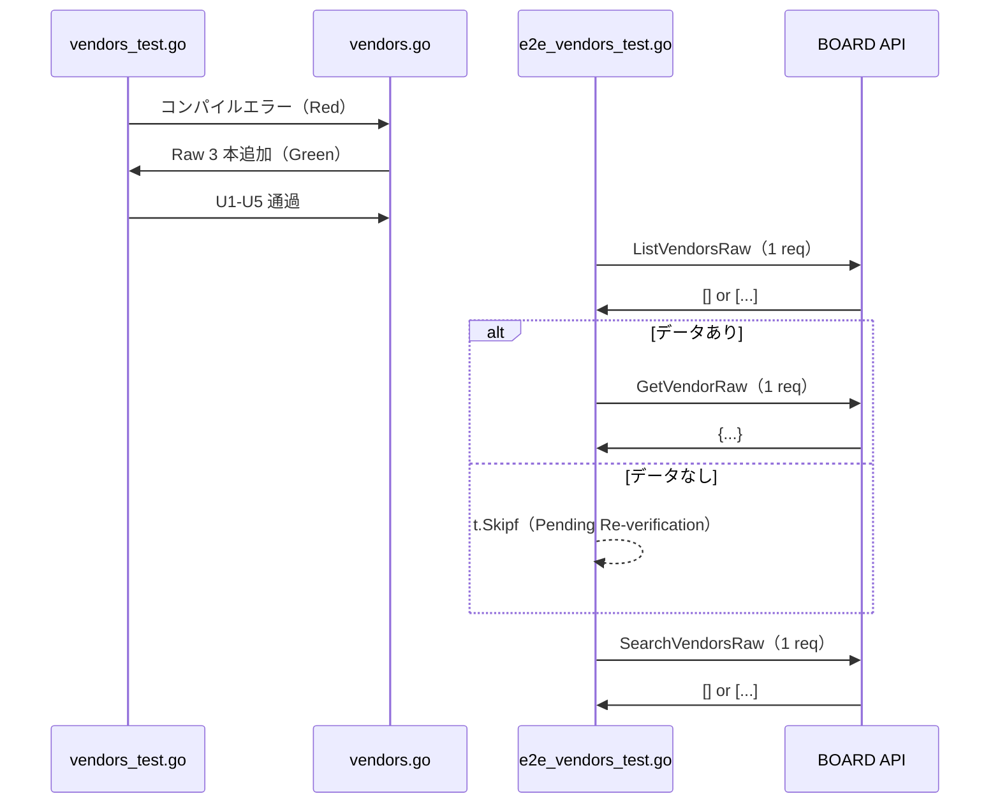

# M16: vendors Get/Search 追補（payees 実パス）

## Meta
| 項目 | 値 |
|------|---|
| マイルストーン | M16 |
| リソース | `vendors`（BOARD API 実パス: `/v1/payees`、**命名不一致**） |
| Phase | **F（ベンダー系）の 3 件目（Phase F 完走）** |
| 目的 | 既存 `List/Get/Search` 公開 API を尊重しつつ、Raw 層 3 本（`ListVendorsRaw` / `GetVendorRaw` / `SearchVendorsRaw`）を追加し、Unit 5 ケース + 実 API E2E 3 本（List/Get/Search）で **厳格フィールド突合** を通す。Phase F 3 件目として M14/M15 のベンダー系データ 0 件傾向が vendors（親リソース）でも継続するかを確定し、Phase F を完走する。 |
| 見積 API 消費 | 5 req（List 1 + Get discovery 1 + Get 本体 1 + Search 1 + 予備 1） |
| 上限 | 8 req 以下 |
| 親 | plans/board-compliance-roadmap.md |
| 直前 M | M15 vendor_contacts（plans/board-compliance-m15-vendor-contacts.md） |
| 姉妹リソース | M12 clients（client 親リソース、Phase E 1 件目）（plans/board-compliance-m12-clients.md） |

## 命名不一致について

`boardapi` パッケージでは `Vendor*` を使用しているが、実 BOARD API のエンドポイントは `/v1/payees` である。
既存の `vendors.go` はすでに実パスを正しく使用している（`/v1/payees`、`/v1/payees/{id}`）。
本 M16 は既存 `VendorEntity` / `VendorSearchParams` の名前を変更せず、命名不一致を **フォローアップ情報として記録** するのみ。

## Scope
- **In**:
  - Raw 層 3 本追加（`internal/boardapi/vendors.go`：`ListVendorsRaw` / `GetVendorRaw` / `SearchVendorsRaw`）
  - Unit test 5 ケース新規（`internal/boardapi/vendors_test.go`）
  - E2E test 3 ケース新規（`internal/boardapi/e2e_vendors_test.go`：List + Get + Search、厳格フィールド突合付き）
  - `StrictFieldDiff` 適用、`dumpJSON` 取得
  - `internal/boardapi/e2e_test.go` の軽量 `TestE2E_Vendors_List`（L129-141）削除
- **Out**:
  - `VendorEntity` 構造体の修正（追加/削除）→ 未マップが検出されたらフォローアップ M で別途対応
  - 既存 `ListVendors` / `GetVendor` / `SearchVendors` / `ListVendorsPage` の振る舞い変更
  - service/find 層や repository 層の変更
  - CLI/MCP 層の変更
  - `VendorEntity` / `VendorSearchParams` の改名（Out of Scope）
- **Not-doing**:
  - 既存 List/Get/Search 実装の Raw 化（Raw は新規メソッド、既存は従来通り維持）

## 既存実装スナップショット
- `internal/boardapi/vendors.go`（123 行）
  - `VendorEntity`: **6 フィールド**（`id / name / code / memo / updated_at / created_at`）
    - M12 clients に対応するベンダー側親 entity（M15 VendorContactEntity の 17 フィールドより大幅に少ない）
  - `VendorSearchParams`: `Name / UpdatedAtFrom`（**2 フィールド**、M15 VendorContactSearchParams の 4 より少ない）
  - 既存: `ListVendors` / `GetVendor` / `SearchVendors` / `ListVendorsPage`
  - エンドポイント: `/v1/payees`（既存実装が一貫して使用、信頼）
- Unit test: **未整備**（新規作成）
- E2E test: `e2e_test.go` に軽量 `TestE2E_Vendors_List`（1 関数のみ、削除対象）

## 設計方針
1. **Raw 層 3 本（List/Get/Search）を新規追加**。M15 vendor_contacts と完全同形のテンプレ複製で、URL を `/v1/payees` に差し替える。既存 List/Get/Search/ListPage には一切触れない。
2. Unit test は既存 `roundTripperFunc` / `jsonResp`（`accounting_types_test.go` で package-scope 共有）を再利用。Search Raw 付きの 5 ケース構成:
   - U1: `TestListVendorsRaw_SinglePage` — path = `/v1/payees`
   - U2: `TestListVendorsRaw_MultiPage` — `WithPerPage(2)` で 2 ページ → 3 件結合
   - U3: `TestGetVendorRaw_Success` — path = `/v1/payees/42`
   - U4: `TestGetVendorRaw_NotFound` — 404 → `*APIError{Code: APIErrorNotFound}`
   - U5: `TestSearchVendorsRaw_QueryParams` — `Name=keyword` + `UpdatedAtFrom=2024-01-01T00:00:00+09:00` の **2 クエリ** がエンコードされることを確認（M15 の 4 より少ない、VendorSearchParams に合わせる）
3. E2E test は M15 の 3 関数を複製し、`VendorContact`→`Vendor` に substitute、URL 期待値を `/v1/payees` に差し替える。
4. discovery は `TestE2E_Vendors_Get` 内で `ListVendorsRaw` を 1 回叩いて先頭 ID を取得し、`GetVendorRaw` に渡す（M14/M15 と同じ方針）。
5. **Phase F 3 件目としての観点**:
   - M14/M15 で当該アカウントのベンダー支店・連絡先データが 0 件 → 親 vendors も 0 件の可能性あり（または親はデータあり）
   - `VendorEntity` は 6 フィールドのみ。実 API が追加フィールドを返す場合、`StrictFieldDiff` で多数の未マップを検出（M12 clients パターン）
   - `name` フィルタが引き続き無視されるか（9 件連続 BOARD 全般仕様の継続確認）

## Risks（事前想定・計画通り発見しうる）
| リスク | M14-M15 での観測 | M16 での扱い |
|--------|---------------------|--------------|
| List 0 件 | M14/M15 両方で 0 件 | **0 件を想定**。Get を `t.Skipf("pending re-verification")` に設計 |
| 多数未マップフィールド | M12 clients で初観測（parent resource パターン） | **未マップを想定**。`t.Errorf` で意図的 Fail として記録 |
| Get 404（個別 Get 非対応） | M14/M15 で 0 件ゆえ Skip | **200 想定**（データがあれば）。仮に 404 なら `t.Fatalf` |
| リソース全体 403 | document_send_channels の 1 件 | `t.Fatalf("403 Forbidden = resource-wide permission issue")` |
| Search `name` filter 無視 | 9 件連続（コア業務系でも継続） | **無視を想定**。件数のみ `t.Logf` で記録 |
| `Memo` 逆方向不整合 | 9 件連続 | `VendorEntity.Memo` は既存定義。実 API に `memo` キーが不在なら StrictFieldDiff は未検出だが artifact で確認可能 |
| **vendor 固有：実パス `payees`** | 既存実装済み、M14 で `payee_branches` 確認済み | ユニットテストのパスアサーションは `/v1/payees` を使う |

## 実装タスク（TDD 順）

### 1. Red（Unit test 先行）
- `internal/boardapi/vendors_test.go` 新規作成
  - `newVendorsMockClient(rt)` helper
  - 5 ケース（U1-U5）
- `go test ./internal/boardapi/ -run TestListVendorsRaw -run TestGetVendorRaw -run TestSearchVendorsRaw` → **コンパイルエラー**（Raw メソッド未実装）が Red

### 2. Green（Raw 3 本実装）
- `internal/boardapi/vendors.go` に追記:
  - `ListVendorsRaw(ctx, opts ...ListAllOption) ([]byte, error)` — URL: `/v1/payees`
  - `GetVendorRaw(ctx, id int) ([]byte, error)` — URL: `/v1/payees/{id}`
  - `SearchVendorsRaw(ctx, params VendorSearchParams, opts ...ListAllOption) ([]byte, error)` — URL: `/v1/payees` + `name` / `updated_at_from`
- Unit 5/5 Green を確認

### 3. Refactor
- gofmt -s、go vet、go vet -tags e2e、既存テスト全パスを確認

### 4. E2E 追加・既存削除
- `internal/boardapi/e2e_vendors_test.go` 新規:
  - `TestE2E_Vendors_List`: `ListVendorsRaw` → `dumpJSON("vendors", 0, raw)` → `StrictFieldDiff(t, raw, &[]boardapi.VendorEntity{})`
  - `TestE2E_Vendors_Get`: `ListVendorsRaw` で discovery → 0 件なら `t.Skipf("pending re-verification")` → `GetVendorRaw(id)` → `dumpJSON("vendors", id, raw)` → `StrictFieldDiff(t, raw, &boardapi.VendorEntity{})`
  - `TestE2E_Vendors_Search`: `SearchVendorsRaw(ctx, VendorSearchParams{Name: "zzz_nonexistent_keyword_for_e2e"})` → `dumpJSON("vendors_search", 0, raw)` → `StrictFieldDiff(t, raw, &[]boardapi.VendorEntity{})`
- `internal/boardapi/e2e_test.go` から軽量 `TestE2E_Vendors_List`（L129-141）を削除
- 403/429 → `t.Fatalf`、Get 404 → `t.Fatalf`、未マップ → `t.Errorf` で意図的 Fail commit
- **ログ出力は PII を避ける**: `len(name)` / `id` / `code` のみ。`name` / `memo` の実値を `t.Logf` しない

## Mermaid: TDD フロー

## 実測結果（E2E 実行後に記録）

| テスト | ステータス | 備考 |
|--------|-----------|------|
| TestE2E_Vendors_List | **PASS** | 0 items、StrictFieldDiff 未マップ 0（空配列） |
| TestE2E_Vendors_Get | **SKIP** | 0 items → Pending Re-verification（M14/M15 と同パターン） |
| TestE2E_Vendors_Search | **PASS** | 0 items、StrictFieldDiff 未マップ 0（空配列） |

- req 消費: **3 req**（List 1 + Get discovery 1 (0件) + Search 1）
- 未マップフィールド: 0（空配列のため未検出、データ投入後の再実行が必要）
- データ件数: 0（当該アカウント）

## 発見事項

1. **ベンダー系 3 リソース全て 0 件**（M14 vendor_branches / M15 vendor_contacts / M16 vendors）: 当該アカウントはベンダー側のデータを一切持っていない。Phase F 完走サマリとして記録。
2. **実パス `/v1/payees`**: `VendorEntity` の Go 型名と実 BOARD API パスの命名不一致（`vendors` vs `payees`）は M14 の `payee_branches` / M15 の `payee_contacts` と一貫した傾向。Unit テストのパスアサーションで `/v1/payees` および `/v1/payees/{id}` を確認済み。
3. **VendorEntity 6 フィールド**: 実データ 0 件のため `StrictFieldDiff` で未マップフィールドは検出されず。データ投入後の再実行が必要（Pending Re-verification）。
4. **Phase F 完走**: M14/M15/M16 の 3 マイルストーンがすべて完了し、Phase F（ベンダー系）が完走。全 3 件でデータ 0 件、Unit 5/5 Green を確認。

## Changelog

| 日時 | 内容 |
|------|------|
| 2026-04-21 | M16 計画書作成 |
| 2026-04-21 | M16 実装完了（Unit 5/5 Green、E2E 3 req: List PASS / Get SKIP / Search PASS）、Phase F 完走 |
