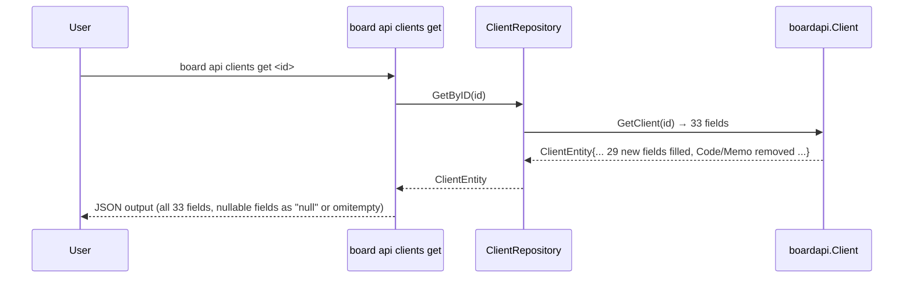

# M43: ClientEntity 全面再設計（Breaking）

## Overview
| 項目 | 値 |
|------|---|
| ステータス | 未着手 |
| 依存 | なし（独立、ClientRef は M39 で既存） |
| 対象ファイル | `internal/boardapi/clients.go` ほか downstream 12-15 ファイル |
| 工数見積 | M39 の 2-3 倍（29 フィールド追加） |
| 破壊度 | 高（`Code` / `Memo` フィールド廃止、SQLite cache invalidate 必要） |
| 親 | plans/board-phase-k-roadmap.md |

## Goal

BOARD API `/v1/clients` と `/v1/clients/{id}` の実レスポンスに完全一致する `ClientEntity` 構造へ書き換える。

現在の 6 フィールドは実 API の 33 フィールドに対して 67% 不整合。`Code` / `Memo` は **逆方向不整合**（実 API に存在せず、`custom_no` / `note` が代替）。LLM/MCP 経由で silent data loss を招くため、完全破壊的変更で 1 回書き直す。

## 背景（M12 発見事項、実 API dump 確認済）

実 API レスポンス（`tmp/e2e-artifacts/clients_51285623.json` から抽出、33 フィールド）:

```
id, name, name_disp, title, zip, pref, address1, address2, tel, fax,
payment_term_id, payment_term_name,
bank_charge_to_client_flg, nda_flg, basic_agreement_flg,
document_send_type, document_send_type_name,
note, tags, company_number, accounting_code, to, cc, custom_no,
company_bank_id, company_bank_name,
invoice_system_number, invoice_system_number_validated,
invoice_system_issuer_type, invoice_system_issuer_type_name,
archive_flg, created_at, updated_at
```

## フィールド設計

### 削除（逆方向不整合）
- `Code string` → `CustomNo *string`（`custom_no`）で代替
- `Memo string` → `Note *string`（`note`）で代替

### 既存維持（4）
- `ID int` — `id`
- `Name string` — `name`
- `UpdatedAt string` — `updated_at`
- `CreatedAt string` — `created_at`

### 新規追加（29）

**List/Search でも返却される共通フィールド（15）**
| Go field | JSON tag | 型 | 備考 |
|----------|----------|----|----|
| NameDisp | `name_disp` | `string` | 表示名 |
| Title | `title` | `*string` | 敬称等。null 事例あり要確認 |
| Zip | `zip` | `*string` | 郵便番号。null の場合あり |
| Pref | `pref` | `*string` | 都道府県 |
| Address1 | `address1` | `*string` | 住所1 |
| Address2 | `address2` | `*string` | 住所2 |
| Tel | `tel` | `*string` | 電話 |
| Fax | `fax` | `*string` | FAX |
| PaymentTermID | `payment_term_id` | `int` | 支払条件 ID |
| PaymentTermName | `payment_term_name` | `string` | 支払条件名 |
| CompanyNumber | `company_number` | `*string` | 法人番号 |
| InvoiceSystemNumber | `invoice_system_number` | `*string` | インボイス登録番号 |
| InvoiceSystemNumberValidated | `invoice_system_number_validated` | `bool` | |
| InvoiceSystemIssuerType | `invoice_system_issuer_type` | `int` | 0/1/2... |
| InvoiceSystemIssuerTypeName | `invoice_system_issuer_type_name` | `string` | 「未設定」等 |

**Get 限定フィールド（14）**
| Go field | JSON tag | 型 | 備考 |
|----------|----------|----|----|
| AccountingCode | `accounting_code` | `*string` | |
| ArchiveFlg | `archive_flg` | `int` | 0 / 1 |
| BankChargeToClientFlg | `bank_charge_to_client_flg` | `int` | 0 / 1 |
| BasicAgreementFlg | `basic_agreement_flg` | `int` | 0 / 1 |
| CC | `cc` | `*string` | 送付先 CC |
| CompanyBankID | `company_bank_id` | `*int` | null 可 |
| CompanyBankName | `company_bank_name` | `*string` | |
| CustomNo | `custom_no` | `*string` | 旧 `Code` の代替 |
| DocumentSendType | `document_send_type` | `int` | |
| DocumentSendTypeName | `document_send_type_name` | `string` | |
| NdaFlg | `nda_flg` | `int` | 0 / 1 |
| Note | `note` | `*string` | 旧 `Memo` の代替 |
| Tags | `tags` | `[]string` | 空配列の場合あり |
| To | `to` | `*string` | 送付先 To |

**注**: M12 観測では `List/Search 15 未マップ + Get 限定 14`。BOARD API は `List = 軽量` / `Get = 拡張` の 2 段階モデルで、単一 struct に `omitempty` + `*` で両対応する（M39 パターン）。

### Accessor（後方互換なし = 呼び出し側置換）
- `c.Code` → `deref(c.CustomNo)` もしくは fallback helper
- `c.Memo` → `deref(c.Note)` もしくは fallback helper

後方互換レイヤーは設けない（Phase K 方針）。

## Sequence Diagram



## TDD Test Design

Unit テスト（Red → Green → Refactor）:

| # | テストケース | 入力 | 期待出力 |
|---|-------------|------|---------|
| U1 | `TestClientEntity_UnmarshalGet_AllFields` | `clients_51285623.json` 実 dump | 全 33 フィールドが正しい値で埋まる |
| U2 | `TestClientEntity_UnmarshalList_SparseFields` | List レスポンス（Get 限定 14 が不在） | 共通 15 + ID/Name/... の 19 が埋まり、残り 14 は nil/zero |
| U3 | `TestClientEntity_NullableString_NilForMissing` | `address2=null` の JSON | `Address2 == nil` |
| U4 | `TestClientEntity_NullableString_NilForEmpty` | `address2=""` | 判断: null と empty を区別するか（BOARD は null を返すので nil のみでよい） |
| U5 | `TestClientSearchParams_QueryEncoding` | Name / UpdatedAtFrom / 各パターン | query string が `name=...&updated_at_from=...` で正しくエンコード |
| U6 | `TestClientEntity_TagsEmptyArray` | `tags: []` | `Tags` は `[]string{}` になる（`nil` ではなく空スライス） |

既存テスト（`clients_test.go`）の `Code` / `Memo` assertion は全て削除 or 置換。

E2E（`e2e_clients_test.go`）:
- `TestE2E_ClientsE_List_Strict` — 現状の `TestE2E_Clients_Search` 厳格版に相当、未マップ 0 確認
- `TestE2E_Clients_Get_Strict` — Get で Get 限定 14 フィールドが埋まる事を確認、未マップ 0

## Implementation Steps

### Phase 1: Entity 書き換え
- [ ] Step 1: `internal/boardapi/clients.go` の `ClientEntity` を 33 フィールド構造に書き換え（削除 2 + 既存 4 + 新規 29 - 共通 15 のうち既存含む）
- [ ] Step 2: `Code` / `Memo` を削除
- [ ] Step 3: `omitempty` + `*string` nullable を Get 限定フィールドに付与

### Phase 2: Unit test 修正（TDD Red）
- [ ] Step 4: `internal/boardapi/clients_test.go` で U1-U6 を追加（先に Red）
- [ ] Step 5: `go test ./internal/boardapi/` で U1-U6 が Red を確認

### Phase 3: Entity 修正を反映（Green）
- [ ] Step 6: Entity の JSON tag を調整して U1-U6 を Green

### Phase 4: Downstream 修正
- [ ] Step 7: `internal/repository/clients.go` — `ClientEntity` の参照箇所（`entity.Code` / `entity.Memo`）を置換
- [ ] Step 8: `internal/service/find/find_client.go:47` — `containsText(q.Text, c.Name, c.Code, c.Memo)` を `containsText(q.Text, c.Name, deref(c.CustomNo), deref(c.Note))` 等に置換
- [ ] Step 9: `internal/cli/api_clients.go` — 出力表示で `Code` / `Memo` を使っている場合は置換（grep 確認）
- [ ] Step 10: `internal/output/` — masker / pretty printer で Code/Memo を扱っていたら修正
- [ ] Step 11: `internal/mcpserver/` — 関連 tool の schema / レスポンス整形を確認
- [ ] Step 12: 各パッケージの `_test.go` を修正（モック JSON で Code/Memo を CustomNo/Note に変更）

### Phase 5: 検証
- [ ] Step 13: `go build ./...` PASS
- [ ] Step 14: `go vet ./...` PASS
- [ ] Step 15: `go test -count=1 ./...` 全 PASS
- [ ] Step 16: `go test -tags e2e -v -count=1 -run TestE2E_Clients ./internal/boardapi/` 全 PASS
- [ ] Step 17: `./board api clients get 51285623 --pretty` で実 API 応答と一致することを手動確認

### Phase 6: commit + PR
- [ ] Step 18: `feat(boardapi): M43 ClientEntity を実 API 準拠に再設計（Breaking）` でコミット（複数に分割も可、M39-M42 パターン踏襲）
- [ ] Step 19: ロードマップ `plans/board-phase-k-roadmap.md` の M43 チェックボックスを更新
- [ ] Step 20: `plans/board-compliance-roadmap.md` の Changelog に M43 完了を追記

## Risks

| リスク | 影響度 | 対策 |
|--------|--------|------|
| `tags` フィールドの型が実 API で `[]string` でなく `[]{id, name}` 等のオブジェクト配列だった場合 | 中 | Step 1 前に List レスポンス（`clients_0.json`）で tags の構造を確認 |
| `title` / `zip` / `pref` 等「string で null 事例があるか」を M12 dump で未確認 | 中 | 実 dump で nullability を確認、`*string` vs `string` を判断 |
| SQLite cache の既存 JSON blob が旧 schema のまま残ると unmarshal で panic | 高 | `board cache clear` を README に記載、または cache migration を別途検討（v0.4.0 リリースノート記載） |
| `*int` の `CompanyBankID` が 0 と null を混同 | 低 | JSON tag に `omitempty` で区別 |
| downstream で `Code` / `Memo` を使っている場所の漏れ | 中 | `git grep "\.Code\b\|\.Memo\b"` で全箇所洗い出し（今回は `find_client.go:47` のみと確認済） |

## 既存コードの再利用
- `internal/boardapi/client_ref.go`（M39 で作成） — 再利用なし（Client は parent なので ClientRef 不要）
- `internal/testhelper/strict.go` の `StrictFieldDiff` — E2E で未マップ 0 確認に使用
- M39 で確立した `*string` + `omitempty` パターン — そのまま適用
- M39 の `clients_51285623.json` 実 dump — フィールド定義の根拠資料

## 検証基準（Acceptance Criteria）

- [ ] 全 33 フィールドが `ClientEntity` 構造体に定義されている
- [ ] `Code` / `Memo` が完全削除され、grep で残存参照 0
- [ ] Unit test 6 件全 Green
- [ ] E2E `TestE2E_Clients_(List|Get|Search)` 全 Green、未マップ 0
- [ ] 手動動作確認（`board api clients get <id> --pretty`）で実 API JSON と一致
- [ ] `go vet` / `go test` 警告 0

## Notes

- 実 API dump `tmp/e2e-artifacts/clients_51285623.json` は 1 件のみ。複数件の observed range を見たい場合は smoke 実行前に `ListClientsPage` で数件取得推奨。
- `tags` フィールドはこの 1 件では `[]` 空配列のため型推定が不完全。M12 時に「tags / cc / to / accounting_code 等が Get 限定」と記録されているが、実データでの非空値の型例は未観測。初期実装は `[]string` で入れ、実測で型違いが発覚したら修正。
- Phase J との差分: M39-M42 は 10-17 フィールドの Entity だったが、M43 は 33 フィールドで約 2-3 倍規模。downstream の修正箇所は数倍以上になる見込み。
