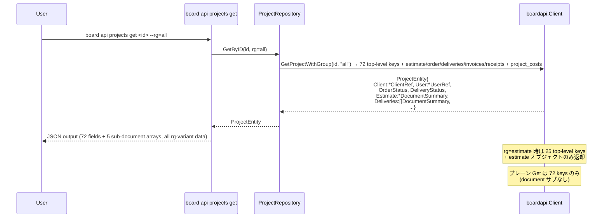

# M44: ProjectEntity 全面再設計（Breaking / 最大規模）

## Overview
| 項目 | 値 |
|------|---|
| ステータス | 未着手 |
| 依存 | M43 完了（`ClientRef` が M39 で既存、M43 で参照実績） |
| 対象ファイル | `internal/boardapi/projects.go` ほか downstream 15-18 ファイル |
| 工数見積 | M43 の 2-3 倍（68 フィールド追加、nested 型 7-8 件新規、DocumentSummary 大幅拡張、response_group 6 バリアント検証） |
| 破壊度 | **最大**（`Status` / `Code` / `Memo` / `StartDate` / `EndDate` / `Delivery`/`Invoice`/`Receipt` 単一ポインタの 7 要素廃止、`ClientID` → nested `Client.ID`、SQLite cache invalidate 必須） |
| 親 | plans/board-phase-k-roadmap.md |

## Goal

BOARD API `/v1/projects` と `/v1/projects/{id}`（`response_group` 6 バリアント含む）の実レスポンスに完全一致する `ProjectEntity` 構造へ書き換える。

M13（compliance roadmap）で判明した「68 未マップ + `DocumentSummary` 配列化 + nested client 構造」を一気に解消。LLM / MCP 経由で silent data loss を招いている現状を 1 コミット群で断つ。

## 背景（M13 発見事項、実 dump 確認済）

実 API dump `tmp/e2e-artifacts/projects_95944469.json`（Get プレーン）から抽出した **72 トップレベルキー**：

```
id, project_no, management_no, name,
client, client_branch, contact, company_branch, user, hubspot,
client_name_disp_kbn, client_name_disp_kbn_name,
client_name_for_post_disp_kbn, client_name_for_post_disp_kbn_name,
company_name_disp_kbn, company_name_disp_kbn_name,
company_name_for_post_disp_kbn, company_name_for_post_disp_kbn_name,
total, tax, cost_total, cost_tax, invoice_total, invoice_tax,
estimate_date, delivery_date, delivery_date_text, invoice_dates, ordered_date,
payment_term_id, payment_term_name,
order_status, order_status_name, delivery_status, delivery_status_name,
invoice_timing_kbn, invoice_timing_kbn_name,
contract_start_date, contract_end_date,
periodical_invoice_interval, periodical_invoice_payment_kbn,
contract_end_alert_flg, auto_renewal_flg, auto_renewal_period_month,
monthly_invoice_payment_kbn, delivery_document_kbn,
project_type_id, project_type_name, project_type2_id, project_type2_name,
project_type3_id, project_type3_name,
group_id, group_name, tags,
accounting_type_id, accounting_type_name,
accounting_type2_id, accounting_type2_name,
accounting_type3_id, accounting_type3_name,
in_house_memo, payment_method_kbn, payment_method_kbn_name,
to, cc, lock_flg, archive_flg,
document_setting_id, document_setting_name,
created_at, updated_at
```

`rg=estimate` dump のトップレベルは **25 キー + `estimate` サブオブジェクト**（`project_no, management_no, client, contact, user, total, tax, estimate_date, invoice_dates, order_status(_name), delivery_status(_name), project_type{,2,3}_id/name, group_id/name, created_at, updated_at, id, name, estimate`）。

→ BOARD API は **「List/rg-variant = 25 キーサブセット」vs「プレーン Get = 72 キー」vs「rg=all = 72 キー + 全ドキュメントオブジェクト + project_costs」** の 3 段階。M43 の 2 段階モデルを拡張した構造。

### 概念不整合（逆方向）
- `Code` → 実 API に不在（`project_no` / `management_no` で代替）
- `Status` → 実 API は `order_status` / `delivery_status` の 2 軸に分岐
- `Memo` → 実 API は `in_house_memo`
- `StartDate` / `EndDate` → 実 API は `contract_start_date` / `contract_end_date`
- `Delivery` / `Invoice` / `Receipt` 単一ポインタ → 実 API は `deliveries` / `invoices` / `receipts` 配列（estimate / order のみ単一オブジェクト）

## フィールド設計

### 削除（逆方向不整合 7 要素 + 1）
- `Code string` → **削除**（`ProjectNo *int` / `ManagementNo *string` で代替）
- `Status string` → **削除**（`OrderStatus int` / `DeliveryStatus int` + `*Name` に分解）
- `Memo string` → **削除**（`InHouseMemo *string` で代替）
- `StartDate string` → **削除**（`ContractStartDate *string` で代替）
- `EndDate string` → **削除**（`ContractEndDate *string` で代替）
- `Delivery *DocumentSummary` → **削除**（`Deliveries []DocumentSummary` に一本化、M29 時点で両存在だったが単数形は誤り）
- `Invoice *DocumentSummary` → **削除**（同上）
- `Receipt *DocumentSummary` → **削除**（同上）
- `ClientID int` → **削除**（nested `Client *ClientRef` の `Client.ID` に統合）

### 既存維持（4）
- `ID int` — `id`
- `Name string` — `name`
- `UpdatedAt string` — `updated_at`
- `CreatedAt string` — `created_at`

### 新規追加（List/Search 共通 21 フィールド）

実 dump で rg-variant にも出現するフィールド群。List レスポンスでもこのサブセットは必ず返る。

| Go field | JSON tag | 型 | 備考 |
|----------|----------|----|----|
| ProjectNo | `project_no` | `*int` | 4106 等。null 可 |
| ManagementNo | `management_no` | `*string` | dump は null。運用で使用される場合あり |
| Client | `client` | `*ClientRef` | **M39 `ClientRef` を再利用**。nested `{id, name, name_disp, custom_no}` 4 キー |
| Contact | `contact` | `*ContactRef` | **新規型**。dump は null だが構造未観測 → nested 想定で placeholder |
| User | `user` | `*UserRef` | **新規型**。`{id, last_name, first_name}` 3 キー |
| Total | `total` | `string` | **文字列**（"90000.0"）。BOARD は金額を string で返す |
| Tax | `tax` | `string` | **文字列**（"9000.0"） |
| EstimateDate | `estimate_date` | `*string` | ISO date |
| InvoiceDates | `invoice_dates` | `[]string` | 空配列あり |
| OrderStatus | `order_status` | `int` | 1/2/3... |
| OrderStatusName | `order_status_name` | `string` | 「見積中(中)」等 |
| DeliveryStatus | `delivery_status` | `int` | 1/2/3... |
| DeliveryStatusName | `delivery_status_name` | `string` | 「未着手」等 |
| ProjectTypeID | `project_type_id` | `*int` | null 可 |
| ProjectTypeName | `project_type_name` | `*string` | |
| ProjectType2ID | `project_type2_id` | `*int` | 第 2 階層カテゴリ |
| ProjectType2Name | `project_type2_name` | `*string` | |
| ProjectType3ID | `project_type3_id` | `*int` | 第 3 階層カテゴリ |
| ProjectType3Name | `project_type3_name` | `*string` | |
| GroupID | `group_id` | `*int` | null 可（dump null） |
| GroupName | `group_name` | `*string` | null 可 |

### 新規追加（Get 限定 47 フィールド）

プレーン Get（`response_group` 未指定）でのみ返却されるフィールド群。

**nested 型 3 件（構造未確認、dump が null のため placeholder）**
| Go field | JSON tag | 型 | 備考 |
|----------|----------|----|----|
| ClientBranch | `client_branch` | `*ClientBranchRef` | **新規型**。null 観測のみ、構造未確認（**Risk-3**） |
| CompanyBranch | `company_branch` | `*CompanyBranchRef` | **新規型**。同上 |
| Hubspot | `hubspot` | `*HubspotRef` | **新規型**。`{hubspot_deal_id: null}` 1 フィールド確認済 |

**表示区分（disp_kbn）系 8 フィールド**
| Go field | JSON tag | 型 | 備考 |
|----------|----------|----|----|
| ClientNameDispKbn | `client_name_disp_kbn` | `int` | 1 |
| ClientNameDispKbnName | `client_name_disp_kbn_name` | `string` | 「会社名のみ」等 |
| ClientNameForPostDispKbn | `client_name_for_post_disp_kbn` | `int` | |
| ClientNameForPostDispKbnName | `client_name_for_post_disp_kbn_name` | `string` | |
| CompanyNameDispKbn | `company_name_disp_kbn` | `int` | |
| CompanyNameDispKbnName | `company_name_disp_kbn_name` | `string` | |
| CompanyNameForPostDispKbn | `company_name_for_post_disp_kbn` | `int` | |
| CompanyNameForPostDispKbnName | `company_name_for_post_disp_kbn_name` | `string` | |

**金額・集計系 4 フィールド**
| Go field | JSON tag | 型 | 備考 |
|----------|----------|----|----|
| CostTotal | `cost_total` | `int` | **数値**（0 観測）。Total が string なのに対し `cost_total` は int、**型混在** |
| CostTax | `cost_tax` | `int` | 同上 |
| InvoiceTotal | `invoice_total` | `string` | **文字列**（"270000.0"） |
| InvoiceTax | `invoice_tax` | `string` | **文字列**（"27000.0"） |

**日付系 3 フィールド**
| Go field | JSON tag | 型 | 備考 |
|----------|----------|----|----|
| DeliveryDate | `delivery_date` | `*string` | トップレベル納期（rg=delivery の `deliveries[].delivery_date` と別物） |
| DeliveryDateText | `delivery_date_text` | `*string` | 自由記述納期 |
| OrderedDate | `ordered_date` | `*string` | 受注日 |

**支払条件・決済系 4 フィールド**
| Go field | JSON tag | 型 | 備考 |
|----------|----------|----|----|
| PaymentTermID | `payment_term_id` | `*int` | 支払条件 ID |
| PaymentTermName | `payment_term_name` | `*string` | |
| PaymentMethodKbn | `payment_method_kbn` | `int` | 1=銀行振込 等 |
| PaymentMethodKbnName | `payment_method_kbn_name` | `string` | |

**請求タイミング・契約管理系 11 フィールド**
| Go field | JSON tag | 型 | 備考 |
|----------|----------|----|----|
| InvoiceTimingKbn | `invoice_timing_kbn` | `int` | 2=定期請求 |
| InvoiceTimingKbnName | `invoice_timing_kbn_name` | `string` | |
| ContractStartDate | `contract_start_date` | `*string` | 旧 `StartDate` の代替 |
| ContractEndDate | `contract_end_date` | `*string` | 旧 `EndDate` の代替 |
| PeriodicalInvoiceInterval | `periodical_invoice_interval` | `*int` | |
| PeriodicalInvoicePaymentKbn | `periodical_invoice_payment_kbn` | `*int` | |
| ContractEndAlertFlg | `contract_end_alert_flg` | `int` | 0/1 |
| AutoRenewalFlg | `auto_renewal_flg` | `int` | 0/1 |
| AutoRenewalPeriodMonth | `auto_renewal_period_month` | `*int` | |
| MonthlyInvoicePaymentKbn | `monthly_invoice_payment_kbn` | `*int` | |
| DeliveryDocumentKbn | `delivery_document_kbn` | `int` | |

**会計区分 6 フィールド**
| Go field | JSON tag | 型 | 備考 |
|----------|----------|----|----|
| AccountingTypeID | `accounting_type_id` | `*int` | null 可（dump null） |
| AccountingTypeName | `accounting_type_name` | `*string` | |
| AccountingType2ID | `accounting_type2_id` | `*int` | |
| AccountingType2Name | `accounting_type2_name` | `*string` | |
| AccountingType3ID | `accounting_type3_id` | `*int` | |
| AccountingType3Name | `accounting_type3_name` | `*string` | |

**その他 8 フィールド**
| Go field | JSON tag | 型 | 備考 |
|----------|----------|----|----|
| Tags | `tags` | `[]string` | 空配列あり |
| InHouseMemo | `in_house_memo` | `*string` | 旧 `Memo` の代替 |
| To | `to` | `*string` | 送付先 To |
| CC | `cc` | `*string` | 送付先 CC |
| LockFlg | `lock_flg` | `int` | 0/1 |
| ArchiveFlg | `archive_flg` | `int` | 0/1 |
| DocumentSettingID | `document_setting_id` | `*int` | |
| DocumentSettingName | `document_setting_name` | `*string` | |

**M45 スコープ（暫定処理）**
| Go field | JSON tag | 型 | 備考 |
|----------|----------|----|----|
| ProjectCosts | `project_costs` | `json.RawMessage` | rg=all でのみ出現。M45 で `[]ProjectCostEntity` 化（現時点では raw 保持） |

### nested 型の設計（新規 6 件、再利用 1 件）

M43 で確立した `*Ref` パターンを踏襲。

**再利用**
```go
// internal/boardapi/client_ref.go（既存、M39）
type ClientRef struct {
    ID       int    `json:"id"`
    Name     string `json:"name"`
    NameDisp string `json:"name_disp"`
    CustomNo string `json:"custom_no"`
}
```

**新規: `internal/boardapi/user_ref.go`**
```go
// dump 観測: {"id":38516996,"last_name":"立花","first_name":"拓也"}
type UserRef struct {
    ID        int    `json:"id"`
    LastName  string `json:"last_name"`
    FirstName string `json:"first_name"`
}
```

**新規: `internal/boardapi/contact_ref.go`**
```go
// 構造未観測（dump 全件で null）。M10 ContactEntity Get 応答からの推定。
// smoke テスト後に確定する。
type ContactRef struct {
    ID        int    `json:"id"`
    LastName  string `json:"last_name"`
    FirstName string `json:"first_name"`
}
```

**新規: `internal/boardapi/client_branch_ref.go`**
```go
// 構造未観測（dump null）。M09 ClientBranchEntity の再設計形から推定。
type ClientBranchRef struct {
    ID   int    `json:"id"`
    Name string `json:"name"`
}
```

**新規: `internal/boardapi/company_branch_ref.go`**
```go
// 構造未観測（dump null）。自社支店想定。
type CompanyBranchRef struct {
    ID   int    `json:"id"`
    Name string `json:"name"`
}
```

**新規: `internal/boardapi/hubspot_ref.go`**
```go
// dump 観測: {"hubspot_deal_id":null}
type HubspotRef struct {
    HubspotDealID *string `json:"hubspot_deal_id"`
}
```

**新規: `internal/boardapi/document_detail.go`**
```go
// DocumentSummary.details[] 配下の行明細
type DocumentDetail struct {
    No                    int     `json:"no"`
    DetailDate            *string `json:"detail_date"`
    Description           string  `json:"description"`
    Quantity              *string `json:"quantity"`          // "1.0" or null
    Unit                  *string `json:"unit"`              // "月" or null
    UnitPrice             *string `json:"unit_price"`        // "50000.0" or null
    Price                 *string `json:"price"`             // "50000.0" or null
    TaxRate               string  `json:"tax_rate"`          // "10.0"
    TaxWithholdingFlg     int     `json:"tax_withholding_flg"`
    TaxIncludedFlg        int     `json:"tax_included_flg"`
    ReducedTaxRateKbn     int     `json:"reduced_tax_rate_kbn"`
    SectionDescription    *string `json:"section_description"`
    SectionSubtotal       *string `json:"section_subtotal"`
    DocumentDetailKbn     int     `json:"document_detail_kbn"`
    DocumentDetailKbnName string  `json:"document_detail_kbn_name"`
    DeductionApplicable   bool    `json:"deduction_applicable"`
}
```

**補足（Entity のフラット展開を選択）**: `project_type_id` / `accounting_type_id` / `group_id` 等は BOARD が flat な `{id, name}` ペアで返すため **ネスト化せず** `*int` / `*string` で展開。M11 で確認された「ネストは client の子特有」の法則に従う。

### DocumentSummary 拡張（共通 5 + type-specific 12 = 17 追加）

実 dump（5 response_group バリアント）から抽出。

**既存 `internal/boardapi/document_summary.go`**:
```go
type DocumentSummary struct {
    ID             int     `json:"id"`
    Message        *string `json:"message"`
    Total          string  `json:"total"`
    Tax            string  `json:"tax"`
    TaxWithholding string  `json:"tax_withholding"`
    LockFlg        int     `json:"lock_flg"`
}
```

**採用方針: 単一 struct + `omitempty` + nullable pointer** （M43 同方針）
→ per-type struct 分割は可読性が落ちるため回避。rg バリアントに応じて欠落フィールドは zero-value／nil として自然に扱う。

**共通追加 5 フィールド**（estimate/order/delivery/invoice/receipt 全てで出現）
| Go field | JSON tag | 型 | 備考 |
|----------|----------|----|----|
| SealApprovalStatus | `seal_approval_status` | `int` | 1 観測 |
| DocumentAmountDispKbn | `document_amount_disp_kbn` | `int` | 1 観測 |
| BlankDateFlg | `blank_date_flg` | `int` | 0/1 |
| DeliveryPlace | `delivery_place` | `*string` | null / "御社指定場所" |
| Details | `details` | `[]DocumentDetail` | **新規型 `DocumentDetail` 追加** |

**type-specific 追加 12 フィールド**（omitempty で該当 rg のみ埋まる）
| Go field | JSON tag | 型 | 出現 rg |
|----------|----------|----|-------|
| ValidPeriod | `valid_period,omitempty` | `*string` | estimate |
| DispOrderDate | `disp_order_date,omitempty` | `*string` | order |
| DispOrderReceiveDate | `disp_order_receive_date,omitempty` | `*string` | order |
| DeliveryDate | `delivery_date,omitempty` | `*string` | delivery |
| DispDeliveryDate | `disp_delivery_date,omitempty` | `*string` | delivery |
| DispDeliveryReceiveDate | `disp_delivery_receive_date,omitempty` | `*string` | delivery |
| InvoiceDate | `invoice_date,omitempty` | `*string` | invoice |
| PaymentLimitDate | `payment_limit_date,omitempty` | `*string` | invoice |
| DispInvoiceDate | `disp_invoice_date,omitempty` | `*string` | invoice |
| MultiBankInfoFlg | `multi_bank_info_flg,omitempty` | `*int` | invoice |
| ReceiptDate | `receipt_date,omitempty` | `*string` | receipt |
| DispReceiptDate | `disp_receipt_date,omitempty` | `*string` | receipt |

## Accessor（後方互換なし = 呼び出し側置換）

- `p.Code` → `derefInt(p.ProjectNo)` もしくは `derefString(p.ManagementNo)` を状況に応じて選択
- `p.Status` → `p.OrderStatusName` + `p.DeliveryStatusName` を組み合わせて表示
- `p.Memo` → `derefString(p.InHouseMemo)`
- `p.StartDate` / `p.EndDate` → `derefString(p.ContractStartDate)` / `derefString(p.ContractEndDate)`
- `p.ClientID` → `p.Client.ID`（`p.Client != nil` のガード必須）
- `p.Delivery` → `p.Deliveries[0]`（長さ判定要）
- `p.Invoice` → `p.Invoices[0]`
- `p.Receipt` → `p.Receipts[0]`

後方互換レイヤーは設けない（Phase K 方針、M43 踏襲）。

## Sequence Diagram



## TDD Test Design

### Unit テスト（Red → Green → Refactor）

| # | テストケース | 入力 | 期待出力 |
|---|-------------|------|---------|
| U1 | `TestProjectEntity_UnmarshalGet_AllFields` | `projects_95944469.json`（プレーン Get 実 dump） | 72 フィールド全埋まり、nested 型 `Client.ID=53661066` / `User.LastName="立花"` / `Hubspot.HubspotDealID==nil` を個別検証 |
| U2 | `TestProjectEntity_UnmarshalList_SparseFields` | `projects_0.json` List レスポンスの 1 件 | List/Search 共通 21 + ID/Name/CreatedAt/UpdatedAt = 25 が埋まり、Get 限定 47 + project_costs は nil/zero |
| U3 | `TestProjectEntity_UnmarshalRgEstimate` | `projects_rg_estimate_95944469.json` | `Estimate != nil` かつ `Estimate.ValidPeriod == "御見積後１ヶ月"`、`Estimate.Details[0].No == 11`、`Order/Deliveries/Invoices/Receipts` は nil/empty |
| U4 | `TestProjectEntity_UnmarshalRgOrder` | `projects_rg_order_95944469.json` | `Order != nil` かつ `Order.Details` 2 件、`Estimate` は nil |
| U5 | `TestProjectEntity_UnmarshalRgDelivery` | `projects_rg_delivery_95944469.json` | `Deliveries` 1 件、`Deliveries[0].DeliveryDate == "2026-06-30"`、`Deliveries[0].DeliveryPlace == "御社指定場所"` |
| U6 | `TestProjectEntity_UnmarshalRgInvoice` | `projects_rg_invoice_95944469.json` | `Invoices` 3 件、`Invoices[0].InvoiceDate == "2026-06-30"`、`Invoices[0].PaymentLimitDate == "2026-07-20"` |
| U7 | `TestProjectEntity_UnmarshalRgReceipt` | `projects_rg_receipt_95944469.json` | `Receipts` 3 件、`Receipts[0].ReceiptDate == "2026-06-30"` |
| U8 | `TestProjectEntity_UnmarshalRgAll` | `projects_rg_all_95944469.json` | `Estimate != nil && Order != nil && len(Deliveries)==1 && len(Invoices)==3 && len(Receipts)==3 && len(ProjectCosts)>=0` |
| U9 | `TestProjectEntity_NullableNested_NilForNull` | `client_branch: null`, `contact: null` | `ClientBranch == nil`, `Contact == nil`（panic しない） |
| U10 | `TestProjectSearchParams_QueryEncoding` | 全 5 パラメータ | `client_id=...&name=...&status=...&updated_at_from=...&response_group=...` エンコード確認 |
| U11 | `TestDocumentDetail_NullableNumeric` | `quantity:null, price:null` の実 invoice 明細 | `Quantity == nil && Price == nil`（string 型 null 許容） |
| U12 | `TestProjectEntity_TagsEmptyArray` | `tags: []` | `Tags` は `[]string{}`（nil ではなく空スライス）|

### E2E テスト（`internal/boardapi/e2e_projects_test.go`）

既存 M13 版を置換。

- `TestE2E_Projects_List_Strict` — List 2400+ items で未マップ 0 確認
- `TestE2E_Projects_Get_Strict` — プレーン Get で 72 フィールド + nested 3 型が埋まり未マップ 0
- `TestE2E_Projects_GetWithGroup_Strict` — 6 subtest（estimate/order/delivery/invoice/receipt/all）、各 response_group で未マップ 0 を個別検証
- `TestE2E_Projects_Search_Strict` — 未マップ 0（List と同じサーフェス）

## Implementation Steps

### Phase 1: nested 型の追加（新規 6 ファイル）
- [ ] Step 1: `internal/boardapi/user_ref.go` 作成（`{id, last_name, first_name}`）
- [ ] Step 2: `internal/boardapi/contact_ref.go` 作成（placeholder、Risk-3 コメント）
- [ ] Step 3: `internal/boardapi/client_branch_ref.go` 作成（placeholder）
- [ ] Step 4: `internal/boardapi/company_branch_ref.go` 作成（placeholder）
- [ ] Step 5: `internal/boardapi/hubspot_ref.go` 作成（1 フィールド）
- [ ] Step 6: `internal/boardapi/document_detail.go` 作成（16 フィールド）

### Phase 2: DocumentSummary 拡張
- [ ] Step 7: `internal/boardapi/document_summary.go` に共通 5 + type-specific 12 = 17 フィールド追加、全て `omitempty` + nullable

### Phase 3: ProjectEntity 書き換え
- [ ] Step 8: `internal/boardapi/projects.go` の `ProjectEntity` を 68 フィールド + `Deliveries/Invoices/Receipts []DocumentSummary` に書き換え
- [ ] Step 9: `Status` / `Code` / `Memo` / `StartDate` / `EndDate` / `ClientID` / 単数形 Delivery/Invoice/Receipt を削除
- [ ] Step 10: `ProjectCosts json.RawMessage` で M45 までの暫定処理
- [ ] Step 11: `ProjectSearchParams.Status` を残しつつ、`status` query が実 API で無視される旨のコメント追記（compliance roadmap 9 件連続観測）

### Phase 4: Unit test 修正（TDD Red）
- [ ] Step 12: `internal/boardapi/projects_test.go` に U1-U12 を追加（先に Red）
- [ ] Step 13: `go test ./internal/boardapi/` で U1-U12 Red 確認

### Phase 5: Entity 調整（Green）
- [ ] Step 14: JSON tag / 型調整で U1-U12 Green
- [ ] Step 15: dump fixture を `internal/boardapi/testdata/` に配置（もしくは tmp/e2e-artifacts 参照）

### Phase 6: Downstream 修正（15-18 ファイル）
- [ ] Step 16: `internal/repository/projects.go` — `ProjectEntity` 参照箇所の置換
- [ ] Step 17: `internal/service/find/find_project.go` — `p.Status` / `p.Code` / `p.Memo` / `p.ClientID` 参照を新形に置換
- [ ] Step 18: `internal/service/find/find_client.go` — project enrichment で ClientID 参照を `p.Client.ID` に変更
- [ ] Step 19: `internal/cli/api_projects.go` — 出力表示のカラム見直し
- [ ] Step 20: `internal/cli/find_project.go` — 同上
- [ ] Step 21: `internal/output/masker.go` / pretty printer で新フィールドを扱う（`tags` / `in_house_memo` / `cc` / `to` はマスク候補）
- [ ] Step 22: `internal/mcpserver/tools_find.go` — find_project tool schema/response 整形
- [ ] Step 23: 各パッケージの `_test.go` でモック JSON を新形式に更新
- [ ] Step 24: `internal/service/find/find_invoice.go` / `find_delivery.go` / `find_receipt.go` — 複数形配列前提のコードを再確認（M28/M29 で一部対応済）

### Phase 7: 検証
- [ ] Step 25: `go build ./...` PASS
- [ ] Step 26: `go vet ./...` PASS
- [ ] Step 27: `go test -count=1 ./...` 全 PASS
- [ ] Step 28: `go test -tags e2e -v -count=1 -run TestE2E_Projects ./internal/boardapi/` 全 PASS（4 テスト + GetWithGroup 6 subtest = 10 パス、実 req ~11）
- [ ] Step 29: `go test -tags e2e -v -count=1 -run TestE2E_FindProject ./internal/service/find/` PASS
- [ ] Step 30: 手動動作確認: `./board api projects get 95944469 --pretty` で実 API 応答と一致
- [ ] Step 31: 手動動作確認: `./board api projects get 95944469 --rg=all --pretty` で全 sub-document 表示確認

### Phase 8: commit + PR
- [ ] Step 32: 複数コミットに分割
  - コミット 1: nested 型 6 件 + DocumentDetail
  - コミット 2: DocumentSummary 拡張
  - コミット 3: ProjectEntity 書き換え + Unit test
  - コミット 4: downstream 修正
  - コミット 5: E2E 更新 + ロードマップ反映
- [ ] Step 33: `plans/board-phase-k-roadmap.md` の M44 チェックボックスを更新、Current Focus を M45 に
- [ ] Step 34: `plans/board-compliance-roadmap.md` の Changelog に M44 完了を追記

## Risks

| # | リスク | 影響度 | 対策 |
|---|--------|--------|------|
| 1 | 金額フィールドの string/int 混在（`total`:string / `cost_total`:int）で型誤認 | **高** | 各フィールドを dump で個別確認済（本計画で確定）。Unit U1 で `Total` と `CostTotal` を別 assertion |
| 2 | `Name` filter が BOARD API 全般で無視される（9 件連続観測）→ `status` も無視の可能性 | 中 | `ProjectSearchParams.Status` は残しつつ godoc に「観測で無視」コメント追記 |
| 3 | `client_branch` / `contact` / `company_branch` の nested 構造が null 観測のみ、実構造未確認 | **高** | placeholder として `*Ref` 型のみ定義。smoke 実行時に実データが埋まるプロジェクトを発見したら追加フィールドを補完。StrictFieldDiff が未マップを検出した時点でテスト失敗させ気づく仕掛け |
| 4 | `project_costs` の配列要素構造が rg=all 時にしか露出せず、M44 スコープ外 | 中 | `json.RawMessage` で保持し M45 で確定。unmarshal エラーは起きない |
| 5 | SQLite cache の既存 JSON blob が旧 schema のまま残り unmarshal panic | **高** | `board cache clear` 実行を M44 リリースノート必須化。もしくは migration ロジック追加検討 |
| 6 | `DocumentSummary` 単一構造体 + omitempty 方式で rg=estimate 時に `InvoiceDate` が zero-value となる曖昧さ | 中 | nullable pointer 徹底（`*string`）で nil=未セットを明示。U3-U8 で必ず検証 |
| 7 | `ProjectNo *int` / `ManagementNo *string` の型差で検索キー設計ブレ | 低 | find 層で両対応ヘルパー `matchProjectNumber(p, query string) bool` を追加 |
| 8 | Rate Limit 3 req/sec で E2E 全 10 件を単発実行すると失敗 | 中 | per-batch 実行（List / Get / Search / GetWithGroup 6 subtest を分割）を README に明記 |
| 9 | `tags` の型が `[]string` ではなく `[]{id,name}` の可能性（dump は `[]` 空配列のみ） | 中 | M43 と同じ判断（`[]string` 仮置き）。実データで違えば別パッチで修正 |
| 10 | downstream の `find_project.go` / `find_invoice.go` 等で `Deliveries[0]` / `Invoices[0]` 参照時の長さガード漏れ | 中 | helper `firstDocument(docs []DocumentSummary) *DocumentSummary` を導入し全箇所で強制 |

## 既存コードの再利用

- `internal/boardapi/client_ref.go`（M39 で作成）— Project.Client として **再利用**
- `internal/boardapi/document_summary.go`（既存）— フィールド拡張のみで型名温存
- `internal/testhelper/strict_field_diff.go` — E2E で 6 rg-variant 全てに適用
- `tmp/e2e-artifacts/projects_*.json` 8 ファイル — Unit test fixture および実データ根拠
- M43 で確立した `*string` / `*int` + `omitempty` + `derefString` / `derefInt` ヘルパー — そのまま適用
- M43 で作成した `internal/service/find/text_match.go` の `derefString` — 再利用、新たに `derefInt` 追加

## 検証基準（Acceptance Criteria）

- [ ] `ProjectEntity` に 72 トップレベルフィールドが定義されている（`project_costs` は `json.RawMessage`）
- [ ] nested 型 6 件（`ClientRef` 再利用 + `UserRef` / `ContactRef` / `ClientBranchRef` / `CompanyBranchRef` / `HubspotRef` 新規 5 件 + `DocumentDetail` 新規 1 件）が定義されている
- [ ] `DocumentSummary` が 17 フィールド拡張済み
- [ ] `Status` / `Code` / `Memo` / `StartDate` / `EndDate` / `ClientID` / `Delivery` / `Invoice` / `Receipt`（単数）が完全削除され、grep で残存参照 0
- [ ] Unit test U1-U12（12 件）全 Green
- [ ] E2E `TestE2E_Projects_(List|Get|Search|GetWithGroup)` 全 Green、未マップ 0
- [ ] `TestE2E_FindProject_*` 全 Green
- [ ] 手動動作確認: `./board api projects get 95944469 --rg=all --pretty` で実 API と一致
- [ ] `go vet` / `go test` 警告 0
- [ ] Phase K ロードマップ M44 チェックボックス更新済

## Notes

### dump 観測・設計判断の引き継ぎ
- **型混在パターン**: `total` / `tax` / `invoice_total` / `invoice_tax` が **string**、`cost_total` / `cost_tax` が **int** という奇妙な混在は BOARD API 固有の実装。Go 側ではそのまま写し取る（変換せず）。将来の集計機能では利用側で適切に変換する。
- **3 段階 response モデル**: List/rg-variant 25 keys vs プレーン Get 72 keys vs rg=all 72+document arrays。単一 struct + omitempty で 3 段階全対応できることを dump で確認済。
- **nested null 問題（Risk-3）**: 当該 project は `client_branch` / `contact` / `company_branch` が全て null。placeholder 型で埋まる構造を先行定義しておき、実データが埋まる project が見つかった時点で StrictFieldDiff が未マップを検出 → 追加フィールド補完する設計。
- **`project_costs` の M45 委譲**: rg=all 時のみ出現し中身が空配列のため構造未確認。`json.RawMessage` で受けて M45 実施時に `[]ProjectCostEntity` 化する。この方針なら M44 で unmarshal エラーを起こさず、M45 の互換性破壊もない。
- **`Memo` 逆方向 10 件連続**: M03/M04/M06/M08(Name)/M09/M10/M11/M12/M13 で 9 件、M44 実施後は 10 件目。`docs/specs/board_cli_mcp_ultra_detailed_design_ja.md` 仕様書 §39 に一括追記推奨。
- **`hubspot` の扱い**: 1 フィールド nested だが HubspotRef として切り出す。将来 CRM 連携強化時に拡張余地を確保（単独型のほうが後で拡張しやすい）。
- **複数コミット分割**: M43 は 4 コミットで分割成功。M44 は規模が 2-3 倍のため 5 コミットに分割（nested 型 / DocumentSummary / ProjectEntity / downstream / E2E）で PR をレビュー可能な粒度に保つ。
- **cache invalidate アナウンス**: M43 に続き M44 も Breaking のため v0.4.0-rc2 リリースノートで `board cache clear` を必須手順として案内する。ユーザー影響は M43 + M44 で Client + Project の両 schema 変更となり最大規模。
- **`ProjectSearchParams.Name` / `Status` は無視される**: compliance roadmap で 9 件連続確認済。保持するが godoc にて観測結果を明記。将来 API 側が実装した際のため API は温存する方針（Phase K 方針：API サーフェス削減は別 M）。
