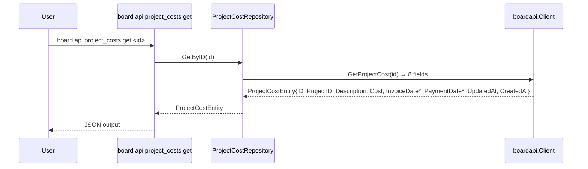

# M45: ProjectCostEntity 全面再設計（Breaking）

## Overview
| 項目 | 値 |
|------|---|
| ステータス | 未着手 |
| 依存 | M44 完了（M44 で `ProjectCosts json.RawMessage` として暫定保持中、M45 で `[]ProjectCostEntity` 化） |
| 対象ファイル | `internal/boardapi/project_costs.go` ほか downstream 7-8 ファイル |
| 工数見積 | M43 並（小規模、8 フィールド構造） |
| 破壊度 | 中（`Name` / `CostType` / `Amount` / `Memo` の 4 フィールド廃止、概念モデル書き直し） |
| 親 | plans/board-phase-k-roadmap.md |

## Goal

BOARD API `/v1/project_costs` と `/v1/project_costs/{id}` の実レスポンスに完全一致する `ProjectCostEntity` 構造へ書き換える。

M11（compliance roadmap）で発見された「8 フィールド中 4 つ逆方向不整合 + 概念モデル根本ズレ」を解消。

## 背景（M11 発見事項、実 dump 確認済）

実 API dump `tmp/e2e-artifacts/project_costs_33291004.json`（Get）から抽出した **8 フィールド**:

```json
{
  "id": 33291004,
  "project_id": 85079735,
  "description": "S2への支払い",
  "cost": 400000,
  "invoice_date": "2020-02-01",
  "payment_date": "2020-02-29",
  "created_at": "2020-06-15T11:02:58.000+09:00",
  "updated_at": "2020-06-15T11:02:58.000+09:00"
}
```

### 概念モデルの根本的なズレ

- **既存 Entity の想定**: 「労務費/資材費のカテゴリ集計」（`Name` / `CostType` / `Amount`）
- **実 API の実態**: 「プロジェクト原価の個別支払い記録（仕訳 entry）」（`description` + `cost` + `invoice_date` + `payment_date`）

BOARD の project_costs は **プロジェクト原価台帳の行（個別支払い記録のリスト）** であり、カテゴリ集計ではない。M44 完了後は M43/M44 で確立した `*Ref` / nullable pointer / derefString パターンが適用できる。

## フィールド設計

### 削除（逆方向不整合 4 フィールド）
- `Name string` → 実 API に不在
- `CostType string` → 実 API に不在（概念自体が存在しない）
- `Amount int` → 実 API に不在（`cost` が類似だが意味が違う）
- `Memo string` → 実 API に不在（`description` が近いが別フィールド）

### 既存維持（4）
- `ID int` — `id`
- `ProjectID int` — `project_id`
- `UpdatedAt string` — `updated_at`
- `CreatedAt string` — `created_at`

### 新規追加（4）

| Go field | JSON tag | 型 | 備考 |
|----------|----------|----|----|
| Description | `description` | `string` | 支払い内容の説明。dump: "S2への支払い" |
| Cost | `cost` | `int` | 金額（整数）。dump: 400000。ProjectEntity の `cost_total` と同じく int 型 |
| InvoiceDate | `invoice_date` | `*string` | 請求日（ISO date）。dump: "2020-02-01"、null 可能性あり |
| PaymentDate | `payment_date` | `*string` | 支払日（ISO date）。dump: "2020-02-29"、null 可能性あり |

**型判断の根拠**:
- `cost`: dump で整数値 `400000`（string ではない）→ `int`
- `invoice_date` / `payment_date`: dump では値あり、他レコードで null の可能性を想定し `*string`
- `description`: dump で必ず値あり → non-null `string` で初期実装、空配列（[]）等が発生すれば `*string` に変更

## Accessor（後方互換なし = 呼び出し側置換）

- `pc.Name` → 完全削除（呼び出し元を削除 or 別情報源へ置換）
- `pc.CostType` → 完全削除
- `pc.Amount` → `pc.Cost`（int 型変換だけ）
- `pc.Memo` → `pc.Description`（概念は近い）

## Sequence Diagram



## TDD Test Design

### Unit テスト

| # | テストケース | 入力 | 期待出力 |
|---|-------------|------|---------|
| U1 | `TestProjectCostEntity_UnmarshalGet_AllFields` | `project_costs_33291004.json` | `ID=33291004, ProjectID=85079735, Description="S2への支払い", Cost=400000, InvoiceDate="2020-02-01", PaymentDate="2020-02-29"` |
| U2 | `TestProjectCostEntity_UnmarshalWithNullDates` | `invoice_date: null, payment_date: null` | `InvoiceDate == nil && PaymentDate == nil` |
| U3 | `TestProjectCostSearchParams_QueryEncoding` | `ProjectID=85079735` | `project_id=85079735` エンコード確認 |

### E2E テスト（`internal/boardapi/e2e_project_costs_test.go`）

既存 M11 版を確認し必要に応じて更新:
- `TestE2E_ProjectCosts_List_Strict` — 未マップ 0 確認
- `TestE2E_ProjectCosts_Get_Strict` — 8 フィールドが埋まり未マップ 0
- `TestE2E_ProjectCosts_Search_Strict` — 未マップ 0

## Implementation Steps

### Phase 1: Entity 書き換え
- [ ] Step 1: `internal/boardapi/project_costs.go` の `ProjectCostEntity` を 8 フィールド構造に
- [ ] Step 2: `Name` / `CostType` / `Amount` / `Memo` を削除
- [ ] Step 3: `Description` / `Cost` / `InvoiceDate *string` / `PaymentDate *string` を追加

### Phase 2: Unit test 修正（TDD Red → Green）
- [ ] Step 4: `internal/boardapi/project_costs_test.go` に U1-U3 を追加（Red）
- [ ] Step 5: `go test ./internal/boardapi/` で Red 確認
- [ ] Step 6: Entity の JSON tag 調整で Green

### Phase 3: Downstream 修正
- [ ] Step 7: `internal/repository/project_costs.go` — 参照置換
- [ ] Step 8: `internal/service/find/find_project.go` 周辺で ProjectCostEntity 参照があれば置換
- [ ] Step 9: `internal/cli/api_project_costs.go` — 出力表示（`Name/CostType/Amount/Memo` 依存箇所の置換）
- [ ] Step 10: `internal/mcpserver/` — 関連箇所の確認
- [ ] Step 11: `internal/output/` — masker 確認
- [ ] Step 12: 各パッケージの `_test.go` — モック JSON 更新

### Phase 4: M44 の json.RawMessage 連携
- [ ] Step 13: `internal/boardapi/projects.go` の `ProjectCosts json.RawMessage` を `[]ProjectCostEntity` に変更
- [ ] Step 14: M44 で実装済の ProjectEntity テストが Green を維持するか確認

### Phase 5: 検証
- [ ] Step 15: `go build ./...` PASS
- [ ] Step 16: `go vet ./...` PASS
- [ ] Step 17: `go test -count=1 ./...` 全 PASS
- [ ] Step 18: `go test -tags e2e -v -count=1 -run 'TestE2E_ProjectCosts_(List|Get|Search)$' ./internal/boardapi/` 全 PASS（3-4 req）
- [ ] Step 19: 手動動作確認: `./board api project_costs get 33291004 --pretty`

### Phase 6: commit + docs 反映
- [ ] Step 20: 複数コミットに分割
  - `feat(boardapi): M45 ProjectCostEntity を実 API 準拠に再設計（Breaking）`
  - `fix(projects): M45 ProjectEntity.ProjectCosts を json.RawMessage から []ProjectCostEntity へ変換`
  - `fix(repository,cli,test): M45 ProjectCostEntity 再設計に伴う downstream 修正`
  - `docs(plans): M45 ProjectCostEntity 再設計完了をロードマップに反映`
- [ ] Step 21: `plans/board-phase-k-roadmap.md` の M45 チェックボックス更新、Current Focus を M46 に

## Risks

| # | リスク | 影響度 | 対策 |
|---|--------|--------|------|
| 1 | `invoice_date` / `payment_date` が実 API で必ず値ありの場合、`*string` が過剰 | 低 | smoke test で null 事例を確認、必要なら `string` に戻す |
| 2 | `cost` が大きな金額で int overflow（2^31-1 = 約 21.5 億円） | 低 | int64 にしておくほうが安全。Go の int は 64bit 実装が一般的だが明示的に `int64` とする検討 |
| 3 | M44 で json.RawMessage にした ProjectCosts の実データ構造が本 dump と一致しない可能性 | 中 | rg=all dump を再確認、不整合があれば M44 のテストも修正 |
| 4 | `description` が実は nullable の可能性 | 中 | dump 1 件観測のみ。smoke 実行時に空文字 or null が見つかれば `*string` に変更 |

## 既存コードの再利用

- M43/M44 で確立した `*string` / `derefString` パターン
- M11 の compliance roadmap 記録（plans/board-compliance-roadmap.md）
- `tmp/e2e-artifacts/project_costs_33291004.json` — 実データ根拠

## 検証基準（Acceptance Criteria）

- [ ] `ProjectCostEntity` に 8 フィールドが定義されている
- [ ] `Name` / `CostType` / `Amount` / `Memo` が完全削除され、grep で残存参照 0
- [ ] `ProjectEntity.ProjectCosts` が `[]ProjectCostEntity` 型になっている
- [ ] Unit test U1-U3 全 Green
- [ ] E2E `TestE2E_ProjectCosts_(List|Get|Search)` 全 Green、未マップ 0
- [ ] M44 の `TestE2E_Projects_GetWithGroup` の rg=all subtest が引き続き Green
- [ ] `go vet` / `go test` 警告 0

## Notes

- 概念モデルの書き直しが最大の価値。「カテゴリ集計」→「支払い記録」への意味変化はユーザー向け docs（M47）で明示する
- dump 1 件のみのため、他レコードで構造違いの可能性あり。smoke 実行時に確認
- M44 の `json.RawMessage` → `[]ProjectCostEntity` 変換が M45 の核心。これで Phase K Entity 再設計の 3 件が閉じる
