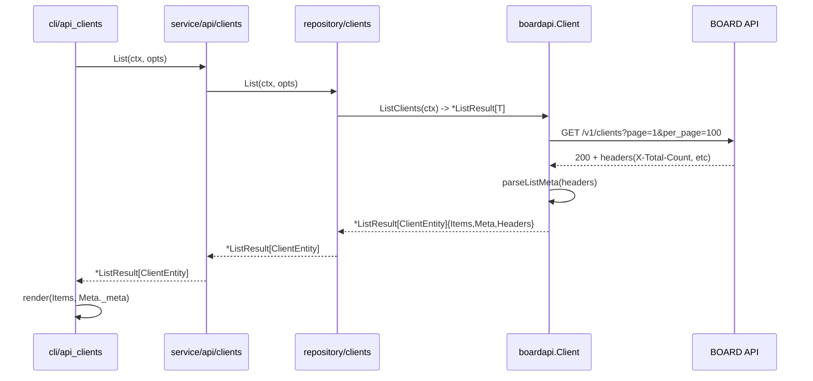

# M49 (Phase L-01): 基盤再設計 — ListResult / QueryBuilder / Header 伝達配管

## Overview
| 項目 | 値 |
|------|---|
| ステータス | 完了（2026-04-23） |
| 依存 | なし（Phase K 完走が前提） |
| 対象ファイル | internal/boardapi/result.go (新規), internal/boardapi/query.go (新規), internal/boardapi/pagination.go, internal/boardapi/clients.go (パス通し検証用 1 件のみ), internal/repository/clients.go (I/F ひな型 1 件のみ) |
| 破壊的変更 | あり（`ListPage[T]`→`ListResult[T]` 統合で `PageResult[T]` 削除を検討） |
| 親ロードマップ | plans/board-phase-l-roadmap.md |

## Goal

api 層を「ヘッダー情報込みで結果を返す」パイプラインに再設計するための基盤を敷く。具体的な SearchParams 刷新は M50 以降で行うため、M49 ではあくまで **型と共通ヘルパと配管**のみを整備する。clients だけを代表にビルドが通るところまで通し、他 21 リソースは M49 の時点では未追従でよい（M50 以降で順次）。

## Design

### 1. `internal/boardapi/result.go`（新規）

```go
package boardapi

import (
    "net/http"
    "strconv"
    "time"
)

// ListResult is the standardized return type for list / search endpoints.
// It carries the parsed items, parsed metadata, and the raw response headers
// so callers (repository, service, cli, output) can surface pagination info,
// rate limits, and caching hints uniformly.
type ListResult[T any] struct {
    Items   []T         `json:"items"`
    Meta    ListMeta    `json:"meta"`
    Headers http.Header `json:"-"` // raw for advanced callers; not marshaled
}

// ItemResult mirrors ListResult for single-item endpoints (Get*).
type ItemResult[T any] struct {
    Item    *T          `json:"item"`
    Meta    ItemMeta    `json:"meta"`
    Headers http.Header `json:"-"`
}

// ListMeta holds commonly-needed response metadata for list endpoints.
// Field naming uses snake_case to match cli JSON output.
type ListMeta struct {
    TotalCount         int       `json:"total_count,omitempty"`
    Page               int       `json:"page,omitempty"`
    PerPage            int       `json:"per_page,omitempty"`
    RateLimitRemaining int       `json:"rate_limit_remaining,omitempty"`
    RateLimitLimit     int       `json:"rate_limit_limit,omitempty"`
    RateLimitReset     time.Time `json:"rate_limit_reset,omitempty"`
    RetryAfter         int       `json:"retry_after,omitempty"` // seconds (only on 429 / 503)
    ETag               string    `json:"etag,omitempty"`
    LastModified       string    `json:"last_modified,omitempty"`
}

// ItemMeta holds metadata for single-item endpoints (no pagination fields).
type ItemMeta struct {
    RateLimitRemaining int       `json:"rate_limit_remaining,omitempty"`
    RateLimitLimit     int       `json:"rate_limit_limit,omitempty"`
    RateLimitReset     time.Time `json:"rate_limit_reset,omitempty"`
    ETag               string    `json:"etag,omitempty"`
    LastModified       string    `json:"last_modified,omitempty"`
}

// parseListMeta extracts ListMeta from HTTP response headers.
// BOARD API の実際のヘッダー名は M50 の clients パイロットで確定させる。
// 以下は仮の候補名。見つからなければゼロ値のままにする。
func parseListMeta(h http.Header) ListMeta {
    var m ListMeta
    m.TotalCount = atoiHeader(h, "X-Total-Count")
    m.Page = atoiHeader(h, "X-Page")
    m.PerPage = atoiHeader(h, "X-Per-Page")
    m.RateLimitRemaining = firstAtoiHeader(h, "X-Ratelimit-Remaining", "X-RateLimit-Remaining")
    m.RateLimitLimit = firstAtoiHeader(h, "X-Ratelimit-Limit", "X-RateLimit-Limit")
    if v := firstHeader(h, "X-Ratelimit-Reset", "X-RateLimit-Reset"); v != "" {
        if ts, err := strconv.ParseInt(v, 10, 64); err == nil {
            m.RateLimitReset = time.Unix(ts, 0).UTC()
        }
    }
    m.RetryAfter = atoiHeader(h, "Retry-After")
    m.ETag = h.Get("ETag")
    m.LastModified = h.Get("Last-Modified")
    return m
}

func parseItemMeta(h http.Header) ItemMeta {
    return ItemMeta{
        RateLimitRemaining: firstAtoiHeader(h, "X-Ratelimit-Remaining", "X-RateLimit-Remaining"),
        RateLimitLimit:     firstAtoiHeader(h, "X-Ratelimit-Limit", "X-RateLimit-Limit"),
        ETag:               h.Get("ETag"),
        LastModified:       h.Get("Last-Modified"),
    }
}

func atoiHeader(h http.Header, key string) int {
    if v := h.Get(key); v != "" {
        if n, err := strconv.Atoi(v); err == nil {
            return n
        }
    }
    return 0
}

func firstHeader(h http.Header, keys ...string) string {
    for _, k := range keys {
        if v := h.Get(k); v != "" {
            return v
        }
    }
    return ""
}

func firstAtoiHeader(h http.Header, keys ...string) int {
    if v := firstHeader(h, keys...); v != "" {
        if n, err := strconv.Atoi(v); err == nil {
            return n
        }
    }
    return 0
}
```

### 2. `internal/boardapi/query.go`（新規）

Ransack 風クエリパラメータを型安全に組み立てるヘルパ。

```go
package boardapi

import (
    "fmt"
    "net/url"
    "strconv"
    "strings"
)

// QueryBuilder wraps url.Values with BOARD-specific semantics:
// - skips zero values (Go idiom)
// - supports "_in[]" array parameters
// - supports bool → "0" / "1" for BOARD's flg fields
// - supports response_group string
type QueryBuilder struct {
    v url.Values
}

func NewQueryBuilder() *QueryBuilder { return &QueryBuilder{v: url.Values{}} }

// Page sets `page` and `per_page`. Always called before encoding.
func (q *QueryBuilder) Page(page, perPage int) *QueryBuilder {
    if page > 0 {
        q.v.Set("page", strconv.Itoa(page))
    }
    if perPage > 0 {
        q.v.Set("per_page", strconv.Itoa(perPage))
    }
    return q
}

// StrEq sets `<field>_eq=<value>` when value is non-empty.
func (q *QueryBuilder) StrEq(field, value string) *QueryBuilder {
    if value != "" {
        q.v.Set(field+"_eq", value)
    }
    return q
}

// StrCont sets `<field>_cont=<value>` (partial match) when value is non-empty.
func (q *QueryBuilder) StrCont(field, value string) *QueryBuilder {
    if value != "" {
        q.v.Set(field+"_cont", value)
    }
    return q
}

// IntEq sets `<field>_eq=<value>` when value != 0.
func (q *QueryBuilder) IntEq(field string, value int) *QueryBuilder {
    if value != 0 {
        q.v.Set(field+"_eq", strconv.Itoa(value))
    }
    return q
}

// IntIn sets repeated `<field>_in[]=<v>` pairs. Skips empty slice.
func (q *QueryBuilder) IntIn(field string, values []int) *QueryBuilder {
    for _, v := range values {
        q.v.Add(field+"_in[]", strconv.Itoa(v))
    }
    return q
}

// StrIn sets repeated `<field>_in[]=<v>` pairs.
func (q *QueryBuilder) StrIn(field string, values []string) *QueryBuilder {
    for _, v := range values {
        if v != "" {
            q.v.Add(field+"_in[]", v)
        }
    }
    return q
}

// DateGteq sets `<field>_gteq=<yyyy-MM-dd>` or `<yyyy-MM-dd HH:mm:ss>`.
func (q *QueryBuilder) DateGteq(field, value string) *QueryBuilder {
    if value != "" {
        q.v.Set(field+"_gteq", value)
    }
    return q
}

// DateLteq sets `<field>_lteq=<value>`.
func (q *QueryBuilder) DateLteq(field, value string) *QueryBuilder {
    if value != "" {
        q.v.Set(field+"_lteq", value)
    }
    return q
}

// Flg01 sets `<field>=0` or `<field>=1`. nil pointer means "do not send".
// BOARD API uses 0/1 for boolean-like flags (include_archive_flg, include_lost_flg, ...).
func (q *QueryBuilder) Flg01(field string, value *bool) *QueryBuilder {
    if value == nil {
        return q
    }
    if *value {
        q.v.Set(field, "1")
    } else {
        q.v.Set(field, "0")
    }
    return q
}

// Tags sets repeated `tags[]=<v>` pairs for BOARD's tag filter.
func (q *QueryBuilder) Tags(values []string) *QueryBuilder {
    for _, v := range values {
        if v != "" {
            q.v.Add("tags[]", v)
        }
    }
    return q
}

// ResponseGroup sets `response_group=<value>`.
func (q *QueryBuilder) ResponseGroup(value string) *QueryBuilder {
    if value != "" {
        q.v.Set("response_group", value)
    }
    return q
}

// Set attaches a custom key-value (escape hatch).
func (q *QueryBuilder) Set(key, value string) *QueryBuilder {
    if value != "" {
        q.v.Set(key, value)
    }
    return q
}

// Encode returns the query string for req.URL.RawQuery.
func (q *QueryBuilder) Encode() string { return q.v.Encode() }

// Raw returns the underlying url.Values for advanced composition.
func (q *QueryBuilder) Raw() url.Values { return q.v }

// Debug formats the query as a human-readable string for logging.
func (q *QueryBuilder) Debug() string {
    parts := make([]string, 0, len(q.v))
    for k, vs := range q.v {
        parts = append(parts, fmt.Sprintf("%s=%s", k, strings.Join(vs, "|")))
    }
    return strings.Join(parts, "&")
}
```

### 3. `internal/boardapi/pagination.go` 刷新

既存の `ListAll` は `[]json.RawMessage` 返しだが、これを **全ページ分のヘッダーのうち「最終ページ」のヘッダーだけ保持** する形に変更する（中間ページの X-Total-Count は同じ値を繰り返すので最終だけで十分）。

```go
// ListAllWithResult fetches all pages and returns items plus metadata from
// the final page's headers.
func (c *Client) ListAllWithResult(ctx context.Context, makeReq PagedRequest, opts ...ListAllOption) (*ListResult[json.RawMessage], error) {
    cfg := &listAllConfig{perPage: defaultPerPage}
    for _, o := range opts {
        o(cfg)
    }

    var all []json.RawMessage
    var lastHeaders http.Header
    for page := 1; ; page++ {
        select {
        case <-ctx.Done():
            return nil, ctx.Err()
        default:
        }

        req, err := makeReq(ctx, page, cfg.perPage)
        if err != nil {
            return nil, err
        }
        body, headers, err := c.DoWithRetryFull(req)
        if err != nil {
            return nil, err
        }
        lastHeaders = headers

        var items []json.RawMessage
        if err := json.Unmarshal(body, &items); err != nil {
            return nil, &APIError{
                Code:    APIErrorUnknown,
                Message: "ListAllWithResult: failed to unmarshal page response: " + err.Error(),
            }
        }
        all = append(all, items...)
        if len(items) < cfg.perPage {
            break
        }
    }
    return &ListResult[json.RawMessage]{
        Items:   all,
        Meta:    parseListMeta(lastHeaders),
        Headers: lastHeaders,
    }, nil
}
```

既存 `ListAll` は当面残し、リソース単位で順次 `ListAllWithResult` に移行（M50〜M56）。

### 4. clients 1 件だけ実装サンプル（M49 終了条件の証跡）

`internal/boardapi/clients.go` の `ListClients` を `ListResult[ClientEntity]` を返す形に**とりあえず機械的に**移行し、repository 側が `ListResult` を受け取れることをビルド確認するところまで。SearchParams のフィールド追加は M50 に委ねる。

```go
func (c *Client) ListClients(ctx context.Context) (*ListResult[ClientEntity], error) {
    makeReq := func(ctx context.Context, page, perPage int) (*http.Request, error) {
        req, err := c.NewRequest(ctx, http.MethodGet, "/v1/clients", nil)
        if err != nil {
            return nil, err
        }
        req.URL.RawQuery = NewQueryBuilder().Page(page, perPage).Encode()
        return req, nil
    }
    raw, err := c.ListAllWithResult(ctx, makeReq)
    if err != nil {
        return nil, err
    }
    items := make([]ClientEntity, 0, len(raw.Items))
    for _, b := range raw.Items {
        var x ClientEntity
        if err := json.Unmarshal(b, &x); err != nil {
            return nil, &APIError{Code: APIErrorUnknown, Message: "ListClients: unmarshal: " + err.Error()}
        }
        items = append(items, x)
    }
    return &ListResult[ClientEntity]{Items: items, Meta: raw.Meta, Headers: raw.Headers}, nil
}
```

他 21 リソース、および `Search*` / `Get*` メソッドは M50 以降で順次改修する。

### 5. repository / service / cli への配管ひな型

clients の関係ファイルだけを `ListResult` パススルーに改修してビルドが通ることを確認する。他リソースは M50 以降。

## Sequence Diagram (M49 範囲)



## TDD Test Design

| # | テストケース | 入力 | 期待出力 |
|---|-------------|------|---------|
| U1 | QueryBuilder.Page(1, 100) | - | `page=1&per_page=100` |
| U2 | QueryBuilder.StrCont("name", "エス") | 日本語 | `name_cont=エス` (URL encoded) |
| U3 | QueryBuilder.IntIn("order_status", []int{1,2,3}) | - | `order_status_in[]=1&order_status_in[]=2&order_status_in[]=3` |
| U4 | QueryBuilder.Flg01 with nil ptr | - | 送信されない |
| U5 | QueryBuilder.Flg01 with *true, *false | - | `field=1`, `field=0` |
| U6 | QueryBuilder.Tags([]string{"A","","B"}) | 空文字は除外 | `tags[]=A&tags[]=B` |
| U7 | parseListMeta({"X-Total-Count":"299","X-Page":"3","Retry-After":"10"}) | - | Meta.TotalCount=299, Page=3, RetryAfter=10 |
| U8 | parseListMeta: RateLimit 名揺れ両方対応 | `X-Ratelimit-Remaining` と `X-RateLimit-Remaining` | どちらでも値が入る |
| U9 | ListAllWithResult: 3 ページ取得時、最終ページのヘッダーを保持 | mock HTTP | `Meta` が page=3 のヘッダー由来 |
| U10 | ListAllWithResult: ctx cancel 中断 | - | `ctx.Err()` |
| U11 | ListResult marshal JSON | `{Items:[...], Meta:{TotalCount:10}}` | Headers はフィールド無し（json:"-"） |
| U12 | ListMeta zero 値フィールドは omitempty | 空 Meta | `{}` or 最小キー |

E2E テストは M49 では追加しない（M50 で初実測）。

## Implementation Steps

- [x] **Step 1 (Red)**: `internal/boardapi/result_test.go` / `query_test.go` / `pagination_test.go` / `export_test.go` を作成。テストが失敗することを確認（`parseListMeta` / `ListMeta` 未定義エラー）。
- [x] **Step 2 (Green)**: `result.go` / `query.go` を作成してテストを通す。`time.Time{}` の `omitempty` 問題を `ListMeta.MarshalJSON` / `ItemMeta.MarshalJSON` カスタム実装で解決。
- [x] **Step 3 (Red)**: `pagination_test.go` に `ListAllWithResult` のテスト追加（3 ページ応答 / ctx cancel / 短縮ページ終了）
- [x] **Step 4 (Green)**: `pagination.go` に `ListAllWithResult` 実装（最終ページヘッダー保持）
- [x] **Step 5**: `clients.go` の `ListClients` / `SearchClients` を `*ListResult[ClientEntity]` 戻りに変更（`GetClient` は単一要素につき変更不要）
- [x] **Step 6**: downstream の compile error を解消する最小追従
  - `internal/repository/fetcher.go` (`clientsFetcher.ListAll` / `ListUpdatedSince`): `result.Items` 展開で追従
  - `internal/repository/clients.go`: 変更不要（`fetcher` 経由）
  - `internal/service/api/clients.go`: 変更不要（repository が `[]ClientEntity` を返す既存 I/F を維持）
  - `internal/cli/api_clients.go`: 変更不要
  - `internal/boardapi/client_test.go`: 既存 T46 / T50 / T51 を `.Items` 参照に更新
- [x] **Step 7 (Refactor)**: `ListAll` に `Deprecated:` コメント追加（M57 で削除予定）。`PageResult[T]` / `ListClientsPage` / repository.ListPage / service.ListClientsPage / CLI `--page` flag 群は M49 時点では温存（M57 で一括削除対象）
- [x] **Step 8**: `go build ./...` 成功、`go test -count=1 ./...` 全 Green、`go vet ./...` 0 警告、`golangci-lint run` 0 issues
- [x] **Step 9**: roadmap 更新（M49 → 完了、Changelog 追記）

## Risks

| リスク | 影響度 | 対策 |
|--------|--------|------|
| BOARD API 実ヘッダー名が仮定と異なる | 大 | M50 で実測して `parseListMeta` を修正する前提。M49 では gracefully 未知ヘッダーをスキップする設計 |
| `ListAll` と `ListAllWithResult` の並立で保守コスト増 | 中 | M57 で `ListAll` を完全削除するタスクを roadmap に追加 |
| ジェネリクス使用が Go 1.26 で問題になる | 小 | 既に `PageResult[T]` でジェネリクスは使用中。問題なし |
| clients の部分移行でビルドが割れる | 中 | downstream のコンパイル追従を Step 6 で即座に実施。Step 5/6 は同一コミットにする |

## Next Step

M49 完了後、M50（clients フルサイクル刷新 + 実 API E2E）に着手。`plans/board-phase-l-m50-clients-pilot.md` 参照。
