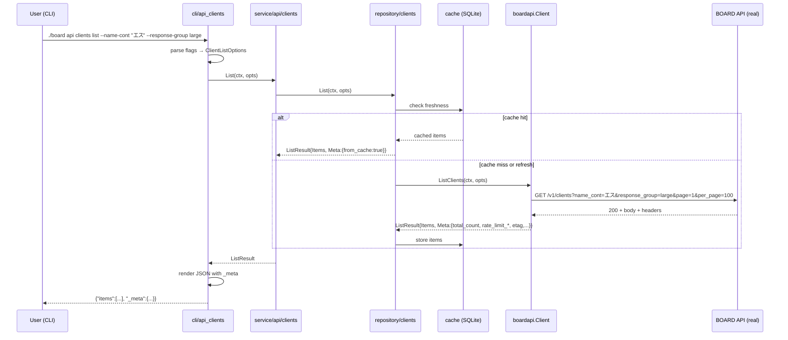

# M50 (Phase L-02): clients 先行パイロット — フルサイクル刷新 + 実 API E2E

## Overview
| 項目 | 値 |
|------|---|
| ステータス | 未着手 |
| 依存 | M49（基盤 ListResult/QueryBuilder/header 配管）完了 |
| 対象ファイル | internal/boardapi/clients.go, internal/boardapi/clients_test.go, internal/boardapi/e2e_clients_test.go, internal/repository/clients.go, internal/service/api/clients.go, internal/cli/api_clients.go, internal/output/*.go, plans/board-phase-l-pattern.md (新規: パターン手順書) |
| 破壊的変更 | あり（`ClientSearchParams` → `ClientListOptions`、戻り値の `ListResult[T]` 化、CLI flag 改名を含む） |
| 親ロードマップ | plans/board-phase-l-roadmap.md |

## Goal

clients リソース 1 件を **BOARD API 完全準拠**に刷新することで、残り 21 リソースへの移行パターンを確立する。フルサイクル：

1. リクエスト側: `ClientListOptions` に Ransack 風クエリ（`name_cont`, `invoice_system_number_eq`, `tags[]`, `custom_no_eq`, `response_group`, `include_archive_flg`, `updated_at_gteq/lteq` 等）を網羅
2. レスポンス側: `ListResult[ClientEntity]` で Meta/Headers を受け取り、cli JSON で `_meta` フィールドに露出
3. 実 API E2E 検証: 
   - `name_cont` が実際にフィルタすること
   - `response_group=large` で Get 限定フィールドが List でも取得できること
   - X-Total-Count 系・Rate Limit 系・ETag の実際のヘッダー名を確定
4. 成果物: `plans/board-phase-l-pattern.md` に「1 リソース移行手順書」として残す

## Design

### 1. `ClientListOptions`（SearchParams 置き換え）

```go
// ClientListOptions corresponds to BOARD API's GET /v1/clients query params.
// All fields are optional; zero values are not sent to the API.
type ClientListOptions struct {
    // 共通ページネーション（ListAll 内部で上書きされるため通常は未指定でよい）
    Page    int
    PerPage int

    // 全 List 共通
    UpdatedAtGteq     string // "YYYY-MM-DD HH:MM:SS"
    UpdatedAtLteq     string
    IncludeArchiveFlg *bool  // nil=送らない, true=1, false=0

    // clients 専用
    NameCont                string   // 顧客名部分一致
    NameDispCont            string   // 顧客略称部分一致
    InvoiceSystemNumberEq   string   // 適格請求書登録番号完全一致
    CustomNoEq              string   // 顧客番号完全一致
    Tags                    []string // タグ
    ResponseGroup           string   // "small" or "large"
}
```

`ClientSearchParams` は削除。CLI/repository/service は `ClientListOptions` を渡す形に統一。

### 2. ListClients / SearchClients / GetClient シグネチャ刷新

```go
// ListClients returns a ListResult with items aggregated across all pages,
// plus Meta derived from the final page's response headers.
func (c *Client) ListClients(ctx context.Context, opts ClientListOptions) (*ListResult[ClientEntity], error)

// GetClient returns an ItemResult with the single client and response metadata.
func (c *Client) GetClient(ctx context.Context, id int) (*ItemResult[ClientEntity], error)
```

**Search vs List の整理**: BOARD API は同一エンドポイント `/v1/clients` で List も Search もサーバ側フィルタのみ対応する。 Phase L では **`SearchClients` を削除し `ListClients(ctx, opts)` に一本化** する（opts がゼロなら全件）。下流（repository, service）も同様に統合。

※ 従来「in-memory で filter する SearchClients」は存在しない（既存 `SearchClients` はサーバ側 filter を投げるだけで意味的には List と同じ）。

### 3. `ListClientsRaw` の扱い

E2E strict field diff 用に `ListClientsRaw(ctx, opts ClientListOptions) ([]byte, http.Header, error)` として保持。テストで未マップキー検出に使う。

### 4. repository / service/api / cli 追従

#### repository
```go
// ClientRepository
func (r *ClientRepository) List(ctx context.Context, opts boardapi.ClientListOptions) (*boardapi.ListResult[boardapi.ClientEntity], error)
func (r *ClientRepository) Get(ctx context.Context, id int) (*boardapi.ItemResult[boardapi.ClientEntity], error)
```

cache 層との整合:
- cache key は `resource="clients"` + `opts.Hash()`（新設: JSON Marshal SHA-256 等）
- Phase K で確立した daily refresh 判定は `ListResult.Items` に対して従来通り適用
- Meta/Headers はキャッシュしない（リクエスト毎の実測値を返す。キャッシュヒット時はゼロ値の Meta + `FromCache: true` フラグ付与を検討）

**決定**: M50 では cache 挙動を変えない。Meta は「API 直参照時のみ値が入り、cache hit 時はゼロ値」で OK とする。cli で `_meta.from_cache=true` を明示。

#### service/api
パススルーに徹する。

#### cli/api_clients.go
flag 追加:
- `--name-cont`
- `--name-disp-cont`
- `--invoice-system-number-eq`
- `--custom-no-eq`
- `--tags`（CSV）
- `--response-group`（small|large）
- `--include-archive-flg`
- `--updated-at-gteq`, `--updated-at-lteq`
- `--show-meta`（出力に `_meta` を含めるか。既定で true、`--no-meta` で除外も可）

既存 flag `--limit`, `--offset` 系は維持（client 側の結果絞り込み）。

#### output 層
`ListResult[T]` を JSON 出力する際:

```json
{
  "items": [...],
  "_meta": {
    "total_count": 299,
    "page": 3,
    "per_page": 100,
    "rate_limit_remaining": 2847,
    "rate_limit_limit": 3000,
    "rate_limit_reset": "2026-04-23T15:00:00Z",
    "etag": "W/\"...\"",
    "last_modified": "...",
    "from_cache": false
  }
}
```

`--pretty` オプションでは Meta を表形式で表示（最下段 1 行サマリ）。

### 5. 実 API E2E 検証項目（必須）

plan ファイル末尾に結果を書き戻す形で実施：

| # | 検証項目 | 成功判定 |
|---|----------|---------|
| E1 | `name_cont=エス` で部分一致フィルタが効く | 件数が ListClients(opts=zero) 全件より減る |
| E2 | `name` (旧パラ) は無視される | 件数変わらず |
| E3 | `response_group=large` で List でも Get 限定 14 フィールドが返る | NdaFlg, BasicAgreementFlg 等が non-omit |
| E4 | `response_group=small`（既定）では Get 限定フィールドが返らない | 上記フィールドが omitempty |
| E5 | `updated_at_gteq=<未来の日付>` で 0 件 | `len(items)==0` |
| E6 | `include_archive_flg=1` で archive 顧客を含む | 件数 >= 通常 |
| E7 | `tags[]=XXX` で絞り込み | 件数が減る（実データ依存） |
| E8 | `custom_no_eq=CUST001` 完全一致 | 1 件 |
| E9 | `invoice_system_number_eq=T1234567890123` | 一致件数 |
| E10 | 実レスポンスヘッダー名の dump | X-Total-Count / X-Ratelimit-* / ETag / Last-Modified の実在確認 |

E10 で判明した正式ヘッダー名を `result.go` の `parseListMeta` に反映。`plans/board-phase-l-pattern.md` にも記録。

Rate Limit 配慮: E1-E10 で合計 10 requests 程度。per-batch で 3 req/sec を超えないよう `time.Sleep(400ms)` 挿入。

### 6. `plans/board-phase-l-pattern.md` (新規、パターン手順書)

構成:
```markdown
# Phase L リソース移行パターン手順書（clients パイロット由来）

## 1. SearchParams → ListOptions 置換
## 2. ListResult[T] への戻り値刷新
## 3. QueryBuilder でのクエリ組み立て
## 4. repository / service / cli 追従チェックリスト
## 5. E2E 実 API 検証項目（各リソース E1-E10 相当）
## 6. 確定した BOARD API ヘッダー名
## 7. よくある pitfall（バイナリ / 配列パラメータのエンコード等）
## 8. 移行時のテスト Green 要件
```

残り 21 リソース（M51〜M56）はこの手順書を参照して差分実装する。

## Sequence Diagram (M50 範囲 + 検証)



## TDD Test Design

### Unit tests (mock HTTP server)

| # | ケース | 入力 | 期待 |
|---|--------|------|------|
| U1 | ListClients(zero opts) | - | `GET /v1/clients?page=1&per_page=100` |
| U2 | opts.NameCont="エス" | - | query に `name_cont=エス`（URL encoded） |
| U3 | opts.Tags=["A","B"] | - | query に `tags[]=A&tags[]=B` |
| U4 | opts.IncludeArchiveFlg=&true | - | query に `include_archive_flg=1` |
| U5 | opts.ResponseGroup="large" | - | query に `response_group=large` |
| U6 | マルチページ応答 | per_page=2, total=5 | 3 回リクエスト、最終ページヘッダーの Meta が返る |
| U7 | response 429 with Retry-After: 3 | - | リトライ後成功、Meta は最終成功時のヘッダー |
| U8 | GetClient(id=1) | - | ItemResult 返却、Meta.ETag が入る |
| U9 | ListClientsRaw(opts) | - | raw bytes と http.Header 両方返る |

### E2E tests (real BOARD API, `e2e` build tag)

| # | ケース | 期待 |
|---|--------|------|
| E1-E10 | 上記 §5 項目 | 各テストで boolean 判定、違反時は t.Errorf |
| E-StrictDiff | `ListClientsRaw` vs `ClientEntity` の strict field diff | 未マップキー 0 |

## Implementation Steps

- [ ] **Step 1 (Red)**: `clients_test.go` に U1-U9 の failing test を追加
- [ ] **Step 2 (Green)**: `clients.go` に `ClientListOptions` を定義し、`ListClients/GetClient/ListClientsRaw` を新シグネチャで実装
- [ ] **Step 3 (Red → Green)**: repository/service 層の I/F 追従とテスト更新
- [ ] **Step 4 (Red → Green)**: cli 層に新 flag 追加、既存テスト更新
- [ ] **Step 5**: `internal/output/` で `_meta` 出力導入（`--show-meta` flag または常時、JSON では常時、pretty では要約 1 行）
- [ ] **Step 6**: `go build ./... && go test ./... && go vet ./... && golangci-lint run` 全 Green
- [ ] **Step 7 (E2E)**: BOARD API 実機で E1-E10 実行。結果を M50 計画の末尾に追記
- [ ] **Step 8**: 判明した実ヘッダー名を `result.go` の `parseListMeta` に反映（M49 の仮実装を差し替え）
- [ ] **Step 9**: `plans/board-phase-l-pattern.md` を成果物として作成（テンプレート化）
- [ ] **Step 10**: roadmap の Changelog 更新、v0.5.0-beta1 リリース準備（goreleaser は本番タグ切らず CI で dry run 確認のみ）
- [ ] **Step 11**: find_client.go のビルドが通る最小追従（ClientListOptions を派生で使う or 旧構造を一時マッピング。Phase M で本格刷新）

## Risks

| リスク | 影響度 | 対策 |
|--------|--------|------|
| `response_group=large` が List では無視される可能性 | 中 | E3/E4 で実測。もし無視なら仕様書と乖離のため BOARD サポートに問い合わせ or ドキュメントに実情記録 |
| BOARD API ヘッダーに Rate Limit 情報が一切存在しない | 中 | Meta.RateLimit* フィールドをゼロ値のままにする挙動で OK。429 時の body message のみで対応 |
| `tags[]` エンコードが実 API で受け付けられない形式（例: `tags=A,B` 必須） | 中 | E7 で実測。失敗したら仕様に合わせて QueryBuilder.Tags を切り替え |
| downstream（find_client）のビルドが大きく割れる | 中 | Step 11 で一時マッピングシム（`toLegacySearchParams(opts)`）を用意 |
| cache 層との整合で `opts.Hash()` 衝突 | 小 | JSON Marshal + SHA-256 で十分。既存 cache schema の変更なし（key を追加するだけ） |
| CLI flag の既存 `--name` 互換を切ると破壊的 | 中 | Phase L の方針で v0.5.0 major bump として受容。CHANGELOG で「`--name` → `--name-cont` に改名」を明記 |

## 完了条件

- Unit テスト U1-U9 緑
- E2E テスト E1-E10 緑（もしくは結果が plan に記録されている）
- `./board api clients list --name-cont "エス"` で絞り込み動作
- `./board api clients list --response-group large | jq '.items[0] | keys | length'` が small より多い
- `./board api clients list | jq '._meta'` で Meta が出力
- `plans/board-phase-l-pattern.md` 成果物が存在
- roadmap Changelog 更新済み

## Next Step

M50 完了後、確立したパターンを **M51（projects）** に適用。最大規模なので早めに着手。`plans/board-phase-l-m51-projects.md` を着手時に生成。

## E2E 実測結果記入欄（M50 実行時に埋める）

### 確定したヘッダー名
- X-Total-Count: TBD（M50 実行時に dump）
- Rate Limit 系: TBD
- ETag / Last-Modified: TBD

### フィルタ動作確認
- name_cont: TBD
- response_group=large: TBD
- include_archive_flg: TBD
- tags[]: TBD
- custom_no_eq: TBD
- invoice_system_number_eq: TBD
