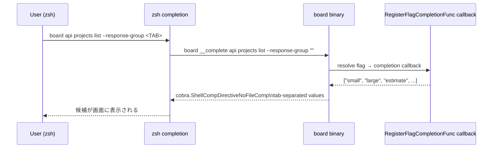

# M58: completion の固定列挙値補完

## Overview
| 項目 | 値 |
|------|---|
| ステータス | 未着手 |
| 依存 | なし（Phase M の最初のマイルストーン） |
| 対象ファイル | `internal/cli/completion_values.go`（新規）、`internal/cli/completion_values_test.go`（新規）、`internal/cli/api_clients.go` / `api_invoices.go` / `api_payments.go` / `api_purchase_orders.go` / `api_projects.go`（編集） |
| 想定工数 | 半日〜1日 |
| 親ロードマップ | plans/board-phase-m-roadmap.md |

## Goal

`RegisterFlagCompletionFunc` を使って、以下の固定列挙フラグを `<TAB>` 押下で候補表示できるようにする。
**固定列挙のみ。** 動的補完（API / キャッシュ参照による ID 補完）は Phase M では対象外。

### 対象フラグと補完候補（探索結果の確定版）

tmp/e2e-artifacts/projects_*.json (実 API dump、list=2420件 + 個別 dump) の全データ走査から、以下が確認できた:

- `order_status`: 1=見積中(高), 2=見積中(中), 3=見積中(低), 4=受注確定, 5=受注済, 8=見積中(除)
- `delivery_status`: 1=未着手, 2=着手中, 3=納品済, 4=検収済
- `invoice_timing_kbn`: 1=一括請求, 2=定期請求
- `status` (invoices / payments / purchase_orders): dump に status フィールドが存在しない、または空値のため **具体値は BOARD API 仕様書未確認**。補完対象から外す（誤情報の混入リスクを避ける）

| フラグ | 対象コマンド | 補完候補 |
|--------|------------|----------|
| `--response-group` | `api clients list` | `small`, `large` |
| `--response-group` | `api invoices list` | `small`, `large` |
| `--response-group` | `api payments list` | `small`, `large` |
| `--response-group` | `api purchase_orders list` | `small`, `large` |
| `--response-group` | `api projects list` | `small`, `large`, `estimate`, `order`, `delivery`, `invoice`, `receipt`, `all` |
| `--response-group` | `api projects get` | `estimate`, `order`, `delivery`, `invoice`, `receipt`, `all` |
| `--order-status-in` | `api projects list` | 1=見積中(高), 2=見積中(中), 3=見積中(低), 4=受注確定, 5=受注済, 8=見積中(除)（cobra 補完では `1\t見積中(高)` 等の description 付き） |
| `--delivery-status-in` | `api projects list` | 1=未着手, 2=着手中, 3=納品済, 4=検収済 |
| `--invoice-timing-kbn-in` | `api projects list` | 1=一括請求, 2=定期請求 |
| `--status-eq` | `api invoices list` / `api payments list` / `api purchase_orders list` | **対象外**（具体値未確認。BOARD API 実仕様確認後、将来マイルストーンで追加） |

## Sequence Diagram



## TDD Test Design

### テストファイル: `internal/cli/completion_values_test.go`

| # | テストケース | 入力 | 期待出力 |
|---|-------------|------|---------|
| 1 | `TestResponseGroupCommon` | (なし) | `responseGroupCommon` が `["small","large"]` |
| 2 | `TestResponseGroupProjectsList` | (なし) | 8 要素完全一致（small/large/estimate/order/delivery/invoice/receipt/all） |
| 3 | `TestResponseGroupProjectsGet` | (なし) | 6 要素完全一致（estimate/order/delivery/invoice/receipt/all） |
| 4 | `TestOrderStatusMap` | (なし) | map に `{1:見積中(高), 2:見積中(中), 3:見積中(低), 4:受注確定, 5:受注済, 8:見積中(除)}` |
| 5 | `TestDeliveryStatusMap` | (なし) | map に `{1:未着手, 2:着手中, 3:納品済, 4:検収済}` |
| 6 | `TestInvoiceTimingKbnMap` | (なし) | map に `{1:一括請求, 2:定期請求}` |
| 7 | `TestStaticCompletion` | `[]string{"a","b"}` | cobra callback が `("a","b")` + `cobra.ShellCompDirectiveNoFileComp` を返す |
| 8 | `TestIntMapCompletion` | `map[int]string{1:"見積中",3:"受注済"}` | cobra callback が `"1\t見積中"`, `"3\t受注済"` 形式で返却（キー昇順ソート） |
| 9 | `TestIntMapCompletion_EmptyMap` | `map[int]string{}` | callback が空配列を返却 |
| 10 | `TestRegisterAllCompletions_Projects` | `newAPIProjectsListCmd()` | `--response-group` / `--order-status-in` / `--delivery-status-in` / `--invoice-timing-kbn-in` の各フラグに CompletionFunc が登録済（`cmd.GetFlagCompletionFunc` で検査） |
| 11 | `TestRegisterCompletions_OtherCmds` | `newAPIClientsListCmd()` / `newAPIInvoicesListCmd()` / `newAPIPaymentsListCmd()` / `newAPIPurchaseOrdersListCmd()` | `--response-group` にのみ登録されていること（`--status-eq` は登録なし） |

### 追加テスト: cobra `__complete` 経由の統合検証

cobra の hidden command `__complete` はテスト容易で、zsh を用意しなくても実際の
補完コールバックをシェル形式で評価できる。以下を `completion_values_test.go` に追加
してリグレッション検出を CI 化する。

```go
func TestCompleteCmd_ResponseGroupProjectsList(t *testing.T) {
    cmd := NewAPIProjectsCmd() // ルートへの添付は不要、__complete は cmd 単位で動作
    // Set stdout capture ...
    // args: "__complete list --response-group <tab>" を実行
    // 期待: 8 候補 + "Completion ended with directive: ShellCompDirectiveNoFileComp"
}
```

実装時にレート的に軽いテストとして optional で採用。最低限 `TestRegisterAllCompletions_Projects` の
`cmd.GetFlagCompletionFunc` 検査で十分だが、可能なら追加する。

### 実 zsh 動作検証（手動）

```bash
mise run build
./board completion zsh > /tmp/_board
fpath=(/tmp $fpath) && autoload -U compinit && compinit
# 以下を手動で叩く
./board api projects list --response-group <TAB>       # 8 候補表示されるか
./board api projects get --response-group <TAB>        # 6 候補表示されるか
./board api invoices list --status-eq <TAB>            # draft/sent/paid 3 候補
./board api projects list --order-status-in <TAB>      # 数値 + description
```

## Implementation Steps

### Step 1: `internal/cli/completion_values.go` を新設

```go
package cli

import (
    "fmt"
    "sort"

    "github.com/spf13/cobra"
)

// 固定列挙候補（テスト可能なよう package-level variable として定義）
var (
    responseGroupCommon       = []string{"small", "large"}
    responseGroupProjectsList = []string{"small", "large", "estimate", "order", "delivery", "invoice", "receipt", "all"}
    responseGroupProjectsGet  = []string{"estimate", "order", "delivery", "invoice", "receipt", "all"}

    statusEqInvoices       = []string{"draft", "sent", "paid"}
    statusEqPurchaseOrders = []string{"draft", "approved", "sent"}
    statusEqPayments       = []string{"pending", "paid"}

    // 数値 → 日本語説明。cobra は tab-separated の "value\tdescription" を解釈
    // 値は tmp/e2e-artifacts/projects_*.json (2420件 + 個別 dump) の実 API dump を全走査して確定。
    orderStatusMap = map[int]string{
        1: "見積中(高)",
        2: "見積中(中)",
        3: "見積中(低)",
        4: "受注確定",
        5: "受注済",
        8: "見積中(除)",
    }
    deliveryStatusMap = map[int]string{
        1: "未着手",
        2: "着手中",
        3: "納品済",
        4: "検収済",
    }
    invoiceTimingKbnMap = map[int]string{
        1: "一括請求",
        2: "定期請求",
    }
)

// staticCompletion は string スライスから cobra の CompletionFunc を作る
func staticCompletion(values []string) func(*cobra.Command, []string, string) ([]string, cobra.ShellCompDirective) {
    out := make([]string, len(values))
    copy(out, values)
    return func(_ *cobra.Command, _ []string, _ string) ([]string, cobra.ShellCompDirective) {
        return out, cobra.ShellCompDirectiveNoFileComp
    }
}

// intMapCompletion は int→description マップから "value\tdescription" 形式で補完候補を返す
func intMapCompletion(m map[int]string) func(*cobra.Command, []string, string) ([]string, cobra.ShellCompDirective) {
    keys := make([]int, 0, len(m))
    for k := range m {
        keys = append(keys, k)
    }
    sort.Ints(keys)
    out := make([]string, 0, len(keys))
    for _, k := range keys {
        out = append(out, fmt.Sprintf("%d\t%s", k, m[k]))
    }
    return func(_ *cobra.Command, _ []string, _ string) ([]string, cobra.ShellCompDirective) {
        return out, cobra.ShellCompDirectiveNoFileComp
    }
}
```

### Step 2: 各 api_*.go で `RegisterFlagCompletionFunc` を呼ぶ

```go
// api_clients.go newAPIClientsListCmd() の末尾付近
_ = cmd.RegisterFlagCompletionFunc("response-group", staticCompletion(responseGroupCommon))
```

対象修正箇所（22 ファイル中、実際に対象フラグを持つのは 5 ファイル）:
- `internal/cli/api_clients.go`: `--response-group` → `responseGroupCommon`
- `internal/cli/api_invoices.go`: `--response-group` → `responseGroupCommon`（`--status-eq` は値未確認のため補完なし）
- `internal/cli/api_payments.go`: `--response-group` → `responseGroupCommon`（`--status-eq` は値未確認のため補完なし）
- `internal/cli/api_purchase_orders.go`: `--response-group` → `responseGroupCommon`（`--status-eq` は値未確認のため補完なし）
- `internal/cli/api_projects.go`: list 側 `--response-group` → `responseGroupProjectsList`、get 側 `--response-group` → `responseGroupProjectsGet`、`--order-status-in` → `intMapCompletion(orderStatusMap)`、`--delivery-status-in` → `intMapCompletion(deliveryStatusMap)`、`--invoice-timing-kbn-in` → `intMapCompletion(invoiceTimingKbnMap)`

### Step 3: ユニットテスト追加

- `internal/cli/completion_values_test.go` に上記 TDD テスト表の 10 ケースを実装

### Step 4: ビルド + 動作確認

```bash
mise run build
./board completion zsh > /tmp/_board

# Assertion: 生成された補完スクリプトの中に "small:" や "estimate:" の文字列が含まれる
grep -q "small" /tmp/_board && echo "OK: small found"
grep -q "estimate" /tmp/_board && echo "OK: estimate found"
grep -q "見積中" /tmp/_board && echo "OK: 見積中 found"

# 手動 zsh 検証（fpath に追加してからタブ補完）
fpath=(/tmp $fpath) && autoload -U compinit && compinit
./board api projects list --response-group <TAB>
```

### Step 5: Pre-commit チェック

```bash
go test ./... -count=1
go vet ./...
gofmt -s -w internal/cli/
```

## Risks

| リスク | 影響 | 対策 |
|--------|------|------|
| `RegisterFlagCompletionFunc` が使っている Cobra バージョンで動かない | 中 | 事前に `go.mod` で spf13/cobra バージョン確認（v1.8+ で確実）。必要なら bump |
| `cobra.ShellCompDirectiveNoFileComp` 指定漏れでファイル名補完が混じる | 小 | すべての callback で必ず NoFileComp を返すようヘルパで統一 |
| IntSlice フラグの description が zsh で表示されない | 小 | zsh の `_arguments` は `\t` 区切り description に対応。bash では description は無視されるが候補値は出る |
| fish / pwsh は対象外としたが将来要求される可能性 | 小 | Cobra の `GenFishCompletion` は自動生成なので、ビルド時にテストするだけで済む（Phase M 完了時点で fish も動く） |
| invoice_timing_kbn の具体値が不明 | ~~中~~ 解決済 | tmp/e2e-artifacts/ 実 dump から 1=一括請求, 2=定期請求 を確定 |
| status_eq の値が BOARD API 仕様書に未掲載 | 中 | 推測値を埋めると誤情報が定着する。M58 では `--status-eq` の補完を見送り、将来マイルストーンで実値確認後に追加する |

## Verification

### ユニットテスト
```bash
go test ./internal/cli/... -run TestCompletion -v -count=1
```

### ビルド + 生成スクリプト検証
```bash
mise run build
./board completion zsh > /tmp/_board
wc -l /tmp/_board  # 補完スクリプトが数百行以上に膨らんでいる
grep -c "small\|large\|estimate\|draft\|paid\|見積中" /tmp/_board
```

### 手動 zsh 動作
```bash
fpath=(/tmp $fpath) && autoload -U compinit && compinit
./board api projects list --response-group <TAB>      # 8 候補
./board api projects get --id 1 --response-group <TAB> # 6 候補
./board api invoices list --status-eq <TAB>            # 3 候補
./board api projects list --order-status-in <TAB>      # 4 候補 + 日本語説明
```

## Success Criteria

- [ ] `TestCompletion*` 全 10 ケース Green
- [ ] `go vet ./...` warning なし
- [ ] `gofmt` 差分なし
- [ ] `./board completion zsh` で 生成スクリプトに補完候補値が含まれる（grep で検出）
- [ ] zsh シェル上で手動 TAB 補完が期待通り動作
- [ ] バイナリサイズ増分 < 10 KB（固定マップのみなので軽微）

## Next Action（完了後）

1. コミット: `feat(cli): M58 固定列挙フラグの shell completion 値補完`
2. ロードマップ（`plans/board-phase-m-roadmap.md`）の M58 チェックボックスを完了状態に
3. M59 に着手: `/devflow:plan` で `plans/board-phase-m-m59-docs-command.md` を詳細化
