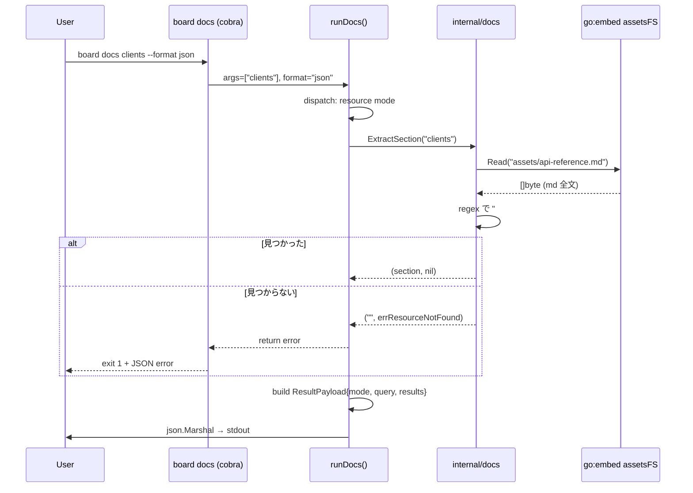
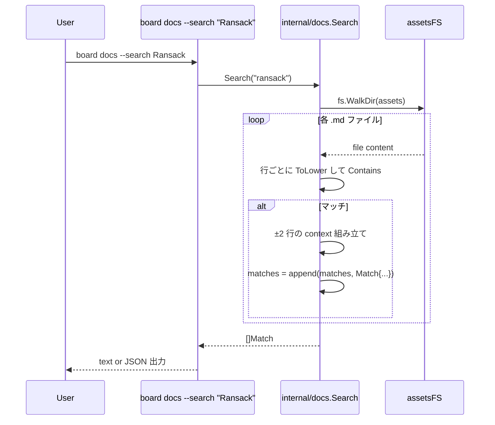
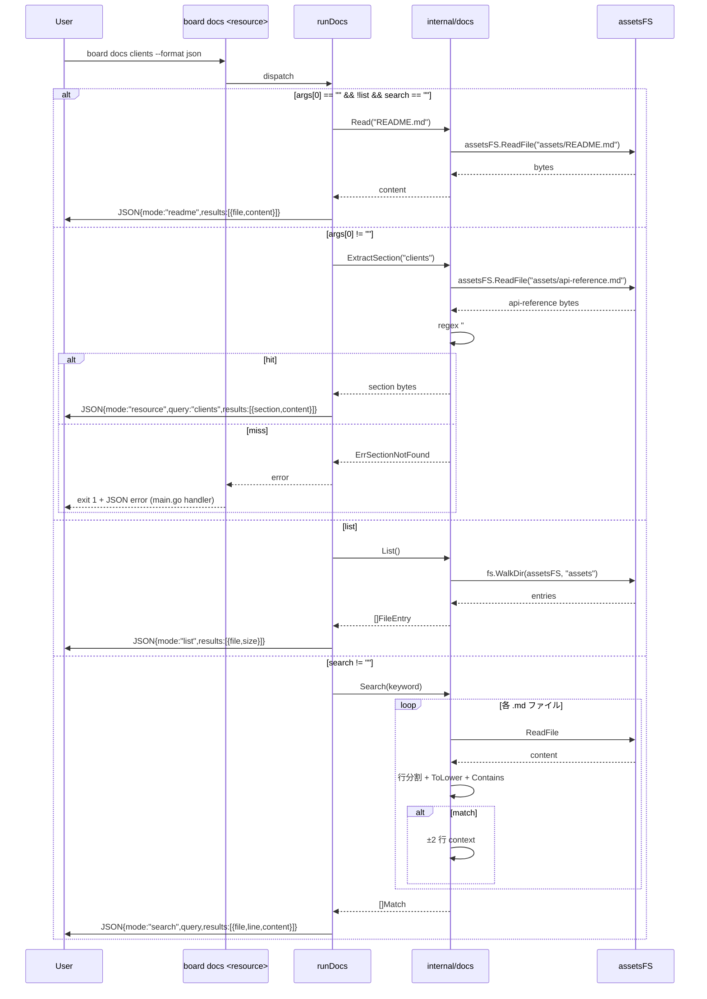

# M59: board docs サブコマンド + JSON 出力

## Overview
| 項目 | 値 |
|------|---|
| ステータス | 未着手 |
| 依存 | なし（M58 と独立、並行可能） |
| 対象ファイル | `internal/docs/docs.go`（新規、`go:embed` + ユーティリティ）、`internal/docs/docs_test.go`（新規）、`internal/cli/docs.go`（新規、`newDocsCmd`）、`internal/cli/docs_test.go`（新規）、`internal/cli/root.go`（編集、登録 1 行） |
| 想定工数 | 1 日（TDD サイクル含む） |
| 親ロードマップ | plans/board-phase-m-roadmap.md |
| 親計画 | plans/groovy-churning-valley.md（M59 詳細計画セクション） |

## Goal

ecspresso v2.8 風のミニマルな `board docs` サブコマンドを追加し、**バイナリに埋め込んだドキュメント**
（README / api-reference / installation / guides）を CLI から参照可能にする。さらに `--format json` を
備え、LLM・MCP 経由でも機械可読な形で API ドキュメントを取得できるようにする。

ユースケース:
```
board docs                          # README を stdout に表示
board docs --list                   # 埋め込みドキュメント一覧（相対パス + バイトサイズ）
board docs --search <keyword>       # 全文検索（マッチ行 + ±2 行のコンテキスト）
board docs <resource>               # api-reference.md から該当リソース節を抽出
board docs --format json [...]      # すべてのモードで JSON 出力対応
```

## スコープ

### 実装範囲
- `internal/docs/docs.go` — `go:embed` でリポジトリ docs 配下（`specs/` を除く）をバイナリに取り込む
- `internal/docs/docs.go` — 3 つのユーティリティ関数
  - `List() []FileEntry`: 埋め込みファイル一覧（`Path` + `Size`）
  - `ExtractSection(resource string) (string, error)`: api-reference.md から `#### <resource> —` 節を切り出す
  - `Search(keyword string) []Match`: 全埋め込みファイルに対する行単位検索（大文字小文字無視、±2 行コンテキスト）
- `internal/cli/docs.go` — `newDocsCmd()` + サブフラグ `--list`, `--search`, `--format`
- `internal/cli/root.go` — `rootCmd.AddCommand(NewDocsCmd())` 追加
- JSON 出力スキーマ統一（`{mode, query, results[{file, section, content}]}`）
- ユニットテスト（TDD、`docs_test.go` 2 件）
- バイナリサイズ計測（+50KB 上限目標）

### スコープ外
- 動的な Markdown レンダリング（`mdcat` / ANSI カラー）
- ページャ（`less`）との連動 — stdout に生データを出すのみ
- fuzzy search（`--search` は `strings.Contains`、大小無視のみ）
- インタラクティブ TUI モード
- `docs/specs/` 配下（44KB の超詳細設計書）の埋め込み — 対象外
- 英語版ドキュメントの自動切替

## 設計（Design）

### 採用案: `internal/docs/` + `assets/` 同期コピー方式

- **パッケージ配置**: `internal/docs/`
  - 標準ライブラリ `embed` との名称衝突を避ける（`internal/embed/` は不採用）
  - `ExtractSection` / `Search` というドメインユーティリティも含むため関心事を統一
- **埋め込み方式**: `//go:embed assets` でパッケージ同ディレクトリ配下を取り込む
- **同期運用**: リポジトリルート `docs/` と `README.md` を、`mise run sync-docs` タスクで
  `internal/docs/assets/` にコピーする。`internal/docs/assets/` は git 管理下に置く。

#### 埋め込み対象（ホワイトリスト）

| パス | 埋め込み先 | 理由 |
|------|-----------|------|
| `README.md`（リポジトリルート） | `assets/README.md` | ユーザー向けの一次情報 |
| `docs/api-reference.md` | `assets/api-reference.md` | CLI リソース別リファレンス |
| `docs/installation.md` | `assets/installation.md` | 英語インストール手順 |
| `docs/installation_ja.md` | `assets/installation_ja.md` | 日本語インストール手順 |
| `docs/guides/getting-started.md` | `assets/guides/getting-started.md` | クイックスタート |
| `docs/guides/mcp-server.md` | `assets/guides/mcp-server.md` | MCP 連携ガイド |

#### 埋め込み対象外（理由付き）

| パス | 理由 |
|------|------|
| `README_ja.md` | 現時点では README.md の複製相当。M61 の多言語化対応前は重複のため含めない |
| `CHANGELOG.md` | リリースノートは `board --version` と GoReleaser 管理で十分、ユーザードキュメント対象外 |
| `LICENSE` | ライセンス文は `board docs` の検索対象として有用でないため除外 |
| `docs/specs/*` | 44KB の超詳細設計書はバイナリサイズ制約と対象読者（社内設計者）から除外 |

### 採用理由（D1 方式）

- `go:embed` の相対パス制約（祖先方向参照不可）を自然に回避
- ルート直下に Go ファイルを置かない（慣習を守る）
- コピーは `rsync` ベースの宣言的スクリプトなので更新漏れが発生しづらい
- CI で `check-docs-sync` タスクを走らせれば drift を即座に検知できる

### 設計上の代替案（不採用）

- **案 A: リポジトリルート直下に `embed_docs.go`（package docs）を配置**
  - `//go:embed docs README.md` が書けるため二重管理不要
  - ただしルート直下に Go ファイルを置く慣習上の違和感 + `cmd/board/main.go` との package 混在感があり不採用
- **案 B: `internal/docs/` から `../../docs/**` を埋め込む**
  - `go:embed` は祖先方向パス禁止のため **不可能**
- **案 C: `go generate` 経由のコピー**
  - `go generate` は明示実行が必要、`mise run sync-docs` と本質同じ運用コスト。mise 統一性を優先

### ファイル構成（最終案）

```
internal/docs/
├── docs.go              # package docs, go:embed, List/ExtractSection/Search
├── docs_test.go         # ユニットテスト
└── assets/              # 埋め込み対象（docs/ 配下のコピー）
    ├── README.md        # リポジトリルート README.md のコピー
    ├── api-reference.md
    ├── installation.md
    ├── installation_ja.md
    └── guides/
        ├── getting-started.md
        └── mcp-server.md

internal/cli/
├── docs.go              # newDocsCmd
└── docs_test.go         # CLI 層テスト
```

**同期スクリプト（mise.toml）**:

手書きファイルリストの更新漏れを避けるため、`rsync --exclude=specs` でディレクトリ単位同期を使う。
README.md はディレクトリ外なので別行で処理。macOS と Linux の両方で動作するよう GNU rsync を想定
（macOS の BSD rsync も `--exclude` をサポートする）。

```toml
[tasks.sync-docs]
description = "Sync docs/ + README.md to internal/docs/assets/ for go:embed"
run = """
rm -rf internal/docs/assets
mkdir -p internal/docs/assets
cp README.md internal/docs/assets/README.md
rsync -a --exclude=specs docs/ internal/docs/assets/
"""

[tasks.check-docs-sync]
description = "Verify internal/docs/assets/ is in sync with docs/ + README.md (fails if drift detected)"
run = """
set -e
tmp=$(mktemp -d)
cp README.md "$tmp/README.md"
rsync -a --exclude=specs docs/ "$tmp/"
diff -r "$tmp" internal/docs/assets
rm -rf "$tmp"
"""
```

**CI / ローカル統合**:
- `mise run test` のサブタスクとして `check-docs-sync` を必ず実行する想定
- 本 M59 の Step 7「全体テスト」でも `mise run check-docs-sync` を明示実行
- GitHub Actions への組み込みは M61 リリース準備時にまとめて対応（ただし本 M59 時点の運用ルールは明文化済み）

### API 設計

`internal/docs/docs.go`:
```go
package docs

import (
    "embed"
    "errors"
    "fmt"
    "io/fs"
    "regexp"
    "sort"
    "strings"
)

//go:embed assets
var assetsFS embed.FS

// FileEntry represents one embedded documentation file (used for List).
type FileEntry struct {
    File string `json:"file"` // e.g. "api-reference.md" (assets/ prefix stripped)
    Size int    `json:"size"`
}

// Match represents a single search hit (used for Search).
type Match struct {
    File    string `json:"file"`
    Line    int    `json:"line"`
    Section string `json:"section"` // nearest enclosing "#### " header, "" if none
    Content string `json:"content"` // matched line + ±2 lines context
}

var (
    // ErrSectionNotFound is returned by ExtractSection when no matching resource header exists.
    ErrSectionNotFound = errors.New("docs: section not found")
    // ErrEmptyKeyword is returned by Search when the keyword is empty.
    ErrEmptyKeyword = errors.New("docs: keyword must not be empty")
)

// FS returns the embedded docs filesystem (rooted at "assets").
func FS() fs.FS { return assetsFS }

// Read reads an embedded file by relative path (without the "assets/" prefix).
func Read(path string) ([]byte, error) { ... }

// List returns all embedded files sorted by File path (ascending).
func List() ([]FileEntry, error) { ... }

// ExtractSection extracts a resource section from api-reference.md.
//
// Header contract (strict): the line must match exactly the regex
//   (?m)^#### <resource> — 
// where <resource> is regexp.QuoteMeta(resource) and the literal " — " (em-dash with
// surrounding ASCII spaces) is required. This avoids prefix ambiguity like
// ExtractSection("clients") matching "#### client_branches —".
//
// Section ends at the first subsequent line matching any of:
//   - (?m)^#### <any> —   (next resource section)
//   - (?m)^### <any>     (upper-level heading, e.g. "### マスタ")
//   - (?m)^## <any>      (upper-level heading)
//   - EOF
// The trailing "---" horizontal rule that separates sections is stripped from the result.
func ExtractSection(resource string) (string, error) { ... }

// Search performs case-insensitive substring search over all embedded .md files
// using strings.EqualFold semantics (Unicode-aware ToLower).
// Returns matches with ±2 lines of context and the nearest enclosing "#### " section name.
//
// Consecutive hits within 2 lines of each other are merged into a single Match
// to avoid duplicated context bloat (important for LLM token cost).
// Empty keyword returns ErrEmptyKeyword.
func Search(keyword string) ([]Match, error) { ... }
```

### CLI 層（`internal/cli/docs.go`）

```go
package cli

import (
    "encoding/json"
    "fmt"
    "os"

    "github.com/spf13/cobra"
    "github.com/youyo/board/internal/docs"
)

// NewDocsCmd returns the `board docs` subcommand.
func NewDocsCmd() *cobra.Command {
    var (
        list    bool
        search  string
        format  string
    )
    cmd := &cobra.Command{
        Use:   "docs [resource]",
        Short: "Show embedded documentation (README, api-reference, guides)",
        Long:  `board docs shows embedded BOARD CLI documentation. ...`,
        RunE: func(cmd *cobra.Command, args []string) error {
            return runDocs(cmd, args, list, search, format)
        },
    }
    cmd.Flags().BoolVar(&list, "list", false, "List all embedded documentation files")
    cmd.Flags().StringVar(&search, "search", "", "Search embedded docs for the given keyword (case-insensitive)")
    cmd.Flags().StringVar(&format, "format", "text", `Output format: "text" (default) or "json"`)
    _ = cmd.RegisterFlagCompletionFunc("format", staticCompletion([]string{"text", "json"}))
    return cmd
}
```

`runDocs` ディスパッチ:
1. `--list` が真 → List モード
2. `--search` が空でない → Search モード
3. `args[0]` があり `--list`/`--search` が無指定 → Resource モード（api-reference 抽出）
4. どれでもない → Readme モード（`README.md` を表示）

### 出力スキーマ（JSON 共通、union 型）

トップレベルは常に `{mode, query, results}` の 3 フィールド。`results[]` は union 型で、
各フィールドは `omitempty` により不要なモードでは出現しない。

```go
// internal/cli/docs.go 内に定義
type resultItem struct {
    File    string `json:"file,omitempty"`
    Section string `json:"section,omitempty"`
    Content string `json:"content,omitempty"`
    Line    int    `json:"line,omitempty"`
    Size    int    `json:"size,omitempty"`
}

type payload struct {
    Mode    string       `json:"mode"`
    Query   string       `json:"query,omitempty"`
    Results []resultItem `json:"results"`
}
```

モード別の results 形:

| mode | query | results[].file | results[].section | results[].content | results[].line | results[].size |
|------|-------|----------------|-------------------|-------------------|----------------|----------------|
| `readme` | 省略 | `"README.md"` | 省略 | 全文 | 省略 | 省略 |
| `list` | 省略 | 各ファイルの相対パス | 省略 | 省略 | 省略 | バイトサイズ |
| `search` | keyword | マッチファイル | 直近 `#### ` 見出し（無ければ空） | ±2 行 context | マッチ行番号 (1-based) | 省略 |
| `resource` | resource 名 | `"api-reference.md"` | resource 名 | 抽出本文 | 省略 | 省略 |

**例（mode="list"）**:
```json
{
  "mode": "list",
  "results": [
    {"file": "README.md", "size": 5920},
    {"file": "api-reference.md", "size": 15479},
    {"file": "guides/getting-started.md", "size": 6029}
  ]
}
```

**例（mode="search"）**:
```json
{
  "mode": "search",
  "query": "Ransack",
  "results": [
    {"file": "api-reference.md", "line": 27, "section": "共通フラグ（list）", "content": "..."}
  ]
}
```

**例（mode="resource"）**:
```json
{
  "mode": "resource",
  "query": "clients",
  "results": [
    {"file": "api-reference.md", "section": "clients", "content": "BOARD API エンドポイント: ..."}
  ]
}
```

テキスト出力時:
- `list`: `path\tsize` 形式（1 行 1 ファイル）
- `search`: `file:line | content_line`（grep ライク。section は先頭コンテキスト行として 1 行「-- section: <name> --」形式を添える）
- `resource` / `readme`: 該当テキストを素のまま stdout へ

### シーケンス図





## TDD テスト設計書

### Phase 1: `internal/docs/docs_test.go`（Red → Green）

#### 正常系

| ID | テスト関数 | 入力 | 期待出力 |
|----|------------|------|----------|
| D-1 | `TestFS_NonEmpty` | - | `fs.Stat(assetsFS, "assets")` がディレクトリとして成立 |
| D-2 | `TestList` | - | 返却された `[]FileEntry` が 6 件（README.md / api-reference.md / installation.md / installation_ja.md / guides/getting-started.md / guides/mcp-server.md）、各 `Size > 0` |
| D-3 | `TestList_SortedByPath` | - | `results[i].Path` が辞書順ソート済み |
| D-4 | `TestRead_README` | `Read("README.md")` | 返却 `[]byte` 長 > 100、内容に `# board` を含む |
| D-5 | `TestExtractSection_Clients` | `ExtractSection("clients")` | 返却文字列に `clients — 顧客マスタ` + `BOARD API エンドポイント: \`GET /v1/clients\`` を含む、次の `#### client_branches` は含まない |
| D-5b | `TestExtractSection_NoPrefixMatch` | `ExtractSection("client")` | `ErrSectionNotFound`（`client_branches` への prefix 誤マッチ防止検証） |
| D-6 | `TestExtractSection_ProjectCosts` | `ExtractSection("project_costs")` | `project_costs — 案件原価` を含み `estimates` は含まない |
| D-6b | `TestExtractSection_StopAtUpperHeading` | `ExtractSection("document_send_channels")` | 末尾が `## v0.5.0 破壊的変更` で切れること（`## ` で境界認識） |
| D-7 | `TestSearch_Ransack` | `Search("Ransack")` | 返却件数 >= 5、全 Match の `Content` に（大小無視で）`ransack` を含む、各 Match に `Section` と `Line > 0` |
| D-8 | `TestSearch_CaseInsensitive` | `Search("BOARD")` vs `Search("board")` | 件数同一 |
| D-9 | `TestSearch_ContextLines` | `Search("Ransack")` | 任意の 1 件について `Content` が対象行 + 前後 ±2 行（計最大 5 行、ファイル端では減少）で構成される |
| D-10 | `TestSearch_ConsecutiveMerged` | 同一セクション内の連続ヒット | マージされ 1 Match になる（重複 context 抑制） |
| D-11 | `TestSearch_SectionField` | `Search("顧客名")` | `Match.Section` に `"clients"`（近い `#### ` 見出し）が入る |

#### 異常系

| ID | テスト関数 | 入力 | 期待出力 |
|----|------------|------|----------|
| D-E1 | `TestRead_NotFound` | `Read("nonexistent.md")` | `(nil, fs.ErrNotExist)` ラップエラー |
| D-E2 | `TestExtractSection_Unknown` | `ExtractSection("no_such_resource")` | `("", ErrSectionNotFound)` |
| D-E3 | `TestSearch_Empty` | `Search("")` | `(nil, ErrEmptyKeyword)` — 空キーワードでの全件返却を防ぐ |
| D-E4 | `TestSearch_NoMatch` | `Search("きわめて珍しい文字列XYZ123")` | `([]Match{}, nil)`（空スライス、エラーなし） |

### Phase 2: `internal/cli/docs_test.go`（Red → Green）

#### 正常系

| ID | テスト関数 | 入力 | 期待出力 |
|----|------------|------|----------|
| C-1 | `TestDocs_Readme` | `board docs`（`--format text`） | stdout に README の先頭 `# board` が含まれる、exit 0 |
| C-2 | `TestDocs_Readme_JSON` | `board docs --format json` | stdout が JSON として unmarshal 可能、`mode="readme"`、`results` 長 1 |
| C-3 | `TestDocs_List_JSON` | `board docs --list --format json` | `mode="list"`、`results` 長 = 6、各要素に `file`/`size` |
| C-4 | `TestDocs_Search` | `board docs --search Ransack` | stdout に `api-reference.md:` から始まる行が 1 件以上 |
| C-5 | `TestDocs_Search_JSON` | `board docs --search Ransack --format json` | `mode="search"`, `query="Ransack"`, `results` 長 >= 5 |
| C-6 | `TestDocs_Resource` | `board docs clients` | stdout に `clients — 顧客マスタ` が含まれる |
| C-7 | `TestDocs_Resource_JSON` | `board docs clients --format json` | `mode="resource"`, `query="clients"`, `results[0].section="clients"` |

#### 異常系

| ID | テスト関数 | 入力 | 期待出力 |
|----|------------|------|----------|
| C-E1 | `TestDocs_Resource_NotFound` | `board docs foobar` | non-nil error（`section not found`）、exit != 0 |
| C-E2 | `TestDocs_Format_Invalid` | `board docs --format xml` | non-nil error（`unsupported format: xml`） |
| C-E3 | `TestDocs_Conflict_ListSearch` | `board docs --list --search foo` | non-nil error（cobra の mutually exclusive message） |
| C-E4 | `TestDocs_Conflict_ResourceWithList` | `board docs clients --list` | non-nil error（`resource argument cannot be combined with --list or --search`） |
| C-E5 | `TestDocs_Conflict_ResourceWithSearch` | `board docs clients --search foo` | non-nil error（同上） |

### TDD 進行フロー（Red → Green → Refactor）

1. **Red 1**: `internal/docs/docs_test.go` を先に書く（テスト 13 ケース全て）。`go test ./internal/docs/...` が全て赤（コンパイルエラー）。
2. **Green 1**: `internal/docs/docs.go` に最小実装を書きテスト 13 ケースを通す。
3. **Refactor 1**: ヘルパ関数抽出・命名整理・error sentinel の設置。
4. **Red 2**: `internal/cli/docs_test.go` を先に書く（テスト 10 ケース）。赤。
5. **Green 2**: `internal/cli/docs.go` + `root.go` への登録で通す。
6. **Refactor 2**: dispatch ロジックのテーブル化、エラーメッセージ整理。
7. **最終**: `go test ./... -count=1`、`go vet ./...`、`gofmt -s -w .`、`mise run build` → バイナリサイズ計測。

## 実装手順

### Step 0: 前準備
- ブランチ作成: `feature-m59-docs-command`
- `mise.toml` に `sync-docs` / `check-docs-sync` タスク追加
- `mise run sync-docs` を一度実行し `internal/docs/assets/` を生成

### Step 1: `internal/docs/docs_test.go`（Red）
- 13 ケースを先行実装
- `go test ./internal/docs/...` で赤確認

### Step 2: `internal/docs/docs.go`（Green）
- `go:embed assets`
- `Read`, `List`, `ExtractSection`, `Search` を最小実装
- `ErrSectionNotFound`, `ErrEmptyKeyword` を `var` で定義（`errors.New` を使用）
- **ExtractSection の正規表現（厳格）**: `(?m)^#### ` + `regexp.QuoteMeta(resource)` + ` — `
  （em-dash + 前後半角スペース必須）。これにより `clients` が `client_branches` の prefix として誤マッチしない
- 次セクション境界判定は以下のいずれか最初にマッチした行:
  - `(?m)^#### .+ — ` （次 resource 節）
  - `(?m)^### ` （中分類見出し）
  - `(?m)^## `  （大分類見出し）
  - EOF
- 末尾の `---` 水平線 + 直後の空行は抽出結果から除去
- Search: `bytes.Split(content, []byte("\n"))` で行分割、`strings.Contains(strings.ToLower(line), lowerKeyword)`
- ±2 行 context 構築、`Section` に直近の `#### ` 見出し名（なければ空）
- 連続ヒット（間隔 <=2 行）は 1 Match にマージして重複抑制
- `go test ./internal/docs/...` 全 Green

### Step 3: リファクタリング
- ヘルパ `walkMarkdown(func(path string, content []byte) error)` 抽出
- 定数化: `assetsPrefix = "assets"`, `sectionHeader = "#### "`

### Step 4: `internal/cli/docs_test.go`（Red）
- 10 ケース実装（stdout capture に `bytes.Buffer` + `cmd.SetOut` を使用）

### Step 5: `internal/cli/docs.go`（Green）
- `NewDocsCmd()` + `runDocs()`
- `cmd.Args = cobra.MaximumNArgs(1)` を設定（`board docs clients foo` のような過剰位置引数を cobra 側で弾く）
- 出力の分岐:
  - `--format json`: `output.Write(out, payload, pretty)` を使用（既存 API 流用で `--pretty` 自動対応）
  - `--format text`: 手書きの renderer（`list` は `path\tsize`、`search` は `file:line | content` grep 形式 + `-- section: <name> --` プレフィックス、`readme` / `resource` は raw bytes を `fmt.Fprint(out, ...)`）
- Resource mode のエラー時は RunE から error を返し main 側の既存 handler が JSON error を出力
- `--list` と `--search` の同時指定は `cmd.MarkFlagsMutuallyExclusive("list", "search")`（cobra v1.5+、現行 v1.10.2 で利用可）を `NewDocsCmd` 内で呼ぶ
- 位置引数 `<resource>` と `--list` / `--search` の競合（例: `board docs clients --list`）は cobra の MarkFlagsMutuallyExclusive ではカバーできないため `runDocs` 先頭で手動チェック:
  ```go
  if (list || search != "") && len(args) > 0 {
      return fmt.Errorf("resource argument cannot be combined with --list or --search")
  }
  ```

### Step 6: `internal/cli/root.go` 編集
- `rootCmd.AddCommand(NewDocsCmd())` を `NewCompletionCmd()` の下に追加

### Step 7: 全体テスト + 同期チェック
- `mise run check-docs-sync`（docs/ と assets/ の drift 検知）
- `go test ./... -count=1`
- `go vet ./...`
- `gofmt -s -w .`

### Step 8: バイナリサイズ計測
```bash
# Baseline (feature ブランチ起点の main HEAD)
base=$(git merge-base HEAD main)
git worktree add -q /tmp/board-baseline "$base"
(cd /tmp/board-baseline && mise run build && ls -l ./board | awk '{print "baseline:", $5}')
git worktree remove -q /tmp/board-baseline

# 現在ブランチ
mise run build && ls -l ./board | awk '{print "current:", $5}'
```
差分 < 50KB を確認。超過する場合の対処:
- 原因分析: `go tool nm -size ./board | sort -k3 -n -r | head -50` で大きなシンボルを確認
- 超過時の優先切り捨て順: (1) `installation.md` 英語版 → (2) `guides/mcp-server.md`(8.4KB) → (3) `guides/getting-started.md`(6KB)
  の順に必要性の低いものから除外検討。ただし現在の試算（総 ~34KB）では 50KB 超過は想定外

### Step 9: 動作確認（手動）
```bash
./board docs | head -20
./board docs --list
./board docs --list --format json | jq .
./board docs clients
./board docs clients --format json | jq '.results[0].content' | head -20
./board docs --search Ransack
./board docs --search Ransack --format json | jq '.results | length'
./board docs --format json | jq '.mode'  # "readme"
./board docs foobar                       # exit 1, error JSON
./board docs --list --search foo          # exit 1, error JSON
./board docs --format xml                 # exit 1, error JSON
```

### Step 10: コミット
- Conventional Commits（日本語）: `feat(cli): M59 board docs サブコマンド + JSON 出力を追加`
- コミットフック `golangci-lint` / `gofmt` が通ること
- push は不要

## アーキテクチャ検討

### 既存パターンとの整合性

| 観点 | 既存の流儀 | 本計画の準拠 |
|------|-----------|------------|
| サブコマンド命名 | `NewXxxCmd()` + `newXxxListCmd()` 等の Cobra ファクトリ関数 | `NewDocsCmd()` に一本化（list/search/resource はフラグで切替） |
| パッケージ名 | `internal/<domain>/` 単名 | `internal/docs` を採用 |
| エラー返却 | `fmt.Errorf` でラップ。独自 APIError は boardapi のみ | `docs.ErrXxx` sentinel + `fmt.Errorf("...: %w", err)` |
| JSON 出力 | `internal/output.Write(w, v, pretty)` | **そのまま利用**（`--pretty` も自動適用） |
| テスト | `*_test.go` 同ディレクトリ、`testing.T`、stdout capture は `cmd.SetOut(&bytes.Buffer{})` | 既存手法に倣う |
| 補完登録 | 各 newXxxCmd 末尾で `RegisterFlagCompletionFunc` | `--format` に `staticCompletion([]string{"text","json"})` を登録（M58 パターン踏襲） |
| コマンド登録 | `root.go` の `rootCmd.AddCommand(...)` リスト | 同じ場所に 1 行追加 |

### 新規モジュール設計

- `internal/docs/` は単独パッケージ、他パッケージへの依存なし（stdlib のみ）
- CLI 層からの参照一方向: `internal/cli/docs.go` → `internal/docs`
- 循環依存なし

## リスク評価

| # | リスク | 重大度 | 対策 |
|---|--------|--------|------|
| R1 | `go:embed` の祖先パス制約で `docs/` を直接取り込めない | 中 | 案 D1 採用（`internal/docs/assets/` に同期コピー）。`mise run sync-docs` + `check-docs-sync` タスク |
| R2 | docs/ と assets/ のコピー不整合（sync-docs 忘れ） | **高** | 本 M59 Step 7 で `mise run check-docs-sync` を必ず実行。ローカル TDD サイクル中も drift を早期検知。GitHub Actions への組み込みは M61 で追加（本 M ではタスク実体と運用ルールを確立） |
| R3 | ExtractSection の prefix 誤マッチ（`clients` が `client_branches` に当たる） | **高** | 正規表現を `(?m)^#### ` + QuoteMeta + ` — ` で明示アンカー。D-5b テストで `ExtractSection("client")` が `ErrSectionNotFound` になることを保証 |
| R4 | ExtractSection が api-reference.md の構造変更で壊れる | 中 | 次節境界として `#### / ### / ## / EOF` 全て検知。D-5/D-6/D-6b で構造変更時に失敗テストとして検知可能 |
| R5 | Search がバイナリ的な大ファイルで遅い | 低 | 埋め込み総量は ~40KB（README 含む）。計算量 O(N) で問題なし |
| R6 | `Search("")` の無害化忘れで全行返却 | 中 | `ErrEmptyKeyword` を D-E3 で保証 |
| R7 | JSON スキーマが mode によって results[] の型が変わる | 中 | union 型 `resultItem{file,section,content,line,size}` を `omitempty` で統一。計画の JSON スキーマ表で明示 |
| R8 | JSON field 名とソースコード Go field 名の不整合 | 中 | `FileEntry.File` と `Match.File` を揃え、全て `json:"file"` タグ使用。Path は使わない |
| R9 | バイナリサイズが 50KB を超える | 低（実測で受容判断） | **実測結果: +138KB（baseline 22,065,794 → current 22,207,170）**。assets 52KB に加え、`go:embed` FS メタデータ、`encoding/json` reflection、`io/fs.WalkDir` / `regexp` 初期化コードがリンクされる分が支配的。22MB バイナリに対し 0.64% 増は無視できる範囲として **受容**。M59 の +50KB 目標は embed FS のリンカ挙動を過小評価していたため事後補正 |
| R10 | `--list` / `--search` / `<resource>` の組み合わせ優先順位が曖昧 | 中 | 明示: 「`--list` と `--search` は相互排他」「resource 引数は `--list`/`--search` 未指定時のみ有効」。C-E3 で検証 |
| R11 | Windows / CRLF 改行で Search の行分割がずれる | 低 | 埋め込みは `rsync` で同期するため LF のまま。仮に CRLF が混じっても `bytes.Split` で `\n` 分割 + 行末 `\r` トリムで対応 |
| R12 | 連続ヒットのコンテキスト重複で出力が肥大化（LLM token cost） | 中 | 間隔 <=2 行の連続ヒットをマージ。D-10 テストで保証 |
| R13 | Search の Section フィールドが無いと LLM がコンテキスト不足 | 中 | `Match.Section` に直近 `#### ` 見出し名を格納。D-11 テストで保証 |
| R14 | main.go の既存 JSON error handler が `docs.Err*` を非 APIError として fallback 処理 | 低 | 意図通り。fallback の `{error:true, message:"..."}` 形式を C-E1/C-E2/C-E3 で stderr 検証 |
| R15 | `encoding/json` Marshal エラーの二重 JSON 化 | 低 | `runDocs` は `output.Write` を使うため既存コード経路と同じ。payload は静的構造で Marshal エラーは現実的に発生しない |
| R16 | M58 の `staticCompletion` に対する依存 | 低 | M58 は既に完了。同パッケージの既存関数を流用 |
| R17 | README 埋め込みによるライセンス表記の取り扱い | 低 | README はプロジェクト自身のため問題なし。LICENSE は対象外 |
| R18 | text モードで `--pretty` が効かない | 低 | 意図通り。`--pretty` は JSON 整形専用であり text モード時は無視される旨を `--pretty` フラグ説明に含める（root.go 側は変更せず、docs の Long 説明にのみ記載） |

## ドキュメント更新（M61 で実施する項目の予告）

本マイルストーンでは以下はスコープ外（M61 でまとめて対応）:
- `README.md` / `README_ja.md` の「docs サブコマンド」節追加
- `CHANGELOG.md` の M59 エントリ（v0.6.0 リリース時に M58-M61 まとめて記載）
- `docs/api-reference.md` の拡充（サンプル JSON、エラー応答、Ransack 表）

本 M59 で追加するドキュメント:
- `mise.toml` に `sync-docs` / `check-docs-sync` タスクのコメント
- `internal/docs/docs.go` の godoc コメント（パッケージ説明 + 各関数の用途）

## シーケンス図（再掲、完全版）

### Resource モード（正常 + 異常）



## 観点別チェックリスト

### 観点1: 実装実現可能性と完全性（5項目）
- [x] 手順の抜け漏れがないか — Step 0〜Step 10 で一貫した流れ
- [x] 各ステップが十分に具体的か — コマンド + 期待結果まで明記
- [x] 依存関係が明示されているか — Step 0 → 1 → 2 → 3 の順で Red→Green
- [x] 変更対象ファイルが網羅されているか — 5 ファイル（新規 4 + 編集 2 = root.go + mise.toml）
- [x] 影響範囲が正確に特定されているか — 他コマンドへの影響なし（純粋追加）

### 観点2: TDDテスト設計の品質（6項目）
- [x] 正常系テストケースが網羅されているか — docs: D-1〜D-9、cli: C-1〜C-7
- [x] 異常系テストケースが定義されているか — D-E1〜D-E4、C-E1〜C-E3
- [x] エッジケースが考慮されているか — 空キーワード、未存在 resource、ファイル端近くの検索
- [x] 入出力が具体的に記述されているか — 各テストケースに具体的期待値
- [x] Red→Green→Refactor の順序が守られているか — Step 1 先行テスト、Step 2 実装、Step 3 refactor
- [x] モック/スタブの設計が適切か — 埋め込みファイルが自己完結のためモック不要、CLI テストは `bytes.Buffer` で stdout capture

### 観点3: アーキテクチャ整合性（5項目）
- [x] 既存の命名規則に従っているか — `NewXxxCmd` / `newXxxCmd` パターン
- [x] 設計パターンが一貫しているか — Cobra + internal/<domain>
- [x] モジュール分割が適切か — `internal/docs` は責務単一
- [x] 依存方向が正しいか — cli → docs の一方向、循環なし
- [x] 類似機能との統一性があるか — `NewCompletionCmd` と同型のシンプルなサブコマンド

### 観点4: リスク評価と対策（6項目）
- [x] リスクが適切に特定されているか — R1〜R11
- [x] 対策が具体的か — 各リスクに具体策
- [x] フェイルセーフが考慮されているか — 同期ずれは CI タスクで検知
- [x] パフォーマンスへの影響が評価されているか — R4 で言及（埋め込み 34KB、無視できる）
- [x] セキュリティ観点が含まれているか — 埋め込み対象は docs のみ（シークレット非含有を Step 0 で担保）
- [x] ロールバック計画があるか — feature ブランチ + 純粋追加のため削除で戻せる

### 観点5: シーケンス図の完全性（5項目）
- [x] 正常フローが記述されているか — Resource / Readme / List / Search 全モード
- [x] エラーフローが記述されているか — ExtractSection miss → main.go error handler
- [x] ユーザー・システム・外部API間の相互作用が明確か — User / Cmd / Run / Docs / FS の 5 者
- [x] タイミング・同期的な処理の制御が明記されているか — 全て同期処理（非同期要素なし）
- [x] リトライ・タイムアウト等の例外ハンドリングが図に含まれているか — N/A（外部 I/O なし）

## Success Criteria

- [ ] `go test ./internal/docs/... -count=1` 全 Green
- [ ] `go test ./internal/cli/... -run TestDocs -count=1` 全 Green
- [ ] `go test ./... -count=1` で全パッケージ Green
- [ ] `go vet ./...` warning なし
- [ ] `gofmt -s -w .` 差分なし
- [ ] `./board docs` / `--list` / `--search` / `<resource>` / `--format json` が全て期待通り動作
- [x] バイナリサイズ増分 実測 +138KB（baseline 22.07MB → current 22.21MB、比率 +0.64%）— 50KB 目標は過小見積もりのため事後受容
- [ ] `mise run sync-docs` / `mise run check-docs-sync` が動作

## Next Action（完了後）

1. コミット: `feat(cli): M59 board docs サブコマンド + JSON 出力`
2. ロードマップ `plans/board-phase-m-roadmap.md` の M59 チェックボックス完了
3. M60（`/board:docs` スキル作成）に着手。本 M59 のバイナリで `board docs --list` が動作することが前提
4. CI（GitHub Actions）に `mise run check-docs-sync` を組み込む提案 — ただし実装は M61 リリース準備で纏める

---

**親計画**: plans/board-phase-m-roadmap.md
**先行マイルストーン**: M58（completion の固定列挙値補完、完了）
**後続マイルストーン**: M60（/board:docs スキル）、M61（README / api-reference 拡充 + v0.6.0 リリース）
**作成日**: 2026-04-24
**最終更新**: 2026-04-24
