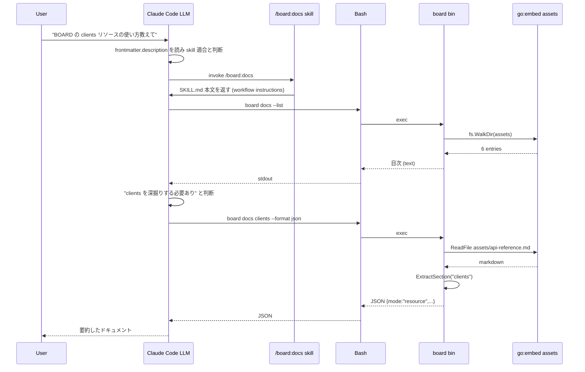
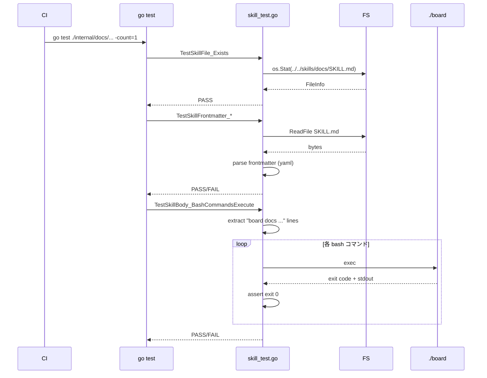

# M60: /board:docs スキル作成（薄いラッパー）

## Overview
| 項目 | 値 |
|------|---|
| ステータス | 未着手 |
| 依存 | **M59 完了後必須**（`board docs` バイナリが動作する前提） |
| 対象ファイル | `.claude-plugin/plugin.json`（新規、plugin manifest）、`skills/docs/SKILL.md`（新規）、`README.md`（編集）、`README_ja.md`（編集）、`internal/docs/skill_test.go`（新規、manifest + frontmatter + bash コマンド検証） |
| 想定工数 | 半日（TDD サイクル含む） |
| 親ロードマップ | plans/board-phase-m-roadmap.md |
| 親計画 | plans/groovy-churning-valley.md（M60 詳細計画セクション） |

## Goal

Claude Code plugin / skill から呼び出せる `/board:docs` スキルを新設する。
**一次情報は `board docs` バイナリの埋め込みドキュメントに一元化し、SKILL.md は呼び出し手順だけを LLM に伝える薄いラッパー**
として設計する。情報の二重管理を避けることで M61 以降の api-reference.md 拡充がスキル側に波及しない。

### 利用イメージ（別セッションの Claude Code から）

```
User: board CLI の使い方教えて / board の clients コマンドってどう使う？
LLM: （/board:docs の description を見て判断）
  → /board:docs を呼び出す
  → skill 内で `board docs --list` を実行して目次取得
  → 必要に応じて `board docs clients --format json` でリソース別詳細取得
  → 結果を要約してユーザーに返す
```

### `/board:docs` ネームスペース成立の前提（実装前検証済み）

advisor 指摘を受けて検証した結果、Claude Code で `/<plugin>:<skill>` 形式で呼ばれるには
以下の 2 点セットが必要（logvalet / devflow プラグインで確認済み）:

1. **プラグインマニフェスト**: `.claude-plugin/plugin.json` に `"name": "board"` を宣言
2. **スキル frontmatter**: `skills/<name>/SKILL.md` の frontmatter で `name: board:docs`（plugin prefix 付き）

参照した実装例:
- `~/.config/claude/profiles/.../plugins/cache/youyo/logvalet/0.15.1/.claude-plugin/plugin.json`
  → `{"name":"logvalet", ...}`
- `~/.config/claude/profiles/.../plugins/cache/youyo/logvalet/0.15.1/skills/context/SKILL.md`
  → frontmatter `name: logvalet:context`

この知見により本計画では **`.claude-plugin/plugin.json` の新設を必須スコープ**に追加する。
`.claude-plugin/marketplace.json` は Marketplace 配布用途で必要になるが、本 M60 では Claude Code
ローカル登録（repository を `--plugin-dir` 相当で参照）を想定するため対象外とする。M61 の配布整理で
検討可能。

## スコープ

### 実装範囲
- `.claude-plugin/plugin.json` 新設（`name: "board"`, `description`, `version`, `author`, `license`, `homepage` の最低限）
- `skills/` ディレクトリ新設（git 管理、`.gitkeep` は使わず実ファイルで埋める）
- `skills/docs/SKILL.md` — frontmatter（`name: board:docs` + `description`）+ 本文（ワークフロー、コマンド例、トラブルシュート）
- `README.md` / `README_ja.md` に「LLM / Agent integration」セクションを追加し、`/board:docs` スキルの存在と利用方法を案内
- TDD 検証: `internal/docs/skill_test.go`（新規）
  - `TestPluginManifest_Valid`: `.claude-plugin/plugin.json` が JSON として parse でき、`name == "board"`
  - `TestSkillFrontmatter_Valid`: SKILL.md の frontmatter が YAML として parse でき、必須フィールド存在
  - `TestSkillFrontmatter_Name`: `name == "board:docs"`（plugin prefix 必須）
  - `TestSkillFrontmatter_Description_NonEmpty`: `description` が 40 文字以上
  - `TestSkillBody_ReferencesBoardDocs`: 本文に `board docs --list` と `board docs <resource>` と `--format json` が全て含まれる
  - `TestSkillBody_NoResourceDuplication`: 本文に BOARD リソース名 22 種のうち、複数が列挙されていない（重複管理回避の保証）
  - `TestSkillBody_BashCommandsExecutable`: 本文中の `board docs ...` 行を抽出し、`board` バイナリで実際に動作することを smoke test（`TestMain` でテスト用バイナリをビルド、CI 環境でも確実に実行）

### スコープ外
- Claude Code plugin manifest（`plugin.json`）の新設 — 本リポジトリは skill 単体配布形態のため `skills/` のみで十分
- `skills/` 配下への複数スキル追加（M61 以降で必要に応じて拡張）
- MCP サーバーとの統合（既存 `board mcp serve` が別途存在）
- CHANGELOG への記載（M61 でまとめて記載）
- 英語版スキルの多言語分割（単一 SKILL.md に英日併記 or 英語のみで対応）

## 設計（Design）

### パッケージ / ディレクトリ配置

```
.claude-plugin/                   # 新規: Claude Code plugin manifest
└── plugin.json                   # name: "board" を宣言

skills/                           # 新規ディレクトリ（リポジトリルート直下）
└── docs/
    └── SKILL.md                  # 新規: frontmatter + 本文

internal/docs/
├── docs.go                       # 既存
├── docs_test.go                  # 既存
├── skill_test.go                 # 新規: plugin.json + SKILL.md 検証
└── assets/                       # 既存（M59 で整備）
```

### `.claude-plugin/plugin.json` の内容（最小限）

```json
{
  "name": "board",
  "description": "BOARD API CLI and MCP server — embedded documentation skill for AI agents",
  "version": "0.5.0",
  "author": {
    "name": "youyo"
  },
  "homepage": "https://github.com/youyo/board",
  "license": "MIT"
}
```

**バージョン値の扱い**: 本 M60 時点でリポジトリは v0.5.0。M61 で v0.6.0 リリース時に合わせて bump する。
plugin.json の version は **CLI 本体バージョンと独立に追従（sync_manual）** 運用とし、release スキル相当の
バージョンバンプ対象ファイルに `.claude-plugin/plugin.json` を追加する旨を README / CHANGELOG に書き残す
（ただし実運用の追従は M61 で整備、本 M60 は v0.5.0 固定で OK）。

> ⚠️ **M61 への申し送り**: v0.6.0 リリース時は `.claude-plugin/plugin.json` の `version` も `0.6.0` に更新すること。
> CHANGELOG v0.6.0 エントリでも plugin manifest のバージョンバンプを記載する。

**なぜ `internal/docs/skill_test.go` で検証するか**:
- skills/ に直接 `*_test.go` を置くと go test の対象外（Go package 認識されない）
- `internal/docs` パッケージは既に埋め込みドキュメント担当の責務を持ち、skill ファイルの妥当性検証も「ドキュメント品質」の範疇
- テストからは `../../skills/docs/SKILL.md` を `os.ReadFile` する（go test の CWD はパッケージディレクトリ）

### SKILL.md の構造（薄いラッパー方針）

```markdown
---
name: board:docs
description: >-
  Look up BOARD CLI command usage, flag reference, Ransack filters, and API
  resource details via the embedded `board docs` subcommand — offline and always
  in sync with the installed binary. Use whenever the user asks how to use
  `board api <resource>`, which flags are available, or how a BOARD API resource
  is shaped.

  Common scenarios:
  - "How do I list clients with filters?" / "board api clients の使い方"
  - "What does --response-group do?" / "Ransack フィルタ一覧"
  - "Show me the invoice resource schema" / "invoices リソースの仕様"
  - Exploring which resources exist in BOARD API

  Prefer this skill over web search or training-data recall when accuracy
  matters — `board docs` ships in the binary and reflects the exact installed
  version.
---

# /board:docs

薄いラッパー。一次情報は `board docs` サブコマンド（バイナリ埋め込み）に集約されており、
本ファイルは LLM に呼び出し手順を伝えるだけ。

## Prerequisites

`board` バイナリが PATH 上に存在すること。未インストールの場合の代替:
- Homebrew: `brew install youyo/tap/board`
- ソース: `go run github.com/youyo/board/cmd/board docs ...`（リポジトリ内なら `go run ./cmd/board docs ...`）

## Workflow

### 1. Explore: まず目次を取得

```bash
board docs --list
```

埋め込みドキュメントの一覧（`README.md` / `api-reference.md` / `guides/*.md` / `installation*.md`）を
パス + バイトサイズで返す。

### 2. Lookup by resource: 特定 API リソースの詳細

```bash
board docs <resource> --format json
```

例（LLM が JSON で受け取る場合に最適）:
```bash
board docs clients --format json    # 顧客マスタ節を JSON で抽出
board docs invoices --format json   # 請求書節
board docs projects --format json   # 案件節
```

対応 resource 名は `board docs --list` 後に `board docs api-reference --search "#### "`
（または後述の `--search`）で特定可能。

### 3. Keyword search: 横断検索

```bash
board docs --search "Ransack" --format json
```

全埋め込みドキュメントに対する行単位検索。`±2 行のコンテキスト` と直近の `####` 見出しを返すため、
LLM が該当行の意味を理解できる粒度になっている。

### 4. Full README / guide: 全体把握

```bash
board docs                          # README.md を stdout に表示
```

## Output format

`--format json` を指定した場合、以下の union 型が返る:

```json
{
  "mode": "readme" | "list" | "search" | "resource",
  "query": "<keyword or resource name, omitted for list/readme>",
  "results": [
    {
      "file": "api-reference.md",
      "section": "clients",
      "content": "...",
      "line": 27,
      "size": 15479
    }
  ]
}
```

`results[]` の各フィールドは mode により出現有無が変わる（`omitempty`）。詳細は
`board docs --search "JSON 出力スキーマ" --format json` で最新情報を取得すること。

## Best practices for LLMs

- **JSON モードを優先**: `--format json` を付けて構造化データで受け取ると parsing が安定する
- **リソース名の確定は `--list` → `--search` の順**: リソース名をハードコードせず、まず `--list` で目次を取り、
  次に `--search "#### "` や `--search "resource_name"` で利用可能なリソースを動的に確認する
- **エラー時は stderr 参照**: リソース未存在時は exit code 非ゼロ + stderr に `section not found` 形式で返る

## Troubleshooting

| 症状 | 対処 |
|------|------|
| `command not found: board` | `brew install youyo/tap/board` または `go run ./cmd/board docs ...` |
| `section not found: foo` | `board docs --list` で利用可能なドキュメント確認、`board docs --search foo` で候補探索 |
| `unsupported format: xml` | `--format` は `text` / `json` のみ対応 |
| 結果が古い | `brew upgrade board` でバイナリ更新（埋め込みドキュメントは各リリース時点のスナップショット） |

## 関連

- `board --help`: ルートコマンドヘルプ
- `board api --help`: low-level API 操作
- `board find --help`: LLM 向け横断検索
- `board mcp serve`: MCP サーバーとして常駐（ツール経由で `find_*` を提供）
```

### frontmatter 設計詳細

| フィールド | 値の方針 | 根拠 |
|-----------|---------|------|
| `name` | `board:docs` | Claude Code の `<plugin>:<skill>` namespace 規約。`.claude-plugin/plugin.json` の `name: "board"` と組合せて `/board:docs` として解決される（logvalet/devflow で確認済み） |
| `description` | マルチライン YAML (`>-`) で「何をするか」「いつ使うか」「Common scenarios」を含む | 既存 find-docs / release スキルの parity。triggering 精度を高めるため具体的キーワード列挙 |
| `allowed-tools` / `tools` | **指定しない** | `board docs` は Bash 経由で呼ぶだけ。デフォルト設定（全ツール可）で問題なし。明示指定するなら `Bash(board docs:*)` だが、現状の skill エコシステムで確実な記法がないため未指定とする |

**決定**: `allowed-tools` は指定しない。既存 find-docs / release にも無く、指定すると環境差で bash 実行が blocked される可能性あり。

### 情報重複回避の設計原則

| 原則 | 実装 |
|------|------|
| リソース一覧を SKILL.md に列挙しない | `board docs --list` に任せる。本文には resource 名を 3 例以下（clients / invoices / projects）しか出さない |
| Ransack フィルタを SKILL.md に列挙しない | `board docs --search "Ransack"` に任せる |
| JSON 出力スキーマはサンプル 1 件のみ | 詳細は `board docs` の実行結果に任せる |
| api-reference.md 本体をコピペしない | 全て `board docs <resource>` の呼び出しで取得 |

### README / README_ja 追記内容

**README.md**: 既存の `## Documentation` セクションと `## CLI Commands` の間、または `## Quick Start` の後に
以下セクションを挿入。

```markdown
## Agent / LLM integration

### Embedded `board docs` subcommand

The `board` binary ships with embedded documentation — no network required:

```sh
board docs                          # Show README
board docs --list                   # List all embedded docs
board docs clients                  # Extract a resource reference
board docs clients --format json    # Machine-readable output for LLMs
board docs --search "Ransack"       # Full-text search
```

### `/board:docs` Claude Code skill

A lightweight Claude Code skill wraps the commands above so AI agents can look
up BOARD CLI usage on demand. Place this repository's `skills/docs/SKILL.md`
where your Claude Code installation picks up skills (e.g. `~/.claude/skills/`
or a project-level `.claude/skills/`). Once registered, prompt `/board:docs` or
let the agent decide based on the skill description.
```

**README_ja.md**: 対応する日本語版セクションを `## ドキュメント` の下、または `## CLI コマンド` の前に追加。

```markdown
## エージェント / LLM 連携

### 埋め込み `board docs` サブコマンド

`board` バイナリには BOARD CLI ドキュメントが埋め込まれており、オフラインで参照できます:

```sh
board docs                          # README を表示
board docs --list                   # 埋め込みドキュメント一覧
board docs clients                  # リソース別リファレンスを抽出
board docs clients --format json    # LLM 向け機械可読出力
board docs --search "Ransack"       # 全文検索
```

### `/board:docs` Claude Code スキル

上記コマンドを LLM が呼び出しやすいようにラップした Claude Code スキルを同梱しています
（`skills/docs/SKILL.md`）。Claude Code が読み込む場所（`~/.claude/skills/` または
プロジェクトの `.claude/skills/`）に配置すると、`/board:docs` で呼び出せます。
```

### TDD テスト設計書

#### `internal/docs/skill_test.go`

##### 正常系

| ID | テスト関数 | 入力 | 期待出力 |
|----|------------|------|----------|
| S-0 | `TestPluginManifest_Valid` | `../../.claude-plugin/plugin.json` | JSON parse 成功、`name == "board"`、`description` 非空、`version` 非空 |
| S-1 | `TestSkillFile_Exists` | `../../skills/docs/SKILL.md` | `os.Stat` 成功、Size > 100 |
| S-2 | `TestSkillFrontmatter_Parseable` | SKILL.md 先頭 `---` ブロック | frontmatter parse 成功（yaml.v3 or 手書き parser） |
| S-3 | `TestSkillFrontmatter_Name` | 同上 | `meta.Name == "board:docs"`（plugin prefix 必須） |
| S-4 | `TestSkillFrontmatter_Description_NonEmpty` | 同上 | `len(meta.Description) >= 40` |
| S-5 | `TestSkillFrontmatter_Description_HasUseCase` | 同上 | description に `board docs` 又は `BOARD` を含む（triggering キーワード存在確認） |
| S-6 | `TestSkillBody_HasList` | SKILL.md 本文 | `board docs --list` を含む |
| S-7 | `TestSkillBody_HasResourceExample` | 同上 | `board docs <resource>` または `board docs clients` などの実例を含む |
| S-8 | `TestSkillBody_HasFormatJSON` | 同上 | `--format json` を含む |
| S-9 | `TestSkillBody_HasSearch` | 同上 | `--search` を含む |
| S-10 | `TestSkillBody_HasTroubleshooting` | 同上 | `Troubleshooting` または `トラブルシュート` セクションを含む |
| S-11 | `TestSkillBody_BashCommandsExecute` | 本文の `board docs ...` コード行を抽出 | 抽出した各コマンドを `TestMain` で事前ビルドしたテスト用バイナリで実行し exit 0（smoke test） |
| S-12 | `TestSkill_NoResourceListDuplication` | SKILL.md 本文 | BOARD リソース 22 個のうち、SKILL.md 本文に列挙されているのは **5 個以下**（重複管理防止。3 例 + 多少の説明的言及を許容） |
| S-13 | `TestReadme_HasSkillSection` | `../../README.md` | `/board:docs` を含むセクションが存在 |
| S-14 | `TestReadmeJa_HasSkillSection` | `../../README_ja.md` | `/board:docs` を含むセクションが存在 |

##### 異常系

| ID | テスト関数 | 入力 | 期待出力 |
|----|------------|------|----------|
| S-E1 | `TestSkillFrontmatter_Malformed_DetectedByTest` | （将来のリグレッション防止） | S-2 が frontmatter 破損時に赤になることを確認（実運用上は SKILL.md 編集時に自動検知） |

##### テスト実装戦略

- **yaml パース**: Step 0 で `grep -r yaml.v3 go.sum` 先行確認。既存依存があれば yaml.v3 を使用、なければ手書き
  frontmatter parser を `internal/docs/skill_test.go` 内に閉じ込める（`strings.Split` で `---` 区切り →
  行単位で `key: value` 解析、`>-` マルチラインは空行 or インデント変化まで結合）。
  **yaml.v3 を新規追加しない方針**: バイナリサイズ増分回避 + テスト専用依存を本体に混ぜない。
- **本文抽出**: `---\n...\n---\n` の 2 番目の `---` 以降
- **bash コマンド抽出**: `board docs` で始まる行を抽出（```sh / ```bash / ```shell ブロック内のみ、行末コメント除去）
- **smoke test の CI 安定化（advisor 指摘対策）**:
  - `TestMain(m *testing.M)` を `skill_test.go` に定義し、全テスト前に以下を実行:
    1. `tmpDir, err := os.MkdirTemp("", "board_m60_")` でテンポラリディレクトリ作成
       （`t.TempDir()` は `*testing.T` 専用で TestMain では使用不可）
    2. `go build -o <tmpDir>/board ./cmd/board`（CWD は `internal/docs`、`../..` を指定して repo root からビルド）
    3. 環境変数 `BOARD_TEST_BIN` にパス設定、各テストはこの env を参照
    4. 全テスト終了後 `os.RemoveAll(tmpDir)` でクリーンアップ
  - `t.Skip` は使わず、build 失敗は `log.Fatal`（TestMain では `t` が無いため log.Fatal / os.Exit(1)）
  - `TestSkillBody_BashCommandsExecute` は `exec.Command(os.Getenv("BOARD_TEST_BIN"), args...)` で実行
- **relative path の扱い**: テスト CWD は `internal/docs` なので `../..` が repo root

### TDD 進行フロー（Red → Green → Refactor）

1. **Red 1**: `internal/docs/skill_test.go` 先行実装。`skills/docs/SKILL.md` 未存在のため S-1〜S-14 全赤
2. **Green 1**: `skills/docs/SKILL.md` を最小限で作成 → テスト通過
3. **Refactor 1**: SKILL.md の言い回し整理、Troubleshooting テーブル整形、description 文言の最終調整
4. **Red 2**: `TestReadme_HasSkillSection` / `TestReadmeJa_HasSkillSection` が赤
5. **Green 2**: README.md / README_ja.md にセクション追加
6. **最終**: `mise run check-docs-sync` → `go test ./... -count=1` → `go vet ./...` → `gofmt -s -w .`
   - `check-docs-sync` が Green であることが重要（README.md を編集したため `internal/docs/assets/README.md` も sync-docs で更新される）

### シーケンス図

#### 別セッションの Claude Code から `/board:docs` が呼ばれるフロー



#### SKILL.md 検証フロー（CI 側）



## 実装手順

### Step 0: 前準備
- ブランチ作成: `feature-m60-docs-skill`
- `internal/docs/skill_test.go` の Read を行い、既存 `internal/docs/docs_test.go` パターンを踏襲
- yaml パーサー依存確認: `grep yaml go.sum` で既存依存を調査。なければ `TestSkillFrontmatter_*` を手書き parser で実装（`---` で split → 行単位で `key: value` 解析 or `encoding/json` 互換の最小実装）

### Step 1: `internal/docs/skill_test.go`（Red）
- 15 ケース（S-0〜S-14）を先行実装
- `TestMain` でテスト用 board バイナリをビルド（`go build -o $TMPDIR/board_m60 ./cmd/board`）
- `go test ./internal/docs/... -count=1 -run 'TestSkill|TestPluginManifest|TestReadme'` で全赤確認

### Step 2a: `.claude-plugin/plugin.json` 作成（Green 0）
- 設計の「plugin.json の内容」セクション通りの JSON を作成
- `go test -run TestPluginManifest_Valid` で S-0 が Green

### Step 2b: `skills/docs/SKILL.md` 作成（Green 1）
- 設計の「SKILL.md の構造」セクション通りの内容で作成
- frontmatter は `name: board:docs` / `description: >-` のマルチライン形式
- 本文は Prerequisites → Workflow（1-4）→ Output format → Best practices → Troubleshooting → 関連
- `go test` で S-1 〜 S-12 が通ることを確認

### Step 3: `README.md` 編集（Green 2 前半）
- 既存 `## Documentation` の後、`## Installation` の前に `## Agent / LLM integration` セクションを挿入
- 内容は設計の README.md 追記内容通り
- `go test -run TestReadme_HasSkillSection` で S-13 が Green

### Step 4: `README_ja.md` 編集（Green 2 後半）
- 既存 `## ドキュメント` の後、`## インストール` の前に `## エージェント / LLM 連携` セクションを挿入
- 内容は設計の README_ja.md 追記内容通り
- `go test -run TestReadmeJa_HasSkillSection` で S-14 が Green

### Step 5: docs sync（必須）
- README.md を編集したため `internal/docs/assets/README.md` も更新が必要
- `mise run sync-docs` を実行
- `mise run check-docs-sync` で drift なし確認

### Step 6: Refactor + 品質チェック
- SKILL.md の言い回し見直し（簡潔で LLM triggering に有効か）
- `go test ./... -count=1` 全 Green
- `go vet ./...` warning なし
- `gofmt -s -w .`
- `golangci-lint run`（warnings ゼロを維持）
- `mise run build` で board バイナリ再ビルド確認

### Step 7: 動作確認（手動）
```bash
# SKILL.md の内容を視覚確認
cat skills/docs/SKILL.md

# 本文中の bash コマンドが全て動く
board docs --list
board docs clients --format json | jq '.mode'  # "resource"
board docs --search "Ransack" --format json | jq '.results | length'
board docs --search "JSON 出力スキーマ" --format json 2>&1 | head

# frontmatter が Claude Code / devflow で読めるか最低限確認
head -20 skills/docs/SKILL.md

# drift 検知
mise run check-docs-sync
```

### Step 8: コミット
- Conventional Commits（日本語）
  - コミット 1: `feat(skills): M60 /board:docs Claude Code スキルを追加`
    - 対象: `skills/docs/SKILL.md`, `internal/docs/skill_test.go`, `internal/docs/assets/README.md`（sync 反映分）, `README.md`, `README_ja.md`
  - または粒度を分けて:
    - `feat(skills): /board:docs スキル新設 + 検証テスト`（skills/, internal/docs/skill_test.go）
    - `docs(readme): /board:docs スキル利用案内を追加`（README*, assets/README.md）
- コミット前に `mise run check-docs-sync` が Green であることを確認
- 本 milestone では push 不要

## アーキテクチャ検討

### 既存パターンとの整合性

| 観点 | 既存の流儀 | 本計画の準拠 |
|------|-----------|------------|
| skill frontmatter | `/Users/youyo/.claude/skills/find-docs/SKILL.md` 参照。`name` / `description` 必須、`>-` マルチライン | SKILL.md は同形式で記述 |
| ディレクトリ命名 | 既存の `.claude/skills/<name>/SKILL.md` 方式に揃える | `skills/docs/SKILL.md`（プロジェクトリポジトリ内は `.claude/` ではなく `skills/` を使用。親計画 M60 詳細の指示通り） |
| テスト配置 | `*_test.go` をコード側パッケージに同居 | `internal/docs/skill_test.go` に置く（skills/ は Go package ではないため） |
| yaml 依存 | 既存 go.mod 確認要。`pelletier/go-toml/v2` はあるが yaml は未確認 | 既存依存なしなら手書き parser（30 行程度）で対応 |
| ドキュメント一次情報 | M59 で `board docs` に集約済み | SKILL.md はリソース列挙せず、`board docs --list` に誘導 |
| 情報重複禁止 | CLAUDE.md Core Principles | SKILL.md 本文に API 詳細をコピペしない |

### 新規モジュール設計

- `skills/` は Go パッケージ外（静的ファイルのみ）
- `internal/docs/skill_test.go` は `internal/docs` パッケージ内に属し、`docs.go` への import なしで SKILL.md のみを検証
- 循環依存なし
- 本体バイナリサイズへの影響: **ゼロ**（skills/ は go:embed 対象外、ランタイムロードなし）

## リスク評価

| # | リスク | 重大度 | 対策 |
|---|--------|--------|------|
| R1 | Claude Code の skill frontmatter 仕様が将来変更される | 中 | SKILL.md の frontmatter は最小限（name + description）のみ使用。allowed-tools 等の追加フィールドは現時点で未使用のため仕様変更影響を最小化 |
| R2 | board バイナリ未インストール環境でスキル呼び出し失敗 | 中 | SKILL.md の Prerequisites と Troubleshooting に明記（`brew install` / `go run ./cmd/board`）。LLM が Bash 失敗を検知して案内できる |
| R3 | skill の plugin prefix 漏れで `/board:docs` 呼び出し不能 | **高** | **本計画で `.claude-plugin/plugin.json` + `name: board:docs` を必須スコープに含める**。S-0 / S-3 テストで両方を検証 |
| R4 | SKILL.md に BOARD API 情報を書いてしまい重複管理発生 | **高** | TestSkill_NoResourceListDuplication（S-12）で「22 リソース中 3 個以下しか列挙されていない」ことをテストで担保 |
| R5 | smoke test (`TestSkillBody_BashCommandsExecute`) が CI で board バイナリ未ビルドのため失敗 | 中 | `TestMain` でテスト開始時に `go build -o $TMPDIR/board_m60 ./cmd/board` を実行、環境変数経由で各テストに渡す。**`t.Skip` は使わず**、build 失敗は `t.Fatal` で CI silent skip を防止（advisor 指摘対応） |
| R6 | frontmatter の YAML parse に外部依存（yaml.v3）が必要 | 低 | **yaml.v3 は新規追加しない**（advisor 指摘対応）。Step 0 で既存依存を確認、なければ手書き parser（約 40 LOC、テスト内クロージャ）で対応。これにより本体バイナリ依存ゼロ |
| R7 | README への追記が M61（README 拡充）と重複する可能性 | 中 | M60 は「スキルの存在告知」最小限に留め、M61 は「completion / docs の利用方法詳述」担当として責務分離。M60 追加セクションは見出し 2 つ、10-15 行程度で抑える |
| R8 | docs/ の drift（M59 の assets/ 同期忘れ） | 中 | Step 5 で `mise run sync-docs` を必ず実行。Step 7 と Step 8 のコミット前に `mise run check-docs-sync` を実行 |
| R9 | Claude Code が plugin を読み込む CWD / manifest 検出 | 低 | logvalet / devflow の実装例で `.claude-plugin/plugin.json` + `skills/<name>/SKILL.md` 構造が検証済み。本計画はこの構造を完全踏襲 |
| R10 | LLM が `/board:docs` を triggering しない（description 不足） | 中 | description に「when」「scenarios」「common phrases」を英日両方で含める（find-docs パターン踏襲）。S-5 テストで triggering キーワード存在を最低限担保 |
| R11 | bash コマンド例が古くなり実動作と乖離 | 中 | S-11 smoke test で「SKILL.md に書いた board docs コマンドが実際に動く」ことを毎回のテストで保証 |
| R12 | SKILL.md が Markdown として無効（不完全な code fence 等） | 低 | 本文にコード fence が多いため手動チェック + go test 時の読み込みで syntactical error は早期検知 |

## 観点別チェックリスト

### 観点1: 実装実現可能性と完全性（5項目）
- [x] 手順の抜け漏れがないか — Step 0〜Step 8 で一貫した流れ
- [x] 各ステップが十分に具体的か — ファイル名・コマンド・期待結果まで明記
- [x] 依存関係が明示されているか — M59 完了前提、Step 1 Red → Step 2 Green の順序
- [x] 変更対象ファイルが網羅されているか — SKILL.md + README + README_ja + skill_test.go + assets/README.md の 5 箇所
- [x] 影響範囲が正確に特定されているか — skills/ は新規、README の追記は非破壊、テストは追加のみ

### 観点2: TDDテスト設計の品質（6項目）
- [x] 正常系テストケースが網羅されているか — S-1〜S-14
- [x] 異常系テストケースが定義されているか — S-E1（frontmatter 破損は Red で自然検知）
- [x] エッジケースが考慮されているか — ファイル未存在、YAML 破損、bash 失敗、resource 名重複列挙
- [x] 入出力が具体的に記述されているか — 各テストに期待値を明記（`name == "docs"`, `len >= 40` 等）
- [x] Red→Green→Refactor の順序が守られているか — Step 1 Red、Step 2 Green、Step 6 Refactor
- [x] モック/スタブの設計が適切か — smoke test は実バイナリ経由（統合テスト化）、モック不要

### 観点3: アーキテクチャ整合性（5項目）
- [x] 既存の命名規則に従っているか — `SKILL.md` ファイル名、`internal/<pkg>_test.go` パターン
- [x] 設計パターンが一貫しているか — 既存 find-docs / release SKILL.md の frontmatter + Workflow + Troubleshooting
- [x] モジュール分割が適切か — skills/ と internal/docs/ は責務分離
- [x] 依存方向が正しいか — skill_test.go は SKILL.md を参照、その逆なし。循環なし
- [x] 類似機能との統一性があるか — `/board:docs` は既存 skill の parity

### 観点4: リスク評価と対策（6項目）
- [x] リスクが適切に特定されているか — R1〜R12
- [x] 対策が具体的か — 各リスクに実装レベルの対策
- [x] フェイルセーフが考慮されているか — board 未インストール時の Troubleshooting、smoke test の binary 自動ビルド fallback
- [x] パフォーマンスへの影響が評価されているか — バイナリサイズ増分ゼロ、テスト実行時間は smoke test 数百 ms 程度
- [x] セキュリティ観点が含まれているか — SKILL.md は静的テキスト、bash コマンドは board docs のみで任意コマンド実行なし
- [x] ロールバック計画があるか — skills/ 削除 + README 差分 revert で完全撤去可能

### 観点5: シーケンス図の完全性（5項目）
- [x] 正常フローが記述されているか — LLM triggering → Bash → board → 埋め込み FS → 応答
- [x] エラーフローが記述されているか — CI シーケンス図で PASS/FAIL 両フロー記述
- [x] ユーザー・システム・外部API間の相互作用が明確か — User / Claude / Skill / Bash / Board / Embed の 6 者
- [x] タイミング・同期的な処理の制御が明記されているか — 全て同期実行（非同期要素なし）
- [x] リトライ・タイムアウト等の例外ハンドリングが図に含まれているか — N/A（オフライン埋め込み参照のためリトライ不要）

## Success Criteria

- [ ] `.claude-plugin/plugin.json` が作成され、`name: "board"` が宣言されている
- [ ] `skills/docs/SKILL.md` が作成され、frontmatter `name: board:docs` が正しく設定
- [ ] `go test ./internal/docs/... -count=1 -run 'TestSkill|TestPluginManifest|TestReadme'` 全 Green（S-0〜S-14）
- [ ] `go test ./... -count=1` 全パッケージ Green
- [ ] `go vet ./...` warning なし
- [ ] `gofmt -s -w .` 差分なし
- [ ] `golangci-lint run` warning なし
- [ ] `mise run check-docs-sync` drift なし
- [ ] `mise run build` 成功
- [ ] `./board docs --list` など SKILL.md 本文の bash コマンドが全て exit 0 で動作
- [ ] README.md / README_ja.md に `/board:docs` セクションが追加されている
- [ ] SKILL.md 本文に BOARD リソース 22 個のうち 3 個以下しか列挙されていない（情報重複回避）

## Next Action（完了後）

1. コミット: `feat(skills): M60 /board:docs Claude Code スキルを追加`
2. ロードマップ `plans/board-phase-m-roadmap.md` の M60 チェックボックス完了
3. M61（README / api-reference 拡充 + v0.6.0 リリース）に着手
4. `/board:docs` 実動作確認は M61 の動作確認フェーズで別セッション起動して行う（本 M60 では TDD smoke test で代替）

---

**親計画**: plans/board-phase-m-roadmap.md
**先行マイルストーン**: M59（board docs サブコマンド + JSON 出力、完了）
**後続マイルストーン**: M61（README / api-reference 拡充 + v0.6.0 リリース）
**作成日**: 2026-04-24
**最終更新**: 2026-04-24
