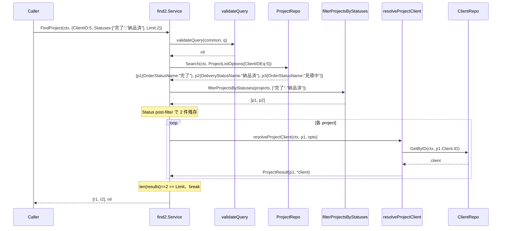
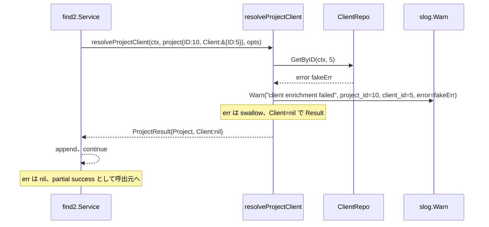
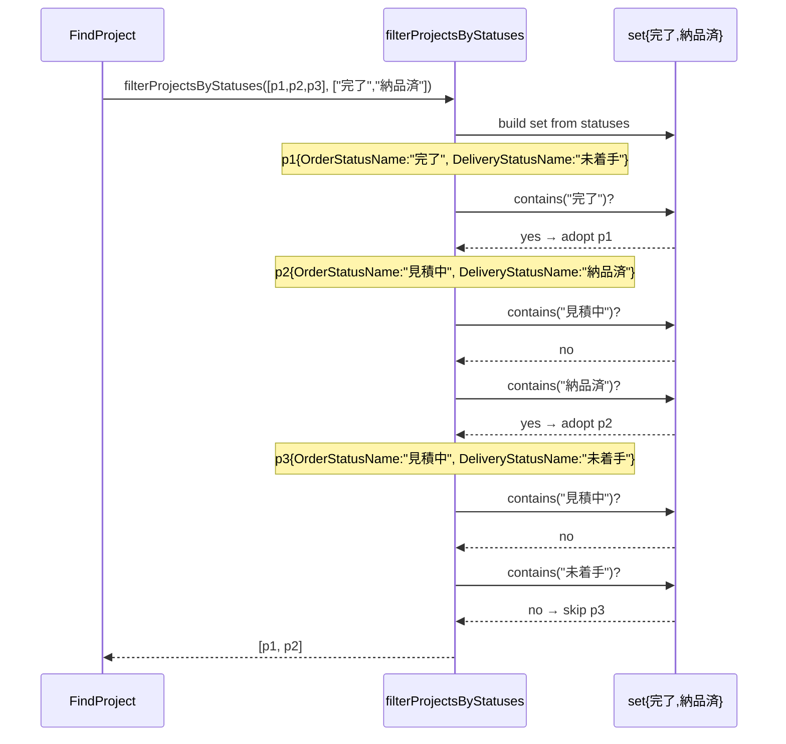

# N05: FindProject 具象実装

## Context

ADR-001（B 採択 / Status: Accepted）に基づき `internal/service/find2/` をゼロベース再設計中。N04 完走（2026-04-25, commit 07e6643）で `FindClient` + `FindVendor` を実装し、`validateQuery` 規約 / non-fatal enrichment / errgroup 並列パターン / handshake チャネル方式での並列検証を確立した。

本 N05 は **3 番目の具象 Find メソッド**として `FindProject` を実装する。N04 と決定的に異なるのは:

1. **Enrichment が単一 goroutine** — `ProjectResult{Project, *Client}` は補助情報が Client 1 件のみ。`resolveClientDetails`（N04 で確立した branches+contacts 2 並列）は不適用。errgroup/handshake は使わない。
2. **Status post-filter が複合フィールド OR 評価** — ProjectEntity は M44 で `Status` フィールドが廃止され、`OrderStatusName string` / `DeliveryStatusName string` の 2 フィールド分離。`filterByStatuses[T any]`（`func(T) string` シグネチャ）は不適用 → 専用ヘルパー `filterProjectsByStatuses` を新規追加。
3. **Statuses 機能の本格初投入** — N04 では使わなかった `Statuses []string` を実用。types.go の validateStatusFields（10 件上限・排他チェック）が初実用。
4. **API delegation 不可能** — `ProjectListOptions.OrderStatusIn` / `DeliveryStatusIn` は **`[]int`**（status コード）、Query.Status/Statuses は **JP 名 string**（"見積中(中)" 等）。マッピング不能のため、Status/Statuses は常に **in-process post-filter** とする。
5. **reverseMapper は不使用** — Document 4 種（N06）で初使用。N05 では既存 `resolveClientAndProject` も使わず、新規 `resolveProjectClient`（単純な `clients.GetByID` 直呼び）を resolver.go に追加。

> **目的**: `find2.Service.FindProject` を TDD で実装し、Status/Statuses 機能の初実用 + ProjectEntity 特有の複合フィールド OR を含む post-filter を確立する。N06（Document 4 種）以降の各 Find 実装で参照可能な「単一 enrichment + 複合フィールド post-filter」パターンを示す。

## スコープ

### In Scope
- `internal/service/find2/types.go` への小修正:
  - `FindProjectQuery.validate()` に **「Status/Statuses-only クエリの reject」ルール追加**（advisor 指摘 R3 対応）。`Status != "" || len(Statuses) > 0` のとき `ID / Name / ClientID / Text` のいずれかが必須。N02 §3.2 「API で eq あれば API 優先」の intent と整合（ProjectListOptions では Status を `[]int` でしかフィルタできず JP-string Query と非対応 → ユーザー側で narrowing 必須）
- `internal/service/find2/find_project.go` 新規作成（`FindProject(ctx, q FindProjectQuery) ([]ProjectResult, error)`）
- `internal/service/find2/find_project_test.go` 新規作成（unit test、stub repo 利用）
- `internal/service/find2/resolver.go` への追記:
  - `(s *Service) resolveProjectClient(ctx, project, opts) ProjectResult` — Project に紐づく Client 単体を取得（ClientID==0 はスキップ、enrichment 失敗は **non-fatal** + slog.Warn）
- `internal/service/find2/filter.go` への追記:
  - `filterProjectsByStatuses(projects []boardapi.ProjectEntity, statuses []string) []boardapi.ProjectEntity` — `OrderStatusName` OR `DeliveryStatusName` のいずれかが statuses 集合にマッチした要素を返す projects 専用ヘルパー
  - `filterProjectsByStatus(projects, status string) []boardapi.ProjectEntity` — 単数版（内部で statuses=[status] に委譲）
- 任意改善（N04 code-reviewer Major M3 引継）: `helpers_test.go` に `recordingHandler` を追加（slog.Warn 観測用、N06+ でも reuse）

### Out of Scope
- **ClientName 逆引き**: types.go:69-77 の `FindProjectQuery` は **ClientID int** であり ClientName を持たない。N02 設計時点で「ClientName → ClientID 逆引きは不要、呼び出し側で先に FindClient を引いて ClientID を渡す」確定済（types.go = source of truth）。本 N05 では実装しない。
- **Estimate enrichment**: 旧 `find/find_project.go` には `resolveProjectClient` 内で `projects.GetByIDWithGroup(id, "estimate") + estimates.GetByDocumentID` の Estimate enrichment があったが、find2 の `ProjectResult{Project, *Client}` には Estimate フィールドが存在しない（types.go:267-270）。N02 設計判断で削除済。本 N05 では Estimate を扱わない。
- 他の具象メソッド（FindEstimate / FindOrder / FindDelivery / FindReceipt / FindInvoice / FindPurchaseOrder / FindPayment / FindUser）→ N06-N07a
- CLI 結合（`board find_project` を find2 にスイッチ）→ N07c
- MCP tools 結合 → N08
- E2E テスト（実 API 接続）→ N09
- 旧 `internal/service/find/find_project.go` 削除 → N07b

### 前提
- N04 完走（commit 07e6643、`go test -race` pass、code-reviewer APPROVED）
- types.go: `FindProjectQuery{ID, Name, ClientID, Text, Status, Statuses, FindCommonOpts}`、`ProjectResult{Project, *Client}` 既定義（types.go:69-88, 267-270）
- service.go: `ProjectRepo` (GetByID + Search + GetByIDWithGroup) / `ClientRepo` (GetByID + Search) 既定義
- text_match.go: `containsText` / `derefString` / `projectClientIDPtr` 利用可能
- filter.go: `filterByStatuses[T]` / `filterByStatus[T]` 既存（N05 で `filterProjectsByStatuses` を追加するが、既存ヘルパーは N06+ で再活用）
- helpers_test.go: `stubClientRepo` / `stubProjectRepo` 既定義（searchFunc / getFunc / searchErr / searchCount 拡張済、N03 M1 / N04 で確認）

## API 仕様

### types.go の事前確定事項（実装着手前に必ず参照）

- **`FindProjectQuery{ID, Name, ClientID, Text, Status, Statuses, FindCommonOpts}`** — types.go:69-77。`ClientName` フィールドは**存在しない**。
- **空 Query エラーメッセージ**: `"at least one field required"`（types.go:85）
- **Status と Statuses 排他チェック**: `validateStatusFields(q.Status, q.Statuses)` を `q.validate()` 内で実行（types.go:80-82）。両方セット時は `"Status and Statuses are mutually exclusive"`、Statuses が 11 件以上は `"at most 10 statuses allowed"`。
- **Limit セマンティクス**: 0=無制限、<0=`"limit must be >= 0"` error（types.go:21-25）。
- **validate 規約**: 全 Find メソッドは `validateQuery(q.FindCommonOpts, q)` を最初に呼ぶ（N04 で確立、types.go:33-38）。

### FindProject

```go
func (s *Service) FindProject(ctx context.Context, q FindProjectQuery) ([]ProjectResult, error)
```

**入力検証**: 最初に `validateQuery(q.FindCommonOpts, q)` を呼ぶ。
- `Limit < 0` → error（"limit must be >= 0"）
- 空 Query（ID==0 && Name=="" && ClientID==0 && Text=="" && Status=="" && len(Statuses)==0）→ error（"at least one field required"）
- Status と Statuses 両方セット → error（"Status and Statuses are mutually exclusive"）
- len(Statuses) > 10 → error（"at most 10 statuses allowed"）
- **Status/Statuses-only**（Status または Statuses が指定されているが、ID/Name/ClientID/Text がすべて 0/空）→ error（"Status/Statuses requires at least one of ID, Name, ClientID, or Text to narrow results"）— **N05 で types.go に追加するルール**（advisor 指摘 R3）

**検索ロジック**（旧 find/find_project.go の switch ベース踏襲、ClientName を ClientID に置換）:

| 条件 | 処理 |
|---|---|
| `q.ID != 0` | `projects.GetByID(ctx, q.ID, opts)` を呼び 1 件取得 |
| `q.ClientID != 0` | `projects.Search(ctx, ProjectListOptions{ClientIDEq: q.ClientID}, opts)` |
| `q.Name != ""` | `projects.Search(ctx, ProjectListOptions{NameCont: q.Name}, opts)` |
| `q.Text != ""` | `projects.Search(ctx, ProjectListOptions{}, opts)` 全件 + `containsText(q.Text, p.Name, derefString(p.ManagementNo), derefString(p.InHouseMemo))` で in-process フィルタ |

**Status/Statuses-only ケース**は `validate()` で reject されるため、検索 switch には到達しない（advisor 指摘 R3、(a) Validation reject 採用）。

**switch case の優先順位**: `ID > ClientID > Name > Text` の 4 段階。先に該当した case のみ実行（else if の連鎖）。Status/Statuses があれば必ず上記 4 case のいずれかに含まれた状態で実行され、post-filter で絞り込まれる。

**Status post-filter 適用**:
- 適用条件: `(q.Status != "" || len(q.Statuses) > 0) && q.ID == 0`
  - **ID 検索時はスキップ**（旧 find_project.go:82 踏襲）。ID で 1 件直引きした結果を Status で 0 件にすると UX 上意味不明のため。
- 適用関数:
  - `q.Statuses` 優先（types.go validate で排他保証済）: `filterProjectsByStatuses(projects, q.Statuses)`
  - `q.Status != ""`: `filterProjectsByStatus(projects, q.Status)`
- 比較対象: `OrderStatusName` または `DeliveryStatusName` のいずれかが statuses 集合に含まれる（OR 評価、旧 filterByStatus の踏襲）。

**Enrichment**: 各 project について `resolveProjectClient(ctx, p, opts)` を呼び、`*ClientEntity` を取得。
- ClientID 抽出: `projectClientIDPtr(&project)` 利用（M44 で `ClientID` トップレベル廃止、nested `Client.ID` に統合）
- ClientID == 0 → enrichment スキップ、`Client: nil` で Result 返却
- `clients.GetByID` 失敗 → **non-fatal**、`slog.Warn` 出力 + `Client: nil` で Result 返却（resolver.go top doc の discriminator に従う）

**Limit 適用**: enrichment ループ内で `q.Limit > 0 && len(results) >= q.Limit` で break（N04 と同パターン）。

### 並列化を行わない理由（Architecture Decision）

`ProjectResult` の補助情報は `*Client` 1 件のみ。errgroup を 1 goroutine で使う一貫性より、単純な逐次呼び出しの可読性を優先する。本判断は次の事実に基づく:

- N04 の `resolveClientDetails` / `resolveVendorDetails` は branches+contacts の 2 並列のため errgroup の便益が明確だった
- N05 では並列化対象が無い → errgroup は overhead でしかない
- N06（Document 4 種）では再び `resolveClientAndProject`（既存 errgroup 版）を使うため、並列化パターンは N06 で再投入

handshake 並列検証テスト（N04-T25 相当）は **本 N05 では存在しない**。代替として「ClientID==0 で enrichment スキップ」「Project.Client==nil のケース」「GetByID failure → non-fatal」の 3 パスをカバーする。

## テスト設計書

### 命名規則
- `TestService_FindProject_<シナリオ>`（サービスメソッド単位）
- 既存 `helpers_test.go` の stub（`stubProjectRepo` / `stubClientRepo`）を流用
- `searchFunc` / `getFunc` / `searchErr` / `searchCount` で挙動を制御
- slog.Warn 観測には新規 `recordingHandler` ヘルパーを使用（N04 code-reviewer Major M3 引継）

### 正常系ケース（T01-T08）

| ID | テスト名 | 入力 | stub 設定 | 期待出力 |
|---|---|---|---|---|
| N05-T01 | `TestService_FindProject_ByID_Success` | `q.ID=10` | projects.getResult={ID:10, Name:"P", Client:&{ID:5}}、clients.getResult={ID:5, Name:"C"} | 1 件、Project.ID=10、Client.ID=5 |
| N05-T02 | `TestService_FindProject_ByID_ClientNil_NoEnrichment` | `q.ID=10` | projects.getResult={ID:10, Client:nil}、clients は呼ばれない | 1 件、Client=nil、`stubClientRepo.getCount` 経由で getCount=0 を assert |
| N05-T03 | `TestService_FindProject_ByClientID_DelegatesClientIDEq` | `q.ClientID=5` | projects.searchFunc が `ProjectListOptions{ClientIDEq:5}` を受け取って 2 件返却 | 2 件、searchFunc が受け取った filter の ClientIDEq==5 を assert |
| N05-T04 | `TestService_FindProject_ByName_DelegatesNameCont` | `q.Name="Acme"` | projects.searchFunc が `ProjectListOptions{NameCont:"Acme"}` を受け取って 1 件返却 | 1 件 |
| N05-T05 | `TestService_FindProject_ByText_FiltersInProcess` | `q.Text="alpha"` | projects.searchResult=[{Name:"Alpha P"},{Name:"Beta"},{ManagementNo:strPtr("ALPHA-1")}] | 2 件（Alpha P + ManagementNo マッチ） |
| N05-T06 | `TestService_FindProject_ByText_MatchesInHouseMemo` | `q.Text="urgent"` | project.InHouseMemo=strPtr("urgent customer") | 1 件 |
| N05-T07 | `TestService_FindProject_PriorityIDOverridesOthers` | `q.ID=10, q.ClientID=5, q.Name="X"` | projects.getResult={ID:10}、searchFunc が呼ばれたら fail | 1 件、searchCount==0 |
| N05-T08 | `TestService_FindProject_LimitTwo_StopsEnrichment` | `q.Name="x"`, Limit=2 | projects=3 件、clients は GetByID で順次返却 | 2 件、`stubClientRepo.getCount`==2（3 件目スキップ） |

### Status post-filter ケース（T09-T13）

| ID | テスト名 | 入力 | stub 設定 | 期待出力 |
|---|---|---|---|---|
| N05-T09 | `TestService_FindProject_StatusFiltersByOrderStatusName` | `q.Name="x", q.Status="見積中(中)"` | projects=[{OrderStatusName:"見積中(中)"},{OrderStatusName:"完了"}] | 1 件 |
| N05-T10 | `TestService_FindProject_StatusFiltersByDeliveryStatusName` | `q.Name="x", q.Status="未着手"` | projects=[{DeliveryStatusName:"未着手"},{DeliveryStatusName:"納品済"}] | 1 件 |
| N05-T11 | `TestService_FindProject_StatusOR_OrderOrDelivery` | `q.Name="x", q.Status="完了"` | projects=[{OrderStatusName:"完了", DeliveryStatusName:"未着手"}, {OrderStatusName:"見積中", DeliveryStatusName:"完了"}, {OrderStatusName:"見積中", DeliveryStatusName:"未着手"}] | 2 件（最後の 1 件のみ除外） |
| N05-T12 | `TestService_FindProject_Statuses_MultipleMatch` | `q.Name="x", q.Statuses=["完了","納品済"]` | projects=[{OrderStatusName:"完了"},{DeliveryStatusName:"納品済"},{OrderStatusName:"見積中"}] | 2 件 |
| N05-T13 | `TestService_FindProject_StatusOnly_RejectedByValidate` | `q.Status="完了"`（他フィールドゼロ） | stub は呼ばれない | error "Status/Statuses requires at least one of ID, Name, ClientID, or Text to narrow results"（**advisor R3 (a) 採用**、Search は走らない、searchCount==0 を assert） |

### 境界値ケース（T14-T19）

| ID | テスト名 | 入力 | 期待 |
|---|---|---|---|
| N05-T14 | `TestService_FindProject_EmptyQuery_Error` | `q={}` | error "at least one field required" |
| N05-T15 | `TestService_FindProject_LimitNegative_Error` | `q.ID=10, Limit=-1` | error "limit must be >= 0"（FindCommonOpts.validate 経由） |
| N05-T16 | `TestService_FindProject_StatusAndStatusesBothSet_Error` | `q.Name="x", Status="A", Statuses=["B"]` | error "Status and Statuses are mutually exclusive"（types.go validateStatusFields 経由） |
| N05-T17 | `TestService_FindProject_StatusesExactlyTen_Allowed` | `q.Name="x", Statuses=10要素` | 検索が走る、validation pass |
| N05-T18 | `TestService_FindProject_StatusesEleven_Rejected` | `q.Name="x", Statuses=11要素` | error "at most 10 statuses allowed" |
| N05-T19 | `TestService_FindProject_IDWithStatus_StatusFilterSkipped` | `q.ID=10, Status="不一致"` | projects.getResult={ID:10, OrderStatusName:"見積中"}（Status="不一致" にマッチしない）→ **1 件返却**（ID 検索時 Status スキップの旧踏襲） |

### 異常系ケース（T20-T22）

| ID | テスト名 | 入力 | stub 設定 | 期待 |
|---|---|---|---|---|
| N05-T20 | `TestService_FindProject_GetByIDError_Bubbles` | `q.ID=10` | projects.err = fakeErr | error 伝播（**主検索の失敗は致命的**） |
| N05-T21 | `TestService_FindProject_SearchError_Bubbles` | `q.Name="x"` | projects.searchErr = fakeErr | error 伝播 |
| N05-T22 | `TestService_FindProject_ClientEnrichmentFails_NonFatal_LogsWarn` | `q.ID=10` | projects.getResult={ID:10, Client:&{ID:5}}、clients.err = fakeErr | 1 件 Result 返却（Client=nil）+ slog.Warn 1 回（recordingHandler で観測）、err は nil |

### Statuses-only validation reject（T23、advisor 指摘 R3 で T13 と統合）

T23 は当初「Status-only で `ProjectListOptions{}` が Search に渡されることを assert」する design freeze テストだった。advisor 指摘により Status/Statuses-only は `validate()` で reject する設計に変更されたため、**T13 が「Status-only validation error」を直接 cover** する。T23 は冗長なため**削除**（テスト総数 23 → 22）。

> **設計判断**: Statuses-only クエリは N03 PoC で確認済の cold > 16s / 25 page / 2425 items の全件取得を要求し、rate limit (3 req/sec) を圧迫する。silent truncation や cold latency 増加を避けるため、find2 層の API 契約として「Status/Statuses 使用時は narrowing 必須」を **validate で強制**する（R3）。N02 §3.2 「API で eq あれば API 優先」の intent と整合（API でフィルタ不能 → ユーザー側で narrowing 必須）。

### Red → Green → Refactor

- **Red**: `FindProject` を空実装（`return nil, errors.New("TODO N05")`）にしてテストを書き、全 fail を観察
- **Green**: 旧 find/find_project.go の検索ロジックを ClientID 化 + `resolveProjectClient` を新規作成（fail-fast でなく non-fatal） → 全 test pass
- **Refactor**:
  - `filterProjectsByStatuses` の OR 評価ロジックを filter.go に切り出し
  - `recordingHandler` を helpers_test.go に追加（N06+ で reuse）
  - gofmt / go vet / `go test -race` pass

## 実装手順

### Step 0: types.go の `FindProjectQuery.validate()` 改修（0.1 日、advisor 指摘 R3）

**対象**: `internal/service/find2/types.go`（既存メソッド改修）

types.go:79-88 の `FindProjectQuery.validate()` に「Status/Statuses-only reject」ルールを追加:

```go
func (q FindProjectQuery) validate() error {
    if err := validateStatusFields(q.Status, q.Statuses); err != nil {
        return err
    }
    if q.ID == 0 && q.Name == "" && q.ClientID == 0 && q.Text == "" &&
        q.Status == "" && len(q.Statuses) == 0 {
        return errors.New("at least one field required")
    }
    // advisor R3: Status/Statuses-only は API delegation 不可で全件取得を要するため reject
    hasNarrow := q.ID != 0 || q.Name != "" || q.ClientID != 0 || q.Text != ""
    hasStatus := q.Status != "" || len(q.Statuses) > 0
    if hasStatus && !hasNarrow {
        return errors.New("Status/Statuses requires at least one of ID, Name, ClientID, or Text to narrow results")
    }
    return nil
}
```

**影響範囲確認手順**（必須）:
- 既存 N03 `types_test.go` の test 関数に `FindProjectQuery` 専用ケースが無いことを `grep -n FindProject internal/service/find2/types_test.go` で確認
- N04 までの `find_client_test.go` / `find_vendor_test.go` は FindClient/Vendor 用なので影響なし
- 既存 generic な validate 関連テスト（T15/T15a/T15b/T16）は FindClientQuery 中心で project 関連の追加 reject は影響しない見込み

**他 Query 型への波及は N06+ で別途検討**（FindInvoice/FindPurchaseOrder/FindPayment も同じ「Status/Statuses + API delegation 不可」状況だが、本 N05 では FindProjectQuery のみに限定。広げる場合は別 ADR で議論）。

**依存**: なし（Step 1-3 と並列）

### Step 1: filter.go に projects 専用 OR ヘルパー追加（0.2 日）

**対象**: `internal/service/find2/filter.go`（追記）

```go
// filterProjectsByStatuses は OrderStatusName または DeliveryStatusName が
// statuses 集合に含まれる ProjectEntity を返す。
// statuses が空の場合は projects をそのまま返す（no-op）。
//
// 注意: ProjectEntity は M44 で Status フィールドが廃止され、
// OrderStatusName / DeliveryStatusName の 2 フィールドに分離された。
// 単一フィールド比較の filterByStatuses[T] では表現できないため、
// projects 専用ヘルパーとして実装する。
func filterProjectsByStatuses(projects []boardapi.ProjectEntity, statuses []string) []boardapi.ProjectEntity {
    if len(statuses) == 0 {
        return projects
    }
    set := make(map[string]struct{}, len(statuses))
    for _, s := range statuses {
        set[s] = struct{}{}
    }
    out := make([]boardapi.ProjectEntity, 0, len(projects))
    for _, p := range projects {
        if _, ok := set[p.OrderStatusName]; ok {
            out = append(out, p)
            continue
        }
        if _, ok := set[p.DeliveryStatusName]; ok {
            out = append(out, p)
        }
    }
    return out
}

// filterProjectsByStatus は単一の status 文字列で OR 絞り込み。
func filterProjectsByStatus(projects []boardapi.ProjectEntity, status string) []boardapi.ProjectEntity {
    if status == "" {
        return projects
    }
    return filterProjectsByStatuses(projects, []string{status})
}
```

**依存**: なし

### Step 2: resolver.go に resolveProjectClient 追加（0.1 日）

**対象**: `internal/service/find2/resolver.go`（追記）

```go
// resolveProjectClient は Project に紐づく Client を取得し ProjectResult を返す。
// nested Client が nil または ClientID == 0 の場合は enrichment をスキップし、
// Client=nil で Result を返す。
//
// enrichment ポリシー（resolver.go top doc の discriminator に従う）:
//   - 補助情報（Client）取得失敗は non-fatal（slog.Warn + Client=nil で Result 返却）
//   - ctx cancel / deadline 由来も同様の扱い
//
// 並列化は不要（補助情報が 1 件のみ）。N06 Document 4 種では再び
// resolveClientAndProject（errgroup 並列版）を使用する。
func (s *Service) resolveProjectClient(ctx context.Context, project boardapi.ProjectEntity, opts repository.ReadOptions) ProjectResult {
    cid := projectClientIDPtr(&project) // 既存 text_match.go 内のヘルパー
    if cid == 0 {
        return ProjectResult{Project: project, Client: nil}
    }
    c, err := s.clients.GetByID(ctx, cid, opts)
    if err != nil {
        slog.Warn("find2.resolveProjectClient: client enrichment failed",
            "project_id", project.ID, "client_id", cid, "error", err)
        return ProjectResult{Project: project, Client: nil}
    }
    return ProjectResult{Project: project, Client: c}
}
```

**依存**: なし（Step 1 と並列実装可能）

### Step 3: find_project.go 実装（0.5 日）

**対象**（新規）: `internal/service/find2/find_project.go`

```go
package find2

import (
    "context"

    "github.com/youyo/board/internal/boardapi"
)

// FindProject は ID / ClientID / Name / Text / Status[es] によるプロジェクト横断検索を行う。
// 検索フィールド優先順位: ID > ClientID > Name > Text > Status/Statuses-only。
// Status / Statuses は post-filter で OrderStatusName または DeliveryStatusName に OR 評価。
// ID 検索時は Status post-filter をスキップ（旧 find_project.go 踏襲、UX 配慮）。
func (s *Service) FindProject(ctx context.Context, q FindProjectQuery) ([]ProjectResult, error) {
    if err := validateQuery(q.FindCommonOpts, q); err != nil {
        return nil, err
    }
    opts := repoOpts(q.Opts)

    var projects []boardapi.ProjectEntity
    switch {
    case q.ID != 0:
        p, err := s.projects.GetByID(ctx, q.ID, opts)
        if err != nil {
            return nil, err
        }
        projects = []boardapi.ProjectEntity{*p}
    case q.ClientID != 0:
        list, err := s.projects.Search(ctx, boardapi.ProjectListOptions{ClientIDEq: q.ClientID}, opts)
        if err != nil {
            return nil, err
        }
        projects = list
    case q.Name != "":
        list, err := s.projects.Search(ctx, boardapi.ProjectListOptions{NameCont: q.Name}, opts)
        if err != nil {
            return nil, err
        }
        projects = list
    case q.Text != "":
        all, err := s.projects.Search(ctx, boardapi.ProjectListOptions{}, opts)
        if err != nil {
            return nil, err
        }
        for _, p := range all {
            if containsText(q.Text, p.Name, derefString(p.ManagementNo), derefString(p.InHouseMemo)) {
                projects = append(projects, p)
            }
        }
    }
    // Status/Statuses-only ケースは types.go の validate() で reject 済（advisor R3）。
    // ここに到達した時点で必ず ID/ClientID/Name/Text のいずれかが処理されている。

    if q.ID == 0 {
        if len(q.Statuses) > 0 {
            projects = filterProjectsByStatuses(projects, q.Statuses)
        } else if q.Status != "" {
            projects = filterProjectsByStatus(projects, q.Status)
        }
    }

    results := make([]ProjectResult, 0, len(projects))
    for _, p := range projects {
        results = append(results, s.resolveProjectClient(ctx, p, opts))
        if q.Limit > 0 && len(results) >= q.Limit {
            break
        }
    }
    return results, nil
}
```

**依存**: Step 1 + Step 2 完了

### Step 4: helpers_test.go の拡張（任意改善、0.2 日）

**対象**: `internal/service/find2/helpers_test.go`（追記）

- `stubClientRepo` に `getCount int` フィールド追加（N05-T02 / T08 で利用）。GetByID 内で `s.getCount++` を加える。
- `recordingHandler` 追加（slog.Warn 観測用、N06+ で reuse）

**依存**: なし（Step 1-3 と並列）

### Step 5: find_project_test.go 実装（0.7 日）

**対象**（新規）: `internal/service/find2/find_project_test.go` — T01-T23

**テスト方針**:
- 既存 stub を流用（Step 4 で `getCount` 追加分のみ用法変更）
- T22（ClientEnrichmentFails）は `withRecordedSlog` で slog.Warn を 1 回観測
- T03 / T04 は `searchFunc` を使い、stub に渡された `ProjectListOptions` の `ClientIDEq` / `NameCont` を assert
- 全 test を `go test -race -count=1 ./internal/service/find2/` で pass

**依存**: Step 3 + Step 4 完了

### Step 6: 検証 + ドキュメント（0.1 日）

```bash
cd /Users/youyo/src/github.com/youyo/board
go build ./...
go vet ./internal/service/find2/
gofmt -s -w internal/service/find2/
go test -count=1 ./internal/service/find2/
go test -race -count=1 ./internal/service/find2/
```

**検証項目**:
- [ ] 全テスト pass（既存 + N04 + N05 = 推定 95 関数前後）
- [ ] race なし
- [ ] vet 警告なし
- [ ] gofmt 差分なし
- [ ] 旧 `internal/service/find/` 無変更（`git diff internal/service/find/` empty）

**ドキュメント**:
- `plans/board-phase-n-roadmap.md` — N05 完了マーク + Current Focus を N06 へ
- 本計画書 status を Ready for Review → Done

**依存**: Step 5 pass

## アーキテクチャ検討

### N04 との差分（重要、Decision Log）

| 観点 | N04（FindClient/FindVendor） | N05（FindProject） |
|---|---|---|
| Enrichment goroutine 数 | 2（branches+contacts） | **1（Client のみ）** |
| 並列化 | errgroup.WithContext | **不使用（逐次）** |
| handshake 並列検証テスト | T25/T26 で実施 | **不要** |
| Status/Statuses post-filter | 不使用 | **本格初投入** |
| post-filter の対象フィールド | – | **OrderStatusName + DeliveryStatusName の OR** |
| 専用 filter ヘルパー | `filterByStatuses[T]` 既存 generic で可能 | **`filterProjectsByStatuses`（projects 専用）を新規追加** |
| reverseMapper | 不使用 | 不使用（N06 で初投入） |

### Status post-filter 適用順序

```
validateQuery
  → switch search（ID > ClientID > Name > Text > Status-only）
  → ID==0 のとき Status/Statuses post-filter
  → enrichment loop（resolveProjectClient + Limit break）
  → return
```

ID 検索時に post-filter をスキップする理由:
- ID で 1 件直引きしたものを Status で 0 件にすると UX 上意味不明
- 旧 find_project.go:82-84 の挙動踏襲、回帰防止

### Status の API delegation 不可能（重要）

`ProjectListOptions.OrderStatusIn []int` / `DeliveryStatusIn []int` は **status コード（int）**、`Query.Status/Statuses` は **JP 名 string**（"見積中(中)" 等）。マッピングは静的に不能（コード→名称の master が runtime に必要）。よって N02 §3.2「API で eq あれば API 優先」のルールは projects には適用されず、常に **in-process post-filter** とする。

将来的に master を find2 に注入してマッピングを行う案もあるが、本 N05 のスコープ外（N06+ 検討、ADR 候補）。

### 既存パターンとの整合性

- メソッドシグネチャ: `(s *Service) FindXxx(ctx, q FindXxxQuery) ([]XxxResult, error)` を踏襲
- 検索 switch: `q.ID != 0` → `q.ClientID != 0` → `q.Name != ""` → `q.Text != ""` → `Status-only` の 5 段階
- Limit 適用: enrichment 後 `len(results) >= Limit` での break
- Validate 規約: `validateQuery(q.FindCommonOpts, q)` を最初（N04 確立）
- Enrichment ポリシー: non-fatal + slog.Warn（resolver.go top doc discriminator）
- 命名: `resolveProjectClient` は `resolveClientDetails` / `resolveVendorDetails` と同様の命名

## リスク評価

| # | リスク | 確率 | 影響 | 対策 |
|---|---|---|---|---|
| R1 | ProjectEntity の Status 関連フィールド名（OrderStatusName / DeliveryStatusName）の確認漏れ | — | — | **解消済**: projects.go:43-45 を Read で確認、`OrderStatusName string` / `DeliveryStatusName string` 確定。M44 で `Status` フィールドが廃止されている |
| R2 | `filterByStatuses[T]` の signature `func(T) string` で OrderStatusName + DeliveryStatusName の OR 評価が表現できない | 高 | 高 | **解消済**: 専用ヘルパー `filterProjectsByStatuses`（OrderStatusName または DeliveryStatusName が statuses set にマッチで採用）を Step 1 で追加。既存 generic は変更しない（N04 互換性維持） |
| R3 | Statuses-only 検索で `projects.Search(ProjectListOptions{})` の全件取得（25 page / 2425 items / >16s cold）が走り、rate limit (3 req/sec) を圧迫する | — | — | **解消済**（advisor 指摘で(a)採用）: types.go の `FindProjectQuery.validate()` に「Status/Statuses 使用時は ID/Name/ClientID/Text のいずれかが必須」ルールを追加し reject。Step 0 で実装、T13 で validation error を assert。N02 §3.2 の「API で eq あれば API 優先」と整合（API delegation 不可のため narrowing 必須）。同パターンの FindInvoice/PurchaseOrder/Payment への波及は N06+ で別途検討 |
| R4 | ClientName 逆引きの実装要否 | — | — | **解消済**: types.go:69-77 が source of truth、`FindProjectQuery` は ClientID のみ。N02 設計で「ClientName 逆引きは廃止、呼び出し側で先に FindClient を引く」確定済。本計画 Out of Scope で明記 |
| R5 | Estimate enrichment の実装要否 | — | — | **解消済**: types.go:267-270 の `ProjectResult{Project, *Client}` には Estimate フィールドが無い。N02 設計で削除済、Out of Scope で明記 |
| R6 | nested Project.Client が nil のケース（旧 M44 で ClientID トップレベル廃止 → nested に統合）の取り扱い | 低 | 中 | text_match.go の `projectClientIDPtr` ヘルパーを使い nil-safe 化。T02 で Client=nil ケースを assert |
| R7 | enrichment 並列化なしの一貫性違反（N04 は並列、N05 は逐次） | 低 | 低 | Architecture「N04 との差分」で文書化。Result 構造の違いに起因することを明記。N06 で並列化が再投入されるため drift にはならない |
| R8 | ID 検索時の Status post-filter スキップが旧実装踏襲に過ぎず、新仕様として正当化が弱い | 低 | 低 | 旧 find_project.go:82 が UX 上の理由でスキップしている経緯を Architecture に記載。T19 で動作を固定（ID==10 + Status="不一致" でも 1 件返却） |
| R9 | recordingHandler が slog default handler をテストごとに置換するため並列テスト実行で競合 | 低 | 低 | `t.Cleanup` で必ず復元。`go test -race` で検出可能。並列テストは `t.Parallel()` を使わない（N04 と整合） |

## シーケンス図

### FindProject by ClientID with Statuses post-filter



### Enrichment Partial Failure（non-fatal、slog.Warn 観測）



### Status post-filter ロジック（OR 評価）



## Verification

### 段階的実行（TDD Red → Green → Refactor）

**Red**:
- Step 3 で `FindProject` を `return nil, errors.New("TODO N05")` で置き、Step 5 で find_project_test.go を書き、全 test fail を確認

**Green**:
- Step 0 で types.go validate 改修 → 既存 N03/N04 テスト pass を確認（`grep -n FindProject internal/service/find2/types_test.go` で既存 project test ケースが無いことを確認、影響なし）
- Step 1-3 で旧 find/find_project.go の検索ロジックを ClientID 化 + `resolveProjectClient`（non-fatal 版）作成 → 全 test pass
- `go test -count=1 ./internal/service/find2/` pass
- `go test -race -count=1 ./internal/service/find2/` pass

**Refactor**:
- gofmt / go vet / `go test -race` pass
- helpers_test.go に追加した `recordingHandler` が他テストに影響しないことを既存 N03/N04 テストの再実行で確認
- `filterProjectsByStatuses` が generic 版と命名衝突しないことを確認

### Verification 項目チェックリスト

- [ ] `go build ./...` pass
- [ ] `go vet ./...` pass
- [ ] `go test -count=1 ./internal/service/find2/` pass（既存 64 + 新規 22 + helpers 拡張無影響）
- [ ] `go test -race -count=1 ./internal/service/find2/` pass
- [ ] `gofmt -s -l .` 差分なし
- [ ] 旧 `internal/service/find/` 無変更
- [ ] T13（Status-only validation reject）が "Status/Statuses requires at least one of..." エラーを返却、stub の searchCount==0
- [ ] T22（client enrichment fail）が slog.Warn 1 回を観測
- [ ] T19（ID + 不一致 Status）が 1 件返却（post-filter スキップ確認）
- [ ] Step 0 改修が既存 N03/N04 テストを破壊していないこと（`go test ./internal/service/find2/` 全 pass）

### 既存機能への影響なし

- [ ] 旧 `find_project` の test pass（`go test ./internal/service/find/`）
- [ ] CLI smoke: `board find_project --id 1` 動作（旧 find 経由、N07c まで現状維持）

## ドキュメント更新計画

| ファイル | 更新内容 | タイミング |
|---|---|---|
| `plans/board-phase-n-roadmap.md` | N05 完走マーク、Current Focus を N06 へ | Step 6 |
| 本計画書 | status を Ready for Review → Done | Step 6 |
| README.md | 更新なし（CLI 切替は N07c） | — |
| docs/api-reference.md | 更新なし（external surface 変更なし） | — |
| CHANGELOG.md | 更新なし（v0.7.0 リリース直前にまとめて） | — |
| docs/specs/board_cli_mcp_ultra_detailed_design_ja.md | 更新なし（N02 で Placeholder 反映済） | — |

## 品質レビュー 5 観点 27 項目チェックリスト

### 観点 1: 実装実現可能性（5 項目）
- [x] 1-1 手順抜け漏れなし（filter 拡張 → resolver 拡張 → find_project → helpers 拡張 → tests → 検証 の 6 Step）
- [x] 1-2 各 Step が具体的（対象ファイル絶対パス、擬似コード、コマンド明示）
- [x] 1-3 依存関係明示（Step 1+2+4 並列 → 3 → 5 → 6）
- [x] 1-4 変更対象ファイル網羅（新規 2、更新 3）
- [x] 1-5 影響範囲特定（旧 find/ 無変更、find2/ への追加のみ）

### 観点 2: TDD テスト設計（6 項目）
- [x] 2-1 正常系網羅（T01-T08, T13 = 9 ケース、ID/ClientID/Name/Text/Limit/priority）
- [x] 2-2 異常系定義（T20-T22 = 3 ケース、主検索 fail-fast / enrichment non-fatal）
- [x] 2-3 境界値（T14-T19 = 6 ケース、空 Query / Limit<0 / Status×Statuses 排他 / Statuses 10/11 / ID+Status post-filter スキップ）
- [x] 2-4 入出力具体的（stub 設定と期待値を表で明示、searchFunc / getFunc / recordingHandler の用法明示）
- [x] 2-5 Red→Green→Refactor 順序（Verification セクションで明示）
- [x] 2-6 mock/stub 設計（既存 stub 流用 + getCount 追加 + recordingHandler 新規）

### 観点 3: アーキテクチャ整合性（5 項目）
- [x] 3-1 命名規則（FindProject、resolveProjectClient、filterProjectsByStatuses、旧 find と一貫）
- [x] 3-2 設計パターン（switch + post-filter + enrichment + Limit break、N04 と統一）
- [x] 3-3 モジュール分割（resolver / filter / find_*.go の責務分離維持）
- [x] 3-4 依存方向（find2 → repository → boardapi、循環なし）
- [x] 3-5 類似機能統一（N04 との差分を Architecture で明文化、drift なし）

### 観点 4: リスク評価と対策（6 項目）
- [x] 4-1 リスク特定（9 件、Status フィールド名 / generic 不適合 / rate limit / Out of Scope 確認 / nil-safety / 並列化 drift）
- [x] 4-2 対策具体的（専用ヘルパー追加、N02 source of truth 参照、test での assert）
- [x] 4-3 フェイルセーフ（enrichment non-fatal + slog.Warn、ID 検索時 post-filter skip）
- [x] 4-4 パフォーマンス（並列化なし = N04 比 rate-limit 消費削減、Statuses-only 全件取得は repository 層 rate-limiter 責務）
- [x] 4-5 セキュリティ（secret なし、既存パターン踏襲、新規脆弱性ゼロ）
- [x] 4-6 ロールバック（find_project.go + filter / resolver 追加分削除で元に戻る、外部影響ゼロ）

### 観点 5: シーケンス図完全性（5 項目）
- [x] 5-1 正常フロー（FindProject by ClientID with Statuses post-filter、Limit break）
- [x] 5-2 エラーフロー（client enrichment 失敗 non-fatal、slog.Warn 観測）
- [x] 5-3 caller-service-repo の相互作用明確
- [x] 5-4 post-filter ロジック（OrderStatusName / DeliveryStatusName OR 評価）を独立図で明示
- [x] 5-5 Status 検索の制約: API delegation 不可（int vs JP-string）を Architecture で文書化

## 関連計画

- 親計画（ロードマップ）: `plans/board-phase-n-roadmap.md`
- 設計書（N02）: `plans/wondrous-skipping-snowglobe.md`
- ADR: `docs/adr/ADR-001-find-layer.md`
- 先行計画（N03）: `plans/witty-sauteeing-kurzweil.md`
- 先行計画（N04）: `plans/modular-beaming-raccoon.md`
- 後続計画（N06+）: 未作成（Document 4 種で reverseMapper 初実用予定）

## Next Action

N05 計画承認後:
- `/devflow:implement` — N05 実装を開始（Step 1+2+4 並列 → Step 3 → Step 5 → Step 6 の 6 Step 一気通貫）
- `/devflow:cycle` — N05-N10 を自律ループで連続実行（複数マイルストーン連続処理）

実装時の注意:
- Step 3 着手前に projects.go:43-45 の `OrderStatusName` / `DeliveryStatusName` フィールド名を再確認（typo 防止）
- T19 が ID + Status="不一致" でも 1 件返却することを最初に書き、旧仕様踏襲を decisive に確認
- `recordingHandler` 導入により他テストの slog default handler が想定外影響を受けていないかを `go test ./...` で確認
- N05 完了後、N06（Document 4 種）は `reverseMapper` を初実用 + `resolveClientAndProject`（既存 errgroup 版）を使うため再度 H complexity で計画
