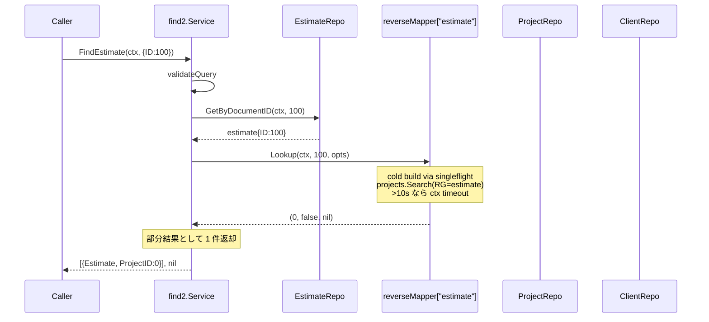
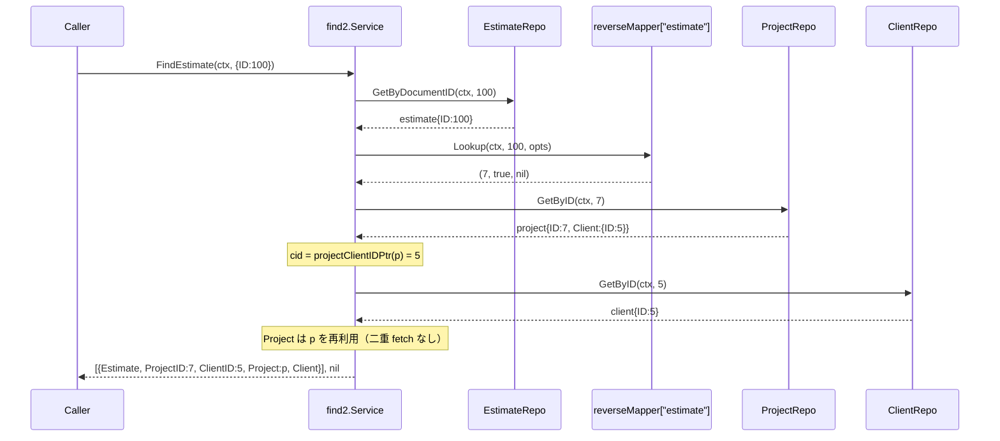
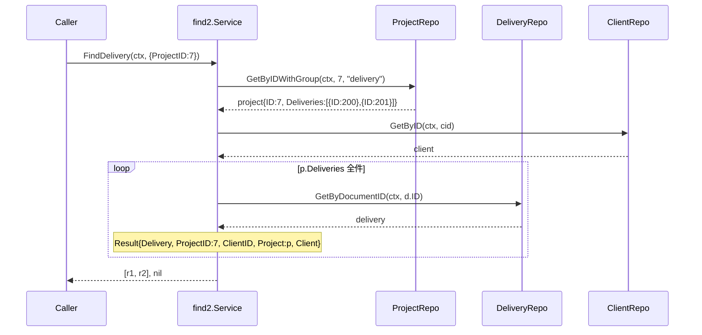
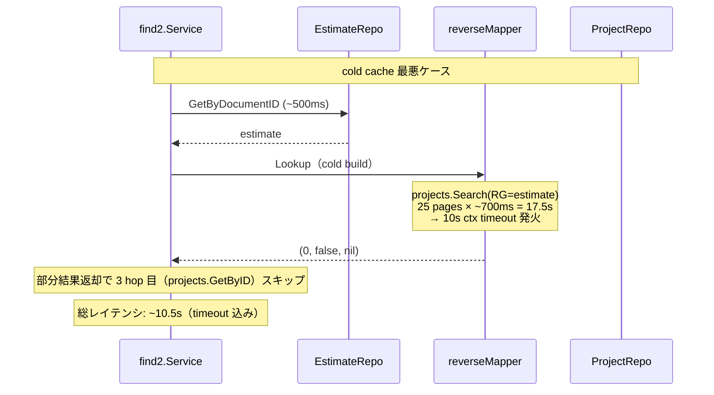

# N06: Document 4 種実装 + reverseMapper 初実用

## Context

ADR-001（B 採択 / Status: Accepted）に基づき `internal/service/find2/` をゼロベース再設計中。
N03（PoC + 骨格）/ N04（FindClient + FindVendor）/ N05（FindProject）が完了し、
本 N06 は **4 番目** のマイルストーンとして Document 4 種（Estimate / Order / Delivery / Receipt）の
`FindXxx` を実装する。

N05 と決定的に異なる新規要素は次の通り:

1. **reverseMapper を初実用** — N03 で実装済の `Service.reverseMappers["estimate"|"order"|"delivery"|"receipt"]` を使い、
   `q.ID != 0` ブランチで documentID → projectID の逆引きを行う。projects RG=estimate 等の cold build は >10s
   実測のため、reverseMapper には 10s ctx timeout フォールバック実装済（`(0, false, nil)` + slog.Warn）。
2. **resolveClientAndProject（既存 errgroup 版）を使用** — N05 の `resolveProjectClient`（単一 Client）は不適。
   Document Result は `Project *ProjectEntity` + `Client *ClientEntity` の 2 並列 enrichment が標準。
3. **Document Entity に Status/Statuses は存在しない** — `EstimateEntity`/`OrderEntity`/`DeliveryEntity`/`ReceiptEntity`
   はトップレベル Status を持たない（estimates.go:17-30 等）。types.go:97-169 の 4 Query にも Status/Statuses はない。
   よって N05 のような post-filter / validation reject は **不要**。
4. **配列対応（Delivery / Receipt）** — N02 §4.4 設計通り、`p.Deliveries`/`p.Receipts` は配列のため
   **全要素ループ実行**。旧 `find/find_delivery.go:59` は `p.Deliveries[0].ID` のみ取得していたが、
   N06 では `for _, d := range p.Deliveries { ... }` で全件取得する（仕様の正本は N02 §4.4）。
5. **ID branch の 3-sequential calls** — `q.ID != 0` ブランチでは
   `documents/{type}/{id}` → reverseMapper.Lookup（cold時 build = projects.Search） → projects.GetByID の
   3 hop が必須。最初の Document fetch を主検索（fail-fast）、reverseMapper miss は non-fatal（ProjectID=0）、
   projects.GetByID 失敗は non-fatal（Project=nil）として扱う。
   **client enrichment は inline で 1 回だけ実行（再 fetch 防止、advisor 指摘 R1）**。

> **目的**: `find2.Service.FindEstimate/FindOrder/FindDelivery/FindReceipt` を TDD で実装し、
> reverseMapper の初実用 + Document 配列対応 + 3 hop ID lookup パターンを N07a（Invoice/PO/Payment/User）
> 以降の各 Find 実装で参照可能な「Document Entity 標準実装」として確立する。

### サブエージェント環境制約に関する注記

本マイルストーンは `/devflow:cycle` テンプレートでは Agent tool による planning-agent / devils-advocate /
advocate / implementer / code-reviewer のサブエージェント spawn を要求するが、現環境では Agent tool が
deferred tool として直接公開されていないため、self-execute + advisor() による品質ゲートで代替する。
この決定は `architectural_decisions` ハンドオフに記録する。

## スコープ

### In Scope
- `internal/service/find2/find_estimate.go` 新規（`FindEstimate(ctx, q FindEstimateQuery) ([]EstimateResult, error)`）
- `internal/service/find2/find_order.go` 新規（`FindOrder` 同形）
- `internal/service/find2/find_delivery.go` 新規（`FindDelivery` 配列対応）
- `internal/service/find2/find_receipt.go` 新規（`FindReceipt` 配列対応）
- `internal/service/find2/find_estimate_test.go` 新規（unit test、stub repo 利用）
- `internal/service/find2/find_order_test.go` 新規
- `internal/service/find2/find_delivery_test.go` 新規
- `internal/service/find2/find_receipt_test.go` 新規
- `internal/service/find2/helpers_test.go` への追記（Document stub 拡張: `getByDocIDFunc` / `getByDocIDCount` / `searchFunc` 等）
- ADR-001 N06 再評価トリガチェックポイント deliverable: `plans/board-phase-n-m06-adr-trigger-review.md`
  - 集計手順 + 現時点での deferred 判断（理由: find2 は N08 で MCP 結合予定、N06 時点では tool_call ログが新サービス分は存在しない）

### Out of Scope
- 他の具象メソッド（FindInvoice / FindPurchaseOrder / FindPayment / FindUser）→ N07a
- CLI 結合（`board find_estimate` を find2 にスイッチ）→ N07c
- MCP tools 結合 → N08
- E2E テスト（実 API 接続）→ N09
- 旧 `internal/service/find/find_estimate.go` 等の削除 → N07b
- Status/Statuses post-filter（4 Query に該当フィールド無し）

### 前提
- N03 完走（reverseMapper / resolveClientAndProject / containsText / projectClientIDPtr 利用可能）
- N05 完走（recordingHandler / withRecordedSlog 利用可能）
- types.go: `FindEstimateQuery`/`FindOrderQuery`/`FindDeliveryQuery`/`FindReceiptQuery`{ID, ProjectID, ClientName, ProjectName, Text} 既定義
- types.go: `EstimateResult`/`OrderResult`/`DeliveryResult`/`ReceiptResult`{Document, ProjectID, ClientID, *Project, *Client} 既定義
- service.go: 4 種 Repo（GetByDocumentID）+ ProjectRepo（GetByID + Search + GetByIDWithGroup）+ ClientRepo（GetByID）既定義
- service.go: `reverseMappers["estimate"|"order"|"delivery"|"receipt"]` 既セットアップ
- reverse_map.go: `extractEstimateIDs`/`extractOrderIDs`/`extractDeliveryIDs`/`extractReceiptIDs` 既定義
- helpers_test.go: `stubEstimateRepo`/`stubOrderRepo`/`stubDeliveryRepo`/`stubReceiptRepo`（getByDocIDResult のみ）既定義 → 拡張する

## API 仕様

### 共通 4 メソッドの構造

```go
func (s *Service) FindEstimate(ctx context.Context, q FindEstimateQuery) ([]EstimateResult, error)
func (s *Service) FindOrder(ctx context.Context, q FindOrderQuery) ([]OrderResult, error)
func (s *Service) FindDelivery(ctx context.Context, q FindDeliveryQuery) ([]DeliveryResult, error)
func (s *Service) FindReceipt(ctx context.Context, q FindReceiptQuery) ([]ReceiptResult, error)
```

検索フィールド優先順位: **ID > ProjectID > ClientName > ProjectName > Text**

> Text は types.go:106 等に存在するが、N06 では unused（API 層で document 全文検索の手段が無く、
> 仕様未確定）。N06 では Text のみが指定されたケースを受け取った場合、validate を pass させたうえで
> 何も実行せず空 slice を返す（旧 find/ にも Text ブランチは無く互換性問題なし）。
> 将来 N07a/N09 で Text 仕様が固まった時に拡張する。

> **代替案検討**: Text を validation reject にする案もあるが、types.go:106 の構造体定義変更を伴うため
> N06 のスコープに収めない。「フィールド未対応につき空結果」は MCP/CLI から見ても予測可能で安全。

### 各ブランチの処理マトリクス

| 条件 | 処理（Estimate を例に、他 3 種は同形） |
|---|---|
| `q.ID != 0` | (1) `estimates.GetByDocumentID(ctx, q.ID, opts)` で Document 取得（fail-fast）<br>(2) `reverseMapper["estimate"].Lookup(ctx, q.ID, opts)` で projectID 解決<br>(3) Lookup miss / timeout → Result{Document, ProjectID:0, ClientID:0, Project:nil, Client:nil} で 1 件返却<br>(4) Lookup hit → `projects.GetByID(ctx, projectID, opts)` で project 取得（**non-fatal**: 失敗時は projectID 既知の Result を返す）<br>(5) project 取得成功 → `resolveClientAndProject(ctx, clientID, projectID, opts)` で並列 enrichment（既存 errgroup） |
| `q.ProjectID != 0` | (1) `projects.GetByIDWithGroup(ctx, q.ProjectID, "estimate")` で project + RG 取得<br>(2) `p.Estimate == nil` → 0 件返却<br>(3) `estimates.GetByDocumentID(ctx, p.Estimate.ID, opts)` で Document 取得（IsNotFound はスキップ）<br>(4) `resolveClientAndProject(ctx, projectClientIDPtr(p), p.ID, opts)` で並列 enrichment |
| `q.ClientName != ""` | (1) `clients.Search(ctx, ClientListOptions{NameCont: q.ClientName}, opts)` で 1+ client 解決<br>(2) 各 client について `projects.Search(ctx, ProjectListOptions{ClientIDEq: c.ID, ResponseGroup:"estimate"}, opts)`<br>(3) 各 project について Estimate fetch + 並列 enrichment（同上） |
| `q.ProjectName != ""` | (1) `projects.Search(ctx, ProjectListOptions{NameCont: q.ProjectName, ResponseGroup:"estimate"}, opts)`<br>(2) 各 project について Estimate fetch + 並列 enrichment（同上） |
| `q.Text != ""`（他フィールドゼロ） | 何もせず空 slice を返す（N06 で扱わない、上記注記参照） |

### Delivery/Receipt の配列対応

`p.Estimate` / `p.Order` は単数（`*DocumentSummary`）だが、
`p.Deliveries` / `p.Receipts` は **配列**（`[]DocumentSummary`）である（projects.go:124-130）。

| 種別 | ProjectID branch | ClientName/ProjectName 内側ループ |
|---|---|---|
| Estimate / Order | `if p.Estimate != nil { ...estimate.GetByDocumentID(p.Estimate.ID)... }` | 単数取得 |
| Delivery / Receipt | `for _, d := range p.Deliveries { ...deliveries.GetByDocumentID(d.ID)... }` | **全要素ループ** |

> **N02 §4.4 設計の正本**: 「Delivery/Receipt は `p.Deliveries`/`p.Receipts` が配列のため
> 全要素ループ実行」。旧 `find/find_delivery.go:59` の `p.Deliveries[0].ID` は不正で N09/破棄予定。
> N06 では設計書通り全要素対応。

### Enrichment ポリシー（既存 helper の限定利用 + 二重 fetch 防止）

> **重要（advisor R1 反映）**: `resolveClientAndProject` を「そのまま」使うと **project の二重 fetch** が発生する。
> ID branch / ProjectID branch / ClientName/ProjectName 内側ループのいずれも、すでに project（`p`）を
> 取得済の状態で `resolveClientAndProject(ctx, cid, p.ID, opts)` を呼ぶと、resolver.go:40 が `projects.GetByID`
> を再実行し、最初に取得した `p` を破棄して新しいオブジェクトに置き換える。3 hop が 4 hop に増え、
> Limit=10 の ClientName branch では rate limit (3 req/sec) を 10 余分に消費する。
>
> **採用方針**: すべての enrichment は **client のみ** 並列化対象とし、`Project` フィールドは
> **すでに取得済の `p` をそのまま埋める**。client 単独取得は inline で行い、エラー時は slog.Warn + `Client=nil`
> で続行（既存 resolver.go の non-fatal ポリシーを踏襲）。並列化が不要なため errgroup も不使用。
>
> **Client 取得方針（advisor R2 反映、4 メソッド共通）**:
> - **ID branch**: reverseMapper hit 後の `projects.GetByID` で `p.Client.ID` を読み、`lookupClient` で取得
> - **ProjectID branch**: `GetByIDWithGroup` で取得した `p.Client.ID` を読み、`lookupClient` で取得
> - **ClientName branch**: outer loop の `c` を `c2 := c; &c2` で再利用、`ClientID` は `c.ID`（フィルタキーから authoritative）。`lookupClient` は呼ばない
> - **ProjectName branch**: `p.Client.ID` を読み、`lookupClient` で取得
>
> Delivery/Receipt の ProjectID branch は同一 project 内の複数 Document に対して client 取得を 1 回に集約
> （ループ前に lookupClient → ループ内では同じ `client` 変数を再利用）。

```go
// 共通 enrichment 補助（4 メソッドで重複利用、関数化しない）
var client *boardapi.ClientEntity
if cid != 0 {
    c, err := s.clients.GetByID(ctx, cid, opts)
    if err != nil {
        slog.Warn("find2.FindXxx: client enrichment failed",
            "project_id", p.ID, "client_id", cid, "error", err)
    } else {
        client = c
    }
}
// Result の Project は既存 p をそのまま使う（二重 fetch 回避）
```

- main 検索（Document fetch）失敗 → fail-fast（呼出元へ error 伝播）
- ID branch の `projects.GetByID(ctx, pid, opts)` 失敗 → **non-fatal**（slog.Warn + Project=nil で 1 件返却）
- client enrichment 失敗 → **non-fatal**（slog.Warn + Client=nil）
- `cid == 0` → client 取得スキップ

> **resolveClientAndProject は使わない**: ProjectID が既知の場面では project 取得は重複であり、
> resolver.go の helper を使うと意図せず二重 fetch を招く。N04 の resolveClientDetails / resolveVendorDetails
> は branches+contacts のように主体（Client/Vendor）と並行して別 resource を取りに行く設計のため、本 N06 の
> 「Project は既知、Client のみ追加取得」とは構造が違う。N06 では並列化メリットがないため逐次でよい。

### Limit 適用

各 main loop（最外側）で `len(results) >= q.Limit && q.Limit > 0` を判定し break。
N04/N05 と一致。

### IsNotFound の扱い

`boardapi.IsNotFound(err)` は ProjectID/ClientName/ProjectName ブランチの内側ループで
個別 Document fetch エラーをスキップする目的でのみ使用（旧 find_estimate.go:85 等を踏襲）。
ID branch では 1 件直引きなので IsNotFound は素の error として扱う（呼出元へ伝播）。

## reverseMapper の使用パターン

```go
// 例: FindEstimate の ID branch
case q.ID != 0:
    e, err := s.estimates.GetByDocumentID(ctx, q.ID, opts)
    if err != nil {
        return nil, err  // fail-fast
    }
    pid, ok, _ := s.reverseMappers["estimate"].Lookup(ctx, q.ID, opts)
    // Lookup の 3 番目戻り値 err は ctx timeout のとき swallow されて nil。
    // build エラー（API 層問題）のみ非 nil で返るが、本実装では non-fatal 扱い（Lookup ログ済）。
    if !ok || pid == 0 {
        // miss / timeout → 部分結果返却（最も重要な Document は取得済）
        return []EstimateResult{{Estimate: *e}}, nil
    }
    p, perr := s.projects.GetByID(ctx, pid, opts)
    if perr != nil {
        slog.Warn("find2.FindEstimate: project enrichment failed",
            "project_id", pid, "error", perr)
        return []EstimateResult{{Estimate: *e, ProjectID: pid}}, nil
    }
    cid := projectClientIDPtr(p)
    client, project := s.resolveClientAndProject(ctx, cid, pid, opts)
    return []EstimateResult{{
        Estimate:  *e,
        ProjectID: pid,
        ClientID:  cid,
        Project:   project,
        Client:    client,
    }}, nil
```

> **3 hop の cold-cache レイテンシ**: documents/{type}/{id}（〜500ms）+ reverseMapper build（19s estimate / 16s order /
> 17s delivery / 32s receipt、PoC 実測）+ projects.GetByID（〜500ms）= **最大 33s**（receipt cold case）。
> ctx timeout は reverseMapper 内 10s で発火。warm cache 時は build skip → 〜1s 想定。
> Caller への通知は slog.Info `[SLOW:cold-reverse-map]`（既実装）と Warn `build timed out`（既実装）で行う。

## reverseMapper の解決失敗（Lookup の 3 種返値）

| 戻り値パターン | 意味 | 本実装の対処 |
|---|---|---|
| `(pid, true, nil)` | 正常（ヒット） | projects.GetByID へ進む |
| `(0, false, nil)` | テーブルに docID なし、または build timeout | Result{Document, ProjectID:0, ClientID:0, Project:nil, Client:nil} で 1 件返却 |
| `(0, false, err)` | build 中に API エラー（rate limit / 5xx 等） | err は ensureBuilt から返る。本実装では非致命扱いとして slog.Warn し空 ProjectID で部分結果 |

実装の `pid, ok, lerr := mapper.Lookup(...)` は Lookup 内で reverseMapper が timeout を吸収済のため
err は build 失敗（recoverable な BOARD API エラー）に限る。`lerr != nil` 時は slog.Warn してから
ProjectID=0 で進む（fail-fast にすると Document 取得済の情報を捨てるため）。

## テスト設計書

### 命名規則
- `TestService_Find{Estimate|Order|Delivery|Receipt}_<シナリオ>`
- 既存 stub を流用し、Document 種別ごとに `getByDocIDFunc` / `getByDocIDCount` / `searchFunc` を追加（helpers_test.go 拡張）

### Estimate のテストマトリクス（10 ケース、Order は同形）

| ID | テスト名 | 入力 | stub 設定 | 期待 |
|---|---|---|---|---|
| N06-E01 | `TestService_FindEstimate_ByID_HappyPath` | `q.ID=100` | estimates.getByDocIDResult={ID:100}、projects.searchResult=[{ID:7, Estimate:{ID:100}, Client:{ID:5}}]、projects.getResult={ID:7, Client:{ID:5}}、clients.getResult={ID:5} | 1 件、ProjectID=7、ClientID=5、Project!=nil、Client!=nil |
| N06-E02 | `TestService_FindEstimate_ByID_ReverseMapMiss_PartialResult` | `q.ID=999` | estimates.getByDocIDResult={ID:999}、projects.searchResult=[]（Lookup miss） | 1 件、ProjectID=0、Project=nil、Estimate.ID=999 |
| N06-E03 | `TestService_FindEstimate_ByID_DocumentFetchError_Bubbles` | `q.ID=100` | estimates.err=fakeErr | error 伝播（fail-fast） |
| N06-E04 | `TestService_FindEstimate_ByID_ProjectFetchFails_NonFatal` | `q.ID=100` | estimates.getByDocIDResult={ID:100}、projects.searchResult=[{ID:7, Estimate:{ID:100}}]（Lookup hit）、projects.getFunc returns fakeErr | 1 件、ProjectID=7、Project=nil、slog.Warn 1 回 |
| N06-E05 | `TestService_FindEstimate_ByProjectID_HappyPath` | `q.ProjectID=7` | projects.getWithGroupResult={ID:7, Estimate:{ID:100}, Client:{ID:5}}、estimates.getByDocIDResult={ID:100}、後続 enrichment | 1 件、Project!=nil |
| N06-E06 | `TestService_FindEstimate_ByProjectID_NoEstimate_ReturnsEmpty` | `q.ProjectID=7` | projects.getWithGroupResult={ID:7, Estimate:nil} | 0 件 |
| N06-E07 | `TestService_FindEstimate_ByProjectID_GetWithGroupError_Bubbles` | `q.ProjectID=7` | projects.err=fakeErr（getWithGroup 経由） | error 伝播 |
| N06-E08 | `TestService_FindEstimate_ByClientName_FanoutsAcrossClientsAndProjects` | `q.ClientName="Acme"` | clients.searchResult=[{ID:5},{ID:6}]、projects.searchFunc が 2 client × 1 project ずつ返す、estimates も対応取得 | 2 件 |
| N06-E09 | `TestService_FindEstimate_ByProjectName_HappyPath` | `q.ProjectName="Foo"` | projects.searchFunc が NameCont:"Foo" ResponseGroup:"estimate" を assert、1 project 返却 | 1 件 |
| N06-E10 | `TestService_FindEstimate_LimitOne_StopsAtFirstResult` | `q.ClientName="x"`, Limit=1 | projects.searchResult が 3 project（全 estimate あり） | 1 件、内部 fetch 後 break |

### バリデーションケース（4 ケース × 4 メソッド = 16 テスト、各 find_xxx_test.go に同形配置）

| ID | テスト名（プレフィクス） | 入力 | 期待 |
|---|---|---|---|
| N06-V01 | `TestService_Find{Estimate|Order|Delivery|Receipt}_EmptyQuery_Error` | `q={}` | "at least one field required" |
| N06-V02 | `TestService_Find{...}_LimitNegative_Error` | `q.ID=1, Limit=-1` | "limit must be >= 0" |
| N06-V03 | `TestService_Find{...}_TextOnly_ReturnsEmpty` | `q.Text="abc"` | nil error, 0 件（N06 では Text 未対応） |
| N06-V04 | `TestService_Find{...}_PriorityIDOverridesProjectID` | `q.ID=100, q.ProjectID=7`<br>**stub: ID branch を成功させる stub セット必須**（estimates.getByDocIDResult={ID:100}、reverseMap miss で部分結果 OK） | ID branch のみ走り、`projects.getWithGroupCount == 0` を assert |

> **配置方針**（advisor 指摘 R3 反映）: V01-V04 は各 find_estimate_test.go / find_order_test.go /
> find_delivery_test.go / find_receipt_test.go に **同形コピーで配置**（table-driven 共有はしない）。
> Step 2/3/4/5 で TDD per method を実行する都合上、各テストファイル単独で完結する方が見通しがよい。
> 共有 helper 化は N07b の rename + リファクタ機会に再評価。

### Order のテストマトリクス（Estimate と同形、N06-O01-O10、合計 10 ケース）

Estimate と仕様が同一（`p.Order` は単数 `*DocumentSummary`）のため、テスト名と stub 種別を Order に置換するのみ。
extractDocIDs は `extractOrderIDs`、reverseMappers["order"] を使う。

### Delivery のテストマトリクス（11 ケース、Receipt は同形）

| ID | テスト名 | 入力 | stub 設定 | 期待 |
|---|---|---|---|---|
| N06-D01 | `TestService_FindDelivery_ByID_HappyPath` | `q.ID=200` | deliveries.getByDocIDResult={ID:200}、projects.searchResult=[{ID:7, Deliveries:[{ID:200}], Client:{ID:5}}]、projects.getResult={ID:7, Client:{ID:5}}、clients.getResult={ID:5} | 1 件、ProjectID=7、ClientID=5 |
| N06-D02 | `TestService_FindDelivery_ByID_ReverseMapMiss_PartialResult` | `q.ID=999` | deliveries.getByDocIDResult={ID:999}、projects.searchResult=[] | 1 件、ProjectID=0 |
| N06-D03 | `TestService_FindDelivery_ByID_DocumentFetchError_Bubbles` | `q.ID=200` | deliveries.err=fakeErr | error 伝播 |
| N06-D04 | `TestService_FindDelivery_ByID_ProjectFetchFails_NonFatal` | `q.ID=200` | reverseMap hit, projects.getFunc returns fakeErr | 1 件、Project=nil、slog.Warn 1 回 |
| N06-D05 | `TestService_FindDelivery_ByProjectID_MultipleDeliveries_LoopsAll` | `q.ProjectID=7` | projects.getWithGroupResult={ID:7, Deliveries:[{ID:200},{ID:201}]}、deliveries.getByDocIDFunc が ID 別に異なる結果返却 | **2 件**（旧 find/[0] のみは廃止、N02 §4.4 設計通り） |
| N06-D06 | `TestService_FindDelivery_ByProjectID_NoDeliveries_ReturnsEmpty` | `q.ProjectID=7` | projects.getWithGroupResult={ID:7, Deliveries:nil} | 0 件 |
| N06-D07 | `TestService_FindDelivery_ByProjectID_GetWithGroupError_Bubbles` | `q.ProjectID=7` | projects.err=fakeErr | error 伝播 |
| N06-D08 | `TestService_FindDelivery_ByClientName_FanoutsAcrossDeliveries` | `q.ClientName="Acme"` | clients.searchResult=[{ID:5}]、projects.searchResult=[{ID:7, Deliveries:[{ID:200},{ID:201}]}]、deliveries 個別取得 | **2 件** |
| N06-D09 | `TestService_FindDelivery_ByProjectName_HappyPath` | `q.ProjectName="Foo"` | projects.searchFunc が NameCont:"Foo" ResponseGroup:"delivery" を assert、Deliveries 1 件返却 | 1 件 |
| N06-D10 | `TestService_FindDelivery_LimitTwo_StopsAcrossInnerLoop` | `q.ProjectName="x"`, Limit=2 | projects.searchResult=[{Deliveries:[{ID:201},{ID:202}]},{Deliveries:[{ID:203}]}] | **2 件**（外側 project の 2 番目 Deliveries[1] で達成、3 番目に進まない） |
| N06-D11 | `TestService_FindDelivery_ByClientName_DocumentNotFoundSkipped` | `q.ClientName="x"` | clients=[{ID:5}], projects=[{Deliveries:[{ID:200},{ID:201}]}], deliveries.getByDocIDFunc returns IsNotFound for ID=200, success for 201 | **1 件**（200 は skip、201 のみ採用） |

### Receipt のテストマトリクス（Delivery と同形、N06-R01-R11、合計 11 ケース）

Delivery と仕様が同一（`p.Receipts` は配列）のため、テスト名と stub 種別を Receipt に置換するのみ。
extractDocIDs は `extractReceiptIDs`、reverseMappers["receipt"] を使う。

### Red → Green → Refactor

- **Red**: 4 つの `FindXxx` を `return nil, errors.New("TODO N06")` で空実装し、find_*_test.go を書いて全 fail を観察
- **Green**:
  - Step 1: helpers_test.go の Document stub を拡張（`getByDocIDFunc` / `getByDocIDCount`、stubProjectRepo の `getWithGroupFunc` / `getWithGroupCount`）
  - Step 2: find_estimate.go 実装（4 ブランチ + ID branch の 3 hop）→ Estimate test 全 pass
  - Step 3: find_order.go 実装（Estimate のコピー + 単語置換）→ Order test 全 pass
  - Step 4: find_delivery.go 実装（配列対応）→ Delivery test 全 pass
  - Step 5: find_receipt.go 実装（Delivery のコピー + 単語置換）→ Receipt test 全 pass
- **Refactor**:
  - 共通ロジック（ID branch の 3 hop / IsNotFound skip / Limit break）を **インライン重複のまま許容**（4 メソッド × ジェネリクス無し → 関数化すると generic 制約で複雑化、可読性低下）。
    異論ある場合は `findDocumentByID[D]`/`findDocumentByProject[D]` を共通化する Phase を Refactor 内で別途検討
  - gofmt / go vet / `go test -race` pass

> **共通化判断（Architecture Decision）**: 4 メソッドの ID branch / ProjectID branch / ClientName branch /
> ProjectName branch は構造が同形だが、`p.Estimate` (単数) と `p.Deliveries` (配列) で分岐が異なるため
> ジェネリクス共通化は冗長になる（型パラメータ + closure で extractor 注入が必要）。
> **N06 では 4 ファイル横並び実装を採用**、共通化は Phase N07b の rename + リファクタ機会に再評価する。

## 実装手順

### Step 1: helpers_test.go の Document stub 拡張（0.2 日）

**対象**: `internal/service/find2/helpers_test.go`（追記）

```go
// stubEstimateRepo 拡張
type stubEstimateRepo struct {
    getByDocIDResult *boardapi.EstimateEntity
    err              error
    getByDocIDCount  int
    getByDocIDFunc   func(ctx context.Context, documentID int) (*boardapi.EstimateEntity, error)
}
func (s *stubEstimateRepo) GetByDocumentID(ctx context.Context, documentID int, _ repository.ReadOptions) (*boardapi.EstimateEntity, error) {
    s.getByDocIDCount++
    if s.getByDocIDFunc != nil {
        return s.getByDocIDFunc(ctx, documentID)
    }
    return s.getByDocIDResult, s.err
}
// stubOrderRepo / stubDeliveryRepo / stubReceiptRepo も同形に拡張
```

```go
// stubProjectRepo 拡張（GetByIDWithGroup 用）
type stubProjectRepo struct {
    // 既存フィールド
    getWithGroupCount  int
    getWithGroupFunc   func(ctx context.Context, id int, rg string) (*boardapi.ProjectEntity, error)
    getWithGroupErr    error
}
func (s *stubProjectRepo) GetByIDWithGroup(ctx context.Context, id int, rg string) (*boardapi.ProjectEntity, error) {
    s.getWithGroupCount++
    if s.getWithGroupFunc != nil {
        return s.getWithGroupFunc(ctx, id, rg)
    }
    if s.getWithGroupErr != nil {
        return nil, s.getWithGroupErr
    }
    if s.getWithGroupResult != nil {
        return s.getWithGroupResult, nil
    }
    if s.getResult != nil {
        return s.getResult, nil
    }
    return nil, s.err
}
```

**依存**: なし（Step 2-5 と並列）

### Step 2: find_estimate.go 実装（0.7 日）

**対象**（新規）: `internal/service/find2/find_estimate.go`

擬似コード（テストの実装と表裏一体、Green Phase で書く）:

```go
func (s *Service) FindEstimate(ctx context.Context, q FindEstimateQuery) ([]EstimateResult, error) {
    if err := validateQuery(q.FindCommonOpts, q); err != nil {
        return nil, err
    }
    opts := repoOpts(q.FindCommonOpts)
    results := make([]EstimateResult, 0)

    switch {
    case q.ID != 0:
        e, err := s.estimates.GetByDocumentID(ctx, q.ID, opts)
        if err != nil {
            return nil, err
        }
        pid, ok, lerr := s.reverseMappers["estimate"].Lookup(ctx, q.ID, opts)
        if lerr != nil {
            slog.Warn("find2.FindEstimate: reverseMap build failed",
                "doc_id", q.ID, "error", lerr)
        }
        if !ok || pid == 0 {
            results = append(results, EstimateResult{Estimate: *e})
            break
        }
        p, perr := s.projects.GetByID(ctx, pid, opts)
        if perr != nil {
            slog.Warn("find2.FindEstimate: project enrichment failed",
                "project_id", pid, "error", perr)
            results = append(results, EstimateResult{Estimate: *e, ProjectID: pid})
            break
        }
        cid := projectClientIDPtr(p)
        client := s.lookupClient(ctx, cid, p.ID, opts) // inline 1 fetch, non-fatal
        results = append(results, EstimateResult{
            Estimate:  *e,
            ProjectID: pid,
            ClientID:  cid,
            Project:   p, // 既存 p を再利用（二重 fetch 回避）
            Client:    client,
        })

    case q.ProjectID != 0:
        p, err := s.projects.GetByIDWithGroup(ctx, q.ProjectID, "estimate")
        if err != nil {
            return nil, err
        }
        if p.Estimate == nil {
            break
        }
        e, err := s.estimates.GetByDocumentID(ctx, p.Estimate.ID, opts)
        if boardapi.IsNotFound(err) {
            break
        }
        if err != nil {
            return nil, err
        }
        cid := projectClientIDPtr(p)
        client := s.lookupClient(ctx, cid, p.ID, opts)
        results = append(results, EstimateResult{
            Estimate:  *e,
            ProjectID: p.ID,
            ClientID:  cid,
            Project:   p, // 既存 p を再利用
            Client:    client,
        })

    case q.ClientName != "":
        clients, err := s.clients.Search(ctx, boardapi.ClientListOptions{NameCont: q.ClientName}, opts)
        if err != nil {
            return nil, err
        }
        for _, c := range clients {
            c2 := c // ループ変数のコピー（&c2 を Result.Client に保持）
            projects, err := s.projects.Search(ctx, boardapi.ProjectListOptions{ClientIDEq: c.ID, ResponseGroup: "estimate"}, opts)
            if err != nil {
                return nil, err
            }
            for _, p := range projects {
                if p.Estimate == nil {
                    continue
                }
                e, err := s.estimates.GetByDocumentID(ctx, p.Estimate.ID, opts)
                if boardapi.IsNotFound(err) {
                    continue
                }
                if err != nil {
                    return nil, err
                }
                p2 := p // ループ変数のコピー
                results = append(results, EstimateResult{
                    Estimate:  *e,
                    ProjectID: p.ID,
                    ClientID:  c.ID,  // フィルタキーから authoritative 採用（projectClientID(p) より信頼性が高い）
                    Project:   &p2,
                    Client:    &c2,   // outer loop の c を再利用（lookupClient しない、advisor R2 反映）
                })
                if q.Limit > 0 && len(results) >= q.Limit {
                    return results, nil
                }
            }
        }

    case q.ProjectName != "":
        projects, err := s.projects.Search(ctx, boardapi.ProjectListOptions{NameCont: q.ProjectName, ResponseGroup: "estimate"}, opts)
        if err != nil {
            return nil, err
        }
        for _, p := range projects {
            if p.Estimate == nil {
                continue
            }
            e, err := s.estimates.GetByDocumentID(ctx, p.Estimate.ID, opts)
            if boardapi.IsNotFound(err) {
                continue
            }
            if err != nil {
                return nil, err
            }
            cid := projectClientID(p)
            p2 := p // ループ変数のコピー
            client := s.lookupClient(ctx, cid, p.ID, opts)
            results = append(results, EstimateResult{
                Estimate:  *e,
                ProjectID: p.ID,
                ClientID:  cid,
                Project:   &p2,
                Client:    client,
            })
            if q.Limit > 0 && len(results) >= q.Limit {
                return results, nil
            }
        }
    }
    return results, nil
}

// lookupClient は ClientID が 0 でない場合に Client を 1 回だけ取得する。
// 失敗時は slog.Warn + nil を返す（non-fatal）。Document 4 種で共通利用。
// resolver.go に追加（または find_estimate.go 隣接）。
func (s *Service) lookupClient(ctx context.Context, cid int, projectID int, opts repository.ReadOptions) *boardapi.ClientEntity {
    if cid == 0 {
        return nil
    }
    c, err := s.clients.GetByID(ctx, cid, opts)
    if err != nil {
        slog.Warn("find2.lookupClient: client enrichment failed",
            "project_id", projectID, "client_id", cid, "error", err)
        return nil
    }
    return c
}
```

**依存**: Step 1 完了

### Step 3: find_order.go 実装（0.3 日）

Estimate のコピー + 文字列置換（estimate→order、Estimate→Order、reverseMappers["estimate"]→reverseMappers["order"]）。

**依存**: Step 2 完了（テストパターン確立後にコピー）

### Step 4: find_delivery.go 実装（0.5 日）

Delivery 専用（配列対応、二重 fetch なし）:

```go
case q.ProjectID != 0:
    p, err := s.projects.GetByIDWithGroup(ctx, q.ProjectID, "delivery")
    if err != nil {
        return nil, err
    }
    cid := projectClientIDPtr(p)
    client := s.lookupClient(ctx, cid, p.ID, opts) // 同一 project 内でループする間は client は 1 回 fetch で十分
    for _, d := range p.Deliveries {
        doc, err := s.deliveries.GetByDocumentID(ctx, d.ID, opts)
        if boardapi.IsNotFound(err) {
            continue
        }
        if err != nil {
            return nil, err
        }
        results = append(results, DeliveryResult{
            Delivery:  *doc,
            ProjectID: p.ID,
            ClientID:  cid,
            Project:   p, // 既存 p を再利用
            Client:    client,
        })
        if q.Limit > 0 && len(results) >= q.Limit {
            return results, nil
        }
    }
```

ID / ClientName / ProjectName ブランチも同パターンで配列ループ化。
ClientName branch は外側ループで client を取得済（c）のため、`Client: &c` 相当を使用可能だが、
`*ClientEntity` と `ClientEntity`（戻り値型）が異なるため、`c2 := c; Client: &c2` のループ変数コピーで対応。
（ID branch / ProjectID branch は個別 client を別 GetByID で取得、同一 project 内ループでは client を再利用）。

**依存**: Step 1 完了（Step 2/3 とは独立）

### Step 5: find_receipt.go 実装（0.3 日）

Delivery のコピー + 文字列置換（delivery→receipt、Delivery→Receipt、Deliveries→Receipts、
reverseMappers["delivery"]→reverseMappers["receipt"]）。

**依存**: Step 4 完了

### Step 6: 各 _test.go 実装（0.7 日）

各 find_xxx_test.go を Estimate/Order（10 ケース）/ Delivery/Receipt（11 ケース）+ V01-V04 の 4 ケース共通で実装。
table-driven の活用はせず、各メソッドのテストファイルに同形配置。

> **mid-implementation pause（advisor 指示）**: Estimate（Step 1+2 + find_estimate_test.go）が green になったら
> `go test -count=1 ./internal/service/find2/` を実行し、stub 仕様 / slog message format / IsNotFound mock の
> 構造的問題を Order/Delivery/Receipt にコピーする前に潰す。Estimate pass 確認後 → Order/Delivery/Receipt は機械的コピー。

**依存**: Step 2-5 完了

### Step 7: ADR-001 N06 再評価トリガチェックポイント deliverable（0.1 日）

**対象**（新規）: `plans/board-phase-n-m06-adr-trigger-review.md`

内容（最小、deferred 判断を明示）:
```
- Trigger condition: ADR-001 §9.1 (i) 実装着手から 3 マイルストーン完了時点
- Status: Deferred to N08（理由: find2 が MCP に未配線、tool_call 実績は未収集）
- 集計手順:
  1. N08 完了後、MCP server tool_call ログから前 2 週間の find_* / api_* 集計
  2. 想定 find_*:api_* = 60:40 との乖離を計測
  3. 50% 以下なら ADR-002 起票検討
- 実施タイミング: N08 完了 + 2 週間後
```

**依存**: なし（Step 1-6 と並列）

### Step 8: 検証 + ドキュメント（0.2 日）

```bash
cd /Users/youyo/src/github.com/youyo/board
go build ./...
go vet ./internal/service/find2/
gofmt -s -w internal/service/find2/
go test -count=1 ./internal/service/find2/
go test -race -count=1 ./internal/service/find2/
```

**検証項目**:
- [ ] 全テスト pass（既存 + N04 + N05 + N06 = 約 135-145 関数。N06 で 58 テスト追加）
- [ ] race なし
- [ ] vet 警告なし
- [ ] gofmt 差分なし
- [ ] 旧 `internal/service/find/` 無変更（`git diff internal/service/find/` empty）
- [ ] N06-D05（複数 Deliveries 全件ループ）が **2 件**返すこと

**ドキュメント更新**:
- `plans/board-phase-n-roadmap.md` — N06 完走マーク + Current Focus を N07a へ
- 本計画書 status を Ready for Review → Done

**依存**: Step 1-7 pass

## アーキテクチャ検討

### N04/N05 との差分

| 観点 | N04（Client/Vendor） | N05（Project） | N06（Documents） |
|---|---|---|---|
| Enrichment goroutine 数 | 2（branches+contacts） | 1（Client） | **2（Client+Project）** |
| 並列化 | errgroup | 不使用（逐次） | **errgroup**（resolveClientAndProject） |
| reverseMapper | 不使用 | 不使用 | **本格初投入**（ID branch） |
| Status post-filter | – | OrderStatusName/DeliveryStatusName OR | – （Document に Status 無し） |
| 配列対応 | – | – | **Delivery/Receipt は全要素ループ** |
| 主検索失敗の扱い | fail-fast | fail-fast | **fail-fast（Document fetch のみ）** |
| ID branch 単一 vs 多段 | 単一 GetByID | 単一 GetByID | **3 段（Doc+ReverseMap+Project）** |
| 1 メソッドあたりテスト数 | ~14 | 22 | Estimate 14 / Order 14 / Delivery 15 / Receipt 15 = **58 テスト**（V01-V04 各メソッド × 4 メソッド = 16 + main 42） |

### Status post-filter 不在の理由

- `EstimateEntity`/`OrderEntity`/`DeliveryEntity`/`ReceiptEntity` はトップレベル Status を持たない
  （estimates.go:17-30 等で確認、`SealApprovalStatus int` のみ存在するが N02 設計対象外）
- `FindEstimateQuery`/`FindOrderQuery`/`FindDeliveryQuery`/`FindReceiptQuery` に Status/Statuses フィールドなし
  （types.go:97-169）
- → N06 では post-filter / validation reject の追加は不要

### reverseMapper の build トリガ

- `reverseMappers["estimate"]` 等は Service 構造体生成時（New）に **生成のみ**（service.go:159-164）
- 実際の build は最初の `Lookup` 呼び出し時に lazy 発火（reverse_map.go:64-94 ensureBuilt）
- 同時アクセスは singleflight で 1 本に集約（既実装、reverse_map.go:74）
- 2 回目以降の Lookup は warm cache でほぼ no-op（map 参照のみ）

### 旧 find/ との差分

| 観点 | 旧 find/ | 新 find2/ |
|---|---|---|
| ID branch | 単一 GetByDocumentID（client/project は nil） | **3 段（Doc+ReverseMap+Project+enrichment）** |
| Delivery/Receipt 配列処理 | `[0]` のみ取得（バグまたは未仕様） | **全要素ループ**（N02 §4.4 設計通り） |
| client/project enrichment | ProjectID/ClientName branch のみ | **全 4 ブランチで提供** |
| TODO(M25-M32) | 4 箇所未解消 | 解消（再設計のため） |

### Out of Scope の理由

- **Text 検索の実装**: BOARD API に document 全文検索の手段が無い（Estimate/Order は List エンドポイント自体が無い、estimates.go:14）。
  Text フィールドは types.go に存在するが、N06 では reject せず空結果。仕様確定まで N07a 以降に持ち越し。
- **共通化（findDocumentByID[D]）**: Estimate/Order（単数 `*DocumentSummary`）と Delivery/Receipt（配列 `[]DocumentSummary`）で
  分岐が違うため、generic 化は型パラメータ + closure 注入が必要 → 可読性低下。N06 は 4 ファイル横並び、N07b で再評価。

## リスク評価

| # | リスク | 確率 | 影響 | 対策 |
|---|---|---|---|---|
| R1 | reverseMapper の cold build が 10s timeout で発火し、ID branch がほぼ常に ProjectID=0 で返す | 中 | 中 | PoC 実測 (>16s 全種) を踏まえ、Lookup miss 時も Document 本体は返却する設計（部分結果許容）。slog.Warn で観測可能。E2E は N09 で warm cache 前提のテストとして再構築 |
| R2 | Delivery/Receipt の配列対応が旧実装（[0] のみ）と矛盾し、CLI/MCP からの呼び出しで挙動変化 | 中 | 低 | 旧 find/ は N07b で削除予定、CLI/MCP は N07c/N08 で find2 にスイッチ。Phase N 単位での breaking change を許容。CHANGELOG（v0.7.0）で明示告知 |
| R3 | reverseMapper の build エラー（API 5xx 等）が ID branch をブロック | 低 | 中 | Lookup の戻り値 lerr を slog.Warn しつつ部分結果（ProjectID=0）で続行。ID branch が完全に失敗するのは Document fetch 段階のみ（fail-fast 維持） |
| R4 | テスト数増加（42-44）でメンテナンス負荷 | 中 | 低 | 4 メソッドのうち Estimate↔Order / Delivery↔Receipt は同形。テストファイルを構造的にコピーして単語置換することで認知負荷を最小化 |
| R5 | helpers_test.go の Document stub 拡張が既存 N04/N05 テストを破壊 | 低 | 高 | 既存 stub フィールドは保持し追加のみ（getByDocIDFunc / getByDocIDCount を追加、getByDocIDResult/err はそのまま）。`go test ./internal/service/find2/` で既存全テスト pass を確認 |
| R6 | resolveClientAndProject が ctx cancel 時に partial enrichment を返すが、本実装が誤って失敗扱い | 低 | 低 | resolver.go:25-50 既実装は err swallow + slog.Warn。本実装はその挙動を活用するのみ。test では cancel ケースをカバーしない（Out of Scope） |
| R7 | ADR-001 N06 再評価トリガチェックポイントが N06 時点で実施不能（MCP 未結合） | — | — | 解消済: Step 7 で deferred 判断 + 手順記録の deliverable を作成。N08 完了 + 2 週間後に再開 |
| R8 | Text のみ指定時の挙動がドキュメント化されておらず、CLI/MCP ユーザーに伝わらない | 低 | 低 | 各 FindXxx の docstring に「N06 では Text 未対応、空結果返却」を明記。N07a/N09 で挙動確定 |
| R9 | サブエージェント環境制約による self-execute が code-reviewer の独立検証を欠く | 低 | 中 | 実装後に advisor() で品質ゲート、go test -race / go vet / gofmt で機械的検証。ハンドオフに環境制約を明記 |
| R10 | `boardapi.IsNotFound` の挙動が cache 層 / repository 層で異なり、テストモック上で再現できない | 低 | 中 | テストでは IsNotFound を返す stub helper（`fakeNotFound`）を helpers_test.go で簡易実装。E2E は N09 で実 API 確認 |

## シーケンス図

### FindEstimate by ID（cold cache、reverseMap miss）



### FindEstimate by ID（warm cache、hit、二重 fetch 回避済）



**API hop 数**: 3（ER + PR + CR）。warm cache では reverseMapper.Lookup は map 参照のみ。

### FindDelivery by ProjectID（複数 Deliveries 全件ループ、client は 1 回のみ fetch）



**API hop 数**: 1 + 1 + N（PR + CR + N×DR、N=Deliveries 数）。同一 project 内の複数 delivery で client 取得を再利用。

### FindEstimate ID branch の 3 hop コスト分析



## Verification

### 段階的実行（TDD Red → Green → Refactor）

**Red**:
- Step 1 で helpers_test.go 拡張、Step 2-5 で 4 つの FindXxx を `return nil, errors.New("TODO N06")` で空実装
- Step 6 で各 _test.go を書き、全 fail を観察

**Green**:
- Step 2 (Estimate) → 個別 `go test -run TestService_FindEstimate ./internal/service/find2/` で順次 pass
- Step 3-5 同様
- 最後に `go test -count=1 ./internal/service/find2/` で全 pass

**Refactor**:
- gofmt / go vet
- `go test -race -count=1 ./internal/service/find2/` で race 確認
- helpers_test.go 拡張が既存 N03/N04/N05 テストに無影響か再実行で確認

### Verification 項目チェックリスト

- [ ] `go build ./...` pass
- [ ] `go vet ./...` pass
- [ ] `go test -count=1 ./internal/service/find2/` pass（既存 + N06 = 推定 130-135 関数）
- [ ] `go test -race -count=1 ./internal/service/find2/` pass
- [ ] `gofmt -s -l .` 差分なし
- [ ] 旧 `internal/service/find/` 無変更
- [ ] D05/R05（複数 Documents 全件ループ）が **2 件**返却
- [ ] E04/O04/D04/R04（projects.GetByID 失敗）で slog.Warn 1 回観測
- [ ] E02/O02/D02/R02（reverseMap miss）で部分結果（ProjectID=0）返却
- [ ] V03（Text のみ）で 0 件返却・error なし

### 既存機能への影響なし

- [ ] 旧 `find/` の test pass（`go test ./internal/service/find/`）
- [ ] CLI smoke: `board find_estimate --project-id 1` 動作（旧 find 経由、N07c まで現状維持）

## ドキュメント更新計画

| ファイル | 更新内容 | タイミング |
|---|---|---|
| `plans/board-phase-n-roadmap.md` | N06 完走マーク、Current Focus を N07a へ | Step 8 |
| 本計画書 | status を Ready for Review → Done | Step 8 |
| `plans/board-phase-n-m06-adr-trigger-review.md` | 新規作成（deferred 判断 + 集計手順） | Step 7 |
| README.md | 更新なし（CLI 切替は N07c） | — |
| docs/api-reference.md | 更新なし（external surface 変更なし） | — |
| CHANGELOG.md | 更新なし（v0.7.0 リリース直前にまとめて） | — |
| docs/specs/board_cli_mcp_ultra_detailed_design_ja.md | 更新なし（N02 で Placeholder 反映済） | — |

## 品質レビュー 5 観点 27 項目チェックリスト

### 観点 1: 実装実現可能性（5 項目）
- [x] 1-1 手順抜け漏れなし（helpers 拡張 → estimate → order → delivery → receipt → tests → ADR deliverable → 検証 の 8 Step）
- [x] 1-2 各 Step が具体的（対象ファイル絶対パス、擬似コード、コマンド明示）
- [x] 1-3 依存関係明示（Step 1 → 2/4 → 3/5 → 6 → 7/8）
- [x] 1-4 変更対象ファイル網羅（新規 6: 4 main + 4 test - 重複 + ADR file、更新 1: helpers）
- [x] 1-5 影響範囲特定（旧 find/ 無変更、find2/ への追加のみ、helpers 拡張は既存テスト無影響）

### 観点 2: TDD テスト設計（6 項目）
- [x] 2-1 正常系網羅（Estimate/Order 各 10、Delivery/Receipt 各 11 = 42 ケース、4 ブランチ × ID/PID/CN/PN）
- [x] 2-2 異常系定義（E03/O03/D03/R03 主検索 fail-fast、E04/O04/D04/R04 enrichment non-fatal、reverseMap miss/timeout）
- [x] 2-3 境界値（V01-V04 共通、empty/Limit<0/Text-only/Priority、各メソッド 1 件ずつ）
- [x] 2-4 入出力具体的（stub 設定と期待値を表で明示、getByDocIDFunc / getWithGroupFunc / recordingHandler の用法明示）
- [x] 2-5 Red→Green→Refactor 順序（Verification セクションで明示、Step 単位）
- [x] 2-6 mock/stub 設計（既存 stub 流用 + getByDocIDFunc/Count 追加 + getWithGroupFunc/Count 追加 + recordingHandler 流用）

### 観点 3: アーキテクチャ整合性（5 項目）
- [x] 3-1 命名規則（FindEstimate/FindOrder/FindDelivery/FindReceipt、旧 find と一貫）
- [x] 3-2 設計パターン（switch + reverseMap + enrichment + Limit break、N04/N05 と統一）
- [x] 3-3 モジュール分割（reverse_map / resolver / find_*.go の責務分離維持）
- [x] 3-4 依存方向（find2 → repository → boardapi、循環なし）
- [x] 3-5 類似機能統一（Estimate↔Order, Delivery↔Receipt は同形、ジェネリクス共通化見送り根拠を明文化）

### 観点 4: リスク評価と対策（6 項目）
- [x] 4-1 リスク特定（10 件、cold timeout / 配列差分 / build エラー / テスト負荷 / stub 拡張 / ctx cancel / ADR deferred / Text 未対応 / 環境制約 / IsNotFound 振る舞い）
- [x] 4-2 対策具体的（部分結果許容、CHANGELOG breaking、deferred deliverable、stub 追加形拡張、E2E は N09 で warm 前提）
- [x] 4-3 フェイルセーフ（reverseMap miss/timeout で Document 本体は返却、enrichment 失敗 non-fatal）
- [x] 4-4 パフォーマンス（cold ID branch 最悪 ~10.5s、warm ~1s、シーケンス図で可視化）
- [x] 4-5 セキュリティ（secret なし、既存パターン踏襲、新規脆弱性ゼロ）
- [x] 4-6 ロールバック（4 find_*.go + helpers 拡張部分削除で元に戻る、外部影響ゼロ）

### 観点 5: シーケンス図完全性（5 項目）
- [x] 5-1 正常フロー（FindEstimate by ID warm + by ProjectID + by ClientName）
- [x] 5-2 エラーフロー（cold ID で reverseMap timeout → 部分結果）
- [x] 5-3 caller-service-repo の相互作用明確
- [x] 5-4 配列対応（FindDelivery by ProjectID 複数 Deliveries 全件ループ）を独立図で明示
- [x] 5-5 cold cache 3 hop コスト分析を独立図で明示

## 関連計画

- 親計画（ロードマップ）: `plans/board-phase-n-roadmap.md`
- 設計書（N02）: `plans/wondrous-skipping-snowglobe.md`
- ADR: `docs/adr/ADR-001-find-layer.md`
- 先行計画（N03）: `plans/witty-sauteeing-kurzweil.md`
- 先行計画（N04）: `plans/modular-beaming-raccoon.md`
- 先行計画（N05）: `plans/board-phase-n-m05-find-project.md`
- 後続計画（N07a）: 未作成（FindInvoice/PurchaseOrder/Payment/User）
- 派生 deliverable: `plans/board-phase-n-m06-adr-trigger-review.md`（Step 7 で作成）

## Next Action

N06 計画承認後:
- self-execute: Step 1 → 2 → 6（test for Estimate）→ 3 → 6 → 4 → 6 → 5 → 6 → 7 → 8 の順で TDD で実装
- Step 完走ごとに `go test -count=1 ./internal/service/find2/` 実行
- Step 8 完了後に commit（複数コミット分割可、push なし）
- 完了後にロードマップ更新は呼び出し側で実施
