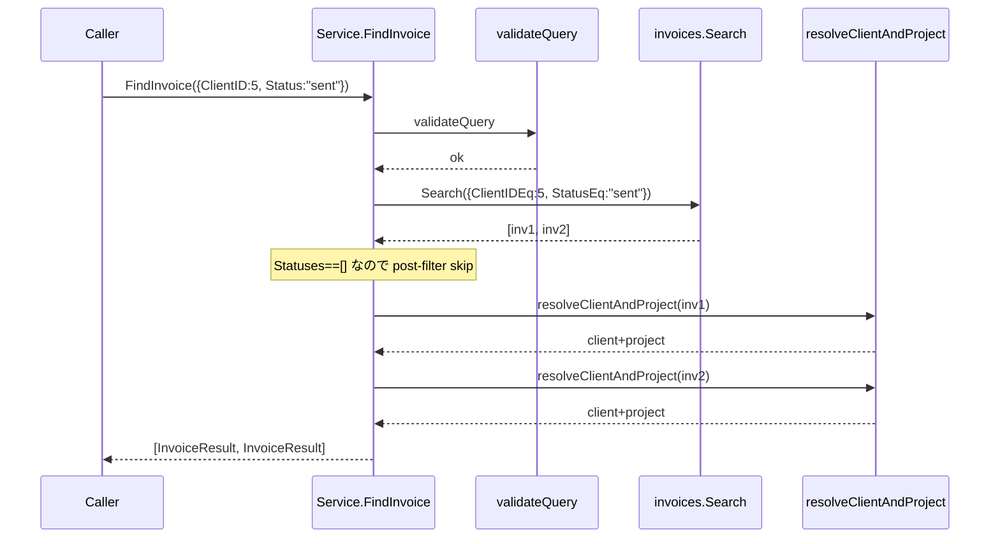
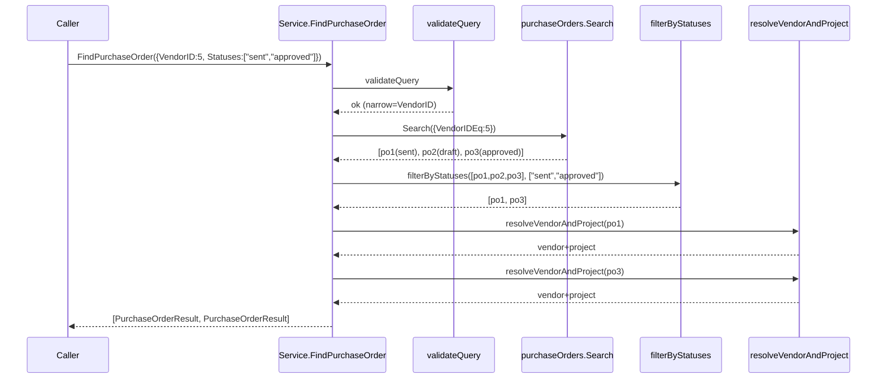

# N07a 詳細計画: FindInvoice / FindPurchaseOrder / FindPayment / FindUser 実装

## Meta
| 項目 | 値 |
|------|---|
| マイルストーン | N07a |
| ゴール | `find2/` パッケージに `FindInvoice` / `FindPurchaseOrder` / `FindPayment` / `FindUser` を実装し、Phase N の find2 を 9/11 メソッド完成（Document 4 種 + Client/Vendor/Project は N04-N06 で完成、未実装は Estimate/Receipt 派生はなく Group は ADR で除外） |
| 親計画 | `plans/board-phase-n-roadmap.md`（Phase N） / `plans/wondrous-skipping-snowglobe.md`（N02 設計） |
| 依存 | N04（Client/Vendor）/ N05（Project + Status post-filter + validation reject）/ N06（Document + lookupClient/filterWarn） |
| 作成日 | 2026-04-26 |
| ステータス | Ready for Implementation（self-execute + advisor() で品質ゲート） |
| 想定工数 | 1.0–1.5 日（4 メソッド合計） |

## Context

N02 設計書（wondrous-skipping-snowglobe.md §3.3）と現状 `internal/service/find2/types.go`（commit 1e501dd）に**スキーマギャップ**がある。types.go が contract として優先される。

**types.go の確定スキーマ**（N03 で固定済）:

| Query | フィールド |
|---|---|
| `FindInvoiceQuery` | `ID, ClientID, Text, Status, Statuses` |
| `FindPurchaseOrderQuery` | `ID, VendorID, Text, Status, Statuses` |
| `FindPaymentQuery` | `ID, VendorID, Text, Status, Statuses` |
| `FindUserQuery` | `ID, Name, Text` |

**Result 型**（types.go 既定義）:
- `InvoiceResult { Invoice, Project, Client }`
- `PurchaseOrderResult { PurchaseOrder, Vendor, Project }`
- `PaymentResult { Payment, Vendor, Project }`
- `UserResult { User }`

**Entity トップレベルフィールド**（実 API 確認済）:
- `InvoiceEntity.ClientID, ProjectID` ◎ ある
- `PurchaseOrderEntity.VendorID, ProjectID` ◎ ある
- `PaymentEntity.VendorID, PurchaseOrderID` ✗ **ProjectID は無い**（dump=null で確認不可）
- `UserEntity.Name, LastName, FirstName, Email`

## 4 つの設計判断（advisor 確認済）

### D1: Payment.Project は常に nil（option (a) 確定）

**根拠**:
- `PaymentEntity` トップレベルに `ProjectID` フィールドなし（VendorID + PurchaseOrderID のみ）
- E2E dump（`tmp/e2e-artifacts/payments_*.json` = null）で実データ 0 件 → 3-hop（Payment → PO.GetByID → Project.GetByID）の安全性検証不可
- `PaymentResult.Project *ProjectEntity` フィールドは types.go で既定義（schema は維持）。ただし N07a では常に nil でセット
- N09 E2E 再構築時に実データが揃ったら 3-hop 実装を再検討（Out of scope）

### D2: Status / Statuses-only validation reject の非対称適用

| Query | API delegation | 判断 |
|---|---|---|
| `Status` 単独（他フィールド全 0/空）| `StatusEq` で API delegation 可（full-scan 不要）| **allow** |
| `Statuses[]` 単独（他フィールド全 0/空）| `StatusIn[]` 不在で post-filter 必須 → full-scan | **reject** |
| `Status` + 他フィールド | API delegation + 他フィルタ | allow |
| `Statuses[]` + 他フィールド | post-filter + 他フィルタによる narrowing | allow |

**N05 (Project) との違い**:
- Project の `OrderStatusName / DeliveryStatusName` は API 側に対応 ListOptions フィルタが**ない**ため Status / Statuses 共に full-scan → 両方 reject だった
- Invoice/PO/Payment の `Status` は `StatusEq` で API 委譲可能 → Status 単独 allow

**実装対象**: `FindInvoiceQuery.validate()` / `FindPurchaseOrderQuery.validate()` / `FindPaymentQuery.validate()` の 3 箇所に「Statuses-only narrowing 必須」ルール追加。Status-only は既存 validation に任せる（既に at-least-one でカバー）。

### D3: filter は `filterByStatuses[T]` ジェネリックを再利用

**根拠**:
- Invoice/PO/Payment は `Status string` 単一フィールド → `filterByStatuses[T any](items, getStatus, statuses)` で表現可能
- N05 の `filterProjectsByStatuses` は OR 評価（OrderStatusName ∨ DeliveryStatusName）が必要だったため例外。今回は不要
- 既存ヘルパー `filter.go:44-59` を変更せず使用

### D4: Text マッチ対象フィールド

| メソッド | Text 対象 |
|---|---|
| FindInvoice | `Title, Memo`（無 Name、ClientID は ID match で対応） |
| FindPurchaseOrder | `Title, Memo` |
| FindPayment | `Memo`（PaymentEntity に Title 無し） |
| FindUser | `Name, LastName, FirstName, Email`（DisplayName() は Name と等価のため重複しない） |

すべて非ポインタ string なので derefString 不要（containsText 直接呼び出し）。

## 実装方針（4 メソッド）

### 共通規約（N04/N05/N06 踏襲）

1. **validate**: 各メソッド冒頭で `validateQuery(q.FindCommonOpts, q)` 呼び出し
2. **switch**: ID > ClientID/VendorID > Text の優先順位で排他ブランチ
3. **enrichment**: `resolveClientAndProject` / `resolveVendorAndProject`（resolver.go 既存）を再利用 — non-fatal + slog.Warn
4. **post-filter**: `filterByStatuses[T]` 再利用（Statuses 指定時、ID 検索は skip）
5. **Limit**: enrichment 後の早期打ち切り（N04/N05/N06 と同形）
6. **Status post-filter は ID 検索時 skip**（N05 踏襲、UX 配慮）

### FindInvoice（複雑度 M）

```go
func (s *Service) FindInvoice(ctx, q FindInvoiceQuery) ([]InvoiceResult, error) {
    if err := validateQuery(q.FindCommonOpts, q); err != nil { return nil, err }
    opts := repoOpts(q.FindCommonOpts)

    var invoices []boardapi.InvoiceEntity
    switch {
    case q.ID != 0:
        i, err := s.invoices.GetByID(ctx, q.ID, opts)
        if err != nil { return nil, err }
        invoices = []boardapi.InvoiceEntity{*i}
    case q.ClientID != 0:
        list, err := s.invoices.Search(ctx, boardapi.InvoiceListOptions{ClientIDEq: q.ClientID, StatusEq: q.Status}, opts)
        if err != nil { return nil, err }
        invoices = list
    case q.Status != "":
        // Status 単独: API delegation
        list, err := s.invoices.Search(ctx, boardapi.InvoiceListOptions{StatusEq: q.Status}, opts)
        if err != nil { return nil, err }
        invoices = list
    case q.Text != "":
        all, err := s.invoices.Search(ctx, boardapi.InvoiceListOptions{StatusEq: q.Status}, opts)
        if err != nil { return nil, err }
        for _, x := range all {
            if containsText(q.Text, x.Title, x.Memo) {
                invoices = append(invoices, x)
            }
        }
    }

    // post-filter: Statuses 指定時のみ（Status 単独は API delegation 済）
    if q.ID == 0 && len(q.Statuses) > 0 {
        invoices = filterByStatuses(invoices, func(i boardapi.InvoiceEntity) string { return i.Status }, q.Statuses)
    }

    results := make([]InvoiceResult, 0, len(invoices))
    for _, x := range invoices {
        client, project := s.resolveClientAndProject(ctx, x.ClientID, x.ProjectID, opts)
        results = append(results, InvoiceResult{Invoice: x, Client: client, Project: project})
        if q.Limit > 0 && len(results) >= q.Limit { break }
    }
    return results, nil
}
```

**Status delegation の詳細**: ClientID branch も `StatusEq: q.Status` を埋めて API 委譲（narrowing 効果）。Text branch も同様に Status 委譲しつつ in-process で Text マッチ。

### FindPurchaseOrder（複雑度 M）

FindInvoice と完全に同形。Search filter は `VendorIDEq` + `StatusEq`。enrichment は `resolveVendorAndProject(po.VendorID, po.ProjectID)`。

```go
case q.ID != 0:
    po, err := s.purchaseOrders.GetByID(ctx, q.ID, opts)
    ...
case q.VendorID != 0:
    list, err := s.purchaseOrders.Search(ctx, boardapi.PurchaseOrderListOptions{VendorIDEq: q.VendorID, StatusEq: q.Status}, opts)
    ...
case q.Status != "":
    list, err := s.purchaseOrders.Search(ctx, boardapi.PurchaseOrderListOptions{StatusEq: q.Status}, opts)
    ...
case q.Text != "":
    all, err := s.purchaseOrders.Search(ctx, boardapi.PurchaseOrderListOptions{StatusEq: q.Status}, opts)
    for _, x := range all {
        if containsText(q.Text, x.Title, x.Memo) { ... }
    }
```

### FindPayment（複雑度 L）

FindPurchaseOrder と同形。**Project enrichment は実施しない**（D1）。`Vendor` のみ enrichment。

```go
results := make([]PaymentResult, 0, len(payments))
for _, x := range payments {
    var vendor *boardapi.VendorEntity
    if x.VendorID != 0 {
        v, err := s.vendors.GetByID(ctx, x.VendorID, opts)
        if err != nil {
            slog.Warn("find2.FindPayment: vendor enrichment failed", "vendor_id", x.VendorID, "error", err)
        } else {
            vendor = v
        }
    }
    results = append(results, PaymentResult{Payment: x, Vendor: vendor, Project: nil})
    if q.Limit > 0 && len(results) >= q.Limit { break }
}
```

Text マッチ対象は `Memo` のみ（Title なし）。

### FindUser（複雑度 S）

最もシンプル。enrichment 不要、Status / Statuses なし、PostFilter なし。

```go
func (s *Service) FindUser(ctx, q FindUserQuery) ([]UserResult, error) {
    if err := validateQuery(q.FindCommonOpts, q); err != nil { return nil, err }
    opts := repoOpts(q.FindCommonOpts)

    var users []boardapi.UserEntity
    switch {
    case q.ID != 0:
        u, err := s.users.GetByID(ctx, q.ID, opts)
        if err != nil { return nil, err }
        users = []boardapi.UserEntity{*u}
    case q.Name != "":
        list, err := s.users.Search(ctx, boardapi.UserListOptions{NameCont: q.Name}, opts)
        if err != nil { return nil, err }
        users = list
    case q.Text != "":
        all, err := s.users.Search(ctx, boardapi.UserListOptions{}, opts)
        if err != nil { return nil, err }
        for _, x := range all {
            if containsText(q.Text, x.Name, x.LastName, x.FirstName, x.Email) {
                users = append(users, x)
            }
        }
    }

    results := make([]UserResult, 0, len(users))
    for _, x := range users {
        results = append(results, UserResult{User: x})
        if q.Limit > 0 && len(results) >= q.Limit { break }
    }
    return results, nil
}
```

## TDD Step 詳細

### Step 0: types.go validation 改修（D2 適用）

`FindInvoiceQuery.validate() / FindPurchaseOrderQuery.validate() / FindPaymentQuery.validate()` に Statuses-only reject ルール追加。

```go
func (q FindInvoiceQuery) validate() error {
    if err := validateStatusFields(q.Status, q.Statuses); err != nil {
        return err
    }
    if q.ID == 0 && q.ClientID == 0 && q.Text == "" &&
        q.Status == "" && len(q.Statuses) == 0 {
        return errors.New("at least one field required")
    }
    // D2: Statuses (multi) only は API delegation 不可で full-scan を要するため reject。
    // Status (single) は API delegation 可のため allow。
    hasNarrow := q.ID != 0 || q.ClientID != 0 || q.Text != "" || q.Status != ""
    if len(q.Statuses) > 0 && !hasNarrow {
        return errors.New("Statuses requires at least one of ID, ClientID, Text, or Status to narrow results")
    }
    return nil
}
```

PO / Payment は `ClientID` を `VendorID` に置換して同形のチェック。

### Step 1: Red — テスト先書き

各 find_*_test.go に以下のケースを書く（4 ファイル合計 ~30-40 ケース）:

#### FindInvoice テスト（11-13 ケース）
- I01: ByID HappyPath（ClientID/ProjectID enrichment 成功）
- I02: ByID — invoice 1 件、Project enrichment 失敗 → non-fatal（Project=nil + slog.Warn）
- I03: ByID — Status post-filter skip（ID 検索時は skip、Status="archived" でも結果返る）
- I04: ByClientID — ClientIDEq が API に渡る、Status="" の場合 StatusEq も""
- I05: ByClientID + Status — ClientIDEq + StatusEq 両方 API 委譲
- I06: ByStatus（単独）— Status only は allow、StatusEq が API に渡る
- I07: ByText — Title マッチ
- I08: ByText — Memo マッチ
- I09: ByStatuses (multi) + ID — post-filter で 2/3 残る
- I10: Limit=2 — 3 件中 2 件で打ち切り（resolveClientAndProject の呼び出し回数も 2）
- I11: Empty query → "at least one field required"
- I12: Statuses-only → "Statuses requires at least one of..."（D2 reject）
- I13: GetByID error → fail-fast 伝播

#### FindPurchaseOrder テスト（10-12 ケース、Invoice と同形）
- P01-P11: I01-I13 と同形（ClientID → VendorID 置換、resolveVendorAndProject 確認）

#### FindPayment テスト（8-10 ケース）
- M01: ByID HappyPath — Vendor enrichment 成功、**Project は nil**（D1 確認）
- M02: ByID — Vendor enrichment 失敗 → non-fatal + slog.Warn
- M03: ByVendorID — VendorIDEq が API に渡る
- M04: ByStatus — StatusEq API 委譲
- M05: ByText — Memo マッチ（Title 無し）
- M06: ByStatuses + VendorID — post-filter
- M07: Limit=2
- M08: Empty query
- M09: Statuses-only reject

#### FindUser テスト（7-8 ケース、enrichment 無し）
- U01: ByID HappyPath
- U02: ByName — NameCont が API に渡る
- U03: ByText — Name マッチ
- U04: ByText — LastName マッチ
- U05: ByText — Email マッチ
- U06: Limit=2
- U07: Empty query
- U08: GetByID error → fail-fast

### Step 2: Green — 最小実装

types.go validation 改修 → 4 つの find_*.go ファイル新規作成。実装は上記の擬似コードに沿って最小限。

### Step 3: Refactor

- 共通の switch パターンが 3 メソッドで類似 → 重複コードがあれば helper 抽出を検討（過剰な共通化はしない、4 メソッド程度ならインラインで OK）
- slog.Warn メッセージは `find2.{Method}: {action} failed` の規約で統一
- godoc コメントを各メソッドに追加（N04-N06 と同等の粒度）

### Step 4: 検証

```
go test -race -count=1 ./internal/service/find2/...
go vet ./...
gofmt -s -w internal/service/find2/
```

すべて green を確認。

### Step 5: コミット

論理単位で分割:
1. `feat(find2): N07a — types.go の Statuses-only validation reject 追加`
2. `feat(find2): N07a — FindInvoice/FindPurchaseOrder/FindPayment/FindUser 実装 + N0a-T01..U08 unit tests`
3. `docs(plans): N07a 計画書 + ロードマップ更新`

## Mermaid シーケンス図

### FindInvoice（ClientID + Status branch）



### FindPurchaseOrder（Statuses post-filter branch）



## リスク評価

| # | リスク | 確率 | 影響 | 軽減策 |
|---|------|------|------|------|
| R1 | Status を ClientID/VendorID branch の Search に同梱（StatusEq）すると、Statuses[] と組み合わせ時の意味論が混乱 | 中 | 中 | 実装は「Statuses[] が空のとき Status を Search に渡す」「Statuses[] あるとき Status は使わない（validateStatusFields で排他保証）」で揺るがない。test I05/I06 で確認 |
| R2 | Payment.Project=nil 固定方針（D1）が後で revert する破壊的変更になる | 中 | 低 | Result schema は不変（types.go の `Project *ProjectEntity` 維持）、N09 E2E で実データ揃ったら 3-hop 追加するだけ。CHANGELOG 影響無し |
| R3 | Statuses-only validation reject が CLI/MCP ユーザーへ予期せぬエラー | 中 | 低 | エラーメッセージで narrowing 必須を案内（"requires at least one of..."）。N07c CLI 刷新時に flag 説明にも記載 |
| R4 | invoices/purchase_orders/payments の Search が cache bypass で API 直接呼び出し → rate limit 圧迫 | 低 | 中 | 既存 repository の挙動（filter 非ゼロ → bypass）。Limit 早期打ち切りで影響軽減。N09 E2E で実測 |
| R5 | Text branch で `StatusEq` を埋めると Status="" のときに何か悪影響 | 低 | 低 | `StatusEq=""` は QueryBuilder で送信されない（既存 boardapi 設計）。動作影響無し、test I07 で確認 |
| R6 | helpers_test.go の stubInvoiceRepo / stubPurchaseOrderRepo / stubPaymentRepo / stubUserRepo の機能不足 | 中 | 低 | searchFunc / getFunc を追加して N04 stubVendorRepo 同等に拡張。既存テスト（N03 types_test 等）破壊しない（追加のみ） |

## DoD（完了条件）

- [ ] types.go の 3 Query に Statuses-only reject 追加
- [ ] find_invoice.go / find_purchase_order.go / find_payment.go / find_user.go 新規作成
- [ ] 各テストファイル（4 ファイル、合計 30-40 ケース）追加
- [ ] `go test -race -count=1 ./internal/service/find2/...` pass
- [ ] `go vet ./...` pass
- [ ] `gofmt -s -w internal/service/find2/` 差分なし
- [ ] 計画書更新（roadmap N07a → N07b、Changelog エントリ）
- [ ] 3 コミット（types改修 / 実装 + tests / 計画更新）

## ハンドオフ準備（N07b 向け）

- N07a で確立する想定パターン:
  - `Status (single) → API delegation / Statuses[] → post-filter + reject (no narrow)`（Invoice/PO/Payment 共通）
  - `Payment.Project = nil`（D1、データなし環境での暫定）
  - `filterByStatuses[T]` ジェネリックの 3 リソース展開（N06 までジェネリック未使用 → N07a 初使用）

- N07b（旧 find/ 削除 + find2/ → find/ rename）に渡すべき情報:
  - find2 9/11 メソッド（FindGroup は ADR-001 で削除確定、Document 4 種は N06 完成、Client/Vendor/Project は N04-N05 完成）
  - rename drill 結果: PoC レポート §6 既記録、極めて低リスク
  - N07a で実装した validation reject ルールは CLI/MCP error メッセージとして N07c で公開
