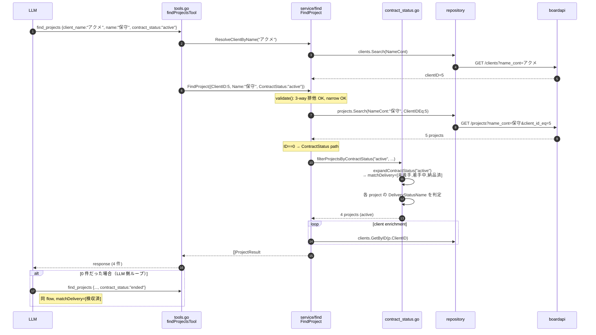

# 契約状態 alias + statuses 配列対応 — 実装計画

## 0. 元質問への即答

> **「保守契約有効性確認に必要な find / skill は作成されていますか？」**

**ほぼ Yes**。v0.7.0 の MCP `find_projects` で要件 1-3（案件名部分一致 / 顧客名部分一致 disambiguate / status human readable & filter）は既に充足済。
**唯一のギャップ**は (a) `statuses` 配列が service 層に実装済みだが MCP schema 未公開、(b) 「契約有効/契約終了」のような業務用語 alias が未実装、(c) CLI parity 未対応、の 3 点。本計画はこの 3 ギャップを埋める追加機能。

## 1. Context — なぜこの変更か

### 1.1 ユーザー要望（一次情報）

> 「特定顧客の保守契約の有効性確認を BOARD 案件情報から行いたい。
> 案件名に "保守" が含まれる（部分一致）、顧客名は不完全キーワードで絞り込み（部分一致）、
> status は human readable、段階的検索: 契約有効 → なければ契約終了の順で確認、
> LLM が active/ended のような業務用語をそのまま渡せると体験が良い。」

### 1.2 v0.7.0 時点の実装状況（Phase N 完走後）

- ✅ 案件名部分一致: `find_projects --name "保守"` で対応 (`projects.go` `NameCont` API delegation)
- ✅ 顧客名部分一致: `--client-name` 経由 `ResolveClientByName` で disambiguate 込みで解決 (N07c)
- ✅ status human readable: `OrderStatusName` / `DeliveryStatusName` で日本語名返却
- ⚠️ statuses 配列: **service 層は実装済み (`Service.FindProject` が `Statuses []string`) だが MCP schema 未公開**
- ❌ 業務用語 alias: 未実装。LLM は BOARD 用語 ("受注済"/"検収済"等) を直接渡す必要

### 1.3 ゴール

LLM が `find_projects(client_name="アクメ", name="保守", contract_status="active")` のように
**業務用語ひとつで保守契約検索ができる状態**にする。段階的検索 (active → ended) は LLM 側ループで実現。

### 1.4 BOARD status 名（一次情報、`internal/cli/completion_values.go` から）

| OrderStatus | 名称 |  | DeliveryStatus | 名称 |
|---|---|---|---|---|
| 1-3 | 見積中(高/中/低) |  | 1 | 未着手 |
| 4 | 受注確定 |  | 2 | 着手中 |
| 5 | 受注済 |  | 3 | 納品済 |
| 8 | 見積中(除) |  | 4 | 検収済 |

合計 10 種（既存 `validateStatusFields` の `len > 10` 上限と完全一致）。

## 2. スコープ

### In Scope
- (A) MCP `find_projects` に `statuses` (string array) パラメータ公開
- (B) MCP `find_projects` に `contract_status` (alias single string) パラメータ追加
  - 値域: `active` / `ended` / `prospect` / `all`
- (C) `internal/service/find/contract_status.go` 新規（alias 展開層 + 専用 filter）
- (D) **CLI parity**: `board find project` に `--statuses` (StringSlice) と `--contract-status` (string) 追加
- (E) ドキュメント整備: `docs/usage/maintenance-contract-search.md` 新規 + README + CHANGELOG
- (F) ユニットテスト追加（TDD: Red → Green → Refactor）

### Out of Scope
- サーバー側段階的検索 — ステートレス維持、LLM 側ループで対応
- alias の DB 化 / 設定ファイル化 — 初期値はコード定数、必要時別マイルストーン
- E2E テスト追加 — Phase N N09 確立の per-batch 運用に従い別途
- payment_status / invoice_status alias — 別マイルストーン候補

## 3. 設計判断

### 3.1 OR セマンティクス問題と採用案 (b)

既存 `filterProjectsByStatuses` は `OrderStatusName` **OR** `DeliveryStatusName` で評価する。
案件 A: `OrderStatusName="受注済"` × `DeliveryStatusName="検収済"` のように
受注済(active) と 検収済(ended) を同時に持つ案件が現実に存在し、OR では active/ended が排他にならない。

#### 検討した案
| 案 | 内容 | 採否 |
|---|---|---|
| (a) | OR セマンティクス維持、ドキュメントで重複可と明記 | ✗ UX を歪める |
| **(b)** | **fields-aware filter: active/ended = DeliveryStatusName のみ、prospect = OrderStatusName のみ** | **○ 採択（ユーザー合意済）** |
| (c) | precedence ルール（ended が優先） | ✗ alias の意味が曖昧化 |
| (d) | AND ロジック: active = OrderStatus∈{受注確定,受注済} ∧ DeliveryStatus∈{未着手,着手中,納品済} | △ 検討したが (b) を選択（ユーザー判断: 進捗ベースで広く拾う方針） |

#### 採用案 (b) の挙動
- `active` / `ended` は **`DeliveryStatusName` のみで評価**
- `prospect` は **`OrderStatusName` のみで評価**
- active と ended は排他となり「契約有効 → 契約終了の順次確認」が成立
- 注意: `OrderStatus="見積中(中)"` × `DeliveryStatus="未着手"` のような見込み案件も active に含まれる
  - これは「進捗中の案件を広く拾う」方針として受容（ユーザー判断、advisor R1 検討事項）

専用ヘルパー `filterProjectsByContractStatus` を新設し、既存 `filterProjectsByStatuses` (OR) は触らない。

### 3.2 alias マッピング（採用値）

| alias | 評価フィールド | 含まれる status 名 |
|---|---|---|
| `active` | DeliveryStatusName | 未着手 / 着手中 / 納品済 |
| `ended` | DeliveryStatusName | 検収済 |
| `prospect` | OrderStatusName | 見積中(高) / 見積中(中) / 見積中(低) / 見積中(除) |
| `all` | (上記すべて) | active ∪ ended ∪ prospect |

### 3.3 3-way 排他バリデーション

`Status` / `Statuses` / `ContractStatus` は **相互排他**。既存 `validateStatusFields(status, statuses)` を
`validateStatusGroup(status, statuses, contractStatus)` に拡張する。呼び出し側 4 箇所
（FindProject/FindInvoice/FindPurchaseOrder/FindPayment）を機械的に修正、未使用は `""` を渡す。

### 3.4 narrowing ルール踏襲（N05）

`ContractStatus` 単独クエリは reject。既存の Status/Statuses-only reject ロジックに
ContractStatus 条件を追加するだけ:
```go
hasStatus := q.Status != "" || len(q.Statuses) > 0 || q.ContractStatus != ""
if hasStatus && !hasNarrow { return errors.New("...") }
```

### 3.5 "all" 展開と上限 10 問題

BOARD の status 名総数は 10、`Statuses` 上限と完全一致。`ContractStatus="all"` を `Statuses` に展開すると
将来の status 追加で破綻する。**ContractStatus は `Statuses` フィールドに展開せず、専用フィルタで処理**
することで上限チェックの対象外とする。

## 4. 実装手順

### Step 1: `internal/service/find/contract_status.go` 新規（純粋ロジック層）

依存: なし。TDD Red 先行（Step 5 で test 先行記述）。

主要関数:
- `expandContractStatus(alias) (matchDelivery []string, matchOrder []string, err error)`
  - alias 正規化（`strings.ToLower(strings.TrimSpace(...))`）
  - 不正値は `unknown contract_status %q (valid: active / ended / prospect / all)` エラー
- `filterProjectsByContractStatus(projects, alias) ([]ProjectEntity, error)`
  - DeliveryStatusName と OrderStatusName を fields-aware に判定
- `setFromSlice` ヘルパー

定数: `ContractStatusActive`/`Ended`/`Prospect`/`All` 公開定数 + マッピング const slice。

### Step 2: `internal/service/find/types.go` 拡張

依存: Step 1（型のみ）。

- `FindProjectQuery` に `ContractStatus string` フィールド追加
- `validateStatusFields` → `validateStatusGroup(status, statuses, contractStatus)` シグネチャ拡張
- 呼び出し側 4 箇所を機械的修正（未使用は `""` 引数）
- `FindProjectQuery.validate()` で 3-way 排他 + ContractStatus を含む narrow 必須チェック

### Step 3: `internal/service/find/find_project.go` で alias 適用

依存: Step 1, 2。

post-filter ブロックを `switch` で 3 分岐:
```go
if q.ID == 0 {
    switch {
    case q.ContractStatus != "":
        filtered, err := filterProjectsByContractStatus(projects, q.ContractStatus)
        if err != nil { return nil, err }
        projects = filtered
    case len(q.Statuses) > 0:
        projects = filterProjectsByStatuses(projects, q.Statuses)
    case q.Status != "":
        projects = filterProjectsByStatus(projects, q.Status)
    }
}
```
ID 検索時 post-filter スキップ規約は維持。

### Step 4: `internal/mcpserver/tools.go` の `find_projects` 拡張

依存: Step 3。

- `WithArray("statuses", WithStringItems(), Description("..."))` 追加
- `WithString("contract_status", Description("Valid: active/ended/prospect/all. ..."))` 追加
- `getStringArrayArg(req, key) []string` ヘルパー新設（`[]any` → `[]string` キャスト）
- Handler で `Statuses` / `ContractStatus` を渡す
- 既存 description を contract_status / statuses 言及で更新

mcp-go v0.47.0 で `WithArray` API 確認済 (`tools.go:1208`)。

### Step 4.5: `internal/cli/find_project.go` 拡張（CLI parity）

依存: Step 3。MCP と同じく service 層の Statuses / ContractStatus を CLI フラグから渡せるようにする。

変更点（cobra フラグ追加 + Query 渡し）:
```go
var (
    // 既存フラグ ...
    statuses       []string
    contractStatus string
)

// 既存バリデーション on (id == 0 && ... && status == "") に
// && len(statuses) == 0 && contractStatus == "" を追加

q := find.FindProjectQuery{
    // 既存フィールド ...
    Status:         status,
    Statuses:       statuses,
    ContractStatus: contractStatus,
}

cmd.Flags().StringSliceVar(&statuses, "statuses", nil,
    "Filter by multiple project statuses (OR). Mutually exclusive with --status / --contract-status.")
cmd.Flags().StringVar(&contractStatus, "contract-status", "",
    "Contract status alias (active/ended/prospect/all). Mutually exclusive with --status / --statuses.")
```

Note: cobra の `StringSliceVar` は `--statuses=受注済 --statuses=納品済` または `--statuses=受注済,納品済` の両方を受理する。

### Step 5: ユニットテスト追加（TDD）

実装順序: 各テストを Red → Green → Refactor で循環。

| ファイル | テスト群 | 主要ケース |
|---|---|---|
| `internal/service/find/contract_status_test.go` (新規) | C-T01〜C-T13 | alias 展開、case-insensitive、不正値、空、各 alias で filter |
| `internal/service/find/types_test.go` (追記) | V-T01〜V-T10 | 3-way 排他、narrow 必須、既存 V regression |
| `internal/service/find/find_project_test.go` (追記) | F-T01〜F-T08 | ContractStatus + Name/ClientID flow、ID-skip、Statuses 直接 |
| `internal/mcpserver/tools_test.go` (追記) | M-T01〜M-T09 | schema 露出、handler バインディング、3-way 排他 reject |
| `internal/cli/find_test.go` (追記) | CLI-T01〜T05 | `--statuses` / `--contract-status` フラグバインディング、no-flag バリデーション、3-way 排他 |

### Step 6: ドキュメント整備

- `docs/usage/maintenance-contract-search.md` 新規（§9 構成）
- `README.md` / `README_ja.md` の MCP 節に 1 段落 + リンク
- `CHANGELOG.md` Unreleased Added セクション

### Step 7: （ロードマップ反映はスコープ外）

ロードマップ位置づけ（Phase O 新設等）は本計画のスコープ外。実装完了後に別タスクで検討する。

## 5. TDD テスト設計

### 5.1 contract_status_test.go (C-T01〜C-T13)

| # | 入力 | 期待 |
|---|---|---|
| C-T01 | `expandContractStatus("active")` | matchDelivery=[未着手,着手中,納品済], matchOrder=nil |
| C-T02 | `expandContractStatus("ended")` | matchDelivery=[検収済], matchOrder=nil |
| C-T03 | `expandContractStatus("prospect")` | matchDelivery=nil, matchOrder=[見積中(高/中/低/除)] |
| C-T04 | `expandContractStatus("all")` | active∪ended の DeliveryStatusName + prospect の OrderStatusName |
| C-T05 | `expandContractStatus("ACTIVE")` | C-T01 と同等（case-insensitive） |
| C-T06 | `expandContractStatus(" active ")` | C-T01 と同等（trim） |
| C-T07 | `expandContractStatus("unknown")` | error: `unknown contract_status "unknown" (valid: ...)` |
| C-T08 | `expandContractStatus("")` | empty result, no error |
| C-T09 | `filter("active", projects[未着手/検収済/見積中(中)])` | 1 件（未着手のみ） |
| C-T10 | `filter("ended", projects[未着手/検収済])` | 1 件（検収済のみ） |
| C-T11 | `filter("prospect", projects[見積中(中)/受注確定])` | 1 件（見積中(中)のみ） |
| C-T12 | `filter("all", projects[mix])` | active∪ended∪prospect 全部 |
| C-T13 | `filter("active", [])` | 空配列 |

### 5.2 types_test.go 追記 (V-T01〜V-T10)

| # | 入力 | 期待 |
|---|---|---|
| V-T01 | `{Name:"x", Status:"受注済", ContractStatus:"active"}` | error "mutually exclusive" |
| V-T02 | `{Name:"x", Statuses:["受注済"], ContractStatus:"active"}` | error "mutually exclusive" |
| V-T03 | 3 つ全部 set | error "mutually exclusive" |
| V-T04 | `{ContractStatus:"active"}` | error "requires at least one of" |
| V-T05〜T08 | `ContractStatus + (Name/ClientID/ID/Text)` | nil error |
| V-T09 | `{Name:"x", ContractStatus:" ACTIVE "}` | nil error |
| V-T10 | regression: `{Status:"受注済"}` | error "requires at least one of" |

### 5.3 find_project_test.go 追記 (F-T01〜F-T08)

ContractStatus + Name/ClientID/Text の flow を 5 件 search stub で検証。
ID 検索時 ContractStatus スキップの regression、Statuses 直接指定の動作確認も含む。

### 5.4 tools_test.go 追記 (M-T01〜M-T09)

- M-T01〜T04: schema に statuses (array) + contract_status (string) 露出、description に valid 値列挙
- M-T05〜T07: handler が ContractStatus / Statuses を service に渡す（mock 検証 or in-process 呼び出し）
- M-T08: 3-way 排他 reject の error response
- M-T09: description 文言確認

### 5.4b find_test.go 追記 (CLI-T01〜T05)

- CLI-T01: `--statuses=受注済,納品済` で Query.Statuses が `["受注済","納品済"]` になる
- CLI-T02: `--statuses=受注済 --statuses=納品済` 繰り返し指定でも同等
- CLI-T03: `--contract-status=active` で Query.ContractStatus が `"active"` になる
- CLI-T04: フラグ全部省略時の "at least one of" バリデーションエラー（regression、`--statuses` / `--contract-status` も加算）
- CLI-T05: `--status=受注済 --contract-status=active` で service 層 reject される（3-way 排他、CLI レベルではバインドのみ、エラーは service 経由）

### 5.5 入出力具体例（active flow）

```
MCP request:  {client_name:"アクメ", name:"保守", contract_status:"active"}
ResolveClient: アクメ → ID=5
projects.Search(NameCont:"保守", ClientIDEq:5) → 5 件
filterProjectsByContractStatus("active", ...) → DeliveryStatusName ∈ {未着手,着手中,納品済} な 4 件
client enrichment 後 limit 適用 → 返却
```

## 6. リスク評価

| ID | リスク | 影響度 | 確率 | 対策 |
|---|---|---|---|---|
| R1 | alias マッピングが業務運用と乖離 | 高 | 中 | 初期値と明記、ユーザーレビュー必須（§14-Q1）、const 分離で変更コスト最小化 |
| R2 | OR semantics で active/ended 重複 | 高 | 高 | §3.1 (b) fields-aware filter で排他を保証 |
| R3 | "all" 展開が上限 10 超過する将来リスク | 中 | 低 | ContractStatus は Statuses へ展開せず専用フィルタで処理、上限対象外 |
| R4 | LLM が status と statuses を併用 | 低 | 中 | 3-way 排他で reject、description で警告 |
| R5 | mcp-go WithArray 動作差分 | 低 | 低 | v0.47.0 確認済、Step 4 で再確認 |
| R6 | LLM が辞書外 alias を渡す ("completed" 等) | 中 | 中 | valid 値列挙付き error、description で値域明記 |
| R7 | LLM が段階的ループを忘れる | 中 | 中 | docs/usage で明確なプロンプト例、description で stateless を明示 |
| R8 | 既存 status 指定の後方互換破壊 | 高 | 低 | 全既存テスト pass を必須、M-T08 で regression assert |
| R9 | CLI / MCP のパリティ崩れ | 低 | 低 | Step 4.5 で同時対応、CLI-T01〜T05 でカバー |
| R10 | completion_values.go と alias 二重管理 | 中 | 低 | テストで status 名同期確認、将来 single-source 化検討 |

## 7. シーケンス図



## 8. アーキテクチャ整合

| 既存規約 | 本実装での適用 |
|---|---|
| `filterProjectsByXxx` 命名 | `filterProjectsByContractStatus` |
| `validateXxx` 命名 | `validateStatusGroup` |
| `getStringArg` / `getIntArg` | `getStringArrayArg` を新設 |
| MCP description で disambiguate / fanout / narrow を明示 | 同パターンで contract_status / statuses を解説 |
| narrowing 必須（N05） | ContractStatus にも適用 |
| ID 検索時 post-filter スキップ | ContractStatus にも同様 |
| 後方互換性 | 既存 `status` 動作不変、追加のみ |

ADR-001 範囲外の追加機能。CHANGELOG / docs/usage で説明。

## 9. ドキュメント更新詳細

### 9.1 docs/usage/maintenance-contract-search.md（新規, 約 200 行）

構成:
1. 目的 / 関連
2. クイックスタート（LLM プロンプト雛形 + CLI コマンド例）
3. contract_status alias 値域表
4. 段階的検索の推奨ループ
5. statuses 配列の使い分け（MCP / CLI 両方）
6. alias マッピング初期値と注意点
7. 既知の semantics（fields-aware filter の挙動）
8. narrowing 必須ルール
9. レビュー余地と将来拡張

CLI コマンド例（§2 内）:
```bash
# active な保守契約
board find project --client-name "アクメ" --name "保守" --contract-status active

# 段階的: active で 0 件なら ended で再検索
board find project --client-name "アクメ" --name "保守" --contract-status ended

# 細粒度: BOARD 用語そのままで複数指定
board find project --name "保守" --statuses 受注済,納品済
```

LLM プロンプト雛形:
> 「アクメ社の保守契約の有効性を確認してください。
> 1) find_projects(contract_status="active", client_name="アクメ", name="保守") を呼ぶ
> 2) 0 件なら contract_status="ended" で再呼び出し
> 3) それでも 0 件なら contract_status="prospect" で再呼び出し
> 4) ヒットしたら案件 ID と契約期間を要約」

### 9.2 README.md / README_ja.md

`## MCP Server` 節に 1 段落 + cross-link を追加（既存 docs/guides/mcp-server.md からも双方向リンク）。

### 9.3 CHANGELOG.md Unreleased

```markdown
### Added
- `find_projects` MCP tool / `board find project` CLI に `contract_status` (active/ended/prospect/all) と `statuses[]` (`--statuses`) を追加
  - 業務用語 alias で保守契約検索が 1 呼び出しで可能
  - statuses は service 層既存実装を schema / CLI flag に露出（最大 10 件、status と相互排他）
  - 段階的検索 (active → ended) は LLM 側ループで実現（サーバーはステートレス）
  - alias 仕様: docs/usage/maintenance-contract-search.md 参照、後方互換性あり
```

## 10. ロードマップ位置（スコープ外、メモのみ）

ロードマップ反映（Phase O 新設 / M-N11 として N に追加 等）は本計画のスコープ外。
実装完了後、CHANGELOG / docs に変更が記録された段階で別タスクとして判断する。

## 11. テスト実行 + 動作確認

### ユニットテスト
```bash
go test ./internal/service/find/
go test ./internal/mcpserver/
go test ./...                    # 全体回帰
go vet ./...
gofmt -s -d .
```

### 手動動作確認
1. `board mcp serve --addr 127.0.0.1:18080` 起動
2. tools/list で `statuses` / `contract_status` 露出を確認
3. tools/call: `contract_status="active"` + `name="保守"` で結果を確認
4. tools/call: `contract_status="active" + status="受注済"` → "mutually exclusive" エラー
5. tools/call: `contract_status="unknown"` → valid 値列挙付きエラー
6. 段階的検索: active → 0 件、ended → ヒット のシミュレーション

### 完了判定
- [ ] `go test ./...` 全 pass
- [ ] `go vet` warning 0、`gofmt -s -d .` 差分 0
- [ ] §11 手動確認 6 ケース全 OK
- [ ] §13 27 項目チェックリスト全 ☑
- [ ] CHANGELOG / README / docs/usage 更新
- [ ] alias マッピング初期値のユーザーレビュー実施

## 12. 主要ファイル一覧

**新規作成**
- `internal/service/find/contract_status.go`
- `internal/service/find/contract_status_test.go`
- `docs/usage/maintenance-contract-search.md`

**修正**
- `internal/service/find/types.go`（ContractStatus フィールド + validateStatusGroup 拡張）
- `internal/service/find/types_test.go`（V-T01〜T10）
- `internal/service/find/find_project.go`（post-filter ブロック）
- `internal/service/find/find_project_test.go`（F-T01〜T08）
- `internal/mcpserver/tools.go`（schema + handler + getStringArrayArg）
- `internal/mcpserver/tools_test.go`（M-T01〜T09）
- `internal/cli/find_project.go`（`--statuses` / `--contract-status` フラグ追加）
- `internal/cli/find_test.go`（CLI-T01〜T05）
- `README.md` / `README_ja.md`
- `CHANGELOG.md`

## 13. 5 観点 27 項目チェックリスト

### 観点 1: 実装可能性（6）
- [ ] 既存 `Service.FindProject` が `Statuses` を受理可能（find_project.go:55-59）
- [ ] mcp-go v0.47.0 `WithArray` + `WithStringItems` で配列 schema 表現可能
- [ ] `getStringArrayArg` は `[]any` → `[]string` キャストのみ
- [ ] `contract_status.go` は純粋関数 + map のみで test 容易
- [ ] `validateStatusGroup` 拡張は呼び出し 4 箇所の機械的修正
- [ ] docs/usage/ 新ディレクトリ作成は OS 制約なし

### 観点 2: TDD（6）
- [ ] contract_status_test.go を先に作成 → Red
- [ ] types_test.go 追記分を先に作成 → Red
- [ ] find_project_test.go 追記分を先に作成 → Red
- [ ] tools_test.go 追記分を先に作成 → Red
- [ ] Red → Green → Refactor のコミット痕跡を残す
- [ ] 全 pass 後 `go test ./...` で全体回帰 + vet + fmt

### 観点 3: アーキテクチャ整合（5）
- [ ] `filterProjectsByContractStatus` が既存命名規則と整合
- [ ] `validateStatusGroup` が既存 `validateXxx` パターン踏襲
- [ ] MCP description が既存 disambiguate / fanout / narrow パターンと整合
- [ ] ID-search 時の post-filter スキップを ContractStatus にも適用
- [ ] ADR-001 範囲外、衝突なし

### 観点 4: リスク評価（5）
- [ ] §6 R1〜R10 が docs / コメント / テストでカバー
- [ ] alias マッピングは const + 1 ファイル分離
- [ ] "all" 上限 10 問題は ContractStatus 専用フィルタで回避
- [ ] 既存 `status` 指定の regression テスト（M-T08）
- [ ] alias マッピング初期値であることが docs に明記

### 観点 5: シーケンス図 / ドキュメント（5）
- [ ] §7 Mermaid に alias 展開分岐 + 段階的ループを含む
- [ ] docs/usage/ ガイドが LLM プロンプト例 + 9 節構成
- [ ] README に cross-link
- [ ] CHANGELOG に明確な Added エントリ
- [ ] §3.1 採用案 (b) と不採用案 (d) の記録が plan 内に残り、後日レビュー可能

## 14. 確定事項（ユーザー合意済）

| # | 確定内容 |
|---|---|
| D1 | alias マッピング案 (b) を採用（DeliveryStatusName のみで active/ended 評価、prospect は OrderStatusName のみ）。AND 案 (d) は不採用 |
| D2 | ロードマップ反映は本計画スコープ外、実装完了後の別タスク |
| D3 | CLI parity (`board find project --contract-status` / `--statuses`) を本計画 In Scope に含める |

## Next Action（実装フェーズ）
> このプランを実装するには:
> `/devflow:implement` — TDD で Step 1〜7 を順次実装
> または `/devflow:cycle` — 自律ループで実装 + レビューを連続実行
