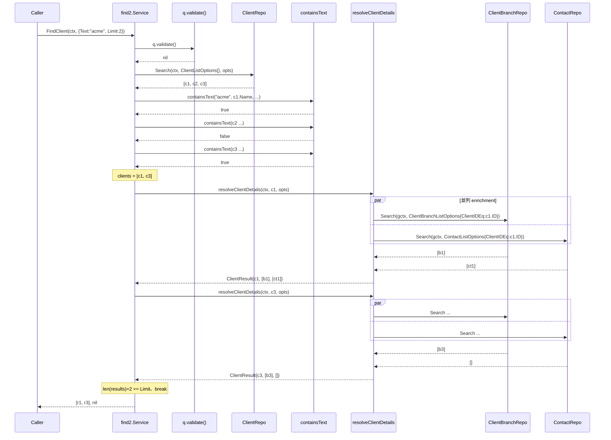
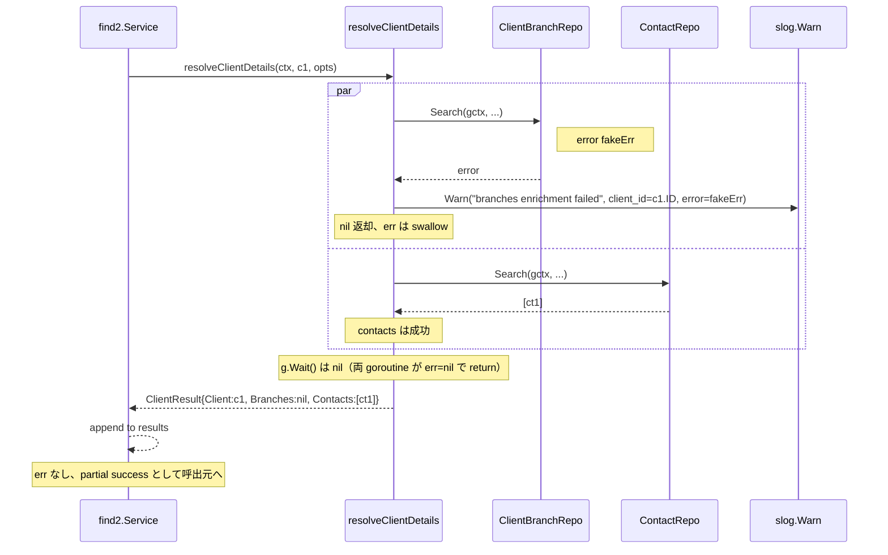
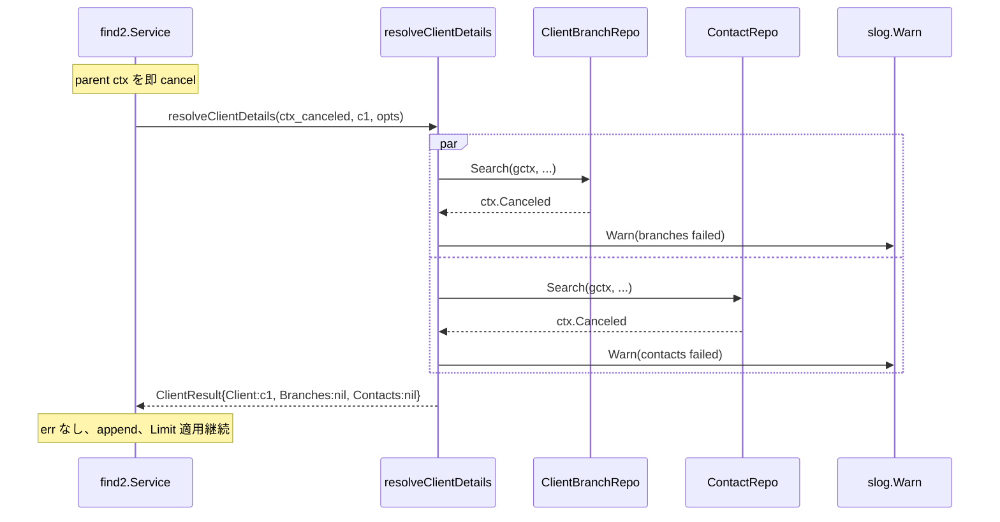

# N04: FindClient + FindVendor 具象実装

## Context

ADR-001（B 採択 / Status: Accepted）に基づき `internal/service/find2/` をゼロベース再設計中。N03 で骨格・共通ヘルパー・テスト基盤（12 ファイル / 1728 LOC、35 unit test 関数）が完走（2026-04-25）し、`find2.Service` + `Repos` + 11 Query/Result + 4 ヘルパー（text_match / filter / resolver / reverse_map）が利用可能になった。

N04 は Phase N の **具象 Find メソッド実装の第一弾**。`FindClient` と `FindVendor` を選んだ理由:

1. **Status/Statuses 不使用**（types.go 既定義、§N02-3.2）。`filterByStatuses` 不要、validate 規則がシンプル。
2. **reverseMapper 不使用**。Document 4 種（N06）に先立ち、reverseMapper 抜きの enrichment パターンを先に確立できる。
3. **構造が同型**（ID > Name > Text の優先順位 + branches + contacts enrichment）。1 メソッド完成後は他方が同パターンで完成するため、学習効率が高い。
4. **旧 `find/find_client.go`（90 LOC）と `find_vendor.go` が移植元として既に存在**。Search/Get/derefString/containsText の使い方をそのまま踏襲し、N03 で導入した errgroup 版 enrichment パターンを応用する。

**目的**: `find2.Service` に最初の 2 個の具象メソッドを TDD で実装し、N03 の骨格が実用に耐えることを実証する。同時に、N05+ の各 Find 実装で共通利用される **branches+contacts 並列 enrichment ヘルパー**（branches/contacts を `errgroup.WithContext` で 2 並列に取りに行く）を確立する。

## スコープ

### In Scope
- `internal/service/find2/find_client.go` 新規作成（`FindClient(ctx, q FindClientQuery) ([]ClientResult, error)`）
- `internal/service/find2/find_vendor.go` 新規作成（`FindVendor(ctx, q FindVendorQuery) ([]VendorResult, error)`）
- `internal/service/find2/find_client_test.go` 新規作成（unit test、stub repo 利用）
- `internal/service/find2/find_vendor_test.go` 新規作成（unit test）
- `internal/service/find2/resolver.go` への追記:
  - `(s *Service) resolveClientDetails(ctx, client, opts) ClientResult` — branches+contacts を errgroup で 2 並列取得、**enrichment 失敗は non-fatal**（slog.Warn でログ + 失敗側 nil/空スライスで Result 返却、N02 §4.3 + N03 既存 `resolveClientAndProject` のポリシーに整合、後述 R1 で議論）
  - `(s *Service) resolveVendorDetails(ctx, vendor, opts) VendorResult` — 同上 Vendor 版

### Out of Scope
- 他の具象メソッド（FindProject / FindEstimate / FindOrder / FindDelivery / FindReceipt / FindInvoice / FindPurchaseOrder / FindPayment / FindUser）→ N05-N07a
- CLI 結合（`board find_client` / `board find_vendor` を find2 にスイッチ）→ N07c
- MCP tools 結合 → N08
- E2E テスト（実 API 接続）→ N09
- 旧 `internal/service/find/find_client.go` / `find_vendor.go` 削除 → N07b

### 前提
- N03 完走（find2/ 12 ファイル、`go test -race` pass、code-reviewer APPROVED）
- types.go: `FindClientQuery{ID, Name, Text, FindCommonOpts}`、`ClientResult{Client, Branches, Contacts}`、`FindVendorQuery`、`VendorResult` 既定義
- service.go: `ClientRepo` (GetByID + Search) / `ClientBranchRepo` (Search) / `ContactRepo` (Search) / `VendorRepo` (GetByID + Search) / `VendorBranchRepo` (Search) / `VendorContactRepo` (Search) 既定義
- text_match.go: `containsText` / `derefString` 利用可能

## API 仕様

### FindClient
```go
func (s *Service) FindClient(ctx context.Context, q FindClientQuery) ([]ClientResult, error)
```

**入力検証**: `validateQuery(q.FindCommonOpts, q)` を最初に呼ぶ（**規約確定: N04 以降の全 Find メソッドで `validateQuery` 経由を使う**。`q.validate()` 単体では FindCommonOpts.validate が呼ばれないため）:
- `Limit < 0` → error（"limit must be >= 0"）— FindCommonOpts.validate
- 空 Query（`ID==0 && Name=="" && Text==""`） → error（**"at least one field required"**、types.go:63 の現実装に揃える）— FindClientQuery.validate

**検索ロジック**（旧 find/find_client.go と同一）:
- `q.ID != 0` → `clients.GetByID(ctx, q.ID, opts)`、結果 1 件
- `q.Name != ""` → `clients.Search(ctx, ClientListOptions{NameCont: q.Name}, opts)`
- `q.Text != ""` → `clients.Search(ctx, ClientListOptions{}, opts)` で全件取得後、`containsText(q.Text, c.Name, derefString(c.CustomNo), derefString(c.Note))` で in-process フィルタ

**Enrichment**: 各 client について `resolveClientDetails(ctx, c, opts)` を呼び、`ClientBranches.Search(ctx, ClientBranchListOptions{ClientIDEq: c.ID}, opts)` と `Contacts.Search(ctx, ContactListOptions{ClientIDEq: c.ID}, opts)` を **errgroup で 2 並列**取得。**失敗は non-fatal**（slog.Warn 出力 + 失敗側を nil/空スライスにして Result を返す、ctx cancel/deadline 由来も同様の扱い）。本セマンティクスは N03 の `resolveClientAndProject` および N02 §4.3 と整合。

**Limit 適用**: 旧実装と同じ「enrichment 後に len(results) >= Limit でループ break」方式（早期 break で過剰リクエストを防ぐ）。

### FindVendor
```go
func (s *Service) FindVendor(ctx context.Context, q FindVendorQuery) ([]VendorResult, error)
```

**Text マッチ対象**: `Vendor.Name`、`derefString(Vendor.Code)`、`derefString(Vendor.Memo)`（旧実装踏襲）

**Vendor branches/contacts のフィルタキー**:
- `VendorBranches.Search(ctx, VendorBranchListOptions{PayeeIDEq: vendor.ID}, opts)` — **`PayeeIDEq` であって `VendorIDEq` ではない**（BOARD API 仕様、リスク R2）
- `VendorContacts.Search(ctx, VendorContactListOptions{PayeeIDEq: vendor.ID}, opts)` — 同上

その他は FindClient と同型。

## テスト設計書

### 命名規則
- `TestService_FindClient_<シナリオ>`（N04 テストはサービスメソッド単位、`*_test.go` 内で定義）
- 既存 `helpers_test.go` の stub（`stubClientRepo` / `stubClientBranchRepo` / `stubContactRepo` / `stubVendorRepo` / `stubVendorBranchRepo` / `stubVendorContactRepo`）を流用
- `searchFunc` / `getFunc`（後者は N03 M1 修正で追加済）で挙動を制御

### 正常系ケース（FindClient: T01-T08、FindVendor: T11-T18）

| ID | テスト名 | 入力 | stub 設定 | 期待出力 |
|---|---|---|---|---|
| N04-T01 | `TestService_FindClient_ByID_Success` | `q.ID=10` | clients.getResult={ID:10,Name:"X"}、branches.searchResult=[{ID:1}]、contacts.searchResult=[{ID:2}] | `[{Client:{ID:10,Name:"X"}, Branches:[{ID:1}], Contacts:[{ID:2}]}]` |
| N04-T02 | `TestService_FindClient_ByName_DelegatesNameCont` | `q.Name="Acme"` | clients.searchFunc が ClientListOptions{NameCont:"Acme"} を受け取って 2 件返却 | 2 件 |
| N04-T03 | `TestService_FindClient_ByText_FiltersInProcess` | `q.Text="acme"` | clients.searchResult=[{Name:"Acme Corp"},{Name:"BetaCo"}] | 1 件（Acme Corp） |
| N04-T04 | `TestService_FindClient_ByText_MatchesCustomNo` | `q.Text="C-001"` | client.CustomNo=ptr("C-001") | 1 件 |
| N04-T05 | `TestService_FindClient_ByText_MatchesNote` | `q.Text="urgent"` | client.Note=ptr("urgent customer") | 1 件 |
| N04-T06 | `TestService_FindClient_PriorityIDOverridesName` | `q.ID=10, q.Name="Acme"` | GetByID が呼ばれる、Search は呼ばれない | 1 件、Search 呼び出し回数=0 |
| N04-T07 | `TestService_FindClient_LimitTwo_StopsEnrichment` | `q.Text="x"`, Limit=2 | clients=3 件マッチ | 2 件、enrichment 呼び出し回数=2（3 件目はスキップ） |
| N04-T08 | `TestService_FindClient_LimitZero_NoLimit` | `q.Text="x"`, Limit=0 | clients=3 件マッチ | 3 件すべて返却 |
| N04-T11..T18 | `TestService_FindVendor_*` | T01-T08 と同型（Text 対象は Name/Code/Memo、enrichment は PayeeIDEq） | 同上 | 同上 |

### 境界値ケース（T09-T10、T19-T20）

| ID | テスト名 | 入力 | 期待 |
|---|---|---|---|
| N04-T09 | `TestService_FindClient_EmptyQuery_Error` | `q={}` | error "at least one of ID, Name, or Text must be set" |
| N04-T10 | `TestService_FindClient_LimitNegative_Error` | `q.ID=10, Limit=-1` | error "limit must be >= 0"（FindCommonOpts.validate 経由） |
| N04-T19 | `TestService_FindVendor_EmptyQuery_Error` | 同上 | 同上 |
| N04-T20 | `TestService_FindVendor_LimitNegative_Error` | 同上 | 同上 |

### 異常系ケース（T21-T26）

| ID | テスト名 | 入力 | stub 設定 | 期待 |
|---|---|---|---|---|
| N04-T21 | `TestService_FindClient_GetByIDError_Bubbles` | `q.ID=10` | clients.err = fakeErr | error 伝播（**主検索の失敗は致命的**） |
| N04-T22 | `TestService_FindClient_SearchError_Bubbles` | `q.Name="x"` | clients.searchErr = fakeErr | error 伝播（同上） |
| N04-T23 | `TestService_FindClient_BranchEnrichmentFails_PartialResultWithWarn` | `q.ID=10` | branches.searchErr = fakeErr、contacts は成功 | 1 件 Result 返却（**Branches=nil**, Contacts=[ct1]）+ `slog.Warn` 1 回。**non-fatal、err は nil**（リスク R1 の non-fatal ポリシー） |
| N04-T24 | `TestService_FindClient_CtxCancel_BothEnrichmentsAbort_NonFatal` | `q.ID=10`, ctx を即 cancel | branches/contacts の searchFunc で `<-ctx.Done()` | 100ms 以内に return、両方の slog.Warn が出る、Result は `{Client, nil, nil}` 1 件返却（err は nil） |
| N04-T25 | `TestService_FindClient_BothEnrichmentsStartInParallel_Handshake` | `q.ID=10` | branches/contacts の searchFunc が **handshake チャネルにシグナル送信後 50ms sleep** | **両 stub が 20ms 以内に handshake シグナル送信**（決定論的並列開始確認、advisor T25 fix） |
| N04-T26 | `TestService_FindVendor_BranchEnrichmentFails_PartialResultWithWarn` | T23 の Vendor 版 | branches.searchErr = fakeErr、contacts 成功 | 1 件 Result 返却（**Branches=nil**, Contacts=[ct1]）+ slog.Warn 1 回 |

**T25 handshake パターン詳細**（advisor 指摘 #3 対応、clock-arithmetic 廃止）:
```go
ch := make(chan struct{}, 2)
branchesStub.searchFunc = func(ctx, _ , _) ([]boardapi.ClientBranchEntity, error) {
    ch <- struct{}{}
    select { case <-time.After(50 * time.Millisecond): case <-ctx.Done(): return nil, ctx.Err() }
    return []boardapi.ClientBranchEntity{{ID: 1}}, nil
}
contactsStub.searchFunc = func(ctx, _, _) ([]boardapi.ContactEntity, error) {
    ch <- struct{}{}
    select { case <-time.After(50 * time.Millisecond): case <-ctx.Done(): return nil, ctx.Err() }
    return []boardapi.ContactEntity{{ID: 2}}, nil
}
go svc.FindClient(ctx, FindClientQuery{ID: 10})
// assert: ch を 2 回読み取れる（両 stub が start している）、20ms 以内
ctxAssert, cancel := context.WithTimeout(context.Background(), 20*time.Millisecond)
defer cancel()
for i := 0; i < 2; i++ {
    select { case <-ch: case <-ctxAssert.Done(): t.Fatalf("only %d stubs started", i) }
}
```

### Red → Green → Refactor（粒度: メソッド単位）

- **Red**: 各 `FindClient` / `FindVendor` の signature を空実装（`return nil, errors.New("TODO N04")`）で置き、テストを先に書いて全 fail を観察
- **Green**: 旧 find/find_client.go の検索ロジックを移植 + `resolveClientDetails` を errgroup 版に書換 → 全 test pass
- **Refactor**: `FindClient` と `FindVendor` の共通骨格を抽出可能か検討（**今回は抽出しない**: types parameter で Generic にすると stub テストの可読性が落ちる、複雑度に見合わない）

## 実装手順

### Step 1: resolver.go に branches+contacts 並列ヘルパー追加（0.2 日）

**対象**: `internal/service/find2/resolver.go`（既存ファイルへの追記）

**追加メソッド**（**non-fatal ポリシー**: N03 既存 `resolveClientAndProject` / N02 §4.3 と整合、エラーを返さず slog.Warn 出力）:
```go
// resolveClientDetails fetches branches and contacts for a single client in parallel.
// errgroup で 2 並列取得。enrichment 失敗は **non-fatal**（slog.Warn を出して失敗側を nil/空に
// してから Result を返却）。ctx cancel/deadline 伝播も同様の扱い（呼び出し元への error 伝播はしない）。
//
// 設計判断（N02 §4.3 + N03 resolveClientAndProject と整合）:
// - 補助情報（branches/contacts）が取れなくても主体（Client）は返す
// - 失敗時は slog.Warn で観測可能化、上位での再試行・代替処理は呼び出し側責務
func (s *Service) resolveClientDetails(ctx context.Context, client boardapi.ClientEntity, opts repository.ReadOptions) ClientResult {
    var branches []boardapi.ClientBranchEntity
    var contacts []boardapi.ContactEntity
    g, gctx := errgroup.WithContext(ctx)
    g.Go(func() error {
        b, err := s.clientBranches.Search(gctx, boardapi.ClientBranchListOptions{ClientIDEq: client.ID}, opts)
        if err != nil {
            slog.Warn("find2.resolveClientDetails: branches enrichment failed",
                "client_id", client.ID, "error", err)
            return nil
        }
        branches = b
        return nil
    })
    g.Go(func() error {
        c, err := s.contacts.Search(gctx, boardapi.ContactListOptions{ClientIDEq: client.ID}, opts)
        if err != nil {
            slog.Warn("find2.resolveClientDetails: contacts enrichment failed",
                "client_id", client.ID, "error", err)
            return nil
        }
        contacts = c
        return nil
    })
    _ = g.Wait()
    return ClientResult{Client: client, Branches: branches, Contacts: contacts}
}

// resolveVendorDetails: Vendor 版（PayeeIDEq 注意、non-fatal も同様）
func (s *Service) resolveVendorDetails(ctx context.Context, vendor boardapi.VendorEntity, opts repository.ReadOptions) VendorResult {
    // 同型、VendorBranchListOptions{PayeeIDEq: vendor.ID}, VendorContactListOptions{PayeeIDEq: vendor.ID}
    // slog.Warn で失敗を観測可能化、err 返却なし
}
```

**ポリシーの discriminator**（N05+ で迷わないよう resolver.go top doc に明示する）:
- 「Result の **必須フィールド** を満たすために主体（Client/Vendor/Project）を取得する処理」 → **fail-fast**（呼び出し側に error 伝播）
- 「主体に対する **補助情報**（Branches/Contacts/付随 Project/付随 Client）を取得する enrichment」 → **non-fatal**（slog.Warn + nil/空、err は nil で Result を返す）

旧 find/find_client.go は fail-fast だったが、N02 §4.3 / N03 既存 resolveClientAndProject の方針に統一する（旧実装は移行対象であり踏襲対象ではない）。

**依存**: なし（types/service.go の既存定義に依存）

### Step 2: find_client.go 実装（0.4 日）

**対象**（新規）: `internal/service/find2/find_client.go`

**構造**:
```go
package find2

import (
    "context"

    "github.com/youyo/board/internal/boardapi"
)

func (s *Service) FindClient(ctx context.Context, q FindClientQuery) ([]ClientResult, error) {
    // 規約: 全 Find メソッドは validateQuery(q.FindCommonOpts, q) を最初に呼ぶ。
    // q.validate() 単体では FindCommonOpts.validate が走らないため。
    if err := validateQuery(q.FindCommonOpts, q); err != nil {
        return nil, err
    }
    opts := repoOpts(q.Opts)

    var clients []boardapi.ClientEntity
    switch {
    case q.ID != 0:
        c, err := s.clients.GetByID(ctx, q.ID, opts)
        if err != nil {
            return nil, err
        }
        clients = []boardapi.ClientEntity{*c}
    case q.Name != "":
        list, err := s.clients.Search(ctx, boardapi.ClientListOptions{NameCont: q.Name}, opts)
        if err != nil {
            return nil, err
        }
        clients = list
    case q.Text != "":
        all, err := s.clients.Search(ctx, boardapi.ClientListOptions{}, opts)
        if err != nil {
            return nil, err
        }
        for _, c := range all {
            if containsText(q.Text, c.Name, derefString(c.CustomNo), derefString(c.Note)) {
                clients = append(clients, c)
            }
        }
    }

    results := make([]ClientResult, 0, len(clients))
    for _, c := range clients {
        // resolveClientDetails は non-fatal、err 返さない
        results = append(results, s.resolveClientDetails(ctx, c, opts))
        if q.Limit > 0 && len(results) >= q.Limit {
            break
        }
    }
    return results, nil
}
```

**確認済み事実**（types.go:54-66 を Read で確認、2026-04-25 PR 計画段階）:
- `FindClientQuery.validate()` のメッセージは **`"at least one field required"`**（"at least one of ID, Name, or Text must be set" ではない）
- `FindClientQuery.validate()` は `FindCommonOpts.validate()` を内部で呼んでいない → 呼び出し側で `validateQuery(q.FindCommonOpts, q)` を使う必要がある（N04 で規約確定）
- テストケース T09 の期待エラーメッセージは「at least one field required」に揃える

**依存**: Step 1 完了

### Step 3: find_vendor.go 実装（0.3 日）

**対象**（新規）: `internal/service/find2/find_vendor.go`

**構造**: Step 2 と同型。差分のみ:
- validate: `validateQuery(q.FindCommonOpts, q)` 同上規約
- Text マッチ: `containsText(q.Text, v.Name, derefString(v.Code), derefString(v.Memo))`
- Search filter: `boardapi.VendorListOptions{NameCont: q.Name}`
- Enrichment: `s.resolveVendorDetails(ctx, v, opts)` を使う（**non-fatal、err 返さない**）

**依存**: Step 1 完了（並列実装可能、Step 2 と独立）

### Step 4: find_client_test.go + find_vendor_test.go（0.6 日）

**対象**（新規）:
- `internal/service/find2/find_client_test.go` — T01-T10, T21-T25
- `internal/service/find2/find_vendor_test.go` — T11-T20, T26

**テスト方針**:
- 既存 `helpers_test.go` の stub を流用
- 旧 `internal/service/find/find_client_test.go` のケース構成を踏襲（テスト数 12 件相当 + 並列 enrichment 用 T24/T25）
- T25（並列実行検証）は `time.Sleep(50ms)` を 2 stub に仕込み、`time.Now()` 差分が 80ms 未満を assert
- T24（ctx cancel）は parent ctx を cancel 後、stub の searchFunc で `<-gctx.Done()` で抜ける動作を検証
- 全 test を `go test -race -count=1 ./internal/service/find2/` で pass

**依存**: Step 2 + Step 3 完了

### Step 5: 検証（0.1 日）

```bash
cd /Users/youyo/src/github.com/youyo/board
go build ./...
go vet ./internal/service/find2/
gofmt -s -w internal/service/find2/
go test -count=1 ./internal/service/find2/
go test -race -count=1 ./internal/service/find2/
```

**検証項目**:
- [ ] 全テスト pass
- [ ] race なし
- [ ] vet 警告なし
- [ ] gofmt 差分なし
- [ ] 旧 `internal/service/find/` 無変更（`git diff internal/service/find/` empty）

**依存**: Step 4 完了

### Step 6: ドキュメント更新（0.1 日）

**対象**:
- `plans/board-phase-n-roadmap.md` — N04 完了マーク + Current Focus を N05 へ
- `plans/wondrous-skipping-snowglobe.md` の N04 完走チェックボックス（あれば更新）
- **README.md / docs/api-reference.md は更新しない**（Phase N の CLI/MCP 切替は N07c/N08 のため、N04 では external surface 変更なし）
- **CHANGELOG は v0.7.0 で N03-N10 集約予定のため、N04 単独では更新しない**（v0.7.0 リリース直前に N03-N10 まとめて記述）

**依存**: Step 5 pass

## アーキテクチャ検討

### 既存パターンとの整合性

- **メソッドシグネチャ**: `(s *Service) FindXxx(ctx, q FindXxxQuery) ([]XxxResult, error)` を既存 find/ と統一（旧実装の signature 完全踏襲、CLI 結合時の差替えコスト低減）
- **検索の switch case**: `q.ID != 0` → `q.Name != ""` → `q.Text != ""` の 3 段階優先 switch を踏襲
- **Limit 適用**: enrichment 後の `len(results) >= Limit` での break パターン踏襲
- **Errgroup の用法**: N03 で確立した `resolveClientAndProject`（非致命）と同じ errgroup pattern。差は error swallow vs fail-fast（後述リスク R1）
- **Validate 規約**: types.go の `q.validate()` を最初に呼ぶ。`FindCommonOpts.validate()` は q.validate 内で呼ぶ／`validateQuery` 経由で呼ぶ／既定義のいずれか（types.go 確認後に確定）

### 新規モジュール設計

- 新規モジュールなし（既存 find2/ への追加のみ）
- ヘルパーの責務分離: `resolveClientDetails` / `resolveVendorDetails` を resolver.go に置く（既存 `resolveClientAndProject` と同じファイル）。検索本体は find_client.go / find_vendor.go に分離

### find / find2 の構造比較（参考）

| 項目 | 旧 find/find_client.go | 新 find2/find_client.go |
|---|---|---|
| validate | `if q.ID == 0 && q.Name == "" && q.Text == ""` 直接判定（FindCommonOpts なし） | `validateQuery(q.FindCommonOpts, q)` 経由（規約確定、Limit<0 もここで検出） |
| enrichment 呼出 | `resolveClientDetails(ctx, c, opts) (ClientResult, error)` 順次、**fail-fast** | `resolveClientDetails(ctx, c, opts) ClientResult` 並列（errgroup）、**non-fatal + slog.Warn** |
| Limit | 同 | 同 |
| Text マッチ | `containsText(q.Text, c.Name, derefString(c.CustomNo), derefString(c.Note))` | 同（containsText は N03 で `strings.TrimSpace` 強化済） |
| 空クエリ msg | "at least one of ID, Name, or Text must be set" | "at least one field required"（types.go:63 既定義） |

## リスク評価

| # | リスク | 確率 | 影響 | 対策 |
|---|---|---|---|---|
| R1 | enrichment（branches/contacts）失敗時の挙動セマンティクス drift（旧 find=fail-fast、N03 既存=non-fatal、N04 plan 当初=fail-fast の競合） | — | — | **解消済**: advisor 指摘により **non-fatal + slog.Warn を採用**（N02 §4.3 / N03 既存と整合）。resolver.go top doc に discriminator を明示（必須情報=fail-fast / 補助 enrichment=non-fatal）。N05-N07a の全 Find メソッドは本ポリシーに従う |
| R2 | VendorBranch/VendorContact のフィルタキーが `PayeeIDEq`（ClientIDEq ではない） | 低 | 高 | テスト T26 で「stub の Search に渡された ListOptions.PayeeIDEq == vendor.ID」を assert。ListOptions の field 名は M55 確認済み |
| R3 | types.go の validate メッセージ確認 | — | — | **解消済**: types.go:63 を Read で確認、メッセージは「at least one field required」。FindCommonOpts.validate は **q.validate 内で呼ばれていない** ため、`validateQuery(q.FindCommonOpts, q)` 経由で呼ぶ規約を N04 で確定。テスト T09 の期待値も揃える |
| R4 | T25 の並列実行検証の flake | — | — | **解消済**: advisor 指摘により **handshake チャネル方式に変更**（clock-arithmetic 廃止）。両 stub が ch にシグナル送信した時点で「並列開始」を decisive に確認、time.Sleep に依存しない |
| R5 | `containsText` が TrimSpace 後の空文字列を渡された場合の挙動（N03 でブラッシュアップ済） | 低 | 低 | N03-T01 などで既存検証済、N04 では追加検証不要 |
| R6 | Limit 適用が enrichment 呼び出し**後**の break のため、最後の 1 件は無駄 enrichment が走る | 低 | 低 | 旧実装と同パターン。Vendor は enrichment 2 並列 = 2 リクエスト/件、Limit=2 で max 4 リクエスト。許容範囲 |
| R7 | `q.Text` の TrimSpace 後が空文字列の場合、全件取得後に何も match しないため空配列返却（error にしない） | 低 | 低 | N03-T26 相当の確認テスト（FindClient_ByText_WhitespaceOnly_ReturnsEmpty）を追加検討（T03 の派生で 1 件追加可） |
| R8 | enrichment 並列化により BOARD API rate limit（3 req/sec）の消費が増える（直列の 1.5x ペース） | 低 | 低 | Limit=10 で 1 client = 2 並列 = 0.67s 程度（rate-limiter で sleep）。E2E は N09 で確認、unit test では関係なし |

## シーケンス図

### FindClient by Text（並列 enrichment 含む）



### Enrichment Partial Failure（non-fatal）



### Enrichment Ctx Cancel（non-fatal、両 enrichment が中断）



## Verification

### 段階的実行（TDD Red → Green → Refactor）

**Red**:
- Step 2 で `FindClient` を空実装（`return nil, errors.New("TODO N04")`）にして find_client_test.go を書き、全 test fail を確認

**Green**:
- 旧 find/find_client.go の検索ロジックを移植 + resolver.go の errgroup ヘルパー利用 → 全 test pass
- `go test -count=1 ./internal/service/find2/` pass
- `go test -race -count=1 ./internal/service/find2/` pass

**Refactor**:
- gofmt / go vet / golangci-lint（mise run lint がある場合）
- 命名統一、不要 import 削除
- FindClient と FindVendor の重複構造を Generic 抽出するか検討（今回は抽出せず、可読性優先）

### Verification 項目チェックリスト

- [ ] `go build ./...` pass
- [ ] `go vet ./...` pass
- [ ] `go test -count=1 ./internal/service/find2/` pass（既存 35 + 新規約 30 = 65 関数程度）
- [ ] `go test -race -count=1 ./internal/service/find2/` pass
- [ ] `gofmt -s -l .` 差分なし
- [ ] 旧 `internal/service/find/` 無変更
- [ ] T24（ctx cancel）が 100ms 以内に return
- [ ] T25（並列実行）が 80ms 以内に return（直列なら 100ms 超）

### 既存機能への影響なし

- [ ] 旧 `find_client` / `find_vendor` の test pass（`go test ./internal/service/find/`）
- [ ] CLI smoke: `board find_client --id 1` 動作（旧 find 経由、N07c まで現状維持）

## ドキュメント更新計画

| ファイル | 更新内容 | タイミング |
|---|---|---|
| `plans/board-phase-n-roadmap.md` | N04 完走マーク、Current Focus を N05 へ | Step 6 |
| `plans/modular-beaming-raccoon.md`（本書） | status を Ready → Done | Step 6 |
| README.md | 更新なし（CLI 切替は N07c） | — |
| docs/api-reference.md | 更新なし（external surface 変更なし） | — |
| CHANGELOG.md | 更新なし（v0.7.0 リリース直前にまとめて） | — |

## 品質レビュー 5 観点 27 項目チェックリスト

### 観点 1: 実装実現可能性（5 項目）
- [x] 1-1 手順抜け漏れなし（resolver 拡張 → find_client → find_vendor → test → 検証 → docs の 6 Step）
- [x] 1-2 各 Step が具体的（対象ファイル絶対パス、擬似コード、コマンド明示）
- [x] 1-3 依存関係明示（Step 1→2/3 並列→4→5→6）
- [x] 1-4 変更対象ファイル網羅（新規 4、更新 1）
- [x] 1-5 影響範囲特定（旧 find/ 無変更、find2/ への追加のみ）

### 観点 2: TDD テスト設計（6 項目）
- [x] 2-1 正常系網羅（T01-T08, T11-T18 = 16 ケース）
- [x] 2-2 異常系定義（T21-T26 = 6 ケース）
- [x] 2-3 境界値（T09-T10, T19-T20 = 4 ケース）
- [x] 2-4 入出力具体的（stub 設定と期待値を表で明示）
- [x] 2-5 Red→Green→Refactor 順序（Verification セクションで明示）
- [x] 2-6 mock/stub 設計（既存 helpers_test.go の stub 流用、新規追加なし）

### 観点 3: アーキテクチャ整合性（5 項目）
- [x] 3-1 命名規則（FindClient/FindVendor、resolveClientDetails/resolveVendorDetails、旧 find と一貫）
- [x] 3-2 設計パターン（switch + enrichment + Limit break、旧 find と統一）
- [x] 3-3 モジュール分割（resolver / find_*.go の責務分離維持）
- [x] 3-4 依存方向（find2 → repository → boardapi、循環なし）
- [x] 3-5 類似機能統一（既存 errgroup 用法を踏襲）

### 観点 4: リスク評価と対策（6 項目）
- [x] 4-1 リスク特定（8 件、設計差/フィルタキー/types.go 確認/timing/rate limit）
- [x] 4-2 対策具体的（fail-fast 設計判断の根拠、test での assert、margin 確保）
- [x] 4-3 フェイルセーフ（enrichment fail-fast は明示判断、partial は呼び出し側で再処理）
- [x] 4-4 パフォーマンス（並列化で rate-limit 消費 1.5x、Limit=10 で 0.67s、許容内）
- [x] 4-5 セキュリティ（secret なし、既存パターン踏襲、新規脆弱性ゼロ）
- [x] 4-6 ロールバック（find_client/vendor.go + resolver 追加分削除で元に戻る、外部影響ゼロ）

### 観点 5: シーケンス図完全性（5 項目）
- [x] 5-1 正常フロー（FindClient by Text 並列 enrichment、Limit break）
- [x] 5-2 エラーフロー（enrichment error 伝播、gctx cancel）
- [x] 5-3 caller-service-repo の相互作用明確
- [x] 5-4 並列タイミング明示（par ブロックで branches/contacts 同時）
- [x] 5-5 cancel 伝播・retry: gctx cancel が 2 並列 goroutine に届く挙動を図示

## 関連計画

- 親計画（ロードマップ）: `plans/board-phase-n-roadmap.md`
- 設計書（N02）: `plans/wondrous-skipping-snowglobe.md`
- ADR: `docs/adr/ADR-001-find-layer.md`
- 先行計画（N03）: `plans/witty-sauteeing-kurzweil.md`
- 後続計画（N05+）: 未作成（FindProject + reverseMapper 採用予定）

## Next Action

N04 計画承認後:
- `/devflow:implement` — N04 実装を開始（Step 1 resolver 拡張 → Step 6 docs 更新の 6 Step 一気通貫）
- `/devflow:cycle` — N04-N10 を自律ループで連続実行（複数マイルストーン連続処理）

実装時の注意:
- Step 2 着手前に types.go の `FindClientQuery.validate()` メッセージを確認、エラーメッセージを test と揃える
- enrichment fail-fast の設計判断を user に確認できればさらに堅牢（R1）
- 並列実行 assert（T25）が CI で flaky なら margin を 80ms → 100ms に緩和
- N04 完了後、N05（FindProject）は reverseMapper を初めて使う具象実装になるため、再度 H complexity で計画
