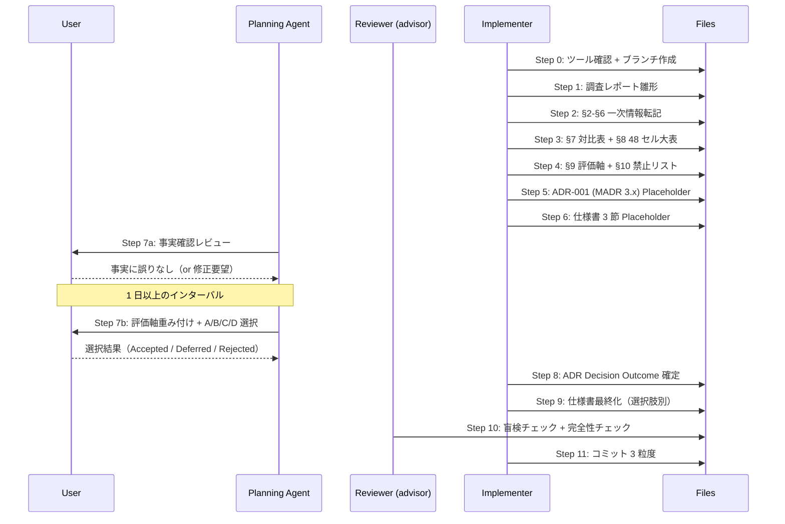
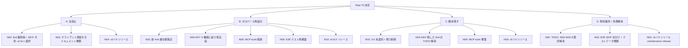

# N01: find 層必要性評価 + ADR 作成（改訂版）

> **NOTE**: このファイル `plans/pure-twirling-coral.md` は **N01 の実装計画書**（plan-mode 制約下の作業用ファイル）。
> ExitPlanMode 承認後は **このファイル自体を N01 計画書として維持**（リネームしない）。調査レポートは別ファイル `plans/board-phase-n-m01-find-rationale.md` として Step 1 で新規作成する（**計画書とレポートを分離する案 B 採用**、advisor 指摘反映済み）。
> N02+ 以降も本計画書を参照し、ADR 運用の前例として保存する。
>
> **改訂履歴**: devils-advocate + advocate による弁証法レビューを反映。主要変更点:
> - 選択肢 D（現状維持 + TODO 解消のみ）を追加 → A/B/C/D の 4 選択肢でフラット評価
> - ADR-001 を Michael Nygard 単純形式から **MADR 3.x 形式** に切替
> - Step 7 を 7a（事実確認）/ 7b（評価 + 選択）の 2 段階化
> - §4 に「実 API 検証未実施」の限界明示（PoC スコープ外の補償）
> - §8 大表を 36 → 48 セル、記入は「事実のみ」に限定、形容詞禁止リスト策定
> - §6 MCP 現状に「(a) 全廃止 / (b) 薄い BFF helper 残存 / (c) 維持」の 3 通りマトリクス追加
> - §22 補記を選択肢別扱い（A: 削除 / B: 全面書換 / C: 一部削除 / D: 維持 + TODO 済み注記）に明示

## Context — なぜこの計画が必要か

Phase L（v0.5.0）で api 層 22 リソースが Ransack 準拠となり、BOARD API のほぼ全フィルタを直接表現できる能力を獲得した。続く Phase M（v0.6.0）で CLI completion / board docs / /board:docs スキル等の仕上げが完了し、v0.6.0 リリース準備も整った。この過程で、Phase H 期に構築された find 高レベル層（12 メソッド / 15 ファイル / 3,945 行 / 47 E2E セット 193 ケース / SKIP 63）は api 層の成熟前提で設計されたまま据え置かれており、TODO(M25-M32) 由来の未復元 enrichment・post-filter が 4 ドキュメント系（Estimate/Order/Delivery/Receipt）に 8 箇所残存している。さらに、api 層が横断検索と同等の値を安価に提供し始めたことで、「find 層が今も本当に必要か」は未決状態にある。ユーザーは「全廃棄 + ゼロベース前提で問い直したい」と表明しつつもフラット評価を要求しており、弁証法レビューで「両者の論理的矛盾を解消するには D（現状維持 + 負債解消）を対抗馬として並べる必要がある」との結論に至った。本 N01 は純調査 + 文書化で A（全廃止）/ B（ゼロベース再設計）/ C（数本残す）/ D（現状維持 + 負債解消）の 4 選択肢を ADR-001 (MADR 3.x) で意思決定するための一次情報とトレードオフを整備する。コード変更ゼロ、想定工数 4-5 日。

## Goal / Success Criteria

- 成果物 3 点（調査レポート / ADR-001 (MADR 3.x) / 仕様書補記 3 節）が完成し、相互リンクが通ること
- A / B / C / **D** の trade-off が同一粒度（評価軸: UX / 実装コスト / 技術的負債解消 / MCP LLM 親和性 / v0.7.0 以降の拡張性 / v0.7.0 リリース時期影響）で並列分析されていること
- 「12 Find メソッド × 4 選択肢」の **48 セル** 対比マトリクスが欠損ゼロで埋まり、**各セルは「処理内容の事実」のみ**（極性形容詞禁止）で記入されていること
- §4「api 層の限界」に「本節は Explore 段階の一次情報 + 仕様ベース分析であり実 API 検証未実施」の限界注記があり、ADR Decision は「方向性合意」に留め N02 冒頭で再確認する段階的合意となっていること
- 調査レポートが Explore 済み一次情報（12 メソッド台帳、63 SKIP 内訳、api 層限界 5 件、MCP 12 tool 現状）を全て取り込んでいること
- 形容詞禁止リスト（例: 劣化/優秀/中途半端/理想的/改善見込み）がチェックリストに含まれ、grep で機械検証可能な状態になっていること
- Step 7 が 7a（事実確認）/ 7b（評価軸重み付け + 選択）の 2 段階化されていること

## Scope / Non-Goals

**In scope**:
- find 層現状の一次情報整理（12 メソッド台帳 / TODO 残 / E2E SKIP 実態）
- api 層 Ransack 対応マトリクスの再整理（Phase L 成果の棚卸し）
- **A/B/C/D 4 選択肢**の対比表と評価軸定義（6 軸）
- ADR-001 作成（**MADR 3.x 形式**、運用開始点）
- 仕様書 §7.9 / §8.5 / §22 への ADR-001 参照注記（選択肢別扱い明記）

**Out of scope**:
- PoC script 作成（ユーザー確定済み: スコープ外 → §4 に限界注記で補償）
- コード変更（削除 / 再設計 / リネーム）
- E2E テスト追加・削減
- N02+ の実装（決定結果に応じたコード変更は次マイルストーン）
- README_ja.md / api-reference.md の find 言及書き換え（N02+ で対応）
- CHANGELOG 更新（v0.7.0 リリース時にまとめて記載）

## 調査観点（5 観点）

### 観点 1: find 層の付加価値の現在地
12 メソッドそれぞれが api 層 Ransack 対応後も提供している固有価値を、Explore で得た台帳を元に 1 メソッドずつ検証。ClientName→ProjectID のような逆引き、enrichment、複数 status post-filter の 3 類型に分類し、api 層で代替可能かを判定する。**判定は「処理内容の事実」として記述し「有利/不利」の極性形容詞は使わない**。

### 観点 2: api 層の限界（find でしか困難な処理 5 件）
リソース横断逆引き / 複数 status 統一 post-filter / free-text 全文検索 / enrichment (join 的) / 複合 status post-filter の 5 件を各具体例（curl 相当コマンドと find 呼び出しの比較）で示し、真の「find でしか実現困難」を切り分ける。**本節冒頭に「実 API 検証未実施、机上分析である」旨の限界注記を明示**する。

### 観点 3: E2E テスト SKIP 実態（63/193, 32.6%）
cache-warm 依存 11 / データ 0 件 10 / テストデータ不足 33 / その他 9 の 4 カテゴリ別に、「find 層廃止で消える SKIP / 残る SKIP」を整理。**ただし「テストデータ不足 33」は find 層とは独立した環境依存負債のため、全選択肢共通として別カウント**。

### 観点 4: MCP 層への影響
tools.go の 12 tool 全てが find_* 経由。MCP の扱いは選択肢と独立に以下 3 通りの方針があり、各選択肢 × 方針の組合せで UX 影響を整理する:
- **(a) 全廃止 + LLM 丸投げ**: MCP は api_* 直呼び化、逆引き・enrichment は LLM 側で実装
- **(b) 薄い BFF helper 残存**: MCP server に薄い逆引きヘルパー関数を残し、tools.go 相当の API を維持
- **(c) 現状 find_* 維持**: MCP tool のシグネチャは変えず、内部実装のみ変更

### 観点 5: 技術的負債と保守コスト
TODO(M25-M32) 由来の 8 箇所 / 3,945 行 / 47 E2E セット という保守対象の大きさ、今後も Ransack 追加時に find 層追従が必要か、v0.7.0 以降の機能追加における find 層の拡張圧力を評価。**D 選択肢の評価軸として重要**。

## 成果物 1: 調査レポート `plans/board-phase-n-m01-find-rationale.md`

### ファイル構成（目次 + 各節の目的 + 行数下限）

```
§1   サマリ                                       (下限 15 行)
§2   find 層の現状台帳                            (下限 50 行)
§3   api 層 Ransack 対応マトリクス                (下限 30 行)
§4   api 層の限界（find でしか困難な処理 5 件）   (下限 80 行、冒頭に限界注記)
§5   E2E テスト SKIP 実態                         (下限 35 行)
§6   MCP 現状と 3 通り方針マトリクス              (下限 40 行)
§7   選択肢 A/B/C/D 対比表（4 列）                (下限 60 行)
§8   12 Find メソッド × 4 選択肢 扱い大表 (48 セル) (下限 50 行)
§9   意思決定フレームワーク（6 評価軸 + C/D 選定基準） (下限 40 行)
§10  フラット評価の立場表明 + 形容詞禁止リスト    (下限 25 行)
合計下限: 約 425 行（上限なし、内容優先）
```

### 各節の目的

- **§1 サマリ**: 4 選択肢の結論見出しのみ列挙。決定はユーザーレビューで行うため保留と明記。
- **§2 find 層の現状台帳**: Explore で得た 12 メソッド表を転記（ファイルパス / 付加価値 / TODO 列）。
- **§3 api 層 Ransack 対応マトリクス**: 18 リソース × 主要フラグ（_eq / _cont / _in / _gteq 等）の対応表。Phase L 成果の棚卸し。
- **§4 api 層の限界**: 冒頭に限界注記（実 API 検証未実施）。5 件について curl 相当 / find 相当の比較コード片 + クライアント側コスト（呼び出し回数・マージ処理）明示。
- **§5 E2E SKIP 実態**: 4 カテゴリ分布。find 層廃止で消える SKIP と残る SKIP を仕分け（「テストデータ不足 33」は別カウント）。
- **§6 MCP 現状と 3 通り方針マトリクス**: tools.go 12 tool 一覧 + 各 tool の find 依存 + (a)/(b)/(c) 3 通り方針の書換コスト比較。

- **§7 A/B/C/D 対比表（4 列、6 評価軸）**:

| 評価軸 | A: 全廃止 | B: ゼロベース再設計 | C: 数本残す | **D: 現状維持 + 負債解消** |
|---|---|---|---|---|
| 実装コスト | （事実記述） | （事実記述） | （事実記述） | （事実記述） |
| UX（LLM） | MCP クライアント側で逆引き実装（推定 N 行） | 未設計（N02 で策定） | X-Y メソッドを維持、残り Z メソッドは A と同じ | 現状どおり、enrichment 復元で向上 |
| 技術的負債 | find 層関連の 3,945 行削除 | 新規設計負債が発生 | X-Y 本維持、残り削除 | TODO 8 箇所解消 + 3,945 行維持 |
| MCP 影響 | (a)〜(c) 方針で差異、§6 参照 | 新 tool 体系 | 一部書換 | 変更なし |
| 工数見積 | 3-5 日 | 2-3 週 | 1-2 週 | 2-3 日（TODO 解消 + SKIP 仕分けのみ） |
| v0.7.0 リリース時期影響 | 間に合う | v0.8.0 送り可能性高 | v0.7.0 遅延リスク | 間に合う |

**記入規則**: 各セルは**事実（動詞 + 数値）**のみ。極性形容詞（劣化/改善/中途半端/理想的 など）は禁止（§10 禁止リスト参照）。

- **§8 48 セル大表**: 12 メソッド × A/B/C/D = 48 セル。各セルには以下のいずれかを記入:
  - 「削除」「維持」「再設計（新仕様）」「api 直呼びで代替可能」「TODO 解消して維持」「部分機能のみ維持」
  - **記入禁止**: 「有利」「不利」「中途半端」「理想的」などの極性形容詞
  - 末尾に「本大表は各選択肢の処理内容を並列記述したものであり、セル数集計による優劣判断は推奨しない（メソッド重要度が均等ではないため §9 重要度スコア併用）」の注記

- **§9 意思決定フレームワーク**:
  - 評価軸 6 件（UX / 実装コスト / 技術的負債解消 / MCP LLM 親和性 / v0.7.0 以降の拡張性 / v0.7.0 リリース時期影響）
  - 各軸の重み付けはユーザー判断に委ねる
  - **C（数本残す）の選定基準（AND 条件）**: (1) api 層単独で代替不可能 AND (2) MCP 実利用頻度上位 AND (3) TODO 負債が小さい
  - **メソッド重要度スコア**: 12 メソッドごとに「MCP call 頻度の想定 / 代替困難度 / 実利用可能性」の 3 軸で 1-3 点スコア化

- **§10 フラット評価の立場表明 + 形容詞禁止リスト**:
  - 本レポートは推奨を提示しない（フラット評価）
  - 「全廃棄+ゼロベース前提」発言との整合: D を 4 つ目の選択肢として明示的に追加することで、ユーザー発言の字義通りの解釈（A/B）とフラット評価の手続的公正性（D 対抗馬）を両立
  - **禁止語リスト**: 「劣化」「優秀」「中途半端」「理想的」「改善見込み」「有利」「不利」「望ましい」「望ましくない」「お勧め」「非推奨」（レポート内 grep で機械チェック）
  - 第三者盲検チェック: Phase 4 advisor または別 LLM に「このレポートは A/B/C/D のうちどれを推していると読めるか」を盲検で質問し、回答が「特定選択肢に偏らない」ことを確認

## 成果物 2: ADR `docs/adr/ADR-001-find-layer.md`（MADR 3.x 形式）

### MADR 3.x テンプレート

```markdown
---
status: "Proposed"  # Proposed → Accepted | Deferred | Rejected
date: 2026-04-XX
deciders: [youyo]
consulted: [調査レポート plans/board-phase-n-m01-find-rationale.md]
informed: []
---

# ADR-001: find 層の扱い方針

## Context and Problem Statement

- Phase L（v0.5.0）で api 層 22 リソース Ransack 準拠完了。
- find 高レベル層（internal/service/find/、12 メソッド、3,945 行、47 E2E セット 193 ケース、SKIP 63）は Phase H 期設計のまま未更新。
- TODO(M25-M32) 由来の enrichment / post-filter 未復元が 4 ドキュメント系 8 箇所残存。
- MCP tools.go の 12 tool が全て find_* 経由。
- ユーザー判断: 「全廃棄+ゼロベース前提で問い直したい」+ フラット評価要求 → D（現状維持 + 負債解消）を対抗馬として追加。
- **判断材料の限界**: 本 ADR は Explore 段階の一次情報 + 仕様ベース分析に基づき、実 API 検証（PoC）は未実施。最終確定は N02 冒頭で再確認する段階的合意とする。

## Decision Drivers

1. UX（LLM）: MCP クライアント側の複雑性
2. 実装コスト: 工数および新規バグ混入リスク
3. 技術的負債解消: TODO 8 箇所 / SKIP 63 の処理
4. MCP LLM 親和性: tool シグネチャの明快さ
5. v0.7.0 以降の拡張性: api 追加時の追従コスト
6. v0.7.0 リリース時期影響

## Considered Options

### A: 全廃止
find 層を全廃止し、MCP は api_* 直呼びに切り替え、クライアント側（LLM or MCP server 内 helper）で逆引き・enrichment を行う。
- Pros: find 層関連 3,945 行削除、TODO 8 箇所消滅、テスト保守対象縮減
- Cons: MCP UX 方針 (a)/(b)/(c) 選択が必要、(a) 採択時は LLM 側実装負担増

### B: ゼロベース再設計
find 層を api 層で実現困難な 5 件に特化した薄い層として再構築。
- Pros: UX 向上余地が大きい、api 層との責任分界が明確化
- Cons: 設計 + 実装コスト最大（2-3 週）、v0.7.0 に間に合わない可能性高（v0.8.0 送り前提）

### C: 数本残す
12 メソッドから付加価値が高い 3-5 本（AND 条件: api 単独代替不可 AND MCP 実利用頻度上位 AND 負債小）を選別して残し、他は廃止。
- Pros: 現実的な落としどころ、v0.7.0 にも間に合い得る
- Cons: 選定基準の客観性担保が必要、一部残存で複雑性は残る

### D: 現状維持 + 負債解消
find 層の構造は維持し、TODO(M25-M32) 8 箇所の enrichment / post-filter 復元と E2E SKIP の仕分けのみを実施。
- Pros: 既存 UX 温存、工数最小（2-3 日）、v0.7.0 に確実に間に合う
- Cons: find 層の本質的な存在意義問題が先送り、api 層追加時の追従負担継続

## Decision Outcome

（Placeholder — Step 7b のユーザーレビュー後に A / B / C / D のいずれかを採用し、理由を記述）

**段階的合意の原則**: 本 N01 では「方向性の合意」まで。最終確定は N02 冒頭の「実装前レビュー」で再確認する。

## Consequences

### Positive / Negative / Neutral
（選択結果に応じて記述）

### 再評価トリガ（後悔保険）
以下のいずれかに該当した場合、ADR-002 で本決定を再評価する:
- 実装着手から X マイルストーン完了時点で find 層呼び出し実績が想定を N% 下回る
- 選択した方針で v0.7.0 リリースが予定から X 週間以上遅延
- LLM 側の MCP 利用パターンが想定と大きく乖離

### N02+ で実施すべき事項
（選択結果に応じた次マイルストーンの骨子を箇条書き）

## References
- 調査レポート: plans/board-phase-n-m01-find-rationale.md
- Phase H アーカイブ: plans/archive/board-m29〜m33-*.md
- 仕様書: docs/specs/board_cli_mcp_ultra_detailed_design_ja.md §7.9 / §8.5 / §22
- MADR 3.x 仕様: https://adr.github.io/madr/
```

**Status 遷移**: `Proposed → (Accepted | Deferred | Rejected)` の 3 ルートを明示（M-8 反映）。Deferred は「再評価トリガ」で再検討、Rejected は「他の ADR で上書き」の運用。

## 成果物 3: 仕様書補記（選択肢別扱い明示）

### 対象節と選択肢別の扱い

| 節 | 行 | A: 全廃止 | B: ゼロベース | C: 数本残す | D: 維持 |
|---|---|---|---|---|---|
| §7.9「internal/service/find」 L395 | 395 周辺 | 「廃止（ADR-001）」2-3 行に圧縮、旧本文は git 履歴 | 「ADR-001 により新設計、§22 参照」 | 「一部削除（ADR-001）、残存メソッド一覧」 | 「TODO(M25-M32) 解消済、継続維持」 |
| §8.5「find high-level」 L478 | 478 周辺 | 「廃止」 + MCP 新方針（(a)/(b)/(c)）の章へ誘導 | 「新仕様（§22 参照）」 | 「一部削除」 + 残存メソッド一覧 | 既存記述維持 + TODO 解消告知 |
| §22「board find high-level 設計」 L1142 本体章 | 1142 本体章 | **本体を「廃止（ADR-001 参照、コミット XXX で削除）」2-3 行に圧縮**、旧本体は plans/archive/ に退避 | **本体を新仕様で全面書換**（N02+ 範囲）、本 N01 では「§22.X ADR-001 による扱い変更」注記のみ追加 | **本体から削除対象メソッドの記述を削り、残す分を章として維持** | 本体維持、章末に「TODO(M25-M32) 解消済」注記追加 |

**本 N01 の扱い**: A/B/C/D 未決のため Step 6 では**全選択肢共通の Placeholder**（「ADR-001 参照、決定後に本節を更新」）のみを差し込む。Step 9 で決定後の最終化を実施。

## テスト設計書（TDD 観点）

**注記**: N01 は純調査 + 文書化タスクのため自動テスト実装はなし。以下の完全性チェックをテスト代替とする。

### 完全性チェック項目
1. **選択肢対比表の欠損チェック**: §8 大表 48 セルが全て埋まっている（空白 / TBD / N/A 禁止）
2. **形容詞禁止リストの機械チェック**: §10 の禁止語リストを `grep -n -E "(劣化|優秀|中途半端|理想的|改善見込み|有利|不利|望ましい|望ましくない|お勧め|非推奨)"` で検索し 0 件であること
3. **A/B/C/D 列の文字数バランス**: §7 対比表で各列の文字数が ±30% 以内（補助指標、形容詞禁止チェックが主）
4. **リンク生存チェック**: ADR-001 ↔ 調査レポート ↔ 仕様書各節の相互リンク
5. **Markdown 構文チェック**: `markdownlint` 通過（Step 0 前に導入確認、未導入なら手動目視）
6. **一次情報の取り込みチェック**: Explore 成果（12 メソッド / 5 限界 / 63 SKIP / 12 MCP tool）が全て調査レポートに転記されている
7. **半盲検チェック（偏り検知）**: **別セッションの Claude Code または別 LLM（web 版 ChatGPT / Gemini / 別プロファイルの Claude 等）** に調査レポートを貼り付けて「このレポートは A/B/C/D のうちどれを推していると読めるか」を質問。現セッションの advisor は会話全体（D 追加決定 + 全採用の履歴）を自動参照するため真の盲検は不可能（advisor 指摘反映）。本チェックは「偏り検知のヒント」として扱い、真の盲検ではなく半盲検として位置づける

## 実装手順（Step 0 〜 11）

### Step 0: 前提確認 & ツール確認 & ブランチ作成
- コマンド:
  ```bash
  # v0.6.0 タグ配信が完了しているか確認（advisor 指摘反映）
  git tag | grep v0.6  # v0.6.0 が存在すること
  # Phase N ロードマップファイルが git に入っているか確認（未コミットなら先にコミット）
  git status plans/board-phase-n-roadmap.md
  # ツール確認
  which markdownlint lychee  # 未導入なら brew install markdownlint-cli lychee
  # ブランチ作成
  git checkout -b phase-n-m01-find-rationale
  ```
- 依存: なし
- 備考: v0.6.0 未リリースなら Phase M 完了確認を優先する

### Step 1: 調査レポート雛形作成
- 対象: `plans/board-phase-n-m01-find-rationale.md`
- 作業: §1-§10 の見出し + front-matter のみの空骨格
- 依存: Step 0

### Step 2: §2-§6 に Explore 済みデータ転記
- 対象: `plans/board-phase-n-m01-find-rationale.md`
- 作業: 既取得の一次情報（12 メソッド台帳 / api 層 Ransack マトリクス / api 層限界 5 件 + 限界注記 / SKIP 63 内訳 + テストデータ不足分離 / MCP 12 tool + 3 通り方針マトリクス）を転記
- 依存: Step 1

### Step 3: §7 対比表（4 列、6 評価軸）+ §8 大表（48 セル）作成
- 対象: `plans/board-phase-n-m01-find-rationale.md`
- 作業:
  - §7: A/B/C/D 4 列、6 評価軸の対比表。セルは事実記述のみ
  - §8: 12 メソッド × 4 選択肢 = 48 セルを記入。末尾に「セル数集計での優劣判断は非推奨」注記
  - 48 セル欠損チェック実行
  - 形容詞禁止リストで grep 実行、0 件を確認
- 依存: Step 2

### Step 4: §9 評価軸定義 + C 選定基準 + §10 フラット評価立場表明 + 禁止リスト
- 対象: `plans/board-phase-n-m01-find-rationale.md`
- 作業:
  - §9: 6 評価軸定義、C 選定 AND 条件、メソッド重要度スコア
  - §10: フラット評価宣言、禁止語リスト明示、第三者盲検手続き
- 依存: Step 3

### Step 5: ADR-001 (MADR 3.x) Placeholder 版作成
- 対象: `docs/adr/ADR-001-find-layer.md`（新規ディレクトリ + ファイル）
- 作業:
  - MADR 3.x テンプレートで Status: Proposed として作成
  - Considered Options に A/B/C/D 全 4 案を各 Pros/Cons で並列記述
  - Decision Outcome は Placeholder、段階的合意の原則を明記
  - 再評価トリガ（後悔保険）セクション追加
  - Status 遷移 (Proposed → Accepted|Deferred|Rejected) を明示
- 依存: Step 4

### Step 6: 仕様書 3 節の補記（Placeholder）
- 対象: `docs/specs/board_cli_mcp_ultra_detailed_design_ja.md`
- 作業: §7.9 / §8.5 / §22 に共通 Placeholder「ADR-001 参照、決定後に本節を更新」を差し込み。選択肢別の扱いマトリクスは Step 9 で Decision 反映時に適用
- 依存: Step 5

### Step 7a: ユーザーレビュー 第1段階（事実確認）
- 対象: 対話
- 作業:
  - 調査レポート §2-§6（一次情報）をユーザーに提示
  - 「事実に誤りがないか」「MCP 3 通り方針の想定は妥当か」のみ確認
  - 評価や選択は求めない
- 依存: Step 6
- **セッション境界**: Step 7a 完了時点で Implementer はセッションを終了する。**Implementer はインターバル中 sleep せず、ユーザーが別セッションで Step 7b を明示的に開始するのを待つ**（advisor 指摘反映、Implementer が自動 sleep しないよう明記）

### Step 7b: ユーザーレビュー 第2段階（評価軸重み付け + 選択）
- 対象: 対話
- 作業:
  - **ユーザーが熟考期間（推奨 1 日以上）を経た後に本ステップを開始する**
  - 調査レポート §7-§9（対比表 + 大表 + 意思決定フレームワーク）をユーザーに提示
  - 6 評価軸の重み付けをユーザーと共同で決定
  - A/B/C/D から選択（または Deferred / Rejected）
- 依存: Step 7a + ユーザーによる明示的な Step 7b 開始指示

### Step 8: ADR-001 Decision Outcome 確定
- 対象: `docs/adr/ADR-001-find-layer.md`
- 作業:
  - Status を選択結果に応じて Accepted / Deferred / Rejected に変更
  - Decision Outcome / Consequences（Positive / Negative / Neutral / 再評価トリガ / N02+ 事項）を確定
- 依存: Step 7b

### Step 9: 仕様書補記の最終化（選択肢別）
- 対象: `docs/specs/board_cli_mcp_ultra_detailed_design_ja.md`
- 作業: §7.9 / §8.5 / §22 を選択肢別扱いマトリクスに従って更新:
  - A 採択: §22 本体を 2-3 行に圧縮（旧本体は git 履歴で保存）
  - B 採択: §22 章末に「§22.X ADR-001 による扱い変更」注記のみ追加（全面書換は N02+）
  - C 採択: §22 から削除対象メソッド記述を削り、残す分を章として維持
  - D 採択: §22 章末に「TODO(M25-M32) 解消済」注記追加
- 依存: Step 8

### Step 10: 完全性チェック実行
- 作業:
  - 48 セル欠損チェック
  - 形容詞禁止リスト grep
  - リンク生存チェック
  - `markdownlint` or 手動目視
  - **別セッション / 別 LLM での半盲検チェック**（advisor 指摘反映、現セッションの advisor は履歴が丸見えのため不適）
- 依存: Step 9

### Step 11: コミット & ADR 運用判断
- コミット 3 粒度（advocate 判断で M-4 却下採用）:
  1. `docs(plans): N01 find 層必要性評価レポート初版`
  2. `docs(adr): ADR-001 find 層 Placeholder (MADR 3.x) + 仕様書補記 Placeholder`
  3. `docs(adr): ADR-001 find 層 Decision 確定（<選択肢>） + 仕様書最終化`
- ADR 運用ルールの README 追記は ADR-002 発生時点で ADR-000 メタ ADR として立項（L-3 却下だが自然な運用に移行）
- 依存: Step 10

## アーキテクチャ検討

- **ADR 命名**: `ADR-NNN-<slug>.md`（ゼロ埋め 3 桁、kebab-case slug）
- **ADR 形式**: **MADR 3.x**（Considered Options + Decision Drivers + Decision Outcome + Consequences）
- **調査レポート命名**: `plans/board-phase-n-m{NN}-{slug}.md`
- **ブランチ命名**: `phase-n-m01-find-rationale`（単一文字前ハイフン回避済み）
- **配置**: `docs/adr/` 新設、`.gitkeep` 不要（ADR-001 自体がファイル）
- **Status 遷移**: `Proposed → (Accepted | Deferred | Rejected)`

## リスク評価

| リスク | 重大度 | 対策 |
|---|---|---|
| フラット評価宣言と実態の乖離 | 中 | §10 形容詞禁止リスト + grep 機械チェック + advisor 盲検 |
| D 追加で選択肢が 4 つになり意思決定が拡散 | 中 | §9 で 6 評価軸 + メソッド重要度スコアを共同定義、Step 7b で重み付けを構造化 |
| 仕様書 §22 本体書換で既存文脈を破壊 | 中 | Step 9 で選択肢別扱いマトリクスに従い、A/C は段階的縮小（git 履歴で復元可能） |
| ADR 初運用で MADR 3.x 形式が他の ADR-002+ に伝播 | 小 | ADR-001 自体が運用ルールとなる、ADR-002 発生時点で ADR-000 メタ ADR で明文化 |
| Step 7a/7b のインターバルでユーザー離脱 | 中 | Step 7a 終了時に「翌日〜3 日後に 7b 実施」を明示予定化 |
| 48 セル大表で A/B/C/D の扱いが類似になり差別化困難 | 小 | §8 記入規則（処理内容の事実のみ、極性形容詞禁止）+ §9 重要度スコアで差別化 |
| v0.7.0 リリース時期への影響（B 採択時 v0.8.0 送り） | 中 | §7/§9 に「v0.7.0 リリース時期影響」評価軸、ADR Consequences に明示 |
| PoC 未実施に起因する §4 の根拠薄弱性 | 中 | §4 冒頭に限界注記、ADR Decision を段階的合意（N02 冒頭再確認）に設計 |
| MCP 3 通り方針 (a)/(b)/(c) の組合せ爆発 | 小 | 選択肢と MCP 方針は直交関係として §6 で並列整理、Decision Outcome で組合せを選択 |
| 決定後の N02+ 着手判断で再ブレ | 中 | ADR の再評価トリガ + Consequences に「N02+ でやること」を箇条書き化 |

## シーケンス図

### 主要フロー



### A/B/C/D 分岐による N02+ 概要



## チェックリスト（5 観点 27 項目）

### 1. 要件理解（4 項目）
- [x] 目的明確化: find 層必要性評価 + ADR 作成
- [x] 制約確認: コード変更ゼロ、純調査、工数 4-5 日（改訂後）
- [x] 技術スタック確認: Go / cobra / docs Markdown
- [x] 既存実装調査: Explore で 12 メソッド / 47 E2E / 5 限界特定済み

### 2. 調査・分析（5 項目）
- [x] 既存コードベース調査: Explore で internal/service/find/ 15 ファイル特定
- [x] 類似実装パターン: Phase H アーカイブプラン 5 本確認
- [x] 技術的制約: Rate limit / MCP tools.go 依存 / PoC スコープ外の限界
- [x] Web 調査: ADR 形式 MADR 3.x 採用確定
- [x] ドメイン知識: BOARD API Ransack 対応状況（Phase L 成果）

### 3. アプローチ比較（5 項目）
- [x] 複数アプローチ: A/B/C/D の 4 選択肢（D 追加済み）
- [x] 評価マトリクス: §7 対比表（4 列 × 6 評価軸）
- [x] トレードオフ明示: 事実記述のみ、極性形容詞禁止
- [x] 推奨選定: フラット評価のため推奨なし（§10 で明示 + 盲検チェック）
- [x] 48 セル完全性: §8 大表で欠損 + 禁止語 grep チェック

### 4. TDD 設計（6 項目 — 調査タスクのため完全性チェックで代替）
- [x] 正常系テスト: 「調査成果物の完全性チェック」7 項目で代替
- [x] 異常系テスト: リンク切れチェック + 形容詞禁止 grep
- [x] エッジケース: 48 セル欠損 / A/B/C/D 粒度偏り / 禁止語混入
- [x] Mock 戦略: N/A（ドキュメント）
- [x] シーケンス図: Mermaid 2 本作成
- [x] TDD 実装順序: N/A（Red-Green-Refactor は文書では非該当）

### 5. 推奨事項提示（7 項目）
- [x] 推奨アプローチ: フラット評価のため §10 で「推奨なし」明示
- [x] トレードオフ明示: §7 対比表 + §8 48 セル大表
- [x] フェーズ分け実装計画: Step 0-11 (Step 7 は 7a/7b に分割)
- [x] リスクと対策: 10 項目のリスク表
- [x] 技術的検証項目: PoC スコープ外 + §4 限界注記 + ADR 段階的合意
- [x] ドキュメント更新: 仕様書選択肢別扱い明示
- [x] Next Action: この計画承認後の流れを明記

合計: **27 項目（テスト 6 項目は完全性チェックで充当）**

## Verification

### コマンド
```bash
# Markdown 構文
markdownlint plans/board-phase-n-m01-find-rationale.md docs/adr/ADR-001-find-layer.md

# リンク生存
lychee plans/board-phase-n-m01-find-rationale.md docs/adr/ADR-001-find-layer.md

# 48 セル大表の行数確認
grep -c "^|" plans/board-phase-n-m01-find-rationale.md

# 形容詞禁止リスト機械チェック
grep -n -E "(劣化|優秀|中途半端|理想的|改善見込み|有利|不利|望ましい|望ましくない|お勧め|非推奨)" plans/board-phase-n-m01-find-rationale.md
# 期待: 0 件（§10 の禁止リスト記述部分を除く）
```

### 手動検証
- §7 対比表 A/B/C/D 各列の文字数バランス目視
- §10 フラット評価宣言と禁止リストの明示性確認
- ADR-001 → 調査レポート → 仕様書 の 3 者相互リンクをブラウザプレビュー等で確認
- Step 10 で advisor への盲検質問「A/B/C/D どれを推しているか」→ 偏りなし回答

## ドキュメント更新

- `README.md` or `CLAUDE.md`: ADR 運用ルールの 1 段落追加は **ADR-002 発生時点で ADR-000 メタ ADR として立項**（L-3 方針）
- `docs/api-reference.md` L205, 220, 261, 274, 287, 830-839 の find 言及: ADR 決定後に必要なら注記追加 → **本 N01 スコープ外、N02+ で対応**
- `README_ja.md` L11, 75-81, 120-129, 147, 201, 216, 222 の find 言及: 同上 → **N02+ スコープ**
- `CHANGELOG.md`: N01 はリリース単位ではないので不要 → **v0.7.0 リリース時に Phase N まとめで記載**

## Next Action（この計画の承認後）

1. Step 0: 前提確認（v0.6.0 タグ / Phase N ロードマップ状態）+ ツール確認 + ブランチ作成
2. **本ファイル `pure-twirling-coral.md` は計画書として維持**（リネームしない）
3. Implementer Agent に委譲して Step 1-6 を実施（調査レポート `plans/board-phase-n-m01-find-rationale.md` を Step 1 で**新規作成**）
4. Step 7a: ユーザーレビュー事実確認 → Implementer セッション終了 → ユーザー熟考（推奨 1 日以上）→ Step 7b: ユーザー主導で評価 + A/B/C/D 選択
5. Step 8-11: ADR Decision 確定 + 仕様書最終化（選択肢別）+ 完全性チェック（別 LLM 半盲検含む）+ コミット 3 粒度
6. `/devflow:plan` を N02+ に対して実行
