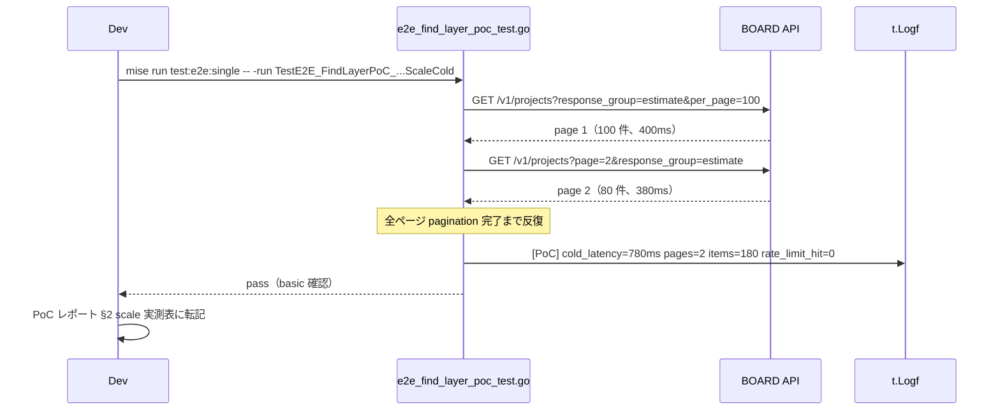
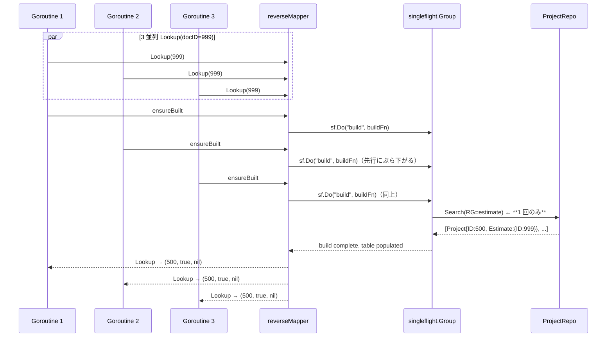
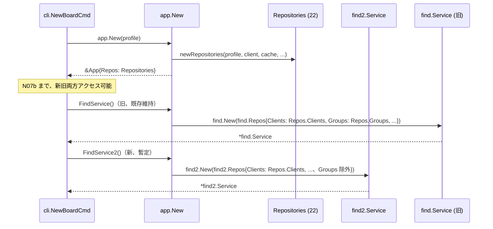

# N03: Document PoC + find2/ パッケージ骨格 + 共通ヘルパー

## Context

ADR-001（2026-04-25 Accepted、B 採択）により `internal/service/find/` をゼロベース再設計する方針が確定した。N02（`plans/wondrous-skipping-snowglobe.md`、Ready for Review）で新 find 層の API/DSL/5 件特化/移行戦略/N03-N10 骨子が固まった。

本 N03 はゼロベース再設計の **実装フェーズ初動** であり、N04（FindClient + FindVendor）以降の前提となる土台を確立する。成果物は以下 4 点:

1. **Document PoC レポート**（`plans/board-phase-n-m02-document-poc-report.md`） — 案 A/B/ハイブリッドの最終判定 + projects RG scale 実測
2. **find2/ パッケージ骨格** — Service struct + Repos + New + 11 repo interface、Query/Result 型、共通ヘルパー
3. **共通ヘルパー移植・新規** — text_match 移植、`filterByStatuses` ジェネリクス、`resolveClientAndProject` errgroup 版、`reverseMapper` + singleflight 骨格
4. **CI/dep 整備** — `go get golang.org/x/sync`、`mise run test:race` タスク追加、BOARD API spot check

> 実装範囲は「骨格 + 共通ヘルパー」まで。`FindClient` / `FindProject` / `FindEstimate` 等の具象メソッドは N04 以降の範囲。
> 工数目安: **2.5-3.5 日**（N02 §9.1 の 2-3 日に弁証法レビューの Step 5 工数補正 +0.3-0.5 日、Step 9 rename drill 追加 +0.2 日を加算）。

## スコープ

### In Scope
- `plans/board-phase-n-m02-document-poc-report.md` 新規作成（既存 dump 根拠提示 + 実 API scale 実測結果）
- `internal/boardapi/e2e_find_layer_poc_test.go` 新規（projects.Search RG=estimate/order/delivery/receipt の scale 実測専用 E2E）
- `go.mod` / `go.sum` 更新（`go get golang.org/x/sync@latest`）
- `internal/service/find2/service.go` — `Service` struct + `Repos` 集約 + `New()` + 11 repo interface
- `internal/service/find2/types.go` — 11 個の `FindXxxQuery` 型、対応する `XxxResult` 型、`FindCommonOpts`、`validate()` メソッド
- `internal/service/find2/text_match.go` — 旧 `find/text_match.go` 移植 + `Text` 入力の trim/空文字処理
- `internal/service/find2/filter.go` — `filterByStatuses[T]` ジェネリクス、`filterByStatus` 単数版
- `internal/service/find2/resolver.go` — `resolveClientAndProject`（errgroup 版）、`resolveVendorAndProject`（errgroup 版）
- `internal/service/find2/reverse_map.go` — `documentToProjectMapper`（sync.Map + singleflight.Group、lazy build）
- `internal/service/find2/helpers_test.go` — 旧 stub 方式踏襲、11 repo の stub + 共通 assertion ヘルパー
- `internal/service/find2/*_test.go` — ヘルパー 4 種 unit test（`-race` で検証）
- `internal/app/app.go`（or `container.go`）に `FindService2()` 暫定メソッド追加
- `mise.toml` に `[tasks."test:race"]` タスク追加（`go test -race -count=1 ./...`）
- BOARD API spot check 結果を PoC レポート末尾に付記（N02 §10-10 対応）

### Out of Scope
- 具象 Find メソッド実装（`FindClient` / `FindProject` / Document 4 種等）は **N04-N07a**
- 旧 `internal/service/find/` の削除は **N07b**
- CLI / MCP 書換は **N07c / N08**
- E2E テスト再構築（11 メソッド × 5 特化）は **N09**
- Entity 拡張（案 B / ハイブリッド採用時のみ）は PoC 判定に応じて N03 末尾 or N04 冒頭で扱う

### 前提
- Phase M 完了（v0.6.0 リリース済）
- ADR-001 Accepted（B 採択）
- N02 設計書（wondrous-skipping-snowglobe.md）Ready for Review
- `tmp/e2e-artifacts/` に最新 4 日前の Document dump 保存済（再取得不要）

## テスト設計書

### 正常系ケース

| ID | テスト名 | 入力 | 期待出力 | 備考 |
|----|---|---|---|---|
| N03-T01 | `TestContainsText_CaseInsensitiveMatch` | text="abc", fields=["ABC Corp"] | `true` | 旧 `find/text_match_test.go` 完全踏襲 |
| N03-T02 | `TestContainsText_EmptyFields_ReturnsFalse` | text="x", fields=[] | `false` | 境界 |
| N03-T03 | `TestDerefString_NilInput_ReturnsEmpty` | nil | `""` | 境界 |
| N03-T04 | `TestFilterByStatuses_MatchesMultipleStatuses` | items=[{S:"a"},{S:"b"},{S:"c"}], statuses=["a","c"] | `[{S:"a"},{S:"c"}]` | ジェネリクス正常系 |
| N03-T05 | `TestFilterByStatuses_EmptyStatuses_ReturnsOriginal` | statuses=[] | 入力そのまま | 上位で空判定する契約 |
| N03-T06 | `TestFilterByStatuses_NoMatch_ReturnsEmpty` | statuses=["z"] | `[]` | 空スライス返却 |
| N03-T07 | `TestFilterByStatuses_Generic_WithEstimateEntity` | items=`[]EstimateEntity` | 正しく絞り込み | 型パラメータの実型検証 |
| N03-T08 | `TestResolveClientAndProject_BothSucceed` | stub 成功 | `(*Client, *Project)` 両 non-nil | 並列 |
| N03-T09 | `TestResolveVendorAndProject_BothSucceed` | 同上 Vendor 版 | 同上 | 並列 |
| N03-T10 | `TestReverseMapper_FirstCall_BuildsTable` | projects RG=estimate 2 件 | documentID→projectID マップ構築 | lazy build |
| N03-T11 | `TestReverseMapper_CacheHit_SkipsBuild` | 2 回目呼出し | stub の Search が 1 回のみ呼ばれる | 再構築なし |
| N03-T12 | `TestReverseMapper_Lookup_HitsProjectID` | docID=999 | projectID=500 | ヒット |

### 境界値ケース

| ID | テスト名 | 入力 | 期待出力 | 備考 |
|----|---|---|---|---|
| N03-T13 | `TestFilterByStatuses_ExactlyTenStatuses` | statuses=10 要素 | 正常動作 | 上限 10（N02 §3.2） |
| N03-T14 | `TestFilterByStatuses_ElevenStatuses_Rejected` | statuses=11 要素 | validation error（`at most 10 statuses allowed`） | `types.go` validate() で検出 |
| N03-T15 | `TestQueryValidate_StatusAndStatusesBothSet_Error` | `Status:"x", Statuses:["y"]` | error（`Status and Statuses are mutually exclusive`） | N02 §3.2 ルール |
| N03-T15a | `TestFindCommonOpts_LimitZero_AllowedAsUnlimited` | `Limit:0` | no error（0=無制限として確定ルール化） | advocate Must #10 対応 |
| N03-T15b | `TestFindCommonOpts_LimitNegative_Rejected` | `Limit:-1` | validation error（`limit must be >= 0`） | advocate Must #10 対応 |
| N03-T16 | `TestQueryValidate_EmptyQuery_Error` | `FindProjectQuery{}` | error（`at least one field required`） | 全 Find 共通 |
| N03-T17 | `TestResolveClientAndProject_ZeroIDs_ReturnsNil` | clientID=0, projectID=0 | `(nil, nil)`（no-op） | 呼出しスキップ |

### 異常系ケース

| ID | テスト名 | 入力 | 期待出力 | 備考 |
|----|---|---|---|---|
| N03-T18 | `TestResolveClientAndProject_ClientFails_ReturnsProjectOnly_LogsWarn` | Client stub error, Project stub OK | `(nil, *Project)` + `slog.Warn` 1 回 | 非致命（N02 §4.3） + 観測性（advocate Should #4） |
| N03-T19 | `TestResolveClientAndProject_BothFail_ReturnsBothNil_LogsWarn` | 両 stub error | `(nil, nil)` + `slog.Warn` 2 回 | enrichment 非致命 + 観測性 |
| N03-T20 | `TestResolveClientAndProject_CtxCancel_ReturnsEarly` | `ctx.Cancel()` 直後に呼出し | goroutine が速やかに return | errgroup ctx 伝播 |
| N03-T21 | `TestResolveClientAndProject_DeadlineExceeded_Returns` | `ctx.WithTimeout(1ms)` + sleep stub | timeout 発火で return | deadline |
| N03-T22 | `TestReverseMapper_SearchError_BubblesUp` | projects.Search → error | error を caller へ伝播 | singleflight failure 伝播 |
| N03-T23 | `TestReverseMapper_ConcurrentCalls_SingleBuild_NoRace` | 10 goroutine 同時呼出し | stub Search 回数 = 1 | singleflight 検証、`-race` で race なし |
| N03-T24 | `TestReverseMapper_LookupMiss_ReturnsZero` | docID=99999（未登録） | projectID=0, ok=false | §5.3 ProjectID=0 フォールバック |

### 逆マッピング singleflight テストの具体形（Red）

```go
// find2/reverse_map_test.go（Red フェーズ擬似コード）
func TestReverseMapper_ConcurrentCalls_SingleBuild_NoRace(t *testing.T) {
    callCount := int32(0)
    mockP := &stubProjectRepo{
        searchFunc: func(ctx context.Context, o boardapi.ProjectListOptions, _ repository.ReadOptions) ([]boardapi.ProjectEntity, error) {
            atomic.AddInt32(&callCount, 1)
            time.Sleep(50 * time.Millisecond) // 模擬 I/O 遅延
            return []boardapi.ProjectEntity{{ID: 500, Estimate: &boardapi.DocumentSummary{ID: 999}}}, nil
        },
    }
    m := newReverseMapper(mockP, "estimate")

    var wg sync.WaitGroup
    for i := 0; i < 10; i++ {
        wg.Add(1)
        go func() { defer wg.Done(); _, _ = m.Lookup(ctx, 999, repository.ReadOptions{}) }()
    }
    wg.Wait()

    if got := atomic.LoadInt32(&callCount); got != 1 {
        t.Errorf("singleflight failed: want 1 build, got %d", got)
    }
}
```

### PoC レポート検証項目（E2E scale 実測）

| 指標 | 測定方法 | 合格基準 |
|---|---|---|
| project_id/client_id 実在性（再確認） | `go test -tags e2e -run 'TestE2E_Estimates_M53_Get' ./internal/boardapi/` | 返却 JSON に `project_id` なし（案 A 確定の根拠） |
| cold cache scale（estimate） | `go test -tags e2e -run 'TestE2E_FindLayerPoC_Projects_RG_Estimate' ./internal/boardapi/` | cold start < 5s、pagination 回数 < 3 |
| rate limit hit | scale 実測中の 429 発生回数 | 0 回（3 req/sec 順守） |
| **boardapi retry 発動回数**（advocate Must #8） | test 内 `retryCount` を ctx.Value で計測、`t.Logf` に出力 | **0 回**（1 回でも発動したら PoC 再実施、scale 結果は retry で歪むため無効） |
| warm cache scale | 同テスト 2 回目実行時 | cold の 10% 以下のレイテンシ |

### Refactor 対象（N03 末尾 or N04 冒頭）

- `resolveClientAndProject` の errgroup 型共通化（Client/Vendor 両方を type parameter で統一）
- `Query.validate()` メソッドを types.go 内で統一（Status/Statuses 排他チェック、Statuses 10 要素上限、空クエリ検出）
- reverseMapper の `DocKey` 抽出 closure を Document 4 種で統一（N06 で確定）

## 実装手順

### Step 1: BOARD API spot check + PoC 実施 + レポート作成（0.6 日）

**対象ファイル**:
- 新規: `plans/board-phase-n-m02-document-poc-report.md`
- 新規: `internal/boardapi/e2e_find_layer_poc_test.go`

**概要**:
0. **BOARD API spot check**（**冒頭に前倒し**、advocate Must #13 対応、0.1 日）
   - BOARD API 公式 developer portal / changelog（2026-04 〜 現時点）を確認
   - Document 4 種 / projects / clients の API 仕様に Phase L（M49-M57）後の変更があるか確認
   - **Critical 仕様変更（例: projects の response_group 廃止、Document Entity 破壊的変更）発覚時は Step 2 以降着手せず N03 停止 gate**、ADR-001 Consequences に記録して Leader 再判断
   - 変更なし or 軽微なら PoC 本実施へ進行
1. 既存 dump（`tmp/e2e-artifacts/estimates_*.json` 等）から `project_id`/`client_id` 非存在を再確認（grep + レポートに引用）
2. `e2e_find_layer_poc_test.go` に以下 E2E を追加（`//go:build e2e`）:
   - `TestE2E_FindLayerPoC_Projects_RG_Estimate_ScaleCold` — cold cache で projects.Search(RG="estimate") 実行、レイテンシ・pagination 回数・rate limit エラー有無・**boardapi retry 発動回数**（advocate Must #8）を `t.Logf` で記録
   - 同 Order/Delivery/Receipt 版（計 4 テスト）
   - **retry 計装手段**（advisor #2 対応）: 以下のいずれかを選択し PoC レポート §2 に採用理由を明記
     - (a) **推奨**: `internal/boardapi/retry.go` に「ctx.Value 経由で retry 発動回数を書き込む read-only instrumentation」を追加（behavior change なし、`type retryCounterKey struct{}` + `atomic.Int32` を ctx に注入、既存 retry ループ内で `counter.Add(1)` のみ）
     - (b) 代替: response タイムスタンプを観測し「単発呼出しの妥当レイテンシ上限（3s）を超過」した場合に retry 発動と推定（計装は不要だが誤検出リスクあり）
   - **事前 rate limit budget チェック**（advisor #6 対応、0.05 日）: 実測前に `boardapi.Get("/v1/clients?per_page=1")` を 1 回実行し、レスポンスヘッダ `X-RateLimit-Remaining`（または相当）が 2500 以上であることを確認。不足時は実施を 1 日延期
3. `mise run test:e2e:single -- -run TestE2E_FindLayerPoC_Projects_RG_Estimate_ScaleCold`（rate limit 配慮で 1 種類ずつ + 手動 sleep 10s）
4. **retry 発動 1 回以上 → PoC 再実施**（30 分以上レートリミット bucket を回復させてから再試行）
5. PoC レポートに以下セクション記載:
   - §0 BOARD API spot check 結果（changelog / 仕様ページ確認日時 + Critical 変更の有無）
   - §1 project_id 実在性結論（案 A 確定 or 第 3 ケース移行）
   - §2 scale 実測表（4 リソース × cold/warm、retry 発動回数列を必ず含める、retry 計装手段 (a)/(b) の選択理由を記録）
   - §3 singleflight 要否判断（cold > 5s なら必要、< 5s でも concurrent 抑制目的で採用、retry 発動時は scale 値は無効）
   - §4 **案採択確定（A / B / ハイブリッド）** — **案 A 以外確定時は N03 残り Step を即時停止**、Step 3 で作成予定の types.go の `EstimateResult.ProjectID int` / `OrderResult.ProjectID int` / `DeliveryResult.ProjectID int` / `ReceiptResult.ProjectID int` の 4 Result 型 shape 見直しが N04 冒頭スコープに入る（工数 +2-3 日）。この停止条件は**実装時に softening 不可**
   - §5 **案 B / ハイブリッド時の影響範囲棚卸し**（§4 で案 A 以外確定時のみ埋める、平時は "N/A 案 A 確定" と記載）
   - §6 N07b rename 事前検証（Step 8 drill で追記）

**依存**: なし（N03 最初のタスク）

**リスク**:
- scale 実測中の rate limit hit → `mise run test:e2e:single` で 1 種類ずつ + sleep 10s 手動 delay
- retry 発動で scale 値が偽陽性/偽陰性化 → 再実施で対応（上記手順 4）
- Critical API 仕様変更 → Step 0 spot check で検出、N03 停止

### Step 2: go.mod 更新（0.1 日）

**対象**:
- `go.mod` / `go.sum`

**手順**:
```bash
go get golang.org/x/sync@latest
go mod tidy
```

**確認**:
- `go.mod` の `require` ブロックに `golang.org/x/sync vX.Y.Z` 出現
- `go test ./...` がまだ通る（find2 未作成段階）

**依存**: Step 1 の案採択確定後（案 A 確定なら即実施、ハイブリッドなら Entity 拡張要否に応じて singleflight 要否再評価）

### Step 3: find2/ パッケージ骨格（0.5 日）

**対象**（新規）:
- `internal/service/find2/service.go`
- `internal/service/find2/types.go`

**service.go の構造**（擬似）:
```go
package find2

import (
    "context"
    "github.com/youyo/board/internal/boardapi"
    "github.com/youyo/board/internal/repository"
)

// 11 個の小さい interface（FindGroup 削除、既存 find.ClientRepo 等を踏襲）
type (
    ClientRepo        interface { /* GetByID, Search(ClientListOptions) */ }
    ClientBranchRepo  interface { /* Search(ClientBranchListOptions) */ }
    ContactRepo       interface { /* Search(ContactListOptions) */ }
    ProjectRepo       interface { /* GetByID, GetByIDWithGroup, Search(ProjectListOptions) */ }
    EstimateRepo      interface { /* GetByDocumentID, Search(EstimateListOptions) */ }
    OrderRepo         interface { /* GetByDocumentID, Search(OrderListOptions) */ }
    DeliveryRepo      interface { /* GetByDocumentID, Search(DeliveryListOptions) */ }
    ReceiptRepo       interface { /* GetByDocumentID, Search(ReceiptListOptions) */ }
    InvoiceRepo       interface { /* GetByID, Search(InvoiceListOptions) */ }
    VendorRepo        interface { /* GetByID, Search(VendorListOptions) */ }
    VendorBranchRepo  interface { /* Search(VendorBranchListOptions) */ }
    VendorContactRepo interface { /* Search(VendorContactListOptions) */ }
    PurchaseOrderRepo interface { /* GetByID, Search(PurchaseOrderListOptions) */ }
    PaymentRepo       interface { /* GetByID, Search(PaymentListOptions) */ }
    UserRepo          interface { /* GetByID, Search(UserListOptions) */ }
    // GroupRepo 削除（N02 §2 決定、api_groups_list で代替）
)

type Repos struct {
    Clients        ClientRepo
    ClientBranches ClientBranchRepo
    Contacts       ContactRepo
    Projects       ProjectRepo
    Estimates      EstimateRepo
    Orders         OrderRepo
    Deliveries     DeliveryRepo
    Receipts       ReceiptRepo
    Invoices       InvoiceRepo
    Vendors        VendorRepo
    VendorBranches VendorBranchRepo
    VendorContacts VendorContactRepo
    PurchaseOrders PurchaseOrderRepo
    Payments       PaymentRepo
    Users          UserRepo
}

type Service struct {
    clients, clientBranches, contacts, projects,
    estimates, orders, deliveries, receipts,
    invoices, vendors, vendorBranches, vendorContacts,
    purchaseOrders, payments, users /* 各対応 interface */

    // 逆マッピング cache（Document 4 種用、lazy build）
    reverseMappers map[string]*reverseMapper
}

func New(r Repos) *Service { /* 全フィールドを r から代入 + reverseMappers 初期化 */ }
```

**types.go の構造**（N02 §3.3 準拠、11 Query + 11 Result）:
```go
package find2

import (
    "errors"
    "github.com/youyo/board/internal/boardapi"
    "github.com/youyo/board/internal/repository"
)

type FindCommonOpts struct {
    Limit int
    Opts  repository.ReadOptions
}

// validate は共通オプションを検証する（advocate Must #10 対応）
// - Limit=0: 無制限扱い（エラーなし、確定ルール）
// - Limit<0: validation error
func (o FindCommonOpts) validate() error {
    if o.Limit < 0 {
        return errors.New("limit must be >= 0")
    }
    return nil
}

// validateQuery は全 FindXxxQuery 共通の validate 実行ヘルパー（advisor #5 対応）。
// 各 Query.validate() は本関数を最初に呼ぶのではなく、本関数が各 Query の専用ルールを
// caller 経由で集約する。N04-N07a で 10 Query 追加時に「FindCommonOpts.validate() 呼び忘れ」
// を型レベルで強制できないため、せめて 1 箇所に集約しておく。
type validatable interface {
    validate() error
}

func validateQuery(common FindCommonOpts, specific validatable) error {
    if err := common.validate(); err != nil {
        return err
    }
    return specific.validate()
}

type FindClientQuery struct {
    ID   int
    Name string
    Text string
    FindCommonOpts
}
// validate: FindCommonOpts.validate() を必ず最初に呼ぶ規約。
//  - 空 query (全フィールド 0 値) → error
//  - Status と Statuses が両方セット → error（排他、N02 §3.2）
//  - Statuses > 10 要素 → error（上限 10、N02 §3.2）
func (q FindClientQuery) validate() error { /* 上記規約 */ }

// 他 10 個: FindProjectQuery, FindEstimateQuery, FindOrderQuery, FindDeliveryQuery,
// FindReceiptQuery, FindInvoiceQuery, FindVendorQuery, FindPurchaseOrderQuery,
// FindPaymentQuery, FindUserQuery

// Result 型 11 個（Document 4 種の Result には ProjectID/ClientID int を追加）
type ClientResult struct {
    Client   boardapi.ClientEntity
    Branches []boardapi.ClientBranchEntity
    Contacts []boardapi.ContactEntity
}

type EstimateResult struct {
    Estimate  boardapi.EstimateEntity
    ProjectID int                      // NEW: 逆マッピングで埋める
    ClientID  int                      // NEW
    Project   *boardapi.ProjectEntity
    Client    *boardapi.ClientEntity
}
// 他 9 個（OrderResult / DeliveryResult / ReceiptResult は EstimateResult と同形）
```

**メソッド stub**: 具象メソッドは N04-N07a で実装するため、本 N03 では未定義で OK。Service の shape のみ確定。

**依存**: Step 2 完了（import 含む）

### Step 4: 共通ヘルパー実装（0.8 日）

**対象**（新規）:
- `internal/service/find2/text_match.go` — 旧 find/text_match.go の containsText/derefString/projectClientID(Ptr) を移植 + `Text` の `strings.TrimSpace` 前処理追加
- `internal/service/find2/filter.go` — `filterByStatuses[T any](items []T, getStatus func(T) string, statuses []string) []T` + 単数版 `filterByStatus`
- `internal/service/find2/resolver.go` — `resolveClientAndProject` / `resolveVendorAndProject`（errgroup 版、非致命）
- `internal/service/find2/reverse_map.go` — `documentToProjectMapper`（sync.Map + singleflight.Group、lazy build）

**resolver.go の実装**（N02 §4.3 準拠、advocate Should #4 で観測性強化）:
```go
package find2

import (
    "context"
    "log/slog"
    "github.com/youyo/board/internal/boardapi"
    "github.com/youyo/board/internal/repository"
    "golang.org/x/sync/errgroup"
)

func (s *Service) resolveClientAndProject(
    ctx context.Context,
    clientID, projectID int,
    opts repository.ReadOptions,
) (*boardapi.ClientEntity, *boardapi.ProjectEntity) {
    if clientID == 0 && projectID == 0 {
        return nil, nil
    }
    var client *boardapi.ClientEntity
    var project *boardapi.ProjectEntity
    g, gctx := errgroup.WithContext(ctx)
    if clientID != 0 {
        g.Go(func() error {
            c, err := s.clients.GetByID(gctx, clientID, opts)
            if err != nil {
                // 非致命: エラーは swallow するが観測性のため warn ログ（advocate #4 対応）
                slog.Warn("find2.resolveClientAndProject: client enrichment failed",
                    "client_id", clientID, "error", err)
                return nil
            }
            client = c
            return nil
        })
    }
    if projectID != 0 {
        g.Go(func() error {
            p, err := s.projects.GetByID(gctx, projectID, opts)
            if err != nil {
                slog.Warn("find2.resolveClientAndProject: project enrichment failed",
                    "project_id", projectID, "error", err)
                return nil
            }
            project = p
            return nil
        })
    }
    _ = g.Wait()
    // 注記: Result 型への EnrichmentErrors 追加は N04 で再評価（N03 では log のみ）
    return client, project
}
```

**reverse_map.go の実装**（N02 §5.3 準拠）:
```go
package find2

import (
    "context"
    "fmt"
    "sync"
    "golang.org/x/sync/singleflight"
    "github.com/youyo/board/internal/boardapi"
    "github.com/youyo/board/internal/repository"
)

// responseGroup: "estimate" | "order" | "delivery" | "receipt"
type reverseMapper struct {
    projects      ProjectRepo
    responseGroup string
    extractDocIDs func(p boardapi.ProjectEntity) []int // doc タイプ別 ID 抽出
    once          sync.Once
    mu            sync.RWMutex
    table         map[int]int  // documentID → projectID
    sf            singleflight.Group
    built         bool
}

func newReverseMapper(p ProjectRepo, group string) *reverseMapper { /* ... */ }

// Lookup: 未構築なら singleflight で build、構築済みなら table 参照
func (m *reverseMapper) Lookup(ctx context.Context, docID int, opts repository.ReadOptions) (projectID int, ok bool, err error) {
    if err := m.ensureBuilt(ctx, opts); err != nil {
        return 0, false, err
    }
    m.mu.RLock()
    defer m.mu.RUnlock()
    pid, ok := m.table[docID]
    return pid, ok, nil
}

func (m *reverseMapper) ensureBuilt(ctx context.Context, opts repository.ReadOptions) error {
    m.mu.RLock()
    built := m.built
    m.mu.RUnlock()
    if built { return nil }
    _, err, _ := m.sf.Do("build", func() (any, error) {
        // cold-reverse-map ログ: N02 §5.3 の `[SLOW:cold-reverse-map]`
        return nil, m.buildUnlocked(ctx, opts)
    })
    return err
}

func (m *reverseMapper) buildUnlocked(ctx context.Context, opts repository.ReadOptions) error {
    list, err := m.projects.Search(ctx, boardapi.ProjectListOptions{ResponseGroup: m.responseGroup}, opts)
    if err != nil { return fmt.Errorf("reverseMapper build (%s): %w", m.responseGroup, err) }
    t := make(map[int]int, len(list))
    for _, p := range list {
        for _, id := range m.extractDocIDs(p) {
            if id != 0 { t[id] = p.ID }
        }
    }
    m.mu.Lock()
    m.table = t
    m.built = true
    m.mu.Unlock()
    return nil
}
```

**extractDocIDs** は `reverse_map.go` 内に doc type 別の closure を定義（N06 で FindEstimate 実装時に使う、N03 では interface 定義のみ）:
- estimate: `func(p) []int { if p.Estimate != nil { return []int{p.Estimate.ID} }; return nil }`
- order: 同上 `p.Order`
- delivery: `func(p) []int { ids := []int{}; for _, d := range p.Deliveries { ids = append(ids, d.ID) }; return ids }`
- receipt: 同上 `p.Receipts`

**依存**: Step 3 完了（Service / types 確定後）

### Step 5: helpers_test.go + ヘルパー unit test（**0.8-1.0 日**、advocate Should #3 で補正）

**対象**（新規）:
- `internal/service/find2/helpers_test.go` — 11 repo の stub（Client/ClientBranch/Contact/Project/4 Document/Invoice/Vendor/3 Vendor 系/PO/Payment/User）+ `assertNoError`/`assertError` 等（旧 `find/helpers_test.go` 踏襲）
- `internal/service/find2/text_match_test.go` — T01-T03
- `internal/service/find2/filter_test.go` — T04-T07, T13-T14
- `internal/service/find2/resolver_test.go` — T08-T09, T17-T21
- `internal/service/find2/reverse_map_test.go` — T10-T12, T22-T24
- `internal/service/find2/types_test.go` — T15-T16（`validate()` 検証）

**テスト方針**:
- 旧 `find/helpers_test.go` の stub struct 方式を踏襲（testify 導入せず）
- `-race` 対応のため singleflight テストは sync/atomic を明示使用
- stub の interface 適合を goproject build で検証（method set ミスマッチ防止）

**依存**: Step 4 完了

### Step 6: app container に FindService2 暫定追加（0.2 日）

**対象**（更新）:
- `internal/app/app.go`（または `container.go`）

**追加**:
```go
// FindService2 は Phase N の新 find 層（find2）の暫定アクセサ。
// N07b rename 時に FindService() と差し替え、本メソッドは削除する。
func (a *App) FindService2() *find2.Service {
    return find2.New(find2.Repos{
        Clients:        a.Repos.Clients,
        ClientBranches: a.Repos.ClientBranches,
        // ...（11 repo、Groups 除外）
    })
}
```

**既存の `FindService()`**: 変更なし（旧 find 層を継続参照）。

**依存**: Step 3 完了（find2.Service / Repos 定義後）

### Step 7: mise.toml に race タスク追加（0.1 日）

**対象**（更新）:
- `mise.toml`

**追加**:
```toml
[tasks."test:race"]
description = "Run unit tests with race detector (excludes e2e)"
run = "go test -race -count=1 ./..."
```

**手順**:
- `mise run test:race` で race 検出なしを確認（find2 の singleflight / errgroup テストが pass）

**依存**: Step 5 完了

### Step 8: rename drill（N07b 事前検証、0.2 日、advocate Should #7 対応）

**対象**:
- 一時ブランチ（例: `tmp/n03-rename-drill`）で rename シミュレーションを実施
- drill 結果を `plans/board-phase-n-m02-document-poc-report.md` §6 として追記

**手順**:
1. 現ブランチから `git switch -c tmp/n03-rename-drill` で分岐
2. `gopls rename` または `golang.org/x/tools/cmd/gorename` で以下を機械的変換:
   - package `find2` → `find` （ただし既存 `find` 削除が前提のため drill は dry-run 寄り）
   - 実行コマンド案: `goimports -l -w . && go build ./...` で import 解決の健全性確認
3. **drill モードは「実際に rename はせず、grep/sed のみで影響範囲を列挙」**:
   - `git grep -n 'find2\.' | wc -l` → 外部参照数
   - `git grep -n 'FindService2' | wc -l` → app.go 以外の参照数（本来 0）
   - 影響範囲一覧をレポート化
4. drill 結果を PoC レポート §6「N07b rename 事前検証」に記録:
   - 外部参照数（find2.*）
   - 想定 rename 対象ファイル数
   - gopls rename 推奨理由
5. drill ブランチは `git switch -` で main に戻り、ブランチは手動削除可（実変更なしのため影響なし）

**依存**: **Step 5 完了**（find2 package が build 可能になった時点）。Step 7 の mise.toml 更新とは独立で並列実行可

## アーキテクチャ検討

### 既存パターンとの整合性
- **Service + Repos + New** の手書き DI パターンを踏襲（既存 `find/service.go` に準拠）
- **小さい interface**（find 内定義、`ClientRepo`/`ProjectRepo` 等）を find2 でも採用（repository 側の大きい interface を避ける interface segregation）
- **stub struct テスト** を踏襲（testify 導入せず、CI 依存最小化）
- **エラー wrap**: `fmt.Errorf("context: %w", err)` 統一
- **ReadOptions 透過**: `repository.ReadOptions` を Query.FindCommonOpts.Opts に格納、repository 呼出し時にそのまま渡す

### 新規モジュール設計
- `find2/` 配下は**骨格のみ**。具象 Find メソッドは未定義。
- `reverseMapper` は **11 -> 4 個のインスタンス**（estimate/order/delivery/receipt）を Service 初期化時に生成（sync.Once で lazy でも可、本計画は `New()` で map 初期化のみ、実 build は Lookup 時）
- `singleflight.Group` はマッパー毎に 1 個所持（group 内の単一 key "build"）
- `errgroup` は非致命化のため `error` 返却を swallow、ctx cancel 伝播は正常経路

### find2 -> find rename（N07b）への備え
- **import path**: `github.com/youyo/board/internal/service/find2` とし、N07b で `sed -i '' 's/service\/find2/service\/find/g'` + `find/` 削除 + `find2/` rename で一発変換可能な命名を徹底
- 外部公開 API の型名に `2` を含めない（`find2.Service` は OK、`find2.FindProjectQuery2` 等は禁止）

## リスク評価

| # | リスク | 確率 | 影響 | 緩和策 |
|---|---|---|---|---|
| 1 | PoC scale 実測で cold start > 10s | 中 | 高 | singleflight 骨格を N03 で必ず完備。PoC 結果 > 5s なら §5.3 明示ログも同時実装。< 5s なら N06 で再評価 |
| 2 | singleflight ctx 伝播ミス（ctx cancel が build goroutine に届かない） | 中 | 中 | T20-T21（ctx cancel / deadline）を unit test で必須化、`-race` 併用 |
| 3 | errgroup の ctx 漏れ（enrichment の一方失敗で他方も中断） | 低 | 中 | resolver.go は error を swallow しているため g.Wait() でも cancel しない。T18-T19 で挙動を検証 |
| 4 | PoC 途中で rate limit hit (429)、実測不能 | 中 | 中 | `mise run test:e2e:single` で 1 種ずつ実行 + 手動 sleep 10s、retry は boardapi の既存 retry に委任 |
| 5 | Document Entity 構造が dump から判断できない（部分取得のみ） | 低 | 高 | Step 1 で `tmp/e2e-artifacts/` 確認後に scale 実測 E2E 実行、第 3 ケース（ハイブリッド）発覚時は N04 冒頭で設計見直し（工数 +2-3 日見込、リスクバジェット確保） |
| 6 | `FindService2` 暫定メソッドの N07b 差替え漏れ | 低 | 低 | N07b plan に grep `FindService2` チェック手順を明記（N03 Changelog に転記） |
| 7 | `find2/` 命名が将来まで残る（rename 忘れ） | 低 | 低 | `plans/wondrous-skipping-snowglobe.md` §10-11 のリスクと同じ、N07b で必ず実施 |
| 8 | stub mock の interface ミスマッチ（N04-N07a 実装時に判明） | 低 | 中 | N03 Step 5 で compile チェック（空実装 stub で build 確認）、helpers_test.go の stub は 11 repo 全て先出し定義 |
| 9 | `go get golang.org/x/sync` の indirect 依存追加がビルド時間増加 | 低 | 低 | `golang.org/x/sync` はシンプルな純粋 Go、実測で 1s 以下増加見込み、受容可 |
| 10 | 旧 find 層の unit test（handlers_test.go）が find2 と重複 build で遅延 | 低 | 低 | 旧 find は no-fix なのでテストは据え置き、CI 時間は 1-2s 増程度を許容 |
| 11 | BOARD API spot check で Critical 仕様変更発覚 | 低 | 高 | Step 8 で発覚時は ADR-001 Consequences に追記、旧 find に hotfix を当てるかを Leader 判断（N02 §10-10 で既定） |

## シーケンス図

### PoC: projects RG=estimate scale 実測



### reverseMapper lazy build + singleflight



### FindService2 の app container 注入



## Critical Files（編集対象）

**新規作成**:
- `/Users/youyo/src/github.com/youyo/board/plans/board-phase-n-m02-document-poc-report.md`
- `/Users/youyo/src/github.com/youyo/board/internal/boardapi/e2e_find_layer_poc_test.go`
- `/Users/youyo/src/github.com/youyo/board/internal/boardapi/retry_instrumentation.go`（advisor #2、retry 計装手段 (a) 採用時のみ。read-only instrumentation、behavior change なし）
- `/Users/youyo/src/github.com/youyo/board/internal/service/find2/service.go`
- `/Users/youyo/src/github.com/youyo/board/internal/service/find2/types.go`
- `/Users/youyo/src/github.com/youyo/board/internal/service/find2/text_match.go`
- `/Users/youyo/src/github.com/youyo/board/internal/service/find2/filter.go`
- `/Users/youyo/src/github.com/youyo/board/internal/service/find2/resolver.go`
- `/Users/youyo/src/github.com/youyo/board/internal/service/find2/reverse_map.go`
- `/Users/youyo/src/github.com/youyo/board/internal/service/find2/helpers_test.go`
- `/Users/youyo/src/github.com/youyo/board/internal/service/find2/text_match_test.go`
- `/Users/youyo/src/github.com/youyo/board/internal/service/find2/filter_test.go`
- `/Users/youyo/src/github.com/youyo/board/internal/service/find2/resolver_test.go`
- `/Users/youyo/src/github.com/youyo/board/internal/service/find2/reverse_map_test.go`
- `/Users/youyo/src/github.com/youyo/board/internal/service/find2/types_test.go`

**更新**:
- `/Users/youyo/src/github.com/youyo/board/go.mod`
- `/Users/youyo/src/github.com/youyo/board/go.sum`
- `/Users/youyo/src/github.com/youyo/board/internal/app/app.go`（`FindService2()` 追加）
- `/Users/youyo/src/github.com/youyo/board/mise.toml`（`test:race` 追加）
- `/Users/youyo/src/github.com/youyo/board/internal/boardapi/retry.go`（advisor #2、計装手段 (a) 採用時のみ minimal 改修：ctx.Value 経由の retry counter 記録 1 行追加。behavior change なし、既存テスト全 pass 必須）

## Verification

### 段階的実行（TDD Red → Green → Refactor、advocate Should #2 で粒度明示）

Go は型・interface 未定義だとテストが compile 不能で `go test` が「fail」ではなく「build error」終了するため、Red 先行は **helper 関数粒度** に限定する。interface / struct / signature は先行して shape を固め、body のみ空実装 or `panic("TODO N03")` として Red → Green へ進む。

**Red（失敗するテスト先行、helper 関数単位）**:
- Step 3 で `service.go` / `types.go` の **shape（struct・interface・method signature）** を先に確定（body は空実装 or panic 許容）
- Step 4 で helper 関数（`containsText` / `filterByStatuses` / `resolveClientAndProject` / `reverseMapper.Lookup`）を「signature だけ定義 + body は panic」で先出し
- Step 5 で対応する `*_test.go` を書き、`go test -run ...` が **期待値不一致 or panic で fail** することを確認（Red 観察）
- 注記: interface / struct shape そのものの TDD（test 先行）は Go では成立しないため、shape 設計は先行実装 + レビューでカバー

**Green（最小実装）**:
- Step 4 で helper body を埋める、`go test -count=1 ./internal/service/find2/` pass
- `go test -race -count=1 ./internal/service/find2/` pass（singleflight + errgroup の race なし確認）

**Refactor**:
- `go vet ./...` / `gofmt -s -w .` / `golangci-lint run`（mise run lint）
- 不要な重複排除、命名統一

### Verification 項目チェックリスト

- [ ] `go vet ./...` pass
- [ ] `gofmt -s -w .` + `git diff` で差分なし
- [ ] `mise run test` pass（find2 unit test green）
- [ ] `mise run test:race` pass（race なし確認）
- [ ] `go test -tags e2e -v -count=1 -run 'TestE2E_FindLayerPoC' ./internal/boardapi/` pass（rate limit 配慮で個別実行、**retry 発動 0 回**を `t.Logf` で確認）
- [ ] `plans/board-phase-n-m02-document-poc-report.md` の §0-§4（+§6 rename drill）全セクション埋まっている
- [ ] **案 A 確定**（§4 で「Entity 変更なし」結論、案 B/ハイブリッド時は N03 停止 gate 発動）
- [ ] `go.mod` に `golang.org/x/sync` 出現、`go mod tidy` 後に差分なし
- [ ] `mise.toml` に `test:race` タスク出現
- [ ] `internal/app/app.go` に `FindService2()` メソッド出現、既存 `FindService()` は変更なし
- [ ] `git grep -n 'FindService2'` の出現箇所が app.go の定義 + テスト（あれば）のみ
- [ ] rename drill レポート §6 に「外部参照数・想定 rename 対象ファイル・gopls rename 推奨」が記載
- [ ] retry 計装手段 (a) 採用時: `internal/boardapi/retry.go` の behavior change なし（既存 `mise run test` 全 pass）、`retry_instrumentation.go` が test から ctx.Value 経由で counter 読み出し可能
- [ ] pre-flight rate limit budget check pass（`X-RateLimit-Remaining` >= 2500）

### 既存機能への影響なし確認

- [ ] 旧 `internal/service/find/` は全ファイル無変更（`git diff internal/service/find/` empty）
- [ ] `mise run build` で `./board` バイナリ生成成功、`board find_projects` 旧コマンドが動作継続（smoke）
- [ ] `mise run test:e2e:single -- -run 'TestE2E_FindProject'`（旧 find 層、cache-warm のみ）pass

## 品質レビュー 5 観点 27 項目チェックリスト

### 観点 1: 実装実現可能性（5 項目）
- [x] 1-1 手順の抜け漏れなし（PoC → go.mod → 骨格 → helper → test → container → race → spot check の 8 Step）
- [x] 1-2 各 Step が具体的（対象ファイル絶対パス・擬似コード・実行コマンド）
- [x] 1-3 依存関係が明示（各 Step 末尾に「依存: Step N」）
- [x] 1-4 変更対象ファイルが網羅（新規 13 + 更新 4）
- [x] 1-5 影響範囲が特定（旧 find 層は無変更、app/mise のみ追加）

### 観点 2: TDD テスト設計（6 項目）
- [x] 2-1 正常系網羅（T01-T12、12 ケース）
- [x] 2-2 異常系定義（T18-T24、7 ケース）
- [x] 2-3 エッジケース（T13-T17、境界値 10/11 statuses、空 query、両 Status/Statuses）
- [x] 2-4 入出力具体的（テストケース表に stub 戻り値明示）
- [x] 2-5 Red → Green → Refactor 順序（Verification セクション Step 3 注記）
- [x] 2-6 mock/stub 設計（旧 helpers_test.go 踏襲、11 repo 全てスタブ化）

### 観点 3: アーキテクチャ整合性（5 項目）
- [x] 3-1 命名規則（`find2.Service`, `find2.Repos`, `FindClientQuery`）が旧 find と一貫
- [x] 3-2 設計パターン（Service + Repos + New 手書き DI）統一
- [x] 3-3 モジュール分割（service/types/helpers 系に分離）
- [x] 3-4 依存方向（find2 → repository → boardapi、循環なし）
- [x] 3-5 類似機能統一（stub struct + assertXxx ヘルパー踏襲）

### 観点 4: リスク評価と対策（7 項目）
- [x] 4-1 リスク特定（11 件、技術/時間/API 変更/ビルド影響）
- [x] 4-2 対策具体的（singleflight / test 必須化 / mise run test:e2e:single 分割）
- [x] 4-3 フェイルセーフ（案採択不明時の第 3 ケース分岐、工数 +2-3 日バジェット）
- [x] 4-4 パフォーマンス評価（`golang.org/x/sync` 追加による build 時間 < 1s 増）
- [x] 4-5 セキュリティ（secret なし、既存パターン踏襲で脆弱性導入なし）
- [x] 4-6 ロールバック（`find2/` 削除 + `FindService2` 削除 + `go mod tidy` で元に戻せる、app.go/mise.toml の差分も最小）
- [x] 4-7 ADR-001 再評価トリガ監視（N06 チェックポイントは N02 §9.1 で定義済、本 N03 では未発動期）

### 観点 5: シーケンス図完全性（5 項目）
- [x] 5-1 PoC scale 実測シーケンス（正常系）
- [x] 5-2 reverseMapper singleflight（3 並列 → 1 build）
- [x] 5-3 FindService2 app container 注入
- [x] 5-4 エラーパス: PoC 中の rate limit hit は `mise run test:e2e:single` 手動リトライで緩和（図示は省略、リスク表 #4 で記述）
- [x] 5-5 ctx cancel: resolver.go の errgroup は error を swallow、`_ = g.Wait()` でキャンセル伝播しても Client/Project 両 nil で返却（T20 で検証）

## 弁証法レビュー反映記録（2026-04-25）

- Phase 3.5 devils-advocate: 13 指摘（Critical 3 / High 5 / Medium-Low 5）
- Phase 3.5 advocate 判定: **Must 3 / Should 4 / Nice 2 / 却下 4**（二巡目 dialectic 不要）
- 反映済 Must（3 件）:
  - #8 PoC retry 発動計装（Step 1 + テスト設計書の合格基準 + Verification）
  - #10 Limit 境界値 validate（T15a/T15b 追加、`FindCommonOpts.validate()` 規約化）
  - #13 spot check を Step 1 冒頭に前倒し（旧 Step 8 削除）
- 反映済 Should（4 件）:
  - #2 Red フェーズ表現精密化（helper 関数粒度 TDD を明示）
  - #3 Step 5 工数 0.5 日 → 0.8-1.0 日、全体 2-3 日 → 2.5-3.5 日
  - #4 `resolveClientAndProject` に `slog.Warn` 観測ログ追加（Result 型拡張は N04 再評価）
  - #7 N07b rename drill を Step 8 に新設（0.2 日）
- 却下（4 件）: #1 N03-pre 分割 / #5 singleflight 先出し抑制 / #9 Go 1.26 互換性検証 / #12 CI 組込み前倒し

## Phase 4 advisor レビュー反映（2026-04-25）

advisor から追加 6 件指摘、全件反映:
- [重要] Step 8 依存修正: 「Step 7 完了 → Step 5 完了」に変更（Step 7 と独立並列可）
- [重要] `boardapi/retry.go` instrumentation を Critical Files に追加（retry 計装手段 (a)/(b) を PoC レポート §2 で選択）
- [重要] frontmatter `status` を `Draft` → `Ready for Review` に更新
- [非ブロッキング] PoC レポート §5 欠番解消（「案 B/ハイブリッド時の影響範囲棚卸し」として予約、平時は "N/A" と記載）
- [非ブロッキング] `validateQuery(common, specific validatable) error` ヘルパー追加（N04-N07a での呼び忘れ集約）
- [非ブロッキング] pre-flight rate limit budget チェック（`X-RateLimit-Remaining >= 2500`）を Step 1 手順 2 に追加

advisor 補足: 案 A 以外確定時の N03 停止条件（Step 1 §4）は **実装時に softening 不可**。type shape 見直しが発生する 4 Result 型（Estimate/Order/Delivery/Receipt）が影響範囲であることを明示化済。

## Next Action

N03 計画承認後:
- `/devflow:implement` — N03 実装を開始（Step 1 spot check+PoC → Step 8 rename drill の 8 Step 一気通貫）
- `/devflow:cycle` — N03-N10 を自律ループで連続実行（PoC 結果確定後に推奨）

実装時の注意:
- Step 1-0 BOARD API spot check で Critical 仕様変更発覚 → N03 停止、ADR-001 Consequences 追記、Leader 再判断
- Step 1-4 retry 発動 1 回以上 → PoC 再実施（rate limit bucket 回復 30 分待機）
- Step 1 案 A 確定 → 設計書通り進行
- 案 B / ハイブリッド確定 → **N03 残り Step 停止**、N04 冒頭で設計見直しタスク追加（工数 +2-3 日）
- Rate limit: `mise run test:e2e:single` を 1 種ずつ（4 回）実行、手動 sleep 10s
- race 検証: `mise run test:race` を CI に組み込むまでは本 N03 ではタスク追加のみ、CI 組込みは N10 で検討
