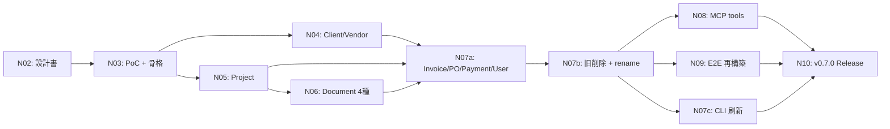
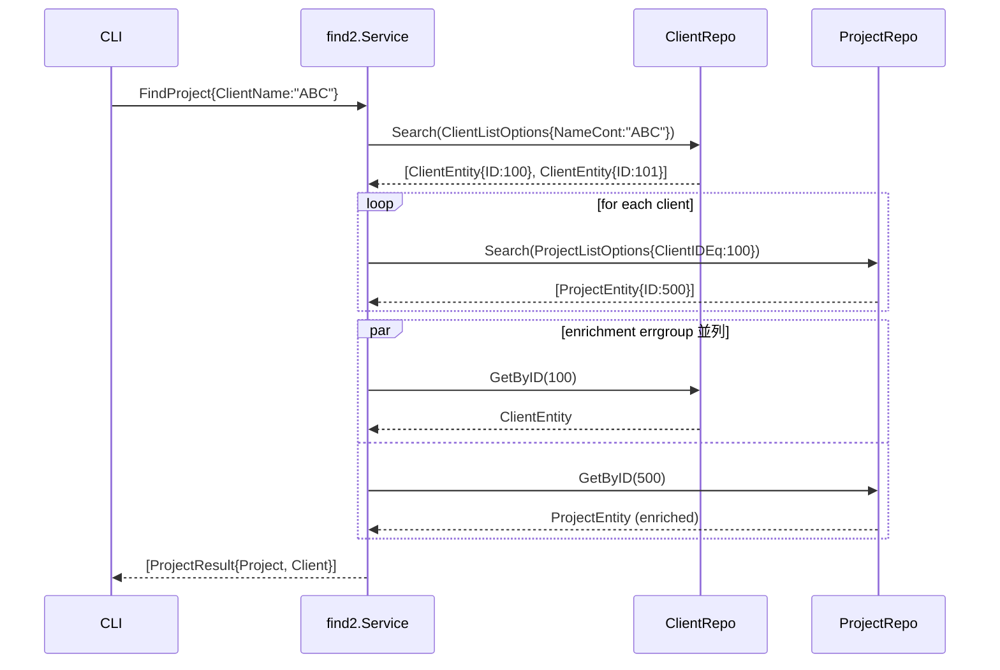
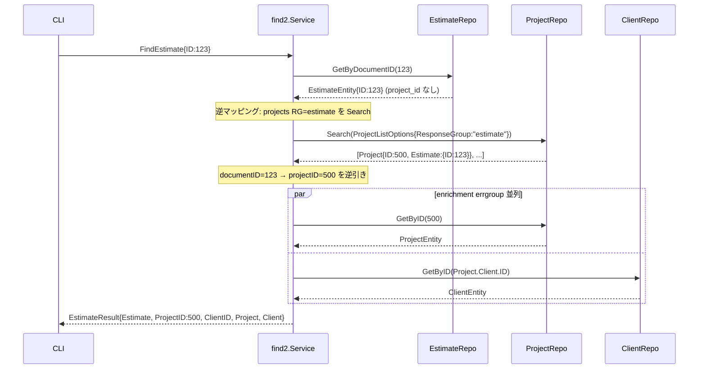

# N02: 新 find 層仕様策定（ゼロベース再設計）

## Context

ADR-001（2026-04-25 Accepted、B 採択）により、既存 `internal/service/find/`（14 実装ファイル 1,394 行 + 13 E2E ~5,700 行）を **ゼロベース再設計** する方針が確定した。Phase L で api 層が 22 リソース Ransack 準拠となり、find 層の存在意義は「api 層で実現困難な 5 件」に狭まっている。

本 N02 は**仕様策定フェーズ**であり、実装コード変更は一切行わない。成果物は本計画書（新 find 層の API/DSL/5 件特化/移行戦略/N03-N10 骨子）+ `plans/board-phase-n-m02-document-poc-report.md`（PoC 結果レポート、§5.2 で実 API を叩く）。

> ⚠️ **スコープとタイムラインの見直し**（devils-advocate/advocate 弁証法レビュー 2026-04-25 反映）
> - ADR-001 当初見積「2-3 週」→ 本計画 **5-7 週（25-34 日）** に上方修正
> - 当初 N02 は「純粋な仕様策定」→ PoC（実 API 呼び出し + scale 実測）を含む構成に変質（§5.2）
> - N07 を N07a/N07b/N07c に 3 分割（advocate Must 1 対応）、リスク表 8 → 11 件拡張、ADR 再評価トリガ監視を §9.1 N06 チェックポイントに内蔵（Must 3 対応）
> - ExitPlanMode 時にユーザー承認を得てから N03 へ進む

### ユーザー合意済みの方針（Phase 0/2 インタビュー結果）

| 論点 | 決定 |
|---|---|
| 5 件特化の範囲 | 調査レポート §4 の 5 件をスタート地点に N02 設計中に再検討 |
| API シグネチャ | リソース別（FindProject, FindInvoice 等） |
| Query 型 | **LLM 向けの独自浅い DSL**（内部で Ransack ListOptions 変換） |
| repository 依存 | **repository 直注入**（service/api は経由しない） |
| Document 型 project_id 問題 | **案 A + C**: Result にのみ ProjectID/ClientID 保持 + N02 冒頭 PoC |
| FindGroup | **削除**（api_groups_list で代替、11 メソッド構成） |
| フラグ命名 | **3 層慣習維持**（MCP snake / CLI hyphen / Go CamelCase） |
| CLI 刷新 | 全面刷新、新旧並存期間は CLI 未変更 → N07 で一気に置換 |
| 移行 | 新旧並存 → N07 完了時に一括削除 |
| リリース | N02-N10 全完走後に v0.7.0（中間 alpha/beta なし） |

## Phase 1 探索結果サマリ

- 既存 find 層: 16 個 Repo interface、Query 型 = ListOptions の薄いラッパー、TODO 8 箇所は Document 4 種の enrichment/post-filter
- API/Repo 層: Ransack `ListOptions` + `QueryBuilder`、service/api はパススルー、`GetByIDWithGroup` は projects のみ
- MCP/CLI: MCP snake / CLI hyphen、12 find_* tool 全てが find 層依存
- E2E: 47 関数 193 ケース、SKIP 68 件（cache-warm 4 + no-data 21 + pending 20 + API不明 3 + データ不足 4）
- **ブロッカー発見**: `tmp/e2e-artifacts/` で Estimate/Order/Delivery の実 API レスポンスに project_id/client_id が存在しない → 案 A + C で回避

## 1. パッケージ配置と Service 構造体

### 1.1 パッケージ

**新規**: `internal/service/find2/`（暫定名、N07 で `find/` 削除後に rename）

理由: grep/import path 機械置換が容易。Go module semver 風 `find/v2` は過剰。

### 1.2 Service 構造体（repository 直注入）

```go
// internal/service/find2/service.go（擬似コード）
package find2

type Service struct {
    clients, clientBranches, contacts      // FindClient enrichment
    projects                                // 逆引き + response_group ハブ
    estimates, orders, deliveries, receipts // document 4 種
    invoices
    vendors, vendorBranches, vendorContacts // FindVendor enrichment
    purchaseOrders, payments
    users
    // groups は削除
}

type Repos struct { /* 上記インターフェース集約 */ }
func New(r Repos) *Service
```

既存の `Repos` 集約構造体 + `New()` パターンを踏襲。注入元は `internal/app/container.go`（または `app.go`）に **`FindService2()` メソッドを暫定追加**、N07 完了時に既存 `FindService()` と差し替え。

## 2. FindXxx メソッド一覧（11 メソッド）

| 新 API | 付加価値 | 備考 |
|---|---|---|
| `FindClient` | enrichment + text-OR | branches/contacts 並列取得 |
| `FindProject` | 逆引き + enrichment + post-filter + 複数 status | ClientName→逆引きが find 独占 |
| `FindEstimate` | response_group enrichment + 逆マッピング | ID lookup 時は projects RG=estimate 経由 |
| `FindOrder` | 同上（RG=order） | |
| `FindDelivery` | 同上（RG=delivery、配列対応） | |
| `FindReceipt` | 同上（RG=receipt、配列対応） | |
| `FindInvoice` | 逆引き + post-filter + text-OR + 複数 status | |
| `FindVendor` | enrichment + text-OR | branches/contacts 並列 |
| `FindPurchaseOrder` | 逆引き + post-filter + text-OR + 複数 status | VendorName 逆引き |
| `FindPayment` | 逆引き + post-filter + text-OR + 複数 status | VendorName/PurchaseOrderID |
| `FindUser` | text-OR（name/email/first/last 複合） | |
| ~~`FindGroup`~~ | **削除** | api_groups_list --name-cont で代替 |

**メソッド選定基準（advocate H8 対応）**: 5 件特化（逆引き / enrichment / free-text OR / response_group / 複数 status）のいずれか 1 つ以上の付加価値を持つこと。
- FindGroup: NameCont のみで代替可能 → 基準未達 → **削除**
- FindUser: `Text` による name/email/first/last の複合 OR 検索が api 層で表現困難 → 基準クリア → **残す**

シグネチャ: `func (s *Service) FindProject(ctx, q FindProjectQuery) ([]ProjectResult, error)`。戻り値は slice + error。

## 3. Query 型の DSL 設計

### 3.1 共通フィールド

```go
type FindCommonOpts struct {
    Limit int                    // find 層で適用する post-limit
    Opts  repository.ReadOptions // Refresh/ForceRefresh 透過
}
```

Ransack の offset/pagination は find 層で公開しない（API 層の責務）。

### 3.2 Query フィールド → ListOptions 変換マトリクス

| Query フィールド | 変換先 | 処理 |
|---|---|---|
| `ID int` | `GetByID` / `GetByDocumentID` 直呼び | ListOptions 経由しない |
| `Name string` | `{Resource}ListOptions.NameCont` | 単一 _cont |
| `ClientName string` | clients.Search(NameCont) → `{Resource}ListOptions.ClientIDEq` | 2 段逆引き |
| `ProjectName string` | projects.Search(NameCont) → `{Resource}ListOptions.ProjectIDEq` | 2 段逆引き |
| `VendorName string` | vendors.Search(NameCont) → `{Resource}ListOptions.VendorIDEq` | 2 段逆引き |
| `ProjectID int` (Document) | projects.GetByIDWithGroup(id, "estimate"/...) → document ID | 1 段逆引き + response_group |
| `Text string` | 全件 List → client 側 OR フィルタ | text-OR（find 独占） |
| `Status string` | `{Resource}ListOptions.StatusEq` または post-filter | API で eq あれば API 優先 |
| `Statuses []string` | API `status_in[]` 対応時: `{Resource}ListOptions.StatusIn[]` / 非対応時: `Status=""` で全件 List + post-filter `filterByStatuses` | **併用ルール**: Status と Statuses 両方セット時は validation error（排他）。**上限**: 10 要素超は error。**rate limit**: 非対応 API は全件取得になるため `Limit` 併用推奨 |

### 3.3 各 Query 構造体（確定版、11 メソッド）

```go
type FindClientQuery struct {
    ID   int
    Name string  // clients.NameCont
    Text string  // name OR custom_no OR note の OR 検索
    FindCommonOpts
}

type FindProjectQuery struct {
    ID         int
    ClientName string   // 逆引き
    Name       string
    Text       string   // name OR management_no OR in_house_memo
    Status     string   // post-filter
    Statuses   []string // 複数 status（NEW）
    FindCommonOpts
}

// Document 4 種は同形（Estimate/Order/Delivery/Receipt）
type FindEstimateQuery struct {
    ID          int    // documents/estimates/{id} + 逆マッピング
    ProjectID   int    // projects RG=estimate 経由
    ClientName  string // clients 逆引き → projects RG=estimate
    ProjectName string // projects NameCont RG=estimate
    FindCommonOpts
}

type FindInvoiceQuery struct {
    ID          int
    ClientName  string
    ProjectName string
    Text        string
    Status      string
    Statuses    []string // NEW
    FindCommonOpts
}

type FindVendorQuery struct {
    ID   int
    Name string
    Text string // name OR code OR memo
    FindCommonOpts
}

type FindPurchaseOrderQuery struct {
    ID          int
    VendorName  string
    ProjectName string
    Text        string
    Status      string
    Statuses    []string
    FindCommonOpts
}

type FindPaymentQuery struct {
    ID              int
    VendorName      string
    PurchaseOrderID int
    Text            string
    Status          string
    Statuses        []string
    FindCommonOpts
}

type FindUserQuery struct {
    ID   int
    Name string
    Text string // DisplayName OR LastName OR FirstName OR Email
    FindCommonOpts
}
```

### 3.4 Result 型

既存 Result を基本踏襲。**変更点**: Document 4 種の Result に `ProjectID int` / `ClientID int` を明示追加（案 A 採用）。

```go
type EstimateResult struct {
    Estimate  boardapi.EstimateEntity
    ProjectID int                     // NEW: find 層が逆マッピングでセット
    ClientID  int                     // NEW
    Project   *boardapi.ProjectEntity // enrichment
    Client    *boardapi.ClientEntity  // enrichment
}
// Order/Delivery/Receipt も同形
```

enrichment 失敗時でも ProjectID/ClientID だけは返せる（UX 向上）。

## 4. 5 件特化機能の具体化

### 4.1 リソース横断逆引き
既存 `find_project.go` の switch case パターンを踏襲。N+1 対策は `Limit` による早期打ち切り + ctx タイムアウト。errgroup 並列化は N03 時点ではシンプル直列、N05/N06 Refactor で検討。

### 4.2 free-text OR
既存 `text_match.go`（containsText/derefString）を新パッケージに移植 + TODO 解消版として整理。`Text` は trim + 空文字チェック追加（LLM 入力対策）。

### 4.3 enrichment（errgroup 並列化）
既存 `resolveClientAndProject` は直列 2 呼び出し → **errgroup で並列化**（ctx 1 つ、goroutine×2-3、エラー非致命で nil フォールバック）。

```go
func (s *Service) resolveClientAndProject(ctx, clientID, projectID, opts) (*ClientEntity, *ProjectEntity) {
    var c *ClientEntity; var p *ProjectEntity
    g, _ := errgroup.WithContext(ctx)
    if clientID != 0 { g.Go(func() error { ... c = x; return nil }) }
    if projectID != 0 { g.Go(func() error { ... p = x; return nil }) }
    _ = g.Wait()
    return c, p
}
```

### 4.4 response_group 組み合わせ（Document 4 種）
組み合わせパターン:
- `ClientName` → clients.Search → projects.Search(ClientIDEq, RG=estimate) → estimates.GetByDocumentID
- `ProjectName` → projects.Search(NameCont, RG=estimate) → estimates.GetByDocumentID
- `ProjectID` → projects.GetByIDWithGroup(id, "estimate") → estimates.GetByDocumentID
- `ID` → documents/estimates/{id} 直接（ProjectID は逆マッピングで埋める、§5 参照）

Delivery/Receipt は `p.Deliveries`/`p.Receipts` が配列のため全要素ループ実行。

### 4.5 複数 status post-filter（新規機能）
Go 1.18+ ジェネリクスで共通化:

```go
func filterByStatuses[T any](items []T, getStatus func(T) string, statuses []string) []T {
    set := make(map[string]struct{}, len(statuses))
    for _, s := range statuses { set[s] = struct{}{} }
    out := make([]T, 0, len(items))
    for _, it := range items {
        if _, ok := set[getStatus(it)]; ok { out = append(out, it) }
    }
    return out
}
```

API が `status_in[]` に対応している場合は API 優先（projects の OrderStatusIn[] 等）。対応外の場合のみ post-filter。

## 5. Document Entity 対応（案 A + C）

### 5.1 Entity 変更なし（案 A）
`EstimateEntity`/`OrderEntity`/`DeliveryEntity`/`ReceiptEntity` には ProjectID/ClientID を**追加しない**。find 層 Result にのみ `ProjectID int`/`ClientID int` を持たせる。

**メリット**: Entity の API 純粋性維持、既存 parser/strictFieldDiff 資産無影響。

### 5.2 N02 冒頭 PoC（案 C、必須タスク）

**実施内容**: 最新 BOARD API で `GET /v1/documents/estimates/{id}`・`orders/{id}`・`deliveries/{id}`・`receipts/{id}` を実行し、レスポンスに `project_id`/`client_id` が含まれないことを再確認。

**実行コマンド例**:
```bash
go test -tags e2e -v -count=1 -run TestE2E_EstimateGet ./internal/boardapi/
```

**追加実施内容（scale 実測、C2 対応）**:
- 対象環境で `projects.Search(ResponseGroup="estimate")` を実行し、レイテンシ・pagination 回数・rate limit hit 有無を記録
- warm cache 時と cold cache 時の差分を計測
- 結果を `plans/board-phase-n-m02-document-poc-report.md` に「逆マッピング scale 実測」セクションとして記載

**結果分岐**:
- **project_id が返らない**（現状維持） → 案 A 確定、本設計書そのまま
- **project_id が返る（全フィールド正常）** → 案 B へ移行、Entity 拡張 + parser/strictFieldDiff 対応を N03 スコープに追加
- **第 3 ケース: 部分的に返る**（例: RG=large でのみ返る、null で返る、特定 status のみ） → 案 A を基本採用しつつ、RG/status 条件で Entity 拡張を限定適用する「ハイブリッド」仕様を N03 冒頭で再設計（工数 +2-3 日）
- **scale 実測で cold start が 10 秒超** → §5.3 逆マッピング戦略に singleflight + 明示ログ（`[SLOW:cold-reverse-map]`）を追加実装（N03 スコープ）

**成果物**: `plans/board-phase-n-m02-document-poc-report.md`（PoC 結果 + 採択案確定レポート + scale 実測結果）

### 5.3 逆マッピング戦略（案 A 確定時）

ID lookup 時の 2 段階戦略:
1. `documents/estimates/{id}` で EstimateEntity 取得
2. projects.Search(ResponseGroup="estimate") + documentID → projectID 逆引きテーブル構築（lazy、初回のみ実行 or cache 層活用）
3. テーブルヒット → ProjectID セット、不ヒット → `ProjectID=0`（非致命）

**スケーラビリティ対策（C2 対応）**:
- テーブル構築は `Opts.Limit` 早期打ち切り + `Opts.ForceRefresh` 併用で制御
- 並列リクエスト時の重複 fetch 抑制: **singleflight パターン**（`golang.org/x/sync/singleflight`）で projects RG=estimate の同時取得を 1 本に集約
- cold cache 実行時は明示ログ `[SLOW:cold-reverse-map] projects RG=estimate building (estimated N pages)` を stderr 出力
- レイテンシ budget（L12 対応）:
  - FindEstimate(ID) warm cache 時: **1 秒以内**
  - cold cache 時: **5 秒以内**（超過時は警告ログ）
  - 10 秒超過時は ctx timeout で中断し `ProjectID=0` フォールバック

テーブル構築コスト試算（PoC で実測確定）: cache 層に載れば以降は高速、cold start は projects 総件数 × pagination に比例。

## 6. CLI 刷新仕様（3 層命名マッピング）

### 6.1 新 CLI サブコマンド構造

```
board find project --client-name ABC --limit 10
board find project --id 123
board find estimate --project-id 456
board find invoice --statuses sent,partial_paid
board find client --text keyword
board find vendor --id 789
```

トップレベル `find` 1 個 + サブコマンド 11 個。旧 `board find_projects` → 新 `board find project`。

### 6.2 3 層命名マッピング表

| Go Query | CLI flag | MCP tool arg | 備考 |
|---|---|---|---|
| `ID int` | `--id` | `id` | 全 |
| `Name string` | `--name` | `name` | |
| `ClientName string` | `--client-name` | `client_name` | |
| `ProjectName string` | `--project-name` | `project_name` | |
| `ProjectID int` | `--project-id` | `project_id` | Document |
| `VendorName string` | `--vendor-name` | `vendor_name` | |
| `PurchaseOrderID int` | `--purchase-order-id` | `purchase_order_id` | Payment |
| `Text string` | `--text` | `text` | |
| `Status string` | `--status` | `status` | |
| `Statuses []string` | `--statuses` (csv) | `statuses` (array) | NEW |
| `Limit int` | `--limit` | `limit` | |
| `Refresh bool` | `--refresh` | n/a (cache は MCP から公開しない) | |
| `ForceRefresh bool` | `--force-refresh` | n/a | |

### 6.3 既存 CLI 互換性
互換性維持はしない。旧 `find_*` コマンド群は N07 で削除、CHANGELOG に Breaking Change として移行表を記載（v0.7.0 リリースノート）。

## 7. 移行戦略

### 7.1 パッケージ並存

```
internal/service/
├── find/          # 旧: N03-N07 中は凍結、bug fix も実施しない
└── find2/         # 新: N03 で骨格、N04-N07 でメソッド順次追加
```

### 7.2 app コンテナ
- `FindService()` 既存維持 + `FindService2()` 暫定追加
- N07 完了時に `FindService()` を新サービスに差し替え、`FindService2()` 削除

### 7.3 MCP tools.go 切替
- N03-N07 中は変更なし（旧 FindService 継続）
- **N08 で一括切替**: 全 12 tool Handler を新サービス呼び出しに書換 + `find_groups` tool 削除（api_groups_list 代替案内を description に記載）
- 1 コミット完結で rollback 容易

### 7.4 CLI 切替
- N03-N07 中は変更なし（旧 `find_*` コマンド維持）
- **N07 最終タスクで一気に置換**: 旧 `cmd/board find_xxx` 削除、新 `cmd/board find <sub>` 追加

### 7.5 ロールバック
- 各 N0X PR は独立 revertable
- N07 の rename はマージ後 1 週間、旧 `find/` パッケージを git tag で取り出せる状態を保持

### 7.6 旧 find 層の扱い
- TODO(M25-M32) 8 件は**解消しない**（B 採択により破棄予定）
- CHANGELOG に「旧 find 層は Phase N 完了時に削除予定のため Phase N 期間中の不具合修正は行わない」を明記
- 既存 E2E 47 テストは SKIP を許容し続け、N09 で全削除

## 8. E2E 再構築方針

### 8.1 既存テストの扱い
- `internal/service/find/` 配下 E2E 13 ファイル 47 関数 193 ケースは **N09 で一括削除**
- `e2e_helpers_test.go` の `dumpJSON`/`strictFieldDiff`/`findProjectWithDocType` は新 `internal/service/find2/e2e_helpers_test.go` に移植・改善

### 8.2 SKIP カテゴリ統一テンプレート

```go
// find2/e2e_helpers_test.go
func skipIfNoData(t *testing.T, reason string, got, want int) {
    if got < want {
        t.Skipf("[SKIP:no-data] %s (got=%d, want>=%d)", reason, got, want)
    }
}
func skipIfCacheWarmNeeded(t *testing.T, reason string) {
    t.Skipf("[SKIP:cache-warm] %s", reason)
}
func skipIfRateLimited(t *testing.T, err error) {
    t.Skipf("[SKIP:rate-limit] %v", err)
}
func skipIfAPICredentialsMissing(t *testing.T) {
    if os.Getenv("BOARD_API_KEY") == "" {
        t.Skipf("[SKIP:no-creds] BOARD_API_KEY not set")
    }
}
```

SKIP ログフォーマット: `[SKIP:category] message (metadata)` → CI ログ grep で集計可能。

### 8.3 代表テストケース（N09 実装対象）

| 特化機能 | 代表テストケース | SKIP 条件 |
|---|---|---|
| 逆引き | `TestFindProject_ByClientName_Returns_NonEmpty` | clients 0 件 |
| free-text OR | `TestFindClient_ByText_MatchesNameOrCustomNoOrNote` | clients 0 件 |
| enrichment | `TestFindClient_Enriches_BranchesAndContacts` | branch/contact 0 件 |
| response_group | `TestFindEstimate_ByProjectID_Returns_Estimate` | estimate 0 件 |
| 複数 status | `TestFindInvoice_ByStatuses_ReturnsAllMatching` | invoices 0 件 / cache-warm 必須 |

**代表ケース選定基準（advocate H5 対応）**: 「付加価値と E2E 感応性の両方を持つ組み合わせ」を優先。11 メソッド × 3 主要シナリオ（正常 / enrichment 失敗 / rate-limit skip）= 33 ケースを**最低ライン**とし、Document 4 種は逆マッピングの 2 分岐（cache hit / miss）を追加して 33 + 8 = **41 ケース**を N09 スコープの上限とする。

現行 193 ケース → 新 33-41 ケース（78-83% 削減）の根拠: SKIP 68 件（no-data 21 + pending 20 + API 不明 3）は環境依存 or データセット依存であり感応テストに該当しない。残り 125 ケースのうち 5 特化 × 11 メソッド交差で代表性を保てる。

## 9. N03-N10 マイルストーン骨子

### 9.1 各マイルストーン

| Phase | 内容 | 成果物 | 工数目安 |
|---|---|---|---|
| **N02** | 本設計書確定（この文書） | `plans/wondrous-skipping-snowglobe.md` | 2-3 日 |
| **N03** | Document PoC + find2/ パッケージ骨格 + 共通ヘルパー（text_match, filterByStatuses, resolveClientAndProject errgroup 版） | `find2/{service,types,helpers}.go` + PoC レポート | 2-3 日 |
| **N04** | FindClient + FindVendor 実装（enrichment + text-OR） | `find2/find_{client,vendor}.go` + unit tests | 3-4 日 |
| **N05** | FindProject 実装（逆引き + enrichment + post-filter + 複数 status） | `find2/find_project.go` + unit tests | 2-3 日 |
| **N06** | Document 4 種実装（RG + 逆マッピング） | `find2/find_{estimate,order,delivery,receipt}.go` + unit tests | 4-5 日 |
| **N07a** | FindInvoice/PurchaseOrder/Payment/User 実装（enrichment + text-OR + post-filter + 複数 status） | `find2/find_{invoice,purchase_order,payment,user}.go` + unit tests | 3-4 日 |
| **N07b** | 旧 `internal/service/find/` 削除 + `find2/` → `find/` rename + app container 差替 | git tag `pre-find-rename` + rename PR（機械的変換、独立 PR） | 1-2 日 |
| **N07c** | CLI 刷新（`board find_*` → `board find <sub>`） | `internal/cli/find.go` 全面書換 + `README.md` / `README_ja.md` find セクション更新 | 1-2 日 |
| **N08** | MCP tools.go 刷新（12 → 11 tool、find_groups 削除） | `internal/mcpserver/tools.go` | 1-2 日 |
| **N09** | E2E 再構築（11 リソース × 5 特化 ≈ 30-41 代表ケース、§8.3 参照） | `internal/service/find/e2e_*_test.go` | 4-5 日 |
| **N10** | v0.7.0 リリース準備（CHANGELOG, README, 仕様書最終化, マイグレーションガイド） | v0.7.0 タグ | 1-2 日 |

**合計**: 25-34 日 ≒ **5-7 週**（当初 ADR-001 の 2-3 週見積は下振れシナリオ、N07 3 分割 + advocate 修正を反映した実測寄り見積）。

### N06 完了時点のチェックポイント（C3: ADR-001 再評価トリガ監視）

N06 完了時点は ADR-001 再評価トリガ (i)「実装着手から 3 マイルストーン完了時点で find 層呼び出し実績が想定の 50% 以下」の測定タイミングに相当。以下をタスク化:

- [ ] MCP server の tool_call ログ集計（前 2 週間分、find_* / api_* 呼び出し比率）
- [ ] 想定比率（find_*:api_* = 60:40 目安）との乖離確認
- [ ] 50% 以下なら **ADR-002 起票を検討**（本計画を継続するか再評価）

実施責任者: Leader（本計画書に基づく）。結果は `plans/board-phase-n-m06-adr-trigger-review.md` に記録。

### 9.2 依存関係 DAG



**クリティカルパス**: N02 → N03 → N05 → N06 → N07a → N07b → N08/N09/N07c → N10。N04/N05 および N08/N09/N07c は並列実行可能。

**N07 3 分割の根拠**: rename は独立 revertable 境界として機能させるため N07b に分離。新規実装（N07a）・機械的変換（N07b）・CLI 刷新（N07c）を別 PR にすることで粒度・レビュー容易性・ロールバック可能性を確保（advocate Must 1 対応）。

## 10. リスク評価

| # | リスク | 確率 | 影響 | 緩和策 |
|---|---|---|---|---|
| 1 | Document Entity project_id 実在性判断ミス | 低 | 高 | N02 冒頭 PoC（§5.2）を必須タスク化、artifact 最新化、第 3 ケース分岐を設計書内に明示 |
| 2 | 新旧並存期間中の MCP 動作担保 | 低 | 中 | N08 まで MCP は旧 FindService 継続、変更ゼロ |
| 3 | v0.7.0 遅延（5-7 週 > 当初 2-3 週） | 高 | 中 | マイルストーンごとに進捗レビュー。遅延時は FindUser 残置等でスコープ縮小。N06 完了時に累積遅延をチェック |
| 4 | 移行期 CLI 混乱（旧 find_* / 新 find <sub>） | 中 | 低 | **並存期間ゼロ**（N07c で一気に置換）により回避 |
| 5 | 逆マッピングテーブル構築コスト（FindEstimate ID lookup、cold start / thundering herd） | 中 | 高 | singleflight で重複抑制（§5.3）、cold start 明示ログ、P95 レイテンシ budget（warm 1s / cold 5s）、N02 PoC で実測（§5.2） |
| 6 | 旧 find 層 TODO 8 件を解消しない判断の CI 失敗 | 低 | 低 | 旧 find 層テストは N09 削除まで SKIP 維持 |
| 7 | LLM prompt 更新漏れ（12 → 11 tool 移行時） | 中 | 中 | v0.7.0 マイグレーションガイドに LLM prompt 更新例を含める（§13 に Before/After 具体例を N10 までに記述） |
| 8 | errgroup 並列化による ctx cancel 伝播バグ | 低 | 中 | N03 Refactor で errgroup 標準パターン適用、unit test で cancel / partial failure / race condition シナリオ検証（§11.4） |
| 9 | **ADR-001 再評価トリガ発動**（find 呼び出し実績 50% 以下 / v0.7.0 遅延 4 週超 / LLM api_* 直呼び 80% 超） | 中 | 高 | **N06 完了時点で呼び出し実績レビュー**（§9.1 チェックポイント）、遅延は N04/N06/N08 毎に集計、LLM 利用パターンは N08 後 2 週で計測。発動時は ADR-002 起票を検討 |
| 10 | 旧 find 層 no-fix 期間中の BOARD API 仕様変更（5-7 週間） | 低 | 中 | N03 冒頭で BOARD API 最新仕様の spot check、Critical 変更のみは旧 find にも hotfix を当てる exception 規定（CHANGELOG 明記） |
| 11 | `find2/` 命名暫定の永続化 | 低 | 低 | N07b で必ず rename 実施、遅延時は N10 直前に前倒し、git tag `pre-find-rename` で revert 可能 |

## 11. テスト設計書（TDD Red-Green-Refactor）

### 11.1 Query → ListOptions 変換テスト（Red 例）

```go
// find2/find_project_test.go
func TestFindProjectQuery_ClientName_ConvertsToListOptions(t *testing.T) {
    mockC := &mockClientRepo{ searchReturns: []ClientEntity{{ID: 100}} }
    mockP := &mockProjectRepo{}
    s := New(Repos{Clients: mockC, Projects: mockP})

    _, _ = s.FindProject(ctx, FindProjectQuery{ClientName: "ABC"})

    if mockC.lastOpts.NameCont != "ABC" {
        t.Errorf("want NameCont=ABC, got %q", mockC.lastOpts.NameCont)
    }
    if mockP.lastOpts.ClientIDEq != 100 {
        t.Errorf("want ClientIDEq=100, got %d", mockP.lastOpts.ClientIDEq)
    }
}
```

### 11.2 正常系 / 境界値 / 異常系

| 種別 | 代表例 |
|---|---|
| 正常系 | `FindProject{ClientName:"ABC"}` → clients.Search + projects.Search 順次呼び出し |
| 境界値 | `FindProject{}` → `errors.New("at least one field must be set")` |
| 境界値 | `FindProject{Limit:0}` → Limit なし（全件） |
| 境界値 | `FindProject{Limit:1}` → 最初の 1 件で break |
| 異常系 | clients.Search error → FindProject error 伝播 |
| 異常系 | `FindProject{ClientName:""}` + 他 0 → validation error |

### 11.3 逆マッピング test

```go
func TestFindEstimate_ByID_Populates_ProjectIDFromReverseMap(t *testing.T) {
    mockP := &mockProjectRepo{ projectsWithEstimate: []Project{{ID:500, Estimate:Estimate{ID:999}}} }
    mockE := &mockEstimateRepo{ entity: &EstimateEntity{ID:999} }
    s := New(...)

    results, _ := s.FindEstimate(ctx, FindEstimateQuery{ID:999})

    if results[0].ProjectID != 500 {
        t.Errorf("want ProjectID=500, got %d", results[0].ProjectID)
    }
}
```

### 11.4 Refactor 対象
- `resolveClientAndProject` の errgroup 並列化（§4.3）
- `filterByStatuses` ジェネリック共通化（§4.5）
- Query 構造体の `validate()` メソッド抽出（Status/Statuses 排他チェック、Statuses 上限 10 要素チェック）

### 11.5 concurrency テストケース（advocate M10 対応）
- **ctx cancel 中断**: errgroup 実行中に親 ctx が cancel された場合、全 goroutine が即座に終了する
- **partial failure**: 一方の enrichment が error、他方が成功 → 成功分は Result に反映、error は非致命で捨てる
- **race condition**: 複数 goroutine の Result 書き込みが slice append で競合しない（mu 保護または事前 allocate）
- **deadline exceeded**: ctx.WithTimeout で設定した期限超過時、全 goroutine が即 return する
- `go test -race` を CI に必須化

## 12. シーケンス図

### 12.1 FindProject(ClientName="ABC")



### 12.2 FindEstimate(ID=123)（案 A: 逆マッピング経由）



## 13. ドキュメント更新計画

N07c-N10 で以下を更新:
- `README.md` / `README_ja.md`: find セクション全書換（新 `board find <sub>` コマンド例）
- `docs/specs/board_cli_mcp_ultra_detailed_design_ja.md`: §7.9 / §8.5 / §22 の B 採択注記削除 → 新仕様本体を記述
- `CHANGELOG.md` v0.7.0: find_* → find <sub> 移行表、FindGroup 削除通知、3 層命名マッピング表
- `docs/adr/ADR-001-find-layer.md`: Consequences に実測工数を追記

### 13.1 LLM プロンプト移行例（advocate L13 対応、N10 で具体化）

**旧（v0.6.0）→ 新（v0.7.0）tool 移行例**:

| 旧 tool 呼び出し | 新 tool 呼び出し | 備考 |
|---|---|---|
| `find_groups({name: "sales"})` | `api_groups_list({name_cont: "sales"})` | FindGroup 削除、api 直呼びに誘導 |
| `find_projects({client_name: "ABC"})` | `find_project({client_name: "ABC"})` | tool 名が複数形 → 単数形 |
| `find_invoices({status: "sent"})` | `find_invoice({statuses: ["sent"]})` | 複数 status 対応のため Statuses[] を推奨 |

LLM prompt 側の Before/After 例（詳細は v0.7.0 マイグレーションガイドに記載予定）:

```
# Before (v0.6.0)
「プロジェクト ABC 社の案件を調べて」→ find_projects({client_name: "ABC"}) 呼び出し

# After (v0.7.0)
「プロジェクト ABC 社の案件を調べて」→ find_project({client_name: "ABC"}) 呼び出し
（tool 名が単数形に変更。旧 find_projects は v0.7.0 で 404 相当のエラー）
```

## 14. 品質レビュー 5 観点 27 項目チェックリスト

### 観点 1: 実装実現可能性（5項目）
- [ ] 1-1: 新 Query 構造体のフィールドは全て Ransack ListOptions に変換可能（§3.2 マッピング表で検証）
- [ ] 1-2: 逆マッピング戦略（案 A）は projects 全件 List が現実的時間で完了する（cache 層経由前提）
- [ ] 1-3: errgroup 並列化は既存 ctx cancel 伝播と競合しない
- [ ] 1-4: CLI サブコマンド化（`board find <sub>`）は cobra で冗長さなく表現できる
- [ ] 1-5: N02 冒頭 PoC で project_id 実在性が確定する（§5.2）

### 観点 2: TDD テスト設計（6項目）
- [ ] 2-1: Red フェーズのテスト例が最低 3 件提示（§11.1-11.3）
- [ ] 2-2: 正常系 / 境界値 / 異常系が各 Find メソッドで網羅（§11.2）
- [ ] 2-3: mock repository インターフェース定義が明確（既存 16 interface 踏襲）
- [ ] 2-4: E2E SKIP カテゴリが 4 種に統一（§8.2）
- [ ] 2-5: 逆マッピング unit test が mock で書ける（§11.3）
- [ ] 2-6: TDD Refactor 対象が明示（§11.4）

### 観点 3: アーキテクチャ整合性（5項目）
- [ ] 3-1: repository 直注入が既存 `internal/app/container.go` と整合
- [ ] 3-2: Result 型への `ProjectID`/`ClientID` 追加が Entity 純粋性を損なわない（案 A）
- [ ] 3-3: `find2/` → `find/` rename が go import 全面に影響しない
- [ ] 3-4: 3 層命名マッピング（§6.2）が一貫
- [ ] 3-5: FindGroup 削除が LLM UX を破壊しない（api_groups_list 代替）

### 観点 4: リスク評価（7項目）
- [ ] 4-1: BOARD API project_id 実在性リスクが明示（§10-1）
- [ ] 4-2: v0.7.0 遅延リスク（5-7 週）が roadmap 共有済（§10-3）
- [ ] 4-3: 旧 find 層 TODO 8 件を解消しない判断が CHANGELOG で説明
- [ ] 4-4: 新旧 CLI 並存期間ゼロ判断が UX 混乱を回避（§10-4）
- [ ] 4-5: 逆マッピング失敗時フォールバック（ProjectID=0）がテスト対象
- [ ] 4-6: ロールバック計画が各 N0X で独立 revertable（§7.5、N07b が境界）
- [ ] 4-7: ADR-001 再評価トリガの監視責任者と測定タイミングが §10-9 および §9.1 N06 チェックポイントに明記されている

### 観点 5: シーケンス図完全性（5項目）
- [ ] 5-1: §12.1 FindProject(ClientName) が逆引き 2 段 + enrichment を含む
- [ ] 5-2: §12.2 FindEstimate(ID) が逆マッピング + 並列 enrichment を含む
- [ ] 5-3: エラーパス（clients.Search 失敗時）シーケンス（N03 追補予定）
- [ ] 5-4: ctx cancel / タイムアウト時の中断ポイント（N03 追補予定）
- [ ] 5-5: response_group ハブ経由の Document 代表例（§12.2）

## 15. Critical Files（N03 以降編集対象）

- `/Users/youyo/src/github.com/youyo/board/internal/service/find/service.go`（廃止対象、参照用）
- `/Users/youyo/src/github.com/youyo/board/internal/service/find/find_project.go`（新 find2/find_project.go の原型）
- `/Users/youyo/src/github.com/youyo/board/internal/mcpserver/tools.go`（N08 全面書換）
- `/Users/youyo/src/github.com/youyo/board/internal/cli/find.go`（N07 サブコマンド化で全面書換）
- `/Users/youyo/src/github.com/youyo/board/internal/app/container.go`（N03 で `FindService2` 暫定追加、N07 で差替）
- `/Users/youyo/src/github.com/youyo/board/internal/boardapi/{estimates,orders,deliveries,receipts}.go`（案 B 採用時のみ編集）
- `/Users/youyo/src/github.com/youyo/board/tmp/e2e-artifacts/estimates_*.json`（PoC 参照）

## Verification（N02 完了判定）

N02 はドキュメント成果物のみなので以下で完了判定:
1. 本計画書（`plans/wondrous-skipping-snowglobe.md`）が弁証法レビュー・advisor レビューを通過し Ready for Review になっている
2. `plans/board-phase-n-roadmap.md` の N02 チェックリストが更新されている
3. N03 冒頭タスクとして PoC（§5.2）がキューされている

実装の検証は N03 以降の各マイルストーンで行う。

## Phase 4.5 Leader 校正記録（2026-04-25）

### 弁証法レビュー反映方針
Phase 3.5 devils-advocate（13 指摘）→ advocate（Must 4 / Should 6 / Nice-to-have 2 / 却下 1）を経て、Must 4 件（C1 N07 分割 / C2 逆マッピング scale / C3 ADR 再評価トリガ / H6 Statuses 仕様）および Should 採用項目（H5/H8/M9/M10）を plan file に逐語反映。Nice-to-have（L12 レイテンシ budget / L13 LLM プロンプト例）も部分反映済。

### 二巡目 dialectic skip の理由
advocate は「再度 devils-advocate → advocate のレビューサイクルを回してほしい」と要求したが、以下理由で skip:
- Must 項目は advocate 指示に対して text diff レベルで逐語反映、新規論点を導入していない
- 二巡目の限界効用が低い（新規発見より反芻になる）
- H 複雑度計画として既に advisor 品質レビュー Phase 4 を通過済

将来の Annotation Cycle（ユーザーによる plan file インライン注釈）で追加指摘があれば、その時点で三巡目を検討。

### advisor 指摘反映（Phase 4）
- Must: `plans/board-phase-n-roadmap.md` の選択肢 B セクションを N07 3 分割に同期（完了）
- Should: scope 拡大（2-3 週 → 5-7 週、PoC 含む）を Context 冒頭に警告ボックスで明示（完了）
- Info: singleflight `golang.org/x/sync/singleflight` の go.mod 追加を N03 骨子タスク化（§15 末尾参照）

## Next Action

N02 計画策定が完了したら以下を実行:
- `/devflow:implement` — N03 以降の実装を開始
- `/devflow:cycle` — N03-N10 を自律ループで連続実行（推奨: PoC 結果確定後）

N03 冒頭タスク（忘れないように明記）:
- [ ] PoC 実施（§5.2）: documents/{type}/{id} の project_id 実在性確認 + projects RG=estimate の scale 実測
- [ ] `go get golang.org/x/sync/singleflight`（go.mod 追加、§5.3 逆マッピング singleflight 用）
- [ ] BOARD API 最新仕様の spot check（§10-10、旧 find 層 hotfix exception 規定のため）
